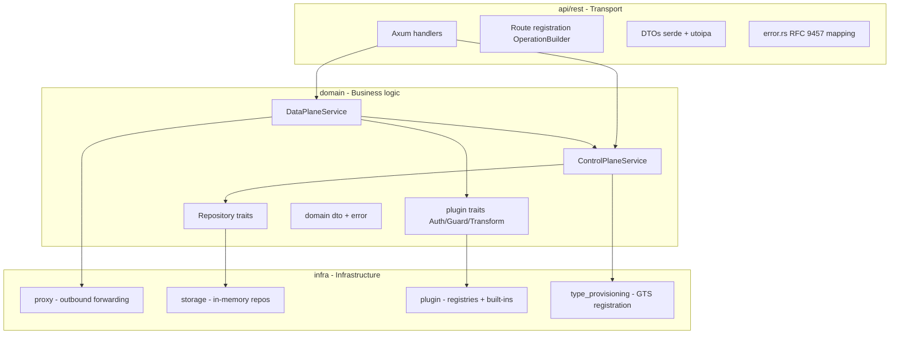
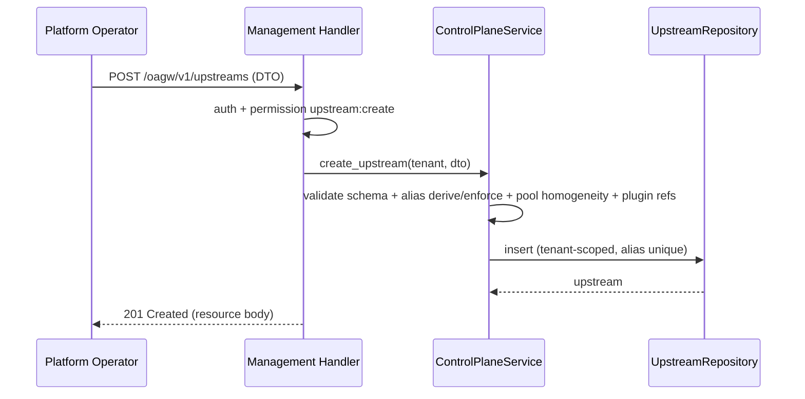
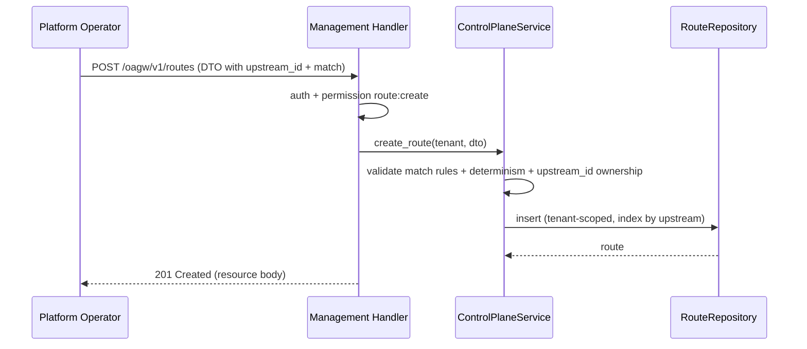
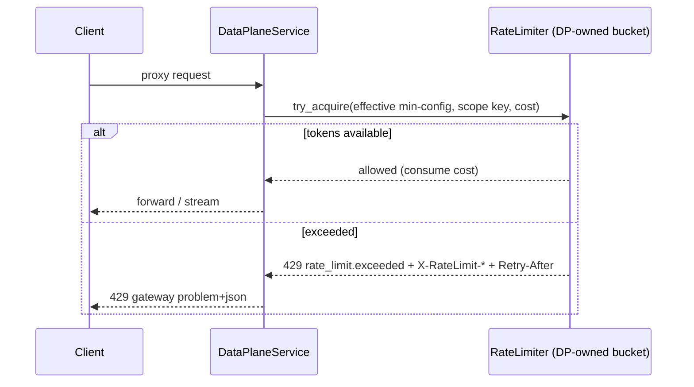
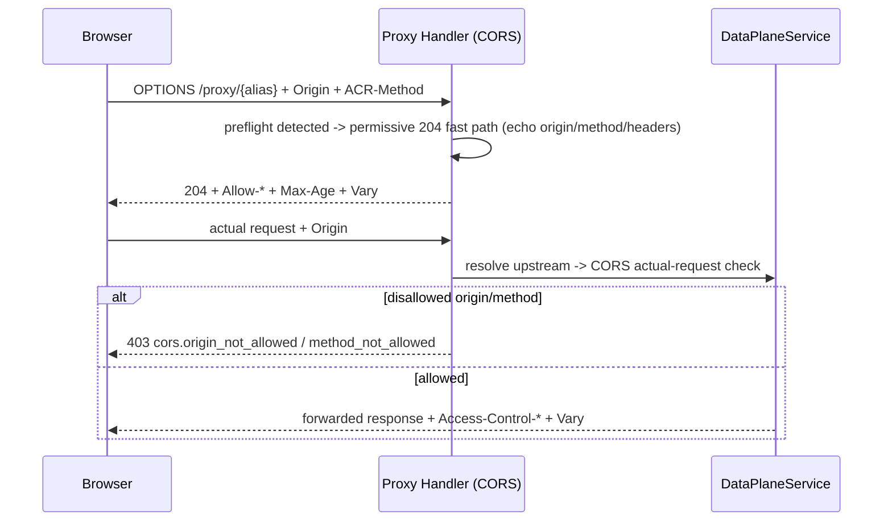
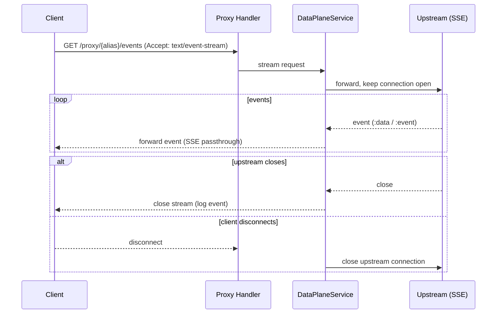

# Technical Design — OAGW Gear (cf-gears-oagw)


<!-- toc -->

- [1. Architecture Overview](#1-architecture-overview)
  - [1.1 Architectural Vision](#11-architectural-vision)
  - [1.2 Architecture Drivers](#12-architecture-drivers)
  - [1.3 Architecture Layers](#13-architecture-layers)
- [2. Principles & Constraints](#2-principles--constraints)
  - [2.1 Design Principles](#21-design-principles)
  - [2.2 Constraints](#22-constraints)
- [3. Technical Architecture](#3-technical-architecture)
  - [3.1 Domain Model](#31-domain-model)
  - [3.2 Component Model](#32-component-model)
  - [3.3 API Contracts](#33-api-contracts)
  - [3.4 Internal Dependencies](#34-internal-dependencies)
  - [3.5 External Dependencies](#35-external-dependencies)
  - [3.6 Interactions & Sequences](#36-interactions--sequences)
  - [3.7 Database Schemas & Tables](#37-database-schemas--tables)
  - [3.8 Deployment Topology](#38-deployment-topology)
- [4. Additional Context](#4-additional-context)
  - [Observability, Metrics, and Audit (per docs PRD metrics)](#observability-metrics-and-audit-per-docs-prd-metrics)
  - [Security Considerations](#security-considerations)
  - [Capacity and Cost](#capacity-and-cost)
  - [Testing Strategy](#testing-strategy)
  - [Out of Scope / Future Work](#out-of-scope--future-work)
- [5. Traceability](#5-traceability)

<!-- /toc -->

- [ ] `p3` - **ID**: `cpt-cf-oagw-design-gear`
## 1. Architecture Overview

### 1.1 Architectural Vision

This document is the implementation DESIGN for the `oagw` gear (crate `cf-gears-oagw`) located at `/app/gears/system/oagw/oagw`. It operationalizes the gear's accepted specification — the gear-level `docs/PRD.md`, `docs/DESIGN.md`, the accepted behavioral ADRs `docs/ADR/0001-request-routing.md` .. `0009-required-headers-guard-plugin.md`, and the JSON Schemas `docs/schemas/upstream.v1.schema.json` / `route.v1.schema.json` — for this repository, and incorporates the decisions recorded in the pipeline ADRs `artifacts/ADR/0001-oagw-gear-architecture.md`, `artifacts/ADR/0002-proxy-data-plane.md`, and `artifacts/ADR/0003-plugins-rate-limit-cors.md`. It does NOT replace the gear's accepted docs; it specifies how that contract is realized in `cf-gears-oagw` with the constraints of this workspace.

The gear is a standard Constructor Fabric `toolkit::gear` REST component (`capabilities = [rest]`) hosted on the `api-gateway` surface. It implements a **Control Plane / Data Plane** separation inside a single crate using DDD-Light layering (`api -> domain <- infra`; the domain layer has no infrastructure dependencies). The Control Plane manages tenant-scoped upstream, route, and plugin configuration held in **in-memory repositories** behind domain repository traits (pipeline ADR-0001). The Data Plane is **request-driven**: an in-crate axum proxy handler invokes the data-plane service directly per request, resolves the target via the Control Plane, executes the plugin chain, enforces rate limits and CORS, and forwards the request outbound with the declared hyper/hyper-util/toolkit-http stack (pipeline ADR-0002). All REQUIRED plugin, rate-limit, and CORS behavior ships in-process as native Rust (pipeline ADR-0003); Redis sync and Starlark custom-plugin execution are explicitly deferred.

The design preserves the accepted error contract: every response carries `X-OAGW-Error-Source: gateway|upstream`, and every gateway error is an RFC 9457 `application/problem+json` document carrying a GTS type identifier. It satisfies the workspace constraints: no dependency outside the lockfile, single-executable deployment, and build/run under the e2e feature set with config read from the `oagw` section (`config/e2e-local.yaml`: `proxy_timeout_secs: 2`, `allow_http_upstream: true`, `ssrf_policy.enabled: false`).

### 1.2 Architecture Drivers

Requirements that significantly influence architecture decisions.

**ADRs**:
- `cpt-cf-oagw-adr-gear-architecture` — standard `toolkit::gear` REST component; in-memory tenant-scoped control-plane repos behind domain traits
- `cpt-cf-oagw-adr-proxy-data-plane` — in-crate axum proxy handler; hyper/hyper-util/toolkit-http outbound forwarding; gateway error semantics
- `cpt-cf-oagw-adr-plugins-rate-limit-cors` — Rust trait plugin registries + built-ins; DP-owned per-instance token buckets; built-in CORS handler
- `cpt-cf-oagw-adr-request-routing`, `cpt-cf-oagw-adr-plugin-system`, `cpt-cf-oagw-adr-rate-limiting`, `cpt-cf-oagw-adr-cors`, `cpt-cf-oagw-adr-data-plane-caching`, `cpt-cf-oagw-adr-state-management`, `cpt-cf-oagw-adr-error-source-distinction`, `cpt-cf-oagw-adr-oauth2-client-credentials-auth-plugin`, `cpt-cf-oagw-adr-required-headers-guard-plugin` (gear-level accepted behavioral records this design implements)

#### Functional Drivers

| Requirement | Design Response |
|-------------|------------------|
| `cpt-cf-oagw-fr-gear-registration` | `#[toolkit::gear(name = "oagw", capabilities = [rest], deps = [...])]` registering management and proxy routes on the host router under `/oagw/v1`; config loaded from the `oagw` section via `ctx.config_or_default()`. |
| `cpt-cf-oagw-fr-upstream-mgmt`, `cpt-cf-oagw-fr-enable-disable`, `cpt-cf-oagw-fr-upstream-pooling` | ControlPlaneService CRUD over tenant-scoped in-memory `UpstreamRepository` with alias derivation/enforcement, pool homogeneity validation, and enabled-inheritance semantics. |
| `cpt-cf-oagw-fr-route-mgmt` | ControlPlaneService route CRUD with match-rule determinism validation and immutable `upstream_id`. |
| `cpt-cf-oagw-fr-plugin-system`, `cpt-cf-oagw-fr-builtin-plugins`, `cpt-cf-oagw-fr-plugin-lifecycle`, `cpt-cf-oagw-fr-plugin-source`, `cpt-cf-oagw-fr-required-headers-guard` | Auth/Guard/Transform trait registries with deterministic execution order; built-ins (noop, apikey, oauth2 form+basic, required_headers, request_id); immutable custom plugins with in-use protection and source retrieval. |
| `cpt-cf-oagw-fr-request-proxy`, `cpt-cf-oagw-fr-alias-resolution`, `cpt-cf-oagw-fr-route-matching`, `cpt-cf-oagw-fr-target-host` | DataPlaneService: alias resolution with shadowing, `(upstream, method, longest path prefix, priority)` matching, and the `X-OAGW-Target-Host` behavior matrix. |
| `cpt-cf-oagw-fr-header-transform`, `cpt-cf-oagw-fr-passthrough`, `cpt-cf-oagw-fr-body-size` | Header categories (routing / hop-by-hop / passthrough), host replacement, and body validation (CL match, 100 MB ceiling, transfer-encoding) before forwarding. |
| `cpt-cf-oagw-fr-streaming` | SSE passthrough with connection lifecycle; WebSocket/WebTransport documented as future work. |
| `cpt-cf-oagw-fr-circuit-breaker`, `cpt-cf-oagw-fr-timeout` | Per-upstream circuit breaker as core policy (503 `circuit_breaker.open`) and timeouts (`proxy_timeout_secs`) mapped to 504 `timeout.*`. |
| `cpt-cf-oagw-fr-auth-injection`, `cpt-cf-oagw-fr-oauth2-token-cache` | Auth plugins resolve `cred://` references via `cred_store` at request time; OAuth2 CC token cache (`pingora-memory-cache`) with `(tenant, subject, auth_method, config-hash)` keys. |
| `cpt-cf-oagw-fr-rate-limiting` | DP-owned per-instance dual-rate token buckets with hierarchical `min()` merge and 429 + `X-RateLimit-*` + `Retry-After`. |
| `cpt-cf-oagw-fr-cors` | Built-in CORS handler: permissive preflight 204 fast path, actual-request origin/method 403, credentials+wildcard rejected at config time. |
| `cpt-cf-oagw-fr-error-codes`, `cpt-cf-oagw-fr-error-source-distinction` | Single RFC 9457 error model with GTS type identifiers and `X-OAGW-Error-Source` on every response. |
| `cpt-cf-oagw-fr-config-layering`, `cpt-cf-oagw-fr-hierarchical-config` | Upstream < Route < Tenant merge priority with sharing modes (`private`/`inherit`/`enforce`) and per-field merge rules. |

#### NFR Allocation

| NFR ID | NFR Summary | Allocated To | Design Response | Verification Approach |
|--------|-------------|--------------|-----------------|----------------------|
| `cpt-cf-oagw-nfr-testability` | >=90% automated coverage | Entire gear | In-crate domain unit tests + crate-root integration tests with `httpmock`, in-process repos/registries make behavior deterministic to test | Acceptance suite at `testing/e2e/gears/oagw`; coverage gate in CI |
| `cpt-cf-oagw-nfr-build-constraints` | No new deps; builds under e2e feature set | `Cargo.toml` | Design consumes only declared deps (`axum`, `hyper*`, `tokio*`, `dashmap`, `parking_lot`, `arc-swap`, `pingora-memory-cache`, `toolkit*`, SDK crates) | `cargo build` under e2e features; lockfile diff check |
| `cpt-cf-oagw-nfr-low-latency` | <10 ms added p95 latency | Data plane hot path | Request-driven in-crate path, in-memory rate limiters, cached OAuth2 tokens, lock-free `arc-swap` config snapshots | Latency benchmark in e2e suite |
| `cpt-cf-oagw-nfr-high-availability` | 99.9% availability; breaker trips within 5 failures/30s | DataPlaneService circuit breaker | Per-upstream breaker as core policy at the upstream-call seam; 503 `circuit_breaker.open` on open state | e2e fault-injection tests |
| `cpt-cf-oagw-nfr-ssrf-protection` | Zero SSRF in audit | DataPlaneService + `infra/proxy` | Path/query validation against route config, internal-header stripping, scheme allowlist (HTTPS default; HTTP only under `allow_http_upstream`), SSRF policy hook (`ssrf_policy.enabled`) | Security review + e2e negative tests |
| `cpt-cf-oagw-nfr-credential-isolation` | Zero credential exposure | Auth plugins + `cred_store` | Credentials referenced as `cred://` URIs, resolved at request time; tokens cached as `SecretString`; no secrets in logs/errors | Code review + e2e log assertions |
| `cpt-cf-oagw-nfr-input-validation` | Reject malformed before side effects | Handlers + DP body/header validation | DTO validation aligned to JSON Schemas; CL/100MB/transfer-encoding checks before forwarding | Integration tests for each rejection path |
| `cpt-cf-oagw-nfr-observability` | Correlation ID + metrics | Host middleware + `infra/proxy` metrics counters | OpenTelemetry spans/counters per docs PRD metrics section; request correlation via `request_id` | Metrics assertions in integration tests |
| `cpt-cf-oagw-nfr-multi-tenancy` | Zero cross-tenant access | In-memory repositories | Tenant scoping enforced at the repository boundary; ancestor resources invisible via management API | Unit/integration tenant-isolation tests |
| `cpt-cf-oagw-nfr-starlark-sandbox` | Sandbox for custom plugins | `infra/plugin` (custom execution) | Deferred per pipeline ADR-0003: custom plugin execution not in MVP; lifecycle CRUD only. Explicitly NOT applicable in the MVP | N/A in MVP; tracked as future work |

### 1.3 Architecture Layers



- [ ] `p3` - **ID**: `cpt-cf-oagw-tech-layers`

| Layer | Responsibility | Technology |
|-------|---------------|------------|
| Transport (`api/rest/`) | HTTP handling, auth context extraction, DTO validation, error serialization | axum, `OperationBuilder`/`OpenApiRegistry`, `toolkit-canonical-errors`, `toolkit-security` |
| Application (wire-to-domain) | Management handlers call `ControlPlaneService`; proxy handler calls `DataPlaneService`; permission checks via `authz-resolver` | Rust async, handler functions in `api/rest/handlers/` |
| Domain (`domain/`) | CRUD business logic, alias derivation/enforcement, route matching, plugin-chain orchestration, effective-config merge, `DomainError` | Native Rust, `async-trait`, DDD-Light traits |
| Infrastructure (`infra/`) | In-memory repository impls, outbound HTTP forwarding, plugin registries/built-ins, rate limiters, circuit breaker, GTS type provisioning | DashMap, parking_lot, arc-swap, hyper/hyper-util, toolkit-http, pingora-memory-cache, toolkit-gts |

- [ ] `p3` - **ID**: `cpt-cf-oagw-tech-dependencies`

| Technology | Purpose |
|-----------|---------|
| Rust / axum / tokio | HTTP transport, async runtime, host router integration |
| hyper / hyper-util / toolkit-http | Outbound upstream forwarding, streaming bodies |
| DashMap / parking_lot / arc-swap | Concurrency for in-memory control-plane state and lock-free hot-path snapshots |
| pingora-memory-cache | OAuth2 CC token cache (ADR-0008) |
| toolkit-canonical-errors / toolkit-gts | RFC 9457 problem+json + GTS identifiers |
| toolkit / toolkit-security / toolkit-auth | Gear registration, config loading, SecurityContext, OAuth2 `fetch_token` |
| types-registry / cred-store / tenant-resolver / authz-resolver SDKs | In-process platform service integration |

## 2. Principles & Constraints

### 2.1 Design Principles

#### Control/Data Plane Separation

- [ ] `p2` - **ID**: `cpt-cf-oagw-principle-cp-dp-separation`

The gear is split into a Control Plane that owns configuration state (upstreams, routes, plugins, type provisioning) and a Data Plane that orchestrates proxy execution. The Data Plane depends on the Control Plane for resolution only; management operations never traverse the Data Plane and proxy operations are served request-driven with no background task (pipeline ADR-0001 rejects a stateful lifecycle gear with a background data-plane task).

**ADRs**: `cpt-cf-oagw-adr-gear-architecture`, `cpt-cf-oagw-adr-request-routing`

#### Hot Path Stays In-Process and In-Memory

- [ ] `p2` - **ID**: `cpt-cf-oagw-principle-hot-path-in-memory`

Rate-limit counters, token caches, alias/route lookups, and effective-config snapshots live in the Data Plane's process memory. Locks are avoided on the hot path (lock-free reads via `arc-swap`; contended state confined to small, well-defined mutex/DashMap regions). Remote round-trips (Redis, DB) are not on the MVP hot path.

**ADRs**: `cpt-cf-oagw-adr-rate-limiting`, `cpt-cf-oagw-adr-state-management`, `cpt-cf-oagw-adr-plugins-rate-limit-cors`

#### DDD-Light Layering

- [ ] `p2` - **ID**: `cpt-cf-oagw-principle-ddd-light`

`api -> domain <- infra`: the domain layer defines services, repository/plugin traits, DTOs, and errors with no infrastructure dependencies; infrastructure implements the domain traits; the API layer maps HTTP to domain types. Inter-module communication uses traits, never internal types.

**ADRs**: `cpt-cf-oagw-adr-gear-architecture`

#### Deterministic Plugin and Policy Execution

- [ ] `p2` - **ID**: `cpt-cf-oagw-principle-plugin-order-determinism`

Plugin and policy execution order is fixed and deterministic: Auth -> Guards -> Transform(request) -> upstream call -> Transform(response/error), with upstream plugins before route plugins. Rate limiting and CORS are core data-plane capabilities, not plugins, executed at fixed seams. Route matching is fully deterministic ((method, longest path prefix, priority)).

**ADRs**: `cpt-cf-oagw-adr-plugin-system`, `cpt-cf-oagw-adr-plugins-rate-limit-cors`

#### Per-Instance State for the MVP

- [ ] `p2` - **ID**: `cpt-cf-oagw-principle-per-instance-state`

Control-plane repositories and rate limiter state are per-instance and in-memory. State loss on restart is accepted (bounded cold-start burst for rate limits). Distributed coordination (Redis rate-limit sync, shared L2 cache) is OPTIONAL/future and never required for a REQUIRED behavior.

**ADRs**: `cpt-cf-oagw-adr-state-management`, `cpt-cf-oagw-adr-rate-limiting`

#### Non-Retry and Non-Caching Proxy Semantics

- [ ] `p2` - **ID**: `cpt-cf-oagw-principle-no-retry-cache`

The gateway never re-issues a failed client request as a whole and never caches upstream responses; retry and caching are client/upstream responsibilities. Only connector-level connection retry/failover attempts (bounded) are permitted on the outbound client.

**ADRs**: `cpt-cf-oagw-adr-proxy-data-plane`, `cpt-cf-oagw-principle-no-retry` (gear accepted), `cpt-cf-oagw-principle-no-cache` (gear accepted)

#### Consistent Error Contract

- [ ] `p2` - **ID**: `cpt-cf-oagw-principle-error-contract`

Every response carries `X-OAGW-Error-Source: gateway|upstream`; every gateway error is RFC 9457 `application/problem+json` with a GTS type identifier; upstream responses (including errors) pass through unmodified.

**ADRs**: `cpt-cf-oagw-adr-error-source-distinction`, `cpt-cf-oagw-principle-rfc9457` (gear accepted), `cpt-cf-oagw-principle-error-source` (gear accepted)

### 2.2 Constraints

#### Declared Dependency Set Only

- [ ] `p2` - **ID**: `cpt-cf-oagw-constraint-lockfile-only`

The gear MUST NOT add any dependency beyond the workspace lockfile (`cpt-cf-oagw-nfr-build-constraints`). The design uses only dependencies already declared in `oagw/Cargo.toml`; the Starlark runtime, a Redis client, and a database driver are not available and therefore no design element may require them.

**ADRs**: `cpt-cf-oagw-adr-gear-architecture`, `cpt-cf-oagw-adr-plugins-rate-limit-cors`

#### Single-Executable Host Component

- [ ] `p2` - **ID**: `cpt-cf-oagw-constraint-single-exec`

The gear is a plain REST gear on the `api-gateway` surface (single executable, `capabilities = [rest]`, no `rest_host`, no `RunnableCapability`). The host applies `prefix_path`; the gear never nests its own router.

**ADRs**: `cpt-cf-oagw-adr-gear-architecture`, `cpt-cf-oagw-constraint-toolkit-deploy` (gear accepted)

#### In-Memory Control-Plane State

- [ ] `p2` - **ID**: `cpt-cf-oagw-constraint-inmemory-cp`

No OAGW database migration scaffold exists in the workspace; control-plane state lives in tenant-scoped in-memory repositories behind domain repository traits. Durability and multi-instance shareability are deferred to future repository implementations behind the same traits.

**ADRs**: `cpt-cf-oagw-adr-gear-architecture`

#### HTTPS-Only Upstreams Except Under Test

- [ ] `p2` - **ID**: `cpt-cf-oagw-constraint-https-default`

Production upstream connections are HTTPS-only (SSRF/default). Plaintext HTTP upstream transport is permitted only when `allow_http_upstream: true` (test-only setting); the design must route through the scheme allowlist and honor `ssrf_policy.enabled`.

**ADRs**: `cpt-cf-oagw-constraint-https-only` (gear accepted), `cpt-cf-oagw-adr-proxy-data-plane`

#### Body Size Hard Ceiling

- [ ] `p2` - **ID**: `cpt-cf-oagw-constraint-body-limit`

100 MB hard body-size ceiling, rejected before buffering (`cpt-cf-oagw-fr-body-size`). Memory pressure from large payloads is bounded by this ceiling.

**ADRs**: `cpt-cf-oagw-constraint-body-limit` (gear accepted)

## 3. Technical Architecture

### 3.1 Domain Model

**Technology**: GTS identifiers + Rust structs (serde, `uuid`).

**Location**: [`docs/PRD.md`](../docs/PRD.md), [`docs/DESIGN.md`](../docs/DESIGN.md), [`docs/schemas/upstream.v1.schema.json`](../docs/schemas/upstream.v1.schema.json), [`docs/schemas/route.v1.schema.json`](../docs/schemas/route.v1.schema.json)

The domain entities are `Upstream`, `Route`, and `Plugin` (plus value types `Endpoint`, `ServerConfig`, `AuthConfig`, `HeadersConfig`, `RateLimitConfig`, `CorsConfig`, `PluginsConfig`, `HttpMatchConfig`). The in-memory repository layout mirrors the entity shape of the gear's `docs/DESIGN.md` domain model.

**Core Entities**:

| Entity | Description | Schema |
|--------|-------------|--------|
| `Upstream` | Tenant-scoped root configuration for an external service. Unique per `(tenant_id, alias)`; `id` and `tenant_id` immutable. Fields: `id`, `tenant_id`, `alias`, `protocol`, `enabled`, `server` (endpoints), `auth`, `headers`, `plugins`, `rate_limit`, `cors`, `tags`. | [upstream.v1.schema.json](../docs/schemas/upstream.v1.schema.json) |
| `Route` | Belongs to an upstream. Defines HTTP match rules (method allowlist, path, query allowlist, path-suffix mode); carries route-level rate-limit, CORS, and plugin overrides. `upstream_id` immutable. gRPC match keys reserved (no gRPC proxy code path). | [route.v1.schema.json](../docs/schemas/route.v1.schema.json) |
| `Plugin` | Configuration processor. Named built-ins resolved via in-process registries by GTS identifier; tenant-defined custom plugins stored immutably in the plugin store (UUID-backed) with `source_code` and GC eligibility. | plugin definitions in gear `docs/DESIGN.md` |
| `Endpoint` | Value type: `scheme` (enum `https/wss/wt/grpc`), `host` (hostname/IPv4/IPv6), `port` (1-65535). Pool homogeneity: all endpoints share scheme, port, protocol. | upstream schema `server.endpoints` |
| `RateLimitConfig` | Dual-rate token-bucket config: `sustained { rate, window }`, `burst { capacity }`, `scope`, `strategy`, `cost`, `sharing`, optional `budget`. | upstream/route schema `rate_limit` |
| `CorsConfig` | `enabled`, `allowed_origins`, `allowed_methods`, `expose_headers`, `allow_credentials`, `sharing`. | upstream/route schema `cors` |
| `AuthConfig` | `type` (GTS auth-plugin id), `sharing`, `config` (plugin-config JSON blob; references `cred://` URIs). | upstream schema `auth` |
| `HeadersConfig` | request (`set`/`add`/`remove`/`passthrough`/`passthrough_allowlist`) and response (`set`/`add`/`remove`) rules. | upstream schema `headers` |

**Relationships**:
- `Upstream` 1 -> * `Route`: a route belongs to exactly one upstream (immutable reference).
- `Upstream` 1 -> 0..1 `AuthConfig` (one auth plugin) and 0..* guard/transform plugin bindings; `Route` 0..* guard/transform plugin bindings.
- `Upstream` 1 -> 1 `ServerConfig`; `ServerConfig` 1..* `Endpoint` (a pool).
- `Plugin` 0..1 -> bindings: deletion refused while any upstream/route binding references the plugin (`plugin.in_use`).

**Core invariants**:
- Alias is unique per `(tenant_id, alias)`, normalized (ASCII lowercase, trailing dots stripped), case-insensitively resolved, immutable once set.
- No two enabled routes under the same upstream may share `(path prefix, priority, method)` (match determinism).
- Pool endpoints must share scheme, protocol, and port (heterogeneous pools rejected).
- Effective rate limits = `min()` across enforced ancestors, upstream, route, tenant; effective plugin chain = upstream plugins before route plugins, enforced plugins cannot be removed; effective CORS origins union on `inherit`, cannot be added on `enforce`; tags use add-only union.
- Plugin definitions are immutable after creation.

### 3.2 Component Model

#### Gear Structure (module tree)

```text
gears/system/oagw/oagw/src/
├── lib.rs                  # Public exports + gear declaration (empty today; filled per this design)
├── gear.rs                 # #[toolkit::gear] wiring: Gear::init, RestApiCapability::register_rest
├── config.rs               # OagwConfig (serde + manual Default)
├── api/rest/               # Transport layer
│   ├── handlers/           # Axum handlers (management + proxy + SSE)
│   ├── routes.rs           # OperationBuilder route registration on the host router
│   ├── dto.rs              # REST DTOs (serde + utoipa/OpenAPI)
│   ├── error.rs            # From<DomainError> for CanonicalError, RFC 9457 mapping
│   └── extractors.rs       # SecurityContext / tenant / permission enforcement, proxy req parsing
├── domain/                 # Business logic (no infra dependencies)
│   ├── services/           # ControlPlaneService + DataPlaneService traits
│   ├── plugin/             # AuthPlugin / GuardPlugin / TransformPlugin traits + contexts
│   ├── dto.rs              # Internal domain types (ProxyContext, resolved config, etc.)
│   ├── repo.rs             # Repository traits (UpstreamRepository, RouteRepository, PluginStore)
│   └── error.rs            # DomainError (variants per error table + error_source)
└── infra/                  # Infrastructure implementations
    ├── proxy/              # DataPlaneServiceImpl: routing, headers/body, forwarding, SSE,
    │                       #   rate limiters, circuit breaker, target-host selection
    ├── storage/            # In-memory repository impls (DashMap/parking_lot/arc-swap)
    ├── plugin/             # AuthPluginRegistry/GuardPluginRegistry/TransformPluginRegistry +
    │                       #   built-ins (noop, apikey, oauth2 form+basic, required_headers, request_id)
    └── type_provisioning.rs# GTS type/schema registration into types_registry
```

Dependency direction: `api/rest -> domain <- infra`. `domain` has no `infra` dependency; `infra` implements `domain` repository/registry traits; `api/rest` binds handlers to composed domain services (assembled in `gear.rs`). `infra/proxy` (DataPlaneServiceImpl) depends on `domain/services` traits (ControlPlaneService) and `domain/plugin` traits, never on `api/rest`.

#### Gear Registration and Lifecycle

- [ ] `p2` - **ID**: `cpt-cf-oagw-component-gear`

##### Why this component exists

Registers the gear as a host component so its management and proxy capabilities are reachable under `/oagw/v1`, and assembles every collaborator (config, repos, plugin registries, rate limiters) into a single shareable state.

##### Responsibility scope

- Declares `#[toolkit::gear(name = "oagw", capabilities = [rest], deps = [types-registry, cred-store, tenant-resolver, authz-resolver])]`, satisfying the host-registration contract `cpt-cf-oagw-interface-host-registration`.
- `Gear::init`: loads `OagwConfig` from the `oagw` config section via `ctx.config_or_default()` (lenient fallback to `Default`); constructs the in-memory repositories, plugin registries (via `AuthPluginRegistry::with_builtins(...)` etc., wiring the `cred_store` client and token-cache config per ADR-0008), DP-owned rate-limit registry, circuit-breaker registry, and the control-plane/data-plane services; resolves SDK clients from `ctx.client_hub()` (`dyn TypesRegistryClient`, `dyn CredStoreClientV1`, tenant-resolver, authz-resolver) and stores everything behind `OnceLock`s.
- `RestApiCapability::register_rest`: registers management and proxy routes via `OperationBuilder` on the host-provided router (`api/rest/routes.rs`) and returns the merged router (the host applies `prefix_path`; the gear never nests its own router). State is injected via axum `Extension`.
- Reads runtime settings from the `oagw` config section (`config/e2e-local.yaml`), participating in the host lifecycle (startup/shutdown) with no background task.

##### Responsibility boundaries

- Does NOT own the HTTP server or router prefixing (host `api-gateway` is the sole `rest_host`).
- Does NOT spawn background data-plane tasks (proxy is request-driven).
- Does NOT perform type provisioning directly in `init`; the GTS registration surface is exposed via `infra/type_provisioning` and invoked through the types-registry during startup init/post_init ordering (component `cpt-cf-oagw-component-type-provisioning`).
- Does NOT store secrets (delegates to `cred_store`).

##### Related components (by ID)

- `cpt-cf-oagw-component-control-plane` — owns and constructs the control-plane services the gear wires
- `cpt-cf-oagw-component-data-plane` — constructs the request-driven data-plane service
- `cpt-cf-oagw-component-plugin-system` — constructs built-in registries (with cred-store + token-cache config)
- `cpt-cf-oagw-component-storage` — constructs the in-memory repositories
- `cpt-cf-oagw-component-type-provisioning` — GTS registration referenced during startup

#### Configuration Surface (OagwConfig)

- [ ] `p2` - **ID**: `cpt-cf-oagw-component-config`

The `OagwConfig` struct in `config.rs` follows the workspace config idiom (`serde(deny_unknown_fields, default)` + a manual `Default` implementation, mirroring `TypesRegistryConfig`):

| Field | Type | Default | Description |
|-------|------|---------|-------------|
| `proxy_timeout_secs` | `u64` | `30` | Overall outbound proxy/request timeout; exceeded -> 504 `timeout.request`. e2e sets `2`. |
| `allow_http_upstream` | `bool` | `false` | Test-only: permit plaintext HTTP upstream transport (HTTPS-only default). e2e sets `true`. |
| `ssrf_policy.enabled` | `bool` | `true` | Enables SSRF policy checks (path/query/scheme validation hook). e2e sets `false`. |
| `token_cache` | `TokenCacheConfig { ttl_secs: u64, capacity: usize }` | `{ ttl_secs: 300, capacity: 10000 }` | OAuth2 client-credentials token cache ceiling and capacity (ADR-0008). |

Defaults follow the lenient `ctx.config_or_default()` semantics (`cpt-cf-oagw-fr-gear-registration`). All per-resource defaults (e.g. `routes.match.path_suffix_mode = append`, `rate_limit.strategy = reject`, `cors.enabled = false`) come from the JSON Schemas and are NOT duplicated as gear-level config.

##### Why this component exists

Centralizes runtime knobs that govern the data-plane transport (timeout), security posture (SSRF, plaintext policy), and token caching, so behavior is tunable per deployment without code changes.

##### Responsibility boundaries

- Does NOT hold per-resource default configuration (schema-owned).
- Does NOT contain secrets or credential material.

##### Related components (by ID)

- `cpt-cf-oagw-component-gear` — loads it via `config_or_default` and threads it into the data plane and plugin registries
- `cpt-cf-oagw-component-data-plane` — consumes `proxy_timeout_secs`, transport/SSRF policy
- `cpt-cf-oagw-component-plugin-system` — consumes `token_cache`

#### Control Plane (Management Services)

- [ ] `p2` - **ID**: `cpt-cf-oagw-component-control-plane`

##### Why this component exists

Owns configuration state and business rules for upstreams, routes, and plugins, enforcing tenant scoping, sharing modes, alias rules, and write-time validation. It is the sole writer of control-plane state.

##### Responsibility scope

- `ControlPlaneService` (domain traits in `domain/services/`) with CRUD operations for upstreams, routes, plugins.
- Alias derivation and enforcement (`compute_derived_alias`, PSL-based common-suffix derivation, hostname/IP rules, immutability and update transitions), alias uniqueness per `(tenant_id, alias)` with bind semantics when matching an ancestor alias.
- Validation aligned to the JSON Schemas: endpoint pool homogeneity, match-rule determinism, plugin-ref resolution (named registry vs UUID-backed custom plugin) and bind validation (catalog-only identifiers rejected at write time), CORS credentials+wildcard rejection, rate-limit strictness under `enforce`.
- Tenant scoping at the service boundary via `SecurityContext`; ancestor resources are invisible (404) via the management API.
- Effective-config resolution used by the Data Plane (hierarchy walk with shadowing, sharing-mode merge, enabled inheritance).
- Plugin lifecycle: create (immutable), list, get, delete with `plugin.in_use` (409) when referenced; lazy/in-process GC sweep of unlinked custom plugins past the retention period (default 30 days) for the MVP; plugin source retrieval.

##### Responsibility boundaries

- Does NOT execute proxy requests (Data Plane's role).
- Does NOT own persistence technology (repository traits; in-memory impls in `infra/storage`).
- Does NOT resolve secrets (delegates to `cred_store` via auth plugins).

##### Related components (by ID)

- `cpt-cf-oagw-component-data-plane` — calls control-plane resolution per proxy request (subscribes to resolved config)
- `cpt-cf-oagw-component-storage` — uses repository traits for all persistence
- `cpt-cf-oagw-component-plugin-system` — validates plugin references/bindings via the registries
- `cpt-cf-oagw-component-type-provisioning` — shares entity/type definitions with GTS registration

#### Data Plane (Proxy Execution)

- [ ] `p2` - **ID**: `cpt-cf-oagw-component-data-plane`

##### Why this component exists

Implements the proxy hot path: resolve the upstream by alias, match the route, merge effective configuration, select the target endpoint, execute the plugin chain, enforce rate limits/CORS, validate body/headers, forward outbound, and produce the accepted error/streaming semantics.

##### Responsibility scope

- Alias resolution: tenant chain walk (descendant -> root), closest match wins (shadowing); enforced ancestor limits never bypassed; disabled upstream -> 503.
- Route matching by `(upstream, method, longest path prefix, priority)`; query-allowlist validation; `path_suffix_mode` (`disabled` rejects suffix; `append` appends); no match -> 404 `route.not_found`.
- `X-OAGW-Target-Host` behavior matrix (absent/valid/invalid/unknown/round-robin) per docs ADR 0001.
- Header handling: consume routing headers without forwarding (`X-OAGW-Target-Host`), strip hop-by-hop headers, replace `Host`/`:authority` with the upstream host, apply passthrough (none/allowlist/all) then `set`/`add`/`remove` transformations; well-known entity headers validated.
- Body validation: `Content-Length` valid + matching, 100 MB ceiling rejected before buffering (413), only `chunked` transfer encoding (else 400).
- Outbound forwarding with hyper/hyper-util/toolkit-http (HTTPS default; HTTP only under `allow_http_upstream`), bounded connector-level connection retry via `tokio-retry` (never full-request replay), `proxy_timeout_secs` overall/connection/idle timeouts (504 `timeout.*`).
- SSE streaming passthrough with open/close/error lifecycle (upstream close -> close client + log; client disconnect -> close upstream).
- Circuit breaker (core policy, not a plugin): per-upstream CLOSED/OPEN(/HALF-OPEN) with trip condition (5 failures in 30 s per NFR threshold); open -> 503 `circuit_breaker.open` before forwarding.
- Rate-limit evaluation (component `cpt-cf-oagw-component-rate-limiter`), CORS enforcement (component `cpt-cf-oagw-component-cors`), plugin-chain execution (component `cpt-cf-oagw-component-plugin-system`), and error-source attribution on every response.

##### Responsibility boundaries

- Does NOT cache upstream responses, does NOT retry full client requests.
- Does NOT perform gRPC proxying (Phase 3; no code path), WebSocket/WebTransport proxying (future work).
- Does NOT run custom Starlark plugin code (MV P lifecycle only).
- Does NOT own distributed rate-limit or cache synchronization (OPTIONAL/future).

##### Related components (by ID)

- `cpt-cf-oagw-component-control-plane` — resolves upstream/route/effective config (depends on)
- `cpt-cf-oagw-component-plugin-system` — executes the Auth/Guard/Transform chain
- `cpt-cf-oagw-component-rate-limiter` — enforces per-instance token buckets (calls)
- `cpt-cf-oagw-component-cors` — enforces preflight fast path and actual-request checks (calls)
- `cpt-cf-oagw-component-gear` — receives config knobs (timeout, transport policy)

#### Plugin System

- [ ] `p2` - **ID**: `cpt-cf-oagw-component-plugin-system`

##### Why this component exists

Delivers the extensible Auth/Guard/Transform processing required by `cpt-cf-oagw-fr-plugin-system` while keeping the MVP to native Rust built-ins (pipeline ADR-0003).

##### Responsibility scope

- Three trait families in `domain/plugin` (`AuthPlugin::authenticate`, `GuardPlugin::guard_request`/`guard_response`, `TransformPlugin::transform_request`/`transform_response`/`transform_error`), all `Send + Sync`, async, stateless or internally-cached, per docs ADR 0002.
- Per-type registries in `infra/plugin` keyed by GTS identifier string -> `Arc<dyn Trait>`: `AuthPluginRegistry::with_builtins(...)`, `GuardPluginRegistry::with_builtins()`, `TransformPluginRegistry::with_builtins()`.
- Deterministic execution order: Auth -> Guards -> Transform(request) -> upstream call -> Transform(response/error); upstream plugin bindings execute before route bindings.
- Built-ins:
  - Auth `noop` (no auth), `apikey` (injects API key into header or query from `cred://` reference), `oauth2_client_cred` (Form) and `oauth2_client_cred_basic` (Basic) per ADR-0008: `token_endpoint`/`issuer_url`, `client_id_ref`, `client_secret_ref`, `scopes`; internal `pingora-memory-cache` token cache keyed by `(subject_tenant_id, subject_id, auth_method, config_hash)` with a `CachedToken` wrapper verifying the key on hit (hash-collision safety); TTL = `min(config_ttl, expires_in - 30s)`; failed fetches NOT cached.
  - Guard `required_headers` per ADR-0009: presence-only, case-insensitive, independent request (`required_request_headers`) and response (`required_response_headers`) phases, fail-open when absent/blank, first missing header reported (request phase 400 validation, response phase 502 upstream-relative).
  - Transform `request_id`: generates/injects `X-Request-ID` upstream and echoes/relays the inbound `X-Request-Id`; declared phases request, response.
- Catalog-only identifiers (`basic`, `bearer`, `timeout`, `cors`, `logging`, `metrics`) are NOT registered and fail resolution with an "unknown plugin" condition at binding time.
- Plugin configuration is a JSON blob per binding (`auth.config` for auth; `plugins.items[].config` for guard/transform); executed plugins receive it in their context.
- Custom (tenant-defined) plugins support lifecycle CRUD and source retrieval via the control plane; execution of their source is NOT in the MVP (pipeline ADR-0003).

##### Responsibility boundaries

- Does NOT implement timeout, CORS, rate limiting, logging, or metrics as plugins (core data-plane capabilities).
- Does NOT execute untrusted (Starlark) code in the MVP.
- Does NOT implement retry-on-401 orchestration (deferred per ADR-0008).

##### Related components (by ID)

- `cpt-cf-oagw-component-data-plane` — invokes the chain at the fixed seams (calls)
- `cpt-cf-oagw-component-control-plane` — validates bindings and resolves plugin refs via registries
- `cpt-cf-oagw-component-gear` — supplies `cred_store` client and `token_cache` config at construction

#### Rate Limiter

- [ ] `p2` - **ID**: `cpt-cf-oagw-component-rate-limiter`

##### Why this component exists

Enforces upstream/route rate limits on the hot path with no distributed dependency, satisfying `cpt-cf-oagw-fr-rate-limiting` per accepted ADR-0003.

##### Responsibility scope

- DP-owned, per-instance token buckets (dual-rate: sustained refill `sustained.rate / window_seconds` + `burst.capacity` defaulting to `sustained.rate`; continuous refill, capacity clamp).
- Hierarchical min-merge: effective limit = `min()` over all enforced ancestors, the upstream limit, the route limit, and the tenant limit; a descendant can never be looser than an ancestor-enforced limit.
- Scopes: `global`, `tenant`, `user`, `ip`, `route`; per-scope counter identity derived from `SecurityContext`/source IP/route.
- Cost-per-request (`cost`), exceedance strategies: `reject` (429 + `X-RateLimit-Limit/Remaining/Reset` + `Retry-After`), `queue` and `degrade` per configuration (queue bounded; degrade processes with reduced policy).
- Registry keyed by resource id (upstream/route + scope) shared with the data plane; limiters created lazily on first use and dropped when the resource or route is deleted.
- Redis-backed distributed synchronization: NOT in the MVP (OPTIONAL/future per accepted ADR-0003).

##### Responsibility boundaries

- Does NOT synchronize across instances (OPTIONAL/future).
- Does NOT persist counters across restarts (cold-start burst accepted).

##### Related components (by ID)

- `cpt-cf-oagw-component-data-plane` — calls `try_acquire` at the fixed seam after plugin chain resolution (calls)
- `cpt-cf-oagw-component-control-plane` — supplies effective rate config from the resolved/merged configuration

#### CORS Handler

- [ ] `p2` - **ID**: `cpt-cf-oagw-component-cors`

##### Why this component exists

Provides browser-facing CORS per accepted ADR-0004 as core data-plane functionality: a local preflight fast path and secure actual-request enforcement without upstream round-trips.

##### Responsibility scope

- Preflight detection: request method `OPTIONS` with `Origin` and `Access-Control-Request-Method` -> permissive 204 fast path answered locally (no upstream resolution, no per-request auth/plugin processing; infrastructure-level controls still apply). Echoes requested origin/method/request-headers; emits `Access-Control-Allow-Methods`, `Access-Control-Allow-Headers`, `Access-Control-Max-Age: 86400`, and `Vary: Origin, Access-Control-Request-Method, Access-Control-Request-Headers`.
- Actual cross-origin requests: after upstream resolution and before forwarding, validate `Origin` (exact match, protocol- and port-sensitive, no wildcard-pattern matching) and method against the effective CORS config; disallowed -> 403 `cors.origin_not_allowed` / `cors.method_not_allowed`. Adds `Access-Control-Allow-Origin`, `Access-Control-Expose-Headers`, `Access-Control-Allow-Credentials` and always `Vary: Origin` to responses.
- Configuration-time rejection of `allow_credentials: true` combined with wildcard origin (`*`).
- Sharing-mode merge: origins unioned on `inherit`; no child additions on `enforce`. CORS disabled unless explicitly enabled (secure by default). Route-level `cors` overrides respect Upstream < Route < Tenant merge semantics.

##### Responsibility boundaries

- Does NOT proxy preflight requests upstream.
- Does NOT apply regex/wildcard origin matching.

##### Related components (by ID)

- `cpt-cf-oagw-component-data-plane` — invokes the handler at the preflight seam and before forwarding (calls)
- `cpt-cf-oagw-component-control-plane` — supplies effective CORS config from resolved upstream/route

#### Storage (In-Memory Repositories)

- [ ] `p2` - **ID**: `cpt-cf-oagw-component-storage`

##### Why this component exists

Provides tenant-scoped control-plane persistence without a database (pipeline ADR-0001, workspace has no OAGW migration scaffold), behind domain repository traits so the backend can evolve later.

##### Responsibility scope

- `UpstreamRepository`, `RouteRepository`, and plugin store implementations in `infra/storage` implementing `domain/repo.rs` traits.
- Indexes for hot lookups: by `(tenant_id, id)`, by `(tenant_id, alias)`, by `(upstream_id, method, path_prefix, priority)` for route matching, and by `(tenant_id, name)` for plugins.
- Concurrency: DashMap for per-tenant resource maps and indexes; `parking_lot` (Mutex/RwLock) for structural writes (create/replace/delete, GC sweep); `arc-swap` for the resolved effective-config snapshot the Data Plane hot path reads without locks. Writes go through the control-plane service which updates indexes and invalidates/stamps the snapshot in the same critical region.
- L1 caching note (per docs ADR 0005/0006): CP L1 cache ~10k entries and a DP L1 hot-config cache ~1000 entries are the accepted direction; with in-memory repositories the L1 layers are OPTIONAL MVP optimizations (repository reads are already in-process). If included, the DP L1 caches resolved `(EffectiveUpstream, MatchedRoute)` tuples and is invalidated on control-plane writes.
- Lazy in-process GC of unlinked custom plugins past the retention period (default 30 days) on repository access; a scheduled background GC task is not required for the MVP (avoids background tasks per ADR-0001).

##### Responsibility boundaries

- Does NOT provide durability across restarts or cross-instance sharing (accepted for MVP).
- Does NOT expose raw storage to handlers (only services touch repositories).

##### Related components (by ID)

- `cpt-cf-oagw-component-control-plane` — the only writer (owns data for)
- `cpt-cf-oagw-component-data-plane` — reads resolved config through the control plane (optionally via DP L1 cache)

#### Type Provisioning (GTS)

- [ ] `p2` - **ID**: `cpt-cf-oagw-component-type-provisioning`

##### Why this component exists

Fulfills `cpt-cf-oagw-contract-types-registry` by registering the gear's GTS type schemas and catalog instances (upstream/route type definitions, protocol identifiers, auth/guard/transform plugin catalog identifiers, and error instances) with the in-process types-registry.

##### Responsibility scope

- Registers, via the `types-registry` SDK, the type schemas backing the upstream/route JSON Schemas, the `gts.cf.core.oagw.protocol.v1~` identifiers, the built-in and catalog-only plugin identifiers (`cf.core.oagw.noop.v1` ... `metrics.v1`), and any type schema referenced by custom plugin `config_schema`.
- Runs during gear startup provisioning (init/post-init ordering) through the domain validation pipeline; uses only identifiers already cataloged in `toolkit-gts` inventories where applicable.

##### Responsibility boundaries

- Does NOT implement registry-only deployment mode (future work).
- Does NOT execute plugin source; type registration is schema/identifier metadata only.

##### Related components (by ID)

- `cpt-cf-oagw-component-gear` — wires it into startup (calls)
- `cpt-cf-oagw-component-plugin-system` — shares plugin identifier constants (shares model with)
- `cpt-cf-oagw-component-control-plane` — validates resource bindings against registered schemas

### 3.3 API Contracts

- [ ] `p2` - **ID**: `cpt-cf-oagw-interface-mgmt-upstreams`

- **Contracts**: `cpt-cf-oagw-interface-management-api` (PRD), `cpt-cf-oagw-contract-authn-authz` (PRD)
- **Technology**: REST/OpenAPI 3.0 (registered via `OperationBuilder`; host applies the API prefix so wire paths are `/api/oagw/v1/...`)
- **Location**: [docs/DESIGN.md](../docs/DESIGN.md) §3.3; schemas in [docs/schemas/](../docs/schemas/)

**Endpoints Overview (Management API)**:

| Method | Path | Description | Stability |
|--------|------|-------------|-----------|
| `POST` | `/oagw/v1/upstreams` | Create upstream (server-generated UUID, alias derived/enforced) | unstable |
| `GET` | `/oagw/v1/upstreams` | List upstreams (OData params, tenant-scoped) | unstable |
| `GET` | `/oagw/v1/upstreams/{id}` | Get upstream by ID (GTS identifier path form) | unstable |
| `PUT` | `/oagw/v1/upstreams/{id}` | Full replace (alias immutability enforced) | unstable |
| `DELETE` | `/oagw/v1/upstreams/{id}` | Delete upstream | unstable |
| `POST` | `/oagw/v1/routes` | Create route (immutable `upstream_id`) | unstable |
| `GET` | `/oagw/v1/routes` | List routes | unstable |
| `GET` | `/oagw/v1/routes/{id}` | Get route by ID | unstable |
| `PUT` | `/oagw/v1/routes/{id}` | Full replace (`upstream_id` immutable, absent from DTO) | unstable |
| `DELETE` | `/oagw/v1/routes/{id}` | Delete route | unstable |
| `POST` | `/oagw/v1/plugins` | Create plugin (immutable custom plugin) | unstable |
| `GET` | `/oagw/v1/plugins` | List plugins | unstable |
| `GET` | `/oagw/v1/plugins/{id}` | Get plugin by ID | unstable |
| `DELETE` | `/oagw/v1/plugins/{id}` | Delete plugin (409 if in use) | unstable |
| `GET` | `/oagw/v1/plugins/{id}/source` | Get custom plugin source content | unstable |

- [ ] `p2` - **ID**: `cpt-cf-oagw-interface-mgmt-routes`

**Use cases**: `cpt-cf-oagw-usecase-configure-route` (PRD)

**Route management wire contract** is identical in shape to upstreams: DTOs mirror the route schema (`upstream_id` required+immutable, `match.http` or `match.grpc` exactly one, optional `plugins`/`rate_limit`/`cors`/`tags`). See validation rules below.

- [ ] `p2` - **ID**: `cpt-cf-oagw-interface-mgmt-plugins`

**Plugin wire contract**: create/read/list/delete/source only (no PUT — immutability). The plugin DTO carries `id` (anonymous GTS `gts.cf.core.oagw.{auth|guard|transform}_plugin.v1~{uuid}` for custom; catalog/registry id text for named), `plugin_type`, `name`, `description`, `config_schema`, `source_code` (custom only), `created_at`, `gc_eligible_at`.

**Request/response bodies (DTO field summary)**:

| Resource | Key request fields (required; optional) | Response fields |
|----------|------------------------------------------|-----------------|
| Upstream | `server.endpoints` (>=1; each `scheme` enum default `https`, `host` hostname/IP, `port` 1-65535 default 443; hostname RFC1123-validated), `protocol` (GTS http/grpc id); optional `alias` (derived/enforced), `enabled` (default true), `auth {type, sharing, config}`, `headers {request, response}`, `plugins {sharing, items}`, `rate_limit`, `cors`, `tags` | `id`, `tenant_id`, all echoed/derived fields |
| Route | `upstream_id` (UUID; immutable), `match.http {methods (min 1), path (min 1), query_allowlist, path_suffix_mode disabled\|append default append}` (or reserved `match.grpc`); optional `plugins`, `rate_limit`, `cors`, `tags`, `enabled` (default true) | `id`, `tenant_id`, `upstream_id`, all echoed fields |
| Plugin | `plugin_type` (auth/guard/transform), `name`, optional `description`, `config_schema`, `source_code` (custom), `sharing` | `id`, `tenant_id`, fields above |

`additionalProperties: false` at every object level (schema-aligned); unknown fields are rejected.

**ID format**: server-generated UUID v4 for all resources. API path parameters accept the anonymous GTS identifier form (`gts.cf.core.oagw.upstream.v1~{uuid}`, `gts.cf.core.oagw.route.v1~{uuid}`, `gts.cf.core.oagw.{type}_plugin.v1~{uuid}`); the DTO `id` field carries the bare UUID. Bare-UUID path params are also accepted and normalized.

**Create/Replace/Delete status codes**:
- `POST` (create): `201 Created` with the created resource body. No 200-on-create.
- `GET` get: `200 OK` with the resource body.
- `PUT` (full replace): `200 OK` with the replaced resource body.
- `DELETE`: `204 No Content`.
- `GET` list: `200 OK` with an envelope `{ "items": [...], "count": <int> }` (shape follows the platform `ListEntitiesResponse` convention); OData query params `$filter`, `$select`, `$orderby`, `$top` (default 50, max 100), `$skip`.

**404/409 semantics**:
- `404`: resource not owned/not found (ancestor resources are invisible to descendants via the management API).
- `409 plugin.in_use` (`gts.cf.core.errors.err.v1~cf.oagw.plugin.in_use.v1`): delete refused while the plugin is referenced by any upstream (auth) or upstream/route binding; body extension identifies `referenced_by` (upstreams/routes).
- `409` alias conflict: creation targeting an existing `(tenant_id, alias)` -> conflict condition (GTS `gts.cf.core.errors.err.v1~cf.oagw.upstream.alias_conflict.v1`); ancestor-matching alias without `oagw:upstream:bind` permission -> `403` forbidden (or `409` per sharing-mode evaluation), never silently overwrites.
- `409` match-rule conflict: route whose `(path, priority, method)` collides with an enabled route under the same upstream -> `gts.cf.core.errors.err.v1~cf.oagw.route.conflict.v1`.
- `400` validation (incl. alias derivation violations, alias immutability on replace, pool homogeneity, endpoint/URL format, catalog-only plugin refs at bind time): `gts.cf.core.errors.err.v1~cf.oagw.validation.error.v1`.

**Validation rules (aligned to the JSON Schemas)** — upstream create/replace: required `server` + `protocol`; endpoints array non-empty; pool homogeneity (same scheme, protocol, port); hostname RFC 1123 (<=253 chars, labels 1-63, ASCII alnum+hyphen, no leading/trailing hyphen, trailing dot tolerated); scheme enum; port bounds; alias derived for hostname-based endpoints (standard-port omission; `hostname:port` for non-standard; common registrable suffix for multi-host pools, bare public suffix rejected as non-derivable) and required-explicit for IP/non-derivable pools; alias uniqueness per tenant; auth plugin ref resolves in `AuthPluginRegistry` (catalog-only ids rejected at write time); CORS `allow_credentials` + wildcard origin rejected at write time; rate-limit `sustained.rate >= 1`, `burst.capacity >= 1`, strategy/scope enums, `sharing` enums on auth/plugins/rate_limit/cors. Route create/replace: exactly one of `match.http`/`match.grpc`; `http.methods` non-empty enum subset of {GET,POST,PUT,DELETE,PATCH}; `http.path` non-empty; determinism check; `upstream_id` owned by tenant.

**Error bodies and X-OAGW-Error-Source**: every management response also carries the error-source header (`gateway` for all management errors) and gateway errors use `application/problem+json`.

- [ ] `p2` - **ID**: `cpt-cf-oagw-interface-proxy-plane`

- **Contracts**: `cpt-cf-oagw-interface-proxy-api` (PRD), `cpt-cf-oagw-contract-authn-authz` (PRD)
- **Technology**: REST (any method; streaming supported)

**Endpoints Overview (Proxy API)**:

| Method | Path | Description | Stability |
|--------|------|-------------|-----------|
| `*` | `/oagw/v1/proxy/{alias}[/{path_suffix}][?{query}]` | Forward to the resolved upstream with plugin/policy processing; `text/event-stream` passthrough for SSE | unstable |

Proxy contract details (alias resolution, route matching, `X-OAGW-Target-Host` matrix, header/body rules, streaming, error mapping) are specified in component `cpt-cf-oagw-component-data-plane` and the interactions in §3.6; the wire-level error model is specified below.

- [ ] `p2` - **ID**: `cpt-cf-oagw-interface-error-contract`

- **Contracts**: `cpt-cf-oagw-fr-error-codes`, `cpt-cf-oagw-fr-error-source-distinction`, `cpt-cf-oagw-contract-authn-authz` (PRD)
- **Technology**: RFC 9457 `application/problem+json` via `toolkit-canonical-errors`

**Authorization model**: all management operations require Bearer authentication (host auth middleware) plus a permission check via the `authz-resolver` SDK; the proxy capability requires the invoke permission; CORS preflight bypasses per-request auth/plugin checks by design (infrastructure-level controls still apply).

| Permission | Operation |
|------------|-----------|
| `gts.cf.core.oagw.upstream.v1~:{create;override;read;delete}` | Upstream create/replace/read/delete |
| `gts.cf.core.oagw.route.v1~:{create;override;read;delete}` | Route create/replace/read/delete |
| `gts.cf.core.oagw.auth_plugin.v1~:{create;read;delete}` | Auth plugin lifecycle |
| `gts.cf.core.oagw.guard_plugin.v1~:{create;read;delete}` | Guard plugin lifecycle |
| `gts.cf.core.oagw.transform_plugin.v1~:{create;read;delete}` | Transform plugin lifecycle |
| `gts.cf.core.oagw.proxy.v1~:invoke` | Proxy requests |
| `oagw:upstream:bind` | Tenant admin: create binding to an ancestor upstream |
| `oagw:upstream:override_auth` | Tenant admin: override auth when `sharing: inherit` |
| `oagw:upstream:override_rate` | Tenant admin: specify own rate limits (subject to `min()`) |
| `oagw:upstream:add_plugins` | Tenant admin: append plugins to an inherited chain |

Per-request `SecurityContext` supplies `tenant_id` and `principal_id`; handlers in `api/rest/handlers/` and extractors enforce the required permission before any side effect. Proxy authorization additionally requires the resolved upstream to be owned by the caller's tenant or shared by an ancestor.

**Error model (gateway errors)**: every gateway error is an RFC 9457 problem document with standard fields `type` (GTS id), `title`, `status`, `detail`, `instance`, plus OAGW extension fields `upstream_id`/`host`/`path`/`alias`, `retry_after_seconds`, `trace_id`, and (where relevant) `valid_hosts`/`invalid_value`/`referenced_by`. Every response carries `X-OAGW-Error-Source: gateway`; upstream responses (including upstream errors) pass through byte-for-byte with `X-OAGW-Error-Source: upstream`.

**Error table (authoritative, maps 1:1 to `DomainError` variants)**:

| Error Condition | HTTP | GTS Instance ID | Retriable |
|---|---|---|---|
| RouteError / ValidationError | 400 | `gts.cf.core.errors.err.v1~cf.oagw.validation.error.v1` | No |
| MissingTargetHost | 400 | `gts.cf.core.errors.err.v1~cf.oagw.routing.missing_target_host.v1` | No |
| InvalidTargetHost | 400 | `gts.cf.core.errors.err.v1~cf.oagw.routing.invalid_target_host.v1` | No |
| UnknownTargetHost | 400 | `gts.cf.core.errors.err.v1~cf.oagw.routing.unknown_target_host.v1` | No |
| CORS OriginNotAllowed | 403 | `gts.cf.core.errors.err.v1~cf.oagw.cors.origin_not_allowed.v1` | No |
| CORS MethodNotAllowed | 403 | `gts.cf.core.errors.err.v1~cf.oagw.cors.method_not_allowed.v1` | No |
| AuthenticationFailed | 401 | `gts.cf.core.errors.err.v1~cf.oagw.auth.failed.v1` | No |
| RouteNotFound | 404 | `gts.cf.core.errors.err.v1~cf.oagw.route.not_found.v1` | No |
| PluginInUse | 409 | `gts.cf.core.errors.err.v1~cf.oagw.plugin.in_use.v1` | No |
| UpstreamAliasConflict | 409 | `gts.cf.core.errors.err.v1~cf.oagw.upstream.alias_conflict.v1` | No |
| RouteMatchConflict | 409 | `gts.cf.core.errors.err.v1~cf.oagw.route.conflict.v1` | No |
| PayloadTooLarge | 413 | `gts.cf.core.errors.err.v1~cf.oagw.payload.too_large.v1` | No |
| RateLimitExceeded | 429 | `gts.cf.core.errors.err.v1~cf.oagw.rate_limit.exceeded.v1` | Yes |
| SecretNotFound | 500 | `gts.cf.core.errors.err.v1~cf.oagw.secret.not_found.v1` | No |
| ProtocolError | 502 | `gts.cf.core.errors.err.v1~cf.oagw.protocol.error.v1` | No |
| DownstreamError | 502 | `gts.cf.core.errors.err.v1~cf.oagw.downstream.error.v1` | Depends |
| StreamAborted | 502 | `gts.cf.core.errors.err.v1~cf.oagw.stream.aborted.v1` | No |
| LinkUnavailable | 503 | `gts.cf.core.errors.err.v1~cf.oagw.link.unavailable.v1` | Yes |
| CircuitBreakerOpen | 503 | `gts.cf.core.errors.err.v1~cf.oagw.circuit_breaker.open.v1` | Yes |
| PluginNotFound | 503 | `gts.cf.core.errors.err.v1~cf.oagw.plugin.not_found.v1` | No |
| ConnectionTimeout | 504 | `gts.cf.core.errors.err.v1~cf.oagw.timeout.connection.v1` | Yes |
| RequestTimeout | 504 | `gts.cf.core.errors.err.v1~cf.oagw.timeout.request.v1` | Yes |
| IdleTimeout | 504 | `gts.cf.core.errors.err.v1~cf.oagw.timeout.idle.v1` | Yes |

Notes grounded in the accepted docs: a disabled upstream is rejected with a gateway `503` — the wire type is `link.unavailable.v1` (docs error table) even though an operator-initiated disable is not a transient condition (PRD `cpt-cf-oagw-fr-enable-disable`); alias resolution failure surfaces as `404 route.not_found.v1` per the accepted use-case alternative flow. `DownstreamError` retriability "Depends" means it reflects the upstream's status semantics (e.g. upstream 5xx is generally retriable, upstream 4xx is not); the response carries the passthrough body with error-source `upstream`.

**Management API error mapping**: `api/rest/error.rs` defines a `#[resource_error(gts_id!(...))]` type (per the types-registry pattern) with `From<DomainError> for CanonicalError` mapping each `DomainError` variant (carrying its GTS id and `error_source`) to the RFC 9457 problem; the canonical-error middleware fills `instance`/`trace_id` and logs.

### 3.4 Internal Dependencies

All inter-module communication goes through versioned contracts, SDK clients, or plugin interfaces — never through internal types.

| Dependency Module | Interface Used | Purpose |
|-------------------|----------------|----------|
| `api-gateway` (host) | `RestApiCapability::register_rest`, host router + middleware stack, `prefix_path` | REST hosting, auth middleware, tracing/metrics/error mapping, request-id |
| `types-registry` | `types_registry_sdk` client (`dyn TypesRegistryClient`) | GTS schema/instance registration for upstream/route types and plugin catalog (§3.2 type provisioning) |
| `cred-store` | `credstore_sdk` client (`dyn CredStoreClientV1`) | Resolve `cred://` secret references at request time (auth plugins); satisfies `cpt-cf-oagw-contract-cred-store` |
| `tenant-resolver` | `tenant_resolver_sdk` client | Tenant hierarchy resolution for alias chain walk / sharing evaluation; satisfies `cpt-cf-oagw-contract-tenant-resolver` |
| `authz-resolver` | `authz_resolver_sdk` client (`dyn AuthzResolverClient`) | Permission checks (`create`/`override`/`read`/`delete`/`invoke` and tenant-admin override permissions) |
| `toolkit-auth` / `toolkit-security` | `oauth2::fetch_token`, `SecurityContext` | OAuth2 CC token fetch; per-request security context (tenant/principal) |
| `toolkit-http` | `HttpClientBuilder` / HTTP client | Outbound upstream HTTP(S) transport (shared with auth-token fetch) |
| `toolkit-canonical-errors` / `toolkit-gts` | `CanonicalError`, `gts_id!` | RFC 9457 problem+json; GTS identifiers |

SDK clients are provided through the toolkit context: `ctx.client_hub().get::<dyn ...>()` in `Gear::init`, following the types-registry gear's registration pattern.

**Dependency Rules** (per project conventions):
- No circular dependencies (api -> domain <- infra enforced by module visibility).
- Always use SDK modules for inter-module communication (no internal types across gear boundaries).
- No cross-category sideways deps except through contracts.
- Only integration/adapter modules talk to external systems (`infra/proxy` outbound client; `cred_store`, `types_registry`, `tenant_resolver`, `authz_resolver` SDKs).
- `SecurityContext` must be propagated across all in-process calls.

### 3.5 External Dependencies

#### Upstream Services

| Dependency Module | Interface Used | Purpose |
|-------------------|---------------|---------|
| External HTTP(S) services (e.g. OpenAI, Stripe) | Outbound hyper/toolkit-http client | Proxy targets; treated as opaque HTTP endpoints (including `text/event-stream`) |

**Protocols**: HTTP/1.1 and HTTP/2 via hyper (HTTPS; HTTP plaintext only when `allow_http_upstream`). **Data format**: opaque bytes; bodies passed through.

#### Identity Providers (OAuth2)

| Dependency Module | Interface Used | Purpose |
|-------------------|---------------|---------|
| OAuth2/OIDC token endpoints | `toolkit_auth::oauth2::fetch_token` | Client-credentials token exchange on cache miss (ADR-0008) |

#### Credential Store and Platform Services

In-process SDK contracts (`cred_store`, `types_registry`, `tenant_resolver`, `authz_resolver`) — listed in §3.4; they are external-in-practice infrastructure but are consumed strictly through their SDK clients per workspace conventions.

**Dependency Rules** (per project conventions):
- No circular dependencies.
- Always use SDK modules for inter-module communication.
- Only integration/adapter modules talk to external systems.
- `SecurityContext` must be propagated across all in-process calls.
- No external infrastructure beyond these: Redis and a database are explicitly NOT dependencies of the MVP (per `cpt-cf-oagw-nfr-build-constraints` and accepted ADRs).

### 3.6 Interactions & Sequences

#### Proxy Request Flow

**ID**: `cpt-cf-oagw-seq-proxy-flow`

**Use cases**: `cpt-cf-oagw-usecase-proxy-request` (PRD)

**Actors**: `cpt-cf-oagw-actor-app-developer`, `cpt-cf-oagw-actor-upstream-service`

```mermaid
sequenceDiagram
    participant C as Client / Gear
    participant H as Proxy Handler
    participant DP as DataPlaneService
    participant CP as ControlPlaneService
    participant RL as RateLimiter
    participant PL as Plugin Chain
    participant US as Upstream Service

    C->>H: METHOD /proxy/{alias}[/{path}]
    H->>H: extract SecurityContext + permission (proxy invoke)
    H->>DP: execute_proxy(alias, path, req)
    DP->>CP: resolve effective upstream+route (tenant chain walk, shadowing, match)
    CP-->>DP: EffectiveUpstream + MatchedRoute (or route_not_found)
    DP->>DP: target-host selection / round-robin; CORS actual-request check
    DP->>PL: Auth -> Guards -> Transform(request)
    DP->>RL: try_acquire(scope counters, min-merge)
    RL-->>DP: allowed | 429 + Retry-After
    DP->>DP: strip hop-by-hop, replace host, apply header rules, validate body
    DP->>US: forward (HTTPS; timeout; circuit breaker check)
    US-->>DP: response (or error/SSE stream)
    DP->>PL: Transform(response/error)
    DP->>DP: set X-OAGW-Error-Source: gateway|upstream
    H-->>C: response
```

**Description**: The proxy handler authenticates and authorizes the call, then invokes the request-driven data-plane service. The data plane resolves the effective upstream/route through the control plane (alias shadowing + deterministic route match), selects the target endpoint, enforces CORS and the plugin chain, evaluates rate limits, validates and transforms the request, forwards it under timeout and circuit-breaker policy, then transforms the response and attributes error source. Upstream responses (success, error, or SSE stream) pass through; gateway failures become RFC 9457 problems.

#### Create Upstream

**ID**: `cpt-cf-oagw-seq-upstream-create`

**Use cases**: `cpt-cf-oagw-usecase-configure-upstream` (PRD)

**Actors**: `cpt-cf-oagw-actor-platform-operator`



**Description**: Full schema/alias/pool validation runs before any repository write; alias conflicts surface as 409, validation failures as 400, and nothing is persisted on failure. Alias update transitions on `PUT` are enforced (immutability; delete-and-recreate required if the derived alias would change).

#### Create Route

**ID**: `cpt-cf-oagw-seq-route-create`

**Use cases**: `cpt-cf-oagw-usecase-configure-route` (PRD)

**Actors**: `cpt-cf-oagw-actor-platform-operator`



**Description**: Exactly one of `match.http`/`match.grpc` must be present; `match.http` requires a non-empty method allowlist and a non-empty path (`path_suffix_mode` defaults to `append`). Match-rule determinism is validated against enabled routes of the same upstream before insertion (collision -> 409 `route.conflict`); `upstream_id` must be owned by the calling tenant and is immutable thereafter.

#### Manage Custom Plugin (lifecycle + source)

**ID**: `cpt-cf-oagw-seq-plugin-lifecycle`

**Use cases**: `cpt-cf-oagw-usecase-manage-plugin` (PRD)

**Actors**: `cpt-cf-oagw-actor-tenant-admin`

```mermaid
sequenceDiagram
    participant A as Tenant Admin
    participant H as Management Handler
    participant CP as ControlPlaneService
    participant S as Plugin Store

    A->>H: POST /oagw/v1/plugins (type, name, config_schema, source_code)
    H->>H: auth + permission plugin:create
    H->>CP: create_plugin(tenant, dto)
    CP->>S: insert (immutable; gc_eligible_at set later when unlinked)
    H-->>A: 201 Created
    A->>H: DELETE /oagw/v1/plugins/{id}
    H->>H: auth + permission plugin:delete
    H->>CP: delete_plugin(tenant, id)
    CP->>CP: referenced? -> 409 plugin.in_use
    H-->>A: 204 No Content
    A->>H: GET /oagw/v1/plugins/{id}/source
    H-->>A: 200 (source content) | 404
```

**Description**: Custom plugins are immutable after creation. Deletion is refused (409 `plugin.in_use`) while any upstream auth binding or upstream/route plugin binding references the plugin. Unlinked plugins are garbage-collected after the retention period (default 30 days) via a lazy in-process sweep. Source content is retrievable by identifier for audit.

#### Rate Limit Exceeded

**ID**: `cpt-cf-oagw-seq-rate-limit-reject`

**Use cases**: `cpt-cf-oagw-usecase-rate-limit-exceeded` (PRD)

**Actors**: `cpt-cf-oagw-actor-app-developer`



**Description**: Effective limits are the `min()` across enforced ancestors, upstream, route, and tenant. On `reject` strategy the gateway returns 429 with `X-RateLimit-Limit`/`Remaining`/`Reset` and `Retry-After`; `queue` (bounded) and `degrade` strategies follow configuration. Enforcement is per-instance (accepted ADR-0003).

#### CORS Preflight and Actual Request

**ID**: `cpt-cf-oagw-seq-cors-preflight`

**Use cases**: `cpt-cf-oagw-usecase-cors-preflight` (PRD)

**Actors**: `cpt-cf-oagw-actor-app-developer`



**Description**: Preflight is answered locally without upstream resolution or per-request auth/plugins (infrastructure-level controls still apply). Actual cross-origin requests are validated after upstream resolution and before forwarding; origin matching is exact (port/protocol sensitive), and credentials+wildcard origin is rejected at configuration time.

#### SSE Streaming

**ID**: `cpt-cf-oagw-seq-sse-streaming`

**Use cases**: `cpt-cf-oagw-usecase-sse-streaming` (PRD)

**Actors**: `cpt-cf-oagw-actor-app-developer`, `cpt-cf-oagw-actor-upstream-service`



**Description**: SSE events stream through unmodified with explicit open/close/error lifecycle handling on both legs; timeouts and circuit-breaker policy still apply at the upstream call. WebSocket/WebTransport proxying is future work (pipeline ADR-0002).

### 3.7 Database Schemas & Tables

**Not applicable because** pipeline ADR-0001 (`cpt-cf-oagw-adr-gear-architecture`) selects in-memory tenant-scoped control-plane repositories for the MVP: there is no OAGW migration scaffold in the workspace and no database may be introduced (`cpt-cf-oagw-nfr-build-constraints`). Consequently there are **no persistent SQL tables** in this design. The authoritative relational schema direction (tables `oagw_upstream`, `oagw_route`, `oagw_route_http_match`, `oagw_route_method`, `oagw_upstream_tag`/`oagw_route_tag`, `oagw_plugin`, `oagw_upstream_plugin`, `oagw_route_plugin`) is defined in the gear's accepted [docs/DESIGN.md](../docs/DESIGN.md) §3.6 and WILL be realized by a future repository implementation behind the same domain traits — not in this iteration.

- [ ] `p3` - **ID**: `cpt-cf-oagw-db-inmemory`

The in-memory data layout mirrors that relational model as in-memory indexes (component `cpt-cf-oagw-component-storage`):

| Index / Map | Key | Value | Purpose |
|-------------|-----|-------|---------|
| `upstreams_by_id` | `(tenant_id, upstream_id)` | `Upstream` | Get/delete/replace; tenant-scoped |
| `upstreams_by_alias` | `(tenant_id, alias)` | `Upstream` | Alias-unique constraint + data-plane lookup |
| `routes_by_id` | `(tenant_id, route_id)` | `Route` | Get/delete/replace; tenant-scoped |
| `routes_by_upstream` | `(upstream_id, method, path_prefix, priority)` | `Route` | Deterministic route matching per upstream |
| `plugin_store` | `(tenant_id, plugin_uuid)` | `CustomPlugin` | Custom plugin CRUD, GC, source retrieval |
| `plugin_ref_counts` | `plugin_id` | `{ upstreams: count, routes: count }` | `plugin.in_use` enforcement |
| effective snapshot | `(tenant, alias)` (arc-swap) | `EffectiveUpstream` + routes | Lock-free data-plane reads; stamped on writes |

**Constraints enforced in-memory** (mirroring the relational invariants): `UNIQUE (tenant_id, alias)`; route match determinism `(path_prefix, priority, method)` per upstream; plugin binding positions contiguous from 0; tenant scoping on every read/write; no cross-tenant access.

**Example** (conceptual row of the alias index):

| tenant_id | alias | upstream_id |
|-----------|-------|-------------|
| `tenant-a` | `api.openai.com` | `gts.cf.core.oagw.upstream.v1~550e8400-...` |

### 3.8 Deployment Topology

- [ ] `p3` - **ID**: `cpt-cf-oagw-topology-single-exec`

Single-executable deployment: the `oagw` gear is embedded in the host binary alongside `api-gateway`, `types-registry`, `cred-store`, `tenant-resolver`, and `authz-resolver`; the API gateway binds the HTTP surface and applies `prefix_path`, so the gear's own routes are mounted under the same host listener. No separate process, database, or cache service is deployed for the MVP. All state is per-instance (in-memory); scaling out would run per-instance rate limiting and control-plane state (accepted MVP stance).

## 4. Additional Context

### Observability, Metrics, and Audit (per docs PRD metrics)

The data plane participates in the host middleware stack (tracing spans, `X-Request-ID`/correlation IDs, canonical error middleware) and emits OpenTelemetry counters/histograms aligned with the gear's accepted metrics vocabulary: request counts/latencies by `host` (upstream alias) and normalized route/method/status, error counters by `error_type`, rate-limit exceed counters, circuit-breaker transitions and state gauge, upstream health gauges, and target-host/endpoint-selection counters. Logs are structured JSON with the accepted fields (no bodies, no query params, no headers except allowlisted, no credentials). The `request_id` transform plugin propagates `X-Request-ID` to upstreams; gateway error problems include `trace_id` for correlation. Metrics/catalog identifiers `logging.v1`/`metrics.v1` and `timeout.v1`/`cors.v1` remain catalog-only (core capabilities, not bindable plugins).

### Security Considerations

- SSRF: request paths/query validated against route config before forwarding; hop-by-hop and well-known internal headers stripped; scheme allowlist HTTPS-default with plaintext gated by `allow_http_upstream`; `ssrf_policy.enabled` hook for DNS/IP-pinning policy evaluation (policy rules are a security concern defined by the platform; the design provides the enforcement seam).
- Credentials: only `cred://` references in configuration/responses/logs; tokens cached as `SecretString` (zeroized on drop) with tenant/subject/key verification (ADR-0008); failed IdP fetches never cached.
- CORS: secure defaults (disabled unless configured; exact origin matching; credentials+wildcard rejected).
- Headers: strict parsing, hop-by-hop stripping, host replacement (validation-error on malformed well-known headers).
- AuthN/AuthZ: Bearer authentication via host middleware; permission checks per operation; tenant scoping at the repository boundary.

### Capacity and Cost

Per-instance in-memory state bounded by configuration: token cache capacity (default 10k entries), plugin store growth bounded by lazy GC (30-day retention), rate-limit bucket registry bounded by live upstream/route resources and scoped keys. No external infrastructure spend in the MVP; the primary cost is memory, controlled by the 100 MB body ceiling and bounded caches. Reasonable p95 hot-path latency is dominated by the upstream call; in-gear overhead is expected well under the <10 ms NFR (in-memory lookups, lock-free snapshot reads).

### Testing Strategy

- In-crate unit tests: alias derivation/enforcement transitions, route-match determinism, token-bucket/rate-limit min-merge, header category processing (hop-by-hop/passthrough/host replacement), body-validation rules, plugin semantics (required_headers fail-open, request_id, oauth2 cache key/TTL, catalog-only resolution failure), error-table mapping (`DomainError` -> CanonicalError), config defaults.
- Crate-root integration tests (`tests/`, dev-dependency `httpmock` and `test-utils` feature): management CRUD over an in-process router (201/200/204/400/404/409 semantics, tenant scoping, list envelope, OData params), proxy forwarding to a mocked upstream (alias shadowing, target-host matrix, route matching, passthrough vs transform headers, SSE streaming with lifecycle, error-source header on every response, gateway problem+json bodies).
- Explicitly NOT `testing/e2e/gears/oagw`: that directory is reserved for the acceptance suite; this gear's own tests do not live there.
- Coverage: NFR `cpt-cf-oagw-nfr-testability` (>=90%) gated in CI.

### Out of Scope / Future Work

- DB-backed control-plane repositories (behind existing repo traits; schema in gear `docs/DESIGN.md` §3.6).
- Redis-backed distributed rate-limit synchronization and shared L2 caching (OPTIONAL per accepted ADR-0003 / ADR-0005).
- Execution of tenant-defined Starlark custom plugins with sandboxing (NFR `cpt-cf-oagw-nfr-starlark-sandbox`; lifecycle CRUD ships).
- WebSocket and WebTransport proxying; gRPC proxying (Phase 3).
- `pingora-proxy` service wrapper / pingora-load-balancing-based data plane maturation (deps stay declared; `pingora-load-balancing` noted for later upstream-selection expansion).
- Retry-on-upstream-401 orchestration (ADR-0008 deferred), event-driven token-cache invalidation.
- Registry-only deployment mode (no management CRUD; future platform-level concern).
- DNS/IP-pinning rule implementation details, response caching, automatic full-request retries, HTTP/3, mTLS/TLS pinning, systemd/ops packaging.

## 5. Traceability

- **PRD**: [PRD.md](./PRD.md) (pipeline), [docs/PRD.md](../docs/PRD.md) (gear authority)
- **ADRs**: [ADR/](./ADR/) (pipeline: 0001 gear architecture, 0002 proxy data plane, 0003 plugins/rate-limit/CORS), [docs/ADR/](../docs/ADR/) (gear authority: 0001..0009)
- **Features**: [features/](./features/) (future; none authored in this iteration)

**Requirement coverage**: every `cpt-cf-oagw-fr-*`, `-nfr-*`, `-interface-*`, `-contract-*`, and `-usecase-*` id from [PRD.md](./PRD.md) is allocated in §1.2, §2, §3.2, §3.3, and §3.6 (see the §1.2 drivers/NFR tables for the explicit mapping; sequence sections map the `-usecase-*` ids; §3.3 maps `-interface-*`/`-contract-*` ids). Design-owned elements use the `cpt-cf-oagw-{kind}-{slug}` convention (design, tech, principle, constraint, component, interface, seq, db, topology) and are marked inline.
