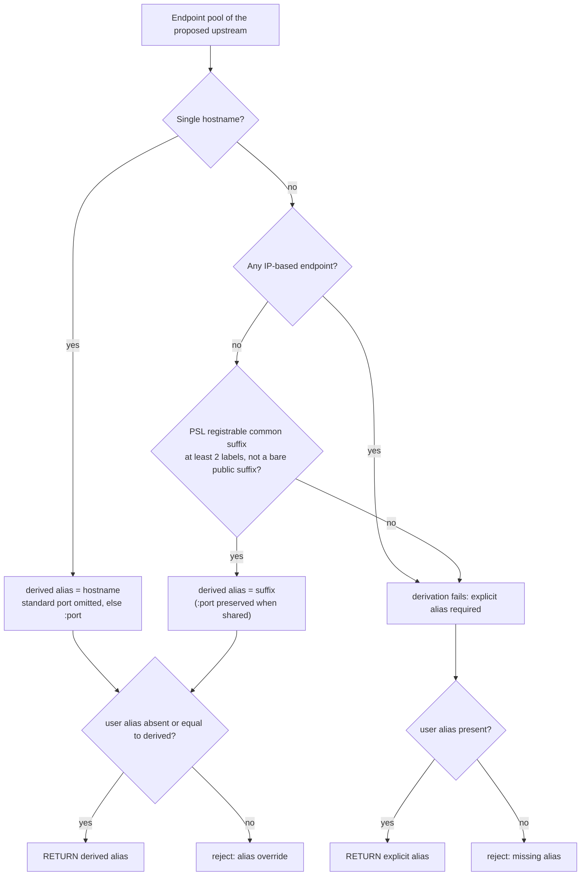

# Feature: Alias Resolution Rules

<!-- toc -->

- [1. Feature Context](#1-feature-context)
  - [1.1 Overview](#11-overview)
  - [1.2 Purpose](#12-purpose)
  - [1.3 Actors](#13-actors)
  - [1.4 References](#14-references)
  - [1.5 Feature-Local Deviations](#15-feature-local-deviations)
- [2. Actor Flows (CDSL)](#2-actor-flows-cdsl)
  - [Alias Derivation at Upstream Creation](#alias-derivation-at-upstream-creation)
  - [Alias Update Enforcement](#alias-update-enforcement)
- [3. Processes / Business Logic (CDSL)](#3-processes--business-logic-cdsl)
  - [Derived Alias Computation](#derived-alias-computation)
  - [Alias Normalization and Uniqueness](#alias-normalization-and-uniqueness)
- [4. States (CDSL)](#4-states-cdsl)
  - [Alias Binding State Machine](#alias-binding-state-machine)
- [5. Definitions of Done](#5-definitions-of-done)
  - [Alias Derivation Rules](#alias-derivation-rules)
  - [Alias Normalization](#alias-normalization)
  - [Alias Update Table](#alias-update-table)
  - [Alias Storage](#alias-storage)
  - [Alias Resolution Entry Point](#alias-resolution-entry-point)
- [6. Acceptance Criteria](#6-acceptance-criteria)

<!-- /toc -->

- [x] `p1` - **ID**: `cpt-cf-oagw-featstatus-alias-resolution-implemented`

<!-- reference to DECOMPOSITION entry -->
`p2` - `cpt-cf-oagw-feature-alias-resolution` — DECOMPOSITION entry 2.3 orders this feature and the text of that entry is the authority for this document's scope; feature progress for this document is owned by the `featstatus` line above.

## 1. Feature Context

### 1.1 Overview

This feature implements the alias contract that turns upstream server endpoints into routing keys: auto-derivation, the explicit-alias requirement for non-derivable endpoint pools, normalization, per-tenant uniqueness, and the immutable-alias update transition table. It is the single place in `oagw` where an alias is computed, normalized, checked for uniqueness or allowed to change — nothing else in the gear re-derives an alias from a hostname, and nothing else decides whether an alias may change.

The alias is the routing key of the proxy path `/oagw/v1/proxy/{alias}/...`, so the derivation decision below is what every later routing decision depends on. The diagram and the derivation table are the structural summary of this feature; the remaining sections are text-only because their CDSL step lists and this table already encode the branching, so a second diagram would only duplicate it.

| Endpoint pool | Alias rule | Example |
|---|---|---|
| Hostname, standard port (HTTP 80; HTTPS/WSS/WT (WebTransport)/gRPC 443) | Auto-derived from the hostname; the standard port is omitted | `api.openai.com:443` → `api.openai.com` |
| Hostname, non-standard port | Auto-derived as `hostname:port` | `api.openai.com:8443` → `api.openai.com:8443` |
| Multiple hostnames, registrable common suffix (PSL-validated, ≥2 labels, not a bare public suffix) | Auto-derived via `common_domain_suffix()`; the suffix is each host's registrable domain — the public suffix plus exactly one label — and not the longest shared string | `us.vendor.com`, `eu.vendor.com` → `vendor.com`; the nested-suffix pool `a.us.vendor.com`, `b.us.vendor.com` → `vendor.com` (not `us.vendor.com`) |
| Multiple hostnames, shared suffix is a bare public suffix | Explicit alias **required**; derivation is rejected | `foo.co.uk`, `bar.co.uk` → **not** derivable (`co.uk` is a public suffix) |
| Multiple hostnames, no registrable common suffix | Explicit alias **required** | `us.foo.com`, `eu.bar.com` → the caller must supply the alias |
| IP addresses | Explicit alias **required** | `10.0.1.1`, `10.0.1.2` → the caller supplies `my-service` |
| Multiple hostnames sharing a non-standard port | Derived from the common suffix with the port preserved (`suffix:port`) | `us.vendor.com:8443`, `eu.vendor.com:8443` → `vendor.com:8443` |

### 1.2 Purpose

This feature bridges DECOMPOSITION entry 2.3 "Alias Resolution Rules" into an implementation contract. The alias is the routing key of `/oagw/v1/proxy/{alias}/...`, so the derivation and immutability rules here determine every routing decision the gateway makes; they must exist in exactly one place, because a second derivation rule would let two features disagree about which upstream a proxy request addresses. `cpt-cf-oagw-feature-management-api` consumes this contract on every upstream create and replace, and the proxy-time resolution path consumes its stored result.

**Requirements**:

- [x] `p2` - `cpt-cf-oagw-fr-alias-resolution` — the enforced alias contract of the PRD (derivation by endpoint type, normalization, case-insensitive resolution, tenant-hierarchy search); the `[x]` mirrors the upstream PRD definition state per the DECOMPOSITION checkbox convention and does not indicate oagw implementation progress.
- [ ] `p1` - `cpt-cf-oagw-nfr-input-validation` — an alias that is absent where it is required, supplied where it is not allowed, malformed, or already taken is reported as a validation failure with the specific rule that failed.

**Principles**: `p1` - `cpt-cf-oagw-principle-tenant-scope` (alias uniqueness and every alias lookup are scoped to one tenant; the same alias in two tenants is not a conflict). Per-tenant uniqueness holds independently of the tenant hierarchy: where an alias matches an *ancestor* upstream, the ancestor bind and authorisation rules owned by `cpt-cf-oagw-feature-management-api` and `cpt-cf-oagw-feature-hierarchical-config` apply on top of, not instead of, that invariant.

**Constraints**: `p1` - `cpt-cf-oagw-constraint-multi-sql` (no backend-specific persistence code: uniqueness is enforced through the repository traits, which keep persistence swappable).

### 1.3 Actors

| Actor | Role in Feature |
|-------|-----------------|
| `cpt-cf-oagw-actor-platform-operator` | Provisions upstreams whose endpoint sets drive derivation, and issues the endpoint changes that Flow B judges against the immutable-alias transition table. |
| `cpt-cf-oagw-actor-tenant-admin` | Supplies explicit aliases when derivation is impossible, is the direct recipient of the 400 validation rejections of Flow A and of the per-tenant 409 alias conflicts this feature reports. |
| `cpt-cf-oagw-actor-app-developer` | Consumer of the alias as the routing key in proxy requests — `/oagw/v1/proxy/{alias}/...` — and never a caller of the derivation surface itself. |

Derivation is a pure computation over an endpoint list and has no actor interaction of its own: the three actors above appear only at the configuration boundary, which is owned by `cpt-cf-oagw-feature-management-api` and the later features. This feature therefore narrates its flows from the actor who supplies the input, not from an actor who invokes the algorithm.

### 1.4 References

- **PRD**: [PRD.md](../PRD.md) — `cpt-cf-oagw-fr-alias-resolution` (the alias contract this feature implements, including the derivation examples and the shadowing resolution order), `cpt-cf-oagw-nfr-input-validation`, and the actors `cpt-cf-oagw-actor-platform-operator`, `cpt-cf-oagw-actor-tenant-admin`, `cpt-cf-oagw-actor-app-developer`
- **Design**: [DESIGN.md](../DESIGN.md) — the "Alias Resolution" subsection with "Alias Enforcement Rules", "Alias Normalization", "Hostname Validation", "Alias Update Behavior" (the transition table), "Alias Uniqueness" and "Shadowing Behavior"; the `Upstream` aggregate of `cpt-cf-oagw-design-domain-model` (unique per `(tenant_id, alias)`); `cpt-cf-oagw-principle-tenant-scope`; `cpt-cf-oagw-constraint-multi-sql`; `cpt-cf-oagw-db-schema` (honoured as the schema contract per DECOMPOSITION correction 3)
- **Decomposition**: [DECOMPOSITION.md](../DECOMPOSITION.md) — entry 2.3 "Alias Resolution Rules" and the "Spec corrections applied" block in its overview (corrections 1 and 3 apply to this feature)
- **Schemas**: [schemas/upstream.v1.schema.json](../schemas/upstream.v1.schema.json) — the `alias` field pattern and the derivation description embedded in it, which this feature enforces verbatim
- **Dependencies**:
  - [ ] `p2` - `cpt-cf-oagw-feature-domain-model` — derivation operates on the `Upstream`/`Endpoint` types of that feature, validates the alias value against the alias rule its validation owns (`cpt-cf-oagw-algo-endpoint-validation`, `cpt-cf-oagw-algo-shape-validation`), and persists the result through its repository traits (`cpt-cf-oagw-dod-repository-traits`).
- **Reverse dependents**: `cpt-cf-oagw-feature-management-api` builds on this feature for every upstream create and replace, and the proxy-time resolution path of `cpt-cf-oagw-feature-proxy-pipeline` consumes the alias this feature stores; tenant-hierarchy shadowing belongs to `cpt-cf-oagw-feature-hierarchical-config` together with that proxy-time path. Neither may re-derive an alias or re-state an update rule defined here.

### 1.5 Feature-Local Deviations

Deviations from the supplied spec/platform baseline, recorded per the shared-baseline policy.

**Deviation** — the proxy path is written as `/oagw/v1/proxy/{alias}/...` without the platform `/api` prefix, while DESIGN's "Alias Resolution" section and `cpt-cf-oagw-fr-alias-resolution` write `/api/oagw/v1/proxy/{alias}/{path}`.
**Rationale** — DECOMPOSITION correction 1: all oagw routes are registered at `/oagw/v1/...` without a leading `/api`; the `/api/oagw/v1/...` form is the operator-gateway-prefixed alias and is not the path this deployment serves. Within the same corrections block, a `wt` (WebTransport) endpoint on port 443 is a standard port for derivation purposes in this feature, while the proxying behaviour of a `wt` endpoint is owned by `cpt-cf-oagw-feature-streaming-proxy` (DECOMPOSITION corrections 2 and 7).
**Review owner**: `cf-generate-author-senior via cf-write-docs review loop`

**Conformance (not a deviation)** — the registrable-suffix derivation uses the `psl` public-suffix list, which is already a declared dependency of the `oagw` crate manifest, so no new dependency is introduced and no local public-suffix table is embedded.
**Rationale** — DESIGN names the suffix validation "PSL-validated" and DECOMPOSITION entry 2.3 names `psl` explicitly, so consuming the existing dependency is conformance with the supplied baseline; recording it here keeps the dependency boundary explicit rather than silently assumed.
**Review owner**: `cf-generate-author-senior via cf-write-docs review loop`

**Conformance (not a deviation)** — the multi-hostname derivation takes the registrable domain of each host as the common suffix: the public suffix plus exactly one label, the registrable-domain notion of the `psl` crate, identical across the pool — not the "longest common domain suffix" wording that `cpt-cf-oagw-fr-alias-resolution` uses.
**Rationale** — the longest shared string does not determine one alias for nested-suffix pools (`a.us.vendor.com` and `b.us.vendor.com` share both `us.vendor.com` and `vendor.com`), while DESIGN's `common_domain_suffix()` and the derivation description of `schemas/upstream.v1.schema.json` both require a registrable domain (eTLD+1, at least 2 labels, not itself a bare public suffix); the registrable-domain reading is the only deterministic one and is what the schema's derivation description enforces, so the PRD wording of `cpt-cf-oagw-fr-alias-resolution` is resolved in its favour.
**Review owner**: `cf-generate-author-senior via cf-write-docs review loop`

**Conformance (not a deviation)** — the HTTP status of a per-tenant alias conflict (409) is decided by the management-API layer: this feature reports the alias-conflict violation only and maps no status itself.
**Rationale** — DESIGN's CRUD semantics assign the 409 to the upstream create path, which `cpt-cf-oagw-feature-management-api` owns; keeping the violation and its status mapping apart mirrors how `cpt-cf-oagw-dod-domain-error` of the domain-model feature already leaves the 409 decision to that layer.
**Review owner**: `cf-generate-author-senior via cf-write-docs review loop`

**Conformance (not a deviation)** — every rejection of this feature is reported through the closed violation-kind list of `cpt-cf-oagw-dod-domain-error`: an alias override (step `inst-fa-09` of `cpt-cf-oagw-flow-alias-derivation`) and a missing alias (step `inst-fa-13`) are reported as the existing `endpoint rule violation` kind, which `cpt-cf-oagw-algo-error-mapping` already renders as the 400 `ValidationError` row, and a per-tenant alias conflict (step `inst-nu-07` of `cpt-cf-oagw-algo-alias-normalization`) is reported as the existing `already-exists` kind — the same violation `cpt-cf-oagw-algo-inmemory-repository` yields for a duplicate composite key — whose 409 status stays the management-API layer's decision. No new violation kind and no new row in the error-mapping table is introduced.
**Rationale** — `cpt-cf-oagw-dod-domain-error` declares its violation kinds enumerated and closed for this release and forbids dependants from adding kinds or mapping rows, so the three rejection identities of this feature (alias override, missing alias, per-tenant alias conflict) are expressed with the two existing kinds above; recording the mapping keeps error rendering and status mapping owned where they already are.
**Review owner**: `cf-generate-author-senior via cf-write-docs review loop`

**Out of scope** — tenant-hierarchy shadowing and proxy-time alias resolution (the descendant-to-root walk, closest match wins, enforced ancestor constraints never bypassed) are owned by `cpt-cf-oagw-feature-hierarchical-config` and `cpt-cf-oagw-feature-proxy-pipeline`; audit and metric emission are owned by `cpt-cf-oagw-feature-observability`, and this feature emits none.
**Rationale** — DECOMPOSITION entry 2.3 lists both in its out-of-scope bullets, and this feature owns only the configuration-time derivation, normalization, uniqueness and update rules.
**Review owner**: `cf-generate-author-senior via cf-write-docs review loop`

**Not applicable because** — the remaining checklist areas have no object in this feature:

- **Performance** — derivation and the uniqueness check run only on the configuration path (upstream create and replace) and are never on the proxy hot path, so no caching, batching or latency budget applies here.
- **Authentication and session handling** — this feature registers no route and is invoked by `cpt-cf-oagw-feature-management-api` and by the proxy-time path, which own the HTTP surfaces and their authentication and session handling.
- **Usability and accessibility** — there is no user interface in this feature; the only user-visible output is the rejection wording above, rendered by the management API that owns the HTTP surface.
- **Regulatory compliance** — no data subject to a compliance regime crosses this feature, which transforms endpoint hostnames into an alias string and checks a uniqueness invariant.
- **Rollout and rollback** — derivation is a pure configuration-time function with no deployable unit, migration or configuration flag of its own, so there is nothing to roll out or roll back apart from the features that call it.
- **Test targets** — the unit-testable boundaries are `cpt-cf-oagw-algo-alias-derivation`, `cpt-cf-oagw-algo-alias-normalization` and the transition table of §2, with integration coverage owned by the consuming features that expose the HTTP surfaces.

## 2. Actor Flows (CDSL)

Interactions that start with an actor and describe the end-to-end flow. Both flows of this feature are called by later features rather than by HTTP handlers: the management handlers call Flow A on every upstream create and Flow B on every upstream replace, and neither flow opens an HTTP route of its own.

**Use cases**: `p1` - `cpt-cf-oagw-usecase-configure-upstream` (reaches this layer through the management handlers of `cpt-cf-oagw-feature-management-api`)

### Alias Derivation at Upstream Creation

- [x] `p1` - **ID**: `cpt-cf-oagw-flow-alias-derivation`

**Actor**: `cpt-cf-oagw-actor-tenant-admin`

**Success Scenarios**:

- A single-hostname upstream derives its alias from the hostname: `api.openai.com:443` → `api.openai.com`, `api.openai.com:8443` → `api.openai.com:8443`.
- A multi-hostname pool with a registrable common suffix derives that suffix — `us.vendor.com` + `eu.vendor.com` → `vendor.com` — or the port-preserving `suffix:port` form when the pool shares one non-standard port (`us.vendor.com:8443` + `eu.vendor.com:8443` → `vendor.com:8443`).
- An IP-based or otherwise non-derivable pool with a supplied explicit alias is accepted, and the supplied alias becomes the routing key.

**Error Scenarios**:

- A user-provided alias on a hostname-based upstream that differs from the derived value is rejected as an alias override, reported as the `endpoint rule violation` kind of `cpt-cf-oagw-dod-domain-error` (400 validation); supplying the exact derived value is tolerated as an idempotent no-op.
- An omitted alias on an IP-based or non-derivable pool is rejected as a missing alias, reported as the same `endpoint rule violation` kind (400 validation).
- A pool whose only common suffix is a bare public suffix (for example `foo.co.uk` + `bar.co.uk`, where `co.uk` is a public suffix) is rejected for derivation and falls into the explicit-alias branch.
- A duplicate alias within the same tenant is reported as a per-tenant alias conflict by `cpt-cf-oagw-algo-alias-normalization` at step `inst-fa-15` below, as the `already-exists` kind of `cpt-cf-oagw-dod-domain-error`; the 409 status is decided by the management-API layer, and this feature reports the conflict only.

**Steps**:

1. [x] - `p1` - Receive the endpoint set of the proposed upstream together with the optional user-provided alias and the caller's tenant id - `inst-fa-01`
2. [x] - `p1` - Classify the endpoint pool as single-hostname, multi-hostname or IP-based, using the already-validated endpoint shape produced by `cpt-cf-oagw-algo-endpoint-validation` (an IP-based pool is one whose `host` entries are IP literals rather than RFC 1123 hostnames); the derivation precondition is that the pool is already validated and its endpoints share one protocol, scheme and port per the DESIGN pool rule, and any pool containing at least one IP literal — including a pool that mixes hostnames with IP literals — is classified IP-based and is therefore non-derivable - `inst-fa-02`
3. [x] - `p1` - **FOR EACH** hostname endpoint in the pool - `inst-fa-03`
   1. [x] - `p1` - Normalize the host to ASCII lowercase with any trailing dot stripped, so `Api.OpenAI.COM.` and `api.openai.com` produce one routing key - `inst-fa-04`
4. [x] - `p1` - Compute the derived alias of the normalized pool through `cpt-cf-oagw-algo-alias-derivation` - `inst-fa-05`
5. [x] - `p1` - **IF** derivation succeeded **AND** (no user alias was supplied **OR** the supplied alias equals the derived value) - `inst-fa-06`
   1. [x] - `p1` - **RETURN** the derived alias, so supplying the exact derived value is tolerated silently for idempotency and a hostname-based upstream always carries the derived key - `inst-fa-07`
6. [x] - `p1` - **ELSE IF** derivation succeeded **AND** (a user alias was supplied **AND** the supplied alias differs from the derived value) - `inst-fa-08`
   1. [x] - `p1` - Reject the payload as an alias override — the `endpoint rule violation` kind of `cpt-cf-oagw-dod-domain-error`, rendered as the 400 `ValidationError` row by `cpt-cf-oagw-algo-error-mapping`: a hostname-based upstream never accepts a user alias that differs from the auto-derived value - `inst-fa-09`
7. [x] - `p1` - **ELSE IF** derivation failed **AND** a user alias is present - `inst-fa-10`
   1. [x] - `p1` - **RETURN** the explicit alias as the upstream's routing key, recording its class as explicit for the state machine of §4 - `inst-fa-11`
8. [x] - `p1` - **ELSE** derivation failed **AND** no user alias is present - `inst-fa-12`
   1. [x] - `p1` - Reject the payload as a missing alias — the same `endpoint rule violation` kind of `cpt-cf-oagw-dod-domain-error`, rendered as the 400 `ValidationError` row by `cpt-cf-oagw-algo-error-mapping`: an IP-based or non-derivable pool requires an explicit alias, and omitting the `alias` field is a validation failure - `inst-fa-13`
9. [x] - `p1` - Hand the resolved alias (the derived value of `inst-fa-07` or the explicit value of `inst-fa-11`) together with the caller's tenant id to `cpt-cf-oagw-algo-alias-normalization`, which normalizes it and enforces the per-tenant `(tenant_id, alias)` uniqueness invariant before the alias is returned - `inst-fa-15`
10. [x] - `p1` - **RETURN** the resolved alias with its class (derived or explicit), or the rejection reason, to the caller - `inst-fa-14`

### Alias Update Enforcement

- [x] `p1` - **ID**: `cpt-cf-oagw-flow-alias-update-enforcement`

**Actor**: `cpt-cf-oagw-actor-platform-operator`

**Success Scenarios**:

- An endpoint change that keeps the derived alias identical is accepted (a derivable pool whose recomputed alias still equals the stored one).
- A non-derivable → non-derivable change retains the existing alias, and the upstream keeps its routing key without a new derivation.
- An exact-match alias supplied on an unchanged endpoint set is tolerated as a no-op.

**Error Scenarios**:

- Any endpoint change that would alter the derived alias is rejected (400 validation); the operator must delete and re-create the upstream instead.
- A derivable → non-derivable change (hostname pool → IP pool) is rejected always, even when an explicit alias is provided.
- A differing user-provided alias on a non-derivable upstream is rejected as an alias override.

**Steps**:

1. [x] - `p1` - Receive the existing upstream (its stored alias and endpoint pool) and the proposed replacement endpoint set with its optional alias - `inst-fb-01`
2. [x] - `p1` - Compute the derived-alias class of both pools through `cpt-cf-oagw-algo-alias-derivation`: derivable when the computation returns a value, non-derivable when it returns derivation-failure (IP-based endpoints, heterogeneous hostnames with no registrable common suffix, or a pool whose only common suffix is a bare public suffix) - `inst-fb-02`
3. [x] - `p1` - **IF** the proposed endpoint set is unchanged - `inst-fb-03`
   1. [x] - `p1` - **IF** the supplied alias is absent **OR** equals the stored alias - `inst-fb-04`
      1. [x] - `p1` - **RETURN** no-op, keeping the stored alias unchanged, so an exact-match alias on an unchanged endpoint set is tolerated; the stored alias is not re-derived and therefore needs no re-validation against `cpt-cf-oagw-algo-alias-normalization` - `inst-fb-05`
   2. [x] - `p1` - **ELSE** - `inst-fb-06`
      1. [x] - `p1` - Reject the payload as an alias override: an alias is never changed while the endpoints stay the same - `inst-fb-07`
4. [x] - `p1` - **ELSE** apply the transition table below to the (existing class, proposed class) pair - `inst-fb-08`
   1. [x] - `p1` - Derivable → Derivable: hand the recomputed alias of the proposed pool together with the upstream's tenant id to `cpt-cf-oagw-algo-alias-normalization`, which normalizes it and re-checks the `(tenant_id, alias)` uniqueness invariant, and allow only when the normalized recomputed alias equals the stored alias and the check reports no conflict; otherwise reject with the delete-and-re-create guidance - `inst-fb-09`
   2. [x] - `p1` - Derivable → Non-derivable: reject always, even when an explicit alias is provided, because the routing key class itself would change - `inst-fb-10`
   3. [x] - `p1` - Non-derivable → Non-derivable: retain the existing alias, which stays exactly as stored and therefore needs no re-validation against `cpt-cf-oagw-algo-alias-normalization`, and reject a differing user-provided alias - `inst-fb-11`
   4. [x] - `p1` - Non-derivable → Derivable: hand the derived alias of the proposed hostname pool together with the upstream's tenant id to `cpt-cf-oagw-algo-alias-normalization`, which normalizes it and re-checks the `(tenant_id, alias)` uniqueness invariant, and allow when the normalized derived alias equals the existing one and the check reports no conflict; otherwise reject with the delete-and-re-create guidance - `inst-fb-12`
5. [x] - `p1` - **RETURN** allow, or reject together with the specific transition-table rule that decided the outcome - `inst-fb-13`

**Alias update transition table** (from DESIGN "Alias Update Behavior"; "derivable" means `compute_derived_alias()` returns a value, "non-derivable" that it returns derivation-failure):

| Transition | Alias unchanged | Alias would change |
|---|---|---|
| Derivable → Derivable (endpoints change) | Allowed — the recomputed alias equals the existing one | **Rejected** — delete and re-create |
| Derivable → Non-derivable (hostname → IP) | — | **Rejected** always, even when an explicit alias is provided |
| Non-derivable → Non-derivable (IP → IP) | Existing alias retained | **Rejected** — a differing user-provided alias is not accepted |
| Non-derivable → Derivable (IP → hostname) | Allowed — the derived alias equals the existing one | **Rejected** — delete and re-create |
| No endpoint change (derivable or non-derivable) | Exact-match alias tolerated (no-op) | **Rejected** — alias override not allowed |

No branch of this flow accepts a newly supplied explicit alias — the only place an explicit alias enters the alias contract is upstream creation in `cpt-cf-oagw-flow-alias-derivation` — so every branch above either re-derives the value and re-checks it through `cpt-cf-oagw-algo-alias-normalization` (steps `inst-fb-09` and `inst-fb-12`, the two branches where the alias value could change) or keeps the stored alias unchanged (steps `inst-fb-05` and `inst-fb-11`), which needs no re-validation.

## 3. Processes / Business Logic (CDSL)

Internal building blocks called by the actor flows above: `cpt-cf-oagw-flow-alias-derivation` calls `cpt-cf-oagw-algo-alias-derivation` and hands its result to `cpt-cf-oagw-algo-alias-normalization`, and `cpt-cf-oagw-flow-alias-update-enforcement` calls both at the branch points where an alias value can change. Neither algorithm interacts with an actor directly, and neither opens an HTTP route.

### Derived Alias Computation

- [x] `p2` - **ID**: `cpt-cf-oagw-algo-alias-derivation`

**Input**: the endpoint list of an upstream (each entry carrying `scheme`, `host` and `port`), plus the optional shared port of the pool.

**Output**: the derived alias, or the derivation-failure classification.

**Steps**:

1. [x] - `p1` - Normalize every hostname in the list to ASCII lowercase with trailing dots stripped, on the endpoint shape already accepted by `cpt-cf-oagw-algo-endpoint-validation`; the derivation precondition is that the input is an already-validated pool whose endpoints share one protocol, scheme and port per the DESIGN pool rule, and a pool containing at least one IP literal — including a pool that mixes hostnames with IP literals — is classified IP-based at step `inst-da-02` and is therefore non-derivable - `inst-da-01`
2. [x] - `p1` - **IF** any endpoint host is an IP literal (IPv4 or IPv6) - `inst-da-02`
   1. [x] - `p1` - **RETURN** derivation-failure, because IP-based pools are never derivable and always require an explicit alias - `inst-da-03`
3. [x] - `p1` - **IF** the list holds exactly one normalized hostname - `inst-da-04`
   1. [x] - `p1` - **RETURN** the hostname itself, appending `:port` only for a non-standard port and omitting the standard ports HTTP 80 and HTTPS/WSS/WT/gRPC 443 - `inst-da-05`
4. [x] - `p1` - Determine the registrable common suffix shared by all hostnames against the public-suffix list of the `psl` crate: the derived suffix is the registrable domain of each host — the public suffix plus exactly one label, the registrable-domain notion of the `psl` crate — and not the longest shared string, so a pool of nested suffixes yields one deterministic value; the suffix must be identical across the pool, must carry at least 2 labels and must not itself be a bare public suffix, so `vendor.com` passes and `co.uk` fails - `inst-da-06`
5. [x] - `p1` - **IF** no such registrable common suffix exists - `inst-da-07`
   1. [x] - `p1` - **RETURN** derivation-failure, so heterogeneous hostnames and bare-public-suffix pools both land in the explicit-alias branch of `cpt-cf-oagw-flow-alias-derivation` - `inst-da-08`
6. [x] - `p1` - **IF** the pool's shared port is non-standard - `inst-da-09`
   1. [x] - `p1` - **RETURN** the `suffix:port` form, which keeps pools sharing a domain suffix on different ports from colliding - `inst-da-10`
7. [x] - `p1` - **RETURN** the registrable common suffix alone as the derived alias - `inst-da-11`

This feature owns only the configuration-time derivation, normalization, uniqueness and update rules. Tenant-hierarchy shadowing — the descendant-to-root walk, closest match wins, and the rule that enforced ancestor constraints are never bypassed by shadowing — is the proxy-time resolution path (`resolve_alias`) owned by `cpt-cf-oagw-feature-hierarchical-config` and `cpt-cf-oagw-feature-proxy-pipeline`; it consumes the alias stored by this feature and never re-derives one.

### Alias Normalization and Uniqueness

- [x] `p2` - **ID**: `cpt-cf-oagw-algo-alias-normalization`

**Input**: an alias string plus the tenant id of the upstream it belongs to.

**Output**: the normalized alias and the uniqueness decision.

**Steps**:

1. [x] - `p1` - Normalize the alias to ASCII lowercase and strip trailing dots, so `Api.OpenAI.COM.` and `api.openai.com` are the same value at rest and at resolution time - `inst-nu-01`
2. [x] - `p1` - Hand the normalized value to the alias rule owned by `cpt-cf-oagw-algo-shape-validation` of `cpt-cf-oagw-feature-domain-model`; this algorithm re-declares none of that rule, and a value that fails it is reported here as the malformed-alias violation of `cpt-cf-oagw-nfr-input-validation` - `inst-nu-02`
3. [x] - `p1` - Key the uniqueness check on `(tenant_id, alias)`: the same alias in two different tenants is not a conflict, and uniqueness is enforced per tenant, not globally and independently of the tenant hierarchy — where a proposed alias matches an *ancestor* upstream, the ancestor bind and authorisation rules owned by `cpt-cf-oagw-feature-management-api` and `cpt-cf-oagw-feature-hierarchical-config` apply on top of, not instead of, this invariant - `inst-nu-03`
4. [x] - `p1` - **TRY** the uniqueness lookup for the (tenant id, normalized alias) key against the tenant-scoped `UpstreamRepository` - `inst-nu-04`
   1. [x] - `p1` - Look the key up through `cpt-cf-oagw-algo-inmemory-repository`, whose duplicate-key semantics are the enforcement point of the invariant - `inst-nu-05`
5. [x] - `p1` - **CATCH** a duplicate key, that is an existing upstream in the same tenant carrying the same alias - `inst-nu-06`
   1. [x] - `p1` - Report a per-tenant alias conflict naming the colliding tenant id and alias, as the `already-exists` kind of `cpt-cf-oagw-dod-domain-error` (the same violation `cpt-cf-oagw-algo-inmemory-repository` yields for a duplicate composite key), and abort without a partial write; the HTTP status (409) that renders this violation is decided by the management-API layer - `inst-nu-07`
6. [x] - `p1` - **RETURN** the normalized alias together with the uniqueness decision, or the reported conflict - `inst-nu-08`

The `(tenant_id, alias)` uniqueness checked here is the same invariant the domain layer enforces on every upstream write: `cpt-cf-oagw-db-schema` declares it as the `UNIQUE (tenant_id, alias)` constraint and is honoured as the schema contract per DECOMPOSITION correction 3, so this algorithm adds no second uniqueness rule and no table of its own.

## 4. States (CDSL)

### Alias Binding State Machine

- [x] `p2` - **ID**: `cpt-cf-oagw-state-alias-binding`

**States**: `Unassigned`, `Derived`, `Explicit`, `Released`

**Initial State**: `Unassigned`

**Transitions**:

1. [x] - `p1` - **FROM** `Unassigned` **TO** `Derived` **WHEN** an upstream with derivable endpoints is stored and the derivation of `cpt-cf-oagw-flow-alias-derivation` produced the routing key - `inst-sb-01`
2. [x] - `p1` - **FROM** `Unassigned` **TO** `Explicit` **WHEN** a non-derivable upstream is stored with a user-provided alias, which becomes the routing key as supplied - `inst-sb-02`
3. [x] - `p1` - **FROM** `Derived` **TO** `Released` **WHEN** the upstream is deleted - `inst-sb-03`
4. [x] - `p1` - **FROM** `Explicit` **TO** `Released` **WHEN** the upstream is deleted - `inst-sb-04`

The machine tracks the alias binding of one upstream, not the upstream lifecycle of `cpt-cf-oagw-state-resource-lifecycle`, and the two move together: a delete releases the alias with the upstream, and the alias is never re-used within the same tenant while that upstream still exists. `Derived` → `Explicit` and `Explicit` → `Derived` are refused in every case — an alias never changes class after creation, and a configuration that would change the class is handled by deleting and re-creating the upstream, which is exactly what the transition table of §2 rejects. `Released` is terminal: a re-created upstream with the same alias is a new binding that enters from `Unassigned`, not an undelete. Any transition not listed above is invalid and leaves the binding unchanged.

## 5. Definitions of Done

### Alias Derivation Rules

- [x] `p1` - **ID**: `cpt-cf-oagw-dod-alias-derivation-rules`

The system **MUST** implement the derivation rules of `cpt-cf-oagw-flow-alias-derivation` and `cpt-cf-oagw-algo-alias-derivation` — standard-port omission (HTTP 80, HTTPS/WSS/WT/gRPC 443), `hostname:port` for non-standard ports, the PSL-based registrable common suffix of at least 2 labels that is not itself a bare public suffix, the port-preserving `suffix:port` form for pools sharing a non-standard port, and the explicit-alias requirement for IP-based and otherwise non-derivable pools — and **MUST** reject a user alias that differs from the derived value on a hostname-based upstream.

**Implements**:

- `cpt-cf-oagw-flow-alias-derivation`
- `cpt-cf-oagw-algo-alias-derivation`

**Touches**:

- Entities: `Upstream`, `Endpoint`

### Alias Normalization

- [x] `p1` - **ID**: `cpt-cf-oagw-dod-alias-normalization`

The system **MUST** normalize every alias to ASCII lowercase with trailing dots stripped, so that proxy-time resolution is case-insensitive without any case handling in the resolution path (the resolution walk itself stays owned by `cpt-cf-oagw-feature-hierarchical-config` and `cpt-cf-oagw-feature-proxy-pipeline`), **MUST** report an alias value that fails the alias rule owned by `cpt-cf-oagw-algo-shape-validation` as the malformed-alias violation of `cpt-cf-oagw-nfr-input-validation`, and **MUST** enforce alias uniqueness per `(tenant_id, alias)` through the repository boundary, reporting a per-tenant alias conflict when the invariant is violated.

**Implements**:

- `cpt-cf-oagw-algo-alias-normalization`

**Principles**: `p1` - `cpt-cf-oagw-principle-tenant-scope`

**Touches**:

- Entities: `Alias`, `Upstream`
- DB: `cpt-cf-oagw-db-schema` (honoured as the schema contract for the `(tenant_id, alias)` uniqueness invariant)

### Alias Update Table

- [x] `p1` - **ID**: `cpt-cf-oagw-dod-alias-update-table`

The system **MUST** enforce the alias update transition table exactly as reproduced in §2, for all four class transitions and the no-endpoint-change row, and **MUST** reject with the specific rule whenever an update would change the routing key — directing the operator to delete and re-create the upstream instead.

**Implements**:

- `cpt-cf-oagw-flow-alias-update-enforcement`

**Touches**:

- Entities: `Upstream`, `Endpoint`, `Alias`

### Alias Storage

- [x] `p1` - **ID**: `cpt-cf-oagw-dod-alias-storage`

The system **MUST** persist the derived or explicitly supplied alias on the `Upstream` aggregate of `cpt-cf-oagw-feature-domain-model`, normalized, and **MUST** keep it unique per `(tenant_id, alias)` in the store, so the value the proxy path addresses is the value that was validated here.

**Implements**:

- `cpt-cf-oagw-algo-alias-normalization`
- `cpt-cf-oagw-flow-alias-derivation`
- `cpt-cf-oagw-flow-alias-update-enforcement`

**Constraints**: `p1` - `cpt-cf-oagw-constraint-multi-sql`

**Touches**:

- Entities: `Upstream`, `Alias`, `Endpoint`
- DB: `cpt-cf-oagw-db-schema` (the `(tenant_id, alias)` uniqueness invariant, honoured as a schema contract)

### Alias Resolution Entry Point

- [x] `p1` - **ID**: `cpt-cf-oagw-dod-alias-resolution-api`

The system **MUST** expose the resolution entry point that `cpt-cf-oagw-feature-management-api` and the proxy-time path of `cpt-cf-oagw-feature-proxy-pipeline` consume as a pure function over the repository traits of the domain model, and **MUST NOT** introduce any HTTP route: this feature owns no endpoint, and the management and proxy surfaces remain owned by their own features.

**Implements**:

- `cpt-cf-oagw-flow-alias-derivation`
- `cpt-cf-oagw-flow-alias-update-enforcement`
- `cpt-cf-oagw-state-alias-binding`

**Touches**:

- Entities: `Upstream`, `Alias`
- Infra: the repository traits of `cpt-cf-oagw-dod-repository-traits` (`src/domain/repo.rs` of the domain-model feature)

## 6. Acceptance Criteria

- [x] An upstream whose single endpoint is `api.example.com` on port 443 derives the alias `api.example.com`.
- [x] Upstreams whose endpoints are `us.vendor.com:8443` and `eu.vendor.com:8443` derive the alias `vendor.com:8443`, and the same suffix on port 443 derives `vendor.com` without the port.
- [x] A pool of `foo.co.uk` and `bar.co.uk` is rejected for derivation, because its only common suffix `co.uk` is a bare public suffix, and the payload is accepted only with an explicit alias.
- [x] A pool of `us.foo.com` and `eu.bar.com` has no registrable common suffix, is rejected for derivation, and is accepted only with an explicit alias.
- [x] An IP-based pool of `10.0.1.1` and `10.0.1.2` requires an explicit alias and rejects an omitted `alias` field, while the same pool with the explicit alias `my-service` is accepted.
- [x] A user-provided alias that differs from the derived value on a hostname-based upstream is rejected, and supplying the exact derived value is accepted as an idempotent no-op.
- [x] The stored alias for a proposed alias of `Api.OpenAI.COM.` is `api.openai.com`, so proxy-time resolution is case-insensitive by construction; the proxy-time resolution walk itself is owned by `cpt-cf-oagw-feature-hierarchical-config` and `cpt-cf-oagw-feature-proxy-pipeline`.
- [x] Standard ports are omitted from derived aliases — HTTP 80 and HTTPS/WSS/WT/gRPC 443 — while a non-standard port is preserved in the `hostname:port` form.
- [x] Each row of the alias update transition table behaves as specified: a derivable → derivable change keeping the alias is allowed, the same change altering the alias is rejected with delete-and-re-create guidance, a derivable → non-derivable change is rejected even with an explicit alias, a non-derivable → non-derivable change retains the existing alias and rejects a differing one, a non-derivable → derivable change is allowed only when the derived alias equals the existing one, and an exact-match alias on an unchanged endpoint set is a no-op.
- [x] Storing a second upstream with the same alias in one tenant reports a per-tenant alias conflict, while the same alias stored in a different tenant is accepted — per-tenant uniqueness holds independently of the tenant hierarchy, and an alias that matches an *ancestor* upstream follows the ancestor bind and authorisation rules owned by `cpt-cf-oagw-feature-management-api` and `cpt-cf-oagw-feature-hierarchical-config` on top of, not instead of, this invariant.
- [x] Deleting the upstream releases its alias in `cpt-cf-oagw-state-alias-binding`, and the alias cannot be re-used within the same tenant while that upstream still exists.
- [x] An alias that violates the alias pattern of `schemas/upstream.v1.schema.json` (empty, starting or ending with a dot, colon or hyphen, or carrying characters outside the ASCII lowercase alphanumeric, dot, colon and hyphen set) is reported as a malformed-alias violation of `cpt-cf-oagw-nfr-input-validation`.
- [x] No HTTP route is registered by this feature: every alias decision is reached through the pure resolution entry point and the repository traits of `cpt-cf-oagw-feature-domain-model`.
