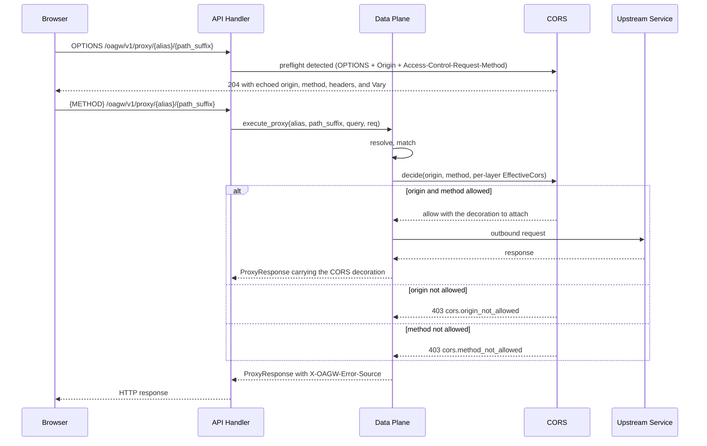

# Feature: CORS

<!-- toc -->

- [1. Feature Context](#1-feature-context)
  - [1.1 Overview](#11-overview)
  - [1.2 Purpose](#12-purpose)
  - [1.3 Actors](#13-actors)
  - [1.4 References](#14-references)
  - [1.5 Feature-Local Deviations from Shared Baselines](#15-feature-local-deviations-from-shared-baselines)
  - [1.6 Explicit Non-Applicability](#16-explicit-non-applicability)
- [2. Actor Flows (CDSL)](#2-actor-flows-cdsl)
  - [Answer a Preflight Request at Handler Level](#answer-a-preflight-request-at-handler-level)
  - [Enforce CORS on an Actual Cross-Origin Request](#enforce-cors-on-an-actual-cross-origin-request)
- [3. Processes / Business Logic (CDSL)](#3-processes--business-logic-cdsl)
  - [Fold the Effective CORS Configuration](#fold-the-effective-cors-configuration)
  - [Decide an Actual Cross-Origin Request](#decide-an-actual-cross-origin-request)
  - [Build the Preflight Header Set](#build-the-preflight-header-set)
- [4. States (CDSL)](#4-states-cdsl)
- [5. Definitions of Done](#5-definitions-of-done)
  - [Preflight Answer at Handler Level](#preflight-answer-at-handler-level)
  - [Actual-Request Origin and Method Enforcement](#actual-request-origin-and-method-enforcement)
  - [Exact Origin Matching and the Credentials Restriction](#exact-origin-matching-and-the-credentials-restriction)
  - [Response Decoration](#response-decoration)
  - [Hierarchical CORS Consumption](#hierarchical-cors-consumption)
  - [CORS Entities and Layering](#cors-entities-and-layering)
  - [Colocated Tests](#colocated-tests)
- [6. Acceptance Criteria](#6-acceptance-criteria)

<!-- /toc -->

- [ ] `p1` - **ID**: `cpt-cf-oagw-featstatus-cors-implemented`

<!-- reference to DECOMPOSITION entry -->
- [ ] `p2` - `cpt-cf-oagw-feature-cors`

## 1. Feature Context

### 1.1 Overview

This feature is the CORS policy of the `oagw` gear: the built-in handler ADR 0004 (`cpt-cf-oagw-adr-cors`) chooses over proxying the protocol to the upstream and over delegating it to a guard plugin. It attaches to the proxy path `cpt-cf-oagw-feature-data-plane-proxy` owns and answers two different questions about two different requests. A preflight — an `OPTIONS` request carrying `Origin` and `Access-Control-Request-Method` — is answered locally and permissively with 204 at handler level, before that path resolves an upstream, matches a route, authenticates a caller, executes a plugin, or charges a counter, because the browser that sends a preflight sends no credentials and no tenant context exists to resolve with. An actual cross-origin request is checked against the resolved configuration after resolution and before anything is forwarded: an origin the effective `allowed_origins` does not name and a method the effective `allowed_methods` does not list are each answered 403 on the proxy path the caller already called.

The feature registers no route of its own and holds no state between requests. The actual-request answer is a pure function of the request and of the effective configuration the resolution already produced, and the preflight answer is a pure function of the request alone; every answer it produces is tagged `X-OAGW-Error-Source: gateway` like every other gateway answer, and it is written as an RFC 9457 problem body when it is a refusal.

### 1.2 Purpose

DECOMPOSITION §2.7 places this feature as the second of the three policy tails that hang off the proxy spine: `cpt-cf-oagw-feature-data-plane-proxy` resolves, matches, and forwards, and this feature decides whether a cross-origin call may go out and what the browser may read of the answer. DECOMPOSITION §3 makes it a consumer of the proxy feature because the enforcement runs "after upstream resolution and before forwarding", and makes `cpt-cf-oagw-feature-hierarchical-config` a dependency because the configuration it enforces is that feature's merged output.

This feature delivers the whole of ADR 0004's chosen option — the built-in handler — and the CORS part of the DESIGN §3.2 Security Considerations subsection, which states the split this document implements: "Preflight OPTIONS requests return a permissive 204 at the handler level (no upstream resolution or tenant context required). Origin validation happens on actual requests after upstream resolution, before forwarding." The two CORS rows of the DESIGN §3.2 Guard Rules table are this feature's and not `cpt-cf-oagw-algo-inbound-validate`'s, which `cpt-cf-oagw-feature-data-plane-proxy` records in its own §1.6 (§1.5). ADR 0004's two rejected options stay rejected here: the `cors` guard identifier `gts.cf.core.oagw.guard_plugin.v1~cf.core.oagw.cors.v1` that PRD §5.3 lists exists only for types-registry cataloging and cannot be bound through `plugins.items[].plugin_ref`, so the plugin option is not merely declined but unreachable, and no feature of this decomposition proxies a CORS preflight to an upstream. The value measure ADR 0004's decision drivers give is that a browser client completes a cross-origin call through the gear without the operator widening the proxy to every origin, and the answer does not depend on the upstream being reachable.

Deliverables:

- The preflight answer at handler level, produced from the request's own three headers and from nothing else, with no upstream resolution, no tenant context, and no per-request authentication or plugin check.
- The actual-request enforcement after resolution: the origin check and the method check, each answering 403, both before anything is forwarded.
- Exact origin matching only — the whole `Origin` value against a configured entry, scheme- and port-significant, with no pattern, no suffix, and no case folding — and the `*` wildcard as the one non-exact entry the shipped schema admits.
- The credentials restriction: `allow_credentials` is never combined with a wildcard origin, refused at write time by the frozen schema's own conditional and never served permissively here.
- Response decoration with `Access-Control-Allow-Origin`, `Access-Control-Allow-Methods`, `Access-Control-Expose-Headers`, `Access-Control-Max-Age`, and an always-present `Vary: Origin`, split between the preflight set and the actual-request set exactly as ADR 0004's two worked examples split them.
- The enforcement-time consumption of the CORS row of the DESIGN §3.2 Hierarchical Configuration merge table, taken from the `EffectiveCors` results `cpt-cf-oagw-feature-hierarchical-config` produces per layer, following the `inherit` and `enforce` sharing modes that feature already applied.
- Colocated tests under `gears/system/oagw/oagw/tests/`.

**Requirements**:

- [ ] `p1` - `cpt-cf-oagw-fr-request-proxy`
- [ ] `p1` - `cpt-cf-oagw-nfr-input-validation`
- [ ] `p1` - `cpt-cf-oagw-fr-header-transform`
- [x] `p2` - `cpt-cf-oagw-fr-hierarchical-config`

`cpt-cf-oagw-fr-hierarchical-config` carries the checked state DECOMPOSITION §2.7 records: its merge behaviour is delivered by `cpt-cf-oagw-feature-hierarchical-config`, and what this feature consumes of it is the per-layer `EffectiveCors` result rather than a second merge (§1.5). `cpt-cf-oagw-fr-header-transform` is covered here because the decoration this feature computes is response header work — ADR 0004's traceability states exactly that — while the set/add/remove operations themselves, the passthrough control, and the hop-by-hop stripping are that requirement's other half and stay with `cpt-cf-oagw-feature-data-plane-proxy`.

**Principles**:

- `p1` - `cpt-cf-oagw-principle-rfc9457`
- `p1` - `cpt-cf-oagw-adr-cors`
- `p1` - `cpt-cf-oagw-principle-error-source`
- `p1` - `cpt-cf-oagw-adr-error-source-distinction`

**Constraints**:

- `p1` - `cpt-cf-oagw-constraint-toolkit-deploy`

**Design Components**:

- `p1` - `cpt-cf-oagw-component-model`

This feature delivers the CORS merge row of the DESIGN §3.2 Hierarchical Configuration subsection — the row whose strategy is "Union origins if `inherit`; forced if `enforce`" — as its enforcement-time consumption, together with the CORS part of the §3.2 Security Considerations subsection. The merge table itself, the hierarchy walk, and the sharing-mode decision are `cpt-cf-oagw-feature-hierarchical-config`'s and are not restated here.

**Domain Model Entities**:

- `CorsDecision` — the verdict of one actual cross-origin request, carrying whether the request is admitted or refused, which of the two reasons refused it, and the response decoration to attach when it is admitted.
- The preflight response shape — the 204 answer and its five CORS header members, which ADR 0004's preflight example spells out, together with the gateway error-source tag §1.5 records, and which this document fixes as the one shape the preflight answer takes.

`CorsDecision` and the preflight response shape are declared here and DECOMPOSITION §2.7 lists both under this entry; `CorsConfig` is listed by DECOMPOSITION §2.7 because the enforcement semantics of its members are this feature's, and is consumed from `cpt-cf-oagw-feature-gear-foundation`, which declares it as shared vocabulary, rather than redeclared (§1.5). `EffectiveCors` is consumed from `cpt-cf-oagw-feature-hierarchical-config`, which produces it; `ResolvedUpstream`, `MatchedRoute`, and `ProxyResponse` are consumed from `cpt-cf-oagw-feature-data-plane-proxy`, and `ErrorContext` from `cpt-cf-oagw-feature-gear-foundation`.

**Data**:

- None. DECOMPOSITION §2.7 declares no table for this feature, and it creates, reads, or writes none. A CORS decision is computed per request from the request and the resolved configuration and is persisted nowhere; the feature holds no counter, no registry, and no cache, and a restart changes nothing about any answer it gives (§1.5).

**API**:

- `OPTIONS /oagw/v1/proxy/{alias}[/{path_suffix}]` returning 204 with CORS preflight headers — the one API statement DECOMPOSITION §2.7 makes, which is the proxy path `cpt-cf-oagw-feature-data-plane-proxy` registers taken under the `OPTIONS` method and not a second registration of it.

This feature invents no path, no method, no query parameter, and no response shape of its own. The handler registration is that feature's, and its Definition of Done already hands the `OPTIONS` preflight answer over: it "MUST leave the `OPTIONS` preflight answer to `cpt-cf-oagw-feature-cors`". An `OPTIONS` request that is not a preflight — one that carries no `Origin` or no `Access-Control-Request-Method` — is not answered by this feature at all and is judged by the matched route's method allowlist and by `cpt-cf-oagw-algo-inbound-validate` like any other proxy request (§2); the hand-back is unchanged, but its outcome is now named: under the shipped route schema's method enum, which admits no `OPTIONS` literal, an ordinary `OPTIONS` request matches no route and is answered 404 with the `RouteNotFound` variant, so the hand-back resolves to that answer rather than to a forwarded request.

### 1.3 Actors

| Actor | Role in Feature |
|-------|-----------------|
| `cpt-cf-oagw-actor-app-developer` | Runs the browser client that sends the preflight and the actual cross-origin request, and receives either the 204 preflight answer, the decorated upstream answer, or one of the two 403 answers. PRD §5.2 names this actor for the proxy requirements, and ADR 0004's decision drivers name the browser-based client this feature exists to serve. |
| `cpt-cf-oagw-actor-platform-operator` | Writes the `cors` block on an upstream or a route through the management API of `cpt-cf-oagw-feature-control-plane-config`, which validates it against the frozen schema before it is stored. The write is that feature's act; what this feature does with the stored object is §2's enforcement flow. |
| `cpt-cf-oagw-actor-upstream-service` | Receives the forwarded request only after the enforcement flow has admitted it, and produces the response the decoration is attached to. It is contacted by `cpt-cf-oagw-feature-data-plane-proxy` and never by this feature, and it is never asked about an origin or a method, because ADR 0004's rejected first option is the only design that would. |

Two actors participate indirectly and are named here so their absence from the table is a record and not a gap:

- `cpt-cf-oagw-actor-tenant-admin` configures the `cors` block of a descendant upstream or route in its own hierarchy. The four-permission table of DESIGN §3.2 names no permission for the CORS family, so the `cors.sharing` mode alone decides what that actor's row contributes, which `cpt-cf-oagw-feature-hierarchical-config` records in its own §1.5; the configuring is a write-time act this feature performs nothing of.
- `cpt-cf-oagw-actor-types-registry` and `cpt-cf-oagw-actor-cred-store` issue no call this feature answers. The types registry holds the catalog-only guard identifier that PRD §5.3 lists for CORS, which no plugin item can bind, and the credential material a forwarded request carries is resolved by `cpt-cf-oagw-feature-plugin-system` after the enforcement flow has already admitted the request. A preflight carries no credentials at all, so no credential store is ever consulted for one.

### 1.4 References

- **PRD**: [PRD.md](../PRD.md)
- **Design**: [DESIGN.md](../DESIGN.md)
- **Dependencies**: `cpt-cf-oagw-feature-data-plane-proxy` — the proxy path this feature runs on, the handler registration that receives the preflight, the resolution and route matching that precede the enforcement, the `ResolvedUpstream`, `MatchedRoute`, and `ProxyResponse` types it consumes, the response the decoration is attached to, and the error-source classification that tags every answer it produces (DECOMPOSITION §3); and `cpt-cf-oagw-feature-hierarchical-config` — the `EffectiveCors` results and the per-family sharing modes the enforcement consumes, delivered by `cpt-cf-oagw-algo-field-family-merge` of that feature.

Supporting sources this feature stays consistent with:

- [ADR/0004-cors.md](../ADR/0004-cors.md) (`cpt-cf-oagw-adr-cors`) — the built-in handler over the two rejected options and the comparison table that states why, the configuration schema with its defaults and its three worked configurations, the preflight detection rule and the preflight header example, the numbered actual-request steps, the origin-matching section with its matched and rejected values, the security considerations including the credentials restriction and the `Vary` rule, the hierarchical merge example, and the two 403 error bodies with their GTS type identifiers.
- [ADR/0007-error-source-distinction.md](../ADR/0007-error-source-distinction.md) (`cpt-cf-oagw-adr-error-source-distinction`) — `X-OAGW-Error-Source: gateway` for both 403 answers this feature produces, and the `application/problem+json` body both carry.
- [schemas/upstream.v1.schema.json](../schemas/upstream.v1.schema.json) and [schemas/route.v1.schema.json](../schemas/route.v1.schema.json) — the frozen `definitions.cors` shape this feature enforces against: `sharing` defaulting to `private`, `enabled` required and defaulting to false, `allowed_origins` holding either `*` or a URI, `allowed_methods` drawn from the seven literals and defaulting to `GET` and `POST`, `expose_headers` defaulting to empty, `allow_credentials` defaulting to false, `additionalProperties: false`, and the conditional that refuses `allow_credentials: true` beside a `*` origin. Both files are frozen inputs this run does not edit, and the route schema declares no `cors` property at all (§1.5).
- [DESIGN.md](../DESIGN.md) §3.1 and §3.2 — the `+CorsConfig cors` member on both the `Upstream` and the `Route` class, the catalogue-only status of the `cors` guard identifier, the CORS merge row of the Hierarchical Configuration table, the two CORS rows of the Guard Rules table, and the CORS paragraph of the Security Considerations subsection.
- [config/e2e-local.yaml](../../../../../config/e2e-local.yaml) — the graded configuration. No upstream, route, or tenant declared in it carries a `cors` block, and the only CORS-adjacent key it contains is the `cors_enabled: false` of the `api-gateway` gear's own `config` block, which configures the inbound platform gateway and is not a member of the OAGW `cors` object at all. Every CORS configuration the graded gear enforces is therefore one written through the management API at run time, and with none written the gear enforces no CORS and decorates no response.

**Run-level assumptions** — premises this feature relies on that come from the platform runtime rather than from PRD, DESIGN, the ADRs, or DECOMPOSITION. Each states what fails if the premise does not hold:

- Assumption: the handler that receives a proxy request can classify a request as a preflight from its method and two headers alone, before the permission check of `cpt-cf-oagw-flow-proxy-request`'s step 4 and before that flow's resolution step. ADR 0004's preflight handling puts the detection at its own step 1 with no resolution behind it, and DESIGN §3.2 states the answer requires no tenant context. If the platform authenticates before the handler runs, the preflight **MUST** still be answered 204, because the browser that sends a preflight sends no credentials and a permission requirement would answer every preflight 401, which is the outcome DECOMPOSITION §2.7 excludes by putting preflight authentication out of scope (§1.5).
- Assumption: the platform delivers the `Origin` header value byte-exact, without case folding, without percent-decoding, and without adding or removing an explicit port. ADR 0004's origin matching is port-sensitive and protocol-sensitive — `:443` and `:8443` are different origins, and `http` and `https` of the same host are different origins — so a normalization the caller did not ask for would turn a disallowed origin into an allowed one or the reverse. This feature **MUST NOT** normalize, canonicalize, or default-port-reduce an `Origin` value, and where the platform hands it a value it cannot compare byte-exactly it **MUST** refuse rather than guess, because a guessed match is the bypass the ADR's "no regex patterns" rule exists to prevent.
- Assumption: the effective configuration the resolution produces carries the CORS family per layer as an `EffectiveCors` result with the sharing mode that produced it attached, which is what `cpt-cf-oagw-feature-hierarchical-config`'s Definition of Done promises every downstream consumer. If a layer result arrived without its sharing mode, this feature could not tell an ancestor's `inherit` union from a descendant's own list, and it **MUST** then take the routing target's own list rather than the ancestor's, because refusing to widen is the only direction a missing mode can be resolved in without inventing one.
- Assumption: the write-time validation of `cpt-cf-oagw-feature-control-plane-config` runs against the frozen schema before a `cors` object is stored, so a `cors` object carrying `allow_credentials: true` beside a `*` origin is refused when it is written and never served. If any path reached this feature without that validation, the enforcement-time consequence is the fail-closed one §1.5 records, and this feature **MUST** treat the origin set as empty rather than answer the request permissively, because a wildcard origin with credentials is the one configuration ADR 0004 names as unusable rather than merely discouraged.
- Assumption: the browser sends no credentials on a preflight and no `Origin` header on a request that is not cross-origin, both of which are the CORS protocol's own rules and the reason DESIGN §3.2 qualifies both CORS guard rows "actual cross-origin requests only". If a client sends `Origin` on a same-origin request, the request is treated as cross-origin and enforced, which is the fail-closed direction; if a client omits `Origin` on a genuine cross-origin request, the request is not enforced and the answer carries no CORS header, which is a consequence of the protocol's trigger and not a defect this feature can detect.

### 1.5 Feature-Local Deviations from Shared Baselines

| Deviation | Rationale | Review owner | Validation performed |
|-----------|-----------|--------------|----------------------|
| The two CORS rows of the DESIGN §3.2 Guard Rules table are implemented by this feature and not by `cpt-cf-oagw-algo-inbound-validate`, and both are evaluated against the merged effective list rather than against "the upstream's" list the two rows name. | `cpt-cf-oagw-feature-data-plane-proxy` records in its own §1.6 that both rows belong to `cpt-cf-oagw-feature-cors` and that its validation routine implements neither, and its closing note on that routine states the same. DECOMPOSITION §2.7 scopes the enforcement to "per upstream and per route through the `cors` field", and DESIGN §3.1 gives the `Route` class a `+CorsConfig cors` member for route-level overrides, so a list read only from the upstream would make the route override unenforceable and would contradict the merge row of §3.2. "The upstream's" in the guard table is shorthand for the upstream's effective configuration, which is what the resolution produces. | The controller of this run. | Accepted by the semantic review of this run; `cfs validate --artifact` clean. |
| The enforcement flow is invoked from `cpt-cf-oagw-flow-proxy-request` of `cpt-cf-oagw-feature-data-plane-proxy` after that flow's resolution and route match have produced the effective configuration and the matched route, and before its rate-limit check and its composed chain, and that flow records no step for the invocation. | ADR 0004's numbered actual-request steps place the two checks between resolution at step 1 and forwarding at step 4, with no other step between them, and DECOMPOSITION §2.7 fixes the same window as "after upstream resolution" and "before forwarding". The earliest position inside that window is the one that costs a disallowed origin nothing, which is the deny-by-default economy the ADR's preflight paragraph states for the other half of the same protocol. The sibling is a frozen input this run does not edit, and the invocation is the same in-process seam that path already uses for the rate-limit check it does record, so the position is recorded here rather than added there. | The controller of this run. | Accepted by the semantic review of this run; `cfs validate --artifact` clean. |
| The preflight answer is produced before the permission check of `cpt-cf-oagw-flow-proxy-request`'s step 4, and carries no authentication, no plugin execution, and no rate-limit charge, and remains subject to the platform's infrastructure-level controls. | ADR 0004's preflight optimization states "Skip per-request auth/plugin checks for preflight", and DECOMPOSITION §2.7 puts preflight authentication out of scope "which browsers do not send". The browser that sends a preflight sends no credentials, so a permission requirement would answer every preflight 401 and no browser client could use the gear at all, which is the outcome ADR 0004's first decision driver exists to prevent. The conflict is named rather than explained away: `cpt-cf-oagw-dod-proxy-endpoint` of `cpt-cf-oagw-feature-data-plane-proxy` orders its permission **MUST** unconditionally over "every method the handler accepts" and answers 401 for a missing or invalid token, and in the same breath hands the `OPTIONS` preflight answer to this feature, so answering a tokenless preflight 204 departs from that Definition of Done for the preflight branch rather than falling outside its scope. The departure is this run's resolution, justified by DECOMPOSITION §2.7 putting preflight authentication out of scope and by ADR 0004's "Skip per-request auth/plugin checks for preflight". The independence is from the per-request check alone and not from every limiting control: ADR 0004 states the qualification three times — in its Security defaults ("remain subject to infrastructure-level controls (global/edge rate limiting, WAF/DDoS protection)"), in its Consequences ("still pass through global/edge rate limiting and WAF/DDoS controls"), and in its preflight-optimization bullet ("global/edge rate limiting and WAF/DDoS controls still apply") — so what this feature bypasses is only the per-request check of `cpt-cf-oagw-feature-rate-limiting`. The answer discloses nothing but the permissiveness the ADR fixes, so answering it without a permission grants nothing. | The controller of this run. | Accepted by the semantic review of this run; `cfs validate --artifact` clean. |
| The preflight answer is unconditional over the configuration and over the resolution: it is answered 204 for every request that passes the three-part detection, including one whose alias does not resolve, whose resolved upstream carries `cors.enabled: false`, or whose resolved configuration would refuse both the origin and the method. | ADR 0004's preflight handling states "no upstream resolution, no tenant context required", and a configuration-conditional preflight would need the resolution the answer is defined not to perform. A preflight that refused a disallowed origin would also disclose the configuration's shape to a caller who has not yet been checked, and would turn the 204 into a probeable oracle over `allowed_origins`, which is the leak the ADR's deny-by-default posture avoids. Origin and method validation is deferred to the actual request by the ADR's own sentence, and DESIGN §3.2's Security Considerations paragraph states the same split. | The controller of this run. | Accepted by the semantic review of this run; `cfs validate --artifact` clean. |
| DECOMPOSITION §2.7's five-member decoration list names five of the seven members the two sets carry and is not the header set of either answer: it omits `Access-Control-Allow-Headers` and `Access-Control-Allow-Credentials` and carries `Access-Control-Allow-Methods`, which only the preflight set contains. The two sets are split exactly as ADR 0004's two worked examples split them: the preflight carries `Access-Control-Allow-Origin`, `Access-Control-Allow-Methods`, `Access-Control-Allow-Headers`, `Access-Control-Max-Age`, and the three-member `Vary`, and the gateway error-source tag of `cpt-cf-oagw-adr-error-source-distinction`; the actual request carries `Access-Control-Allow-Origin`, `Access-Control-Expose-Headers`, `Access-Control-Allow-Credentials` when credentials are allowed, and `Vary: Origin` alone. | ADR 0004's preflight example and its actual-request example are the only two header sets any supplied document spells out, and neither contains a member the other omits that the protocol would require. `Access-Control-Allow-Methods` answers a preflight's question about which methods may be sent and is not a response header a non-preflight request needs; DECOMPOSITION §2.7 lists the five members in one bullet because it states the decoration the feature performs as a whole, not the header set of one answer. Carrying all five on every answer would attach preflight-only headers to upstream responses and would change a surface `cpt-cf-oagw-feature-data-plane-proxy` owns. | The controller of this run. | Accepted by the semantic review of this run; `cfs validate --artifact` clean. |
| The 204 preflight answer carries `X-OAGW-Error-Source: gateway` as a sixth header beyond the five CORS members of ADR 0004's preflight example. | ADR 0007's Confirmation requires the header on success responses too, and the 204 is a gateway-produced success answer, so the tag belongs on it; ADR 0004's preflight example enumerates the five CORS headers of that answer and is not an exhaustive response-header list. | The controller of this run. | Accepted by the semantic review of this run; `cfs validate --artifact` clean. |
| `Access-Control-Allow-Origin` carries the request's own `Origin` value in every allowed answer, including one admitted by a `*` entry, and never the literal `*`. | ADR 0004's one worked actual-request example shows the echoed origin, and it is the only actual-request header set any supplied document gives. Echoing is the form the credentials case requires, so one rule covers both the credentialed and the non-credentialed configuration instead of two, and a caller that is admitted always sees the origin it sent rather than a value it must interpret. The always-present `Vary: Origin` makes the echoed value cache-correct, which is the reason ADR 0004 gives for that header. | The controller of this run. | Accepted by the semantic review of this run; `cfs validate --artifact` clean. |
| The preflight's `Access-Control-Max-Age` is the `86400` of ADR 0004's preflight example, carried as a build-time constant of this feature with no configuration surface and no sourced alternative. | ADR 0004's preflight example is the only place any supplied document states a value, and the shipped `definitions.cors` of both frozen schemas declares no `max_age` member and refuses one with `additionalProperties: false`, so `cpt-cf-oagw-feature-control-plane-config` would reject a configuration that tried to set it. DECOMPOSITION §2.7 names the header in its decoration bullet and states no value. What this document pins is that the header is present and finite; the number is the ADR's own example value recorded in the implementation as a build-time constant. | The controller of this run. | Accepted by the semantic review of this run; `cfs validate --artifact` clean. |
| The set of request headers a preflight may ask about is not configurable: `Access-Control-Allow-Headers` is echoed from the request's own `Access-Control-Request-Headers` value, no allowlist of request headers exists anywhere in this feature, and no echoed value is emitted that the platform cannot form into a response header. | The shipped `definitions.cors` declares no `allowed_headers` member and ADR 0004's configuration schema declares none either, so there is no configuration to enforce against. The platform's own HTTP parsing rejects any header value carrying CR, LF, or NUL before a handler sees it, so the echo cannot carry a header-injection payload into the 204, and a value the response writer cannot form into a response header is omitted from the answer rather than emitted. ADR 0004's preflight example echoes the requested headers verbatim, which is what "permissive" means for that answer, and the actual request's headers are judged elsewhere — by `cpt-cf-oagw-algo-inbound-validate` against the matched route and by the header transformation `cpt-cf-oagw-fr-header-transform` assigns — so a permissive preflight does not admit a header the actual request will not carry. | The controller of this run. | Accepted by the semantic review of this run; `cfs validate --artifact` clean. |
| `Access-Control-Expose-Headers` carries the effective `expose_headers` list verbatim and is omitted when that list is empty, and the CORS-safelisted headers are never added to it. | ADR 0004's configuration schema describes the member as "Headers exposed to browser (beyond CORS-safelisted headers)", so the safelisted set is the browser's own default and naming it in the header would be a second statement of a rule the protocol already applies. The shipped schema defaults the member to an empty list, and a header that names nothing is worse than no header, because a client cannot distinguish an empty exposure from an unconfigured one. | The controller of this run. | Accepted by the semantic review of this run; `cfs validate --artifact` clean. |
| The scope of DECOMPOSITION §2.7's "always-present `Vary: Origin`" is every response this feature decorates — the preflight answer, an admitted actual request, and both 403 answers — and not every response the proxy path produces. | ADR 0004's `Vary` paragraph states the rule inside its Security Considerations for CORS responses, and its two worked examples attach it to a preflight answer and to a decorated upstream answer. A request that carries no `Origin` header is not a cross-origin request, DESIGN §3.2 qualifies both CORS guard rows "actual cross-origin requests only", and an answer that varied by nothing has no cache-correctness reason to declare a variant. Adding the header to responses this feature does not decorate would be header work on a surface `cpt-cf-oagw-feature-data-plane-proxy` owns. A 403 is decorated, because a refusal that varies by origin is exactly the answer whose caching would poison a caller. | The controller of this run. | Accepted by the semantic review of this run; `cfs validate --artifact` clean. |
| The CORS merge is consumed here as the per-layer `EffectiveCors` results the resolution produced, and this feature applies them at enforcement time; the chain walk, the sharing-mode decision, and the per-family merge table stay in `cpt-cf-oagw-feature-hierarchical-config`, whose Definition of Done forbids a downstream feature from re-walking the chain or re-applying a per-field strategy. | DESIGN §3.2's merge row states "Union origins if `inherit`; forced if `enforce`", and DECOMPOSITION §2.3 assigns the per-field merge table and the sharing modes to `cpt-cf-oagw-feature-hierarchical-config`, which applies the union across the ancestor chain and reports one result per layer. Re-applying the union here would walk the chain a second time for a value each layer result already carries, and under the per-member reading this feature applies no member of the effective configuration can be more permissive than the last layer result that declared it. This is the same consumption shape `cpt-cf-oagw-feature-rate-limiting` records for its own fold. | The controller of this run. | Accepted by the semantic review of this run; `cfs validate --artifact` clean. |
| The enforcement-time fold is a per-member overlay across the two layer results and unions nothing: each member is taken from the last layer result that declares it, in the upstream, then route order of `cpt-cf-oagw-fr-config-layering`, an ancestor `enforce` is never bypassed, and a member no layer result declares takes the shipped schema's declared default. | The union under `inherit` and the forcing under `enforce` were applied across the ancestor chain by `cpt-cf-oagw-algo-field-family-merge` and are already inside each layer result, so the only work left for enforcement is to take each member from the last layer result that declares it. The overlay reading is never more permissive than a second union would be, because a descendant layer result is either its own object or the union its ancestor's mode produced, and never a superset of both, and no member of the effective configuration can be more permissive than the last layer result that declared it. The order is the one `cpt-cf-oagw-fr-config-layering` states and `cpt-cf-oagw-feature-data-plane-proxy` records as applied last and therefore prevailing. | The controller of this run. | Accepted by the semantic review of this run; `cfs validate --artifact` clean. |
| A configuration that is `enabled` with an absent or empty `allowed_origins` allows no origin and answers every actual cross-origin request with the origin 403, and is not an error and not a substitute for a disabled family. | The shipped `definitions.cors` requires `enabled` and gives `allowed_origins` neither a default nor a minimum length, so the configuration is legal and the empty allowlist is its meaning. ADR 0004's security posture is "Deny by default", and an enabled family that allowed no origin is the deterministic rendering of that posture rather than an intermittent or undefined one. `enabled: false` is the configuration an operator writes to switch the family off, and conflating the two would take the off switch away. | The controller of this run. | Accepted by the semantic review of this run; `cfs validate --artifact` clean. |
| A `cors` object that carries `allow_credentials: true` beside a `*` origin is refused at write time and, if it ever reaches this feature through a path that skipped that validation, is treated as allowing no origin rather than answered permissively. | The frozen schema's own conditional refuses the combination, ADR 0004's Confirmation item names the rejection as happening "at validation time", and its security considerations state the rule as a configuration error rather than a request outcome. DECOMPOSITION §2.7 carries the bullet into this feature's scope, and what remains for this feature to own is the enforcement-time consequence: failing closed on every request is the only reading that cannot serve a wildcard-credentialed configuration, and a per-request 500 would turn a configuration defect into an availability one. | The controller of this run. | Accepted by the semantic review of this run; `cfs validate --artifact` clean. |
| The two 403 answers are produced as bare 403 problem answers carrying the GTS `type` identifier ADR 0004 spells for each, and are not `DomainError` variants of the foundation catalogue. | DESIGN §3.3's error catalogue has no 403 row — its client-error rows are 400, 401, 404, and the single 409 `PluginInUse` — and DECOMPOSITION §1.3(9) extends that catalogue by exactly two variants, both 409 management-conflict answers, so the catalogue is closed at 22 variants over 21 identifiers and this feature must not add to it. `cpt-cf-oagw-feature-hierarchical-config` records the same resolution for the 403 its permission check produces. The difference here is that ADR 0004 spells a `type` for each of the two answers, so both carry one rather than being bare of a type, and both are serialized through the foundation's single RFC 9457 problem-body path with `X-OAGW-Error-Source: gateway`, which `cpt-cf-oagw-dod-error-catalogue` requires of every gateway error answered anywhere in the gear. | The controller of this run. | Accepted by the semantic review of this run; `cfs validate --artifact` clean. |
| The origin check precedes the method check, and a refusal for a disallowed origin names no allowed origin and no allowed method beyond the values the request itself carried. | ADR 0004's numbered actual-request steps order the origin check at step 2 and the method check at step 3. A caller whose origin is not allowed has no business learning which methods the configuration admits, and a `detail` that enumerated the allowed set would publish the configuration to the one caller it is written to exclude. The two `detail` strings ADR 0004 gives name the offending value and nothing else, which is the shape this feature reproduces. | The controller of this run. | Accepted by the semantic review of this run; `cfs validate --artifact` clean. |
| `CorsConfig` is consumed and not redeclared, and the ownership of the CORS types is split and named here. | `cpt-cf-oagw-feature-gear-foundation` declares `CorsConfig` with the other sub-configuration types as the gear's shared vocabulary (DECOMPOSITION §2.1) and lists it among the entities its own Definition of Done fixes; `cpt-cf-oagw-feature-hierarchical-config` declares `EffectiveCors` as its merge result and states in its own §1.6 that the preflight answer, the origin check, and the 403 answer belong to this feature; and this feature declares the two enforcement types listed in §1.2. DECOMPOSITION §2.7 lists `CorsConfig` under this entry because the enforcement semantics of its members are this feature's, not because the type is declared twice, and its parenthetical names the six members the frozen schema declares, `sharing` included. | The controller of this run. | Accepted by the semantic review of this run; `cfs validate --artifact` clean. |
| Route-level `cors` is validated and enforced against the upstream CORS shape although the shipped `schemas/route.v1.schema.json` declares no `cors` property, and the route's `cors` object reaches this feature only through the write-time validation that admitted it. | DECOMPOSITION §1.3(5) records exactly this divergence and resolves it by validating a route-level `cors` object with the same shape as the upstream CORS configuration, and DESIGN §3.1 declares the `+CorsConfig cors` member on the `Route` class. The schema is a frozen input this run does not edit, so the property is carried by the baseline's override rather than by a schema revision. `cpt-cf-oagw-feature-hierarchical-config` records the same property set for the route rows it walks. | The controller of this run. | Accepted by the semantic review of this run; `cfs validate --artifact` clean. |
| This feature's §1.2 carries `cpt-cf-oagw-principle-error-source`, `cpt-cf-oagw-adr-error-source-distinction`, and `cpt-cf-oagw-constraint-toolkit-deploy` beyond the entries DECOMPOSITION §2.7 records, all three of which this feature implements and cites in §1.4. | The two added elements are load-bearing here: every answer this feature produces carries `X-OAGW-Error-Source: gateway`, and both 403 bodies are written on the error-source distinction ADR 0007 defines. The added constraint is the single-executable deployment that makes the handler-level preflight fast path and the in-process invocation seam the only mechanisms this feature has, and it is the same constraint the sibling policy tails list. Every sibling feature document mirrors its baseline list except where it records the superset, so the additions are recorded rather than silently carried. | The controller of this run. | Accepted by the semantic review of this run; `cfs validate --artifact` clean. |
| This document's status identifier carries the `-implemented` suffix, reading `cpt-cf-oagw-featstatus-cors-implemented` where the FEATURE template fixes the same identifier without that suffix, and its backreference to the DECOMPOSITION entry is left unchecked where that template fixes a checked one. | All seven FEATURE documents this run authored carry the same two forms, so the departure is a run-wide convention and not a defect of this document alone: the suffix names the status value the identifier reports rather than a second identifier, and the backreference is a traceability pointer whose state the implementation phase owns. The departure is therefore a stated convention rather than a silent one. | The controller of this run. | Accepted by the semantic review of this run; `cfs validate --artifact` clean. |
| CORS state is held nowhere: no counter, no registry, no cache, and no persistence, and a restart changes no answer this feature produces. | DECOMPOSITION §2.7 declares no table for this feature and names no state, and ADR 0004's decision outcome names preflight speed and upstream independence as the two gains of the built-in handler, both of which are properties of a stateless answer. The only state on the proxy path belongs to the features that own it: the L1 caches, the per-instance rate-limit registries, and the outbound client. A per-request decision that depended on remembered state would also be a decision a configuration write could not change immediately, which the resolution's own invalidation contract forbids. | The controller of this run. | Accepted by the semantic review of this run; `cfs validate --artifact` clean. |
| This feature's tests are colocated at `gears/system/oagw/oagw/tests/` instead of `testing/e2e/gears/oagw/`. | DECOMPOSITION §1.3(3) reserves `testing/e2e/gears/oagw/` for the acceptance suite; every unit and integration test this decomposition produces lives with the crate. This is the same deviation `cpt-cf-oagw-feature-gear-foundation`, `cpt-cf-oagw-feature-control-plane-config`, `cpt-cf-oagw-feature-hierarchical-config`, `cpt-cf-oagw-feature-data-plane-proxy`, `cpt-cf-oagw-feature-plugin-system`, and `cpt-cf-oagw-feature-rate-limiting` record in their own §1.5 tables, restated here because the tests it governs include this feature's. | The controller of this run. | Accepted by the semantic review of this run; `cfs validate --artifact` clean. |

### 1.6 Explicit Non-Applicability

The areas below apply to the gear as a whole but not to this feature. Each is stated here so the omission is a recorded decision rather than a silent gap, and each names the feature that does own it.

- **The hierarchy walk, alias shadowing, the sharing-mode decision, and the per-family merge table.** DECOMPOSITION §2.3 places all four in `cpt-cf-oagw-feature-hierarchical-config`, and this feature consumes their result through the per-layer `EffectiveCors` values. `cpt-cf-oagw-algo-tenant-chain-walk`, `cpt-cf-oagw-algo-alias-shadow-resolve`, `cpt-cf-oagw-algo-sharing-mode-decision`, and `cpt-cf-oagw-algo-field-family-merge` are that feature's routines; §3 of this document selects among the layer results those routines produced and restates no merge row.
- **The `cors` configuration schema and its write-time validation.** `cpt-cf-oagw-feature-control-plane-config` validates the `cors` sub-object of the upstream schema and of the route shape DECOMPOSITION §1.3(5) fixes, including the conditional that refuses `allow_credentials` beside a wildcard origin, and this feature enforces against a configuration that already passed that validation. No routine of §3 runs at write time.
- **The proxy path itself: resolution, matching, endpoint selection, inbound and body validation, header transformation, forwarding, and error-source classification.** `cpt-cf-oagw-feature-data-plane-proxy` owns all of them. The one exception is the response this feature answers itself — the 204 preflight answer, which carries the `X-OAGW-Error-Source: gateway` tag §1.5 records — and beyond that single answer this feature produces neither the `ProxyResponse` nor the tag the proxy path's own answers carry: it produces the decision and the decoration the response carries, and the assembly and the classification are that feature's.
- **The rate-limit check, the over-limit strategies, and the circuit breaker.** `cpt-cf-oagw-feature-rate-limiting` owns all three, and the preflight this feature answers is never charged and never counted: it reaches no counter because it reaches no resolution, which is the same independence that feature records in its own §1.6. That sentence names the per-request counter of `cpt-cf-oagw-feature-rate-limiting` alone: the platform's global and edge rate limiting and its WAF/DDoS controls still apply to a preflight, as ADR 0004 states, and the independence this feature claims is only from the per-request check. An actual cross-origin request is charged once at that feature's check, and the CORS answer this feature produces consumes no additional allowance and refunds none.
- **The plugin contracts, the registries, the chain composition, and credential resolution.** `cpt-cf-oagw-feature-plugin-system` owns them, and no plugin item can select CORS, because the `gts.cf.core.oagw.guard_plugin.v1~cf.core.oagw.cors.v1` identifier DESIGN §3.1 and PRD §5.3 both name is catalog-only and cannot be bound through `plugins.items[].plugin_ref`. ADR 0004's rejected second option is therefore not merely declined here but unreachable, and the enforcement flow runs ahead of the chain that would have composed it.
- **Request-header filtering, body inspection, and content-type negotiation.** No member of the shipped `definitions.cors` names a request header, a body, or a content type, and `Access-Control-Allow-Headers` is echoed rather than judged (§1.5). The actual request's headers are judged by `cpt-cf-oagw-algo-inbound-validate` against the matched route and transformed by the header operations `cpt-cf-oagw-fr-header-transform` assigns to `cpt-cf-oagw-feature-data-plane-proxy`, and this feature adds no header allowlist of its own.
- **gRPC proxying and WebTransport.** Both are out of scope per DECOMPOSITION §1.3(4), and `cpt-cf-oagw-feature-data-plane-proxy` records that a gRPC upstream produces no matching route and a `wt` upstream is refused at dial time. A request that never resolves to a forwardable target never reaches the enforcement flow, and the preflight answer is the same 204 for such an alias as for any other, because it reads nothing that could distinguish them.
- **Stream lifecycles.** `cpt-cf-oagw-feature-streaming` owns them. This feature decorates the HTTP answer the proxy path produces and holds no state for a stream that follows it, and the decoration it computed at enforcement time is not recomputed when the transfer mode changes.
- **Latency targets.** The proxy path's budget is `cpt-cf-oagw-nfr-low-latency`'s, and `cpt-cf-oagw-feature-rate-limiting` carries the Definition of Done that consumes it for the check ahead of this one; this feature states no target of its own, and the one cost it adds to the path is the linear scan the decision makes over the effective `allowed_origins`, so the omission is recorded here rather than left silent.
- **Metrics emission and audit log formatting.** `cpt-cf-oagw-feature-observability` owns the Prometheus surface and the structured record. This feature emits no series and writes no audit line of its own; what it supplies is the decision and the refusal those surfaces would report, recorded in the request's execution context. The correlation identifier the platform middleware assigns, the log surfaces, and the trace surfaces are `cpt-cf-oagw-feature-observability`'s and `cpt-cf-oagw-feature-gear-foundation`'s as well, and this feature contributes only that outcome to them, opening no span, assigning no correlation identifier, and writing no log line of its own.
- **Health and diagnostics.** The gear's health surface is `cpt-cf-oagw-feature-gear-foundation`'s and this feature contributes no check of its own, because it holds no state and depends on nothing whose failure it could report.
- **Persistence.** DECOMPOSITION §2.7 declares no table for this feature, and `cpt-cf-oagw-db-schema` is fully claimed by `cpt-cf-oagw-feature-control-plane-config` and `cpt-cf-oagw-feature-plugin-system`. Nothing this feature computes outlives the request that produced it.
- **Rollout, rollback, versioning, localization, accessibility, and compliance.** The gear is one configuration item and one release unit (DECOMPOSITION §1.4), so this feature ships no rollout of its own. Every identifier it reads and every `type` it writes is fixed at `.v1`. The 204 and the two 403 bodies are English protocol strings, the header names are protocol values an accessibility requirement does not reach, and no credential material, no request body, and no caller identifier other than the `Origin` value the request itself carried enters a decision or a problem `detail`. No data-protection obligation of consent, subject rights, cross-border transfer, or anonymization attaches here either, because none of them reaches a per-request decision whose only personal-adjacent input is the `Origin` value the request itself carried and which persists nothing.
- **Workarounds, deprecation, and migration.** None applies: the two limitations §1.5 records — the non-configurable request-header set and the build-time `Access-Control-Max-Age` — have no workaround short of a schema revision, which is a frozen input this run does not edit, and every identifier this feature reads and every `type` it writes is fixed at `.v1` with no predecessor to migrate from.

## 2. Actor Flows (CDSL)

The two flows below run on the proxy path `cpt-cf-oagw-flow-proxy-request` of `cpt-cf-oagw-feature-data-plane-proxy` implements. The first is reached at handler level, before that flow's permission check and before its resolution step, at the position ADR 0004's preflight handling fixes. The second is reached after that flow's resolution and route match have produced the effective configuration and the matched route, and before its rate-limit check and its composed chain, at the position §1.5 records. Neither registers a path; each is reached through the proxy handler `cpt-cf-oagw-feature-data-plane-proxy` registered, whose Definition of Done hands the `OPTIONS` preflight answer to this feature.

**Use cases**: `cpt-cf-oagw-usecase-proxy-request`

`cpt-cf-oagw-usecase-proxy-request` is `cpt-cf-oagw-feature-data-plane-proxy`'s and is not restated here; this feature is reached from it and adds no second statement of it. DECOMPOSITION §2.7 names no use case of its own.

### Answer a Preflight Request at Handler Level

- [x] `p1` - **ID**: `cpt-cf-oagw-flow-cors-preflight`

**Actor**: `cpt-cf-oagw-actor-app-developer`

This flow is invoked once per request the proxy handler receives, at handler level and before the permission check and the resolution step of `cpt-cf-oagw-flow-proxy-request`, at the position ADR 0004's preflight handling fixes and §1.5 records. It produces exactly one answer, 204, and never forwards anything; it reads no configuration, and resolving nothing is not an optimization it applies but the definition of the answer.

**Success Scenarios**:

- A request whose method is `OPTIONS` and which carries both `Origin` and `Access-Control-Request-Method` is answered 204 with the echoed origin, the echoed method, the echoed requested headers when any are named, the constant max age, and the three-member `Vary`, regardless of which alias the path names.
- The answer is produced with no upstream resolution, no tenant context, no route match, no endpoint selection, no plugin execution, no rate-limit charge, and no permission check (§1.5).
- The same preflight answered twice for the same origin, method, and requested headers produces the same header set, so a browser cache may hold the answer for the `Access-Control-Max-Age` the answer names.
- A preflight for an alias that would not resolve, for an upstream whose CORS family is disabled, or whose effective configuration would refuse both the origin and the method is answered the same 204, because the answer reads none of those things (§1.5).

**Error Scenarios**:

- A request that is not a preflight — an `OPTIONS` request with no `Origin` header or no `Access-Control-Request-Method` header, or a request whose method is not `OPTIONS` — is answered by nothing in this flow: it is handed back to the proxy path to be resolved, matched, authenticated, validated, and charged like any other request, and the route's method allowlist and `cpt-cf-oagw-algo-inbound-validate` judge it. The hand-back is unchanged and its outcome is now named: under the shipped route schema's method enum an ordinary `OPTIONS` request matches no route and is answered 404 with the `RouteNotFound` variant, so the hand-back resolves to that answer rather than to a forwarded request.
- The platform middleware authenticates before the handler runs and the bearer token is missing or invalid: the preflight is still answered 204, because the browser sends no credentials and a permission requirement would answer every preflight 401 (§1.4, §1.5).
- The `Access-Control-Request-Method` names a method the effective configuration would refuse: still 204, because ADR 0004 defers origin and method validation to the actual request and a preflight that refused would disclose the configuration's shape.

**Steps**:

1. [x] - `p1` - Receive the request the proxy handler holds, carrying the request method, the `Origin` header, and the `Access-Control-Request-Method` and `Access-Control-Request-Headers` headers, before the permission check and the resolution step of `cpt-cf-oagw-flow-proxy-request` run - `inst-cpf-receive`
2. [x] - `p1` - **IF** the method is `OPTIONS`, the `Origin` header is present, and the `Access-Control-Request-Method` header is present, which is the three-part detection ADR 0004 states - `inst-cpf-preflight-if`
   1. [x] - `p1` - `cpt-cf-oagw-algo-cors-preflight-headers` builds the header set from the request's own three header values and from the constant max age, reading no configuration and resolving no upstream - `inst-cpf-headers`
   2. [x] - `p1` - **RETURN** 204 with that header set and no body, produced with no upstream resolution, no tenant context, no route match, no endpoint selection, no plugin execution, no rate-limit charge, and no permission check, so the answer discloses nothing but the permissiveness ADR 0004 fixes (§1.5) - `inst-cpf-return`
3. [x] - `p1` - **ELSE** - `inst-cpf-preflight-else`
   1. [x] - `p1` - **RETURN** nothing, and hand the request back to the proxy path to be resolved, matched, authenticated, validated, and charged like any other request, because a request that fails the three-part test is an ordinary proxy request and not a CORS preflight - `inst-cpf-else-return`

### Enforce CORS on an Actual Cross-Origin Request

- [x] `p1` - **ID**: `cpt-cf-oagw-flow-cors-enforce`

**Actor**: `cpt-cf-oagw-actor-app-developer`

This flow is invoked once per actual proxy request that carries an `Origin` header, by `cpt-cf-oagw-flow-proxy-request` of `cpt-cf-oagw-feature-data-plane-proxy`, after that flow's resolution and route match have produced the effective configuration and the matched route, and before its rate-limit check and its composed chain at the position §1.5 records. It answers with an admission carrying the decoration, or with one of two 403 answers; it never answers with a passthrough of its own, because the answer it admits is the upstream's.

**Success Scenarios**:

- An actual cross-origin request whose `Origin` is named by the effective `allowed_origins` and whose method is named by the effective `allowed_methods` is admitted with the decoration `cpt-cf-oagw-algo-cors-decide` computed, and the proxy path forwards it.
- A request that carries no `Origin` header is admitted by nothing here: this flow is not invoked for it, and the forwarded answer carries no CORS header of any kind, because DESIGN §3.2 qualifies both CORS guard rows "actual cross-origin requests only".
- A `*` entry in the effective `allowed_origins` admits every origin, including one the configuration never named.
- An origin that differs from an allowed one only in its port or in its scheme is refused, which is the exact matching ADR 0004's Origin Matching section demonstrates against `https://app.example.com:8080` and `http://app.example.com`.
- An effective configuration produced under an ancestor `inherit` admits both the ancestor's and the descendant's origins, and one produced under an ancestor `enforce` admits the ancestor's alone, which is the merge ADR 0004's hierarchical example works through.

**Error Scenarios**:

- The `Origin` is not named by the effective `allowed_origins`: 403 with `gts.cf.core.errors.err.v1~cf.oagw.cors.origin_not_allowed.v1`, the title ADR 0004 gives that type, `Vary: Origin`, and `X-OAGW-Error-Source: gateway`, answered after resolution and before anything is forwarded, so nothing reaches the upstream.
- The method is not named by the effective `allowed_methods`: 403 with `gts.cf.core.errors.err.v1~cf.oagw.cors.method_not_allowed.v1`, the title ADR 0004 gives that type, the same tag, and the same position in the path.
- The origin check fails and the method check would also fail: the origin answer is produced, because the origin check precedes the method check and a disallowed caller learns nothing about the method list it did not already send (§1.5).
- The effective CORS family is absent at every layer, or its prevailing `enabled` is false: no enforcement and no decoration, and the request proceeds as if the family were not configured, which is the off switch the shipped `enabled` member provides (§1.5).
- The effective configuration carries `allow_credentials: true` beside a `*` origin: every actual cross-origin request for it is answered with the origin 403, because the origin set is treated as empty rather than served permissively (§1.5).
- The resolution fails, no route matches, the resolved upstream is disabled, or endpoint selection fails: this flow is not invoked, because the effective configuration it reads does not exist, and the proxy path answers 404 with the `RouteNotFound` variant, 503 with the `LinkUnavailable` variant, 400 with the target-host variant `cpt-cf-oagw-algo-endpoint-select` names, or the platform 500 problem shape, as its own steps record.

**Steps**:

1. [x] - `p1` - Receive the check request from the proxy path carrying the request method, the `Origin` header, the upstream-layer and route-layer `EffectiveCors` results of `cpt-cf-oagw-feature-hierarchical-config` with the per-family sharing modes the resolution attached, and the identity of the routing target the resolution selected - `inst-cfe-receive`
2. [x] - `p1` - **IF** the `Origin` header is absent - `inst-cfe-no-origin-if`
   1. [x] - `p1` - **RETURN** the not-cross-origin outcome with no decoration and no CORS header of any kind, and let the proxy path forward the request, because DESIGN §3.2 qualifies both CORS guard rows "actual cross-origin requests only" and a request with no origin is not one of them - `inst-cfe-no-origin`
3. [x] - `p1` - **ELSE** - `inst-cfe-no-origin-else`
   1. [x] - `p1` - `cpt-cf-oagw-algo-cors-fold` applies its per-member overlay across the two layer results and produces one effective configuration carrying `enabled`, `allowed_origins`, `allowed_methods`, `expose_headers`, and `allow_credentials`, with the shipped defaults for a member no layer result declares (§1.5) - `inst-cfe-fold`
   2. [x] - `p1` - `cpt-cf-oagw-algo-cors-decide` evaluates that configuration against the request's `Origin` and its method - `inst-cfe-decide`
   3. [x] - `p1` - **IF** the decision allows - `inst-cfe-allow-if`
      1. [x] - `p1` - **RETURN** the admission with the decoration the decision computed, carried on the response the proxy path assembles, and let the proxy path forward the request - `inst-cfe-allow`
   4. [x] - `p1` - **ELSE** - `inst-cfe-allow-else`
      1. [x] - `p1` - **RETURN** 403 with the problem body the decision names — `gts.cf.core.errors.err.v1~cf.oagw.cors.origin_not_allowed.v1` for a disallowed origin and `gts.cf.core.errors.err.v1~cf.oagw.cors.method_not_allowed.v1` for a disallowed method — carrying `Vary: Origin` and `X-OAGW-Error-Source: gateway`, answered before anything is forwarded (§1.5) - `inst-cfe-refuse`
4. [x] - `p1` - **RETURN** the admission, the decoration, or the 403, and record the outcome for `cpt-cf-oagw-feature-observability` to report without emitting a metric of its own — the outcome being the admission verdict, the origin refusal, or the method refusal, recorded in the request's execution context, which is the record that feature reads; this feature registers no sink and emits no metric of its own - `inst-cfe-return`

## 3. Processes / Business Logic (CDSL)

The routines below are called by the two flows in §2. `cpt-cf-oagw-algo-cors-preflight-headers` runs at handler level before the proxy path resolves anything, and the other two run on that path after resolution and before forwarding. None of them writes to storage, holds state between requests, or reaches a network. The two 403 answers are the one answer class in this feature that leaves the process, and they are produced as bare 403 problem answers carrying the GTS `type` ADR 0004 spells and not as `DomainError` variants (§1.5), serialized through the foundation's single RFC 9457 problem-body path with `X-OAGW-Error-Source: gateway`. The decoration an allowed decision computes is carried to the response the proxy path assembles and is not emitted by any routine here.

### Fold the Effective CORS Configuration

- [x] `p1` - **ID**: `cpt-cf-oagw-algo-cors-fold`

**Input**: the upstream-layer and route-layer `EffectiveCors` results of `cpt-cf-oagw-feature-hierarchical-config`, each already carrying the tenant chain's contribution and the sharing mode that produced it, and the identity of the routing target the resolution selected.

**Output**: one effective CORS configuration carrying `enabled`, `allowed_origins`, `allowed_methods`, `expose_headers`, and `allow_credentials`; or the outcome that the family is absent at every layer or disabled at the prevailing one.

This routine is the enforcement-time application of the CORS merge row of DESIGN §3.2 Hierarchical Configuration. It applies an overlay and nothing else: the union under `inherit`, the forcing under `enforce`, and the withholding under `private` were applied across the ancestor chain by `cpt-cf-oagw-algo-field-family-merge`, which reported one result per layer, and re-applying them here would walk the chain a second time for a value each layer result already carries (§1.5).

**Steps**:

1. [x] - `p1` - Consume the two layer results in the upstream, then route order of `cpt-cf-oagw-fr-config-layering`, so the last layer result that declares a member prevails, which is the order `cpt-cf-oagw-feature-data-plane-proxy` records as applied last and therefore prevailing and `cpt-cf-oagw-feature-rate-limiting` phrases as the last layer that declares them - `inst-cf-prevail`
2. [x] - `p1` - **IF** a layer result reports an ancestor `enforce` for the CORS family - `inst-cf-enforce-if`
   1. [x] - `p1` - Take that layer's whole result unchanged, including its `enabled`, so no descendant override can widen what the ancestor forced - `inst-cf-enforce`
3. [x] - `p1` - **ELSE** - `inst-cf-enforce-else`
   1. [x] - `p1` - Take each member from the last layer result that declares it, the origins already unioned where an ancestor marked the family `inherit` and the ancestor's value already withheld where it marked it `private` - `inst-cf-inherit`
4. [x] - `p1` - Apply the shipped schema's declared default for a member neither layer result declares: `allowed_methods` of `GET` and `POST`, an empty `expose_headers`, `allow_credentials` of false, and a `sharing` of `private`; apply no default to `allowed_origins`, because an absent or empty `allowed_origins` allows no origin rather than every one (§1.5); and apply the `enabled` default of false knowing it is unreachable here, because `enabled` is a required member the write-time validation of `cpt-cf-oagw-feature-control-plane-config` always stores (§1.5) - `inst-cf-defaults`
5. [x] - `p1` - **IF** no layer carries a `cors` object, or the prevailing `enabled` is false - `inst-cf-none-if`
   1. [x] - `p1` - **RETURN** the absent-family outcome, and let `cpt-cf-oagw-flow-cors-enforce` enforce and decorate nothing - `inst-cf-none`
6. [x] - `p1` - **RETURN** the effective configuration - `inst-cf-return`

**Error handling**: a method outside the seven literals the shipped schema enumerates cannot occur, because `cpt-cf-oagw-feature-control-plane-config` rejected it at write time; a `sharing` value outside its three-value enum cannot occur for the same reason. A layer result that arrives without the sharing mode that produced it is a defect in the resolution, and this routine **MUST** take the routing target's own list rather than the ancestor's, because refusing to widen is the only direction a missing mode can be resolved in without inventing one (§1.4). A configuration that carries `allow_credentials: true` beside a `*` origin is not corrected here; it is returned unchanged, and the decision routine fails it closed.

### Decide an Actual Cross-Origin Request

- [x] `p2` - **ID**: `cpt-cf-oagw-algo-cors-decide`

**Input**: the effective configuration `cpt-cf-oagw-algo-cors-fold` produced, the request's method, and the request's `Origin` header value taken byte-exact as the platform delivered it.

**Output**: a `CorsDecision` carrying the verdict, the reason when the verdict is a refusal, and the response decoration to attach when it is an admission.

`CorsDecision` is declared here and DECOMPOSITION §2.7 lists it under this entry. The origin comparison is the exact matching ADR 0004's Origin Matching section demonstrates: the whole value against a configured entry, with scheme and port significant, and the `*` entry as the one value that matches more than itself.

**Steps**:

1. [x] - `p1` - **IF** `allow_credentials` is true and `allowed_origins` contains `*` - `inst-cd-credwild-if`
   1. [x] - `p1` - Treat the origin set as empty and refuse every origin with the origin reason, so a configuration the write-time validation refused can never be served permissively if a path reaches this routine without that validation (§1.5) - `inst-cd-credwild`
2. [x] - `p1` - Compare the request's `Origin` against `allowed_origins` under the exact matching ADR 0004 states: the whole value must equal an entry, or an entry must be `*`; the scheme and the port are significant, no pattern, no suffix, no suffix-of, and no case-folding comparison is performed, and no trailing slash is stripped - `inst-cd-origin`
3. [x] - `p1` - **IF** the origin does not match - `inst-cd-origin-if`
   1. [x] - `p1` - **RETURN** a refusal with the reason `origin`, whose problem `detail` names the origin the request carried and no allowed value, so a disallowed caller learns nothing about the list that refused it (§1.5) - `inst-cd-origin-refuse`
4. [x] - `p1` - Compare the request's method against `allowed_methods` as an exact member test against the literals the shipped schema enumerates, answered only after the origin comparison has passed - `inst-cd-method`
5. [x] - `p1` - **IF** the method does not match - `inst-cd-method-if`
   1. [x] - `p1` - **RETURN** a refusal with the reason `method`, whose problem `detail` names the method the request carried and no allowed value - `inst-cd-method-refuse`
6. [x] - `p1` - **RETURN** the admission with the decoration: `Access-Control-Allow-Origin` carrying the request's own `Origin` value (§1.5), `Access-Control-Allow-Credentials` present exactly when `allow_credentials` is true and absent when it is false, `Access-Control-Expose-Headers` carrying the effective `expose_headers` and omitted when that list is empty, and `Vary: Origin` - `inst-cd-allow`

**Error handling**: an `Origin` value that is not a URI cannot be admitted by anything but a `*` entry, and the comparison above is the only test it receives; this routine neither parses nor repairs it, because a repaired origin is an origin the caller did not send. A method that is not one of the seven literals is refused by the member test, which is the same answer a method outside the effective list receives. The routine reads no state and holds none, so it has no failure mode of its own; the one failure it can report is the refusal it is asked for.

### Build the Preflight Header Set

- [x] `p2` - **ID**: `cpt-cf-oagw-algo-cors-preflight-headers`

**Input**: the request's `Origin`, `Access-Control-Request-Method`, and `Access-Control-Request-Headers` header values, and the constant max age §1.5 records.

**Output**: the 204 preflight status and its header set.

The routine reads no configuration and resolves no upstream, which is what makes the answer usable when the upstream is unreachable — the second of ADR 0004's two stated gains for the built-in handler over proxying the protocol.

**Steps**:

1. [x] - `p1` - Set `Access-Control-Allow-Origin` to the request's own `Origin` value, byte-exact - `inst-cph-origin`
2. [x] - `p1` - Set `Access-Control-Allow-Methods` to the request's own `Access-Control-Request-Method` value, byte-exact - `inst-cph-methods`
3. [x] - `p1` - **IF** the request carries an `Access-Control-Request-Headers` value - `inst-cph-headers-if`
   1. [x] - `p1` - Set `Access-Control-Allow-Headers` to that value verbatim, with no allowlist applied and no name reordered (§1.5) - `inst-cph-headers`
4. [x] - `p1` - **ELSE** - `inst-cph-headers-else`
   1. [x] - `p1` - Omit `Access-Control-Allow-Headers`, because a preflight that names no request header asks about none - `inst-cph-no-headers`
5. [x] - `p1` - Set `Access-Control-Max-Age` to the constant max age, which is the value ADR 0004's preflight example states (§1.5) - `inst-cph-max-age`
6. [x] - `p1` - Set `Vary` to `Origin, Access-Control-Request-Method, Access-Control-Request-Headers`, the three-member value ADR 0004's preflight example shows, so a cache cannot serve one preflight's answer to a request that asked about a different origin, method, or header set - `inst-cph-vary`
7. [x] - `p1` - **RETURN** the 204 status with that header set, the `X-OAGW-Error-Source: gateway` tag §1.5 records, and no body, and no `Access-Control-Allow-Credentials`, whose only appearance in ADR 0004 is on an actual-request response (§1.5) - `inst-cph-return`

**Error handling**: the routine reads no configuration and no state, so it has no failure mode of its own and cannot fail on one. A header value the platform delivers is echoed byte-exact and never re-encoded, so the answer cannot differ from what the browser asked about. The platform's own HTTP parsing rejects any header value carrying CR, LF, or NUL before a handler sees it, so an echoed value cannot carry a header-injection payload into the 204; and a value the response writer cannot form into a response header — one exceeding the platform's header-value limits — is omitted from the answer rather than failing the permissive 204, with the omission recorded in the request's execution context. A value that arrives empty is echoed empty rather than rejected, because the enforcement this answer defers is the actual request's and a 400 here would be a second validation path on a request this feature is defined to answer permissively.

## 4. States (CDSL)

No state machine is defined in this feature.

This feature is a per-request decision: it reads a request and a resolved configuration, and nothing it touches changes state as a result of running. It holds no counter, no registry, no cache, and no persisted row (§1.5), and DECOMPOSITION §2.7 declares no table for it, so there is no lifecycle to describe and no state that could be observed between two requests. The two states the CORS configuration itself has — the `enabled` and disabled values of the family, and the `Linked`, `Unlinked`, and `Deleted` lifecycle of the plugin rows it deliberately does not use — are already owned elsewhere: the `enabled` flag is a stored member of the `cors` object that `cpt-cf-oagw-feature-control-plane-config` writes and `cpt-cf-oagw-feature-hierarchical-config` merges, and the plugin lifecycle machine `cpt-cf-oagw-state-plugin-lifecycle` describes rows this feature cannot reach, because the catalog-only CORS guard identifier is not bindable through `plugins.items[].plugin_ref`. Declaring a machine over a flag another feature stores would give one state two owners and would leave the stored value and the effective value described by two documents that can drift apart, so the machine stays where the stored flag lives.

The template marks this section optional ("include when entities have explicit lifecycle states"), and the kit's constraint set does not require it; the section is kept, with this reason, so the omission is a recorded decision rather than a gap in the numbering.

## 5. Definitions of Done

### Preflight Answer at Handler Level

- [x] `p1` - **ID**: `cpt-cf-oagw-dod-cors-preflight`

The system **MUST** answer every request that passes the three-part detection — method `OPTIONS`, an `Origin` header, and an `Access-Control-Request-Method` header — with 204 and the header set `cpt-cf-oagw-algo-cors-preflight-headers` builds, at handler level and before the permission check and the resolution step of `cpt-cf-oagw-flow-proxy-request` (§1.5). It **MUST** resolve no upstream, match no route, read no tenant context, execute no plugin, charge no rate-limit counter, and read no configuration on that path, and **MUST** produce the same header set for the same three header values regardless of which alias the path names or whether that alias resolves. It **MUST** answer a preflight 204 when the caller holds no permission and when the resolved configuration would refuse both the origin and the method, and it **MUST NOT** refuse a preflight for a disallowed origin, for a disallowed method, or for a disabled CORS family, because origin and method validation is deferred to the actual request (§1.5); that tokenless 204 departs from `cpt-cf-oagw-dod-proxy-endpoint` of `cpt-cf-oagw-feature-data-plane-proxy`, whose permission **MUST** is unconditional over every method the handler accepts and answers 401 for a missing token, and the departure is the resolution §1.5 records for the preflight branch. It **MUST** remain subject to the platform's global and edge rate limiting and WAF/DDoS controls while bypassing only the per-request check of `cpt-cf-oagw-feature-rate-limiting`. It **MUST** carry `X-OAGW-Error-Source: gateway` on the 204, **MUST** omit rather than emit a value the platform cannot form into a response header, and **MUST** record that omission in the request's execution context. It **MUST** hand every request that fails the three-part detection back to the proxy path unanswered, and **MUST NOT** answer an ordinary `OPTIONS` proxy request from this flow.

**Implements**:

- `cpt-cf-oagw-flow-cors-preflight`
- `cpt-cf-oagw-algo-cors-preflight-headers`
- `cpt-cf-oagw-fr-request-proxy`

**Constraints**: `cpt-cf-oagw-constraint-toolkit-deploy`

**Touches**:

- API: `OPTIONS /oagw/v1/proxy/{alias}[/{path_suffix}]` — answered 204 on the proxy path `cpt-cf-oagw-feature-data-plane-proxy` registers, which is the one path DECOMPOSITION §2.7 declares for this feature and not a second registration of it
- DB: none
- DB Table: none
- Entities: the preflight response shape

### Actual-Request Origin and Method Enforcement

- [x] `p1` - **ID**: `cpt-cf-oagw-dod-cors-enforcement`

The system **MUST** run `cpt-cf-oagw-flow-cors-enforce` once per actual proxy request that carries an `Origin` header, at the position §1.5 records — after the resolution and route match have produced the effective configuration and the matched route, and before the rate-limit check and the composed chain — and **MUST NOT** run it for a request that carries no `Origin` header, which DESIGN §3.2 qualifies out of both CORS guard rows. It **MUST** answer an origin the effective `allowed_origins` does not name with 403 and `gts.cf.core.errors.err.v1~cf.oagw.cors.origin_not_allowed.v1`, **MUST** answer a method the effective `allowed_methods` does not name with 403 and `gts.cf.core.errors.err.v1~cf.oagw.cors.method_not_allowed.v1`, **MUST** run the origin check before the method check (§1.5), and **MUST** answer both before anything is forwarded, so no disallowed request reaches the upstream. It **MUST** carry `X-OAGW-Error-Source: gateway` on both answers and serialize both through the foundation's single RFC 9457 problem-body path, and **MUST NOT** introduce a `DomainError` variant for either (§1.5). It **MUST** enforce nothing and decorate nothing when the effective family is absent at every layer or disabled at the prevailing one.

**Implements**:

- `cpt-cf-oagw-flow-cors-enforce`
- `cpt-cf-oagw-algo-cors-decide`
- `cpt-cf-oagw-nfr-input-validation`

**Constraints**: none from DESIGN §2.2; the governing elements are `cpt-cf-oagw-adr-cors`'s numbered actual-request steps and the two CORS rows of the DESIGN §3.2 Guard Rules table.

**Touches**:

- API: none — both answers are returned on `{METHOD} /oagw/v1/proxy/{alias}[/{path_suffix}]`, the path `cpt-cf-oagw-feature-data-plane-proxy` registers
- DB: none
- DB Table: none
- Entities: `CorsDecision`

### Exact Origin Matching and the Credentials Restriction

- [x] `p1` - **ID**: `cpt-cf-oagw-dod-cors-origin-matching`

The system **MUST** match an origin exactly: the whole `Origin` value against a configured entry, or a `*` entry against anything, with the scheme and the port significant, with no pattern, no suffix, no suffix-of, and no case-folding comparison, and with no trailing slash stripped, so that `https://app.example.com` admits neither `https://app.example.com:8080` nor `http://app.example.com` nor `https://evil.com.example.com` (§1.5). It **MUST** compare the value byte-exact as the platform delivered it and **MUST NOT** normalize, canonicalize, or default-port-reduce it, and **MUST** refuse rather than guess a value it cannot compare byte-exactly (§1.4). It **MUST** refuse every origin for a configuration that carries `allow_credentials: true` beside a `*` origin, and **MUST NOT** answer such a configuration permissively on any request, because the write-time validation that refuses it is the only thing standing between that configuration and the browser (§1.5). It **MUST** treat an `enabled` configuration whose `allowed_origins` is absent or empty as allowing no origin, and **MUST NOT** read it as allowing every origin or as a disabled family (§1.5).

**Implements**:

- `cpt-cf-oagw-algo-cors-decide`
- `cpt-cf-oagw-nfr-input-validation`

**Constraints**: none from DESIGN §2.2; the governing element is `cpt-cf-oagw-adr-cors`'s Origin Matching and Security Considerations sections.

**Touches**:

- API: none
- DB: none
- DB Table: none
- Entities: `CorsDecision`

### Response Decoration

- [x] `p1` - **ID**: `cpt-cf-oagw-dod-cors-headers`

The system **MUST** attach the preflight header set of `cpt-cf-oagw-algo-cors-preflight-headers` to the 204 answer and the actual-request decoration of `cpt-cf-oagw-algo-cors-decide` to an admitted response, split exactly as §1.5 records, and **MUST** carry `Vary: Origin` on every response it decorates including both 403 answers (§1.5). It **MUST** echo the request's own `Origin` value in `Access-Control-Allow-Origin` in every allowed answer including one admitted by a `*` entry, **MUST** emit `Access-Control-Allow-Credentials` exactly when the effective `allow_credentials` is true and omit it when it is false, **MUST** emit `Access-Control-Expose-Headers` from the effective `expose_headers` and omit it when that list is empty, and **MUST NOT** add the CORS-safelisted headers to that header (§1.5). It **MUST** carry the decoration on the response the proxy path assembles and **MUST NOT** assemble, tag, or classify that response itself, which is `cpt-cf-oagw-feature-data-plane-proxy`'s. It **MUST NOT** emit any CORS header on a response to a request that carried no `Origin` header.

**Implements**:

- `cpt-cf-oagw-algo-cors-decide`
- `cpt-cf-oagw-algo-cors-preflight-headers`
- `cpt-cf-oagw-fr-header-transform`

**Constraints**: none from DESIGN §2.2; the governing elements are the two worked header examples of `cpt-cf-oagw-adr-cors` and the `Vary` rule of its Security Considerations.

**Touches**:

- API: none
- DB: none
- DB Table: none
- Entities: none — the decoration is produced from the decision alone

### Hierarchical CORS Consumption

- [x] `p1` - **ID**: `cpt-cf-oagw-dod-cors-hierarchy`

The system **MUST** consume the two per-layer `EffectiveCors` results `cpt-cf-oagw-feature-hierarchical-config` produces — the upstream layer's and the route layer's, each already carrying the tenant chain's contribution and the sharing mode that produced it, with no tenant layer of its own — and **MUST** apply them at enforcement time through `cpt-cf-oagw-algo-cors-fold` as a per-member overlay in the upstream, then route order of `cpt-cf-oagw-fr-config-layering`, so the last layer result that declares a member prevails (§1.5). It **MUST** take an ancestor `enforce` result whole and unchanged including its `enabled`, **MUST** apply the shipped schema's declared default for a member no layer result declares — including the `enabled` default of false, which is unreachable here because `enabled` is a required member the write-time validation of `cpt-cf-oagw-feature-control-plane-config` always stores — and **MUST** take the routing target's own list rather than the ancestor's when a layer result arrives without its sharing mode (§1.4). It **MUST** enforce the union an ancestor `inherit` produced and the forcing an ancestor `enforce` produced, so that a parent's and a child's origins are both admitted under the first and the parent's alone under the second, and it **MUST NOT** re-walk the chain, re-apply a per-field merge strategy, or union across layers, which `cpt-cf-oagw-feature-hierarchical-config`'s Definition of Done forbids a downstream feature from doing (§1.5).

**Implements**:

- `cpt-cf-oagw-algo-cors-fold`
- `cpt-cf-oagw-flow-cors-enforce`
- `cpt-cf-oagw-fr-hierarchical-config`

**Constraints**: none from DESIGN §2.2; the governing elements are the CORS merge row of the DESIGN §3.2 Hierarchical Configuration table and the layer order of `cpt-cf-oagw-fr-config-layering`.

**Touches**:

- API: none
- DB: none
- DB Table: none
- Entities: none — the fold consumes `EffectiveCors` and produces no type of its own beyond `CorsDecision`

### CORS Entities and Layering

- [x] `p1` - **ID**: `cpt-cf-oagw-dod-cors-entities`

The system **MUST** declare `CorsDecision` and the preflight response shape once, in the domain layer, free of transport and persistence types (`cpt-cf-oagw-component-model`, `cpt-cf-oagw-design-layers`), and **MUST** reference `CorsConfig` from `cpt-cf-oagw-feature-gear-foundation`, `EffectiveCors` from `cpt-cf-oagw-feature-hierarchical-config`, and `ResolvedUpstream`, `MatchedRoute`, and `ProxyResponse` from `cpt-cf-oagw-feature-data-plane-proxy` rather than redeclare any of them (§1.5). It **MUST** hold no state between requests, persist nothing, and register no sink, and a restart **MUST** change no answer it produces (§1.5). It **MUST NOT** declare a second `CorsConfig`, a second `EffectiveCors`, or a state machine over the `enabled` flag another feature stores and merges.

**Implements**:

- `cpt-cf-oagw-algo-cors-fold`
- `cpt-cf-oagw-algo-cors-decide`

**Constraints**: `cpt-cf-oagw-constraint-toolkit-deploy`

**Touches**:

- API: none
- DB: none
- DB Table: none
- Entities: `CorsDecision`, the preflight response shape

### Colocated Tests

- [x] `p1` - **ID**: `cpt-cf-oagw-dod-cors-tests`

The system **MUST** deliver this feature's unit and integration tests colocated under `gears/system/oagw/oagw/tests/`, covering the three-part preflight detection and its negative cases, the preflight header set including the echoed origin, the echoed method, the echoed requested headers, the constant max age, and the three-member `Vary`, the preflight's independence from resolution and from the permission check, the exact origin matching against the matched and rejected values ADR 0004's Origin Matching section names, the method check and the origin-before-method order, the two 403 bodies with their GTS types, titles, and error-source tags, the decoration of an allowed request including the credentials header and the omitted empty exposure, the wildcard and empty-allowlist configurations, the credentials restriction, the layered fold over `inherit`, `enforce`, and `private` including ADR 0004's parent-and-child example, the absent and disabled family, and the absence of any CORS header on a request with no `Origin`, and **MUST NOT** add any test under `testing/e2e/gears/oagw/`.

**Implements**:

- `cpt-cf-oagw-dod-cors-preflight`
- `cpt-cf-oagw-dod-cors-enforcement`
- `cpt-cf-oagw-dod-cors-origin-matching`
- `cpt-cf-oagw-dod-cors-headers`
- `cpt-cf-oagw-dod-cors-hierarchy`
- `cpt-cf-oagw-dod-cors-entities`

**Constraints**: none from DESIGN §2.2; this is the DECOMPOSITION §1.3(3) placement deviation recorded in §1.5.

**Touches**:

- API: none
- DB: none
- DB Table: none
- Entities: none — tests only

## 6. Acceptance Criteria

- [x] An `OPTIONS` request carrying `Origin` and `Access-Control-Request-Method` is answered 204 with `Access-Control-Allow-Origin` naming the origin the request sent, `Access-Control-Allow-Methods` naming the method the request named, `Access-Control-Allow-Headers` naming the requested headers when any were named, `Access-Control-Max-Age`, `Vary: Origin, Access-Control-Request-Method, Access-Control-Request-Headers`, and `X-OAGW-Error-Source: gateway`.
- [x] The preflight answer is produced with no upstream resolution, no route match, no tenant context, no plugin execution, and no rate-limit charge, so the same 204 is answered for an alias that does not resolve and for one that does.
- [x] A preflight sent without a bearer token, or with an invalid one, is answered 204 and not 401, because the browser that sends a preflight sends no credentials.
- [x] A preflight is answered 204 while remaining subject to the platform's global and edge rate limiting and WAF/DDoS controls, and the independence this feature claims is only from the per-request counter of `cpt-cf-oagw-feature-rate-limiting`.
- [x] A preflight whose `Access-Control-Request-Method` names a method the effective configuration refuses, and a preflight for an upstream whose `cors.enabled` is false, are both answered the same 204 as any other preflight, and neither answer names an allowed origin or an allowed method.
- [x] An `OPTIONS` request that carries no `Origin` header, or no `Access-Control-Request-Method` header, is answered by nothing in this feature: it is resolved, matched, authenticated, and validated like any other proxy request, and the route's method allowlist judges it, and under the shipped route schema's method enum, which names no `OPTIONS` literal, it matches no route and is answered 404 with the `RouteNotFound` variant rather than forwarded.
- [x] A preflight that omits `Access-Control-Request-Headers` is answered 204 with no `Access-Control-Allow-Headers` header at all, and one that names it receives that value verbatim with no allowlist applied and no name reordered.
- [x] A preflight whose `Access-Control-Request-Headers` value cannot be formed into a response header is answered 204 with `Access-Control-Allow-Headers` omitted and the omission recorded in the request's execution context, and not failed with 4xx or 5xx.
- [x] No preflight answer carries `Access-Control-Allow-Credentials`, and no preflight answer carries `Access-Control-Expose-Headers`, which appear only on an actual-request response.
- [x] An actual cross-origin request whose `Origin` is named by the effective `allowed_origins` and whose method is named by the effective `allowed_methods` is forwarded, and its response carries `Access-Control-Allow-Origin` with the origin the request sent, `Vary: Origin`, and no `Access-Control-Allow-Methods` and no `Access-Control-Max-Age`.
- [x] An actual cross-origin request whose `Origin` is not named by the effective `allowed_origins` is answered 403 with `Content-Type: application/problem+json`, `type` `gts.cf.core.errors.err.v1~cf.oagw.cors.origin_not_allowed.v1`, `title` `CORS Origin Not Allowed`, `status` `403`, a `detail` naming the origin the request sent and no allowed value, `Vary: Origin`, and `X-OAGW-Error-Source: gateway`, and nothing is forwarded to the upstream.
- [x] An actual cross-origin request whose method is not named by the effective `allowed_methods` is answered 403 with `type` `gts.cf.core.errors.err.v1~cf.oagw.cors.method_not_allowed.v1`, `title` `CORS Method Not Allowed`, `status` `403`, a `detail` naming the method the request sent and no allowed value, `Vary: Origin`, and `X-OAGW-Error-Source: gateway`.
- [x] A request whose origin is not allowed and whose method is also not allowed is answered with the origin reason and not the method reason, and its body names no allowed method.
- [x] An upstream configured with `allowed_origins` of `["https://app.example.com"]` admits a request whose `Origin` is `https://app.example.com` and refuses a request whose `Origin` is `https://evil.com`, `https://app.example.com:8080`, or `http://app.example.com`, which is the matched and rejected set ADR 0004's Origin Matching section names.
- [x] An origin value that differs from an allowed one only in the case of a character, only in a trailing slash, or only in an explicit default port is refused, and no pattern, suffix, suffix-of, or case-folding comparison admits `https://evil.com.example.com` against an allowed `https://example.com`.
- [x] An upstream configured with `allowed_origins` of `["*"]` admits an actual cross-origin request from any origin, and its response carries the request's own origin in `Access-Control-Allow-Origin` rather than the literal `*`.
- [x] A configuration with `allow_credentials: true` and a named origin list emits `Access-Control-Allow-Credentials: true` on an admitted response, and the same configuration with `allow_credentials` absent or false emits no such header.
- [x] A configuration with `allow_credentials: true` and `allowed_origins` of `["*"]` is refused when it is written, and a request that reaches the enforcement path against such a configuration is answered with the origin 403 rather than served permissively.
- [x] An upstream configured `cors.enabled: true` with no `allowed_origins` at all, or with an empty list, answers every actual cross-origin request with the origin 403 and forwards nothing, and is not read as a disabled family.
- [x] An upstream or route with `cors.enabled: false`, and a resource that declares no `cors` object at any layer, produces no enforcement and no CORS header of any kind, and a cross-origin request against it is forwarded or refused by the rest of the proxy path exactly as if this feature were absent.
- [x] A request that carries no `Origin` header is forwarded or refused with no CORS header of any kind on its response, including no `Vary: Origin`, and the enforcement flow is not invoked for it.
- [x] Both 403 answers are serialized through the foundation's single RFC 9457 problem-body path and introduce no `DomainError` variant: the foundation catalogue remains 22 variants over 21 identifiers, and neither answer adds a twenty-third.
- [x] An ancestor `cors` marked `inherit` with origins `https://app.example.com` and a descendant route adding `https://admin.example.com` admits a cross-origin request from either origin, and the same ancestor marked `enforce` admits the ancestor's origins alone: the descendant's addition is stored and nothing refuses it at write time, and the effective configuration at enforcement time is the ancestor's origins alone, because `cpt-cf-oagw-algo-field-family-merge` forces the ancestor's whole `cors` object at resolution time.
- [x] An ancestor `cors` marked `private` contributes nothing to a descendant, and a descendant that declares no `cors` object of its own under such an ancestor enforces no CORS at all rather than inheriting the ancestor's list.
- [x] A route-level `cors` object overrides the upstream's for the members it declares, in the upstream, then route order the fold consumes, and a member the route object omits is taken from the upstream object rather than from the shipped default when the upstream declared it.
- [x] An effective configuration whose `allowed_methods` is absent at every layer enforces `GET` and `POST`, which is the shipped schema's declared default, and one whose `expose_headers` is absent emits no `Access-Control-Expose-Headers` header at all.
- [x] The origin check and the method check run after the resolution and the route match have produced the effective configuration, and before the rate-limit check and the composed chain, so a refused cross-origin request charges no counter and executes no plugin.
- [x] Every CORS answer carries `X-OAGW-Error-Source: gateway`, including both 403 answers and the 204 preflight answer's response, and no answer of this feature is tagged `upstream`.
- [x] The feature registers no route of its own: the only request it answers arrives on `OPTIONS /oagw/v1/proxy/{alias}[/{path_suffix}]` or on the proxy path under another method, both of which `cpt-cf-oagw-feature-data-plane-proxy` registers, and the management endpoints that change the configuration it enforces belong to `cpt-cf-oagw-feature-control-plane-config`.
- [x] No plugin item can select CORS: the `gts.cf.core.oagw.guard_plugin.v1~cf.core.oagw.cors.v1` identifier is catalog-only and cannot be bound through `plugins.items[].plugin_ref`, and the enforcement flow runs ahead of the chain that would have composed such an item.
- [x] `CorsDecision` and the preflight response shape are declared once in the domain layer, free of transport and persistence types, and `CorsConfig`, `EffectiveCors`, `ResolvedUpstream`, `MatchedRoute`, and `ProxyResponse` are referenced from their owning features rather than redeclared.
- [x] A restart of the gear changes no CORS answer, and no request, configuration, or decision of this feature is persisted, cached, or counted anywhere.
- [x] Every test for this feature lives under `gears/system/oagw/oagw/tests/`, passes there, and no test is added under `testing/e2e/gears/oagw/`.
