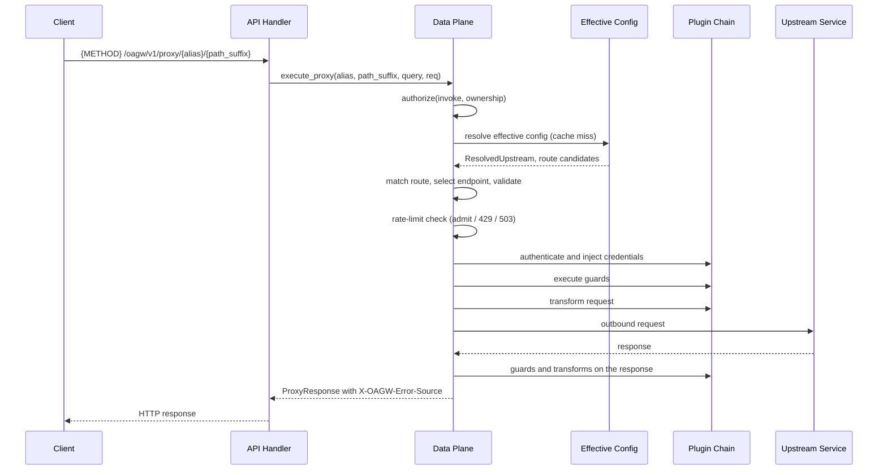

# Feature: Data Plane Proxy

<!-- toc -->

- [1. Feature Context](#1-feature-context)
  - [1.1 Overview](#11-overview)
  - [1.2 Purpose](#12-purpose)
  - [1.3 Actors](#13-actors)
  - [1.4 References](#14-references)
  - [1.5 Feature-Local Deviations from Shared Baselines](#15-feature-local-deviations-from-shared-baselines)
  - [1.6 Explicit Non-Applicability](#16-explicit-non-applicability)
- [2. Actor Flows (CDSL)](#2-actor-flows-cdsl)
  - [Proxy a Request End to End](#proxy-a-request-end-to-end)
  - [Authorize a Proxy Request](#authorize-a-proxy-request)
- [3. Processes / Business Logic (CDSL)](#3-processes--business-logic-cdsl)
  - [Consume the Effective Configuration](#consume-the-effective-configuration)
  - [Match the Route](#match-the-route)
  - [Select the Target Endpoint](#select-the-target-endpoint)
  - [Validate the Inbound Request](#validate-the-inbound-request)
  - [Validate the Body](#validate-the-body)
  - [Transform the Headers](#transform-the-headers)
  - [Execute the Plugin Chain](#execute-the-plugin-chain)
  - [Enforce the Starlark Sandbox](#enforce-the-starlark-sandbox)
  - [Forward the Outbound Request](#forward-the-outbound-request)
  - [Classify the Response and Tag the Error Source](#classify-the-response-and-tag-the-error-source)
  - [Cache the Resolved Configuration](#cache-the-resolved-configuration)
- [4. States (CDSL)](#4-states-cdsl)
- [5. Definitions of Done](#5-definitions-of-done)
  - [Proxy Endpoint Registration and Authorization](#proxy-endpoint-registration-and-authorization)
  - [Effective Configuration Consumption](#effective-configuration-consumption)
  - [Route Matching](#route-matching)
  - [Endpoint Selection](#endpoint-selection)
  - [Inbound Validation](#inbound-validation)
  - [Body Validation](#body-validation)
  - [Header Transformation](#header-transformation)
  - [Plugin Chain Execution](#plugin-chain-execution)
  - [Starlark Sandbox Enforcement](#starlark-sandbox-enforcement)
  - [Outbound Forwarding](#outbound-forwarding)
  - [Error Source Tagging](#error-source-tagging)
  - [Data Plane Configuration Cache](#data-plane-configuration-cache)
  - [Proxy Entities and Layering](#proxy-entities-and-layering)
  - [Latency Budget](#latency-budget)
  - [Colocated Tests](#colocated-tests)
- [6. Acceptance Criteria](#6-acceptance-criteria)

<!-- /toc -->

- [ ] `p1` - **ID**: `cpt-cf-oagw-featstatus-data-plane-proxy-implemented`

<!-- reference to DECOMPOSITION entry -->
- [ ] `p2` - `cpt-cf-oagw-feature-data-plane-proxy`

## 1. Feature Context

### 1.1 Overview

This feature is the request path of the `oagw` gear. It serves `{METHOD} /oagw/v1/proxy/{alias}[/{path_suffix}][?{query}]`, resolves the upstream named by the alias against the tenant chain, matches the route, consumes the effective configuration that `cpt-cf-oagw-feature-hierarchical-config` resolved, selects one endpoint of the upstream, executes the plugin chain that `cpt-cf-oagw-feature-plugin-system` composed, rewrites the headers, validates the body, and forwards the call over the shared outbound client. Every answer it produces carries `X-OAGW-Error-Source: gateway|upstream`, and every answer the gateway itself produces is an RFC 9457 problem body.

### 1.2 Purpose

DECOMPOSITION §2.5 places this feature at the junction of the two branches of the feature graph: it is where the persisted configuration `cpt-cf-oagw-feature-control-plane-config` writes and `cpt-cf-oagw-feature-hierarchical-config` resolves meets the plugin contracts `cpt-cf-oagw-feature-plugin-system` composes. Everything downstream of it — `cpt-cf-oagw-feature-rate-limiting`, `cpt-cf-oagw-feature-cors`, `cpt-cf-oagw-feature-streaming`, and the proxy-reading slice of `cpt-cf-oagw-feature-observability` — hangs off the resolution and the execution context this feature produces, and none of them can be built until a proxy request resolves, forwards, and answers.

This feature delivers the DESIGN §3.2 Alias Resolution (its proxy-time consumption), Headers Transformation, Guard Rules, Body Validation Rules, and Transformation Rules subsections, plus the proxy share of the DESIGN §3.2 Security Considerations and Permissions and Access Control subsections. `cpt-cf-oagw-seq-proxy-flow` (DESIGN §3.5) is the only identified sequence in the design and is the reference flow for §2: resolve the upstream by alias against the tenant chain, resolve the route, inject credentials, execute guards, transform the request, call the upstream, transform the response. §2 is the CDSL statement of that sequence, not a second design for it.

Deliverables:

- The proxy handler for `{METHOD} /oagw/v1/proxy/{alias}[/{path_suffix}][?{query}]`, registered gear-relative on the mount point `cpt-cf-oagw-feature-gear-foundation` created, and routed to the Data Plane by the path-based routing of `cpt-cf-oagw-adr-request-routing`.
- Bearer-token authorization requiring `gts.cf.core.oagw.proxy.v1~:invoke` and an upstream the calling tenant owns or inherits through the chain.
- Consumption of the effective configuration in the order upstream, then route, then tenant, through `cpt-cf-oagw-flow-resolve-effective-config` of `cpt-cf-oagw-feature-hierarchical-config`, with shadowing and with ancestor `enforce` families still carried.
- Route matching by method allowlist, longest path prefix, and priority, honouring `path_suffix_mode`.
- `X-OAGW-Target-Host` endpoint selection with the full behaviour matrix of ADR 0001, including the required-header case for common-suffix aliases and round-robin otherwise.
- Request-time plugin chain execution in the order Auth, Guards, Transform on the request, the upstream call, then Guards and Transform on the response, and Transform on the error, including credential injection into the outbound request.
- Starlark custom-plugin sandbox enforcement: no network I/O, no file I/O, no imports, a per-invocation timeout and a per-invocation memory limit.
- Header transformation: routing headers consumed, hop-by-hop headers stripped, passthrough rules applied, and `Host` or `:authority` replaced with the upstream value.
- Body validation: `Content-Length` consistency, the 100MB hard limit rejected before buffering, `chunked`-only `Transfer-Encoding`, and rejection of CR/LF injection and of conflicting CL/TE combinations.
- Inbound validation of path, query parameters, and headers against the matched route, answered 400 on failure.
- Outbound forwarding over one shared client with adaptive per-host HTTP version detection, one attempt per client request, and no gateway-level re-issue of that request.
- The Data Plane L1 configuration cache with explicit invalidation, and the error-source tagging of every response.
- Colocated tests under `gears/system/oagw/oagw/tests/`.

The feature is delivered in the three phases DECOMPOSITION §2.5 names: route matching and effective-config invocation, then outbound proxying and error semantics, then streaming and body handling. The third phase delivers the body-handling half of this feature only; the connection lifecycles of a stream belong to `cpt-cf-oagw-feature-streaming`.

**Requirements**:

- [ ] `p1` - `cpt-cf-oagw-fr-request-proxy`
- [ ] `p1` - `cpt-cf-oagw-fr-header-transform`
- [ ] `p1` - `cpt-cf-oagw-fr-auth-injection`
- [ ] `p1` - `cpt-cf-oagw-nfr-ssrf-protection`
- [ ] `p1` - `cpt-cf-oagw-nfr-low-latency`
- [ ] `p1` - `cpt-cf-oagw-nfr-input-validation`
- [ ] `p3` - `cpt-cf-oagw-nfr-starlark-sandbox`
- [ ] `p1` - `cpt-cf-oagw-interface-proxy-api`
- [ ] `p1` - `cpt-cf-oagw-usecase-proxy-request`

**Principles**:

- `p1` - `cpt-cf-oagw-principle-no-retry`
- `p1` - `cpt-cf-oagw-principle-no-cache`
- `p1` - `cpt-cf-oagw-principle-error-source`
- `p1` - `cpt-cf-oagw-adr-request-routing`
- `p1` - `cpt-cf-oagw-adr-error-source-distinction`
- `p1` - `cpt-cf-oagw-adr-data-plane-caching`
- `p1` - `cpt-cf-oagw-adr-state-management`

**Constraints**:

- `p1` - `cpt-cf-oagw-constraint-body-limit`
- `p1` - `cpt-cf-oagw-constraint-no-direct-internet`
- `p1` - `cpt-cf-oagw-constraint-https-only`
- `p1` - `cpt-cf-oagw-constraint-toolkit-deploy`

**Design Components**:

- `p1` - `cpt-cf-oagw-component-model`
- `p1` - `cpt-cf-oagw-design-layers`
- `p1` - `cpt-cf-oagw-tech-dependencies`
- `p1` - `cpt-cf-oagw-interface-api`

**Sequence**:

- `p1` - `cpt-cf-oagw-seq-proxy-flow`

**Domain Model Entities**:

- `ProxyContext` — the request-side context this feature builds once and passes down: method, normalized alias, path suffix, query, header map, body reference, calling tenant and subject, and the correlation context.
- `ResolvedUpstream` — the upstream the chain resolved, carrying its identifier, its alias, its alias derivation kind, its endpoint set, its protocol, its effective `enabled` state, its header rules, and the per-family sharing modes and ownership the resolution returned.
- `SelectedEndpoint` — one endpoint of the resolved upstream, carrying its scheme, host, and port, and how it was chosen.
- `MatchedRoute` — the route the matcher selected, carrying its identifier, its priority, its effective match keys, the outbound path, and the route-layer configuration.
- `OutboundRequest` — the request as it leaves the gateway: method, target URL, transformed header map, body, selected endpoint, and the protocol version chosen for the host.
- `ProxyResponse` — the answer returned to the caller: status, transformed header map, body, and the error-source tag.

All six are declared here; DECOMPOSITION §2.5 lists all six under this entry. `EffectiveUpstreamConfig` and `EffectiveRouteConfig` are consumed from `cpt-cf-oagw-feature-hierarchical-config` and are not redeclared, and the four plugin-execution contexts `AuthContext`, `RequestContext`, `ResponseContext`, and `ErrorContext` are consumed from `cpt-cf-oagw-feature-gear-foundation`, which is their single definition point (§1.5).

**Data**:

- None. DECOMPOSITION §2.5 declares no table for this feature, and it creates, reads, and writes no table of its own. The one column it writes is `last_used_at` on the plugin row, which `cpt-cf-oagw-feature-plugin-system` persists and owns (§1.5).

**API**:

- `{METHOD} /oagw/v1/proxy/{alias}[/{path_suffix}][?{query}]`
- POST /oagw/v1/proxy/api.openai.com/v1/chat/completions (single-endpoint upstream, no target header needed)
- GET /oagw/v1/proxy/my-service/v1/status with `X-OAGW-Target-Host` selecting one endpoint in a pool

The three lines are the DECOMPOSITION §2.5 API list restated in the gear-relative form of DECOMPOSITION §1.3(1); this feature invents no path, no method, and no response shape that the list does not name.

### 1.3 Actors

| Actor | Role in Feature |
|-------|-----------------|
| `cpt-cf-oagw-actor-app-developer` | Sends the proxy request with a bearer token and an alias, and receives either the upstream's response or a gateway answer tagged with its error source. PRD §5.2 names this actor for `cpt-cf-oagw-fr-request-proxy`, and PRD §8 names it the actor of `cpt-cf-oagw-usecase-proxy-request`. |
| `cpt-cf-oagw-actor-upstream-service` | Receives the outbound request the gateway builds and answers it; it is the only actor this feature contacts over a network, and it never sees a routing header, a hop-by-hop header, or the caller's bearer token as a passthrough. The credential it does see is the one the chain injects or a `headers.request` `set` rule configures, never the caller's own token forwarded unmodified (`cpt-cf-oagw-algo-header-transform`). |

Two actors participate indirectly and are named here so their absence from the table is a record and not a gap:

- `cpt-cf-oagw-actor-cred-store` answers the resolve call that turns a `cred://` reference into material. That call belongs to `cpt-cf-oagw-algo-credential-resolution` of `cpt-cf-oagw-feature-plugin-system`, which the chain this feature executes invokes; DECOMPOSITION §1.5 lists the credential store under `cpt-cf-oagw-feature-plugin-system` alone, so it is not an actor of this feature.
- `cpt-cf-oagw-actor-types-registry`, `cpt-cf-oagw-actor-platform-operator`, and `cpt-cf-oagw-actor-tenant-admin` issue no call this feature answers. The type catalogue was provisioned once at startup by `cpt-cf-oagw-feature-gear-foundation`, and no request-time path registers or reads a type. The two management actors have no proxy surface; DECOMPOSITION §1.5 lists neither against `cpt-cf-oagw-feature-data-plane-proxy`, and the bearer token a management actor's tenant happens to resolve to is treated exactly like any other caller's.

### 1.4 References

- **PRD**: [PRD.md](../PRD.md)
- **Design**: [DESIGN.md](../DESIGN.md)
- **Dependencies**: `cpt-cf-oagw-feature-hierarchical-config` — the effective configuration this feature consumes, the `EffectiveUpstreamConfig` and `EffectiveRouteConfig` result types, and the alias input this feature normalizes before resolving, by calling `cpt-cf-oagw-algo-alias-normalize` of `cpt-cf-oagw-feature-gear-foundation`, since that feature delivers no alias normalization of its own; and `cpt-cf-oagw-feature-plugin-system` — the three plugin contracts, the three registries, the composed per-phase sub-chains, the credential resolution, and the token cache the chain execution invokes (DECOMPOSITION §3).

Supporting sources this feature stays consistent with:

- [ADR/0001-request-routing.md](../ADR/0001-request-routing.md) (`cpt-cf-oagw-adr-request-routing`) — path-based routing that sends `/oagw/v1/proxy/*` to the Data Plane, the proxy API examples, and the `X-OAGW-Target-Host` behaviour matrix this feature implements row for row in §3.
- [ADR/0002-plugin-system.md](../ADR/0002-plugin-system.md) (`cpt-cf-oagw-adr-plugin-system`), [ADR/0008-oauth2-client-credentials-auth-plugin.md](../ADR/0008-oauth2-client-credentials-auth-plugin.md) (`cpt-cf-oagw-adr-oauth2-client-credentials-auth-plugin`), and [ADR/0009-required-headers-guard-plugin.md](../ADR/0009-required-headers-guard-plugin.md) (`cpt-cf-oagw-adr-required-headers-guard-plugin`) — the chain this feature executes. This feature consumes their contracts, their execution order, and their phase-specific rejection statuses, and re-specifies none of them.
- [ADR/0005-data-plane-caching.md](../ADR/0005-data-plane-caching.md) (`cpt-cf-oagw-adr-data-plane-caching`) — the L1 cache layer, its key shapes, its lazy population, and the invalidation ordering on a configuration write.
- [ADR/0006-state-management.md](../ADR/0006-state-management.md) (`cpt-cf-oagw-adr-state-management`) — the Data Plane's statelessness, its small L1 cache with explicit invalidation, the shared outbound client, and the request flow with caching that §3's first routine follows.
- [ADR/0007-error-source-distinction.md](../ADR/0007-error-source-distinction.md) (`cpt-cf-oagw-adr-error-source-distinction`) — the header values, the problem-details rule for gateway errors, the passthrough rule for upstream errors, and the target-host error examples.
- [ADR/0004-cors.md](../ADR/0004-cors.md) — the contrasting precedent behind the two CORS rows of the DESIGN §3.2 Guard Rules table, both of which belong to `cpt-cf-oagw-feature-cors` and are named in §1.6 rather than implemented here.
- [schemas/upstream.v1.schema.json](../schemas/upstream.v1.schema.json) and [schemas/route.v1.schema.json](../schemas/route.v1.schema.json) — the frozen shapes of what this feature consumes: the endpoint `scheme`, `host`, and `port`, the `headers.request` and `headers.response` rule sets with their `passthrough` modes, the `match.http` keys with their `query_allowlist` and `path_suffix_mode`, and the `protocol` enum. Both are frozen inputs this run does not edit.
- [config/e2e-local.yaml](../../../../../config/e2e-local.yaml) — the graded configuration. Its `oagw.config` block sets `proxy_timeout_secs: 2`, `allow_http_upstream: true`, and `ssrf_policy.enabled: false`, and sets neither token-cache key, so both take their ADR 0008 defaults. Its `api-gateway` block sets `defaults.body_limit_bytes: 64000000` and denies the nil-tenant token with a 403. Its `e2e-features.txt` build list names `oagw`, so the gear is compiled into the graded build. No upstream, route, or plugin is declared in it, so every graded proxy request resolves against configuration written through the management API at run time.

**Run-level assumptions** — premises this feature relies on that come from the platform runtime rather than from PRD, DESIGN, the ADRs, or DECOMPOSITION. Each states what fails if the premise does not hold:

- Assumption: the platform middleware authenticates the bearer token, resolves the calling tenant and subject, and enforces `gts.cf.core.oagw.proxy.v1~:invoke` before the request reaches this feature's handler. `config/e2e-local.yaml` sets `api-gateway.auth_disabled: false` and `require_auth_by_default: true`, and DESIGN §3.3 names `toolkit-auth` as the inbound mechanism, but no supplied document states that the proxy permission is enforced by the platform rather than by the gear. If it is not, the handler **MUST** enforce it before any resolution runs, and a request that reaches the resolution step with no resolved tenant **MUST** fail closed with the platform RFC 9457 500 problem shape and never be forwarded.
- Assumption: the platform api-gateway applies `defaults.body_limit_bytes` from `config/e2e-local.yaml`, which in the graded configuration is 64,000,000 bytes — below the 100MB hard limit of `cpt-cf-oagw-constraint-body-limit`. If that platform limit is raised above the hard limit, this feature's own check becomes the binding one and the 413 answer of §3 becomes reachable; if it is removed, this feature **MUST** still reject before buffering, because no other layer enforces `cpt-cf-oagw-constraint-body-limit`.
- Assumption: the platform tenant-resolver supplies the calling tenant's ancestor chain, exactly as `cpt-cf-oagw-feature-hierarchical-config` assumes for the same walk. If the chain is unavailable, unordered, or cyclic, the resolution fails closed and this feature answers the platform 500 problem shape; it **MUST NOT** forward a request whose chain it cannot order, because an unordered chain cannot decide who shadows whom.
- Assumption: the external `pingora` dependency of `cpt-cf-oagw-tech-dependencies` supplies the shared outbound client, its connection pooling, and ALPN-based protocol negotiation on the TLS handshake, so the adaptive per-host detection of DESIGN §3.2 Security Considerations is a cache over a capability the connector already has. If it does not, this feature **MUST** fall back to HTTP/1.1 for every host and record the fallback; that is a performance loss against `cpt-cf-oagw-nfr-low-latency` and never a correctness one, so the request still forwards.
- Assumption: the notification of a successful configuration write reaches this feature's flush routine in the same process, because the graded posture is the single-executable branch of `cpt-cf-oagw-constraint-toolkit-deploy` and the write path and this cache share one address space. The two acts have different owners: the notification is the write path's, and the flush is this feature's, executed by `cpt-cf-oagw-algo-dp-cache` before the write's response is produced (§1.5). If the runtime offers no such in-process ordering, that ordering **MUST** still be produced before the write's response is emitted — the same ordering `cpt-cf-oagw-feature-control-plane-config` already applies to its own cache — and this feature **MUST NOT** fall back to a periodic sync, which DECOMPOSITION §1.3(10) dispositions.
- Assumption: the Starlark interpreter the plugin source is stored for is reachable from the Data Plane and exposes per-invocation resource limits it can apply, with no network, file, or import capability. If it cannot enforce a limit, this feature **MUST** refuse to execute the plugin and answer through the `PluginNotFound` variant of the foundation catalogue (§1.5); it **MUST NOT** run untrusted code with a limit it cannot apply.
- Assumption: the correlation context is supplied by the platform, and `cpt-cf-oagw-feature-observability` derives the `trace_id` an error body carries from it. If no context is available, the `trace_id` extension field **MUST** be omitted rather than synthesized, because an invented identifier correlates nothing.

### 1.5 Feature-Local Deviations from Shared Baselines

| Deviation | Rationale | Review owner | Validation performed |
|-----------|-----------|--------------|----------------------|
| The proxy path is registered gear-relative at `/oagw/v1/proxy/...` with no `/api` prefix. | DECOMPOSITION §1.3(1) corrects the `/api/oagw/v1/...` tabulation in PRD §7.1 and DESIGN §3.3: `/api` is an operator gateway prefix, not a path this gear serves. Every path in this document is the gear-relative form, and the three API lines above are the restatement of the DECOMPOSITION §2.5 list, not a new design. | The controller of this run. | Accepted by the semantic review of this run; `cfs validate --artifact` clean. |
| The 100MB hard limit of `cpt-cf-oagw-constraint-body-limit` is read as 100,000,000 bytes. | DESIGN §3.2 Body Validation Rules states the row as "Hard limit 100MB" and the constraint states "Body size hard limit: 100MB"; neither states a byte count, and the 413 answer is only testable once one exists. The decimal reading matches the one byte-exact body limit the graded configuration expresses anywhere — `config/e2e-local.yaml`'s `defaults.body_limit_bytes: 64000000` — and is the stricter of the two readings, which is the safe direction for a guard whose purpose is preventing resource exhaustion. | The controller of this run. | Accepted by the semantic review of this run; `cfs validate --artifact` clean. |
| Route `priority` is compared as an ascending precedence order: the smaller value wins when two candidate routes match the same longest path prefix. | DESIGN §3.1 declares `priority` as an `Int` and DESIGN §3.6 names it in the match-determinism invariant and in the `(upstream_id, method, longest path prefix, priority)` lookup, but no supplied document states which direction wins. The direction is the whole contract, because the value is only ever compared and never interpreted, so it is recorded here rather than left to the implementation. `cpt-cf-oagw-algo-match-uniqueness` of `cpt-cf-oagw-feature-control-plane-config` makes the comparison total by forbidding two enabled routes of one upstream from sharing `(path, priority, method)`. | The controller of this run. | Accepted by the semantic review of this run; `cfs validate --artifact` clean. |
| Two cache sizes DESIGN and ADR 0006 state are carried as named constants and add no `OagwConfig` key: the Data Plane L1 entry count of 1000, and the per-host protocol cache entry TTL of 1 hour. | ADR 0006 fixes the Data Plane L1 at "1000 entries, no TTL, explicit invalidation" and adds that it is "configurable via environment variable", while the `OagwConfig` surface DECOMPOSITION §2.1 declares closes at five keys — `proxy_timeout_secs`, `allow_http_upstream`, `ssrf_policy`, `token_cache_ttl_secs`, `token_cache_capacity` — and `cpt-cf-oagw-feature-gear-foundation` owns that surface and names no cache key. DESIGN §3.2 Security Considerations fixes the protocol cache entry TTL at 1 hour. Widening the surface here would give one configuration surface two owners, so both values are constants with their sourced values, and the configurability ADR 0006 mentions is not delivered. | The controller of this run. | Accepted by the semantic review of this run; `cfs validate --artifact` clean. |
| The periodic-sync alternative of ADR 0005 and ADR 0006 is dispositioned and not delivered: the Data Plane L1 cache is invalidated explicitly, in process, on the notification the configuration write path issues, and carries no TTL and no background sync. | DECOMPOSITION §1.3(10) assigns this disposition to this feature and DECOMPOSITION §1.3(7) authorizes the single-exec branch that makes it possible. ADR 0005's invalidation step lists two mechanisms for the Data Plane flush — "notified by CP or periodic sync" — and ADR 0006's own mitigation names "explicit cache invalidation from CP on config writes (no TTL; entries persist until invalidated)" as the chosen one. Explicit invalidation keeps the staleness window bounded by the write itself, where a sync would leave an unbounded window and a polling cost on a path whose budget is `cpt-cf-oagw-nfr-low-latency`. | The controller of this run. | Accepted by the semantic review of this run; `cfs validate --artifact` clean. |
| The post-write invalidation of the Data Plane L1 cache is split at a seam this document states: the notification of a successful write is `cpt-cf-oagw-feature-control-plane-config`'s act, and the flush itself is this feature's, executed by `cpt-cf-oagw-algo-dp-cache` before the write's response is produced. | `cpt-cf-oagw-feature-control-plane-config` records in its own reference list that the Data Plane L1 cache and its post-write invalidation belong to `cpt-cf-oagw-feature-data-plane-proxy`, so its write path notifies this feature's flush routine in process rather than flushing the cache itself. ADR 0005's Cache Invalidation step reads "(5) DP flushes its own L1 cache (notified by CP or periodic sync)" and ADR 0006's DP State scopes the cache to the upstream and route configurations, so the act is the Data Plane's and the trigger is the Control Plane's. DECOMPOSITION §1.3(10)'s no-periodic-sync posture is what makes the in-process notification the only mechanism, which is the same call-direction seam `cpt-cf-oagw-feature-plugin-system` records for the binding routines this feature invokes. | The controller of this run. | Accepted by the semantic review of this run; `cfs validate --artifact` clean. |
| ADR 0005's Cache Keys list is narrowed here to the two shapes the Data Plane L1 actually holds — `upstream:{tenant_id}:{alias}` and `route:{upstream_id}:{method}:{path_prefix}` — and its third shape, `plugin:{plugin_id}`, is not cached by this feature. | ADR 0006's DP State scopes the Data Plane L1 to the upstream and route configurations resolved from `cpt-cf-oagw-feature-control-plane-config`, and no step of §3 builds, reads, or inserts a plugin key: the plugin definitions the chain resolves live in the registry and store `cpt-cf-oagw-feature-plugin-system` owns, and the composed chain is built per resolution and never cached. Carrying a key shape with no population path would state a cache entry no code path produces. | The controller of this run. | Accepted by the semantic review of this run; `cfs validate --artifact` clean. |
| The single `proxy_timeout_secs` deadline is applied to both the connection-establishment phase and the request/response exchange phase of one outbound call, and the two catalogue rows that answer a breach are `ConnectionTimeout` for the first and `RequestTimeout` for the second. | The `OagwConfig` surface closes at five keys and carries exactly one deadline, while DESIGN §3.3 tabulates two 504 rows for the two phases of the one bounded operation. Splitting the deadline into two keys is not available, and answering both phases with one row would leave the other catalogue row unreachable. The third 504 row, `IdleTimeout`, answers a stalled stream and belongs to `cpt-cf-oagw-feature-streaming`, which owns the stream lifecycle. | The controller of this run. | Accepted by the semantic review of this run; `cfs validate --artifact` clean. |
| This feature writes `last_used_at` on the plugin row, off the request's latency budget, and the write feeds no decision. | The DESIGN §3.1 Plugin class declares the column, and DECOMPOSITION §2.4 places plugin execution on a live request with this feature; `cpt-cf-oagw-feature-plugin-system` records in its own §1.5 that it never writes it, naming this feature as the only writer and objecting that a proxy-path write would put a Control Plane write on the Data Plane hot path. The objection is met by the placement rather than by dropping the write: it is issued after the response is produced, outside the budget `cpt-cf-oagw-nfr-low-latency` sets, and coalesced so concurrent requests to one plugin produce one write. It feeds no garbage-collection decision, because that feature derives eligibility from the reference scan alone and its own DoD forbids depending on this column. | The controller of this run. | Accepted by the semantic review of this run; `cfs validate --artifact` clean. |
| A plugin execution failure that is not a guard verdict — a sandbox limit breach, a per-invocation timeout, or a raised error — is answered through the `ProtocolError` variant of the foundation catalogue, and a plugin that cannot be executed at all in this deployment is answered through `PluginNotFound`. | DESIGN §3.3 tabulates ten 5xx rows — `SecretNotFound` at 500, `ProtocolError`, `DownstreamError`, and `StreamAborted` at 502, `LinkUnavailable`, `CircuitBreakerOpen`, and `PluginNotFound` at 503, and `ConnectionTimeout`, `RequestTimeout`, and `IdleTimeout` at 504 — and tabulates no row for a plugin that failed to run: each of the other nine describes a state this case is not. `ProtocolError` is the non-retriable 502 row whose description is generic enough for a gateway-side contract violation, and `cpt-cf-oagw-feature-plugin-system` already maps the response-phase guard rejection to it, so the two features answer the same class of failure with the same row. `PluginNotFound` is the 503 row for a plugin the gateway cannot run, which is the answer `cpt-cf-oagw-algo-chain-compose` produces for a reference that resolves to no implementation. Inventing a variant is outside this feature's authority; the catalogue is `cpt-cf-oagw-feature-gear-foundation`'s. | The controller of this run. | Accepted by the semantic review of this run; `cfs validate --artifact` clean. |
| No credential refresh on a rejected request is delivered by this run: an upstream 401 triggers no refresh, no retry, and no re-send, and is answered under the error-source classification of `cpt-cf-oagw-algo-response-classify`. | DESIGN §3.2 Retry Policy states the intent — "Auth plugins handle token refresh on 401, but do not retry the original request" — while ADR 0008 defers the implementation, because the `AuthPlugin` trait returns no signal a Data Plane could use to decide whether a retry with fresh credentials is meaningful. `cpt-cf-oagw-feature-plugin-system` records the same deferral from the plugin side and implements no retry orchestration, so this feature consumes that posture and builds no refresh branch. The refresh an auth plugin does perform is the token-cache refresh of credential preparation, which happens before the send and never after a rejection. | The controller of this run. | Accepted by the semantic review of this run; `cfs validate --artifact` clean. |
| A proxy request against an upstream whose effective `enabled` state is false is answered 503 through the `LinkUnavailable` variant. | PRD §8's alternative flow for `cpt-cf-oagw-usecase-proxy-request` states "Upstream disabled: Return 503 with gateway error type" and names no variant. DESIGN §3.3 tabulates three 503 rows, and `LinkUnavailable` is the only one that describes the target rather than the circuit breaker or a plugin. It is marked retriable in the catalogue, which is correct: a disabled upstream is a maintenance state an operator lifts. | The controller of this run. | Accepted by the semantic review of this run; `cfs validate --artifact` clean. |
| A proxy attempt against a `wt`-scheme upstream is answered 502 through the `ProtocolError` variant with `X-OAGW-Error-Source: gateway`. | DECOMPOSITION §1.3(2) records the scope reduction — no feature carries WebTransport behaviour — and states the answer class without naming a variant. The upstream and the route both resolve, so a not-found answer would be false, and the request names a transport the gateway does not implement, which is the `ProtocolError` row's subject. | The controller of this run. | Accepted by the semantic review of this run; `cfs validate --artifact` clean. |
| An upstream whose `protocol` is the gRPC value produces no matching route, and the answer is the ordinary 404 `RouteNotFound`. | DESIGN §3.1 and DECOMPOSITION §1.3(4) state that no gRPC proxy code path is implemented or reachable, and ADR 0001 selects the match keys from `upstream.protocol` — gRPC keys for a gRPC upstream. This feature evaluates HTTP match keys only, so it evaluates no match key at all for such an upstream and falls through to the same no-match answer any unmatched HTTP request gets. `cpt-cf-oagw-feature-control-plane-config` records the same posture from the write side: a gRPC-only route is stored and is unreachable at proxy time. | The controller of this run. | Accepted by the semantic review of this run; `cfs validate --artifact` clean. |
| A non-error response carries `X-OAGW-Error-Source: upstream`. | ADR 0007 requires the header on every response, including successes, and assigns a value only to the two error classes. The value that keeps the header a single statement about who produced the body is `upstream`: a success body is as much an upstream passthrough as an upstream error body is, and the ADR defines its `gateway` value only for the responses whose body the gateway itself produced, which are the problem bodies. DECOMPOSITION §2.5's "on every response" is satisfied without making the header carry a third value no source names. | The controller of this run. | Accepted by the semantic review of this run; `cfs validate --artifact` clean. |
| Route matching is split across two features and this document states the split: the chain-level selection of which route candidates contribute is `cpt-cf-oagw-feature-hierarchical-config`'s, and the method allowlist, longest path prefix, priority, and `path_suffix_mode` evaluation over that candidate set is this feature's. | DECOMPOSITION §2.5 assigns this feature route matching and simultaneously assigns the hierarchy walk and the effective-config resolution to `cpt-cf-oagw-feature-hierarchical-config`, whose `cpt-cf-oagw-flow-resolve-effective-config` step 4 already resolves the matched route along the chain "with the descendant's route taking priority". Without the split, one route selection would have two owners. The candidate set is the input to `cpt-cf-oagw-algo-route-match` here, and the per-field merge strategies that produce it are `cpt-cf-oagw-algo-field-family-merge`'s and are not restated. | The controller of this run. | Accepted by the semantic review of this run; `cfs validate --artifact` clean. |
| The outbound response header rules of `headers.response` are applied by this feature, and the transfer mode of the body is not. | The shipped upstream schema declares `headers.response` with `set`, `add`, and `remove`, and DECOMPOSITION §2.5 assigns header transformation to this feature, so the rules are this feature's to apply. DESIGN §3.2's Headers Transformation subsection tabulates the inbound direction only — `headers.response` appears nowhere in DESIGN — so the response direction is carried by the schema and the decomposition entry rather than by DESIGN. DECOMPOSITION §3 makes `cpt-cf-oagw-feature-streaming` a consumer of this feature because "it changes how the proxy response body is transferred, not what is resolved", so the body transfer mode is that feature's and the header mutation stays here. | The controller of this run. | Accepted by the semantic review of this run; `cfs validate --artifact` clean. |
| Scheme handling is split across two features and this document states the split: which scheme literals a configured endpoint may carry is decided at write time by `cpt-cf-oagw-feature-control-plane-config`, and whether a plaintext connection is opened is decided at dial time here. | DECOMPOSITION §1.3(2) separates the two questions and assigns only the second to `allow_http_upstream`'s proxy-time effect; `cpt-cf-oagw-feature-control-plane-config` records the first side in its own §1.5. Both are checks against `cpt-cf-oagw-constraint-https-only`, and neither substitutes for the other: a stored `http` endpoint that the flag forbids at dial time is never dialed, and a dial-time check that read the stored scheme alone would bypass the flag. The graded configuration sets the flag to `true`, so a stored `http` endpoint is dialed in plaintext there. | The controller of this run. | Accepted by the semantic review of this run; `cfs validate --artifact` clean. |
| This feature's tests are colocated at `gears/system/oagw/oagw/tests/` instead of `testing/e2e/gears/oagw/`. | DECOMPOSITION §1.3(3) reserves `testing/e2e/gears/oagw/` for the acceptance suite; every unit and integration test this decomposition produces lives with the crate. This is the same deviation `cpt-cf-oagw-feature-gear-foundation`, `cpt-cf-oagw-feature-control-plane-config`, `cpt-cf-oagw-feature-hierarchical-config`, and `cpt-cf-oagw-feature-plugin-system` record in their own §1.5 tables, restated here because the tests it governs include this feature's. | The controller of this run. | Accepted by the semantic review of this run; `cfs validate --artifact` clean. |
| The proxy flow invokes the rate-limit check of `cpt-cf-oagw-feature-rate-limiting` ahead of the composed chain and returns the 429 or 503 that check produced, with its error-source tag, without executing the chain or building an outbound request. | ADR 0006's request flow with caching orders the proxy steps as the auth plugin, then "Check rate limiter (DP-owned)", then the guard and transform plugins, then the outbound call; the chain that `cpt-cf-oagw-algo-chain-execute` runs bundles the auth plugin with the guards and the transforms into one call, so the position ADR 0006 fixes is realized ahead of the composed chain. A refused request therefore costs no plugin execution at all, which is the reason the invocation sits where it does and not inside the chain it precedes. | The controller of this run. | Accepted by the semantic review of this run; `cfs validate --artifact` clean. |

### 1.6 Explicit Non-Applicability

The areas below apply to the gear as a whole but not to this feature. Each is stated here so the omission is a recorded decision rather than a silent gap, and each names the feature that does own it.

- **The hierarchy walk, alias shadowing, and the per-field merge strategies.** DECOMPOSITION §2.5 places them in `cpt-cf-oagw-feature-hierarchical-config`, and this feature only consumes their result at proxy time through `cpt-cf-oagw-flow-resolve-effective-config`. `cpt-cf-oagw-algo-tenant-chain-walk`, `cpt-cf-oagw-algo-alias-shadow-resolve`, and `cpt-cf-oagw-algo-field-family-merge` are that feature's routines; §3 of this document calls them and restates no merge strategy row.
- **Token-bucket mechanics and 429 answers.** `cpt-cf-oagw-feature-rate-limiting` owns them, and DECOMPOSITION §3 makes it a consumer of this feature because its check runs inside the resolved proxy context. The ancestor `enforce` rate-limit families the resolution returns are carried on `ResolvedUpstream` for it and applied by it; this feature evaluates no limit and answers no 429.
- **CORS preflight and origin enforcement.** `cpt-cf-oagw-feature-cors` owns both, per ADR 0004. The two CORS rows of the DESIGN §3.2 Guard Rules table are therefore not implemented by `cpt-cf-oagw-algo-inbound-validate`; the preflight `OPTIONS` answer does not require upstream resolution at all, and the origin and method enforcement happens after resolution and before forwarding, on this handler's path but not in this feature.
- **SSE and WebSocket connection lifecycles.** `cpt-cf-oagw-feature-streaming` owns them, including the suspension of the `Upgrade` and `Connection` strip rule for a handshake that ADR 0004's host ADR set and DECOMPOSITION §2.7 describe. The strip rule §3 applies here is the unconditional one for a plain request/response exchange, and the idle-timeout 504 of a stalled stream is that feature's answer, not `RequestTimeout`.
- **Metrics emission and audit log formatting.** `cpt-cf-oagw-feature-observability` owns the correlation identifier, the structured audit record, and the Prometheus surface at `/oagw/v1/metrics`. This feature supplies the request lifecycle those records describe and formats none of them.
- **gRPC proxying and WebTransport.** Both are out of scope per DECOMPOSITION §1.3(4); the answers a caller receives are recorded in §1.5.
- **Response caching and automatic request retries.** `cpt-cf-oagw-principle-no-cache` and `cpt-cf-oagw-principle-no-retry` both forbid them, and PRD §4.2 places both outside the gear. The Data Plane L1 cache of §3 holds configuration and holds no response body, which is the distinction the two principles rest on.
- **DNS and IP-pinning rule implementation details.** PRD §4.2 and DECOMPOSITION §2.5 place them out of scope. What this feature does is decide whether the dial-time evaluation of that policy runs at all, from `ssrf_policy.enabled`, and answer a refused resolution as a gateway error; the rules themselves are not specified here.
- **The plugin contracts, the registries, the chain composition, and credential resolution.** `cpt-cf-oagw-feature-plugin-system` owns all of them, per ADR 0002, ADR 0008, and ADR 0009. `cpt-cf-oagw-algo-chain-execute` below invokes the composed sub-chains that feature delivers and owns nothing about how they were built; the one obligation it adds is the sandbox enforcement of `cpt-cf-oagw-nfr-starlark-sandbox`, which that feature explicitly does not perform.
- **Persistence.** DECOMPOSITION §2.5 declares no table for this feature, and `cpt-cf-oagw-db-schema` is fully claimed by `cpt-cf-oagw-feature-control-plane-config` and `cpt-cf-oagw-feature-plugin-system`. The `last_used_at` write of §1.5 goes through the latter's table and creates none.
- **Events, health, and readiness.** No event is published or consumed here, and no readiness signal is produced. Gear readiness belongs to `cpt-cf-oagw-state-gear-foundation-lifecycle`, and the audit and metric records that describe a proxy request belong to `cpt-cf-oagw-feature-observability`.
- **Rollout, rollback, versioning, localization, accessibility, and compliance.** The gear is one configuration item and one release unit (DECOMPOSITION §1.4), so this feature ships no rollout of its own. Every identifier it reads is fixed at `.v1` and the breaking-change policy of `cpt-cf-oagw-interface-proxy-api` is a PRD-level declaration, not a mechanism here. Problem `title` and `detail` are English protocol strings from the foundation's mapping, and there is no actor-facing rendered surface here to make accessible either: the feature emits protocol bodies and headers and no interface an accessibility requirement could apply to. No credential material is persisted, logged, or echoed, and `cpt-cf-oagw-nfr-credential-isolation` governs what the chain does with the material it resolves.

## 2. Actor Flows (CDSL)

The flows below follow the proxy request flow of `cpt-cf-oagw-seq-proxy-flow` (DESIGN §3.5) and the path-based routing of `cpt-cf-oagw-adr-request-routing`, which sends `/oagw/v1/proxy/*` to the Data Plane. The endpoint is gear-relative per DECOMPOSITION §1.3(1), and the `{alias}` path segment is a routing key, not an identifier: it resolves through the tenant chain, which is why a caller addresses an upstream it does not own only when an ancestor shares it.

**Use cases**: `cpt-cf-oagw-usecase-proxy-request`

`cpt-cf-oagw-usecase-configure-upstream` and `cpt-cf-oagw-usecase-configure-route` are `cpt-cf-oagw-feature-control-plane-config`'s, `cpt-cf-oagw-usecase-sse-streaming` is `cpt-cf-oagw-feature-streaming`'s, and `cpt-cf-oagw-usecase-rate-limit-exceeded` is `cpt-cf-oagw-feature-rate-limiting`'s; none is restated here. The `sse-streaming` use case is reached through the endpoint this feature registers, which is why DECOMPOSITION §3 makes that feature a consumer of this one.

### Proxy a Request End to End

- [x] `p1` - **ID**: `cpt-cf-oagw-flow-proxy-request`

**Actor**: `cpt-cf-oagw-actor-app-developer`

**Success Scenarios**:

- A single-endpoint upstream is reached by alias with no `X-OAGW-Target-Host` header at all; the endpoint is selected without load balancing and the header, when supplied anyway, is validated and ignored (ADR 0001 matrix rows 1 and 2).
- A multi-endpoint upstream with an explicit alias routes to the endpoint the `X-OAGW-Target-Host` header names, bypassing load balancing (ADR 0001 matrix row 4).
- A multi-endpoint upstream with an explicit alias and no header is distributed round-robin across its endpoints (ADR 0001 matrix row 3).
- A multi-endpoint upstream whose alias was derived from a common suffix routes to the endpoint the required `X-OAGW-Target-Host` header names (ADR 0001 matrix row 6).
- A request whose method, path suffix, query parameters, and headers all pass validation against the matched route is forwarded with the caller's method, the caller's allowed query parameters, and a header map that carries no routing header and no hop-by-hop header.
- A second request for the same tenant, alias, method, and path prefix is served from the Data Plane L1 cache without a second resolution call (ADR 0006 request flow with caching).
- A response from the upstream is passed through with its body, status, and content type intact, with `headers.response` rules applied, and with `X-OAGW-Error-Source: upstream` (§1.5).
- A request the rate-limit check of `cpt-cf-oagw-feature-rate-limiting` admits is forwarded exactly as an unconfigured one would be, and the check adds no step the caller observes (§1.5).

**Error Scenarios**:

- The bearer token is missing or invalid: 401; it lacks `gts.cf.core.oagw.proxy.v1~:invoke`: 403.
- No candidate upstream exists anywhere in the calling tenant's chain, or no route of the resolved upstream matches the method and path: 404 with the `RouteNotFound` variant (`gts.cf.core.errors.err.v1~cf.oagw.route.not_found.v1`).
- The effective `enabled` state of the resolved upstream is false: 503 with the `LinkUnavailable` variant (§1.5).
- The rate-limit check of `cpt-cf-oagw-feature-rate-limiting` refuses the request: 429 with the `RateLimitExceeded` variant and the header set that feature's strategy produces, or 503 with the `CircuitBreakerOpen` variant when its breaker is not admitting; the chain is not executed and no outbound request is built (§1.5).
- A multi-endpoint upstream with a common-suffix alias is addressed without the required header: 400 with the `MissingTargetHost` variant (`gts.cf.core.errors.err.v1~cf.oagw.routing.missing_target_host.v1`).
- The `X-OAGW-Target-Host` value is malformed, or matches no configured endpoint: 400 with the `InvalidTargetHost` or `UnknownTargetHost` variant.
- A request body exceeds the 100MB hard limit, has a `Content-Length` that is not a valid integer or does not match the actual size, declares a `Transfer-Encoding` other than `chunked`, combines `Content-Length` with `Transfer-Encoding`, or injects CR or LF into a header value: 400 with the `ValidationError` variant for every case except the size breach, which is 413 with the `PayloadTooLarge` variant.
- The path suffix is supplied to a route whose `path_suffix_mode` is `disabled`, or a query parameter outside the route's `query_allowlist` is supplied: 400 with the `ValidationError` variant.
- A bound plugin fails to execute, or a guard rejects the request: 502 with the `ProtocolError` variant, or 400 in the request phase of a guard rejection (§1.5, ADR 0009).
- The connection cannot be established within the deadline, or the exchange exceeds it: 504 with the `ConnectionTimeout` or `RequestTimeout` variant.
- The upstream answers with a failure status: that status and body pass through unchanged with `X-OAGW-Error-Source: upstream`, and no gateway error is produced.

**Steps**:

1. [x] - `p1` - Actor issues the proxy request carrying the method, the alias, an optional path suffix, an optional query, and any headers including `Authorization` and optionally `X-OAGW-Target-Host` - `inst-px-issue`
2. [x] - `p1` - API: `{METHOD} /oagw/v1/proxy/{alias}[/{path_suffix}][?{query}]` — the platform middleware authenticates the bearer token and resolves the calling tenant and subject, and the handler classifies the request to the Data Plane by path - `inst-px-api`
3. [x] - `p1` - `cpt-cf-oagw-algo-alias-normalize` normalizes the alias, so a proxy resolution can never disagree with a stored alias about shape, case, or a trailing dot - `inst-px-normalize`
4. [x] - `p1` - `cpt-cf-oagw-flow-proxy-authorize` enforces `gts.cf.core.oagw.proxy.v1~:invoke` and the ownership or ancestor-sharing condition before any resolution runs - `inst-px-authorize`
5. [x] - `p1` - `cpt-cf-oagw-algo-resolve-consume` produces the `ResolvedUpstream` and the route candidate set, from the Data Plane L1 cache on a hit and through `cpt-cf-oagw-flow-resolve-effective-config` of `cpt-cf-oagw-feature-hierarchical-config` on a miss - `inst-px-resolve`
6. [x] - `p1` - **IF** the candidate set is empty, or the effective `enabled` state is false, or the resolved upstream's protocol is the gRPC value - `inst-px-resolve-if`
   1. [x] - `p1` - **RETURN** 404 with the `RouteNotFound` variant for an empty candidate set or an unmatched route, or 503 with the `LinkUnavailable` variant for a disabled upstream (§1.5); no outbound request is built - `inst-px-resolve-return`
7. [x] - `p1` - **ELSE** - `inst-px-resolve-else`
   1. [x] - `p1` - `cpt-cf-oagw-algo-route-match` selects the `MatchedRoute` from the candidate set by method allowlist, longest path prefix, priority, and `path_suffix_mode` - `inst-px-match`
8. [x] - `p1` - **IF** no candidate route matches - `inst-px-match-if`
   1. [x] - `p1` - **RETURN** 404 with the `RouteNotFound` variant; the answer names the upstream that resolved, never a candidate that did not - `inst-px-match-return`
9. [x] - `p1` - **ELSE** - `inst-px-match-else`
   1. [x] - `p1` - `cpt-cf-oagw-algo-endpoint-select` produces the `SelectedEndpoint` from the behaviour matrix of ADR 0001, reading and then stripping `X-OAGW-Target-Host` - `inst-px-endpoint`
10. [x] - `p1` - **IF** endpoint selection fails - `inst-px-endpoint-if`
    1. [x] - `p1` - **RETURN** 400 with the `MissingTargetHost`, `InvalidTargetHost`, or `UnknownTargetHost` variant named in `cpt-cf-oagw-algo-endpoint-select`; no upstream call is attempted - `inst-px-endpoint-return`
11. [x] - `p1` - **ELSE** - `inst-px-endpoint-else`
    1. [x] - `p1` - `cpt-cf-oagw-algo-inbound-validate` validates the method, the path suffix, the query parameters, and the headers against the matched route - `inst-px-inbound`
    2. [x] - `p1` - `cpt-cf-oagw-algo-body-validate` validates the body before any of it is buffered - `inst-px-body`
    3. [x] - `p1` - **IF** either validation fails - `inst-px-validate-if`
       1. [x] - `p1` - **RETURN** 400 with the `ValidationError` variant, or 413 with the `PayloadTooLarge` variant for the size breach; nothing is forwarded and no buffer of the body is retained - `inst-px-validate-return`
    4. [x] - `p1` - **ELSE** - `inst-px-validate-else`
       1. [x] - `p1` - `cpt-cf-oagw-flow-rate-limit-check` of `cpt-cf-oagw-feature-rate-limiting` answers admit, an over-limit answer, or a breaker answer for the resolved upstream, the matched route, the calling tenant and subject, the peer address, and the request's `cost` (§1.5) - `inst-px-ratelimit`
       2. [x] - `p1` - **IF** that answer is not an admission - `inst-px-ratelimit-if`
          1. [x] - `p1` - **RETURN** the 429 or 503 the check produced, with its error-source tag; the chain is not executed and no outbound request is built - `inst-px-ratelimit-return`
       3. [x] - `p1` - `cpt-cf-oagw-algo-chain-execute` runs the composed chain in the order Auth, Guards on the request, Transform on the request, injecting the credential material into the outbound request - `inst-px-chain`
       4. [x] - `p1` - **IF** the chain rejects the request or fails to execute - `inst-px-chain-if`
          1. [x] - `p1` - **RETURN** the gateway error `cpt-cf-oagw-algo-chain-execute` names, mapped through `cpt-cf-oagw-algo-error-mapping` of `cpt-cf-oagw-feature-gear-foundation` - `inst-px-chain-return`
       5. [x] - `p1` - **ELSE** - `inst-px-chain-else`
          1. [x] - `p1` - `cpt-cf-oagw-algo-header-transform` builds the `OutboundRequest` header map and `cpt-cf-oagw-algo-outbound-forward` sends it over the shared client - `inst-px-forward`
          2. [x] - `p1` - `cpt-cf-oagw-algo-response-classify` tags the answer, applies `headers.response`, and produces the `ProxyResponse` - `inst-px-classify`
12. [x] - `p1` - **RETURN** the `ProxyResponse` with `X-OAGW-Error-Source` set, and record the plugin use off the request's latency budget (§1.5) - `inst-px-return`

### Authorize a Proxy Request

- [x] `p1` - **ID**: `cpt-cf-oagw-flow-proxy-authorize`

**Actor**: `cpt-cf-oagw-actor-app-developer`

This flow runs before any resolution, so it answers from the token and the alias alone and leaks nothing about configuration the caller cannot see. It is the CDSL statement of the three authorization checks DESIGN §3.2 Permissions and Access Control states for the proxy API.

**Success Scenarios**:

- A token carrying `gts.cf.core.oagw.proxy.v1~:invoke` for a tenant that owns the alias is authorized, and the resolved upstream is its own.
- A token carrying the permission for a tenant whose ancestor owns the alias is authorized, and the resolved upstream is the ancestor's; this is the "shared by ancestor" case, which the chain walk satisfies structurally rather than by a separate grant.
- A token without the permission is answered 403 before any upstream lookup, and the answer is identical whether or not the alias resolves anywhere, so the answer discloses nothing.

**Error Scenarios**:

- The token is missing or invalid: 401, answered by the platform middleware.
- The token lacks `gts.cf.core.oagw.proxy.v1~:invoke`: 403.
- The calling tenant resolves no candidate for the alias anywhere in its chain: the resolution step answers 404, not 403, because the alias is not a resource this flow addresses and a not-found answer is what `cpt-cf-oagw-feature-hierarchical-config`'s empty-candidate outcome calls for.
- The token resolves to the nil tenant: 403 from the platform authorization layer, which `config/e2e-local.yaml` records for that token.

**Steps**:

1. [x] - `p1` - Read the calling tenant and subject from the resolved SecurityContext; a request with neither fails closed rather than proceeding - `inst-authz-context`
2. [x] - `p1` - **IF** the platform middleware has not already enforced the permission - `inst-authz-delegate-if`
   1. [x] - `p1` - Enforce `gts.cf.core.oagw.proxy.v1~:invoke` in the handler and answer 403 on failure, before any resolution or cache read - `inst-authz-permission`
3. [x] - `p1` - **ELSE** - `inst-authz-delegate-else`
   1. [x] - `p1` - Continue with the platform's decision, which is authoritative - `inst-authz-delegate-continue`
4. [x] - `p1` - Treat the ownership condition as satisfied by the chain resolution itself: the candidate set `cpt-cf-oagw-algo-tenant-chain-walk` produces contains only rows of the calling tenant and its ancestors, so a resolved upstream is always the caller's own or an ancestor's, and there is no third case to check - `inst-authz-ownership`
5. [x] - `p1` - **IF** the resolution later reports an empty candidate set - `inst-authz-empty-if`
   1. [x] - `p1` - Answer 404 with the `RouteNotFound` variant through the resolution step, never 403, so an unauthorized caller learns nothing about which aliases exist outside its chain - `inst-authz-empty-return`
6. [x] - `p1` - **RETURN** the authorized context carrying the tenant, the subject, and the permission verdict, for the resolution step to consume - `inst-authz-return`

## 3. Processes / Business Logic (CDSL)

The routines below are called by the flows in §2 and by each other in the order the proxy flow states them. Two of them leave the process: `cpt-cf-oagw-algo-outbound-forward` opens the outbound connection through the shared client, and `cpt-cf-oagw-algo-chain-execute` reaches the credential store through `cpt-cf-oagw-algo-credential-resolution` of `cpt-cf-oagw-feature-plugin-system`. Every failure any of them returns is a `DomainError` from the foundation catalogue, mapped by `cpt-cf-oagw-algo-error-mapping` of that feature into an RFC 9457 body with `X-OAGW-Error-Source: gateway`; a storage failure has no catalogue row and is answered with the platform's RFC 9457 500 problem shape carrying `X-OAGW-Error-Source: gateway`, logged with the correlation identifier, and failed without a forwarded request.

### Consume the Effective Configuration

- [x] `p2` - **ID**: `cpt-cf-oagw-algo-resolve-consume`

**Input**: the normalized alias, the method, the request path, the calling tenant and subject, and the Data Plane L1 cache.

**Output**: a `ResolvedUpstream` carrying the route candidate set, or the not-found, disabled, or failed outcome.

The order of consumption is upstream, then route, then tenant, which is the layer order DESIGN §2.1 and PRD §5.5 both state as `Upstream (base) < Route < Tenant`: the tenant-level values the hierarchy walk contributed are applied last and therefore prevail. The per-field merge strategies that produce the result are `cpt-cf-oagw-algo-field-family-merge` of `cpt-cf-oagw-feature-hierarchical-config` and are not restated here; what this routine owns is the order the layers are consumed in, the cache that avoids recomputing them, and the decisions the consumption forces.

**Steps**:

1. [x] - `p1` - Build the cache key for the resolved configuration in the `upstream:{tenant_id}:{alias}` shape of ADR 0005 and look it up in `cpt-cf-oagw-algo-dp-cache` - `inst-resc-key`
2. [x] - `p1` - **IF** the lookup hits - `inst-resc-hit-if`
   1. [x] - `p1` - Use the cached `ResolvedUpstream` and route candidate set without a resolution call; ADR 0006's flow with caching is the reference for this branch - `inst-resc-hit`
3. [x] - `p1` - **ELSE** - `inst-resc-miss-else`
   1. [x] - `p1` - Call `cpt-cf-oagw-flow-resolve-effective-config` of `cpt-cf-oagw-feature-hierarchical-config`, which walks the tenant chain with shadowing, computes the effective `enabled` state, and returns the effective upstream and route configurations with their per-family sharing modes and ownership - `inst-resc-resolve`
   2. [x] - `p1` - Store the result in `cpt-cf-oagw-algo-dp-cache` under the key of step 1, together with the `route:{upstream_id}:{method}:{path_prefix}` key the matched route is later read under - `inst-resc-store`
4. [x] - `p1` - Consume the result in the layer order upstream, then route, then tenant, carrying the ancestor `enforce` families the resolution marks onto the `ResolvedUpstream` and the `MatchedRoute` for the policy features that consume them - `inst-resc-order`
5. [x] - `p1` - **IF** the effective `enabled` state is false - `inst-resc-disabled-if`
   1. [x] - `p1` - **RETURN** the disabled outcome, which the caller answers 503 with the `LinkUnavailable` variant (§1.5); a disabled upstream is never dialed, whatever the chain contributed - `inst-resc-disabled-return`
6. [x] - `p1` - **ELSE IF** the resolved upstream's protocol is the gRPC value - `inst-resc-grpc-if`
   1. [x] - `p1` - **RETURN** the not-found outcome, which the caller answers 404 with the `RouteNotFound` variant (§1.5); no HTTP match key is evaluated for such an upstream - `inst-resc-grpc-return`
7. [x] - `p1` - **ELSE** - `inst-resc-ok-else`
   1. [x] - `p1` - Produce the `ResolvedUpstream` with its identifier, alias, alias derivation kind, endpoint set, protocol, effective `enabled` state, header rules, and per-family sharing modes, and the ordered route candidate set - `inst-resc-ok`
8. [x] - `p1` - **IF** the resolution failed closed — an unavailable, unordered, or cyclic chain, a storage failure, or a deadline breach - `inst-resc-fail-if`
   1. [x] - `p1` - **RETURN** failure with no partial configuration; the caller answers the platform 500 problem shape and never forwards a request resolved against an incomplete result - `inst-resc-fail-return`
9. [x] - `p1` - **RETURN** the `ResolvedUpstream` and its route candidate set - `inst-resc-return`

The alias derivation kind is carried because the endpoint-selection matrix keys on it: `cpt-cf-oagw-algo-alias-derive` of `cpt-cf-oagw-feature-control-plane-config` records at write time whether the alias was derived from a common suffix, and that recorded fact, not a re-derivation at proxy time, decides whether `X-OAGW-Target-Host` is required.

### Match the Route

- [x] `p2` - **ID**: `cpt-cf-oagw-algo-route-match`

**Input**: the ordered route candidate set from `cpt-cf-oagw-algo-resolve-consume`, the request method, the request path, and the path suffix as supplied.

**Output**: a `MatchedRoute` carrying the selected route, the outbound path, and the route-layer configuration, or the no-match outcome.

**Steps**:

1. [x] - `p1` - Filter the candidate set to the enabled routes whose `match.http.methods` allowlist contains the request method; a route that does not declare the method is never a candidate, whatever its path - `inst-match-method`
2. [x] - `p1` - **IF** no candidate remains - `inst-match-method-if`
   1. [x] - `p1` - **RETURN** the no-match outcome; the caller answers 404 with the `RouteNotFound` variant - `inst-match-method-return`
3. [x] - `p1` - **ELSE** - `inst-match-method-else`
   1. [x] - `p1` - Filter the remaining candidates to those whose `match.http.path` is a prefix of the request path, and select the longest such prefix - `inst-match-prefix`
4. [x] - `p1` - **IF** more than one candidate shares the longest prefix - `inst-match-tie-if`
   1. [x] - `p1` - Select the one with the smallest `priority` value, per the ascending precedence order of §1.5; `cpt-cf-oagw-algo-match-uniqueness` of `cpt-cf-oagw-feature-control-plane-config` makes the comparison total by forbidding two enabled routes of one upstream from sharing `(path, priority, method)` - `inst-match-tie`
5. [x] - `p1` - **ELSE IF** no candidate has a matching prefix - `inst-match-noprefix-if`
   1. [x] - `p1` - **RETURN** the no-match outcome - `inst-match-noprefix-return`
6. [x] - `p1` - Read the selected route's `path_suffix_mode`, whose shipped-schema default is `append` - `inst-match-suffix-read`
7. [x] - `p1` - **IF** the mode is `disabled` and a path suffix was supplied - `inst-match-suffix-disabled-if`
   1. [x] - `p1` - **RETURN** the rejection outcome, which the caller answers 400 with the `ValidationError` variant, per the path-suffix row of the DESIGN §3.2 Guard Rules table - `inst-match-suffix-disabled-return`
8. [x] - `p1` - **ELSE IF** the mode is `append` and a path suffix was supplied - `inst-match-suffix-append-else`
   1. [x] - `p1` - Build the outbound path as the route's `match.http.path` with the suffix appended, per the Transformation Rules row of DESIGN §3.2 - `inst-match-suffix-append`
9. [x] - `p1` - **ELSE** - `inst-match-suffix-none-else`
   1. [x] - `p1` - Build the outbound path as the route's `match.http.path` alone - `inst-match-suffix-none`
10. [x] - `p1` - **RETURN** the `MatchedRoute` with the selected route's identifier, its priority, its effective match keys, the outbound path, and the route-layer configuration - `inst-match-return`

The gRPC match keys of `schemas/route.v1.schema.json` are never read here: this routine is reached only for an upstream whose protocol is HTTP, and the gRPC case is answered before matching by `cpt-cf-oagw-algo-resolve-consume` (§1.5).

### Select the Target Endpoint

- [x] `p2` - **ID**: `cpt-cf-oagw-algo-endpoint-select`

**Input**: the `ResolvedUpstream` with its endpoint set and alias derivation kind, and the inbound `X-OAGW-Target-Host` header value when one was supplied.

**Output**: a `SelectedEndpoint`, or the reason no endpoint could be selected.

The behaviour matrix, with the source of each row. ADR 0001's Appendix A is the authority for the matrix, and DESIGN §3.3 Error Response Format is the authority for the three 400 variants it produces:

| Scenario | Endpoints | Alias kind | Header present | Behaviour | Source |
|---|---|---|---|---|---|
| Single endpoint | 1 | any | no | Route to the endpoint; no load balancing | ADR 0001 matrix row 1 |
| Single endpoint | 1 | any | yes | Validate the value, then route to the endpoint; the header is optional but validated when present | ADR 0001 matrix row 2 |
| Multi-endpoint | 2+ | explicit, no common suffix | no | Round-robin across the endpoints | ADR 0001 matrix row 3 |
| Multi-endpoint | 2+ | explicit, no common suffix | yes | Route to the named endpoint, bypassing load balancing | ADR 0001 matrix row 4 |
| Multi-endpoint | 2+ | common suffix | no | 400, `MissingTargetHost` | ADR 0001 matrix row 5, DESIGN §3.3 |
| Multi-endpoint | 2+ | common suffix | yes | Route to the named endpoint | ADR 0001 matrix row 6 |

**Steps**:

1. [x] - `p1` - **IF** the header was supplied - `inst-ep-present-if`
   1. [x] - `p1` - Validate the value as a hostname or an IP address with no port, no path, and no special character; DESIGN §3.3's `InvalidTargetHost` row states both the format rule and the variant, and ADR 0007's Appendix A illustrates the answer - `inst-ep-format`
   2. [x] - `p1` - **IF** the value is malformed - `inst-ep-format-if`
      1. [x] - `p1` - **RETURN** the failure the caller answers 400 with the `InvalidTargetHost` variant (`gts.cf.core.errors.err.v1~cf.oagw.routing.invalid_target_host.v1`) - `inst-ep-format-return`
   3. [x] - `p1` - **ELSE** - `inst-ep-format-else`
      1. [x] - `p1` - Match the value case-insensitively against the endpoint hosts of the resolved upstream - `inst-ep-match`
   4. [x] - `p1` - **IF** no endpoint host matches - `inst-ep-unknown-if`
      1. [x] - `p1` - **RETURN** the failure the caller answers 400 with the `UnknownTargetHost` variant (`gts.cf.core.errors.err.v1~cf.oagw.routing.unknown_target_host.v1`), naming the value and the configured hosts - `inst-ep-unknown-return`
   5. [x] - `p1` - **ELSE** - `inst-ep-unknown-else`
      1. [x] - `p1` - **RETURN** the matching endpoint as the `SelectedEndpoint`, recorded as chosen by the header - `inst-ep-unknown-else-return`
2. [x] - `p1` - **ELSE** - `inst-ep-absent-else`
   1. [x] - `p1` - Continue with the endpoint count and the alias derivation kind - `inst-ep-absent`
3. [x] - `p1` - **IF** the endpoint set holds exactly one endpoint - `inst-ep-single-if`
   1. [x] - `p1` - **RETURN** that endpoint as the `SelectedEndpoint`, recorded as the only candidate; no load balancing runs - `inst-ep-single`
4. [x] - `p1` - **ELSE IF** the alias derivation kind is the common-suffix kind recorded at write time by `cpt-cf-oagw-algo-alias-derive` of `cpt-cf-oagw-feature-control-plane-config` - `inst-ep-suffix-if`
   1. [x] - `p1` - **RETURN** the failure the caller answers 400 with the `MissingTargetHost` variant (`gts.cf.core.errors.err.v1~cf.oagw.routing.missing_target_host.v1`), naming the configured hosts as the valid values, per the DESIGN §3.3 row and the ADR 0007 example of the same answer - `inst-ep-suffix-return`
5. [x] - `p1` - **ELSE** - `inst-ep-rr-else`
   1. [x] - `p1` - Select the next endpoint of the pool from the per-upstream round-robin counter, which is per-instance state of the kind ADR 0006 assigns to the Data Plane, and advance it - `inst-ep-rr`
   2. [x] - `p1` - **RETURN** that endpoint as the `SelectedEndpoint`, recorded as chosen by load balancing - `inst-ep-rr-return`

Round-robin is the only load-balancing behaviour this feature delivers. DESIGN §3.2 Alias Resolution states "Requests are distributed across endpoints (round-robin)" and adds no weighting, no health-based exclusion, and no stickiness, so none is implemented here; upstream health is a reported state in `cpt-cf-oagw-feature-observability` and a breaker state in `cpt-cf-oagw-feature-rate-limiting`. All endpoints of a pool share the same `protocol`, `scheme`, and `port` by the write-time endpoint-pool homogeneity rule `cpt-cf-oagw-algo-request-validate` of `cpt-cf-oagw-feature-control-plane-config` enforces from DESIGN §3.2 and PRD §5.5, so the selection never has to reconcile a mixed pool.

### Validate the Inbound Request

- [x] `p2` - **ID**: `cpt-cf-oagw-algo-inbound-validate`

**Input**: the `ProxyContext` with its method, path suffix, query parameters, and header map, and the `MatchedRoute` with its effective match keys.

**Output**: the validated context, or the rejection with the property names that failed.

This routine is the request-validation half of `cpt-cf-oagw-nfr-input-validation`, which requires path, query parameters, headers, and body size to be validated for all inbound requests and invalid requests to be rejected with 400. The body-size half is `cpt-cf-oagw-algo-body-validate`'s. The SSRF clause of the same requirement is met here by the route-scoped path and query validation and by the header stripping of `cpt-cf-oagw-algo-header-transform`, and the DNS and IP-pinning clauses are dispositioned in §1.6.

**Steps**:

1. [x] - `p1` - Confirm the method is in the matched route's allowlist; `cpt-cf-oagw-algo-route-match` already filtered on it, so a failure here is a defect, not a caller error - `inst-inv-method`
2. [x] - `p1` - Validate the outbound path against the matched route's `match.http.path`, honouring the `path_suffix_mode` decision `cpt-cf-oagw-algo-route-match` already made - `inst-inv-path`
3. [x] - `p1` - Validate the query parameters against the route's `match.http.query_allowlist`, whose shipped-schema description states "If empty, allow none"; a route that declares no allowlist therefore admits no query parameter at all, and one that declares names admits only those names - `inst-inv-query`
4. [x] - `p1` - **IF** any query parameter is not allowed - `inst-inv-query-if`
   1. [x] - `p1` - **RETURN** the rejection naming the offending parameter; the caller answers 400 with the `ValidationError` variant, per the query-params row of the DESIGN §3.2 Guard Rules table - `inst-inv-query-return`
5. [x] - `p1` - **ELSE** - `inst-inv-query-else`
   1. [x] - `p1` - Validate the header names and values: reject any value carrying CR or LF, reject a header the matched route's rules forbid, and pass the rest to `cpt-cf-oagw-algo-header-transform` - `inst-inv-headers`
6. [x] - `p1` - Validate the well-known headers — `Content-Length` and `Content-Type` among them — as set or adjusted values, per DESIGN §3.2's rule that "invalid headers should result in `400 Bad Request`" - `inst-inv-wellknown`
7. [x] - `p1` - **IF** any check failed - `inst-inv-fail-if`
   1. [x] - `p1` - **RETURN** one rejection naming every failing property, so a caller is not made to retry once per defect - `inst-inv-fail-return`
8. [x] - `p1` - **ELSE** - `inst-inv-fail-else`
   1. [x] - `p1` - **RETURN** the validated context - `inst-inv-return`

The two CORS rows of the DESIGN §3.2 Guard Rules table are deliberately absent, per §1.6. A preflight request never reaches this routine at all, because it is answered at handler level without resolution, and an actual cross-origin request is enforced by `cpt-cf-oagw-feature-cors` after resolution and before forwarding.

### Validate the Body

- [x] `p2` - **ID**: `cpt-cf-oagw-algo-body-validate`

**Input**: the request body as presented, with its `Content-Length` and `Transfer-Encoding` headers and its framing.

**Output**: the validated body, or the rejection with the check that failed.

The checks and their answers, per DESIGN §3.2 Body Validation Rules and `cpt-cf-oagw-constraint-body-limit`. None of them requires configuration:

| Check | Rule | Answer |
|---|---|---|
| `Content-Length` | a valid integer when present, and equal to the actual body size | 400, `ValidationError` |
| Maximum size | the 100MB hard limit of `cpt-cf-oagw-constraint-body-limit`, read as 100,000,000 bytes per §1.5, rejected before any of the body is buffered | 413, `PayloadTooLarge` |
| `Transfer-Encoding` | `chunked` only; every other encoding is unsupported | 400, `ValidationError` |
| Conflicting framing | `Content-Length` together with `Transfer-Encoding` on one request | 400, `ValidationError` |
| Header injection | CR or LF inside any header value, including these two | 400, `ValidationError` |

The last two rows are not in DESIGN §3.2's table; DECOMPOSITION §2.5 adds them to this feature's scope, and they are recorded here as the sourced statement of that scope.

**Steps**:

1. [x] - `p1` - Reject before buffering: evaluate the declared size from the framing headers against the hard limit before any body byte is read into a buffer, which is what `cpt-cf-oagw-constraint-body-limit` requires and what keeps the check off the memory of the process - `inst-body-limit-first`
2. [x] - `p1` - **IF** the declared or actual size exceeds the limit - `inst-body-limit-if`
   1. [x] - `p1` - **RETURN** the rejection the caller answers 413 with the `PayloadTooLarge` variant (`gts.cf.core.errors.err.v1~cf.oagw.payload.too_large.v1`); no buffer of the body is retained - `inst-body-limit-return`
3. [x] - `p1` - **ELSE** - `inst-body-limit-else`
   1. [x] - `p1` - Check the framing: `Content-Length` present and a valid integer, `Transfer-Encoding` present and equal to `chunked`, and never both on one request - `inst-body-framing`
4. [x] - `p1` - **IF** any framing check failed, or any header value carries CR or LF - `inst-body-framing-if`
   1. [x] - `p1` - **RETURN** the rejection the caller answers 400 with the `ValidationError` variant (`gts.cf.core.errors.err.v1~cf.oagw.validation.error.v1`) - `inst-body-framing-return`
5. [x] - `p1` - **ELSE** - `inst-body-framing-else`
   1. [x] - `p1` - Buffer the body up to the limit and compare the buffered size with the declared `Content-Length` when one was declared - `inst-body-size`
6. [x] - `p1` - **IF** the sizes differ - `inst-body-size-if`
   1. [x] - `p1` - **RETURN** the same 400 rejection, per the `Content-Length` row's "must match actual size" - `inst-body-size-return`
7. [x] - `p1` - **ELSE** - `inst-body-size-else`
   1. [x] - `p1` - **RETURN** the validated body for the transformation and forwarding steps - `inst-body-return`

Additional validation beyond these checks — a JSON Schema over the body, a content-type check, a custom rule — is guard-plugin work, not this routine's: DESIGN §3.2 Body Validation Rules closes with exactly that statement, and ADR 0009 is the one guard this run registers for it.

### Transform the Headers

- [x] `p2` - **ID**: `cpt-cf-oagw-algo-header-transform`

**Input**: the validated `ProxyContext` header map, the `ResolvedUpstream`'s `headers` rules, the `SelectedEndpoint`, and the direction being transformed.

**Output**: the transformed header map for the `OutboundRequest`, or for the `ProxyResponse`.

The three categories of DESIGN §3.2 Headers Transformation, and what this routine does with each:

| Category | Members | Disposition |
|---|---|---|
| Routing headers | `X-OAGW-Target-Host` | Read during endpoint selection, then stripped; never forwarded |
| Hop-by-hop headers | `Connection`, `Keep-Alive`, `Proxy-Authenticate`, `Proxy-Authorization`, `TE`, `Trailer`, `Transfer-Encoding`, `Upgrade` | Stripped, per the eight members PRD §5.2 names for `cpt-cf-oagw-fr-header-transform` and the same list DESIGN §3.2 tabulates |
| Replaced | `Host` on HTTP/1.1, `:authority` on HTTP/2 | Replaced with the selected endpoint's host or authority, per DESIGN §3.2's cross-protocol statement |
| Passthrough | every remaining header except the caller's `Authorization` | Forwarded according to the `headers.request.passthrough` mode of the resolved upstream; `Authorization` is never a passthrough candidate in any mode (step 3) |
| Response rules | `headers.response` `set`, `add`, `remove` | Applied to the upstream response before it is returned |

**Steps**:

1. [x] - `p1` - Strip the routing header `X-OAGW-Target-Host`, which `cpt-cf-oagw-algo-endpoint-select` has already consumed - `inst-hdr-routing`
2. [x] - `p1` - Strip the eight hop-by-hop headers, on the request direction; the upgrade-handshake exception that suspends two of them belongs to `cpt-cf-oagw-feature-streaming` and is not applied here (§1.6) - `inst-hdr-hop`
3. [x] - `p1` - Apply the `headers.request.passthrough` mode of the resolved upstream: `none`, the shipped-schema default, forwards no inbound header; `allowlist` forwards exactly the names in `passthrough_allowlist`; `all` forwards the remainder. In all three modes the caller's `Authorization` value is excluded from the passthrough set: the gateway consumes it for its own trust domain — the platform middleware authenticates it before this handler runs, and no step of §3 reads it again — and it is therefore never a passthrough candidate - `inst-hdr-passthrough`
4. [x] - `p1` - Apply the `headers.request` `set`, `add`, and `remove` rules of the resolved upstream, in that order, so a `set` overwrites and an `add` appends - `inst-hdr-rules`
5. [x] - `p1` - Replace `Host` with the selected endpoint's host, or `:authority` with its authority when the negotiated protocol version is HTTP/2; the two are the same replacement at the two protocol layers, and neither ever replaces the routing function of `X-OAGW-Target-Host` - `inst-hdr-host`
6. [x] - `p1` - **FOR EACH** header the plugin chain added or mutated during the request phase - `inst-hdr-plugin-loop`
   1. [x] - `p1` - Carry it into the map after the rules above have run, so a plugin sees the transformed request and not the inbound one - `inst-hdr-plugin`
7. [x] - `p1` - On the response direction, apply `headers.response` `set`, `add`, and `remove` to the upstream response, then carry the response-phase plugin mutations (§1.5) - `inst-hdr-response`
8. [x] - `p1` - **IF** the resulting map carries a value with CR or LF, or a well-known header that is invalid for the direction - `inst-hdr-invalid-if`
   1. [x] - `p1` - **RETURN** the rejection the caller answers 400 with the `ValidationError` variant, per DESIGN §3.2's rule for invalid well-known headers - `inst-hdr-invalid-return`
9. [x] - `p1` - **ELSE** - `inst-hdr-invalid-else`
   1. [x] - `p1` - **RETURN** the transformed map for the direction - `inst-hdr-return`

The transform is a pure function of the resolved configuration and the direction, which is what lets `cpt-cf-oagw-algo-chain-execute` hand a plugin a context that already reflects it, and what keeps the plugin's view of the request identical to what the upstream receives. The caller's `Authorization` value belongs to the gateway's own trust domain and reaches the upstream only through a deliberate act — the auth plugin `cpt-cf-oagw-feature-plugin-system` composes into the chain, or a `headers.request` `set` rule the operator configures, both of which write a credential of their own rather than forward the caller's — never through a passthrough mode, so no mode of the resolved configuration can leak the token the caller authenticated with.

### Execute the Plugin Chain

- [x] `p2` - **ID**: `cpt-cf-oagw-algo-chain-execute`

**Input**: the composed per-phase sub-chains and the auth plugin identity that `cpt-cf-oagw-algo-chain-compose` of `cpt-cf-oagw-feature-plugin-system` produced from the effective configuration, the `ProxyContext`, the `SelectedEndpoint`, and the sandbox limits.

**Output**: the authenticated and transformed `OutboundRequest` inputs, or the gateway error the caller answers with.

The phase order is Auth, then Guards on the request, then Transform on the request, then the upstream call, then Guards and Transform on the response, and Transform on the error when the call fails. The request leg of that order and the transform-on-response/error leg are the ones DESIGN §3.2 Plugin System states and ADR 0002's execution order repeats, and neither of the two order statements carries a guard on the response; the guard phase on the response is attributed instead to the `guard_response` contract ADR 0002 declares and to the response-phase decision flow of ADR 0009, which exercises it. Within a phase, upstream plugins execute before route plugins. This routine invokes that order and owns two things the composition does not: the sandbox limits of `cpt-cf-oagw-nfr-starlark-sandbox`, which `cpt-cf-oagw-feature-plugin-system` exposes and does not enforce, and the `last_used_at` record of §1.5.

**Steps**:

1. [x] - `p1` - **IF** any composed binding resolved to no implementation, or a custom plugin's sandbox limits cannot be enforced in this deployment - `inst-chain-unresolvable-if`
   1. [x] - `p1` - **RETURN** the failure the caller answers 503 with the `PluginNotFound` variant (`gts.cf.core.errors.err.v1~cf.oagw.plugin.not_found.v1`); the composition never silently drops a binding, and this routine never runs untrusted code without its limits (§1.5) - `inst-chain-unresolvable-return`
2. [x] - `p1` - **ELSE** - `inst-chain-unresolvable-else`
   1. [x] - `p1` - Run the auth phase: resolve the credential material through `cpt-cf-oagw-algo-credential-resolution` and the cached token through `cpt-cf-oagw-algo-token-cache` of `cpt-cf-oagw-feature-plugin-system`, and inject it into the outbound request - `inst-chain-auth`
   2. [x] - `p1` - **IF** the credential store refuses the reference, or the upstream rejects the credential - `inst-chain-auth-if`
      1. [x] - `p1` - **RETURN** the failure the caller answers 401 with the `AuthenticationFailed` variant (`gts.cf.core.errors.err.v1~cf.oagw.auth.failed.v1`), or 500 with the `SecretNotFound` variant when the store answers nothing; both mappings are `cpt-cf-oagw-algo-credential-resolution`'s - `inst-chain-auth-return`
3. [x] - `p1` - Run the guard phase on the request, through `cpt-cf-oagw-algo-starlark-sandbox` for a custom guard and directly for a built-in one - `inst-chain-guards`
4. [x] - `p1` - **IF** a guard rejects - `inst-chain-guards-if`
   1. [x] - `p1` - **RETURN** the rejection the caller answers 400 with the `ValidationError` variant, per the phase-specific status ADR 0009 states for the request phase and the mapping `cpt-cf-oagw-feature-plugin-system` records in its own §1.5 - `inst-chain-guards-return`
5. [x] - `p1` - **ELSE** - `inst-chain-guards-else`
   1. [x] - `p1` - Run the transform phase on the request, under the same sandbox discipline, and hand the result to `cpt-cf-oagw-algo-header-transform` and the body forwarder - `inst-chain-transform`
6. [x] - `p1` - After the upstream call returns, run the guard phase on the response, then the transform phase on the response; on a failed call, run the transform phase on the error instead - `inst-chain-response`
7. [x] - `p1` - **IF** a response-phase guard rejects - `inst-chain-response-if`
   1. [x] - `p1` - **RETURN** the rejection the caller answers 502 with the `ProtocolError` variant, per the phase-specific status ADR 0009 states for the response phase (§1.5) - `inst-chain-response-return`
8. [x] - `p1` - **ELSE IF** a custom plugin breached a sandbox limit, exceeded its per-invocation timeout, or raised an error - `inst-chain-sandbox-if`
   1. [x] - `p1` - **RETURN** the failure the caller answers 502 with the `ProtocolError` variant, carrying `X-OAGW-Error-Source: gateway`; no partial mutation the plugin performed survives the answer (§1.5) - `inst-chain-sandbox-return`
9. [x] - `p1` - **ELSE** - `inst-chain-response-else`
   1. [x] - `p1` - **RETURN** the authenticated and transformed request and response inputs - `inst-chain-response-else-return`
10. [x] - `p1` - Record the use of every custom plugin that executed by writing `last_used_at` after the response is produced, coalesced per plugin, outside the latency budget of `cpt-cf-oagw-nfr-low-latency`, and feeding no decision (§1.5) - `inst-chain-lastused`

Credential material exists only inside the plugin that requested it and for the duration of the request that needed it, per `cpt-cf-oagw-principle-cred-isolation` and `cpt-cf-oagw-nfr-credential-isolation`; it is never logged, never placed in a problem `detail`, and never carried on the `ProxyResponse`.

### Enforce the Starlark Sandbox

- [x] `p2` - **ID**: `cpt-cf-oagw-algo-starlark-sandbox`

**Input**: the Starlark source `cpt-cf-oagw-feature-plugin-system` stored verbatim, the plugin configuration, the phase being executed, and the per-invocation limits.

**Output**: the plugin's verdict or mutation for that phase, or the sandbox failure.

The four prohibitions and the two limits, from `cpt-cf-oagw-nfr-starlark-sandbox`, whose threshold states "Zero sandbox escapes; plugin execution timeout ≤ 100ms; memory ≤ 10MB per invocation":

| Constraint | Value | Source |
|---|---|---|
| Network I/O | prohibited | PRD §6.1, DESIGN §3.2 Plugin System |
| File I/O | prohibited | PRD §6.1, DESIGN §3.2 Plugin System |
| Imports | prohibited | PRD §6.1, DESIGN §3.2 Plugin System |
| Per-invocation timeout | at most 100 ms | PRD §6.1 threshold |
| Per-invocation memory | at most 10 MB | PRD §6.1 threshold |

DESIGN §3.2 Plugin System states the same four prohibitions and the same two limit families for custom plugins, and ADR 0002 defers WASM as the future alternative for untrusted code, which is why the Starlark sandbox is the enforcement point this run has.

**Steps**:

1. [x] - `p1` - Confirm before execution that the interpreter instance about to run the source has no network capability, no file capability, and no import capability; a capability that cannot be removed is a limit that cannot be enforced, and the plugin is not run (§1.5) - `inst-sandbox-capabilities`
2. [x] - `p1` - Apply the 100 ms per-invocation timeout and the 10 MB per-invocation memory limit to the invocation, and no other plugin's limits to it, so one plugin's breach never consumes another's budget - `inst-sandbox-limits`
3. [x] - `p1` - **TRY** the invocation - `inst-sandbox-try`
   1. [x] - `p1` - Run the phase's implementation with the phase context and the plugin configuration - `inst-sandbox-run`
4. [x] - `p1` - **CATCH** a timeout, a memory breach, or a raised error - `inst-sandbox-catch`
   1. [x] - `p1` - Terminate the invocation, discard every partial mutation it performed, and report the sandbox failure to `cpt-cf-oagw-algo-chain-execute`, which answers it through the `ProtocolError` variant (§1.5) - `inst-sandbox-catch-handle`
5. [x] - `p1` - **ELSE** - `inst-sandbox-else`
   1. [x] - `p1` - **RETURN** the verdict or mutation, which the chain applies in the composed order - `inst-sandbox-return`

The 100 ms ceiling also serves `cpt-cf-oagw-nfr-low-latency`, whose MUST that "plugin execution timeouts **MUST** be enforced" this step is the enforcement of. A sandbox breach is never retried and never re-issued, which is `cpt-cf-oagw-principle-no-retry` applied to the gateway's own processing and not only to the upstream call.

### Forward the Outbound Request

- [x] `p2` - **ID**: `cpt-cf-oagw-algo-outbound-forward`

**Input**: the transformed `OutboundRequest` inputs, the `SelectedEndpoint`, the negotiated protocol version for the host, and `OagwConfig`.

**Output**: the upstream response as received, or the gateway error the caller answers with.

**Steps**:

1. [x] - `p1` - Check the selected endpoint's scheme against `cpt-cf-oagw-constraint-https-only` at dial time: `https` and `wss` are always legal, `http` is legal exactly when `oagw.config.allow_http_upstream` is `true`, which `config/e2e-local.yaml` sets, and `wt` and `grpc` are never dialed - `inst-fwd-scheme`
2. [x] - `p1` - **IF** the scheme is `wt` - `inst-fwd-scheme-wt-if`
   1. [x] - `p1` - **RETURN** the failure the caller answers 502 with the `ProtocolError` variant and `X-OAGW-Error-Source: gateway`, per the scope reduction of DECOMPOSITION §1.3(2) (§1.5) - `inst-fwd-scheme-wt-return`
3. [x] - `p1` - **ELSE IF** the scheme is `http` and the flag is `false` - `inst-fwd-scheme-http-if`
   1. [x] - `p1` - **RETURN** the same gateway refusal; the write-time acceptance of the `http` literal by `cpt-cf-oagw-feature-control-plane-config` is a separate check against the same constraint and never authorizes the dial (§1.5) - `inst-fwd-scheme-http-return`
4. [x] - `p1` - **ELSE** - `inst-fwd-scheme-else`
   1. [x] - `p1` - Continue with the dial over the shared outbound client, which is constructed once and reused, per ADR 0006's Data Plane state - `inst-fwd-client`
5. [x] - `p1` - Apply the adaptive per-host HTTP version detection of DESIGN §3.2 Security Considerations: on the first request to a host, attempt HTTP/2 through ALPN during the TLS handshake; on success cache "supported" for that host, on failure fall back to HTTP/1.1 and cache that, and on every subsequent request use the cached version; the cache entry lives for the 1 hour DESIGN states (§1.5) - `inst-fwd-version`
6. [x] - `p1` - Apply the deadline `proxy_timeout_secs` carries — 2 in the graded configuration, 30 by the declared default of `cpt-cf-oagw-feature-gear-foundation` — to both the connection-establishment phase and the exchange phase (§1.5) - `inst-fwd-deadline`
7. [x] - `p1` - **IF** the connection cannot be established within the deadline - `inst-fwd-deadline-conn-if`
   1. [x] - `p1` - **RETURN** the failure the caller answers 504 with the `ConnectionTimeout` variant (`gts.cf.core.errors.err.v1~cf.oagw.timeout.connection.v1`), retriable per DESIGN §3.3 - `inst-fwd-deadline-conn-return`
8. [x] - `p1` - **ELSE IF** the exchange exceeds the deadline - `inst-fwd-deadline-req-if`
   1. [x] - `p1` - **RETURN** the failure the caller answers 504 with the `RequestTimeout` variant (`gts.cf.core.errors.err.v1~cf.oagw.timeout.request.v1`), retriable per DESIGN §3.3 - `inst-fwd-deadline-req-return`
9. [x] - `p1` - **ELSE IF** the endpoint host cannot be resolved or reached at all - `inst-fwd-link-if`
   1. [x] - `p1` - **RETURN** the failure the caller answers 503 with the `LinkUnavailable` variant (`gts.cf.core.errors.err.v1~cf.oagw.link.unavailable.v1`), retriable per DESIGN §3.3 - `inst-fwd-link-return`
10. [x] - `p1` - **ELSE** - `inst-fwd-send-else`
    1. [x] - `p1` - Send the request once. Connector-level endpoint or connection attempts stay inside the upstream connector, per `cpt-cf-oagw-principle-no-retry` and the clause of `cpt-cf-oagw-fr-request-proxy` that permits exactly that; the gateway never re-issues the original client request, and no credential refresh on a rejected request is delivered in this run: an upstream 401 triggers no refresh, no retry, and no re-send, and is answered under the error-source classification of `cpt-cf-oagw-algo-response-classify` (§1.5). The refresh an auth plugin does perform is the token-cache refresh of credential preparation before the send, never after a rejection - `inst-fwd-send`
11. [x] - `p1` - **RETURN** the upstream response as received, for `cpt-cf-oagw-algo-response-classify` - `inst-fwd-return`

The dial-time evaluation of the SSRF policy runs here when `ssrf_policy.enabled` is `true`: the name resolution performed for the selected endpoint's host is validated before the connection is opened, and a resolution the policy rejects is answered as a gateway error rather than dialed. The graded configuration sets the key to `false`, so no such evaluation runs there and the connection is opened to the host the endpoint declares. The rules the evaluation would apply are out of scope per DECOMPOSITION §2.5 and are specified nowhere in this document; what this feature owns is the decision to evaluate them, and the fail-closed direction when it does.

### Classify the Response and Tag the Error Source

- [x] `p2` - **ID**: `cpt-cf-oagw-algo-response-classify`

**Input**: the upstream response as received, or the gateway error a routine above returned, plus the `ProxyContext` and the `ResolvedUpstream`.

**Output**: the `ProxyResponse` with its error-source tag, or the RFC 9457 problem answer.

The classification, per ADR 0007 and `cpt-cf-oagw-principle-error-source`:

| Origin | Header value | Body | Source |
|---|---|---|---|
| The gateway produced the answer | `gateway` | `application/problem+json` with the RFC 9457 fields `type`, `title`, `status`, `detail`, `instance` | ADR 0007 Header Values, DESIGN §3.3 |
| The upstream produced the answer, success or failure | `upstream` | the upstream body as received, unmodified | ADR 0007, §1.5 for the success value |

**Steps**:

1. [x] - `p1` - **IF** the answer was produced by the gateway — any validation, authorization, resolution, selection, chain, deadline, or scheme failure above - `inst-cls-gateway-if`
   1. [x] - `p1` - Map it through `cpt-cf-oagw-algo-error-mapping` of `cpt-cf-oagw-feature-gear-foundation`, which resolves the variant's HTTP status and GTS `type` identifier, emits the problem body, and sets `X-OAGW-Error-Source: gateway`; this feature adds no second serialization path - `inst-cls-gateway-map`
   2. [x] - `p1` - Attach the `ErrorContext` members that are present — `upstream_id`, `host`, `path`, `retry_after_seconds`, and `trace_id` — as the problem body's extension fields, per DESIGN §3.3's extension list; a member with no value is omitted, never synthesized - `inst-cls-gateway-context`
   3. [x] - `p1` - Emit `Retry-After` only for the catalogue rows DESIGN §3.3 marks retriable and only when `retry_after_seconds` is present, which is the mapping that feature already performs - `inst-cls-gateway-retry`
2. [x] - `p1` - **ELSE** - `inst-cls-upstream-else`
   1. [x] - `p1` - Pass the upstream response through with its status, body, and content type unmodified, set `X-OAGW-Error-Source: upstream`, and apply `headers.response` through `cpt-cf-oagw-algo-header-transform`; no problem-details mapping is applied to it, however unfavourable its status is - `inst-cls-upstream`
3. [x] - `p1` - **IF** the response is a stream whose body is transferred incrementally - `inst-cls-stream-if`
   1. [x] - `p1` - Tag it with the same header and hand the body to `cpt-cf-oagw-feature-streaming`, which owns how it is transferred; the tag is decided here, before any body byte moves - `inst-cls-stream`
4. [x] - `p1` - **ELSE** - `inst-cls-stream-else`
   1. [x] - `p1` - Assemble the `ProxyResponse` and return it - `inst-cls-return`
5. [x] - `p1` - **RETURN** the `ProxyResponse`, and never cache it: `cpt-cf-oagw-principle-no-cache` places the response on the caller and the upstream, so the Data Plane L1 cache of `cpt-cf-oagw-algo-dp-cache` never holds it - `inst-cls-nocache-return`

A header an intermediary strips is a risk ADR 0007 accepts and records; this feature does not add a second mechanism to compensate for it. The guidance that a client which must be certain combines the header check with an inspection of the response structure is DESIGN §3.3 Error Source Distinction's, and ADR 0007 is cited here only for the recorded stripping risk.

### Cache the Resolved Configuration

- [x] `p2` - **ID**: `cpt-cf-oagw-algo-dp-cache`

**Input**: the resolved configuration produced by `cpt-cf-oagw-algo-resolve-consume`, the cache keys of ADR 0005, and the invalidation event of a configuration write.

**Output**: a cache hit, a populated entry, or an invalidated key set.

The cache and its boundaries, per ADR 0006 and ADR 0005:

| Property | Value | Source |
|---|---|---|
| Kind | per-instance LRU | ADR 0006 DP State |
| Entry count | 1000, a named constant (§1.5) | ADR 0006 |
| TTL | none; entries persist until invalidated | ADR 0006 |
| Access time | under 1 microsecond on a hit | ADR 0005 Cache Layers |
| Key shapes | `upstream:{tenant_id}:{alias}` and `route:{upstream_id}:{method}:{path_prefix}` | ADR 0005 Cache Keys, narrowed to the two shapes ADR 0006's DP State assigns the Data Plane (§1.5) |
| Population | lazily, on read; no proactive warming | ADR 0005 Lookup Flow |
| Invalidation | explicit, by the configuration write path, in process | ADR 0006, DECOMPOSITION §1.3(10) |
| Never holds | a response body, credential material, a cached access token, or rate-limit state | `cpt-cf-oagw-principle-no-cache`, `cpt-cf-oagw-principle-cred-isolation` |

**Steps**:

1. [x] - `p1` - Look the key up on the read path of `cpt-cf-oagw-algo-resolve-consume` and return the entry when it is present - `inst-cache-lookup`
2. [x] - `p1` - **ELSE** - `inst-cache-miss-else`
   1. [x] - `p1` - Let the resolution run and insert its result under the key, evicting the least-recently-used entry when the 1000-entry ceiling is reached - `inst-cache-insert`
3. [x] - `p1` - **IF** the write path of `cpt-cf-oagw-feature-control-plane-config` notifies this feature's flush routine that a configuration write has succeeded, which it does in process and before the write's response is produced (§1.5) - `inst-cache-invalidate-if`
   1. [x] - `p1` - Execute the flush this feature owns: drop the Data Plane entries the write affects, in the same process and before the write's response is produced, so a read that follows the write's success never sees the previous configuration - `inst-cache-invalidate`
   2. [x] - `p1` - Flush by key prefix — the tenant's upstream keys and the affected upstream's route keys — so one write does not discard unrelated tenants' entries - `inst-cache-flush-prefix`
4. [x] - `p1` - **ELSE** - `inst-cache-invalidate-else`
   1. [x] - `p1` - Leave the cache untouched; a failed write invalidates nothing, because the database it failed against is unchanged - `inst-cache-invalidate-none`
5. [x] - `p1` - Run no periodic sync, no TTL expiry, and no background refresh; the explicit invalidation of step 3 is the only mechanism, and DECOMPOSITION §1.3(10) dispositions the alternative (§1.5) - `inst-cache-nosync`
6. [x] - `p1` - **RETURN** the hit, the inserted entry, or the invalidated key set - `inst-cache-return`

A cache entry can be stale only between the write and the flush, which the ordering of step 3 closes. The Data Plane L1 caches exactly the upstream and route configurations ADR 0006's DP State scopes it to; ADR 0005's third key shape belongs to the wider configuration surface whose plugin half is resolved by `cpt-cf-oagw-feature-plugin-system`'s own registry and store and is not cached here. The plugin chain itself is composed per resolution by `cpt-cf-oagw-algo-chain-compose` of that feature and is not cached here either, and neither is the Control Plane cache that feature's write path flushes, which DECOMPOSITION §1.3(10) assigns to `cpt-cf-oagw-feature-control-plane-config`.

## 4. States (CDSL)

No state machine is defined for this feature, because the Data Plane it implements is stateless by decision. `cpt-cf-oagw-adr-state-management` assigns the Data Plane exactly three pieces of state — the small L1 cache, the shared outbound client, and the per-instance rate limiters — and this feature holds only the first two: `cpt-cf-oagw-algo-dp-cache` is a keyed LRU whose entries have no lifecycle beyond insert, hit, and evict, and the per-host protocol cache of `cpt-cf-oagw-algo-outbound-forward` is a keyed map whose entries carry one bit and expire after the 1 hour DESIGN states. Neither has a valid-versus-invalid state distinction worth a machine, and neither is persisted. The round-robin counter of `cpt-cf-oagw-algo-endpoint-select` is a per-upstream integer. The two state machines that do exist on this path belong to other features: `cpt-cf-oagw-state-plugin-lifecycle` for a plugin row, and the closed, open, and half-open breaker machine of `cpt-cf-oagw-feature-rate-limiting`. DECOMPOSITION §2.5 declares no table for this feature, so no persisted state is created, transitioned, or retained here.

## 5. Definitions of Done

### Proxy Endpoint Registration and Authorization

- [x] `p1` - **ID**: `cpt-cf-oagw-dod-proxy-endpoint`

The system **MUST** register the proxy handler for `{METHOD} /oagw/v1/proxy/{alias}[/{path_suffix}][?{query}]` gear-relative on the mount point `cpt-cf-oagw-feature-gear-foundation` created, classify it to the Data Plane per `cpt-cf-oagw-adr-request-routing`, and **MUST** enforce `gts.cf.core.oagw.proxy.v1~:invoke` for every method the handler accepts, answering 401 for a missing or invalid token and 403 for a token without the permission, before any resolution, validation, or cache read. It **MUST NOT** register any management path, and it **MUST** leave the `OPTIONS` preflight answer to `cpt-cf-oagw-feature-cors`.

**Implements**:

- `cpt-cf-oagw-flow-proxy-request`
- `cpt-cf-oagw-flow-proxy-authorize`

**Constraints**: `cpt-cf-oagw-constraint-toolkit-deploy`

**Touches**:

- API: `{METHOD} /oagw/v1/proxy/{alias}[/{path_suffix}][?{query}]`
- DB: none
- DB Table: none
- Entities: `ProxyContext`

### Effective Configuration Consumption

- [x] `p1` - **ID**: `cpt-cf-oagw-dod-effective-config`

The system **MUST** consume the effective configuration through `cpt-cf-oagw-flow-resolve-effective-config` of `cpt-cf-oagw-feature-hierarchical-config` in the order upstream, then route, then tenant, **MUST** carry the ancestor `enforce` families the resolution marks onto the `ResolvedUpstream` and the `MatchedRoute`, and **MUST** apply none of the per-field merge strategies itself. It **MUST** answer a false effective `enabled` state with 503 and the `LinkUnavailable` variant, an empty candidate set or an unmatched route with 404 and the `RouteNotFound` variant, and a failed-closed resolution with the platform 500 problem shape, and **MUST NOT** forward a request resolved against an incomplete result.

**Implements**:

- `cpt-cf-oagw-algo-resolve-consume`
- `cpt-cf-oagw-flow-resolve-effective-config` of `cpt-cf-oagw-feature-hierarchical-config`

**Constraints**: none from DESIGN §2.2; the governing elements are the layer order of DESIGN §2.1 and PRD §5.5 and the statelessness of `cpt-cf-oagw-adr-state-management`.

**Touches**:

- API: none — the consumption is internal to the proxy handler's own path
- DB: none — every read goes through the resolution the sibling feature performs
- DB Table: none
- Entities: `ResolvedUpstream`

### Route Matching

- [x] `p1` - **ID**: `cpt-cf-oagw-dod-route-matching`

The system **MUST** match routes by method allowlist, then longest path prefix, then the ascending `priority` order of §1.5, and **MUST** honour `path_suffix_mode` with its shipped-schema default of `append`, rejecting a supplied suffix with 400 when the mode is `disabled` and appending it to `match.http.path` when the mode is `append`. It **MUST** answer a no-match outcome with 404 and the `RouteNotFound` variant, and it **MUST NOT** evaluate a gRPC match key.

**Implements**:

- `cpt-cf-oagw-algo-route-match`

**Constraints**: none from DESIGN §2.2; the governing element is `cpt-cf-oagw-adr-request-routing`'s request classification.

**Touches**:

- API: none
- DB: none
- DB Table: none
- Entities: `MatchedRoute`

### Endpoint Selection

- [x] `p1` - **ID**: `cpt-cf-oagw-dod-endpoint-selection`

The system **MUST** implement all six rows of the ADR 0001 behaviour matrix: single-endpoint routing with and without the header, multi-endpoint round-robin and header-directed selection for an explicit alias, and the 400 `MissingTargetHost` answer and header-directed selection for a common-suffix alias. It **MUST** validate a supplied `X-OAGW-Target-Host` value even when the header is optional, answering 400 with `InvalidTargetHost` for a malformed value and `UnknownTargetHost` for a value matching no configured endpoint, **MUST** strip the header after reading it, and **MUST** replace `Host` or `:authority` with the selected endpoint's value.

**Implements**:

- `cpt-cf-oagw-algo-endpoint-select`

**Constraints**: none from DESIGN §2.2; the governing elements are the ADR 0001 matrix and `cpt-cf-oagw-principle-error-source` for the answers.

**Touches**:

- API: `{METHOD} /oagw/v1/proxy/{alias}[/{path_suffix}][?{query}]` — the `X-OAGW-Target-Host` request header of the endpoint this feature already registers
- DB: none
- DB Table: none
- Entities: `SelectedEndpoint`

### Inbound Validation

- [x] `p1` - **ID**: `cpt-cf-oagw-dod-inbound-validation`

The system **MUST** validate the path, the query parameters, and the headers of every inbound proxy request against the matched route before forwarding, **MUST** reject a query parameter outside the route's `match.http.query_allowlist` — including every query parameter when the allowlist is empty, per the shipped schema's "If empty, allow none" — and **MUST** answer every validation failure with 400 and the `ValidationError` variant. It **MUST** reject CR or LF in any header value, and **MUST NOT** implement the two CORS rows of the DESIGN §3.2 Guard Rules table.

**Implements**:

- `cpt-cf-oagw-algo-inbound-validate`

**Constraints**: none from DESIGN §2.2; the governing requirement is `cpt-cf-oagw-nfr-input-validation`.

**Touches**:

- API: none
- DB: none
- DB Table: none
- Entities: `ProxyContext`

### Body Validation

- [x] `p1` - **ID**: `cpt-cf-oagw-dod-body-validation`

The system **MUST** reject a request body exceeding the 100MB hard limit of `cpt-cf-oagw-constraint-body-limit` before any of it is buffered, answering 413 with the `PayloadTooLarge` variant, and **MUST** reject with 400 and the `ValidationError` variant a `Content-Length` that is not a valid integer or that does not match the actual body size, a `Transfer-Encoding` other than `chunked`, a request carrying both `Content-Length` and `Transfer-Encoding`, and a header value containing CR or LF. No configuration input **MUST** be required for any of these checks.

**Implements**:

- `cpt-cf-oagw-algo-body-validate`

**Constraints**: `cpt-cf-oagw-constraint-body-limit`

**Touches**:

- API: none
- DB: none
- DB Table: none
- Entities: `ProxyContext`, `OutboundRequest`

### Header Transformation

- [x] `p1` - **ID**: `cpt-cf-oagw-dod-header-transformation`

The system **MUST** consume the routing header `X-OAGW-Target-Host`, strip the eight hop-by-hop headers PRD §5.2 names for `cpt-cf-oagw-fr-header-transform`, apply the `headers.request` `passthrough` mode with its shipped-schema default of `none` and its `allowlist` and `all` values, apply the `headers.request` and `headers.response` `set`, `add`, and `remove` rules of the resolved upstream, and replace `Host` or `:authority` with the selected endpoint's value across both protocol versions. It **MUST** keep the caller's `Authorization` value out of the outbound request in every `passthrough` mode, so the credential the upstream sees is the one the chain injects or a `headers.request` `set` rule configures, and it **MUST** answer an invalid well-known header with 400.

**Implements**:

- `cpt-cf-oagw-algo-header-transform`
- the `headers` rule shapes of `schemas/upstream.v1.schema.json`, validated at write time by `cpt-cf-oagw-algo-request-validate` of `cpt-cf-oagw-feature-control-plane-config`

**Constraints**: none from DESIGN §2.2; the governing requirement is `cpt-cf-oagw-fr-header-transform`.

**Touches**:

- API: none
- DB: none
- DB Table: none
- Entities: `OutboundRequest`, `ProxyResponse`

### Plugin Chain Execution

- [x] `p1` - **ID**: `cpt-cf-oagw-dod-chain-execution`

The system **MUST** execute the composed plugin chain in the order Auth, Guards on the request, Transform on the request, the upstream call, Guards on the response, Transform on the response, and Transform on the error, **MUST** inject the resolved credential material into the outbound request and into nothing else, and **MUST** answer an unresolvable or unenforceable binding with 503 and the `PluginNotFound` variant, a request-phase guard rejection with 400, a response-phase guard rejection with 502 and the `ProtocolError` variant, and a credential failure with 401 or 500 as `cpt-cf-oagw-algo-credential-resolution` maps it. It **MUST** write `last_used_at` for every custom plugin that executed, off the request's latency budget, and **MUST NOT** let that write feed any decision or appear in any problem body.

**Implements**:

- `cpt-cf-oagw-algo-chain-execute`
- `cpt-cf-oagw-algo-chain-compose`, `cpt-cf-oagw-algo-credential-resolution`, and `cpt-cf-oagw-algo-token-cache` of `cpt-cf-oagw-feature-plugin-system`

**Constraints**: none from DESIGN §2.2; the governing requirements are `cpt-cf-oagw-fr-auth-injection` and `cpt-cf-oagw-nfr-credential-isolation`.

**Touches**:

- API: none
- DB: none — the `last_used_at` column of `oagw_plugin` is written through the persistence `cpt-cf-oagw-feature-plugin-system` owns
- DB Table: none
- Entities: `OutboundRequest`

### Starlark Sandbox Enforcement

- [x] `p1` - **ID**: `cpt-cf-oagw-dod-starlark-sandbox`

The system **MUST** run every custom Starlark plugin in a sandbox with no network I/O, no file I/O, and no imports, and **MUST** enforce a per-invocation timeout of at most 100 ms and a per-invocation memory ceiling of at most 10 MB, discarding every partial mutation a breached invocation performed and answering the breach through the `ProtocolError` variant with `X-OAGW-Error-Source: gateway`. It **MUST** refuse to execute a plugin whose limits it cannot enforce, and **MUST NOT** accept a sandbox escape.

**Implements**:

- `cpt-cf-oagw-algo-starlark-sandbox`

**Constraints**: none from DESIGN §2.2; the governing requirement is `cpt-cf-oagw-nfr-starlark-sandbox`, with the timeout clause of `cpt-cf-oagw-nfr-low-latency`.

**Touches**:

- API: none
- DB: none
- DB Table: none
- Entities: none — the sandbox is an execution discipline over the plugin source `cpt-cf-oagw-feature-plugin-system` stores

### Outbound Forwarding

- [x] `p1` - **ID**: `cpt-cf-oagw-dod-outbound-forwarding`

The system **MUST** check the selected endpoint's scheme at dial time against `cpt-cf-oagw-constraint-https-only`, opening a plaintext connection exactly when `oagw.config.allow_http_upstream` is `true`, answering a `wt` scheme with 502 and the `ProtocolError` variant, and never dialing a `grpc` scheme. It **MUST** forward over one shared outbound client with adaptive per-host HTTP version detection and its 1 hour entry lifetime, **MUST** apply the `proxy_timeout_secs` deadline to both the connection and the exchange phase with 504 `ConnectionTimeout` and 504 `RequestTimeout` as their answers, **MUST** send the client request once, and **MUST NOT** re-issue it at gateway level or cache the response it receives.

**Implements**:

- `cpt-cf-oagw-algo-outbound-forward`

**Constraints**: `cpt-cf-oagw-constraint-https-only`, `cpt-cf-oagw-constraint-no-direct-internet`

**Touches**:

- API: none
- DB: none
- DB Table: none
- Entities: `OutboundRequest`

### Error Source Tagging

- [x] `p1` - **ID**: `cpt-cf-oagw-dod-error-source`

The system **MUST** set `X-OAGW-Error-Source` on every response it produces, with the value `gateway` for an answer the gateway produced and `upstream` for an answer the upstream produced, including a success, and **MUST** emit an `application/problem+json` body for every gateway error and pass an upstream answer through unmodified. It **MUST** carry the `ErrorContext` members `upstream_id`, `host`, `path`, `retry_after_seconds`, and `trace_id` as problem extension fields when present, **MUST** omit a member with no value rather than synthesizing one, and **MUST** emit `Retry-After` only for the catalogue rows DESIGN §3.3 marks retriable.

**Implements**:

- `cpt-cf-oagw-algo-response-classify`
- `cpt-cf-oagw-algo-error-mapping` of `cpt-cf-oagw-feature-gear-foundation`

**Constraints**: none from DESIGN §2.2; the governing elements are `cpt-cf-oagw-principle-error-source` and `cpt-cf-oagw-adr-error-source-distinction`.

**Touches**:

- API: `{METHOD} /oagw/v1/proxy/{alias}[/{path_suffix}][?{query}]` — the response header of the endpoint this feature already registers
- DB: none
- DB Table: none
- Entities: `ProxyResponse`

### Data Plane Configuration Cache

- [x] `p1` - **ID**: `cpt-cf-oagw-dod-dp-cache`

The system **MUST** maintain a per-instance LRU of 1000 entries with no TTL for the resolved upstream and route configurations, keyed in the two ADR 0005 shapes ADR 0006's DP State assigns the Data Plane (§1.5), populated lazily on read, and **MUST** flush the entries a configuration write affects, in the same process and before that write's response is produced, when the write path of `cpt-cf-oagw-feature-control-plane-config` notifies it. It **MUST NOT** hold a response body, credential material, a cached access token, or rate-limit state, and **MUST NOT** run a periodic sync, a TTL expiry, or a background refresh.

**Implements**:

- `cpt-cf-oagw-algo-dp-cache`

**Constraints**: none from DESIGN §2.2; the governing elements are `cpt-cf-oagw-adr-data-plane-caching` and `cpt-cf-oagw-adr-state-management`.

**Touches**:

- API: none
- DB: none — the cache is in-process and reads nothing the sibling features do not already read
- DB Table: none
- Entities: none — the cache holds resolved sibling-owned configuration, not a new type

### Proxy Entities and Layering

- [x] `p1` - **ID**: `cpt-cf-oagw-dod-proxy-entities`

The system **MUST** declare `ProxyContext`, `ResolvedUpstream`, `SelectedEndpoint`, `MatchedRoute`, `OutboundRequest`, and `ProxyResponse` in the domain layer with the members §1.2 assigns each, **MUST** consume `EffectiveUpstreamConfig` and `EffectiveRouteConfig` from `cpt-cf-oagw-feature-hierarchical-config` and the four plugin-execution contexts from `cpt-cf-oagw-feature-gear-foundation` without redeclaring any of them, and **MUST** keep every one of the six free of transport and persistence types, per `cpt-cf-oagw-design-layers`.

**Implements**:

- `cpt-cf-oagw-algo-resolve-consume`
- `cpt-cf-oagw-algo-route-match`
- `cpt-cf-oagw-algo-endpoint-select`

**Constraints**: none from DESIGN §2.2; the governing element is `cpt-cf-oagw-design-layers`.

**Touches**:

- API: none
- DB: none
- DB Table: none
- Entities: `ProxyContext`, `ResolvedUpstream`, `SelectedEndpoint`, `MatchedRoute`, `OutboundRequest`, `ProxyResponse`

### Latency Budget

- [x] `p1` - **ID**: `cpt-cf-oagw-dod-low-latency`

The system **MUST** add less than 10 ms of overhead at p95 to a proxy request, excluding the upstream response time, which is the threshold of `cpt-cf-oagw-nfr-low-latency` and the only latency target any feature of this decomposition sets for this path. It **MUST** spend that budget on the work it owns — resolution on a cache hit, matching, selection, validation, transformation, and one send — **MUST** enforce the plugin execution timeouts that the same requirement names, and **MUST** keep the `last_used_at` write and every cache flush off the measured path.

**Implements**:

- `cpt-cf-oagw-algo-dp-cache`
- `cpt-cf-oagw-algo-starlark-sandbox`
- `cpt-cf-oagw-algo-outbound-forward`

**Constraints**: none from DESIGN §2.2; the governing requirement is `cpt-cf-oagw-nfr-low-latency`.

**Touches**:

- API: none
- DB: none
- DB Table: none
- Entities: none

### Colocated Tests

- [x] `p1` - **ID**: `cpt-cf-oagw-dod-proxy-tests`

The system **MUST** deliver this feature's unit and integration tests colocated under `gears/system/oagw/oagw/tests/`, covering authorization, resolution consumption and its outcomes, route matching including the `path_suffix_mode` branches, the six matrix rows of endpoint selection, inbound and body validation, header transformation in both directions, the absence of the caller's `Authorization` value from the outbound request in every `passthrough` mode, chain execution and its error mappings, sandbox enforcement and its two limits, scheme legality at dial time, the no-re-issue rule, the error-source tagging of both classes of answer, and the cache hit, insert, and explicit invalidation paths, and **MUST NOT** add any test under `testing/e2e/gears/oagw/`.

**Implements**:

- `cpt-cf-oagw-flow-proxy-request`
- `cpt-cf-oagw-flow-proxy-authorize`
- `cpt-cf-oagw-algo-resolve-consume`
- `cpt-cf-oagw-algo-route-match`
- `cpt-cf-oagw-algo-endpoint-select`
- `cpt-cf-oagw-algo-inbound-validate`
- `cpt-cf-oagw-algo-body-validate`
- `cpt-cf-oagw-algo-header-transform`
- `cpt-cf-oagw-algo-chain-execute`
- `cpt-cf-oagw-algo-starlark-sandbox`
- `cpt-cf-oagw-algo-outbound-forward`
- `cpt-cf-oagw-algo-response-classify`
- `cpt-cf-oagw-algo-dp-cache`

**Constraints**: none from DESIGN §2.2; this is the DECOMPOSITION §1.3(3) placement deviation recorded in §1.5.

**Touches**:

- API: none
- DB: none
- DB Table: none
- Entities: none — tests only

## 6. Acceptance Criteria

- [x] A request to `{METHOD} /oagw/v1/proxy/{alias}/{path_suffix}` with a valid token carrying `gts.cf.core.oagw.proxy.v1~:invoke` for a tenant that owns the alias is forwarded to the upstream the alias resolves to, and the response returned to the caller carries `X-OAGW-Error-Source`.
- [x] A token without `gts.cf.core.oagw.proxy.v1~:invoke` is answered 403 before any resolution, cache read, or upstream lookup, and the answer is identical whether or not the alias resolves anywhere.
- [x] A token for a tenant whose ancestor owns the alias reaches the ancestor's upstream, and a token for a tenant whose chain holds no candidate for the alias is answered 404 with `gts.cf.core.errors.err.v1~cf.oagw.route.not_found.v1` and never 403.
- [x] The effective configuration is consumed in the order upstream, then route, then tenant, and a tenant-level value the chain contributed prevails over a route-level value for the same family, with no merge strategy restated in this feature.
- [x] A disabled upstream — the target's own flag false, or any matched ancestor's flag false — is answered 503 with `gts.cf.core.errors.err.v1~cf.oagw.link.unavailable.v1` and is never dialed.
- [x] Of two enabled routes of one upstream whose `match.http.path` both prefix the request path and whose methods both allow it, the one with the longer prefix is selected; of two sharing the longest prefix, the one with the smaller `priority` is selected.
- [x] A path suffix supplied to a route with `path_suffix_mode: disabled` is answered 400, and the same suffix supplied to a route with `path_suffix_mode: append` is appended to the route's `match.http.path` and forwarded.
- [x] A query parameter outside the route's `match.http.query_allowlist` is answered 400, and a request carrying any query parameter at all against a route that declares an empty allowlist is answered 400.
- [x] Each of the six rows of the ADR 0001 behaviour matrix produces its stated outcome: a single endpoint is used with and without the header; two endpoints with an explicit alias are rotated without the header and pinned to the named endpoint with it; two endpoints with a common-suffix alias are answered 400 without the header and pinned with it.
- [x] `X-OAGW-Target-Host: us.vendor.com:8443` against a pool of bare hostnames is answered 400 with `gts.cf.core.errors.err.v1~cf.oagw.routing.invalid_target_host.v1`, and `X-OAGW-Target-Host: apac.vendor.com` against a `us.vendor.com`/`eu.vendor.com` pool is answered 400 with `gts.cf.core.errors.err.v1~cf.oagw.routing.unknown_target_host.v1` naming the configured hosts.
- [x] `X-OAGW-Target-Host` is present on the outbound request only as a routing input and never reaches the upstream, and `Host` on an HTTP/1.1 request and `:authority` on an HTTP/2 request carry the selected endpoint's value rather than the caller's.
- [x] The eight hop-by-hop headers `Connection`, `Keep-Alive`, `Proxy-Authenticate`, `Proxy-Authorization`, `TE`, `Trailer`, `Transfer-Encoding`, and `Upgrade` are absent from the outbound request on a plain request/response exchange.
- [x] With `headers.request.passthrough` at its default, no inbound header other than the replaced `Host` reaches the upstream; with `allowlist`, exactly the listed names do; with `all`, every remaining inbound header does — and the caller's `Authorization` value is absent from the outbound request in all three modes, appearing there only when the auth plugin or a `headers.request` `set` rule places a credential of its own there.
- [x] The `headers.response` `set`, `add`, and `remove` rules of the resolved upstream are applied to the response returned to the caller, while the response body's transfer mode is decided by `cpt-cf-oagw-feature-streaming`.
- [x] A body of more than 100,000,000 bytes is answered 413 with `gts.cf.core.errors.err.v1~cf.oagw.payload.too_large.v1` before any body byte is buffered, and the process's retained memory for the request does not grow to the body size.
- [x] A `Content-Length` that is not a valid integer, one that disagrees with the actual body size, a `Transfer-Encoding` other than `chunked`, a request carrying both `Content-Length` and `Transfer-Encoding`, and a header value containing CR or LF are each answered 400 with `gts.cf.core.errors.err.v1~cf.oagw.validation.error.v1`, with no configuration input required for any of the five.
- [x] The plugin chain executes Auth, then guards on the request, then transforms on the request, then the upstream call, then guards and transforms on the response, and transforms on the error, with upstream plugins before route plugins within a phase, and the credential material it resolves appears in the outbound request and in no log, problem body, or response header.
- [x] A bound plugin whose row was deleted, and a custom plugin whose sandbox limits the runtime cannot enforce, are each answered 503 with `gts.cf.core.errors.err.v1~cf.oagw.plugin.not_found.v1`, and no untrusted source is executed in the second case.
- [x] A custom plugin that exceeds 100 ms, exceeds 10 MB, attempts a network or file operation, or raises an error is terminated, its partial mutations are discarded, and the request is answered 502 with `gts.cf.core.errors.err.v1~cf.oagw.protocol.error.v1` and `X-OAGW-Error-Source: gateway`.
- [x] A guard configured through ADR 0009's plugin that finds a required request header missing answers 400, and one that finds a required response header missing answers 502, both with `X-OAGW-Error-Source: gateway`.
- [x] A credential reference the store answers nothing for is answered 500 with `gts.cf.core.errors.err.v1~cf.oagw.secret.not_found.v1`, and one the store declines for the calling tenant is answered 401 with `gts.cf.core.errors.err.v1~cf.oagw.auth.failed.v1`.
- [x] An endpoint with `scheme: https` is dialed over TLS; an endpoint with `scheme: http` is dialed in plaintext exactly when `oagw.config.allow_http_upstream` is `true` and refused with a gateway error when it is `false`; and a `wt`-scheme endpoint is always refused with 502 and `gts.cf.core.errors.err.v1~cf.oagw.protocol.error.v1`.
- [x] A client request is forwarded exactly once: a connector-level attempt inside the upstream connector may repeat the connection or the endpoint, but no gateway-level re-issue of the original request occurs, and no response body is ever written to the Data Plane L1 cache.
- [x] A failure to establish the connection within `proxy_timeout_secs` is answered 504 with `gts.cf.core.errors.err.v1~cf.oagw.timeout.connection.v1`, and an exchange that exceeds it is answered 504 with `gts.cf.core.errors.err.v1~cf.oagw.timeout.request.v1`; neither is retried by the gateway, and an upstream 401 that rejects the injected credential is neither retried nor refreshed.
- [x] The first request to a host negotiates the protocol version through ALPN, the second uses the cached result, and the cached entry is not used after the 1 hour lifetime DESIGN §3.2 states.
- [x] A second request for the same tenant, alias, method, and path prefix is answered without a second resolution call, and a successful configuration write through the management API is flushed by `cpt-cf-oagw-algo-dp-cache` before the write's response is produced, so the next proxy request observes the new configuration with no restart and no periodic sync.
- [x] Every response carries `X-OAGW-Error-Source`, with `gateway` exactly when the gateway produced the body and `upstream` for every response the upstream produced, including a 2xx and an upstream 5xx, which passes through with its status, body, and content type unmodified.
- [x] A gateway error carries `Content-Type: application/problem+json` with the RFC 9457 fields `type`, `title`, `status`, `detail`, and `instance`, the present `ErrorContext` members as extension fields, no synthesized `trace_id`, and no credential material or configuration value in `detail`.
- [x] `Retry-After` is emitted exactly for the catalogue rows DESIGN §3.3 marks retriable and exactly when `retry_after_seconds` is present, and never for `DownstreamError` or for any non-retriable row.
- [x] No `DomainError` variant outside the foundation catalogue is introduced by this feature, and a storage failure anywhere on the path is answered with the platform's RFC 9457 500 problem shape carrying `X-OAGW-Error-Source: gateway`.
- [x] The proxy path adds less than 10 ms of overhead at p95 excluding the upstream response time, the `last_used_at` write and every cache flush are measurably off that path, and a plugin execution timeout is observed to terminate a stalled plugin within its limit.
- [x] `ProxyContext`, `ResolvedUpstream`, `SelectedEndpoint`, `MatchedRoute`, `OutboundRequest`, and `ProxyResponse` are declared once, in the domain layer, free of transport and persistence types, and `EffectiveUpstreamConfig`, `EffectiveRouteConfig`, `AuthContext`, `RequestContext`, `ResponseContext`, and `ErrorContext` are referenced from their owning features rather than redeclared.
- [x] Every test for this feature lives under `gears/system/oagw/oagw/tests/`, passes there, and no test is added under `testing/e2e/gears/oagw/`.
