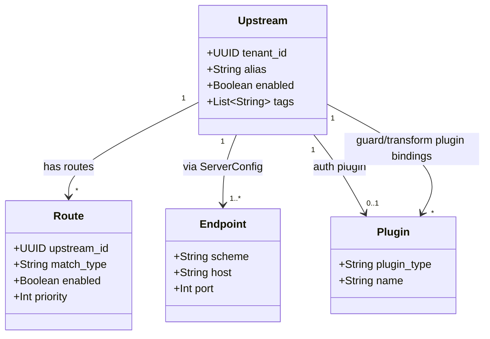

# Feature: Domain Model and Storage

<!-- toc -->

- [1. Feature Context](#1-feature-context)
  - [1.1 Overview](#11-overview)
  - [1.2 Purpose](#12-purpose)
  - [1.3 Actors](#13-actors)
  - [1.4 References](#14-references)
  - [1.5 Feature-Local Deviations](#15-feature-local-deviations)
- [2. Actor Flows (CDSL)](#2-actor-flows-cdsl)
  - [Resource Configuration Validation](#resource-configuration-validation)
  - [Tenant-Scoped Repository Lookup](#tenant-scoped-repository-lookup)
- [3. Processes / Business Logic (CDSL)](#3-processes--business-logic-cdsl)
  - [Server Endpoint Validation](#server-endpoint-validation)
  - [Configuration Shape Validation](#configuration-shape-validation)
  - [In-Memory Repository Operations](#in-memory-repository-operations)
- [4. States (CDSL)](#4-states-cdsl)
  - [Resource Lifecycle State Machine](#resource-lifecycle-state-machine)
- [5. Definitions of Done](#5-definitions-of-done)
  - [Domain Types](#domain-types)
  - [Validation Rules](#validation-rules)
  - [Domain Error](#domain-error)
  - [Repository Traits](#repository-traits)
  - [In-Memory Repositories](#in-memory-repositories)
  - [Plugin Identity](#plugin-identity)
- [6. Acceptance Criteria](#6-acceptance-criteria)

<!-- /toc -->

- [x] `p1` - **ID**: `cpt-cf-oagw-featstatus-domain-model-implemented`

<!-- reference to DECOMPOSITION entry -->
`p2` - `cpt-cf-oagw-feature-domain-model` — DECOMPOSITION entry 2.2 orders this feature and the text of that entry is the authority for this document's scope; feature progress for this document is owned by the `featstatus` line above.

## 1. Feature Context

### 1.1 Overview

This feature defines the `oagw` domain layer: the `Upstream`, `Route` and `Plugin` aggregates with their configuration value objects (server endpoints, auth, headers, rate limit, cors, plugins, tags), the request validation that every payload passes through, the `DomainError` type that carries validation failures, the tenant-scoped repository traits, and their in-memory implementations. Every management and proxy feature of this gear builds on these types — nothing else in `oagw` re-derives a field list, a validation rule or a tenant scope.

The three aggregates mirror the aggregate and value-object set of `cpt-cf-oagw-design-domain-model`; the value objects `ServerConfig` (holding `Endpoint`), `MatchConfig`, `RateLimitConfig`, `CorsConfig`, `HeadersConfig`, `AuthConfig` and `PluginsConfig` are carried by those aggregates as plain serde types and are validated by `src/domain/validation.rs`. The diagram below is the structural summary of this feature; the remaining sections are text-only because their CDSL step lists already encode the control flow and this diagram already carries the structural view.

Identity and tenant fields are elided from the diagram for brevity: every aggregate carries a server-generated `id` and the `tenant_id` of its owning tenant, which the `Upstream`, `Route` and `Plugin` classes above therefore omit.

### 1.2 Purpose

This feature bridges DECOMPOSITION entry 2.2 "Domain Model and Storage" into an implementation contract. It exists so that the gear has exactly one canonical set of domain types that `cpt-cf-oagw-feature-management-api`, `cpt-cf-oagw-feature-alias-resolution`, `cpt-cf-oagw-feature-hierarchical-config`, `cpt-cf-oagw-feature-plugin-chain` and the proxy pipeline all consume — so validation and tenant scoping exist in exactly one place instead of being re-implemented per feature. It delivers types, validation, errors and repository contracts only; HTTP transport, service orchestration and alias derivation rules are out of scope here.

**Requirements**:

- [ ] `p1` - `cpt-cf-oagw-fr-upstream-mgmt` — the `Upstream` aggregate with its server endpoints, protocol, auth, headers, rate-limit and cors value objects is the type this CRUD surface stores; the field set of `schemas/upstream.v1.schema.json` is the contract.
- [ ] `p1` - `cpt-cf-oagw-fr-route-mgmt` — the `Route` aggregate with its `match` value object (`http` or `grpc`), `upstream_id`, rate-limit and plugins value objects; the field set of `schemas/route.v1.schema.json` is the contract, plus the `enabled` and `priority` fields declared in §1.5.
- [ ] `p1` - `cpt-cf-oagw-nfr-multi-tenancy` — tenant isolation is enforced at the data layer, which here is the repository trait boundary: every lookup and write is keyed by tenant id and no consumer can bypass it.
- [ ] `p1` - `cpt-cf-oagw-nfr-input-validation` — identity fields, endpoints, alias and tags, rate-limit, cors, headers, auth and plugin shape are all validated before a resource is stored, and every violated rule is reported.

**Principles**: `p1` - `cpt-cf-oagw-principle-tenant-scope` (all reads and writes are tenant-scoped, and the scope is applied in the repository layer so every consumer inherits it).

**Constraints**: `p1` - `cpt-cf-oagw-constraint-multi-sql` (no backend-specific persistence code: the repository traits keep persistence swappable, and this release implements them in memory with SQL deferred).

### 1.3 Actors

| Actor | Role in Feature |
|-------|-----------------|
| `cpt-cf-oagw-actor-platform-operator` | Provisions upstreams and plugins whose shape this layer validates; the platform-level global configuration (system-wide plugins, enforced sharing) arrives here as an aggregate to validate and store. |
| `cpt-cf-oagw-actor-tenant-admin` | Provisions tenant-scoped routes and upstreams; the direct recipient of the validation rejections this feature produces (Flow A) and of the not-found answers of a tenant-scoped lookup (Flow B). |
| `cpt-cf-oagw-actor-cred-store` | Resolves the `cred://` secret references that the auth value object carries; this layer only validates the reference form and never resolves or stores secret material — resolution happens at request time in the features that own the plugin chain. |
| `cpt-cf-oagw-actor-types-registry` | Owns the GTS identifier families the aggregate fields belong to: the upstream, route, `{type}_plugin` and protocol identifier families. `protocol` values are validated against the protocol family, and each aggregate `id` is a server-generated UUID — the `gts.cf.core.oagw.{type}.v1~{uuid}` wrapped form appears only as the API path-parameter identifier of DESIGN, not as a stored domain field. |

No actor interacts with the repositories directly: `UpstreamRepository`, `RouteRepository` and `PluginRepository` are internal building blocks reached through the features that own the management and proxy surfaces (`cpt-cf-oagw-feature-management-api`, `cpt-cf-oagw-feature-hierarchical-config`, `cpt-cf-oagw-feature-proxy-pipeline`). The two flows below are therefore narrated from the tenant administrator's viewpoint as the caller of the domain surface, not as a direct repository client.

### 1.4 References

- **PRD**: [PRD.md](../PRD.md) — actors, `cpt-cf-oagw-fr-upstream-mgmt`, `cpt-cf-oagw-fr-route-mgmt`, `cpt-cf-oagw-fr-enable-disable`, `cpt-cf-oagw-nfr-multi-tenancy`, `cpt-cf-oagw-nfr-input-validation`, and the management interface contract `cpt-cf-oagw-interface-management-api`
- **Design**: [DESIGN.md](../DESIGN.md) — `cpt-cf-oagw-design-domain-model` (aggregates, value objects, plugin identification model), `cpt-cf-oagw-component-model` and `cpt-cf-oagw-design-layers` (where `src/domain/` and `src/infra/storage/` sit), `cpt-cf-oagw-db-schema` (uniqueness, cascade and route-match invariants honoured as a schema contract), `cpt-cf-oagw-principle-tenant-scope`, `cpt-cf-oagw-constraint-multi-sql`, `cpt-cf-oagw-constraint-https-only` (the default posture that DECOMPOSITION correction 2 lifts only through configuration)
- **Decomposition**: [DECOMPOSITION.md](../DECOMPOSITION.md) — entry 2.2 "Domain Model and Storage" and the "Spec corrections applied" block in its overview (corrections 2, 3, 6, 7 and 8 apply to this feature)
- **Schemas**: [schemas/upstream.v1.schema.json](../schemas/upstream.v1.schema.json) and [schemas/route.v1.schema.json](../schemas/route.v1.schema.json) — the authoritative field lists the aggregates must satisfy, with the endpoint `scheme` enum extended by correction 2
- **ADR**: [ADR/0002-plugin-system.md](../ADR/0002-plugin-system.md) — the `AuthPlugin`, `GuardPlugin` and `TransformPlugin` traits (`cpt-cf-oagw-adr-plugin-system`) whose configuration shape this layer validates; the named-vs-UUID-backed plugin identification model is not an ADR 0002 contribution but that of the "Plugin Identification Model" section of `cpt-cf-oagw-design-domain-model`. ADR 0003 (`cpt-cf-oagw-adr-rate-limiting`) supplies the dual-rate configuration fields validated by `cpt-cf-oagw-algo-shape-validation`, and ADR 0004 (`cpt-cf-oagw-adr-cors`) the credentials-versus-wildcard rule
- **Dependencies**:
  - [ ] `p2` - `cpt-cf-oagw-feature-gear-wiring` — the crate module layout (`src/domain/`, `src/infra/`), the `OagwConfig` surface (`allow_http_upstream`, `ssrf_policy.enabled`) and the `OagwError` to problem+json mapping that `DomainError` converts into are all hosted by that feature (see `cpt-cf-oagw-dod-crate-layout` and `cpt-cf-oagw-dod-error-contract`).
- **Reverse dependents**: `cpt-cf-oagw-feature-alias-resolution`, `cpt-cf-oagw-feature-management-api`, `cpt-cf-oagw-feature-plugin-chain`, `cpt-cf-oagw-feature-hierarchical-config`, `cpt-cf-oagw-feature-rate-limiting`, `cpt-cf-oagw-feature-proxy-pipeline`, `cpt-cf-oagw-feature-streaming-proxy` and `cpt-cf-oagw-feature-observability` all depend on or consume this feature (DECOMPOSITION "Feature Dependencies"); none of them may re-declare an aggregate, a validation rule or a repository trait defined here.

### 1.5 Feature-Local Deviations

Deviations from the supplied spec/platform baseline, recorded per the shared-baseline policy.

**Deviation** — the three repository traits are implemented by in-memory stores in `src/infra/storage/`, not by SQL/SeaORM persistence.
**Rationale** — DECOMPOSITION correction 3: `config/e2e-local.yaml` provisions no `database` section for `oagw`, so `cpt-cf-oagw-db-schema` is honoured as the schema contract (field names, `(tenant_id, alias)` uniqueness, cascade semantics, route-match determinism invariants) that the in-memory stores enforce, while materialising the `cpt-cf-oagw-db-schema` tables of DESIGN §3.6 is deferred with SQL persistence and no feature in this release creates tables.
**Review owner**: `cf-generate-author-senior via cf-write-docs review loop`

**Deviation** — `http` is accepted as an endpoint `scheme` value: the accepted enum is `http`, `https`, `wss`, `grpc`, `wt`, which extends the `https`, `wss`, `wt`, `grpc` enum of `schemas/upstream.v1.schema.json`; whether a plaintext connection is actually established is a separate concern gated by `allow_http_upstream` (default `false`), a DECOMPOSITION-correction-2 knob owned by the gear wiring feature and not a DESIGN or ADR setting.
**Rationale** — DECOMPOSITION correction 2 and the task wire-contract mandate, which keep scheme acceptance and plaintext-connection policy as two distinct concerns and lift the `cpt-cf-oagw-constraint-https-only` default posture only through configuration.
**Review owner**: `cf-generate-author-senior via cf-write-docs review loop`

**Deviation** — the rate-limit `strategy` accepts only `reject` behaviour at validation time: `reject`, `queue` and `degrade` are all accepted configuration values (per the JSON Schemas and `cpt-cf-oagw-fr-rate-limiting`), but `queue` and `degrade` validate and then behave as `reject`; the `algorithm` value `token_bucket` is enforced exactly and `sliding_window` is enforced as a fixed-window approximation of the sliding window.
**Rationale** — DECOMPOSITION corrections 6 and 8, which narrow the strategy list actually implemented this release and declare the sliding-window approximation.
**Review owner**: `cf-generate-author-senior via cf-write-docs review loop`

**Deviation (declared field-set extension)** — the `Route` aggregate carries `enabled` and `priority`, neither of which `schemas/route.v1.schema.json` declares.
**Rationale** — `enabled` is the enable/disable flag of `cpt-cf-oagw-fr-enable-disable` (the `Draft`/`Active`/`Disabled` lifecycle transitions and the "a disabled route is excluded from matching" behaviour are unimplementable without it) and `priority` is the ordering field of the Route aggregate in `cpt-cf-oagw-design-domain-model` and of the route-match determinism invariant of `cpt-cf-oagw-db-schema` (no two enabled routes under the same upstream share the same path prefix and priority for the same method); both are carried as domain fields, and the schema contract is qualified accordingly in §5 and §6.
**Review owner**: `cf-generate-author-senior via cf-write-docs review loop`

**Deviation (feature-local rule)** — two headers rules are enforced that `schemas/upstream.v1.schema.json` does not express: `passthrough_allowlist` is required when `request.passthrough` is `allowlist`, and removing a well-known header such as `Content-Length` or `Content-Type` is recorded as a headers-shape violation.
**Rationale** — the schema declares both keys but attaches no cross-field constraint to them, so the layer carries the two rules itself in `cpt-cf-oagw-algo-shape-validation`; both only tighten acceptance of an already-schema-valid payload and are therefore feature-local validation rules rather than schema deviations.
**Review owner**: `cf-generate-author-senior via cf-write-docs review loop`

**Conformance (not a deviation)** — the domain types are plain serde types validated by `src/domain/validation.rs`; no gear-local persistence framework, ORM or database migration surface is introduced, and the `RateLimitConfig` value object carries exactly the fields shared by `schemas/upstream.v1.schema.json` and `schemas/route.v1.schema.json` (the `budget` and `response_headers` extensions of `cpt-cf-oagw-adr-rate-limiting` are not carried as required fields). Recorded here so §1.5 keeps an explicit record that this surface is conformance with the supplied baseline.
**Rationale** — keeps the aggregates a faithful, single projection of the two JSON Schemas instead of forking per-consumer variants.
**Review owner**: `cf-generate-author-senior via cf-write-docs review loop`

**Conformance (not a deviation)** — tenant scoping is enforced inside the repository layer rather than at each call site, so every consumer of the traits inherits it without re-implementing it.
**Rationale** — this is the mechanism by which `cpt-cf-oagw-principle-tenant-scope` and `cpt-cf-oagw-nfr-multi-tenancy` hold for all eight reverse-dependent features at once.
**Review owner**: `cf-generate-author-senior via cf-write-docs review loop`

**Conformance (not a deviation)** — audit-log and metric emission are owned by `cpt-cf-oagw-feature-observability`: this layer emits no audit records, no metrics and no timeout/retry policy, the latter belonging to the data plane. Performance characteristics, UX and regulatory compliance are not applicable to this layer because it exposes no actor-facing surface and holds no PII beyond tenant identifiers.
**Rationale** — the layer is a library surface reached through the management and proxy features, so every actor-facing and telemetry concern is already owned by the feature that hosts the surface; recording the dispositions here keeps the checklist domains explicit rather than silently omitted.
**Review owner**: `cf-generate-author-senior via cf-write-docs review loop`

**Conformance (not a deviation)** — the API-level `plugins.items` entries are the plain identifier strings of the two JSON Schemas; `plugin_ref`, `plugin_uuid` and `config` are the persisted binding view of `cpt-cf-oagw-design-domain-model` (the object form ADR 0009 shows in its binding example), not an alternative payload shape.
**Rationale** — keeps the two views reconciled: the request payload carries identifier strings, and the binding projection with position and config is derived from them on persist, so no second payload shape exists.
**Review owner**: `cf-generate-author-senior via cf-write-docs review loop`

## 2. Actor Flows (CDSL)

Interactions that start with an actor and describe the end-to-end flow. Both flows of this feature are called by later features rather than by HTTP handlers: the management API handlers call them for every create and replace, and the proxy and hierarchical-config features call Flow B through the repository traits.

**Use cases**: `p1` - `cpt-cf-oagw-usecase-configure-upstream`, `p1` - `cpt-cf-oagw-usecase-configure-route` (both reach this layer through the management handlers of `cpt-cf-oagw-feature-management-api`)

### Resource Configuration Validation

- [x] `p1` - **ID**: `cpt-cf-oagw-flow-resource-validation`

**Actor**: `cpt-cf-oagw-actor-tenant-admin`

**Success Scenarios**:

- A complete, well-formed upstream or route payload validates and is accepted for storage: every field of the payload is known to the aggregate, every value object is well-shaped, and the resource is returned ready for the tenant-scoped repository write of Flow B.
- An endpoint list whose entries share one protocol, scheme and port validates as homogeneous and is accepted as a single endpoint pool.

**Error Scenarios**:

- An unknown field or a malformed value is rejected with the specific rule that failed (unknown field, out-of-range port, malformed alias or tag, malformed UUID).
- `cors.allow_credentials` combined with a wildcard origin is rejected.
- A rate-limit or plugin block with the wrong shape is rejected (unknown strategy, non-integer rate, missing `plugin_ref`, non-contiguous binding positions).

**Steps**:

1. [x] - `p1` - Receive the payload shape to validate (an upstream or a route) together with the caller's tenant context - `inst-rv-01`
2. [x] - `p1` - Validate the identity fields — `id` (UUID, server-generated, read-only on replace), the presence of `tenant_id`, and for an upstream the `protocol` GTS identifier — and record any failure as a violation of `cpt-cf-oagw-nfr-input-validation` - `inst-rv-02`
3. [x] - `p1` - **FOR EACH** endpoint in `server.endpoints` - `inst-rv-03`
   1. [x] - `p1` - Validate `scheme`, `host` and `port` through `cpt-cf-oagw-algo-endpoint-validation`; `scheme` must be one of `http`, `https`, `wss`, `grpc`, `wt` (DECOMPOSITION correction 2) and `host` must be an RFC 1123 hostname or an IP literal carrying no embedded port and no path segment - `inst-rv-04`
4. [x] - `p1` - **IF** the endpoint list is heterogeneous in protocol, scheme or port - `inst-rv-05`
   1. [x] - `p1` - Record one homogeneity violation naming the diverging endpoint positions, so a pool mixing `http` and `https` (or ports 443 and 8443) is rejected as a single violation - `inst-rv-06`
5. [x] - `p1` - **ELSE** accept the endpoint list as one homogeneous pool - `inst-rv-07`
   1. [x] - `p1` - Record the pool as accepted and continue with the scalar and block checks - `inst-rv-08`
6. [x] - `p1` - Validate the alias value against the alias pattern (lowercase, starting and ending alphanumeric, with dots, colons and hyphens allowed inside) and the tags against the tag pattern with per-resource uniqueness; the alias is an upstream-only check, since `schemas/route.v1.schema.json` declares no `alias`; note whether the alias was derived or explicitly supplied, since derivation itself is owned by `cpt-cf-oagw-feature-alias-resolution` - `inst-rv-09`
7. [x] - `p1` - Validate the rate-limit block through `cpt-cf-oagw-algo-shape-validation`: `strategy` limited to `reject`, `queue` and `degrade` with only `reject` behaviour implemented (correction 6), `algorithm` `token_bucket` (exact) or `sliding_window` (fixed-window approximation, correction 8), `sustained.rate` at least 1 and `sustained.window` in `second`, `minute`, `hour`, `day` - `inst-rv-10`
8. [x] - `p1` - Validate the CORS block through the same algorithm — an upstream-only block, so a route payload skips this step: `allowed_origins`, `allowed_methods`, `expose_headers`, and the rejection of `allow_credentials` combined with a wildcard origin - `inst-rv-11`
9. [x] - `p1` - Validate the plugin list shape per aggregate: for an upstream, `items` entries are either a named GTS plugin identifier or a custom-plugin UUID (the `schemas/upstream.v1.schema.json` oneOf); for a route, `items` entries are GTS plugin identifiers only (`schemas/route.v1.schema.json` declares no UUID branch); `plugin_ref` is always present and `plugin_uuid` derived only when the reference is UUID-backed, identically for both aggregates, with binding positions contiguous from 0 - `inst-rv-12`
10. [x] - `p1` - Validate the route `match` block when the payload is a route, per `schemas/route.v1.schema.json`: exactly one of `http` or `grpc` present (the schema `oneOf`), `http` requiring `methods` (at least one entry, each in `GET`, `POST`, `PUT`, `DELETE`, `PATCH`) and a non-empty `path`, `grpc` requiring `service` and `method`, `query_allowlist` a list of query-parameter names and `path_suffix_mode` enum-validated against `disabled` and `append` - `inst-rv-13`
11. [x] - `p1` - Validate the route `upstream_id` when the payload is a route: present, a UUID, and referring to an upstream that exists in the caller's tenant, so a reference into another or an ancestor tenant fails referential integrity instead of reaching a foreign resource - `inst-rv-14`
12. [x] - `p1` - **IF** any violation was recorded in the preceding steps - `inst-rv-15`
    1. [x] - `p1` - **RETURN** a `DomainError` carrying every violated rule id and its message, in field order, so the caller sees all failures of one payload at once - `inst-rv-16`
13. [x] - `p1` - **ELSE** - `inst-rv-17`
    1. [x] - `p1` - **RETURN** the validated aggregate, ready for the tenant-scoped write of `cpt-cf-oagw-flow-tenant-scoped-lookup` - `inst-rv-18`

### Tenant-Scoped Repository Lookup

- [x] `p1` - **ID**: `cpt-cf-oagw-flow-tenant-scoped-lookup`

**Actor**: `cpt-cf-oagw-actor-tenant-admin`

**Success Scenarios**:

- A lookup restricted to the caller's tenant returns the resource when it exists in that tenant.
- A lookup by composite key `(tenant_id, alias)` for an upstream, or `(tenant_id, id)` for a route or plugin, returns the aggregate with all of its value objects populated.

**Error Scenarios**:

- A resource owned by an ancestor tenant or by another tenant is not visible: the lookup returns not-found, and the feature that owns the caller surface (`cpt-cf-oagw-feature-management-api`) renders that as 404 — never as 403, per DESIGN "Tenant Scoping" and `cpt-cf-oagw-principle-tenant-scope`.

**Steps**:

1. [x] - `p1` - Issue a lookup restricted to the caller's tenant: the composite key (tenant id, resource id), or (tenant id, alias) for an upstream - `inst-tl-01`
2. [x] - `p1` - Look the key up in the tenant-scoped index of `UpstreamRepository`, `RouteRepository` or `PluginRepository` through `cpt-cf-oagw-algo-inmemory-repository` - `inst-tl-02`
3. [x] - `p1` - **IF** the key is present and its stored tenant id equals the caller's tenant id - `inst-tl-03`
   1. [x] - `p1` - **RETURN** the stored aggregate to the caller - `inst-tl-04`
4. [x] - `p1` - **ELSE** the resource is absent from this tenant's index (it lives in another tenant, in an ancestor tenant, or nowhere) - `inst-tl-05`
   1. [x] - `p1` - **RETURN** not-found for that resource id, with no distinction between the three cases, so no cross-tenant leak is possible and the caller surfaces 404 - `inst-tl-06`

## 3. Processes / Business Logic (CDSL)

Internal building blocks called by the actor flows above, and by the repository operations of this feature.

### Server Endpoint Validation

- [x] `p2` - **ID**: `cpt-cf-oagw-algo-endpoint-validation`

**Input**: the endpoint list of an upstream (`server.endpoints`), each entry carrying `scheme`, `host` and `port`.

**Output**: the validated endpoint list, or the endpoint rule violations collected so far.

**Steps**:

1. [x] - `p1` - Parse each endpoint into `scheme`, `host` and `port`, applying the schema defaults — `scheme` defaults to `https`, `port` defaults to 443, and `scheme` and `host` are required - `inst-ev-01`
2. [x] - `p1` - Validate `scheme` against the correction-2 enum `http`, `https`, `wss`, `grpc`, `wt`, which extends the `https`, `wss`, `wt`, `grpc` enum declared in `schemas/upstream.v1.schema.json` - `inst-ev-02`
3. [x] - `p1` - Validate `host` per RFC 1123 — at most 253 characters in total, labels of 1 to 63 characters built from ASCII alphanumerics and hyphens, no label starting or ending with a hyphen, a trailing dot tolerated and stripped — or as an IPv4/IPv6 literal, and reject a `host` that embeds a port or a path segment - `inst-ev-03`
4. [x] - `p1` - Validate `port` as an integer in the range 1 to 65535 - `inst-ev-04`
5. [x] - `p1` - **IF** the scheme is `wt` - `inst-ev-05`
   1. [x] - `p1` - Accept the endpoint as valid configuration and flag it not-proxied: DECOMPOSITION correction 7 keeps `wt` in the scheme enum while proxying for it is not implemented, so a proxy request routed to it is answered with the gateway `RouteError`/`ProtocolError` problem+json semantics of `cpt-cf-oagw-algo-error-mapping` - `inst-ev-06`
6. [x] - `p1` - **FOR EACH** pair of endpoints in the list - `inst-ev-07`
   1. [x] - `p1` - Compare the scheme and port of the two endpoints and note any difference; an endpoint carries no `protocol` of its own in `schemas/upstream.v1.schema.json`, so its protocol is the owning upstream's single `protocol` value, constant across the endpoint pool - `inst-ev-08`
7. [x] - `p1` - **IF** any pair differs in scheme or port - `inst-ev-09`
   1. [x] - `p1` - Record one homogeneity violation naming the diverging endpoint positions; homogeneity therefore compares scheme and port per endpoint plus that one upstream-level `protocol`, since all endpoints of a pool must share protocol, scheme and port (DESIGN "Multi-Endpoint Load Balancing") - `inst-ev-10`
8. [x] - `p1` - **RETURN** the validated endpoint list, or the collected violations when the list is empty (`minItems: 1` in the schema) or any rule failed - `inst-ev-11`

### Configuration Shape Validation

- [x] `p2` - **ID**: `cpt-cf-oagw-algo-shape-validation`

**Input**: the value-object blocks of the aggregate under validation, scoped per aggregate — an upstream carries `rate_limit`, `cors`, `headers`, `auth`, `plugins` and `tags` per `schemas/upstream.v1.schema.json`, while a route carries only `match`, `plugins`, `rate_limit` and `tags` plus the non-schema `enabled` and `priority` fields per `schemas/route.v1.schema.json`; the `cors`, `headers` and `auth` blocks are therefore upstream-only and a route payload never reaches those steps.

**Output**: the validated value objects, or every rule violation of the payload.

**Steps**:

1. [x] - `p1` - Validate the rate-limit block: `sharing` in `private`, `inherit`, `enforce`; `algorithm` `token_bucket` (exact, correction 8) or `sliding_window` (fixed-window approximation); `sustained.rate` an integer of at least 1 with `window` in `second`, `minute`, `hour`, `day`; `burst.capacity` at least 1; `scope` in `global`, `tenant`, `user`, `ip`, `route`; `cost` at least 1; `strategy` in `reject`, `queue`, `degrade` with only `reject` behaviour implemented (correction 6) - `inst-sv-01`
2. [x] - `p1` - Validate the CORS block, an upstream-only block: `enabled` required, `allowed_origins` entries are `*` or an absolute origin URI, `allowed_methods` in `GET`, `POST`, `PUT`, `PATCH`, `DELETE`, `HEAD`, `OPTIONS`, `expose_headers` a list of header names - `inst-sv-02`
3. [x] - `p1` - **IF** `allow_credentials` is true and `allowed_origins` contains `*` - `inst-sv-03`
   1. [x] - `p1` - Record the credentials-with-wildcard violation; both JSON Schemas express this as a conditional constraint and `cpt-cf-oagw-adr-cors` rejects it at validation time rather than at request time - `inst-sv-04`
4. [x] - `p1` - Validate the upstream-only headers block: `request.set`, `request.add`, `request.remove`, `response.set`, `response.add`, `response.remove` as name-to-value or name lists, `passthrough` in `none`, `allowlist`, `all`; two feature-local rules recorded in §1.5 then apply — `passthrough_allowlist` is required when `passthrough` is `allowlist`, and removing a well-known header such as `Content-Length` or `Content-Type` is recorded as a headers-shape violation while setting or adjusting one stays permitted - `inst-sv-05`
5. [x] - `p1` - Validate the upstream-only auth block: `type` a GTS auth-plugin identifier, `sharing` in `private`, `inherit`, `enforce`, `config` an object, and the secret reference that the `config` object carries in its `secret_ref` key (DESIGN "Secret Access Control") matching the `cred://` reference form that `cpt-cf-oagw-actor-cred-store` resolves later at request time; every other `config` value is treated as opaque configuration and is not inspected for secret material, and inline secret material in a `config` value is rejected as an auth-shape violation - `inst-sv-06`
6. [x] - `p1` - Validate the route `match` block: exactly one of `http` or `grpc` present (the `oneOf` of `schemas/route.v1.schema.json`), `http` requiring `methods` with at least one entry each in `GET`, `POST`, `PUT`, `DELETE`, `PATCH` and a non-empty `path`, `grpc` requiring `service` and `method`, `query_allowlist` a list of query-parameter names and `path_suffix_mode` enum-validated against `disabled` and `append` - `inst-sv-07`
7. [x] - `p1` - Validate the route `upstream_id`: present, a UUID, and referring to an upstream that exists in the caller's tenant, so referential integrity is checked across the tenant store and not merely the identifier's form - `inst-sv-08`
8. [x] - `p1` - Validate the `Plugin` aggregate per `cpt-cf-oagw-design-domain-model`: `plugin_type` a member of the `gts.cf.core.oagw.{type}_plugin.v1~` family, `name` present and unique per tenant (the `(tenant_id, name)` unique constraint of `cpt-cf-oagw-db-schema`), and for a Starlark plugin a `config_schema` shaped as a JSON Schema object plus a non-empty `source_code` holding the Starlark source - `inst-sv-09`
9. [x] - `p1` - Validate the plugins block per aggregate: for an upstream, `items` entries are either a named GTS plugin identifier or a custom-plugin UUID (the `schemas/upstream.v1.schema.json` oneOf); for a route, `items` entries are GTS plugin identifiers only (`schemas/route.v1.schema.json` declares no UUID branch); `plugin_ref` is always present and `plugin_uuid` derived only when the reference is UUID-backed, identically for both aggregates, with binding positions contiguous from 0 - `inst-sv-10`
10. [x] - `p1` - Validate the tags: each tag matches the tag pattern (lowercase alphanumerics with underscores and hyphens) and tags are unique within the resource - `inst-sv-11`
11. [x] - `p1` - **FOR EACH** violated rule encountered in the preceding steps - `inst-sv-12`
    1. [x] - `p1` - Collect the rule id and a message naming the offending field path - `inst-sv-13`
12. [x] - `p1` - **RETURN** all collected violations together — never only the first — or the validated value objects when the collection is empty - `inst-sv-14`

### In-Memory Repository Operations

- [x] `p2` - **ID**: `cpt-cf-oagw-algo-inmemory-repository`

**Input**: an aggregate (`Upstream`, `Route` or `Plugin`) plus the tenant context of the caller.

**Output**: the stored, fetched, updated or deleted aggregate, or a typed already-exists / not-found violation.

**Steps**:

1. [x] - `p1` - Key the store by the composite (tenant id, resource id) of the aggregate, and key upstreams additionally by (tenant id, alias) for the unique-alias invariant of `cpt-cf-oagw-db-schema` - `inst-mr-01`
2. [x] - `p1` - **FOR EACH** write operation (insert, replace, delete) - `inst-mr-02`
   1. [x] - `p1` - Run the validation of `cpt-cf-oagw-flow-resource-validation` — `cpt-cf-oagw-algo-endpoint-validation` and `cpt-cf-oagw-algo-shape-validation` — on the candidate aggregate before any mutation is applied - `inst-mr-03`
3. [x] - `p1` - **TRY** the requested operation against the in-memory store - `inst-mr-04`
   1. [x] - `p1` - Insert a new aggregate under its composite key, replace an existing one wholesale with omitted optional fields cleared, or remove it, applying all multi-field writes of one operation atomically - `inst-mr-05`
   2. [x] - `p1` - Apply the delete cascade of `cpt-cf-oagw-db-schema` when the operation is a delete: removing an upstream removes its routes and the plugin bindings of both, removing a route removes its plugin bindings, and removing a plugin removes any binding that still references it (whether a still-referenced plugin may be deleted at all is decided by the caller surface, not by this algorithm); the cascade is applied atomically with the delete, under the same in-process consistency guarantee as the multi-field write above - `inst-mr-12`
4. [x] - `p1` - **CATCH** a duplicate key, that is an existing aggregate with the same (tenant id, alias) for an upstream, the same resource id for any aggregate, or — for a plugin — the same `(tenant_id, name)`, which is the plugin uniqueness invariant of `cpt-cf-oagw-db-schema` - `inst-mr-06`
   1. [x] - `p1` - Map it to the already-exists violation and abort the operation without a partial write - `inst-mr-07`
5. [x] - `p1` - **CATCH** a missing key - `inst-mr-08`
   1. [x] - `p1` - Map it to the not-found violation, so a resource owned by another or by an ancestor tenant is indistinguishable from an absent one - `inst-mr-09`
6. [x] - `p1` - Enforce the route-match determinism invariant of `cpt-cf-oagw-db-schema` on route writes: no two enabled routes under the same upstream may share the same path prefix and priority for the same method - `inst-mr-10`
7. [x] - `p1` - **RETURN** the resulting view of the aggregate, or the deletion confirmation, to the caller - `inst-mr-11`

This algorithm is the concrete realisation of DECOMPOSITION correction 3 and of `cpt-cf-oagw-constraint-multi-sql`: the stores are in-memory maps behind the repository traits, `cpt-cf-oagw-db-schema` is honoured as the schema contract its invariants describe, and no backend-specific persistence code exists at the trait boundary — SQL persistence can be introduced later by supplying a different implementation of the same three traits.

## 4. States (CDSL)

### Resource Lifecycle State Machine

- [x] `p2` - **ID**: `cpt-cf-oagw-state-resource-lifecycle`

**States**: `Draft`, `Active`, `Disabled`, `Deleted`

**Initial State**: `Draft`

**Transitions**:

1. [x] - `p1` - **FROM** `Draft` **TO** `Active` **WHEN** a validated resource is stored with `enabled: true` — the write of `cpt-cf-oagw-algo-inmemory-repository` is what moves the aggregate out of `Draft` - `inst-rl-01`
2. [x] - `p1` - **FROM** `Draft` **TO** `Disabled` **WHEN** a validated resource is stored with `enabled: false` — the same write, so a resource created disabled never passes through `Active` - `inst-rl-02`
3. [x] - `p1` - **FROM** `Active` **TO** `Disabled` **WHEN** the enable/disable flag is set to `false` through the management surface of `cpt-cf-oagw-feature-management-api`, which owns this transition; a disabled upstream causes proxy requests to be rejected and a disabled route is excluded from matching (`cpt-cf-oagw-fr-enable-disable`) - `inst-rl-03`
4. [x] - `p1` - **FROM** `Disabled` **TO** `Active` **WHEN** the same management surface sets the flag back to `true` and no ancestor tenant has disabled the resource — descendants must not re-enable an ancestor-disabled resource - `inst-rl-04`
5. [x] - `p1` - **FROM** `Active` **TO** `Deleted` **WHEN** a delete is issued through the management surface - `inst-rl-05`
6. [x] - `p1` - **FROM** `Disabled` **TO** `Deleted` **WHEN** a delete is issued through the management surface - `inst-rl-06`

`Draft` is the feature-local not-yet-stored state introduced for the in-memory store: it is the state of an aggregate between validation and the repository write, and the `enabled` flag of `cpt-cf-oagw-fr-enable-disable` is its only exit — `enabled: true` enters `Active` and `enabled: false` enters `Disabled`. The machine covers `Upstream` and `Route`, the two aggregates that carry `enabled`; `Plugin` has no `enabled` field and enters `Active` directly from `Draft` when it is stored. `Deleted` is terminal for the in-memory store: no transition leaves it, and re-creating a resource with the same alias or natural key is a new aggregate with a new id, not an undelete. The lifecycle is in-process and is not persisted across restarts — a restart begins with an empty store, so no state survives it. Any transition not listed above is invalid and leaves the state unchanged: in particular `Draft` to `Deleted`, `Disabled` to `Draft`, and any transition out of `Deleted` are all refused.

## 5. Definitions of Done

### Domain Types

- [x] `p1` - **ID**: `cpt-cf-oagw-dod-domain-types`

The system **MUST** implement the `Upstream`, `Route` and `Plugin` aggregates and their value objects (`ServerConfig` with `Endpoint`, `MatchConfig`, `RateLimitConfig`, `CorsConfig`, `HeadersConfig`, `AuthConfig`, `PluginsConfig`) under `src/domain/` as plain serde types whose field sets match `schemas/upstream.v1.schema.json` exactly and `schemas/route.v1.schema.json` plus the `enabled` and `priority` fields declared in §1.5, with the endpoint `scheme` enum of DECOMPOSITION correction 2 (`http`, `https`, `wss`, `grpc`, `wt`) applied.

**Implements**:

- `cpt-cf-oagw-flow-resource-validation`

**Touches**:

- Entities: `Upstream`, `Route`, `Plugin`, `Endpoint`, `ServerConfig`, `MatchConfig`, `RateLimitConfig`, `CorsConfig`, `HeadersConfig`, `AuthConfig`, `PluginsConfig`
- Design: `cpt-cf-oagw-design-domain-model` (the aggregate and value-object set this DoD implements)

### Validation Rules

- [x] `p1` - **ID**: `cpt-cf-oagw-dod-validation-rules`

The system **MUST** implement every validation rule of `cpt-cf-oagw-flow-resource-validation`, `cpt-cf-oagw-algo-endpoint-validation` and `cpt-cf-oagw-algo-shape-validation` in `src/domain/validation.rs` — including the route `match` block rules of `schemas/route.v1.schema.json` and the `upstream_id` presence, UUID-form and tenant referential-integrity rules — and **MUST** return all violations of a payload together, not only the first one.

**Implements**:

- `cpt-cf-oagw-flow-resource-validation`
- `cpt-cf-oagw-algo-endpoint-validation`
- `cpt-cf-oagw-algo-shape-validation`

**Principles**: `p1` - `cpt-cf-oagw-principle-tenant-scope`

**Touches**:

- Entities: `Endpoint`, `MatchConfig`, `RateLimitConfig`, `CorsConfig`, `HeadersConfig`, `AuthConfig`, `PluginsConfig`

### Domain Error

- [x] `p1` - **ID**: `cpt-cf-oagw-dod-domain-error`

The system **MUST** implement `DomainError` in `src/domain/error.rs` with one variant per violation kind, each carrying a stable and testable identity, and **MUST** convert it into the gear error contract of `cpt-cf-oagw-feature-gear-wiring` (the `cpt-cf-oagw-algo-error-mapping` table). The violation kinds are enumerated and closed for this release: unknown field, malformed UUID, out-of-range port, malformed alias, malformed tag, endpoint rule violation, endpoint heterogeneity, rate-limit shape, cors shape, headers shape, auth shape, plugin shape, route match shape, already-exists, not-found. The conversion is feature-local: no new GTS error type is introduced and no row is added to the mapping table of that feature — not-found converts to the existing 404 `RouteNotFound` row and already-exists to the existing 400 `ValidationError` row at the domain boundary of that error contract, while the 409 conflict status that DECOMPOSITION entry 2.4 assigns to a route-match or alias conflict is decided by the management-API layer, so no row is added here for it.

**Implements**:

- `cpt-cf-oagw-flow-resource-validation`

**Constraints**: `p1` - `cpt-cf-oagw-constraint-multi-sql`

**Touches**:

- Entities: `DomainError`
- Infra: `src/domain/error.rs` (see `cpt-cf-oagw-dod-error-contract` of the gear wiring feature for the mapping side)

### Repository Traits

- [x] `p1` - **ID**: `cpt-cf-oagw-dod-repository-traits`

The system **MUST** define `UpstreamRepository`, `RouteRepository` and `PluginRepository` in `src/domain/repo.rs` with tenant-scoped lookups (lookup by composite tenant-and-resource key, and by (tenant id, alias) for upstreams), and **MUST NOT** expose any lookup or write path that omits the tenant scope.

**Implements**:

- `cpt-cf-oagw-flow-tenant-scoped-lookup`

**Principles**: `p1` - `cpt-cf-oagw-principle-tenant-scope`

**Touches**:

- Entities: `Upstream`, `Route`, `Plugin`
- DB: `cpt-cf-oagw-db-schema` (honoured as the schema contract for uniqueness and route-match invariants)

### In-Memory Repositories

- [x] `p1` - **ID**: `cpt-cf-oagw-dod-inmemory-repos`

The system **MUST** provide in-memory implementations of the three repository traits under `src/infra/storage/` (DECOMPOSITION correction 3), thread-safe, with deterministic duplicate and missing semantics — a duplicate composite key always yields the already-exists violation and an absent key always yields the not-found violation — and **MUST** be swap-in compatible with the traits so a SQL implementation can replace them without changing a caller.

**Implements**:

- `cpt-cf-oagw-flow-tenant-scoped-lookup`
- `cpt-cf-oagw-algo-inmemory-repository`
- `cpt-cf-oagw-state-resource-lifecycle`

**Constraints**: `p1` - `cpt-cf-oagw-constraint-multi-sql`

**Touches**:

- Entities: `Upstream`, `Route`, `Plugin`
- Infra: `src/infra/storage/`

### Plugin Identity

- [x] `p1` - **ID**: `cpt-cf-oagw-dod-plugin-identity`

The system **MUST** store `plugin_ref` for every plugin binding (the full GTS identifier, always present) and derive `plugin_uuid` only when the reference is UUID-backed, keeping `plugin_uuid` absent for named plugins; the application **MUST** validate that a derived `plugin_uuid` matches `plugin_ref` when both are present, per the plugin identification model of `cpt-cf-oagw-design-domain-model`.

**Implements**:

- `cpt-cf-oagw-flow-resource-validation`
- `cpt-cf-oagw-algo-shape-validation`

**Constraints**: `p1` - `cpt-cf-oagw-constraint-multi-sql`

**Touches**:

- Entities: `PluginsConfig`, `Plugin`

## 6. Acceptance Criteria

- [x] The `Upstream` and `Route` aggregates serialise to and from payloads that satisfy `schemas/upstream.v1.schema.json` exactly and `schemas/route.v1.schema.json` plus the `enabled` and `priority` fields declared in §1.5, for the documented happy-path examples, with no additional or missing field.
- [x] An endpoint list that mixes `http` and `https` entries is rejected as heterogeneous, while a list of pure `http` entries is accepted (DECOMPOSITION correction 2).
- [x] A `host` value carrying an embedded port (`api.openai.com:8443`) or an underscore (`api_openai.com`) is rejected by hostname validation, while a trailing-dot FQDN form is accepted and stripped.
- [x] A `cors` block with `allow_credentials: true` and a wildcard entry in `allowed_origins` is rejected at validation time.
- [x] An unknown rate-limit `strategy` or `algorithm` value fails validation, as does a `sustained.rate` below 1 or a `window` outside `second`, `minute`, `hour`, `day`.
- [x] A rate-limit block is accepted with `strategy` values `reject`, `queue` and `degrade`, and no other value passes validation (correction 6: `queue` and `degrade` resolve to `reject` behaviour, which is the rate-limiting feature's concern).
- [x] A `wt` endpoint validates as configuration and is flagged not-proxied, per correction 7.
- [x] A route `match` block carrying both `http` and `grpc`, or neither, is rejected; an `http` match with an empty `methods` list, a method outside `GET`, `POST`, `PUT`, `DELETE`, `PATCH`, or an empty `path` is rejected, as is a `grpc` match missing `service` or `method`, and a `path_suffix_mode` outside `disabled` and `append`.
- [x] A route whose `upstream_id` is absent, is not a UUID, or refers to an upstream that does not exist in the caller's tenant is rejected as a referential-integrity violation.
- [x] Storing a second plugin with the same `name` in one tenant is rejected as already-exists, per the `(tenant_id, name)` uniqueness invariant of `cpt-cf-oagw-db-schema`.
- [x] After deleting an upstream, no route referencing it remains reachable from the tenant store: a tenant-scoped lookup by that upstream id returns not-found, and no route in that tenant's store still carries the deleted upstream id.
- [x] A payload violating several rules at once (unknown field, bad port, bad tag, credentials with wildcard origin) yields a `DomainError` reporting every violated rule in one result, in field order.
- [x] A tenant-scoped lookup never returns a resource owned by another tenant or by an ancestor tenant, and answers with not-found rather than a forbidden outcome (zero cross-tenant reads).
- [x] The in-memory repositories in `src/infra/storage/` are swap-in compatible with `UpstreamRepository`, `RouteRepository` and `PluginRepository`: every test written against the traits passes unchanged against the in-memory implementations.
- [x] A validated upstream or route stored with `enabled: true` is `Active` in `cpt-cf-oagw-state-resource-lifecycle`, and one stored with `enabled: false` is `Disabled`; no transition leaves `Deleted`, and a `Draft` to `Deleted` transition is refused.
- [x] A plugin binding entry carries `plugin_ref` always, and `plugin_uuid` is derived only for a UUID-backed reference, with the derived value verified against the reference.
- [x] The crate compiles with the aggregates, value objects, `DomainError`, the three repository traits and the in-memory stores exported from the `cf-gears-oagw` package (lib target `oagw`, `src/lib.rs`), following the module layout of `cpt-cf-oagw-dod-crate-layout`.
