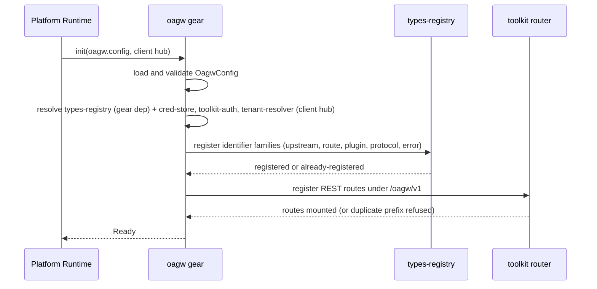

# Feature: Gear Wiring and Error Contract

<!-- toc -->

- [1. Feature Context](#1-feature-context)
  - [1.1 Overview](#11-overview)
  - [1.2 Purpose](#12-purpose)
  - [1.3 Actors](#13-actors)
  - [1.4 References](#14-references)
  - [1.5 Feature-Local Deviations](#15-feature-local-deviations)
- [2. Actor Flows (CDSL)](#2-actor-flows-cdsl)
  - [Gear Bootstrap and Route Mounting](#gear-bootstrap-and-route-mounting)
  - [Problem+json Error Response](#problemjson-error-response)
- [3. Processes / Business Logic (CDSL)](#3-processes--business-logic-cdsl)
  - [Configuration Loading and Validation](#configuration-loading-and-validation)
  - [GTS Identifier Family Provisioning](#gts-identifier-family-provisioning)
  - [OagwError to RFC 9457 problem+json Mapping](#oagwerror-to-rfc-9457-problemjson-mapping)
- [4. States (CDSL)](#4-states-cdsl)
  - [Gear Lifecycle State Machine](#gear-lifecycle-state-machine)
- [5. Definitions of Done](#5-definitions-of-done)
  - [Crate Module Layout](#crate-module-layout)
  - [Gear Registration and Route Mounting](#gear-registration-and-route-mounting)
  - [Configuration Surface](#configuration-surface)
  - [Platform Dependency Wiring](#platform-dependency-wiring)
  - [GTS Identifier Family Provisioning](#gts-identifier-family-provisioning-1)
  - [Error Contract](#error-contract)
- [6. Acceptance Criteria](#6-acceptance-criteria)

<!-- /toc -->

- [x] `p1` - **ID**: `cpt-cf-oagw-featstatus-gear-wiring-implemented`

<!-- reference to DECOMPOSITION entry -->
`p2` - `cpt-cf-oagw-feature-gear-wiring` — DECOMPOSITION entry 2.1 orders this feature and the text of that entry is the authority for this document's scope; feature progress for this document is owned by the `featstatus` line above.

## 1. Feature Context

### 1.1 Overview

This feature stands up the `oagw` ToolKit gear inside `gears/system/oagw/oagw/`: the crate module layout, the typed `OagwConfig` surface, gear registration with REST route mounting under `/oagw/v1`, platform dependency wiring, GTS type provisioning, and the RFC 9457 `application/problem+json` error contract with `X-OAGW-Error-Source`. It delivers only the gear skeleton, the configuration surface, the dependency wiring and the error mapping; handler bodies for the mounted management and proxy paths (the 15 management paths enumerated by DECOMPOSITION entry 2.4 and the `{METHOD}` proxy shell of entry 2.8) are owned by later oagw features and are answered here with placeholder responses.

The placeholder response is a fixed contract, not an implementation detail: a registered endpoint whose handler body is owned by a later feature returns **404** using the existing **RouteNotFound** variant with GTS type `gts.cf.core.errors.err.v1~cf.oagw.route.not_found.v1` and the header `X-OAGW-Error-Source: gateway`, with a `detail` naming the feature that owns the handler. It is a placeholder for the missing handler — not a panic and not an HTML error page. No new row is added to the mapping table of §3 for it: the 22-row table stays closed and the placeholder reuses the existing `RouteNotFound` row. Every later oagw feature builds on this skeleton. Audit-log emission is out of scope for this feature and is owned by `cpt-cf-oagw-feature-observability`: no gateway or startup path in this feature writes audit records.

### 1.2 Purpose

This feature bridges DECOMPOSITION entry 2.1 "Gear Wiring and Error Contract" into an implementation contract. It exists so that all other oagw features share one gear skeleton, one configuration surface, and one error mapping instead of each defining its own: `cpt-cf-oagw-feature-domain-model` hosts its aggregates, validation errors and repository traits on this crate layout, and `cpt-cf-oagw-feature-plugin-chain` hosts its traits and registries on the same skeleton.

**Requirements**:

- [ ] `p1` - `cpt-cf-oagw-fr-error-codes` — the 20-row DESIGN error table plus the two ADR 0004 CORS types are the gear's error vocabulary.
- [ ] `p1` - `cpt-cf-oagw-nfr-input-validation` — configuration parsing is strict (unknown keys and out-of-range values are rejected at startup, not at request time).
- [ ] `p1` - `cpt-cf-oagw-contract-cred-store` — the `cred_store` SDK client is resolved as a platform dependency at init so later auth features can resolve `cred://` references at request time.
- [ ] `p1` - `cpt-cf-oagw-contract-types-registry` — the `types_registry` SDK client is resolved as a gear dependency and used to provision the oagw GTS identifier families.

**Principles**: `p1` - `cpt-cf-oagw-principle-rfc9457` (all gateway errors use `application/problem+json` with GTS type identifiers), `p1` - `cpt-cf-oagw-principle-error-source` (all error responses carry `X-OAGW-Error-Source: gateway|upstream`).

**Constraints**: `p1` - `cpt-cf-oagw-constraint-toolkit-deploy` (single-executable deployment via ToolKit: the gear is registered with the runtime and mounts its routes, it does not own a listener), `p1` - `cpt-cf-oagw-constraint-no-direct-internet` (the skeleton registers the proxy path that becomes the only sanctioned outbound path; no direct-internet escape hatch is wired here).

### 1.3 Actors

| Actor | Role in Feature |
|-------|-----------------|
| `cpt-cf-oagw-actor-platform-operator` | Starts the gateway process; observes startup failure when configuration or dependency wiring is invalid, and observes readiness when bootstrap succeeds. |
| `cpt-cf-oagw-actor-tenant-admin` | Eventual consumer of the management routes mounted by this feature; the handler bodies serving them come from later features, so this feature only guarantees the routes exist under `/oagw/v1/...` and answer with problem+json. |
| `cpt-cf-oagw-actor-types-registry` | Receives the GTS identifier-family provisioning calls issued during `init()` and reports already-registered families back as success. |
| `cpt-cf-oagw-actor-cred-store` | Platform dependency resolved at init; used at request time by auth plugins (out of scope here, wiring in scope). |
| `cpt-cf-oagw-actor-upstream-service` | Remote service behind a configured upstream endpoint, called on the proxy path mounted here; source of the failures and error responses the gear re-emits to the client with `X-OAGW-Error-Source: upstream` (Flow B). |
| `cpt-cf-oagw-actor-app-developer` | Client developer who observes a gateway error response produced by the error contract (Flow B). |

The PRD defines no dedicated actor for the ToolKit runtime, so the bootstrap steps of Flow A are narrated from the platform operator's viewpoint: the operator starts the process, and the ToolKit runtime performs the gear `init()` on the operator's behalf.

### 1.4 References

- **PRD**: [PRD.md](../PRD.md) — actors, use cases, `cpt-cf-oagw-fr-error-codes`, `cpt-cf-oagw-nfr-input-validation`, `cpt-cf-oagw-contract-cred-store`, `cpt-cf-oagw-contract-types-registry`
- **Design**: [DESIGN.md](../DESIGN.md) — `cpt-cf-oagw-design-layers`, `cpt-cf-oagw-component-model`, the error response format and error table, `cpt-cf-oagw-principle-rfc9457`, `cpt-cf-oagw-principle-error-source`, `cpt-cf-oagw-constraint-toolkit-deploy`, `cpt-cf-oagw-constraint-no-direct-internet`
- **Decomposition**: [DECOMPOSITION.md](../DECOMPOSITION.md) — entry 2.1 "Gear Wiring and Error Contract" and the "Spec corrections applied" block in its overview
- **ADR**: [ADR/0004-cors.md](../ADR/0004-cors.md) — the two CORS error types this feature must carry in its error mapping (`cpt-cf-oagw-adr-cors`); ADR 0007 (`cpt-cf-oagw-adr-error-source-distinction`) and ADR 0008 (`cpt-cf-oagw-adr-oauth2-client-credentials-auth-plugin`) are applied through the error-source header and the token-cache defaults respectively
- **Dependencies**: None — this is the first feature in the oagw dependency graph. `cpt-cf-oagw-feature-domain-model`, `cpt-cf-oagw-feature-plugin-chain` and every later oagw feature depend on this one (DECOMPOSITION "Feature Dependencies").

### 1.5 Feature-Local Deviations

Deviations from the supplied spec/platform baseline, recorded per the shared-baseline policy.

**Deviation** — the route base path is `/oagw/v1/...` without the platform `/api` prefix, while DESIGN's request-routing table and the PRD interface contracts write `/api/oagw/v1/...`.
**Rationale** — task wire-contract mandate for this gear; DECOMPOSITION correction 1 records that the `/api/oagw/v1/...` form is the operator-gateway-prefixed alias and that sibling gears register gear-relative paths.
**Review owner**: `cf-generate-author-senior via cf-write-docs review loop`

**Deviation** — the accepted upstream `protocol`/scheme enum values are `http`, `https`, `wss`, `grpc`, `wt`; `http` is a legal configuration value, and whether a plaintext connection is actually established is gated separately by `allow_http_upstream` (default `false`). `allow_http_upstream` is a DECOMPOSITION-correction-2 knob, not a DESIGN or ADR setting: neither DESIGN nor any ADR defines it, so this feature owns both the knob and its default.
**Rationale** — task wire-contract mandate; DECOMPOSITION correction 2, which keeps scheme acceptance and plaintext-connection policy as two distinct concerns and lifts the `cpt-cf-oagw-constraint-https-only` default posture only through configuration.
**Review owner**: `cf-generate-author-senior via cf-write-docs review loop`

**Deviation** — configuration accepts `grpc` and `wt` protocol values for validation purposes, but no gRPC or WebTransport proxy code path exists in this release; PRD Phase 4 governs over DESIGN's "Phase 3" wording.
**Rationale** — DECOMPOSITION corrections 4 and 7 and the phase-numbering precedence note (the PRD is the scope of record for phasing).
**Review owner**: `cf-generate-author-senior via cf-write-docs review loop`

**Conformance (not a deviation)** — error mapping follows the DESIGN error table via the toolkit canonical-errors problem+json support and the GTS error type identifiers carried by the `cpt-cf-oagw-algo-error-mapping` table. Recorded here so §1.5 keeps an explicit record that this surface is conformance with the supplied baseline.
**Rationale** — keeps `cpt-cf-oagw-principle-rfc9457` and `cpt-cf-oagw-principle-error-source` with one platform-wide mapping implementation.
**Review owner**: `cf-generate-author-senior via cf-write-docs review loop`

**Deviation** — metrics and audit-log emission are out of scope here: observability uses the platform telemetry pipeline and the gear exposes no `/metrics` HTTP route, and audit-log emission is owned by `cpt-cf-oagw-feature-observability` (no gateway or startup path in this feature writes audit records).
**Rationale** — DECOMPOSITION correction 5 for metrics and DECOMPOSITION entry 2.1, which puts "Metrics/audit emission" out of scope for this feature; metric instruments are registered on the toolkit OpenTelemetry SDK configured by the host, so this feature registers no scrape endpoint, no metrics route and no audit sink.
**Review owner**: `cf-generate-author-senior via cf-write-docs review loop`

**Deviation** — `proxy_timeout_secs` defaults to 30 as a feature-local default: no upstream (DESIGN, PRD or ADR) value exists for it, so this feature fixes the default and later oagw features inherit it through the shared skeleton.
**Rationale** — DESIGN and `cpt-cf-oagw-fr-request-proxy` name `proxy_timeout_secs` as the request-timeout source (504 `RequestTimeout`) but state no default; a concrete non-zero value is required for the empty-config startup path of `cpt-cf-oagw-algo-config-load` and for the `Ready` acceptance criterion of §6.
**Review owner**: `cf-generate-author-senior via cf-write-docs review loop`

**Deviation** — in-memory storage is used by later features; this feature only hosts the configuration, error and dependency surfaces and does not create a database schema.
**Rationale** — DECOMPOSITION correction 3: `cpt-cf-oagw-db-schema` is honoured as a schema contract (field names, uniqueness, cascade and route-match invariants), not materialised as SQL in this release, and no feature in this release creates tables.
**Review owner**: `cf-generate-author-senior via cf-write-docs review loop`

## 2. Actor Flows (CDSL)

Interactions that start with an actor and describe the end-to-end flow. Both flows of this feature are multi-step and branched, so the first flow carries a compact sequence diagram; the remaining sections of this document are text-only because the template fixes their structure and their CDSL step lists already encode the control flow.

**Use cases**: `p1` - `cpt-cf-oagw-usecase-proxy-request`, `p1` - `cpt-cf-oagw-usecase-configure-upstream` (both are served by routes this feature mounts; their handler bodies belong to later features)

### Gear Bootstrap and Route Mounting

- [x] `p1` - **ID**: `cpt-cf-oagw-flow-gear-bootstrap`

**Actor**: `cpt-cf-oagw-actor-platform-operator`

**Success Scenarios**:

- The gear registers with the ToolKit runtime and mounts its REST routes under `/oagw/v1`.
- Configuration defaults apply when no `oagw.config` block is present.
- GTS identifier families (upstream, route, plugin, protocol, error) are provisioned through types-registry.
- Management and proxy paths answer with `application/problem+json`: a registered endpoint whose handler body is owned by a later feature returns the 404 `RouteNotFound` placeholder pinned in §1.1 (GTS type `gts.cf.core.errors.err.v1~cf.oagw.route.not_found.v1`, `X-OAGW-Error-Source: gateway`, `detail` naming the owning feature).

**Error Scenarios**:

- Invalid or unknown configuration key aborts startup.
- Unavailable platform dependency (types-registry, cred-store, tenant-resolver) aborts startup with the typed startup error surface (§3).
- A duplicate route prefix is refused by the registration call itself, before any route is mounted.

**Steps**:

1. [x] - `p1` - Read the raw `oagw.config` block supplied by the platform (possibly absent) and hand it to the configuration loader - `inst-gb-01`
2. [x] - `p1` - **IF** the `oagw.config` block is absent - `inst-gb-02`
   1. [x] - `p1` - Apply the DESIGN/ADR defaults of `cpt-cf-oagw-algo-config-load` — `proxy_timeout_secs` = 30, `ssrf_policy.enabled` = true, body limit = 100 MB, `token_cache_ttl_secs` = 300, `token_cache_capacity` = 10000, and `allow_http_upstream` = false (the DECOMPOSITION-correction-2 knob, not a DESIGN/ADR default) — and continue startup with the defaulted `OagwConfig` - `inst-gb-03`
3. [x] - `p1` - **ELSE** parse the block through `cpt-cf-oagw-algo-config-load`, where every key present in the raw value overrides the corresponding default before validation runs - `inst-gb-04`
   1. [x] - `p1` - **CATCH** the typed configuration error for an unknown key or an out-of-range value and abort startup with the typed startup error surface (§3), a `ValidationError` whose `detail` names the offending key - `inst-gb-05`
4. [x] - `p1` - Resolve platform dependencies: the `types_registry` SDK client as a gear-level dependency, and `cred_store`, `toolkit-auth` and `tenant-resolver` through the toolkit client hub (not gear-level dependencies) - `inst-gb-06`
5. [x] - `p1` - **IF** a required platform dependency cannot be resolved - `inst-gb-07`
   1. [x] - `p1` - **CATCH** the resolution failure and abort startup with the typed startup error surface (§3), a `SecretNotFound` for an unresolvable credential dependency or a `LinkUnavailable` for an unreachable remote dependency, naming the missing dependency so the failure surfaces at startup and not at request time - `inst-gb-08`
6. [x] - `p1` - Provision the GTS identifier families (upstream, route, plugin, protocol, error) through types-registry via `cpt-cf-oagw-algo-type-provisioning` - `inst-gb-09`
7. [x] - `p1` - Build the `OagwError` to `application/problem+json` mapper of `cpt-cf-oagw-algo-error-mapping` and register it as the REST error layer for every mounted route - `inst-gb-10`
8. [x] - `p1` - Register with the toolkit router the exact route shell set under `/oagw/v1/...`: the 15 management paths `POST|GET /oagw/v1/upstreams`, `GET|PUT|DELETE /oagw/v1/upstreams/{id}`, `POST|GET /oagw/v1/routes`, `GET|PUT|DELETE /oagw/v1/routes/{id}`, `POST|GET /oagw/v1/plugins`, `GET|DELETE /oagw/v1/plugins/{id}`, `GET /oagw/v1/plugins/{id}/source` (as enumerated by DECOMPOSITION entry 2.4, `cpt-cf-oagw-feature-management-api`), plus the proxy shell `{METHOD} /oagw/v1/proxy/{alias}/{path}` accepting GET, POST, PUT, PATCH and DELETE (as defined by DECOMPOSITION entry 2.8 / PRD `cpt-cf-oagw-interface-proxy-api`); each is registered now with the 404 `RouteNotFound` placeholder behaviour pinned in §1.1 and is implemented by the owning later feature - `inst-gb-11`
   1. [x] - `p1` - **CATCH** the failure of the registration call itself when the `/oagw/v1` prefix is already mounted by another gear — the refusal is part of registration, not a post-registration check — and abort startup with the typed startup error surface (§3) instead of silently shadowing another gear's routes - `inst-gb-12`
9. [x] - `p1` - Leave the registered endpoints serving their 404 `RouteNotFound` placeholder responses until the features that own their handlers replace them - `inst-gb-13`
10. [x] - `p1` - **RETURN** the gear in the `Ready` state of `cpt-cf-oagw-state-gear-lifecycle` to the ToolKit runtime - `inst-gb-14`

### Problem+json Error Response

- [x] `p1` - **ID**: `cpt-cf-oagw-flow-error-response`

**Actor**: `cpt-cf-oagw-actor-app-developer`

**Success Scenarios**:

- Any `OagwError` raised by any oagw route and classified by the gateway itself is serialized as `application/problem+json` with the exact GTS `type`, the standard RFC 9457 fields, the declared extension fields, and `X-OAGW-Error-Source: gateway`.
- An error response produced by `cpt-cf-oagw-actor-upstream-service` is passed through to the client as-is — status and body unchanged — with only `X-OAGW-Error-Source: upstream` added, per DESIGN §3.3 and ADR 0007.

**Error Scenarios**:

- A failure raised by `cpt-cf-oagw-actor-upstream-service` on the proxy path (as opposed to by the gateway itself) is passed through with `X-OAGW-Error-Source: upstream` instead of `gateway`, without re-serializing the body as problem+json.

**Steps**:

1. [x] - `p1` - Send a request that the gateway rejects (unknown alias, oversized body, unimplemented registered endpoint) and receive the error response - `inst-er-01`
2. [x] - `p1` - Intercept the raised `OagwError` in the REST error layer and classify its variant per `cpt-cf-oagw-algo-error-mapping` - `inst-er-02`
3. [x] - `p1` - Map the variant to its HTTP status, GTS `type` and RFC 9457 `title` from the mapping table - `inst-er-03`
4. [x] - `p1` - Attach `detail`, `instance` and the OAGW extension fields (`upstream_id`, `host`, `path`, `retry_after_seconds`, `trace_id`) where the variant carries them - `inst-er-04`
5. [x] - `p1` - Receive the upstream-origin failure returned on the proxy path by `cpt-cf-oagw-actor-upstream-service`: either a connection-level failure the gateway itself classifies as an `OagwError`, or an error response the upstream service itself produced - `inst-er-05`
6. [x] - `p1` - **IF** the failure is an `OagwError` classified by the gateway itself - `inst-er-06`
   1. [x] - `p1` - Set `X-OAGW-Error-Source: gateway` and serialize the body as `application/problem+json` with the mapped HTTP status, GTS `type` and RFC 9457 fields - `inst-er-07`
7. [x] - `p1` - **ELSE** the response was produced by `cpt-cf-oagw-actor-upstream-service` - `inst-er-08`
   1. [x] - `p1` - Pass the upstream response through to the client as-is — status and body unchanged — adding only `X-OAGW-Error-Source: upstream`, per DESIGN §3.3 and `cpt-cf-oagw-adr-error-source-distinction`; the body is not re-serialized as problem+json - `inst-er-09`
8. [x] - `p1` - **RETURN** the error response — the problem+json document with the exact GTS `type` of the mapping table for the gateway-classified case, or the passthrough response with the added header for the upstream-produced case - `inst-er-10`

## 3. Processes / Business Logic (CDSL)

Internal building blocks called by the actor flows above.

### Configuration Loading and Validation

- [x] `p2` - **ID**: `cpt-cf-oagw-algo-config-load`

**Input**: raw gear config value for `oagw.config` (possibly absent).

**Output**: validated `OagwConfig`.

**Steps**:

1. [x] - `p1` - Parse the known `OagwConfig` keys out of the raw gear config value - `inst-cl-01`
2. [x] - `p1` - Apply every default with its concrete value: `proxy_timeout_secs` = 30, `allow_http_upstream` = false, `ssrf_policy.enabled` = true, body limit = 100 MB (per `cpt-cf-oagw-constraint-body-limit`), `token_cache_ttl_secs` = 300 and `token_cache_capacity` = 10000 (both per `cpt-cf-oagw-adr-oauth2-client-credentials-auth-plugin`); `allow_http_upstream` and its `false` default come from DECOMPOSITION correction 2, not from DESIGN or any ADR - `inst-cl-02`
3. [x] - `p1` - Apply the overrides: any key present in the raw `oagw.config` value replaces the corresponding default before validation runs, so an explicitly supplied value is never silently re-defaulted - `inst-cl-03`
4. [x] - `p1` - **FOR EACH** key present in the raw config value - `inst-cl-04`
   1. [x] - `p1` - **IF** the key is not a known `OagwConfig` field, fail validation and record the offending key in the typed error - `inst-cl-05`
5. [x] - `p1` - Validate value ranges: proxy and token-cache timeouts strictly greater than zero, body limit strictly greater than zero, and accepted upstream `protocol` values limited to `http`, `https`, `wss`, `grpc`, `wt` - `inst-cl-06`
6. [x] - `p1` - **IF** any validation rule failed - `inst-cl-07`
   1. [x] - `p1` - **RETURN** the typed validation error to the caller; unknown-key strictness satisfies `cpt-cf-oagw-nfr-input-validation` at the configuration boundary - `inst-cl-08`
7. [x] - `p1` - **RETURN** the validated `OagwConfig` - `inst-cl-09`

### GTS Identifier Family Provisioning

- [x] `p2` - **ID**: `cpt-cf-oagw-algo-type-provisioning`

**Input**: types-registry SDK client plus the oagw identifier family list.

**Output**: registered identifier families (idempotent).

**Steps**:

1. [x] - `p1` - Build the identifier family list: upstream, route, plugin, protocol, error - `inst-tp-01`
2. [x] - `p1` - **FOR EACH** family in the list - `inst-tp-02`
   1. [x] - `p1` - Ensure the family's GTS type identifier is registered in the types-registry through the SDK client, per `cpt-cf-oagw-contract-types-registry` - `inst-tp-03`
3. [x] - `p1` - **TRY** to register the family type - `inst-tp-04`
4. [x] - `p1` - **CATCH** already-registered - `inst-tp-05`
   1. [x] - `p1` - Treat the existing registration as success and continue with the next family, so calling init twice does not fail - `inst-tp-06`
5. [x] - `p1` - **CATCH** any other types-registry error - `inst-tp-07`
   1. [x] - `p1` - Abort startup with the typed startup error surface (§3), a `LinkUnavailable` naming the family that failed - `inst-tp-08`
6. [x] - `p1` - **RETURN** the set of provisioned identifier families - `inst-tp-09`

### OagwError to RFC 9457 problem+json Mapping

- [x] `p2` - **ID**: `cpt-cf-oagw-algo-error-mapping`

**Input**: `OagwError` variant plus an optional upstream-origin flag.

**Output**: HTTP status + headers + `application/problem+json` body for gateway-classified errors, or the upstream status/body passed through with the added `X-OAGW-Error-Source` header for upstream-produced responses.

**Steps**:

1. [x] - `p1` - Match the `OagwError` variant - `inst-em-01`
2. [x] - `p1` - Resolve the HTTP status and GTS `type` from the authoritative mapping table below; the two ADR 0004 CORS variants resolve through the same table - `inst-em-02`
3. [x] - `p1` - Build the RFC 9457 standard fields and the OAGW extension fields where the variant supplies them - `inst-em-03`
4. [x] - `p1` - **IF** the failure is a gateway-classified variant - `inst-em-04`
   1. [x] - `p1` - Set `X-OAGW-Error-Source: gateway` - `inst-em-05`
5. [x] - `p1` - **ELSE** the response was produced by `cpt-cf-oagw-actor-upstream-service` - `inst-em-06`
   1. [x] - `p1` - Set `X-OAGW-Error-Source: upstream` - `inst-em-07`
6. [x] - `p1` - **RETURN** the response with `Content-Type: application/problem+json` and the computed status, headers and body - `inst-em-08`

The upstream branch is qualified: only gateway-classified `OagwError` variants are mapped, including the variants whose cause is the upstream connection — `DownstreamError`, `StreamAborted`, `LinkUnavailable`, `ConnectionTimeout`, `RequestTimeout` and `IdleTimeout` — which map through the table with `X-OAGW-Error-Source: gateway`. An error response body received from `cpt-cf-oagw-actor-upstream-service` is not re-serialized: it is passed through as-is with only `X-OAGW-Error-Source: upstream` added (see Flow B and `cpt-cf-oagw-adr-error-source-distinction`).

**Authoritative mapping table** (this feature owns the `OagwError` variant to HTTP status and GTS type mapping; the 20 DESIGN rows plus the two ADR 0004 CORS rows):

| Error Type | HTTP | GTS Instance ID | Retriable | Meaning |
|---|---|---|---|---|
| RouteError | 400 | `gts.cf.core.errors.err.v1~cf.oagw.validation.error.v1` | No | General route validation error |
| ValidationError | 400 | `gts.cf.core.errors.err.v1~cf.oagw.validation.error.v1` | No | Request validation failed |
| MissingTargetHost | 400 | `gts.cf.core.errors.err.v1~cf.oagw.routing.missing_target_host.v1` | No | X-OAGW-Target-Host header required for multi-endpoint upstream with common suffix alias |
| InvalidTargetHost | 400 | `gts.cf.core.errors.err.v1~cf.oagw.routing.invalid_target_host.v1` | No | X-OAGW-Target-Host header format is invalid (must be hostname or IP, no port/path/special chars) |
| UnknownTargetHost | 400 | `gts.cf.core.errors.err.v1~cf.oagw.routing.unknown_target_host.v1` | No | X-OAGW-Target-Host value does not match any configured endpoint |
| AuthenticationFailed | 401 | `gts.cf.core.errors.err.v1~cf.oagw.auth.failed.v1` | No | Authentication to upstream failed |
| RouteNotFound | 404 | `gts.cf.core.errors.err.v1~cf.oagw.route.not_found.v1` | No | No matching route found |
| PluginInUse | 409 | `gts.cf.core.errors.err.v1~cf.oagw.plugin.in_use.v1` | No | Plugin in use |
| PayloadTooLarge | 413 | `gts.cf.core.errors.err.v1~cf.oagw.payload.too_large.v1` | No | Request payload exceeds limit |
| RateLimitExceeded | 429 | `gts.cf.core.errors.err.v1~cf.oagw.rate_limit.exceeded.v1` | Yes | Rate limit exceeded |
| SecretNotFound | 500 | `gts.cf.core.errors.err.v1~cf.oagw.secret.not_found.v1` | No | Referenced secret not found |
| ProtocolError | 502 | `gts.cf.core.errors.err.v1~cf.oagw.protocol.error.v1` | No | Protocol-level error |
| DownstreamError | 502 | `gts.cf.core.errors.err.v1~cf.oagw.downstream.error.v1` | Depends | Upstream service error |
| StreamAborted | 502 | `gts.cf.core.errors.err.v1~cf.oagw.stream.aborted.v1` | No | Stream connection aborted |
| LinkUnavailable | 503 | `gts.cf.core.errors.err.v1~cf.oagw.link.unavailable.v1` | Yes | Upstream link unavailable |
| CircuitBreakerOpen | 503 | `gts.cf.core.errors.err.v1~cf.oagw.circuit_breaker.open.v1` | Yes | Circuit breaker open |
| PluginNotFound | 503 | `gts.cf.core.errors.err.v1~cf.oagw.plugin.not_found.v1` | No | Plugin not found |
| ConnectionTimeout | 504 | `gts.cf.core.errors.err.v1~cf.oagw.timeout.connection.v1` | Yes | Connection timeout |
| RequestTimeout | 504 | `gts.cf.core.errors.err.v1~cf.oagw.timeout.request.v1` | Yes | Request timeout |
| IdleTimeout | 504 | `gts.cf.core.errors.err.v1~cf.oagw.timeout.idle.v1` | Yes | Idle timeout |
| CorsOriginNotAllowed | 403 | `gts.cf.core.errors.err.v1~cf.oagw.cors.origin_not_allowed.v1` | No | Origin not in the upstream/route allowed origins list (ADR 0004) |
| CorsMethodNotAllowed | 403 | `gts.cf.core.errors.err.v1~cf.oagw.cors.method_not_allowed.v1` | No | Method not in the upstream/route allowed methods list (ADR 0004) |

**RFC 9457 standard fields** carried by every gateway-produced error body: `type` (the GTS identifier of the error type), `title` (human-readable summary), `status` (HTTP status code), `detail` (occurrence-specific explanation) and `instance` (URI reference identifying the occurrence).

**Extension fields** added where the variant supplies them: `upstream_id`, `host`, `path` (request context), `retry_after_seconds` (retry guidance) and `trace_id` (distributed tracing correlation).

Every gateway-produced error response also carries `X-OAGW-Error-Source: gateway|upstream`, per `cpt-cf-oagw-principle-error-source` and `cpt-cf-oagw-adr-error-source-distinction`.

#### Startup failure error surface

`init()` returns `Err(OagwError)`; the variants used at startup are `ValidationError` (configuration rejected — unknown key, out-of-range value, or duplicate `/oagw/v1` prefix; `detail` names the offending key), `SecretNotFound` (an unresolvable platform credential dependency) and `LinkUnavailable` (a remote platform dependency is unreachable). The gear logs the problem+json document (with `X-OAGW-Error-Source: gateway`) and the ToolKit runtime aborts process startup. No new rows are added to the mapping table for startup failures: the REST layer is not yet mounted at that point, so no HTTP response exists and the typed `OagwError` is the whole failure surface. This paragraph is the single definition of the "typed startup error surface" referenced by Flow A, the DoDs and §6.

## 4. States (CDSL)

### Gear Lifecycle State Machine

- [x] `p2` - **ID**: `cpt-cf-oagw-state-gear-lifecycle`

**States**: `Uninitialized`, `Initializing`, `Ready`, `Failed`

**Initial State**: `Uninitialized`

**Transitions**:

1. [x] - `p1` - **FROM** `Uninitialized` **TO** `Initializing` **WHEN** the ToolKit runtime invokes the gear's init with the platform client hub and the `oagw.config` block - `inst-lc-01`
2. [x] - `p1` - **FROM** `Initializing` **TO** `Ready` **WHEN** configuration loading, dependency resolution, GTS type provisioning and route registration under `/oagw/v1` all succeed - `inst-lc-02`
3. [x] - `p1` - **FROM** `Initializing` **TO** `Failed` **WHEN** any init step fails (invalid or unknown configuration key, unresolvable platform dependency, types-registry provisioning error, duplicate route prefix) - `inst-lc-03`
4. [x] - `p1` - **FROM** `Ready` **TO** `Failed` **WHEN** a later reconfiguration is rejected; the management handlers that own this transition belong to later features - `inst-lc-04`

`Failed` is terminal in this release: no transition leaves `Failed`, because a failed `init()` aborts process startup and recovery is a process restart, not a state transition. Any transition not listed above is invalid and leaves the state unchanged. The lifecycle is in-process only: the state is not persisted and is not carried across process restarts, so every restart begins again at `Uninitialized`.

## 5. Definitions of Done

### Crate Module Layout

- [x] `p1` - **ID**: `cpt-cf-oagw-dod-crate-layout`

The system **MUST** expose a crate module layout in `gears/system/oagw/oagw/src/` that mirrors the DESIGN transport/domain/infrastructure split of `cpt-cf-oagw-design-layers` and `cpt-cf-oagw-component-model`: `src/lib.rs` (public exports), `src/gear.rs` (ToolKit gear wiring), `src/config.rs` (`OagwConfig`), `src/domain/` (with `src/domain/error.rs`), `src/api/rest/` (with `src/api/rest/error.rs`), and `src/infra/` (with `src/infra/type_provisioning.rs`). The gear type **MUST** be exported from `src/lib.rs` following the same `pub mod gear` plus re-export convention used by sibling gears in this workspace.

**Implements**:

- `cpt-cf-oagw-flow-gear-bootstrap`

**Touches**:

- Entities: `OagwConfig`, `OagwError`

### Gear Registration and Route Mounting

- [x] `p1` - **ID**: `cpt-cf-oagw-dod-gear-registration`

The system **MUST** declare the gear with the toolkit gear macro and register its REST capability so that every oagw route is mounted under `/oagw/v1/...` with no leading `/api` prefix (DECOMPOSITION correction 1, gear-relative route paths). Feature-local registration rule: the registration call issued to the toolkit router **MUST** fail when the `/oagw/v1` prefix is already mounted, so the duplicate prefix is refused by registration itself and never detected afterwards. The rule follows from `cpt-cf-oagw-constraint-toolkit-deploy` — the gear owns no listener, so it cannot shadow another gear's routes on a listener it does not control — and from DECOMPOSITION correction 1, which makes gear-relative route paths the registration namespace sibling gears share.

**Implements**:

- `cpt-cf-oagw-flow-gear-bootstrap`
- `cpt-cf-oagw-state-gear-lifecycle`

**Constraints**: `p1` - `cpt-cf-oagw-constraint-toolkit-deploy`

**Touches**:

- API: the exact registered shell set under `/oagw/v1/...` — the 15 management paths `POST|GET /oagw/v1/upstreams`, `GET|PUT|DELETE /oagw/v1/upstreams/{id}`, `POST|GET /oagw/v1/routes`, `GET|PUT|DELETE /oagw/v1/routes/{id}`, `POST|GET /oagw/v1/plugins`, `GET|DELETE /oagw/v1/plugins/{id}`, `GET /oagw/v1/plugins/{id}/source` (as enumerated by DECOMPOSITION entry 2.4, `cpt-cf-oagw-feature-management-api`), plus the proxy shell `{METHOD} /oagw/v1/proxy/{alias}/{path}` accepting GET, POST, PUT, PATCH and DELETE (as defined by DECOMPOSITION entry 2.8 / PRD `cpt-cf-oagw-interface-proxy-api`). Every shell is registered now, and every handler body is owned by a later feature: until that feature replaces it, the endpoint returns **404** with the existing **RouteNotFound** variant (GTS type `gts.cf.core.errors.err.v1~cf.oagw.route.not_found.v1`), the header `X-OAGW-Error-Source: gateway` and a `detail` naming the feature that owns the handler — the placeholder reuses the existing mapping-table row, and the 22-row table stays closed.

### Configuration Surface

- [x] `p1` - **ID**: `cpt-cf-oagw-dod-config-surface`

The system **MUST** implement `OagwConfig` on the gear config surface with the defaults listed in `cpt-cf-oagw-algo-config-load`, and **MUST** reject unknown keys and out-of-range values at load time instead of silently ignoring them.

**Implements**:

- `cpt-cf-oagw-flow-gear-bootstrap`
- `cpt-cf-oagw-algo-config-load`

**Constraints**: `p1` - `cpt-cf-oagw-constraint-body-limit`

**Touches**:

- Entities: `OagwConfig`

### Platform Dependency Wiring

- [x] `p1` - **ID**: `cpt-cf-oagw-dod-dependency-wiring`

The system **MUST** resolve, inside `init()`, the `types_registry` SDK client as a gear-level dependency, and **MUST** reach `cred_store`, `toolkit-auth` and `tenant-resolver` through the toolkit client hub rather than declaring them as gear-level dependencies, matching the PRD dependency and contract table (`cpt-cf-oagw-contract-cred-store`). Startup **MUST** fail fast with the typed startup error surface (§3) when a required dependency is missing.

**Implements**:

- `cpt-cf-oagw-flow-gear-bootstrap`

**Touches**:

- Dependencies: `types_registry` SDK client (gear-level) and the `cred_store`, `toolkit-auth` and `tenant-resolver` clients resolved through the toolkit client hub

### GTS Identifier Family Provisioning

- [x] `p1` - **ID**: `cpt-cf-oagw-dod-gts-provisioning`

The system **MUST** provision the upstream, route, plugin, protocol and error identifier families through the types-registry at init, idempotently, so a repeated init does not fail on already-registered families.

**Implements**:

- `cpt-cf-oagw-flow-gear-bootstrap`
- `cpt-cf-oagw-algo-type-provisioning`

**Touches**:

- Infra: `src/infra/type_provisioning.rs` and the `types_registry` SDK client (no domain entity is created or modified by this DoD)

### Error Contract

- [x] `p1` - **ID**: `cpt-cf-oagw-dod-error-contract`

The system **MUST** emit RFC 9457 `application/problem+json` on every gateway error path with the exact GTS types of the `cpt-cf-oagw-algo-error-mapping` table, the standard RFC 9457 fields, the declared extension fields, and `X-OAGW-Error-Source: gateway|upstream`; the two ADR 0004 CORS 403 types **MUST** be present as error variants.

**Implements**:

- `cpt-cf-oagw-flow-error-response`
- `cpt-cf-oagw-algo-error-mapping`

**Principles**: `p1` - `cpt-cf-oagw-principle-rfc9457`, `p1` - `cpt-cf-oagw-principle-error-source`

**Touches**:

- API: every oagw error response under `/oagw/v1/...`
- Entities: `OagwError`

## 6. Acceptance Criteria

- [x] The `cf-gears-oagw` package (lib target `oagw`) compiles as a member of the repository workspace that includes `gears/system/oagw/oagw`, and exports the gear type from `src/lib.rs`, with the module layout of `cpt-cf-oagw-dod-crate-layout` present (`src/gear.rs`, `src/config.rs`, `src/domain/error.rs`, `src/api/rest/error.rs`, `src/infra/type_provisioning.rs`).
- [x] With an empty or absent `oagw.config` block the gear starts and reaches `Ready` using the defaults of `cpt-cf-oagw-algo-config-load`: `proxy_timeout_secs` 30, `ssrf_policy.enabled` true, body limit 100 MB, `token_cache_ttl_secs` 300 and `token_cache_capacity` 10000 (ADR 0008), with `allow_http_upstream` defaulting to `false` per DECOMPOSITION correction 2 (not a DESIGN or ADR default).
- [x] A configuration block containing an unknown key, a zero or negative timeout, a zero body limit, or an unaccepted protocol value aborts startup with a typed error that names the offending key (no silent defaulting).
- [x] All management and proxy paths — the 15 management paths and the `{METHOD}` proxy shell enumerated in `cpt-cf-oagw-dod-gear-registration` — respond under `/oagw/v1/...` with no leading `/api` prefix, and a duplicate `/oagw/v1` prefix is refused by the registration call itself.
- [x] A registered endpoint whose handler is owned by a later feature returns a **404** `application/problem+json` placeholder response carrying the existing `RouteNotFound` GTS type `gts.cf.core.errors.err.v1~cf.oagw.route.not_found.v1`, `X-OAGW-Error-Source: gateway` and a `detail` naming the owning feature — not a panic and not an HTML error page, and not a new row in the 22-row mapping table.
- [x] Every error response produced by the gear carries `X-OAGW-Error-Source`, with the value `gateway` for gateway-originated failures and `upstream` for failures raised by `cpt-cf-oagw-actor-upstream-service`.
- [x] Each of the 20 DESIGN error rows and the 2 ADR 0004 CORS rows maps to exactly the HTTP status and GTS type listed in the `cpt-cf-oagw-algo-error-mapping` table (verified by a table-driven test over all 22 variants).
- [x] The two CORS 403 types are reachable as `OagwError` variants and serialize with `type` `gts.cf.core.errors.err.v1~cf.oagw.cors.origin_not_allowed.v1` and `gts.cf.core.errors.err.v1~cf.oagw.cors.method_not_allowed.v1`.
- [x] Every error body contains the five RFC 9457 standard fields `type`, `title`, `status`, `detail`, `instance`, with `detail` and `instance` present as declared by the variant.
- [x] GTS provisioning is idempotent: running gear init twice against the same types-registry does not fail and does not duplicate registrations.
- [x] A missing or unresolvable types-registry dependency aborts startup with the typed startup error surface (§3) naming the dependency, instead of panicking at request time.
- [x] An unresolvable `cred_store`, `toolkit-auth` or `tenant-resolver` client hub dependency aborts startup with the same typed fail-fast error of §3 naming the dependency, instead of failing at request time.
- [x] The gear exposes no `/metrics` route and writes no audit records (observability goes through the platform telemetry pipeline per DECOMPOSITION correction 5, and audit-log emission is owned by `cpt-cf-oagw-feature-observability`).
