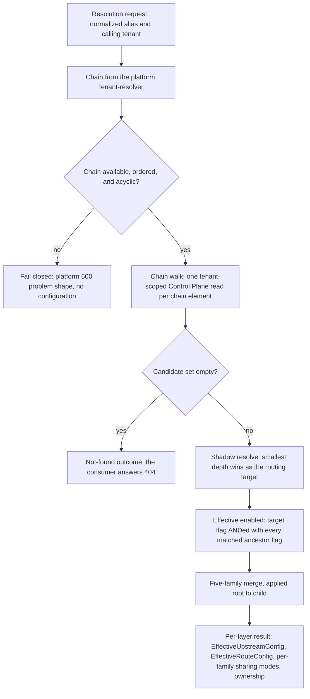

# Feature: Hierarchical Configuration

<!-- toc -->

- [1. Feature Context](#1-feature-context)
  - [1.1 Overview](#11-overview)
  - [1.2 Purpose](#12-purpose)
  - [1.3 Actors](#13-actors)
  - [1.4 References](#14-references)
  - [1.5 Feature-Local Deviations from Shared Baselines](#15-feature-local-deviations-from-shared-baselines)
  - [1.6 Explicit Non-Applicability](#16-explicit-non-applicability)
- [2. Actor Flows (CDSL)](#2-actor-flows-cdsl)
  - [Bind a Descendant Upstream to an Ancestor Upstream](#bind-a-descendant-upstream-to-an-ancestor-upstream)
  - [Override an Inherited Configuration Field](#override-an-inherited-configuration-field)
  - [Resolve the Effective Configuration for a Proxy Request](#resolve-the-effective-configuration-for-a-proxy-request)
- [3. Processes / Business Logic (CDSL)](#3-processes--business-logic-cdsl)
  - [Tenant Chain Walk from Descendant to Root](#tenant-chain-walk-from-descendant-to-root)
  - [Ancestor Alias Resolution and Shadowing](#ancestor-alias-resolution-and-shadowing)
  - [Per-Field-Family Effective Merge](#per-field-family-effective-merge)
  - [Sharing-Mode and Permission Decision](#sharing-mode-and-permission-decision)
  - [Binding-Style Creation with Tenant-Local Tags](#binding-style-creation-with-tenant-local-tags)
- [4. States (CDSL)](#4-states-cdsl)
- [5. Definitions of Done](#5-definitions-of-done)
  - [Tenant Chain Walk](#tenant-chain-walk)
  - [Alias Shadowing and Effective Enabled State](#alias-shadowing-and-effective-enabled-state)
  - [Per-Field-Family Effective Merge](#per-field-family-effective-merge-1)
  - [Sharing-Mode and Permission Decision](#sharing-mode-and-permission-decision-1)
  - [Descendant Override Permissions](#descendant-override-permissions)
  - [Binding-Style Creation with Tenant-Local Tags](#binding-style-creation-with-tenant-local-tags-1)
  - [Effective Configuration Result Types](#effective-configuration-result-types)
  - [Resolution Test Coverage and Placement](#resolution-test-coverage-and-placement)
- [6. Acceptance Criteria](#6-acceptance-criteria)

<!-- /toc -->

<!-- toc -->

- [ ] `p1` - **ID**: `cpt-cf-oagw-featstatus-hierarchical-config-implemented`

<!-- reference to DECOMPOSITION entry -->
- [ ] `p2` - `cpt-cf-oagw-feature-hierarchical-config`

## 1. Feature Context

### 1.1 Overview

This feature turns many tenants' configuration into one answer. It walks the tenant tree from a calling tenant to the platform root using the chain the platform tenant-resolver supplies, resolves an alias against that chain with the closest match winning, applies the three sharing modes `private`, `inherit`, and `enforce` per configuration field, and produces one effective configuration per resolution: an `EffectiveUpstreamConfig` and an `EffectiveRouteConfig` whose five field families (auth, rate limit, plugins, CORS, tags) are already merged.

### 1.2 Purpose

DECOMPOSITION §2.3 places this feature third in the feature graph, behind `cpt-cf-oagw-feature-control-plane-config`, which persists the upstream and route rows this feature walks and owns the sharing-mode fields on those rows. Every feature downstream of it consumes the effective configuration: `cpt-cf-oagw-feature-data-plane-proxy` calls the resolution on every proxy request and applies the result in the upstream, then route, then tenant order; `cpt-cf-oagw-feature-rate-limiting` consumes the rate-limit row of the merge; `cpt-cf-oagw-feature-cors` consumes the CORS row. Without it, a partner or customer tenant can neither inherit, tighten, nor be forced by an ancestor's configuration, and every tenant is an island that happens to share a database.

This feature delivers the DESIGN §3.2 Hierarchical Configuration subsection — the four-row merge table and the tag paragraph — together with the plugin-free share of the DESIGN §3.2 Permissions and Access Control subsection, which is the four descendant override permissions `oagw:upstream:bind`, `oagw:upstream:override_auth`, `oagw:upstream:override_rate`, and `oagw:upstream:add_plugins`. Alias derivation, normalization, and `(tenant_id, alias)` uniqueness are not delivered here: `cpt-cf-oagw-feature-control-plane-config` derives and enforces the alias at write time, and this feature resolves an already-normalized alias against the chain, reusing the foundation's normalization routine so that write-time storage and resolution can never disagree about what an alias looks like.

Deliverables:

- The tenant chain walk from descendant to root, and the per-tenant `(tenant_id, alias)` lookup that produces the ordered candidate set.
- Ancestor alias resolution and shadowing, with the enforced fields of a shadowed ancestor carried into the result and the effective `enabled` state computed across the chain.
- The per-field effective merge for all five field families: auth, rate limit, plugins, CORS, and tags.
- The sharing-mode and permission decision for `private`, `inherit`, and `enforce`, applied per configuration field.
- Binding-style upstream creation against an ancestor alias, with request tags kept as tenant-local additions.
- `EffectiveUpstreamConfig`, `EffectiveRouteConfig`, `TenantChain`, `AncestorBinding`, and the per-family merge results.

**Requirements**:

- [x] `p2` - `cpt-cf-oagw-fr-config-layering`
- [x] `p2` - `cpt-cf-oagw-fr-hierarchical-config`
- [x] `p2` - `cpt-cf-oagw-fr-alias-resolution`
- [ ] `p1` - `cpt-cf-oagw-fr-enable-disable`
- [ ] `p1` - `cpt-cf-oagw-nfr-multi-tenancy`

**Principles**:

- `p1` - `cpt-cf-oagw-principle-tenant-scope`

**Constraints**:

- `p1` - `cpt-cf-oagw-constraint-multi-sql`

**Design Components**:

- `p2` - `cpt-cf-oagw-component-model`

**Domain Model Entities**:

- `SharingMode` (`private` / `inherit` / `enforce`), one value per configuration field family
- `EffectiveUpstreamConfig` and `EffectiveRouteConfig`, one per layer per resolution
- `TenantChain`, the ordered ancestor chain the platform supplies
- `AncestorBinding`, the alias-match link between a descendant's upstream row and a more distant ancestor's upstream row with the same normalized alias
- The per-family merge results `EffectiveAuth`, `EffectiveRateLimit`, `EffectivePluginChain`, `EffectiveCors`, and `EffectiveTagSet`

`cpt-cf-oagw-nfr-multi-tenancy` is carried as coverage rather than as a delivered requirement: DECOMPOSITION §2.3 lists it unchecked alongside the three checked requirements, and the threshold it states — zero cross-tenant data access — is met here by the fact that every read in the walk is tenant-scoped and no tenant's rows are ever read for a caller that cannot read them. The persisted scoping itself, the predicate that makes that true, belongs to `cpt-cf-oagw-feature-control-plane-config` (`cpt-cf-oagw-dod-tenant-scoping`).

### 1.3 Actors

| Actor | Role in Feature |
|-------|-----------------|
| `cpt-cf-oagw-actor-tenant-admin` | Creates an upstream whose alias matches an ancestor's (the bind), overrides the inherited fields its permissions allow, and receives the 400, 403, 404, and 409 answers the sharing modes and the permissions produce. |
| `cpt-cf-oagw-actor-app-developer` | Originates the proxy request whose alias this feature resolves; the request reaches this feature through the resolution routine the Data Plane calls, not through any endpoint of this feature. |

`cpt-cf-oagw-actor-platform-operator` is named by PRD §5.5 as an actor of both `cpt-cf-oagw-fr-config-layering` and `cpt-cf-oagw-fr-hierarchical-config`, because the ancestor side of every walk is configuration somebody at or above the partner tenant authored. DECOMPOSITION §1.5 maps that actor to `gear-foundation`, `control-plane-config`, `plugin-system`, and `observability`, and does not list this feature against it. Both statements are honoured here: the operator participates as the author of the ancestor configuration the walk consumes, every operation that configuration is written through is a management write `cpt-cf-oagw-feature-control-plane-config` registers, and no flow below names the operator as its triggering actor. This feature adds no surface the operator does not already have.

The other four actors do not participate:

- `cpt-cf-oagw-actor-cred-store` is not called. The merge carries `auth.type` and the opaque `auth.config` object; resolving a `secret_ref` into secret material happens at proxy time and belongs to `cpt-cf-oagw-feature-plugin-system` and `cpt-cf-oagw-feature-data-plane-proxy`. DECOMPOSITION §1.5 lists the credential store under `cpt-cf-oagw-feature-plugin-system` alone.
- `cpt-cf-oagw-actor-types-registry` is not called. The GTS catalogue was provisioned once by `cpt-cf-oagw-feature-gear-foundation`; a resolution registers no type.
- `cpt-cf-oagw-actor-upstream-service` is never contacted. No resolution opens a connection; the first outbound dial of a proxied request happens after this feature has returned.
- `cpt-cf-oagw-actor-app-developer` is named above as the originator of a resolution and nothing more: DECOMPOSITION §1.5 maps that actor to `data-plane-proxy`, `rate-limiting`, and `streaming`, the features that own the surface the developer touches, and this feature exposes no endpoint to anyone (DECOMPOSITION §2.3, `API: None`).

### 1.4 References

- **PRD**: [PRD.md](../PRD.md)
- **Design**: [DESIGN.md](../DESIGN.md)
- **Dependencies**: `cpt-cf-oagw-feature-control-plane-config` — the persisted upstream and route rows this feature reads, the repository traits it reads them through, the Control Plane L1 cache those reads go through, the write path that stores the rows a bind-style create produces, and the sharing-mode fields whose values are the input to every decision below (DECOMPOSITION §3).

Supporting sources this feature stays consistent with:

- [schemas/upstream.v1.schema.json](../schemas/upstream.v1.schema.json) and [schemas/route.v1.schema.json](../schemas/route.v1.schema.json) — the per-family `sharing` enums (`auth.sharing`, `plugins.sharing`, `rate_limit.sharing`, `cors.sharing`, each defaulting to `private`) whose values are the input to the sharing-mode decision, and the `tags` arrays that carry no sharing field at all. Both files are frozen inputs this run does not edit.
- [ADR/0003-rate-limiting.md](../ADR/0003-rate-limiting.md) (`cpt-cf-oagw-adr-rate-limiting`) — the inheritance table whose `private` row states that an ancestor limit marked `private` contributes nothing, and whose `enforce` row states that the effective limit is `min(parent, child)`. The token bucket that enforces the merged value belongs to `cpt-cf-oagw-feature-rate-limiting`.
- [ADR/0004-cors.md](../ADR/0004-cors.md) (`cpt-cf-oagw-adr-cors`) — the hierarchical CORS example (parent and child origins unioned under `inherit`, child additions refused under `enforce`).
- [ADR/0005-data-plane-caching.md](../ADR/0005-data-plane-caching.md) (`cpt-cf-oagw-adr-data-plane-caching`) — the `upstream:{tenant_id}:{alias}` cache-key shape, which is one entry per chain element of the walk below.
- [ADR/0006-state-management.md](../ADR/0006-state-management.md) (`cpt-cf-oagw-adr-state-management`) — the `CP.resolve_proxy_target(alias, method, path)` entry point whose single tenant hierarchy walk and effective-config merge are this feature's §3 routines, and the `(EffectiveUpstream, MatchedRoute)` pair the Data Plane caches.
- [config/e2e-local.yaml](../../../../../config/e2e-local.yaml) — the graded configuration. Its `gears.oagw.config` block carries only `proxy_timeout_secs`, `allow_http_upstream`, and `ssrf_policy.enabled`, so there is no hierarchy, sharing, or chain key to configure; the tenant tree it grades against is declared under the `static-tr-plugin` gear as a `tenants` list of `id`, `name`, `parent_id`, and `status`, and a `tenant-resolver` gear sits alongside it with a `vendor` key and nothing else.

**Run-level assumptions** — premises this feature relies on that come from the platform runtime rather than from PRD, DESIGN, the ADRs, or DECOMPOSITION:

- Assumption: the platform tenant-resolver exposes the calling tenant's ancestor chain to the `oagw` gear, through the same in-process SDK style the `types_registry` and `cred_store` contracts use. PRD §11 states only that "OAGW receives tenant_id from SecurityContext" and that "Tenant hierarchy is resolved by the platform (tenant-resolver gear)"; DESIGN §3.3 Tenant Scoping states that `resolve_alias` "walks the tenant chain"; DECOMPOSITION §2.3 assigns the walk here and puts the tree outside this feature. No supplied document states that the chain itself is handed to a gear. `config/e2e-local.yaml` gives the `tenant-resolver` gear a `vendor` key and nothing else, so nothing in the graded configuration names an OAGW-consumable chain key. If the chain is not exposed, the walk cannot run, and every resolution must fail closed — a not-found outcome, never a guess and never a cross-tenant answer.
- Assumption: the chain arrives as an ordered list from the calling tenant to the platform root, inclusive of both ends, without cycles, and with the calling tenant as its first element. The shadowing order of PRD §5.5 (`subsub-tenant`, then `sub-tenant`, then `root-tenant`) is stated as an order, but no source states the list's shape or which end is first. If the resolver omits the calling tenant, the walk prepends it, because the calling tenant's own rows must be the closest candidates; if the order is absent, the walk cannot order candidates and must fail closed rather than pick one.
- Assumption: the four descendant override permissions `oagw:upstream:bind`, `oagw:upstream:override_auth`, `oagw:upstream:override_rate`, and `oagw:upstream:add_plugins` are denied by default, and this feature evaluates them itself, inside its own flows at the point where the sharing-mode decision runs; the platform middleware that step 2 of each management flow names enforces the management permission family `gts.cf.core.oagw.upstream.v1~:{create;override;read;delete}` only and does not evaluate these four. The 403 a denied override produces is therefore this feature's own answer, returned as a bare 403 problem answer and not as a `DomainError` variant. DESIGN §3.2 says only that the ability to override "depends on permissions granted by ancestors"; no supplied document states who grants them, where they are stored, or how they are evaluated. If the platform does not grant and store them, this feature has nothing to evaluate, and the override path must deny rather than allow, because an unenforceable permission is not a permission.
- Assumption: the chain depth bounds the walk's cost. `config/e2e-local.yaml` declares seven tenants on four active levels — `e2e-root` at the first level, `hierarchy-root` at the second, `hierarchy-l1a` and `hierarchy-l1b` at the third, and `hierarchy-l2b` and `hierarchy-l2c` active at the fourth, alongside a fourth-level `hierarchy-l2a-deleted` whose `status` is `deleted` and which is therefore not an active participant. The static tokens it declares reach only the first three of those levels, so the deepest chain an authenticated graded caller produces is three tenants. If a deployment supplies a chain deeper than the platform bounds it, the walk's cost grows with it and no cache in this feature caps that, because this feature owns no cache.

### 1.5 Feature-Local Deviations from Shared Baselines

| Deviation | Rationale | Review owner | Validation performed |
|-----------|-----------|--------------|----------------------|
| The resolution result is named `EffectiveUpstreamConfig` and `EffectiveRouteConfig`, not the `EffectiveUpstream` and `MatchedRoute` names of the ADR 0006 request-flow diagram. | DECOMPOSITION §1.3 states that it prevails over the supplied documents wherever they conflict, and DECOMPOSITION §2.3 names the two entities this feature delivers. The ADR names appear once, inside a code block that sketches a request flow. `cpt-cf-oagw-feature-data-plane-proxy` reads its own DECOMPOSITION §2.5 entity names — `ResolvedUpstream`, `SelectedEndpoint`, and `MatchedRoute` — for the resolution it performs at proxy time, so the two features' result types are distinct and not shared. | The controller of this run. | Accepted by the semantic review of this run; `cfs validate --artifact` clean. |
| The walk collects candidates from descendant to root and the merge is applied from root to child. | DESIGN §3.3 Tenant Scoping states that `resolve_alias` "walks the tenant chain (descendant → root)"; DESIGN §3.6 Common Queries states that resolving the effective configuration means "walk hierarchy, collect bindings, merge from root to child per sharing modes". Both are true at once: the collection order decides who shadows whom, and the application order decides which value is the base and which the override. Applying the merge in the collection order would make the root's value the override of the leaf's, which contradicts every per-field strategy in DESIGN §3.2. | The controller of this run. | Accepted by the semantic review of this run; `cfs validate --artifact` clean. |
| A bind-style create against an ancestor upstream whose field is `private` proceeds and inherits nothing for that field; `private` blocks the visibility of the ancestor's value, not the bind itself. | PRD §5.5 defines `private` as "not visible to descendants (default)" and DESIGN §3.3 CRUD Semantics lists `private` as one of the sharing-mode constraints a bind respects. Reading `private` as blocking the bind itself would make the default mode block every bind, because all four sharing-bearing families default to `private` in the shipped schema, and would leave PRD §5.5's binding-style sentence with no reachable case. The ancestor's `private` value is therefore never read into a result, never copied onto the descendant's row, and never echoed in an answer. | The controller of this run. | Accepted by the semantic review of this run; `cfs validate --artifact` clean. |
| A field the ancestor marks `private` needs no descendant override permission, so a descendant's own value for it is its own configuration. | DESIGN §3.2 states that "without appropriate permissions, descendant must use ancestor's configuration as-is (even with `sharing: inherit`)". The qualifier names `inherit`, which is the only mode under which an ancestor value exists to use as-is; with `private` there is no inherited value, so there is nothing to override and no permission to consume. | The controller of this run. | Accepted by the semantic review of this run; `cfs validate --artifact` clean. |
| An override an ancestor `enforce` field blocks is answered 400 with the validation error, not 403. | DESIGN §3.3's error catalogue (`cpt-cf-oagw-interface-api`) has no 403 row: its client-error rows are 400, 401, 404, and the single 409 `PluginInUse` row; it has no 403 row. The catalogue is `cpt-cf-oagw-feature-gear-foundation`'s to own and this feature must not add a variant to it. An `enforce` sharing mode is a property of the ancestor's stored configuration, so a body that supplies a value for such a field fails the validation of that write against the effective configuration, which is what the 400 row answers. | The controller of this run. | Accepted by the semantic review of this run; `cfs validate --artifact` clean. |
| An override a descendant lacks the permission for is answered 403 by this feature, at the point where the sharing-mode decision runs, and is not a `DomainError` variant. | The `oagw:upstream:*` descendant override permissions are evaluated inside this feature's flows, not by the platform middleware, which enforces only the management permission family at step 2 of each management flow. One ordering rule governs both management flows: schema validation, then the permission check, then the per-family sharing checks, so the 403 precedes any `enforce` 400, because an unauthorized caller must not learn which families are enforced. This is the answer `cpt-cf-oagw-feature-control-plane-config` gives for a missing management permission, and it keeps one answer for one class of failure: a permission the caller does not hold is an authorization outcome, not a property of the body. The permission family is the `oagw:upstream:*` one, whose evaluation is a run-level assumption recorded in §1.4. | The controller of this run. | Accepted by the semantic review of this run; `cfs validate --artifact` clean. |
| The `min(ancestor, descendant)` rate-limit strategy is applied to an ancestor rate limit only when that ancestor marks it `inherit` or `enforce`; an ancestor `rate_limit` marked `private` contributes nothing and the descendant's own value stands alone. | DESIGN §3.2 states the strategy without restating the mode gate; ADR 0003's inheritance table states it explicitly, with `private` yielding "child's limit only" and `enforce` yielding `min(parent, child)`. The per-family `sharing` field is what carries the mode, so a family marked `private` cannot be a participant in a merge with a descendant's value. | The controller of this run. | Accepted by the semantic review of this run; `cfs validate --artifact` clean. |
| Comparing two sustained rates — and, under the same rule, two `burst.capacity` values — requires a common scale, and no supplied document states one for the rate. The merge normalizes both rates to requests per second, takes the minimum of the visible rates and the minimum of the visible `burst.capacity` values under the same mode gate, and reports the effective limit in the window of the value that supplied the rate minimum and the effective burst as the capacity that supplied the capacity minimum. | `min` is stated over values that carry a `sustained.window` of `second`, `minute`, `hour`, or `day`, so `100/second` against `5000/minute` is not decidable without a normalization. Per-second normalization is the only unit-free comparison available, and reporting the winner's own window keeps the merged value inside the schema's `window` enum rather than inventing a sub-second unit the schema does not declare. `burst.capacity` is declared as a plain integer with no window of its own, so its common scale is the token count itself and no unit conversion arises for it; it is brought to a common scale exactly as the sustained rate is, and neither minimum is decidable without that common scale. | The controller of this run. | Accepted by the semantic review of this run; `cfs validate --artifact` clean. |
| The sustained rate and `burst.capacity` are each merged as a minimum; `algorithm`, `scope`, `strategy`, and `cost` are carried as they are, and no merge is applied to them. | ADR 0003's Example 1 computes an effective burst as a minimum across the chain (`min(1000, 500, 100)` = `100`) beside the effective sustained rate it computes the same way, so the supplied baseline does state a merge for `burst.capacity`. DESIGN §3.2's row, PRD §5.5's override rule, ADR 0003's inheritance table, and DECOMPOSITION §2.6's canonical form all state a minimum over limits and none of them states a merge for `algorithm`, `scope`, `strategy`, or `cost`. The token-bucket meaning of those members belongs to `cpt-cf-oagw-feature-rate-limiting` (DECOMPOSITION §2.6), which is also where budget modes and overcommit validation live. | The controller of this run. | Accepted by the semantic review of this run; `cfs validate --artifact` clean. |
| The CORS union is confined to `allowed_origins`. Under `enforce` the ancestor's whole `cors` object is the effective one; under `inherit` the origins union and the remaining CORS members come from the routing target's row; under `private` the routing target's own object is the effective one. | DESIGN §3.2's row states "union origins if `inherit`; forced if `enforce`" and ADR 0004's merge example unions `allowed_origins` and nothing else. No supplied document states a merge for `enabled`, `allowed_methods`, `expose_headers`, or `allow_credentials`, and a union over `allow_credentials` is not a meaningful operation. | The controller of this run. | Accepted by the semantic review of this run; `cfs validate --artifact` clean. |
| The `headers` family is not merged across the hierarchy; the header rules of the upstream that owns the resolution apply. | Neither shipped schema declares a `sharing` field on `headers`, and DESIGN §3.2's merge table has no row for it. Header transformation itself belongs to `cpt-cf-oagw-feature-data-plane-proxy` (DECOMPOSITION §2.5), so a merge here would produce a value nothing is specified to consume. The gap is recorded rather than filled by analogy. | The controller of this run. | Accepted by the semantic review of this run; `cfs validate --artifact` clean. |
| The four-permission table of DESIGN §3.2 names no permission for the CORS family, so a descendant's own `cors` under an ancestor's `inherit` is gated by the sharing mode alone, and the union of ADR 0004 happens with no permission check. | The table lists exactly `oagw:upstream:bind`, `oagw:upstream:override_auth`, `oagw:upstream:override_rate`, and `oagw:upstream:add_plugins`, and DECOMPOSITION §2.3 lists the same four as this feature's deliverable. Inventing a fifth permission is outside this feature's authority, and refusing the union would collapse `cors.sharing: inherit` into the same descendant-visible behaviour as `enforce`, which would leave ADR 0004's merge example — parent and child origins unioned — with no reachable case. | The controller of this run. | Accepted by the semantic review of this run; `cfs validate --artifact` clean. |
| The four `oagw:upstream:*` permissions gate the same families on a route row as on an upstream row, and the `upstream` segment of their names is the family namespace, not a restriction to upstream rows. | A route carries three of the four sharing-bearing families (`rate_limit`, `plugins`, `cors`), and of those three `rate_limit` is the only one whose override permission exists in the four-permission table (`oagw:upstream:override_rate`); `plugins` is gated by the plugin arms that `cpt-cf-oagw-feature-plugin-system` enforces; and `cors` has no permission at all, so `cors.sharing` alone decides. DESIGN §3.2's table states the abilities — "specify own rate limits (subject to min())", "append own plugins to inherited chain" — over the configuration, and DECOMPOSITION §2.6 states the route rate as one participant of the same `min` that the permission gates. No supplied document states a second permission family for routes, and `cpt-cf-oagw-interface-management-api` declares none. | The controller of this run. | Accepted by the semantic review of this run; `cfs validate --artifact` clean. |
| The effective `enabled` state is the conjunction across every ancestor row the walk matched on the alias, regardless of that row's per-family sharing modes, including a row whose families are all `private`. | The shipped schema gives `enabled` no `sharing` sibling, so the mode gate that applies to the four sharing-bearing families has nothing to attach to; PRD §5.1 (`cpt-cf-oagw-fr-enable-disable`) states the ancestor disable rule unconditionally ("disabled for all descendants"), and DECOMPOSITION §1.3(11) preserves `enabled` across a replacement that omits it, and DECOMPOSITION §2.3 assigns the walk and the effective `enabled` state to this feature. Reading `private` as blocking the flag would make a disabled-and-private ancestor invisible to the very check that keeps it disabled. | The controller of this run. | Accepted by the semantic review of this run; `cfs validate --artifact` clean. |
| The ancestor binding is not materialized: it is the alias match the walk discovers between a descendant's row and a more distant ancestor's row with the same normalized alias, and no table, column, or join row records it. | DESIGN §3.6 tabulates the gear's tables and none of them is a binding table; the upstream table's only uniqueness key is `(tenant_id, alias)`. DECOMPOSITION §2.3 lists "ancestor binding" among this feature's entities and, in the same entry, puts persisting hierarchy data out of scope. Deriving the binding from the alias match at resolution time is the only reading under which both hold, and it is also what makes `private`-blocks-visibility enforceable: a binding that no row records cannot outlive the configuration that produced it. | The controller of this run. | Accepted by the semantic review of this run; `cfs validate --artifact` clean. |
| This feature's tests are colocated at `gears/system/oagw/oagw/tests/` instead of `testing/e2e/gears/oagw/`. | DECOMPOSITION §1.3(3) reserves `testing/e2e/gears/oagw/` for the acceptance suite; every unit and integration test this decomposition produces lives with the crate. This is the same deviation `cpt-cf-oagw-feature-gear-foundation` and `cpt-cf-oagw-feature-control-plane-config` record in their own §1.5 tables, restated here because the tests it governs include this feature's. | The controller of this run. | Accepted by the semantic review of this run; `cfs validate --artifact` clean. |

### 1.6 Explicit Non-Applicability

The areas below apply to the gear as a whole but not to this feature. Each is stated here so the omission is a recorded decision rather than a silent gap.

- **Proxy-time consumption**: the effective configuration is this feature's output and nothing more. Applying it, matching the route against a request, executing the plugin chain, and answering the caller belong to `cpt-cf-oagw-feature-data-plane-proxy` (DECOMPOSITION §2.5), which also decides whether an ancestor-owned target may be used at all under the "owned by token's tenant or shared by ancestor" authorization check of DESIGN §3.3. This feature supplies the per-field sharing modes and the resolved ownership that check needs; it renders no verdict of its own.
- **Token-bucket mechanics**: the merge produces one effective sustained rate and one effective `burst.capacity`; counting requests against them, answering 429, and emitting the `X-RateLimit-*` and `Retry-After` headers belong to `cpt-cf-oagw-feature-rate-limiting` (DECOMPOSITION §2.6), together with the budget modes and overcommit validation of ADR 0003.
- **CORS enforcement**: the merged CORS configuration is this feature's output; the permissive preflight answer, the origin check, and the 403 answer for a disallowed origin belong to `cpt-cf-oagw-feature-cors` (DECOMPOSITION §2.7).
- **Persisting hierarchy data**: the tenant tree comes from the platform tenant-resolver, so this feature creates no table, writes no hierarchy row, adds no column to the tables `cpt-cf-oagw-feature-control-plane-config` owns, and claims no share of `cpt-cf-oagw-db-schema`, which DECOMPOSITION §2.3 confirms by listing `Data: None` for this entry.
- **Events**: no event is published or consumed here. A resolution is a read, and the audit log, the metrics, and the configuration-change reporting that describe configuration belong to `cpt-cf-oagw-feature-observability`.
- **Rollout and rollback**: the gear is one configuration item and one release unit (DECOMPOSITION §1.4), so this feature ships no rollout of its own and has no independent rollback path. It persists nothing, so there is no state of its own to roll back.
- **Readiness and health**: this feature contributes no readiness or health signal of its own. Gear readiness belongs to `cpt-cf-oagw-feature-gear-foundation`'s provisioning state machine, and the failures a resolution can produce surface only as the protocol answers §2 and §3 already declare — a not-found outcome, the bare 403 problem answer of §1.5, or the platform 500 problem shape — never as a health probe, a readiness gate, or a status endpoint of this feature's.
- **Versioning**: every GTS identifier this feature reads or produces is fixed at `.v1` by DESIGN §3.1. No version negotiation, aliasing, or migration surface exists here, and the `.v1` of a resolved configuration type is not a versioned contract with any caller.
- **Compliance and privacy**: the families this feature merges are endpoint sets, sharing values, plugin references, rate limits, CORS origin lists, and tag strings; none carries personal or regulated data. The one credential-bearing family, `auth`, is merged as the opaque `auth.type` identifier plus the `auth.config` object, whose content the shipped schema leaves unconstrained; this feature never inspects that content, never resolves it, never logs it, and never echoes it in a problem `detail`. An ancestor value marked `private` is never read into a result, so no `private` value can reach the output at all. Resolving the reference into secret material happens at proxy time and belongs to `cpt-cf-oagw-feature-plugin-system`.
- **Performance**: no latency or throughput target is set here, because `cpt-cf-oagw-nfr-low-latency` is allocated to `cpt-cf-oagw-feature-data-plane-proxy`, which owns the request hot path. What this feature contributes is a walk whose cost is one candidate lookup per chain element, issued through the Control Plane L1 cache `cpt-cf-oagw-feature-control-plane-config` owns in the `upstream:{tenant_id}:{alias}` key shape of ADR 0005, and a merge that allocates one result set per resolution; each per-element read is bounded by the platform request deadline the gear already carries, as §3 states for the walk. It owns no cache and adds none to the hot path.
- **UX (recorded as applicable, not excluded)**: this feature does have actor surface, through the management endpoints the bind and the override ride on, so UX is deliberately absent from this list. It is discharged as protocol answers: every actor-facing outcome below is an HTTP status with an `application/problem+json` body produced by the foundation's error mapping, and this feature adds no rendered surface, no locale negotiation, and no new endpoint to document.

## 2. Actor Flows (CDSL)

The flows below reuse the management operation order DESIGN §3.5 states — authenticate, validate the DTO, write, respond — and the management endpoints `cpt-cf-oagw-feature-control-plane-config` registers under `/oagw/v1`. DECOMPOSITION §2.3 states `API: None` for this feature: no path is registered here, and the paths named below are referenced by path and by `cpt-cf-oagw-interface-management-api` only.

**Use cases**: `cpt-cf-oagw-usecase-configure-upstream` — this feature contributes the alias-match branch of that use case's `POST /oagw/v1/upstreams` main flow, which PRD §8 states only as "Alias conflict: Return 409 Conflict" and DESIGN §3.3 CRUD Semantics states as the bind. `cpt-cf-oagw-feature-control-plane-config` delivers the rest of that use case, and `cpt-cf-oagw-usecase-proxy-request` belongs to `cpt-cf-oagw-feature-data-plane-proxy`, which calls the resolution this feature delivers.

### Bind a Descendant Upstream to an Ancestor Upstream

- [x] `p1` - **ID**: `cpt-cf-oagw-flow-bind-ancestor-upstream`

**Actor**: `cpt-cf-oagw-actor-tenant-admin`

**Success Scenarios**:

- A descendant tenant creates an upstream whose normalized alias matches an ancestor's upstream while holding `oagw:upstream:bind`; the operation is a bind, the descendant's own row is persisted, and the answer is 201 with the descendant's identifier, not a 409.
- The ancestor marks a family `private`: the create succeeds with the descendant's own value for that family, and no ancestor value is read, copied, or echoed.
- The ancestor marks a family `enforce` and the body carries no value for it: the create succeeds, and the ancestor's value is forced in every later resolution.
- The request tags are stored on the descendant's row only, and the ancestor's tag rows are byte-identical after the operation.
- The alias matches no upstream anywhere in the chain: the operation is an ordinary create in the calling tenant, exactly as `cpt-cf-oagw-flow-upstream-create` performs it.

**Error Scenarios**:

- The bearer token lacks `oagw:upstream:bind` while the alias matches an ancestor upstream: 403, returned by this flow as a bare 403 problem answer after the body has passed schema validation and before any per-family sharing check runs, so the 403 precedes the `enforce` 400 and nothing is disclosed about the ancestor's configuration, including which families it enforces (§1.5).
- The body carries a value for a family the ancestor marks `enforce`: 400 naming that family (§1.5).
- The body fails schema validation, or another upstream of the calling tenant already holds the alias: 400, or 409 with the `AliasConflict` variant — both answered by `cpt-cf-oagw-feature-control-plane-config`'s write path before this flow's walk runs.
- The chain is unavailable: the operation fails closed with the platform 500 problem shape and no row is written.

**Steps**:

1. [x] - `p1` - Actor issues the create request carrying the endpoint set, the `protocol`, and any of `alias`, `auth`, `headers`, `rate_limit`, `cors`, `plugins`, `tags`, `enabled` - `inst-bind-issue`
2. [x] - `p1` - API: POST /oagw/v1/upstreams — the platform middleware authenticates the bearer token, resolves the calling tenant, and enforces `gts.cf.core.oagw.upstream.v1~:create` before any validation runs; the path is `cpt-cf-oagw-feature-control-plane-config`'s registration (`cpt-cf-oagw-interface-management-api`) - `inst-bind-authz`
3. [x] - `p1` - `cpt-cf-oagw-algo-request-validate` validates the body against `schemas/upstream.v1.schema.json` and that feature's §1.5 overrides, and `cpt-cf-oagw-algo-alias-derive` derives or validates the normalized alias - `inst-bind-validate`
4. [x] - `p1` - `cpt-cf-oagw-algo-tenant-scope` confirms the calling tenant holds no upstream with this alias; a duplicate answers 409 with the `AliasConflict` variant at that layer, before this flow's walk runs, so an ancestor's alias can never be mistaken for a same-tenant conflict - `inst-bind-own-scope`
5. [x] - `p1` - `cpt-cf-oagw-algo-tenant-chain-walk` walks the chain from the calling tenant to the root looking for the normalized alias - `inst-bind-walk`
6. [x] - `p1` - **IF** the walk returns no candidate at a depth greater than the calling tenant's - `inst-bind-noancestor-if`
   1. [x] - `p1` - The operation is an ordinary create: the write path of `cpt-cf-oagw-flow-upstream-create` persists the descendant's row and answers 201, with no permission beyond `create` consumed - `inst-bind-noancestor`
7. [x] - `p1` - **ELSE** - `inst-bind-ancestor-else`
   1. [x] - `p1` - `cpt-cf-oagw-algo-sharing-mode-decision` evaluates every family the body carries against the ancestor's per-family sharing modes and the calling tenant's `oagw:upstream:*` permission set - `inst-bind-decide`
   2. [x] - `p1` - **IF** the calling tenant does not hold `oagw:upstream:bind` - `inst-bind-perm-if`
      1. [x] - `p1` - **RETURN** 403; the bind is refused, no row is written, and no ancestor value is disclosed in the answer. This flow is already permission-first — the permission check runs after schema validation and before every per-family sharing check, so a caller that lacks the permission never learns which families the ancestor enforces (§1.5) - `inst-bind-perm-return`
   3. [x] - `p1` - **ELSE IF** the body carries a value for a family the ancestor marks `enforce` - `inst-bind-enforce-if`
      1. [x] - `p1` - **RETURN** 400 with the validation error naming that family; no row is written (§1.5) - `inst-bind-enforce-return`
   4. [x] - `p1` - **ELSE** - `inst-bind-write-else`
      1. [x] - `p1` - `cpt-cf-oagw-algo-bind-create-tags` records the ancestor binding and produces the write set for the descendant's own row; the write goes through the same single-transaction path `cpt-cf-oagw-flow-upstream-create` uses, with the request tags on the descendant's row only and every ancestor row untouched - `inst-bind-write`
8. [x] - `p1` - **RETURN** 201 with the descendant's own representation and its identifier as `gts.cf.core.oagw.upstream.v1~{uuid}`; the ancestor's rows are unchanged by the operation - `inst-bind-return`

A bind is never a conflict with an ancestor. The `(tenant_id, alias)` uniqueness key is per tenant, the ancestor's row is a different tenant's row, and the answer to a matching alias is a binding that requires a permission, not a 409. That is the continuation of the branch `cpt-cf-oagw-flow-upstream-create` explicitly leaves open. A `headers` object the body supplies is stored on the descendant's row and is never merged: the `headers` family takes no part in the hierarchy merge (§1.5), so the header rules of the descendant's own upstream are the ones that apply.

### Override an Inherited Configuration Field

- [x] `p1` - **ID**: `cpt-cf-oagw-flow-override-inherited-field`

**Actor**: `cpt-cf-oagw-actor-tenant-admin`

The management operation is a replacement of the tenant's own row, which is the row bound to an ancestor's. The same decision applies to a route replacement on the families a route carries (`rate_limit`, `cors`, `plugins`, `tags`); a route carries no `auth` family, so there is no inherited auth configuration for a descendant route to override.

**Success Scenarios**:

- The body carries an `auth` value while the ancestor's `auth.sharing` is `inherit` and the tenant holds `oagw:upstream:override_auth`; the override is stored, and the effective auth for the tenant is the tenant's own.
- The body carries a `rate_limit` while the tenant holds `oagw:upstream:override_rate`; a value stricter than the ancestor's wins in the effective configuration, and a looser one changes nothing in it.
- The body carries `plugins` items while the tenant holds `oagw:upstream:add_plugins`; the effective chain is the ancestor's items followed by the tenant's.
- The body adds tags; the effective tag set is the union, and a replacement that omits an inherited tag leaves that tag in the effective set.
- The body mentions no `enforce` family; the ancestor's values stay forced and the replacement succeeds.

**Error Scenarios**:

- The body carries a value for an `inherit` family whose override permission the tenant does not hold: 403, returned by this feature's sharing-mode decision as a bare 403 problem answer (§1.5).
- The body carries a value for a family the ancestor marks `enforce`: 400 naming that family. This 400 is answered only after the permission check has passed, because the ordering rule of §1.5 puts the 403 first.
- The `id` in the path names a nonexistent row, or one owned by another tenant including an ancestor: 404, with the two causes indistinguishable.
- The body fails schema validation: 400. The bearer token is missing or invalid: 401.

**Steps**:

1. [x] - `p1` - Actor issues the replacement of its own row, carrying the families it wants to set - `inst-ovr-issue`
2. [x] - `p1` - API: PUT /oagw/v1/upstreams/{id} — the platform middleware authenticates the bearer token and enforces `gts.cf.core.oagw.upstream.v1~:override` before any validation runs - `inst-ovr-authz`
3. [x] - `p1` - `cpt-cf-oagw-algo-tenant-scope` resolves the row by identifier and calling tenant; an ancestor's row can never satisfy the predicate - `inst-ovr-scope`
4. [x] - `p1` - **IF** no row matched, because the identifier does not exist or because it belongs to another tenant including an ancestor - `inst-ovr-scope-if`
   1. [x] - `p1` - **RETURN** 404; this is also the reason a descendant can never address an ancestor's row to relax an `enforce` field or to re-enable an ancestor-disabled one - `inst-ovr-scope-return`
5. [x] - `p1` - **ELSE** - `inst-ovr-scope-else`
   1. [x] - `p1` - `cpt-cf-oagw-algo-request-validate` validates the replacement body, and `cpt-cf-oagw-algo-put-replace-diff` builds the write set for the tenant's own row - `inst-ovr-validate`
   2. [x] - `p1` - `cpt-cf-oagw-algo-tenant-chain-walk` resolves the ancestor binding the row participates in, and `cpt-cf-oagw-algo-sharing-mode-decision` evaluates every family the body carries against it - `inst-ovr-decide`
   3. [x] - `p1` - **IF** the body carries a value for an `inherit` family whose override permission the calling tenant does not hold - `inst-ovr-perm-if`
      1. [x] - `p1` - **RETURN** 403; the permission check precedes every per-family sharing check, so the tenant uses the ancestor's value as-is — which is the DESIGN §3.2 rule for a permission-less descendant — and never learns which families the ancestor enforces (§1.5) - `inst-ovr-perm-return`
   4. [x] - `p1` - **ELSE IF** the body carries a value for a family the ancestor marks `enforce` - `inst-ovr-enforce-if`
      1. [x] - `p1` - **RETURN** 400 with the validation error naming that family; the stored row is left unchanged, and this 400 is reached only once the permission check above has passed (§1.5) - `inst-ovr-enforce-return`
   5. [x] - `p1` - **ELSE** - `inst-ovr-write-else`
      1. [x] - `p1` - DB: UPDATE the tenant's own row through `cpt-cf-oagw-algo-put-replace-diff`'s write set in one transaction; the ancestor's rows are not written, and the inherited tags stay in the effective set whatever the body's tag list holds - `inst-ovr-write`
6. [x] - `p1` - **RETURN** 200 with the tenant's own representation; the effective configuration it produces is recomputed at the next resolution, not stored on the row - `inst-ovr-return`

### Resolve the Effective Configuration for a Proxy Request

- [x] `p1` - **ID**: `cpt-cf-oagw-flow-resolve-effective-config`

**Actor**: `cpt-cf-oagw-actor-app-developer`

The developer's proxy request reaches this feature through the resolution routine the Data Plane calls, which is the `CP.resolve_proxy_target(alias, method, path)` entry of ADR 0006. No endpoint of this feature exists (DECOMPOSITION §2.3, `API: None`), so the steps below name no path and perform no write.

**Success Scenarios**:

- The calling tenant owns an upstream with the alias: it is the routing target, its configuration is the base, and no ancestor row contributes a value.
- The calling tenant owns none and an ancestor does: the ancestor's is the target, and its visible families are inherited per their sharing modes.
- Both exist: the descendant's shadows the ancestor's as the routing target, and the ancestor's `enforce` families still apply, including its rate limit.
- A contributing ancestor row is disabled: the effective `enabled` state is disabled for the calling tenant, with no write to any row.
- The chain holds a matching route at more than one level: the descendant's route wins, and the route-level families merge with the same strategies.

**Error Scenarios**:

- No candidate exists anywhere in the chain: a not-found outcome, which the consumer answers 404 per `cpt-cf-oagw-fr-error-codes`.
- The chain is unavailable, unordered, or cyclic: the resolution fails closed with the platform 500 problem shape and produces no configuration.
- The storage layer fails: the platform 500 problem shape, with no partial result returned.

**Steps**:

1. [x] - `p1` - The Data Plane requests the resolution, carrying the normalized alias and the calling tenant resolved from the SecurityContext - `inst-res-request`
2. [x] - `p1` - `cpt-cf-oagw-algo-alias-normalize` normalizes the alias, so a resolution can never disagree with a stored alias about shape, case, or a trailing dot - `inst-res-normalize`
3. [x] - `p1` - The chain is obtained from the platform tenant-resolver (§1.4) - `inst-res-chain`
4. [x] - `p1` - **IF** the chain is unavailable, unordered, or cyclic - `inst-res-chain-if`
   1. [x] - `p1` - **RETURN** failure; the resolution fails closed and produces no configuration, because an unordered chain cannot decide who shadows whom - `inst-res-chain-return`
5. [x] - `p1` - **ELSE** - `inst-res-chain-else`
   1. [x] - `p1` - `cpt-cf-oagw-algo-tenant-chain-walk` produces the ordered candidate set, one entry per chain element that holds the alias - `inst-res-walk`
   2. [x] - `p1` - `cpt-cf-oagw-algo-alias-shadow-resolve` selects the routing target, collects the ancestor bindings, and computes the effective `enabled` state - `inst-res-shadow`
   3. [x] - `p1` - `cpt-cf-oagw-algo-field-family-merge` produces the `EffectiveUpstreamConfig` from the target and its ancestor bindings - `inst-res-merge-upstream`
   4. [x] - `p1` - The matched route is resolved the same way along the chain, with the descendant's route taking priority, and `cpt-cf-oagw-algo-field-family-merge` produces the `EffectiveRouteConfig` for it - `inst-res-merge-route`
6. [x] - `p1` - **RETURN** the `EffectiveUpstreamConfig`, the `EffectiveRouteConfig`, the effective `enabled` state, and the per-family sharing modes and ownership the consumer needs for its own authorization check - `inst-res-return`

## 3. Processes / Business Logic (CDSL)

The routines below are called by the flows in §2 and by each other in the order `cpt-cf-oagw-algo-tenant-chain-walk`, then `cpt-cf-oagw-algo-alias-shadow-resolve`, then `cpt-cf-oagw-algo-field-family-merge`; `cpt-cf-oagw-algo-sharing-mode-decision` is called from both management flows, and `cpt-cf-oagw-algo-bind-create-tags` from the first. Every failure any of them returns is a `DomainError` from the foundation catalogue or the platform 500 problem shape for a storage failure; the 403 a missing `oagw:upstream:*` override permission produces is the one answer outside that catalogue, returned as a bare 403 problem answer and not as a `DomainError` variant (§1.5). No routine here writes to the database.

The resolution chain the first three routines form, with its fail-closed exits:

### Tenant Chain Walk from Descendant to Root

- [x] `p2` - **ID**: `cpt-cf-oagw-algo-tenant-chain-walk`

**Input**: the normalized alias, the calling tenant, the ancestor chain supplied by the platform tenant-resolver, and the repository read for upstream and route rows.

**Output**: the ordered candidate set — one entry per chain element that holds a row with that alias, each carrying its depth, its per-family sharing modes, its `enabled` flag, and its owning tenant — or an empty set.

**Steps**:

1. [x] - `p1` - Read the chain; prepend the calling tenant when the resolver omitted it, and treat a cycle or a missing order as an unavailable chain - `inst-walk-read`
2. [x] - `p1` - **IF** the chain is unavailable - `inst-walk-unavailable-if`
   1. [x] - `p1` - **RETURN** failure; the caller fails closed rather than resolving against a chain it cannot order (§1.4) - `inst-walk-unavailable-return`
3. [x] - `p1` - **ELSE** - `inst-walk-else`
   1. [x] - `p1` - **FOR EACH** tenant in the chain, from the calling tenant to the platform root - `inst-walk-loop`
      1. [x] - `p1` - DB: SELECT the upstream rows of that tenant whose alias equals the normalized alias, through the secure ORM with the tenant equality in the same predicate as every other key and with no raw SQL (`cpt-cf-oagw-principle-tenant-scope`), reading through the Control Plane L1 cache `cpt-cf-oagw-feature-control-plane-config` owns in the `upstream:{tenant_id}:{alias}` shape of ADR 0005 - `inst-walk-lookup`
      2. [x] - `p1` - **IF** the tenant holds such a row - `inst-walk-hit-if`
         1. [x] - `p1` - Append one candidate carrying the row's depth, its per-family sharing modes, its `enabled` flag, and its owning tenant identifier - `inst-walk-hit`
4. [x] - `p1` - **RETURN** the candidates ordered by increasing depth, the calling tenant first - `inst-walk-return`

The walk stops at the root and never descends: a tenant's own descendants are never candidates for its resolution, which is what keeps the answer tenant-scoped. One lookup is issued per chain element, so the chain depth bounds the cost, and no lookup is issued for a tenant whose rows the calling tenant cannot read. Each per-element Control Plane read is bounded by the platform request deadline the gear already carries — `OagwConfig.proxy_timeout_secs`, delivered by `cpt-cf-oagw-feature-gear-foundation` — and a breach of that deadline is a storage failure: it fails the resolution closed with the platform 500 problem shape, exactly as an unavailable chain does, and never yields a partial candidate set.

### Ancestor Alias Resolution and Shadowing

- [x] `p2` - **ID**: `cpt-cf-oagw-algo-alias-shadow-resolve`

**Input**: the ordered candidate set from `cpt-cf-oagw-algo-tenant-chain-walk`, each entry with its depth, sharing modes, and `enabled` flag.

**Output**: the routing target, the ordered ancestor bindings, and the effective `enabled` state.

**Steps**:

1. [x] - `p1` - **IF** the candidate set is empty - `inst-shadow-empty-if`
   1. [x] - `p1` - **RETURN** a not-found outcome; the consumer answers it 404 per `cpt-cf-oagw-fr-error-codes`, and this feature returns no configuration - `inst-shadow-empty-return`
2. [x] - `p1` - **ELSE** - `inst-shadow-else`
   1. [x] - `p1` - Select the candidate at the smallest depth as the routing target: the closest match wins, so a descendant's row shadows an ancestor's - `inst-shadow-target`
2. [x] - `p1` - Compare aliases on the normalized form only, case-insensitively, with the port participating in identity, so `api.openai.com` and `api.openai.com:8443` are never the same candidate - `inst-shadow-compare`
3. [x] - `p1` - Collect the remaining candidates, ordered from the most distant to the least, as the ancestor bindings - `inst-shadow-bindings`
4. [x] - `p1` - **FOR EACH** ancestor binding - `inst-shadow-loop`
   1. [x] - `p1` - **IF** the binding marks a family `enforce` - `inst-shadow-enforce-if`
      1. [x] - `p1` - Carry that family into the merge as forced, so shadowing never bypasses it (PRD §5.5, enforced limits across shadowing) - `inst-shadow-enforce`
   2. [x] - `p1` - **ELSE IF** the binding marks a family `inherit` - `inst-shadow-inherit-if`
      1. [x] - `p1` - Carry that family into the merge as the base value - `inst-shadow-inherit`
   3. [x] - `p1` - **ELSE** - `inst-shadow-private-else`
      1. [x] - `p1` - Carry nothing for that family; the binding's value is not read into the result, copied onto any row, or echoed in any answer (§1.5) - `inst-shadow-private`
5. [x] - `p1` - Compute the effective `enabled` state as the conjunction of the target's own flag with the flag of every ancestor row the walk matched on the alias, regardless of that row's per-family sharing modes, because `enabled` is a row-level state and carries no sharing field; so one disabled ancestor disables the resource for every descendant without a write, and no descendant write can raise it - `inst-shadow-enabled`
6. [x] - `p1` - **RETURN** the routing target, the ancestor bindings, and the effective `enabled` state - `inst-shadow-return`

The target decides where a request goes. The bindings decide what the request is subject to. A shadowing descendant can replace the target and can replace the values the ancestor marked `inherit`, and it can never replace the values the ancestor marked `enforce` or raise the effective `enabled` state.

### Per-Field-Family Effective Merge

- [x] `p2` - **ID**: `cpt-cf-oagw-algo-field-family-merge`

**Input**: the routing target's row, the ordered ancestor bindings with the families they contribute, and the layer being resolved (`upstream` or `route`).

**Output**: one `EffectiveUpstreamConfig` or one `EffectiveRouteConfig`, carrying the five family results.

The strategies, and the source of each:

| Family | Ancestor contributes | Descendant contributes | Effective value |
|--------|----------------------|------------------------|-----------------|
| Auth (`auth.sharing`) | its `auth` object when `inherit` or `enforce`; nothing when `private` | its own `auth` object when the ancestor's mode is `private` with no permission consumed, or when the mode is `inherit` and `oagw:upstream:override_auth` is held | the descendant's object when the mode is `inherit` and the permission is held; the ancestor's object when the mode is `enforce`; the descendant's own when the mode is `private`; otherwise the inherited object |
| Rate limit (`rate_limit.sharing`) | its sustained rate and its `burst.capacity` when `inherit` or `enforce`; nothing when `private` | its own sustained rate and its own `burst.capacity` when the ancestor's mode is `private` with no permission consumed, or when `oagw:upstream:override_rate` is held | the minimum of the visible sustained rates, normalized per §1.5 and reported in the winner's window, and the minimum of the visible `burst.capacity` values under the same mode gate and the same common-scale treatment, reported as the capacity that supplied that minimum; the remaining `rate_limit` members (`algorithm`, `scope`, `strategy`, `cost`) are carried unchanged (§1.5) |
| Plugins (`plugins.sharing`) | its plugin items when `inherit` or `enforce`; nothing when `private` | its own plugin items when the ancestor's mode is `private` with no permission consumed, or when `oagw:upstream:add_plugins` is held | the ancestor's items followed by the descendant's, in that order; an `enforce` ancestor's items are never removable by a replacement that omits them |
| CORS (`cors.sharing`) | its origins when `inherit` or `enforce`; nothing when `private` | its own origins when the ancestor's mode is `private`, or when the mode is `inherit`; the four-permission table names no permission for this family, so the sharing mode alone decides (§1.5) | the union of the origins when the mode is `inherit`; the ancestor's whole `cors` object when the mode is `enforce`; the routing target's own object when the mode is `private` (§1.5) |
| Tags (no sharing field) | its tags | its own tags | the union, add-only: descendants add and can never remove an inherited tag |

`tags` is the only family with no sharing field, which is why it never reaches `cpt-cf-oagw-algo-sharing-mode-decision`.

**Steps**:

1. [x] - `p1` - Start from the routing target's row as the base, and hold the ancestor bindings in most-distant-first order so the merge applies from root to child (§1.5) - `inst-merge-base`
2. [x] - `p1` - **FOR EACH** family in {auth, rate limit, plugins, CORS, tags} that the layer carries - `inst-merge-loop`
   1. [x] - `p1` - Apply the strategy row above for that family and record the result and the sharing mode that produced it - `inst-merge-apply`
3. [x] - `p1` - **IF** the layer is `route` - `inst-merge-route-if`
   1. [x] - `p1` - Skip the auth family, which a route does not carry, and produce an `EffectiveRouteConfig` - `inst-merge-route`
4. [x] - `p1` - **ELSE** - `inst-merge-upstream-else`
   1. [x] - `p1` - Produce an `EffectiveUpstreamConfig` with all five families - `inst-merge-upstream`
5. [x] - `p1` - **RETURN** the per-layer result with the per-family sharing modes attached, so the consumer can apply its own authorization check without re-walking the chain - `inst-merge-return`

The concatenation order within a layer is ancestor then descendant, which is what DESIGN §3.2 states for plugins and what the root-to-child application order produces for every family. The order across layers — upstream chain before route chain — is the execution order of the plugin chain and belongs to `cpt-cf-oagw-feature-data-plane-proxy` (DESIGN §3.2 Plugin System, DECOMPOSITION §2.5); this feature delivers one merged chain per layer and does not interleave them.

### Sharing-Mode and Permission Decision

- [x] `p2` - **ID**: `cpt-cf-oagw-algo-sharing-mode-decision`

**Input**: the ancestor's per-family sharing modes, the families the descendant's body carries, and the descendant's `oagw:upstream:*` permission set.

**Output**: one decision per family — `own`, `inherit-base`, or `forced` — or a refusal.

The decision table, over the four families that carry a sharing mode. The family's override permission is `oagw:upstream:override_auth` for auth, `oagw:upstream:override_rate` for rate limit, and `oagw:upstream:add_plugins` for plugins; the four-permission table of DESIGN §3.2 names no permission for CORS, so for that family the permission column is always `held` and the sharing mode alone decides (§1.5):

| Ancestor mode | Family's override permission | Body carries a value | Decision |
|---------------|------------------------------|----------------------|----------|
| `private` | any, or none | yes | `own` — the descendant's value is its own configuration; no override permission is consumed (§1.5) |
| `private` | any, or none | no | `own` — the family takes the schema default; no ancestor value exists to inherit |
| `inherit` | held | yes | `inherit-base` — the ancestor's value is the base and the body's value overrides it |
| `inherit` | held | no | `inherit-base` — nothing to authorize and nothing to override |
| `inherit` | missing | yes | refusal — 403, returned as a bare 403 problem answer and not as a `DomainError` variant (§1.5); the descendant uses the ancestor's value as-is |
| `inherit` | missing | no | `inherit-base` — no permission is needed when nothing is overridden |
| `enforce` | any | yes | refusal — 400 naming the family (§1.5) |
| `enforce` | any | no | `forced` — the ancestor's value is applied in every resolution |

**Steps**:

1. [x] - `p1` - **FOR EACH** sharing-bearing family the body carries - `inst-decide-loop`
   1. [x] - `p1` - **IF** no ancestor binding contributes that family - `inst-decide-noancestor-if`
      1. [x] - `p1` - Decide `own`; the family is the descendant's configuration and no permission is consumed - `inst-decide-noancestor`
   2. [x] - `p1` - **ELSE** decide from the table above, taking the ancestor's mode for that family - `inst-decide-row`
2. [x] - `p1` - **IF** any decision is a refusal - `inst-decide-refusal-if`
   1. [x] - `p1` - **RETURN** the first refusal in the order §1.5 fixes — the permission 403 before any `enforce` 400 — naming the family and the reason, so a caller is not made to retry once per blocked family and an unauthorized caller learns nothing about which families are enforced - `inst-decide-refusal-return`
3. [x] - `p1` - **RETURN** the per-family decisions - `inst-decide-return`

The four permissions map one to one onto the operations that need them: `oagw:upstream:bind` to the bind-style create, `oagw:upstream:override_auth` to the auth override, `oagw:upstream:override_rate` to specifying an own rate limit, and `oagw:upstream:add_plugins` to appending plugin items to an inherited chain. A descendant that holds none of them still resolves, proxies, and inherits; it only cannot change what it inherits, which is the DESIGN §3.2 rule that such a descendant uses the ancestor's configuration as-is. The same four permissions gate the same families on a route row, because a route carries three of the four sharing-bearing families and the permission names the override ability, not a table (§1.5).

### Binding-Style Creation with Tenant-Local Tags

- [x] `p2` - **ID**: `cpt-cf-oagw-algo-bind-create-tags`

**Input**: the validated create body, the ancestor binding the walk resolved, and the per-family decisions from `cpt-cf-oagw-algo-sharing-mode-decision`.

**Output**: the write set for the descendant's own row, or the refusal the decision produced.

**Steps**:

1. [x] - `p1` - Confirm the binding: an ancestor row at a greater depth with the same normalized alias; anything else is not a bind and the ordinary create path applies - `inst-bindtags-confirm`
2. [x] - `p1` - Take `id` and `tenant_id` from the calling tenant; the ancestor's identifiers, alias row, and endpoint set are never copied onto the descendant's row - `inst-bindtags-identity`
3. [x] - `p1` - Build the write set from the body for every family whose decision is `own` or `inherit-base`; a family whose decision is `forced` is never written to the descendant's row, because the ancestor's live value is applied by `cpt-cf-oagw-algo-field-family-merge` at resolution time (§1.5) - `inst-bindtags-families`
4. [x] - `p1` - Store the request tags on the descendant's row only, as `cpt-cf-oagw-flow-upstream-create`'s tag write does; no write reaches the ancestor's tag rows, and the effective tag set is the union computed at resolution time - `inst-bindtags-tags`
5. [x] - `p1` - **IF** any decision was a refusal - `inst-bindtags-refusal-if`
   1. [x] - `p1` - **RETURN** that refusal; no row is written and no ancestor value is disclosed - `inst-bindtags-refusal-return`
6. [x] - `p1` - **RETURN** the write set, for the single-transaction write the management flow performs - `inst-bindtags-return`

The tenant-local rule is what PRD §5.5 states for the binding-style flow: request tags are "treated as tenant-local additions for effective discovery; they do not mutate ancestor tags". The obligation this routine carries is therefore negative — after a bind-style create, the ancestor's tag rows are byte-identical to what they were, and the discovery benefit of the request tags accrues to the descendant's own tenant only.

## 4. States (CDSL)

No state machine is defined in this feature.

This feature is a resolution computation: it reads a chain, merges five families, and returns a result, and nothing it touches changes state as a result of running. The only lifecycle it comes near is the effective `Enabled` / `Disabled` state of an upstream or route, and that machine is already declared — `cpt-cf-oagw-state-config-lifecycle` in `cpt-cf-oagw-feature-control-plane-config`, whose transition 2 ("a contributing ancestor row is disabled") names this feature as the detection half. Declaring a second machine over the same two states would give one state two owners and would leave the stored flag and the effective state described by two documents that can drift apart, so the machine stays where the stored flag lives and this feature supplies the walk that makes its ancestor-driven transition observable.

The template marks this section optional ("include when entities have explicit lifecycle states"), and the kit's constraint set does not require it; the section is kept, with this reason, so the omission is a recorded decision rather than a gap in the numbering.

## 5. Definitions of Done

### Tenant Chain Walk

- [x] `p1` - **ID**: `cpt-cf-oagw-dod-tenant-chain-walk`

The system **MUST** resolve an alias against the ancestor chain the platform tenant-resolver supplies, walking from the calling tenant to the platform root and issuing one tenant-scoped candidate lookup per chain element on `(tenant_id, alias)`, and **MUST NOT** build, persist, or cache any hierarchy data of its own: no table, no column, and no cache entry is created by this feature, and the walk reads the rows `cpt-cf-oagw-feature-control-plane-config` persists through that feature's repository traits. Every read **MUST** carry the tenant equality in the same predicate as every other key, through the secure ORM and with no raw SQL, so no chain element can contribute a row the calling tenant may not read (`cpt-cf-oagw-principle-tenant-scope`, `cpt-cf-oagw-nfr-multi-tenancy`). An unavailable, unordered, or cyclic chain **MUST** fail the resolution closed.

**Implements**:

- `cpt-cf-oagw-flow-resolve-effective-config`
- `cpt-cf-oagw-flow-bind-ancestor-upstream`
- `cpt-cf-oagw-algo-tenant-chain-walk`

**Constraints**: `cpt-cf-oagw-constraint-multi-sql`

**Touches**:

- API: none — DECOMPOSITION §2.3 states `API: None`; the paths named in §2 are `cpt-cf-oagw-feature-control-plane-config`'s registrations, referenced by path and by `cpt-cf-oagw-interface-management-api` only
- DB: none — reads only, through the repository traits and the Control Plane L1 cache of `cpt-cf-oagw-feature-control-plane-config`; no schema object of `cpt-cf-oagw-db-schema` is created, written, or claimed here, because DECOMPOSITION §2.3 lists `Data: None`
- DB Table: none
- Entities: `TenantChain`, `AncestorBinding`

### Alias Shadowing and Effective Enabled State

- [x] `p1` - **ID**: `cpt-cf-oagw-dod-alias-shadowing`

The system **MUST** select as the routing target the candidate at the smallest chain depth, so a descendant's row shadows an ancestor's, **MUST** compare aliases on the normalized form only, case-insensitively, with the port participating in identity, **MUST** carry the `enforce` families of every shadowed ancestor into the merge so that shadowing never bypasses them, **MUST** treat an ancestor family marked `private` as contributing nothing at all, and **MUST** return a not-found outcome when no chain element holds the alias, leaving the 404 answer to the consumer. It **MUST** compute the effective `enabled` state as the conjunction of the routing target's own flag with every contributing ancestor row's flag, so an ancestor disable reaches every descendant without a write and no descendant can raise the effective state (`cpt-cf-oagw-fr-alias-resolution`, `cpt-cf-oagw-fr-enable-disable`).

**Implements**:

- `cpt-cf-oagw-flow-resolve-effective-config`
- `cpt-cf-oagw-algo-alias-shadow-resolve`

**Constraints**: none from DESIGN §2.2; the governing elements are the two requirements cited above and the principle cited under `cpt-cf-oagw-dod-tenant-chain-walk`.

**Touches**:

- API: none
- DB: none — reads only, as under `cpt-cf-oagw-dod-tenant-chain-walk`
- DB Table: none
- Entities: `AncestorBinding`, `SharingMode`, `EffectiveUpstreamConfig`

### Per-Field-Family Effective Merge

- [x] `p1` - **ID**: `cpt-cf-oagw-dod-field-family-merge`

The system **MUST** merge the five field families with the strategies of the table under `cpt-cf-oagw-algo-field-family-merge`: auth overridden when the ancestor marks it `inherit` and forced when it marks it `enforce`; rate limits resolved to the minimum of the visible sustained rates, normalized to a common unit and reported in the winner's window, with `burst.capacity` minimized under the same mode gate and the remaining `rate_limit` members carried unchanged; plugin chains concatenated ancestor-then-descendant with an `enforce` ancestor's items never removable; CORS origins unioned when the ancestor marks the family `inherit` and the ancestor's whole `cors` object forced when it marks it `enforce`; tags always unioned add-only. It **MUST** produce one result per layer, an `EffectiveUpstreamConfig` and an `EffectiveRouteConfig`, so the consumer can apply the upstream, then route, then tenant order of `cpt-cf-oagw-fr-config-layering` without re-walking the chain, and it **MUST** attach the per-family sharing modes and the resolved ownership to the result.

**Implements**:

- `cpt-cf-oagw-flow-resolve-effective-config`
- `cpt-cf-oagw-algo-field-family-merge`

**Constraints**: none from DESIGN §2.2; the governing element is `cpt-cf-oagw-fr-config-layering` and the DESIGN §3.2 merge table.

**Touches**:

- API: none
- DB: none — the merge consumes values already read
- DB Table: none
- Entities: `EffectiveUpstreamConfig`, `EffectiveRouteConfig`, `EffectiveAuth`, `EffectiveRateLimit`, `EffectivePluginChain`, `EffectiveCors`, `EffectiveTagSet`

### Sharing-Mode and Permission Decision

- [x] `p1` - **ID**: `cpt-cf-oagw-dod-sharing-mode-decision`

The system **MUST** apply the three sharing modes per configuration field family, using the decision table under `cpt-cf-oagw-algo-sharing-mode-decision`: `private` contributes no ancestor value and consumes no override permission, `inherit` makes the ancestor's value the base that a permitted descendant overrides, and `enforce` makes the ancestor's value the effective one that no descendant override can replace. An override an `enforce` family blocks **MUST** be answered 400 naming that family, and an override an `inherit` family admits but the caller lacks the permission for **MUST** be answered 403 by this feature, after schema validation and before any per-family sharing check, so the 403 precedes any `enforce` 400 (§1.5). For the CORS family, which the four-permission table names no permission for, the sharing mode alone **MUST** decide (§1.5). No ancestor value **MUST** be disclosed in any refusal.

**Implements**:

- `cpt-cf-oagw-flow-bind-ancestor-upstream`
- `cpt-cf-oagw-flow-override-inherited-field`
- `cpt-cf-oagw-algo-sharing-mode-decision`

**Constraints**: none from DESIGN §2.2; the governing element is the DESIGN §3.2 sharing-mode table and the DESIGN §3.2 Permissions and Access Control subsection.

**Touches**:

- API: none — the two 400 and 403 answers are produced inside the handlers `cpt-cf-oagw-feature-control-plane-config` registers
- DB: none — the decision reads the sharing modes of rows already resolved
- DB Table: none
- Entities: `SharingMode`

### Descendant Override Permissions

- [x] `p1` - **ID**: `cpt-cf-oagw-dod-descendant-override-permissions`

The system **MUST** gate the four descendant operations on the four permissions DESIGN §3.2 names — `oagw:upstream:bind` for the bind-style create against an ancestor's alias, `oagw:upstream:override_auth` for the auth override of an `inherit` auth family, `oagw:upstream:override_rate` for specifying an own rate limit, and `oagw:upstream:add_plugins` for appending plugin items to an inherited chain — and **MUST** deny by default, so a descendant that holds none of them resolves, proxies, and inherits without being able to change what it inherits. The same four permissions **MUST** gate the same families on a route row, and **MUST NOT** be extended to a fifth permission for the CORS family, which the sharing mode alone governs (§1.5). A denied operation **MUST** write no row and **MUST NOT** be indistinguishable in effect from a granted one.

**Implements**:

- `cpt-cf-oagw-flow-bind-ancestor-upstream`
- `cpt-cf-oagw-flow-override-inherited-field`
- `cpt-cf-oagw-algo-sharing-mode-decision`

**Constraints**: none from DESIGN §2.2; the governing element is the DESIGN §3.2 Permissions and Access Control subsection.

**Touches**:

- API: none — the permissions are enforced on the existing management paths
- DB: none — a denied operation writes nothing
- DB Table: none
- Entities: `SharingMode`

### Binding-Style Creation with Tenant-Local Tags

- [x] `p1` - **ID**: `cpt-cf-oagw-dod-binding-style-creation`

The system **MUST** treat a create whose normalized alias matches an ancestor's upstream as a bind requiring `oagw:upstream:bind`, answered 201 with the descendant's own row rather than 409, and **MUST** respect the sharing-mode constraints of that bind: an ancestor family marked `private` blocks the visibility of the ancestor's value without blocking the bind, and an ancestor family marked `enforce` blocks the override (§1.5). The request tags of a bind-style create **MUST** be stored as tenant-local additions on the descendant's row, and the operation **MUST** leave every ancestor row, including every ancestor tag row, byte-identical to what it was.

**Implements**:

- `cpt-cf-oagw-flow-bind-ancestor-upstream`
- `cpt-cf-oagw-algo-bind-create-tags`
- `cpt-cf-oagw-algo-sharing-mode-decision`

**Constraints**: `cpt-cf-oagw-constraint-multi-sql`

**Touches**:

- API: `POST /oagw/v1/upstreams` — the existing management path, registered by `cpt-cf-oagw-feature-control-plane-config` and referenced by `cpt-cf-oagw-interface-management-api`
- DB: none — the write set this routine produces is applied by the single-transaction write path of `cpt-cf-oagw-flow-upstream-create`; this feature owns no table and writes none
- DB Table: `oagw_upstream`, `oagw_upstream_tag` — written by that write path, never by this feature
- Entities: `AncestorBinding`, `SharingMode`, `EffectiveTagSet`

### Effective Configuration Result Types

- [x] `p1` - **ID**: `cpt-cf-oagw-dod-effective-config-result`

The system **MUST** declare `EffectiveUpstreamConfig`, `EffectiveRouteConfig`, `TenantChain`, `AncestorBinding`, `SharingMode`, and the five per-family merge results in the domain layer, free of transport and persistence types (`cpt-cf-oagw-component-model`, `cpt-cf-oagw-design-layers`), and **MUST** make the result the single thing the downstream features consume: `cpt-cf-oagw-feature-data-plane-proxy` the two per-layer results, `cpt-cf-oagw-feature-rate-limiting` the `EffectiveRateLimit` member, and `cpt-cf-oagw-feature-cors` the `EffectiveCors` member. No downstream feature **MUST** re-walk the chain or re-apply a per-field strategy, and the names **MUST** be the DECOMPOSITION §2.3 names rather than the ADR 0006 diagram names (§1.5).

**Implements**:

- `cpt-cf-oagw-flow-resolve-effective-config`
- `cpt-cf-oagw-algo-field-family-merge`
- `cpt-cf-oagw-algo-alias-shadow-resolve`

**Constraints**: `cpt-cf-oagw-constraint-multi-sql`

**Touches**:

- API: none
- DB: none — the result types are domain types with no persistence of their own
- DB Table: none
- Entities: `EffectiveUpstreamConfig`, `EffectiveRouteConfig`, `TenantChain`, `AncestorBinding`, `SharingMode`, `EffectiveAuth`, `EffectiveRateLimit`, `EffectivePluginChain`, `EffectiveCors`, `EffectiveTagSet`

### Resolution Test Coverage and Placement

- [x] `p1` - **ID**: `cpt-cf-oagw-dod-resolution-tests`

The system **MUST** deliver this feature's unit and integration tests colocated under `gears/system/oagw/oagw/tests/`, following the placement `cpt-cf-oagw-dod-test-placement` states and `cpt-cf-oagw-dod-colocated-tests` applies to the management feature, covering the chain walk and its fail-closed behaviour, alias shadowing with the enforced fields of a shadowed ancestor, the effective `enabled` state, every strategy row of the merge table for every family, the sharing-mode decision table including both refusals, the four descendant override permissions, and the tenant-local tag rule, and **MUST NOT** add any test under `testing/e2e/gears/oagw/` (DECOMPOSITION §1.3(3)). The coverage **MUST** include a case asserting that after a bind-style create the ancestor's tag rows are byte-identical to what they were, and a case asserting that no answer to a refused operation contains an ancestor value.

**Implements**:

- `cpt-cf-oagw-algo-tenant-chain-walk`
- `cpt-cf-oagw-algo-alias-shadow-resolve`
- `cpt-cf-oagw-algo-field-family-merge`
- `cpt-cf-oagw-algo-sharing-mode-decision`
- `cpt-cf-oagw-algo-bind-create-tags`
- `cpt-cf-oagw-flow-resolve-effective-config`
- `cpt-cf-oagw-flow-bind-ancestor-upstream`
- `cpt-cf-oagw-flow-override-inherited-field`

**Constraints**: `cpt-cf-oagw-constraint-multi-sql`

**Touches**:

- API: none — tests exercise the existing management paths and the internal resolution routine
- DB: none — the tests read the tables `cpt-cf-oagw-feature-control-plane-config` owns and write nothing of their own
- DB Table: `oagw_upstream`, `oagw_route`, `oagw_upstream_tag`, `oagw_route_tag` — read by the tests through the persisted model of `cpt-cf-oagw-dod-persisted-model`
- Entities: none — tests only

## 6. Acceptance Criteria

- [x] For the deepest authenticated graded caller the graded configuration admits — a chain of the three tenants §1.4 counts — the walk issues one candidate lookup per chain element and returns candidates ordered from the calling tenant to the platform root, and no lookup is issued for a tenant outside that chain.
- [x] An unavailable, unordered, or cyclic chain fails the resolution closed: no configuration is produced, no row is read from a tenant the caller may not read, and the failure is not answered with a guess about the ordering.
- [x] An alias held by the calling tenant and by an ancestor resolves to the calling tenant's row as the routing target, and the ancestor's `enforce` families are still present in the effective configuration (PRD §5.5, enforced limits across shadowing).
- [x] An alias held only by an ancestor resolves to the ancestor's row as the routing target, and the ancestor's `inherit` families are the base values of the merge.
- [x] An alias held by no chain element produces a not-found outcome and no configuration, and the consumer answers it 404 per `cpt-cf-oagw-fr-error-codes`.
- [x] `api.openai.com` and `api.openai.com:8443` never resolve to the same candidate, and a lookup for `API.OpenAI.com.` resolves the upstream stored as `api.openai.com`.
- [x] A contributing ancestor row disabled through the management API makes the effective `enabled` state disabled for every descendant with no write to any row, including when that ancestor marks every family `private`, and a descendant re-enable of its own row leaves the effective state disabled while that ancestor row stays disabled.
- [x] An ancestor `auth` marked `inherit` with a descendant holding `oagw:upstream:override_auth` resolves to the descendant's `auth` object; the same without the permission is answered 403 and resolves to the ancestor's object.
- [x] An ancestor `auth` marked `enforce` resolves to the ancestor's `auth` object regardless of the descendant's permissions, and a descendant body that supplies an `auth` value is answered 400 naming the family.
- [x] An ancestor `auth` marked `private` contributes nothing: the descendant's own `auth` value is the effective one, no permission is consumed, and no answer discloses the ancestor's value.
- [x] An ancestor `rate_limit` marked `enforce` at `10000/minute` with a descendant declaring `100/minute` resolves to `100/minute`, and the same descendant declaring `20000/minute` resolves to `10000/minute` rather than to its own value.
- [x] A sustained rate of `100/second` against `5000/minute` resolves to `5000/minute`, so the normalization of §1.5 decides a comparison the raw windows cannot, and the reported window is the winner's.
- [x] An ancestor `rate_limit` marked `enforce` with a `burst.capacity` of `1000` and a descendant declaring `100` resolves to a `burst.capacity` of `100`, and the same ancestor marked `private` leaves the descendant's `100` as the only capacity; `algorithm`, `scope`, `strategy`, and `cost` are never merged.
- [x] An ancestor `rate_limit` marked `private` contributes nothing: a descendant with no `rate_limit` resolves to no limit rather than to the ancestor's.
- [x] An ancestor plugin chain under `inherit` with a descendant holding `oagw:upstream:add_plugins` resolves to the ancestor's items followed by the descendant's, and a descendant replacement that omits `plugins` leaves an `enforce` ancestor's items in the effective chain.
- [x] An ancestor `cors` marked `inherit` with origins `https://app.example.com` and a descendant adding `https://admin.example.com` resolves to both origins, and the same under `enforce` resolves to the ancestor's origins alone with the descendant's addition refused 400.
- [x] Tags resolve to the union of the ancestor's and the descendant's, a descendant replacement that omits an inherited tag leaves that tag in the effective set, and a bind-style create leaves the ancestor's tag rows byte-identical to what they were.
- [x] A create whose normalized alias matches an ancestor's upstream is answered 201 with the descendant's own identifier when `oagw:upstream:bind` is held and 403 when it is not, and the same alias held only by the calling tenant is still answered 409 with the `AliasConflict` variant.
- [x] A refused bind or override writes no row, and its answer names the blocked family or the missing permission without carrying any ancestor configuration value.
- [x] An override of an inherited family on a route row is decided by the same decision table and the same four `oagw:upstream:*` permissions as an override on an upstream row, with the auth family absent because a route carries none.
- [x] The effective configuration is produced per layer, as one `EffectiveUpstreamConfig` and one `EffectiveRouteConfig`, each carrying its per-family sharing modes, and neither `cpt-cf-oagw-feature-data-plane-proxy` nor `cpt-cf-oagw-feature-rate-limiting` nor `cpt-cf-oagw-feature-cors` re-walks the chain.
- [x] Every test for this feature lives under `gears/system/oagw/oagw/tests/`, passes there, and no test is added under `testing/e2e/gears/oagw/`.
