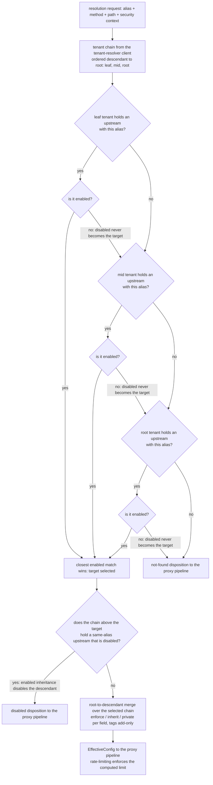

# Feature: Hierarchical Configuration Resolution

<!-- toc -->

- [1. Feature Context](#1-feature-context)
  - [1.1 Overview](#11-overview)
  - [1.2 Purpose](#12-purpose)
  - [1.3 Actors](#13-actors)
  - [1.4 References](#14-references)
  - [1.5 Feature-Local Deviations](#15-feature-local-deviations)
- [2. Actor Flows (CDSL)](#2-actor-flows-cdsl)
  - [Effective Configuration Resolution](#effective-configuration-resolution)
  - [Effective Configuration Merge](#effective-configuration-merge)
- [3. Processes / Business Logic (CDSL)](#3-processes--business-logic-cdsl)
  - [Tenant Chain Walk](#tenant-chain-walk)
  - [Alias Shadowing Walk](#alias-shadowing-walk)
  - [Effective Configuration Merge](#effective-configuration-merge-1)
- [4. States (CDSL)](#4-states-cdsl)
  - [Selected Target State Machine](#selected-target-state-machine)
- [5. Definitions of Done](#5-definitions-of-done)
  - [Effective Configuration Resolution](#effective-configuration-resolution-1)
  - [Sharing Merge Strategies](#sharing-merge-strategies)
  - [Tenant Isolation](#tenant-isolation)
  - [Resolution Contract](#resolution-contract)
- [6. Acceptance Criteria](#6-acceptance-criteria)

<!-- /toc -->

- [x] `p1` - **ID**: `cpt-cf-oagw-featstatus-hierarchical-config-implemented`

<!-- reference to DECOMPOSITION entry -->
`p2` - `cpt-cf-oagw-feature-hierarchical-config`

DECOMPOSITION entry 2.6 "Hierarchical Configuration Resolution" orders this feature and the text of that entry is the authority for this document's scope: the Purpose, Scope and Out-of-scope bullets below are that entry's and are implemented without widening or narrowing them, and feature progress for this document is owned by the `featstatus` line above.
## 1. Feature Context

### 1.1 Overview

This feature resolves the effective configuration of the `oagw` gear across the tenant hierarchy: it obtains the requesting subject's tenant chain through the `tenant-resolver` client that `cpt-cf-oagw-dod-dependency-wiring` of `cpt-cf-oagw-feature-gear-wiring` resolved through the toolkit client hub at gear init, walks that chain from descendant to root to select the routing target by closest-match-wins alias shadowing, and merges the configuration of the selected target's ancestor chain per field — the auth block, the rate limit, the plugin bindings and the CORS block, each under the `private`/`inherit`/`enforce` sharing mode its block carries, plus the add-only tag union that has no sharing mode — into the `EffectiveConfig` value object it hands to the data plane. The chain, the target and the merged configuration are computed once per request and nothing else in the gear walks a tenant chain, applies a sharing mode or computes an effective limit.

The feature computes and never enforces. It holds no token bucket, renders no 429 and emits no `X-RateLimit-*` header: `cpt-cf-oagw-feature-rate-limiting` receives the computed effective limit and enforces it. It owns no CRUD endpoint (`cpt-cf-oagw-feature-management-api` owns the management surface), registers no HTTP route of its own and performs no upstream call; the proxy pipeline of `cpt-cf-oagw-feature-proxy-pipeline` is its caller, and the only stage of `cpt-cf-oagw-seq-proxy-flow` it owns is the config-resolution stage that feeds the pipeline's later stages.

The diagram below is the descendant-to-root shadowing walk of `cpt-cf-oagw-algo-alias-shadowing` over a three-level tenant chain — leaf, mid and root — from the alias request to the target decision, ending in the relationship between the two walks this feature owns: the descendant-to-root walk that selects the routing target first, and the root-to-descendant walk of `cpt-cf-oagw-algo-effective-merge` that merges the effective configuration over the selected target's chain afterwards. It is the only diagram in this document: the per-field merge control flow lives in the step lists of §3, and the lifecycle of the resolution outcome lives in the state machine of §4, and a second diagram would only duplicate what those step lists already encode.

### 1.2 Purpose

This feature bridges DECOMPOSITION entry 2.6 "Hierarchical Configuration Resolution" into an implementation contract. It exists so that the gear has exactly one place where a tenant chain, a routing target and a merged configuration are computed: `cpt-cf-oagw-feature-rate-limiting` consumes the effective limit this feature computes and `cpt-cf-oagw-feature-proxy-pipeline` drives the resolution on every proxied request, and neither of them walks a chain, applies a sharing mode or merges a field of its own.

**Requirements**:

- [x] `p2` - `cpt-cf-oagw-fr-config-layering` — the priority order Upstream (base) < Route < Tenant is the order the merge resolves fields by, not the layer order the merge walks: the walk direction is the DESIGN merge statement's ("merge from root to child per sharing modes"), so ancestor tenant tiers accumulate first, the selected upstream's own blocks are the base of its tier and the matched route's blocks enter after every upstream tier (`inst-me-09`), while this requirement stays the authority for the per-field outcome the walk computes — an ancestor `enforce` value outranks the route's and the rate limit is a commutative `min`; the ordering resolution is recorded in §1.5, and the `[x]` mirrors the upstream PRD definition state per the DECOMPOSITION checkbox convention and does not indicate oagw implementation progress.
- [x] `p2` - `cpt-cf-oagw-fr-hierarchical-config` — the three sharing modes and their override rules are the five per-field strategies of `cpt-cf-oagw-algo-effective-merge`: `inherit` lets the descendant's own block win when it has one and the authorisation context already permits the override, `enforce` forces the ancestor's value, `private` contributes nothing, the effective rate limit is the stricter of the collected enforced limits and the descendant's own, plugin bindings append with enforced ancestor bindings retained, and tags always union add-only; the binding-flow note about request tags staying tenant-local is the create-time rule of `cpt-cf-oagw-feature-management-api` and is not re-declared here (§1.5).
- [x] `p2` - `cpt-cf-oagw-fr-alias-resolution` — the proxy-time half of that requirement is what `cpt-cf-oagw-algo-alias-shadowing` performs: the tenant hierarchy is searched from descendant to root, the closest match wins, resolution is case-insensitive because the alias is normalized at rest, and enforced ancestor constraints still apply across shadowing because the merge walks the whole chain; alias derivation, alias update behaviour and per-tenant alias uniqueness stay owned by `cpt-cf-oagw-feature-alias-resolution` and `cpt-cf-oagw-feature-management-api`.
- [ ] `p1` - `cpt-cf-oagw-nfr-multi-tenancy` — every read of the walk and of the merge is tenant-scoped through the repository traits of `cpt-cf-oagw-feature-domain-model`, and the only tenant-hierarchy input is the chain the platform resolver returns, so no resource outside the requesting subject's chain is reachable; `cpt-cf-oagw-dod-tenant-isolation` implements the threshold.

**Principles**: `p1` - `cpt-cf-oagw-principle-tenant-scope` (all reads use the secure ORM repository traits with tenant scoping and no raw SQL exists in gear code: the chain walk and the merge read the stored upstreams, routes and bindings only through `cpt-cf-oagw-dod-repository-traits` of the domain-model feature).

**Constraints**: `p1` - `cpt-cf-oagw-constraint-multi-sql` (no backend-specific persistence code: this feature issues no SQL of its own, so PostgreSQL, MySQL and SQLite portability holds at the trait boundary, honoured as the schema contract per DECOMPOSITION correction 3).

**Components**: `p1` - `cpt-cf-oagw-component-model` — the Hierarchical Configuration subsection of that component model is what this feature implements: the sharing-mode table per field (auth override if `inherit` and forced if `enforce`, rate limits `min(ancestor, descendant)` with the stricter always winning — where the ancestor side is only the limits the ancestor carries with `sharing: enforce` (`inst-me-05`) — plugins concatenated ancestor→descendant, CORS origins union if `inherit` and forced if `enforce`), the add-only tag union, and the shadowing statement that selection fixes the routing target only while enforced ancestor constraints remain active.

**Sequences**: `p1` - `cpt-cf-oagw-seq-proxy-flow` — owned stage-wise per DECOMPOSITION: this feature owns the config-resolution stage of that sequence, the two control-plane lookups and the merge that turn them into one configuration, and feeds the pipeline's later stages; the proxy pipeline owns orchestration and the endpoint-selection stages, and the rate-limit stage belongs to `cpt-cf-oagw-feature-rate-limiting`.

**API**: None — this feature registers no HTTP route and owns no endpoint of the gear; every Touches line of §5 repeats the declaration.

**Data**: `p1` - `cpt-cf-oagw-db-schema` — read-only: the Common Queries rows "Find Upstream by Alias" and "Resolve Effective Configuration" are the rows `cpt-cf-oagw-algo-alias-shadowing` and `cpt-cf-oagw-algo-effective-merge` perform over the stored upstreams, routes and bindings, with "Find Matching Route for Request" the row this feature contributes to by fixing the route tier order while the proxy pipeline executes the match, honoured as the schema contract per DECOMPOSITION correction 3; only the description of the "List Upstreams for Tenant" row (closest tenant wins, `enabled` inheritance) describes this feature's walk, the list query itself belonging to the management surface of `cpt-cf-oagw-feature-management-api`; this feature creates no table, no schema object and no repository trait of its own.

### 1.3 Actors

| Actor | Role in Feature |
|-------|-----------------|
| `cpt-cf-oagw-actor-app-developer` | Consumer of the proxy path; never calls this feature directly. Receives the outcomes of resolution through the proxy response: a proxied request against the merged configuration, the not-found disposition when no enabled upstream matches the alias, the disabled disposition when an ancestor has disabled the target, or the typed failure when the tenant chain cannot be obtained. |
| `cpt-cf-oagw-actor-tenant-admin` | Configures the sharing modes, the `enabled` flags, the plugin bindings and the tags that the merge honours, and owns correcting a configuration whose merge result is not the one they intended. Sees a disabled target as a proxy rejection, not as a management error: the management surface of `cpt-cf-oagw-feature-management-api` stores and returns the flag of their own tenant, and the propagation of an ancestor disable is a read-time rule of this feature. |
| `cpt-cf-oagw-actor-platform-operator` | Owns the tenant hierarchy the `tenant-resolver` client exposes, and is the actor whose ancestor-level sharing and disable decisions this feature applies downward to descendants. |
| The platform `tenant-resolver` gear behind the `tenant-resolver` client | Answers the chain walk: the client is reached through the toolkit client hub, and the ordered chain it returns is the only tenant-hierarchy source this feature reads. The resolution fails with the typed failure of `cpt-cf-oagw-algo-tenant-chain-walk` when the client is unreachable, the call fails, or no chain is returned for the subject tenant. |

The proxy pipeline of `cpt-cf-oagw-feature-proxy-pipeline` is the caller of every step of the per-request flows: no actor invokes `cpt-cf-oagw-algo-tenant-chain-walk`, `cpt-cf-oagw-algo-alias-shadowing` or `cpt-cf-oagw-algo-effective-merge` directly, and no actor reaches the repository traits of the domain model through this feature. The two flows of §2 are therefore narrated from the application developer's viewpoint as the initiator of the proxied request, with the proxy pipeline as the caller of every one of their steps.

### 1.4 References

- **PRD**: [PRD.md](../PRD.md) — `cpt-cf-oagw-fr-config-layering` (the Upstream < Route < Tenant priority order), `cpt-cf-oagw-fr-hierarchical-config` (the sharing-mode table, the three override rules and the tags note with its binding-flow sentence), `cpt-cf-oagw-fr-alias-resolution` (the Shadowing Resolution Order block and the case-insensitive resolution statement), `cpt-cf-oagw-nfr-multi-tenancy` (the zero cross-tenant threshold), `cpt-cf-oagw-fr-enable-disable` (the disabled-upstream rejection and the rule that an ancestor-disabled resource cannot be re-enabled by a descendant), the use case `cpt-cf-oagw-usecase-proxy-request` and the actors `cpt-cf-oagw-actor-platform-operator`, `cpt-cf-oagw-actor-tenant-admin`, `cpt-cf-oagw-actor-app-developer`
- **Design**: [DESIGN.md](../DESIGN.md) — `cpt-cf-oagw-component-model` (the Hierarchical Configuration subsection with its sharing-mode table, its merge strategies, the add-only tag union and the shadowing statement), the "Alias Resolution" subsection with "Alias Normalization", "Alias Uniqueness" and "Shadowing Behavior" (selection fixes the routing target only, and effective limits are computed with enforced ancestors included), the "Permissions and Access Control" table with its `oagw:upstream:override_auth`, `oagw:upstream:override_rate` and `oagw:upstream:add_plugins` permissions and the sentence that without appropriate permissions a descendant must use the ancestor's configuration as-is, the "Tenant Scoping" subsection with its proxy-time `resolve_alias` paragraph (closest enabled upstream by alias, then the chain search for matching routes with descendant routes taking priority), `cpt-cf-oagw-principle-tenant-scope`, `cpt-cf-oagw-constraint-multi-sql` and `cpt-cf-oagw-db-schema` (the Common Queries rows "Find Upstream by Alias" and "Resolve Effective Configuration" that the two algorithms perform, the "Find Matching Route for Request" row whose route tier order this feature fixes while the proxy pipeline executes the match, and the description-only "List Upstreams for Tenant" row whose list query belongs to the management surface of `cpt-cf-oagw-feature-management-api`)
- **Decomposition**: [DECOMPOSITION.md](../DECOMPOSITION.md) — entry 2.6 "Hierarchical Configuration Resolution" and the "Spec corrections applied" block in its overview (corrections 1, 3 and 4 apply to this feature)
- **Dependencies**:
  - [ ] `p2` - `cpt-cf-oagw-feature-management-api` — the direct dependency DECOMPOSITION entry 2.6 declares in its "Depends On" line: effective configuration is resolved from the upstreams, routes, plugin bindings and tags that feature stores, and the write-time disable propagation, the binding-flow tag rule and the ancestor bind constraints of that feature are the inputs this feature reads rather than rules it re-declares. This feature owns the config-resolution half of the ancestor-bind ownership — what an ancestor's `enforce` and `private` blocks resolve to for a descendant at proxy time (`inst-me-04`, `inst-me-07`) — while the write-time bind permission stays with `cpt-cf-oagw-feature-management-api` and the platform authz middleware.
  - Reached transitively through that chain rather than declared directly: `cpt-cf-oagw-feature-alias-resolution` (the alias contract whose normalized, uniqueness-checked value this feature resolves at proxy time), `cpt-cf-oagw-feature-domain-model` (the `Upstream` and `Route` aggregates and the tenant-scoped repository traits of `cpt-cf-oagw-dod-repository-traits` every read of the walk and of the merge goes through) and `cpt-cf-oagw-feature-gear-wiring` (the `tenant-resolver` client hub dependency of `cpt-cf-oagw-dod-dependency-wiring`, the problem+json error contract and the closed mapping table of `cpt-cf-oagw-algo-error-mapping`).
- **Reverse dependents**: `cpt-cf-oagw-feature-rate-limiting` is the direct dependent in the DECOMPOSITION feature graph (the edge `hierarchical-config → rate-limiting`): it consumes the computed effective limit of `cpt-cf-oagw-algo-effective-merge` and enforces it. `cpt-cf-oagw-feature-proxy-pipeline` sits one step further down the same chain (`hierarchical-config → rate-limiting → proxy-pipeline`) and is the caller that drives resolution per request, so it reaches this feature transitively through the rate-limiting feature; it consumes the selected target, the matched route, the effective limit and the ordered plugin bindings. `cpt-cf-oagw-feature-plugin-chain` consumes the ordered binding list this feature produces but is not a dependent — its direct dependencies are `cpt-cf-oagw-feature-domain-model` and `cpt-cf-oagw-feature-gear-wiring`, and it reaches this feature's outputs only through the proxy pipeline. None of them may re-walk a tenant chain, re-apply a sharing mode or re-compute an effective limit defined here.
- **API and data declarations**: API: None and Data: `cpt-cf-oagw-db-schema` (read-only), as the DECOMPOSITION entry records them and as §1.2 and the Touches lines of §5 carry.

### 1.5 Feature-Local Deviations

Deviations from the supplied spec/platform baseline, recorded per the shared-baseline policy.

**Conformance (not a deviation)** — ownership split with the proxy pipeline and the rate-limiting feature: this feature owns the resolution algorithm and the merge — the chain walk, the shadowing walk, the route-tier search and the per-field merge — and the proxy pipeline of `cpt-cf-oagw-feature-proxy-pipeline` is the caller that invokes it per request and owns orchestration, route-matching execution, endpoint selection and the upstream call, while `cpt-cf-oagw-feature-rate-limiting` enforces the computed effective limit. This feature computes and never enforces, and it owns no stage of `cpt-cf-oagw-seq-proxy-flow` other than the config-resolution stage.
**Rationale** — DECOMPOSITION records the stage-wise ownership of that sequence and entry 2.6 states that this feature hands the merged effective limit to the data plane without enforcing it; recording the split keeps the resolver and its caller apart so neither re-states the other's rule.
**Review owner**: `cf-generate-author-senior via cf-write-docs review loop`

**Deviation** — the proxy path base this feature resolves aliases under is `/oagw/v1/proxy/{alias}/{path}`, without the leading `/api` segment that `cpt-cf-oagw-fr-alias-resolution` writes in front of the gear's own path segment, so the alias this feature resolves is the segment after `/oagw/v1/proxy/`.
**Rationale** — DECOMPOSITION correction 1: all oagw routes are registered at `/oagw/v1/...` without a leading `/api`, and the prefixed form is the operator-gateway-prefixed alias, not the path this deployment serves. The management endpoints of `cpt-cf-oagw-feature-management-api` already carry the same base decision, and `cpt-cf-oagw-feature-alias-resolution` records the same deviation for the contract whose stored value this feature resolves.
**Review owner**: `cf-generate-author-senior via cf-write-docs review loop`

**Conformance (not a deviation)** — the two walks are distinct and both are this feature's: the descendant-to-root walk of `cpt-cf-oagw-algo-alias-shadowing` selects the routing target (the closest enabled upstream by alias, a descendant route taking priority over an inherited ancestor route), and the root-to-descendant walk of `cpt-cf-oagw-algo-effective-merge` merges the effective configuration over the selected target's ancestor chain. The order is fixed: target selection first, merge second. The DESIGN Common Queries row "Resolve Effective Configuration" states the second walk ("Walk hierarchy, collect bindings, merge from root to child per sharing modes") while "Shadowing Behavior" states the first, and the DESIGN "Tenant Scoping" proxy-time paragraph states both in one breath. Enforced ancestor constraints survive the target selection and are applied inside the merge, which is why a shadowing selection can never bypass an ancestor's enforced rate limit or a forced ancestor block.
**Rationale** — the two DESIGN statements describe two directions over the same chain, and reading them as one walk would either drop the enforced ancestor constraints (merge only the selected tier) or re-open target selection after the merge (merge first, select second); recording which walk owns which direction keeps the rule deterministic.
**Review owner**: `cf-generate-author-senior via cf-write-docs review loop`

**Conformance (not a deviation)** — the ordering the merge walks: the PRD's literal "Upstream (base) < Route < Tenant (highest priority)" line of `cpt-cf-oagw-fr-config-layering` puts Tenant above Route, while the order `cpt-cf-oagw-algo-effective-merge` walks is DESIGN's "merge from root to child per sharing modes" (the Common Queries row "Resolve Effective Configuration") together with the `[U1, U2] + [R1, R2]` upstream-then-route composition order of the DESIGN component model. The resolution recorded here is that the walked order is the ancestor tiers (root→descendant), then the selected upstream's own blocks as the last tier of the `inst-me-03` walk, then the matched route's blocks, which is the order `inst-me-09` states.
**Rationale** — an ancestor `enforce` field still outranks the route through the merge rules of `cpt-cf-oagw-fr-hierarchical-config` and the rate rule is a commutative `min`, so the residual ordering between a tenant tier and the route is immaterial to the computed outcome; recording which upstream statement governs the walk direction keeps `inst-me-09` from being read as a second application of the selected upstream's own tier, which would hand `cpt-cf-oagw-feature-plugin-chain` duplicated bindings.
**Review owner**: `cf-generate-author-senior via cf-write-docs review loop`

**Conformance (not a deviation)** — the permission gates on the override and append rules: the "Permissions and Access Control" table of DESIGN attaches `oagw:upstream:override_auth` ("Override auth config (if sharing: inherit)"), `oagw:upstream:override_rate` ("Specify own rate limits (subject to min())") and `oagw:upstream:add_plugins` ("Append own plugins to inherited chain") to the `inherit` override, the own rate limit and the plugin append, with the sentence that without appropriate permissions a descendant must use the ancestor's configuration as-is even with `sharing: inherit`. Those gates are enforced by the platform authz middleware per DECOMPOSITION correction 4, so `cpt-cf-oagw-algo-effective-merge` receives an already-authorised security context and applies the sharing-mode rule itself without re-checking any permission; where a check was not granted, the ancestor's configuration stands.
**Rationale** — DECOMPOSITION correction 4 delegates fine-grained permission enforcement to the platform authz middleware, and a merge step that performs no I/O cannot evaluate a permission check of its own; recording the split keeps the sharing-mode table of `cpt-cf-oagw-fr-hierarchical-config` and the permission table of DESIGN apart instead of merging their conditions.
**Review owner**: `cf-generate-author-senior via cf-write-docs review loop`

**Conformance (not a deviation)** — a found-but-disabled upstream is treated as absent by `cpt-cf-oagw-algo-alias-shadowing` (`inst-as-06`) and the walk falls through, so when the only same-alias upstream in the chain is disabled the outcome is the not-found disposition (404 `RouteNotFound`) and no target exists. DESIGN governs that reading — the proxy-time resolution takes "the closest **enabled** upstream by alias" and the same Common Queries row lists `enabled` inheritance — and it is recorded here because `cpt-cf-oagw-fr-enable-disable` states the 503 rejection unconditionally. That 503 is realised in the enabled-inheritance case: an enabled selected target disabled by a same-alias ancestor, which is the `Disabled` state of §4, and the requirement's MUST is read as applying to that case.
**Rationale** — skipping a disabled candidate is what "the closest **enabled** upstream by alias" and "enabled inheritance" state, and reading the MUST as also covering a chain in which nothing with the alias is enabled would make a disabled-only chain answer 503 for an upstream the subject has enabled nowhere; recording the reading keeps the narrowing visible instead of implicit.
**Review owner**: `cf-generate-author-senior via cf-write-docs review loop`

**Conformance (not a deviation)** — the `Disabled` disposition is a typed outcome this feature returns to its caller, not a row of the mapping table: the closed mapping table of `cpt-cf-oagw-algo-error-mapping` in `cpt-cf-oagw-feature-gear-wiring` gains no row for a disabled upstream, and mapping the disposition onto a wire status is the caller's decision, not this feature's. `cpt-cf-oagw-feature-management-api` names the proxy pipeline of `cpt-cf-oagw-feature-proxy-pipeline` as the owner of the proxy-time 503 rejection of a disabled upstream, and the proxy pipeline renders the 503 gateway rejection `cpt-cf-oagw-fr-enable-disable` requires; the not-found and `LinkUnavailable` dispositions are the only ones this feature returns through existing table rows.
**Rationale** — no row of the closed 22-row table means "disabled upstream", so stating that the table renders the 503 would point at a mapping that does not exist; recording where the rendering happens keeps the typed outcome and the wire status apart without widening a closed table this feature must not extend.
**Review owner**: `cf-generate-author-senior via cf-write-docs review loop`

**Deviation** — request-time treatment of a `private` ancestor configuration: `private` means "not visible to descendants", so a descendant request never sees an ancestor's `private`-mode auth block, rate limit, plugin bindings or CORS block, and only `inherit` and `enforce` ancestor fields enter the merge of `cpt-cf-oagw-algo-effective-merge`. No upstream document states the wire behaviour of a request whose only matching ancestor upstream carries `private` blocks beyond that visibility — the management surface already answers 404 for an ancestor resource, so there is no management answer to inherit — and this feature therefore treats `private` ancestor configuration as absent for the merge, the declared reading that keeps the sharing table's meaning literal. Target selection is unaffected: `private` governs the visibility of a configuration field to descendants, not the addressability of the upstream whose field it is, which the DESIGN Tenant Scoping table states as "Inherited via tenant chain walk" for proxy-time access.
**Rationale** — the sharing-mode table of `cpt-cf-oagw-fr-hierarchical-config` defines `private` only as a visibility rule; reading it as an additional availability rule would silently remove an ancestor's upstream from the chain the resolver returned, and reading it as invisible-but-merged would leak an ancestor's credential reference and limits to a descendant.
**Review owner**: `cf-generate-author-senior via cf-write-docs review loop`

**Conformance (not a deviation)** — the effective rate limit is `min(all ancestor enforced rates, selected upstream rate, route rate)`, computed in `cpt-cf-oagw-algo-effective-merge` and handed to the data plane as a value; the token-bucket mechanics, the 429 response and the `X-RateLimit-*` headers belong to `cpt-cf-oagw-feature-rate-limiting`. No limit is enforced in this feature, and an ancestor limit that is not carried with `sharing: enforce` is collected but never imposed on a descendant.
**Rationale** — `cpt-cf-oagw-fr-hierarchical-config` states the `min` rule and DECOMPOSITION entry 2.6 states the compute/ enforce split explicitly; recording it keeps the resolution contract and the enforcement contract apart.
**Review owner**: `cf-generate-author-senior via cf-write-docs review loop`

**Conformance (not a deviation)** — tags: they carry no sharing mode, and the merge applies the add-only union `effective_tags = union(ancestor_tags..., descendant_tags)`, so an inherited tag cannot be removed by any descendant tier. The create-time binding-flow note — request tags are tenant-local additions for effective discovery and do not mutate ancestor tags — is the rule of `cpt-cf-oagw-feature-management-api` and is not re-declared here; this feature reads the stored tags as the management surface wrote them.
**Rationale** — `cpt-cf-oagw-fr-hierarchical-config` and the Hierarchical Configuration subsection of `cpt-cf-oagw-component-model` both state the union semantics, and both place the binding-flow rule on the upstream-creation path, which this feature does not own.
**Review owner**: `cf-generate-author-senior via cf-write-docs review loop`

**Deviation** — plugin tier composition handed to `cpt-cf-oagw-feature-plugin-chain`: the merged plugin binding list of `cpt-cf-oagw-algo-effective-merge` is ordered ancestor→descendant (root first) for upstream-level plugins, each ancestor tier keeping its own binding-position order, followed by the route's plugins; enforced ancestor bindings are always retained and a descendant tier can never remove one. The per-tier `[U1,U2]+[R1,R2]` composition inside the execution plan remains the rule of `cpt-cf-oagw-flow-execution-plan` and `cpt-cf-oagw-dod-plugin-execution-order` and is not re-derived here: this feature orders the tiers across the tenant hierarchy, and the plugin-chain feature orders the phases within a request.
**Rationale** — DECOMPOSITION entry 2.6 states "plugins concatenated ancestor→descendant" and `cpt-cf-oagw-fr-hierarchical-config` states that a descendant's plugins append and that enforced plugins cannot be removed, while the execution order within a request is the plugin-chain feature's; recording the split keeps the cross-tenant tier order and the per-request phase order from being stated twice with different words.
**Review owner**: `cf-generate-author-senior via cf-write-docs review loop`

**Deviation** — `EffectiveConfig` and `TenantChain` are feature-local value objects, not DESIGN §3.1 aggregates: DECOMPOSITION's conventions list both among the entities that sit outside the DESIGN aggregate set and are derived implementation value types owned by the feature that declares them. `TenantChain` is what the `tenant-resolver` client answers the chain walk with and `EffectiveConfig` is the computed result of `cpt-cf-oagw-algo-effective-merge`; neither is persisted, neither is a table of `cpt-cf-oagw-db-schema`, and neither is addressable through the management surface of `cpt-cf-oagw-feature-management-api`.
**Rationale** — introducing them as canonical aggregates would put a fourth and fifth aggregate beside the three DESIGN ones without any upstream definition of their persistence, while both objects are per-request computations that exist only for the duration of one resolution.
**Review owner**: `cf-generate-author-senior via cf-write-docs review loop`

**Out of scope** — rate-limit token-bucket mechanics and 429 enforcement, owned by `cpt-cf-oagw-feature-rate-limiting`, which consumes the computed effective limit; management CRUD, the write-time disable propagation and the binding-flow tag rule, owned by `cpt-cf-oagw-feature-management-api`; proxy orchestration, route-matching execution and the upstream HTTP call, owned by `cpt-cf-oagw-feature-proxy-pipeline`; any configuration cache — DECOMPOSITION correction 4 supersedes control-plane and data-plane config caching (ADR 0005 L1/L2, ADR 0006 DP L1) in favour of the in-memory stores of correction 3, and DESIGN 4.1 records config caching only as a future consideration pointing at ADR 0005, so resolution recomputes per request with no L1/L2 cache, no TTL and no invalidation mechanism; metric and audit emission for the resolution, owned by `cpt-cf-oagw-feature-observability`; and any gRPC route-match resolution, which is planned for a later phase and has no reachable code path in this release.
**Rationale** — DECOMPOSITION entry 2.6 lists the first two in its out-of-scope bullets, the stage-wise ownership rule places the pipeline stages elsewhere, and the remaining dispositions follow from the spec corrections and the ownership splits recorded above; none of them is implemented by this feature and none of them is re-declared by it.
**Review owner**: `cf-generate-author-senior via cf-write-docs review loop`

**Not applicable because** — the remaining checklist areas have no object in this feature:

- **Data model and persistence** — the feature creates no table, no schema object and no repository trait: it reads the tables of the domain-model feature through that feature's repository traits, and the two value objects it owns (`TenantChain`, `EffectiveConfig`) are per-request computations that are never persisted.
- **Configuration surface** — the feature owns no `OagwConfig` key: every configuration key of the gear is owned by `cpt-cf-oagw-feature-gear-wiring` and `cpt-cf-oagw-algo-config-load`, and the sharing modes, limits, bindings and tags this feature merges are resource fields, not gear configuration.
- **Internationalisation and accessibility** — the feature exposes no user interface and no actor-facing text of its own; the only wording a caller sees arrives inside a problem+json `detail` field rendered by the error contract of the gear-wiring feature.
- **Regulatory compliance** — no data subject to a compliance regime crosses the resolution: it reads configuration records scoped to the requesting subject's chain, holds no personal data beyond the subject identifiers of the security context and writes no record anywhere.
- **Rollout and rollback** — resolution is a per-request computation with no deployable unit, no migration, no feature flag and no configuration key of its own, so there is nothing to roll out or roll back apart from the features that call it and the features that store what it reads.
- **Performance** — the only latency threshold a proxied request carries is `cpt-cf-oagw-nfr-low-latency`'s added latency of `<10ms` at p95 excluding the upstream response time, whose owner is `cpt-cf-oagw-feature-proxy-pipeline` per DECOMPOSITION entry 2.8; the per-request recomputation of the three walks — chain walk, shadowing walk, merge — contributes to that threshold, and no upstream document sets a resolution-latency budget of its own for them, so the feature declares functional semantics only; the absence of a cache is the main lever this feature controls — resolution recomputes per request, and keeping that recomputation free of a cache is this feature's own containment measure.
- **Usability** — the observable surface is the proxy response the caller already receives from `cpt-cf-oagw-feature-proxy-pipeline`; this feature adds no surface to evaluate for usability.
- **Test targets** — the unit-testable boundaries are `cpt-cf-oagw-algo-tenant-chain-walk`, `cpt-cf-oagw-algo-alias-shadowing`, `cpt-cf-oagw-algo-effective-merge` and the state machine of §4; the end-to-end coverage of resolution on live proxy traffic is owned by `cpt-cf-oagw-feature-proxy-pipeline`, which is the caller.

## 2. Actor Flows (CDSL)

Interactions that start with an actor and describe the end-to-end flow. Both flows of this feature are called per proxied request by the proxy pipeline of `cpt-cf-oagw-feature-proxy-pipeline`, which is the caller of every step; neither flow opens an HTTP route, renders an HTTP response or performs an upstream call, and Flow B is reached only through Flow A's selected target on the same request.

**Use cases**: `p1` - `cpt-cf-oagw-usecase-proxy-request` — the "System resolves upstream by alias (tenant hierarchy search)" step of that use case is `cpt-cf-oagw-flow-effective-resolution`, which also fixes the descendant-first route tiers of its "System matches route by method/path" step, and the "System merges configs (upstream < route < tenant)" step is `cpt-cf-oagw-flow-effective-merge`, whose `EffectiveConfig` is the input the use case's "System retrieves credentials" and "System executes plugin chain" steps consume through the proxy pipeline.

### Effective Configuration Resolution

- [x] `p1` - **ID**: `cpt-cf-oagw-flow-effective-resolution`

**Actor**: `cpt-cf-oagw-actor-app-developer`

**Success Scenarios**:

- A target is selected by closest-match shadowing: a descendant upstream whose alias matches is the target even when an ancestor upstream carries the same alias, and the closest enabled match wins.
- Enforced ancestor constraints survive the selection: a target selected at a descendant tier is still merged over the whole ancestor chain, so an ancestor's enforced rate and forced blocks reach the `EffectiveConfig`.
- Disabled ancestors disable descendants: a same-alias ancestor that is disabled disables the descendant's selection, and a descendant cannot re-enable an ancestor-disabled resource.
- Tenant isolation holds: the walk touches no resource outside the requesting subject's own chain, because every lookup is keyed by a tenant id taken from the chain the resolver returned.

**Error Scenarios**:

- No enabled upstream matches the alias anywhere in the chain: the not-found disposition is returned to the caller, which renders it; this flow performs no HTTP response.
- The `tenant-resolver` client is unreachable, or no chain is returned for the subject tenant: the typed failure the error contract renders is returned, mapped onto the existing `LinkUnavailable` row of `cpt-cf-oagw-algo-error-mapping` — no new mapping row.
- A same-alias ancestor above the selection is disabled: the disabled disposition is returned to the caller for it to render as the 503 rejection — the rendering is the proxy pipeline's decision as the owner of the proxy-time rejection, not a row of the closed mapping table; this flow adds no row to the mapping table and renders no status of its own.

**Steps**:

1. [x] - `p1` - Receive the resolution request of one proxied request from the proxy pipeline of `cpt-cf-oagw-feature-proxy-pipeline` — the normalized alias, the request method and path, and the request's security context — the pipeline being the caller of this and every later step - `inst-ef-01`
2. [x] - `p1` - Obtain the subject's tenant chain through `cpt-cf-oagw-algo-tenant-chain-walk`, the only tenant-hierarchy input of this flow - `inst-ef-02`
3. [x] - `p1` - **IF** the tenant chain cannot be established, that is the `tenant-resolver` client is unreachable or no chain is returned for the subject tenant - `inst-ef-03`
   1. [x] - `p1` - **CATCH** the failure and **RETURN** the `LinkUnavailable` failure (503, `gts.cf.core.errors.err.v1~cf.oagw.link.unavailable.v1`) mapped by `cpt-cf-oagw-algo-error-mapping` for the caller to render; no new row is added to the table, and there is no fallback to a single-tenant assumption - `inst-ef-04`
4. [x] - `p1` - **ELSE** walk the chain from descendant to root through `cpt-cf-oagw-algo-alias-shadowing`, which selects the closest enabled upstream whose alias matches and reports any same-alias ancestor above it that is disabled - `inst-ef-05`
5. [x] - `p1` - **IF** the walk exhausts the chain with no enabled upstream matching the alias - `inst-ef-06`
   1. [x] - `p1` - **RETURN** the not-found disposition to the caller, which renders it through the existing `RouteNotFound` row of the mapping table (404, `gts.cf.core.errors.err.v1~cf.oagw.route.not_found.v1`); this flow performs no HTTP response of its own - `inst-ef-07`
6. [x] - `p1` - **ELSE** fix the route tier order for the caller's match — the selected upstream's own routes first, then the routes of the ancestor upstreams reached through the chain, so a descendant route takes priority over an inherited ancestor route, per the DESIGN "Tenant Scoping" proxy-time paragraph — the match execution itself remaining the proxy pipeline's per the ownership split of §1.5 - `inst-ef-08`
7. [x] - `p1` - **IF** the walk reported a same-alias ancestor above the selection that is disabled — the enabled-inheritance rule of `cpt-cf-oagw-fr-enable-disable` disables the descendant's selection - `inst-ef-09`
   1. [x] - `p1` - **RETURN** the disabled disposition to the caller — the proxy pipeline, which the management-api feature names as the owner of the proxy-time 503 rejection of a disabled upstream — which renders the 503 gateway rejection `cpt-cf-oagw-fr-enable-disable` requires; this flow adds no row to the closed mapping table and leaves the disposition's rendering to the caller, and the state machine of §4 records the outcome as `Disabled` - `inst-ef-10`
8. [x] - `p1` - **ELSE** **RETURN** to the caller the selected target, its ancestor chain and the route tier the caller matches against — the caller's merge flow `cpt-cf-oagw-flow-effective-merge` continues on the same request - `inst-ef-11`

### Effective Configuration Merge

- [x] `p1` - **ID**: `cpt-cf-oagw-flow-effective-merge`

**Actor**: `cpt-cf-oagw-actor-app-developer`

**Success Scenarios**:

- The merge over the selected target's ancestor chain produces one `EffectiveConfig`: the auth block, the effective rate limit, the ordered plugin bindings, the CORS block and the tags.
- An ancestor field carried with `sharing: enforce` survives a descendant's own block; an ancestor field carried with `sharing: inherit` yields to the descendant's own block when the descendant has one; an ancestor field carried with `sharing: private` contributes nothing.
- The effective rate limit is the stricter of every enforced ancestor limit, the selected upstream's limit and the route's limit, and the plugin bindings arrive ordered ancestor→descendant with the route's bindings last.

**Error Scenarios**:

- The merge has no failure path of its own: it performs no I/O, calls no resolver and opens no HTTP route, so a failure that reaches this flow has already ended `cpt-cf-oagw-flow-effective-resolution`, and this flow returns either a complete `EffectiveConfig` or nothing at all — never a partially merged configuration.

**Steps**:

1. [x] - `p1` - Receive, from `cpt-cf-oagw-flow-effective-resolution` on the same request, the selected target, its ancestor chain and the matched route - `inst-mg-01`
2. [x] - `p1` - Order the chain from root to descendant for the merge, the selected target's own tier last, so the merge order is fixed by the chain and never by request arrival order - `inst-mg-02`
3. [x] - `p1` - **FOR EACH** tier of that order from root to descendant, apply the merge of `cpt-cf-oagw-algo-effective-merge` field by field — auth, rate limit, plugins, CORS and tags — each field under the sharing mode its block carries - `inst-mg-03`
4. [x] - `p1` - Position the matched route's blocks after every upstream tier — the selected upstream's own blocks having been applied as the last tier of the `inst-mg-03` walk, the Upstream (base) < Route < Tenant order of `cpt-cf-oagw-fr-config-layering` — so the route's rate limit, plugin bindings, CORS origins and tags enter after every upstream tier; the walk direction is the DESIGN merge statement's per §1.5 - `inst-mg-04`
5. [x] - `p1` - Compute the effective rate limit as `min(all collected enforced ancestor limits, selected upstream limit, route limit)` and hand it to the data plane as a value, never as an enforcement - `inst-mg-05`
6. [x] - `p1` - Hand the ordered plugin binding list to `cpt-cf-oagw-feature-plugin-chain` — ancestor tiers first, each in binding-position order, then the route's bindings — as the input of `cpt-cf-oagw-flow-execution-plan` - `inst-mg-06`
7. [x] - `p1` - Perform no I/O inside the merge: no resolver call, no repository write, no route registration and no upstream HTTP call, so the flow's only output is the value it returns - `inst-mg-07`
8. [x] - `p1` - **RETURN** the `EffectiveConfig` — the auth block, the effective rate limit, the ordered plugin bindings, the CORS block and the tags — to the proxy pipeline, which drives the later stages of `cpt-cf-oagw-seq-proxy-flow` - `inst-mg-08`
9. [x] - `p1` - Leave enforcement to the consumers: `cpt-cf-oagw-feature-rate-limiting` receives the computed effective limit and enforces it, and this flow enforces nothing and performs no HTTP call - `inst-mg-09`

## 3. Processes / Business Logic (CDSL)

Internal building blocks called by the flows above: `cpt-cf-oagw-flow-effective-resolution` calls `cpt-cf-oagw-algo-tenant-chain-walk` and `cpt-cf-oagw-algo-alias-shadowing`, and `cpt-cf-oagw-flow-effective-merge` calls `cpt-cf-oagw-algo-effective-merge` once per request over the chain that flow received. None of them opens an HTTP route, none performs an upstream HTTP call, and none re-declares a validation rule, an error mapping or a configuration key owned by another feature.

### Tenant Chain Walk

- [x] `p2` - **ID**: `cpt-cf-oagw-algo-tenant-chain-walk`

**Input**: the subject tenant id of the request's security context.

**Output**: the ordered `TenantChain` value object (descendant→root), or the typed failure of an unresolvable chain.

**Steps**:

1. [x] - `p1` - Take the subject tenant id from the request's security context as the single input of the walk; it is the only tenant identity this feature reads, and every later lookup is keyed by a tenant id taken from the chain it produces - `inst-tc-01`
2. [x] - `p1` - Take the `tenant-resolver` client that `cpt-cf-oagw-dod-dependency-wiring` of `cpt-cf-oagw-feature-gear-wiring` already resolved through the toolkit client hub inside `init()`; this algorithm resolves no platform dependency of its own and declares none as a gear-level dependency - `inst-tc-02`
3. [x] - `p1` - Request the chain for that tenant id and receive the ordered `TenantChain` value object, descendant first and root last, which is the only tenant-hierarchy source of this feature - `inst-tc-03`
4. [x] - `p1` - **IF** the resolver call fails, the client is unreachable, or no chain is returned for the subject tenant - `inst-tc-04`
   1. [x] - `p1` - **CATCH** the failure and **RETURN** the `LinkUnavailable` failure (503, `gts.cf.core.errors.err.v1~cf.oagw.link.unavailable.v1`) through the closed mapping table of `cpt-cf-oagw-algo-error-mapping`, adding no row; a chain that cannot be established fails the resolution, and there is no fallback to a single-tenant assumption - `inst-tc-05`
5. [x] - `p1` - Read nothing outside the returned chain: the alias walk and the merge key every lookup on a tenant id of this chain, so no resource belonging to another tenant's hierarchy is reachable from this algorithm - `inst-tc-06`
6. [x] - `p1` - Hold the chain in memory for the request only: it is never persisted, never written to a store and never logged - `inst-tc-07`
7. [x] - `p1` - Recompute the chain on every request: no cached chain, no TTL and no invalidation path exists in this feature, because any configuration cache is out of scope this release - `inst-tc-08`
8. [x] - `p1` - **RETURN** the chain to the caller, which hands it to `cpt-cf-oagw-algo-alias-shadowing` for target selection and to `cpt-cf-oagw-algo-effective-merge` for the merge - `inst-tc-09`

### Alias Shadowing Walk

- [x] `p2` - **ID**: `cpt-cf-oagw-algo-alias-shadowing`

**Input**: the normalized alias of the request and the tenant chain produced by `cpt-cf-oagw-algo-tenant-chain-walk`.

**Output**: the selected target together with its ancestor chain and the report of any same-alias ancestor that is disabled, or the not-found outcome.

**Steps**:

1. [x] - `p1` - Take the already-normalized alias `cpt-cf-oagw-flow-effective-resolution` received — normalized to ASCII lowercase with trailing dots stripped by the rule of `cpt-cf-oagw-algo-alias-normalization`, which is applied here without being re-declared and without any case handling of its own - `inst-as-01`
2. [x] - `p1` - **FOR EACH** tenant in the chain, from the descendant end to the root end, look up an upstream by `(tenant_id, alias)` through the tenant-scoped repository traits of the domain-model feature - `inst-as-02`
3. [x] - `p1` - **IF** an upstream is found **AND** its `enabled` flag is true - `inst-as-03`
   1. [x] - `p1` - Select it and stop the walk: the closest match wins, and a descendant upstream with the same alias shadows an ancestor's - `inst-as-04`
4. [x] - `p1` - **ELSE IF** an upstream is found **AND** its `enabled` flag is false - `inst-as-05`
   1. [x] - `p1` - Treat it as absent and continue the walk: a disabled upstream never becomes the target, so a disabled configuration cannot serve traffic and cannot be re-enabled from below - `inst-as-06`
5. [x] - `p1` - **IF** the walk exhausts the chain with no enabled match - `inst-as-07`
   1. [x] - `p1` - **RETURN** the not-found outcome to the caller, which renders it; no default upstream, no fallback alias and no cross-tenant lookup is attempted - `inst-as-08`
6. [x] - `p1` - **ELSE** inspect the chain above the selected target for a same-alias upstream that is disabled, and report it when one is found: enabled inheritance disables the descendant's selection, and the state machine of §4 records the outcome as `Disabled` - `inst-as-09`
7. [x] - `p1` - Note that the selection fixes the routing target only: enforced ancestor constraints are never bypassed by shadowing, because the merge of `cpt-cf-oagw-algo-effective-merge` still walks the whole ancestor chain after this walk has returned - `inst-as-10`
8. [x] - `p1` - Leave alias derivation, alias update behaviour and the per-tenant `(tenant_id, alias)` uniqueness invariant to `cpt-cf-oagw-feature-alias-resolution` and `cpt-cf-oagw-feature-management-api`: this algorithm re-derives no alias and re-checks no uniqueness, it reads the alias the management surface stored - `inst-as-11`
9. [x] - `p1` - **RETURN** the selected target with its ancestor chain and the disabled-ancestor report, or the not-found outcome - `inst-as-12`

### Effective Configuration Merge

- [x] `p2` - **ID**: `cpt-cf-oagw-algo-effective-merge`

**Input**: the selected target, its ancestor chain ordered root→descendant, the matched route, and the `sharing` mode carried by each configuration block.

**Output**: the `EffectiveConfig` value object, or nothing when the resolution that precedes it failed.

**Steps**:

1. [x] - `p1` - Take the selected target, its ancestor chain, the matched route and the sharing mode of every block; the chain arrives ordered root→descendant with the selected target's own tier last, so ancestor tiers are applied before descendant ones - `inst-me-01`
2. [x] - `p1` - Start from an empty accumulator, so the first tier the walk visits contributes into it and every later tier accumulates on top of it - `inst-me-02`
3. [x] - `p1` - **FOR EACH** tier from root to descendant - `inst-me-03`
   1. [x] - `p1` - Auth: an ancestor `enforce` block forces the ancestor's auth block and marks the field forced, so a descendant block arriving later is ignored; an ancestor `inherit` block is recorded — for a descendant whose override the authorisation context already permits — as the inherited default that a descendant's own auth block replaces when the descendant has one and that stands when it has none; an ancestor `private` block contributes nothing - `inst-me-04`
   2. [x] - `p1` - Rate limit: add the tier's rate to the collected enforced-limit set when its block carries `sharing: enforce`, and record it without imposing it otherwise, so an unenforced ancestor limit never constrains a descendant - `inst-me-05`
   3. [x] - `p1` - Plugins: concatenate the tier's plugin bindings after the accumulated list, keeping that tier's own binding-position order, and retain every enforced ancestor binding so no later tier can remove one - `inst-me-06`
   4. [x] - `p1` - CORS: an ancestor `enforce` block forces the ancestor's CORS block and marks the field forced; an ancestor `inherit` block unions its origins with the origins accumulated so far; an ancestor `private` block contributes nothing - `inst-me-07`
   5. [x] - `p1` - Tags: union the tier's tags into the accumulated set, add-only and without a sharing mode, so an inherited tag cannot be removed by any later tier - `inst-me-08`
4. [x] - `p1` - Position the matched route's blocks after every upstream tier — the selected upstream's own blocks having been applied as the last tier of the `inst-me-03` walk, the Upstream (base) < Route < Tenant order of `cpt-cf-oagw-fr-config-layering` — so the route's rate limit, plugin bindings, CORS origins and tags enter after every upstream tier - `inst-me-09`
5. [x] - `p1` - Compute the effective rate limit as `min(all collected enforced ancestor limits, selected upstream limit, route limit)`, the stricter value always winning, and carry it as a value for the data plane to enforce; when the collected set is empty and neither the selected upstream nor the matched route configures a limit, the result is an ABSENT limit that the data plane reads as "no limiting" - `inst-me-10`
6. [x] - `p1` - **IF** a field was marked forced by an ancestor `enforce` tier, keep the forced value for that field; a descendant block for that field is ignored, which is the rule that makes enforced ancestor constraints survive shadowing - `inst-me-11`
7. [x] - `p1` - Assemble the `EffectiveConfig` value object from the accumulated fields: the auth block, the effective rate limit, the ordered plugin bindings, the CORS block and the tags - `inst-me-12`
8. [x] - `p1` - Note that the merge is deterministic for a given chain and binding set: same inputs produce the same output, no request-ordering effect exists, and the merge is recomputed per request with no cache behind it - `inst-me-13`
9. [x] - `p1` - **RETURN** the `EffectiveConfig` to the caller - `inst-me-14`

## 4. States (CDSL)

### Selected Target State Machine

- [x] `p2` - **ID**: `cpt-cf-oagw-state-selected-target`

**States**: `Unresolved`, `Selected`, `Disabled`

**Initial State**: `Unresolved`

**Transitions**:

1. [x] - `p1` - **FROM** `Unresolved` **TO** `Selected` **WHEN** the descendant-to-root walk of `cpt-cf-oagw-algo-alias-shadowing` selects an enabled upstream whose alias matches and the chain above it reports no same-alias ancestor that is disabled - `inst-st-01`
2. [x] - `p1` - **FROM** `Unresolved` **TO** `Unresolved` **WHEN** the chain is exhausted with no enabled upstream matching the alias — the not-found outcome is returned to the caller, and no target was ever established - `inst-st-02`
3. [x] - `p1` - **FROM** `Unresolved` **TO** `Unresolved` **WHEN** the `tenant-resolver` client is unreachable or returns no chain — the resolution fails with the typed failure of `cpt-cf-oagw-algo-tenant-chain-walk`, and the outcome stays `Unresolved` - `inst-st-03`
4. [x] - `p1` - **FROM** `Unresolved` **TO** `Disabled` **WHEN** a candidate upstream matches the alias but the chain walk reports a same-alias ancestor above it that is disabled — enabled inheritance disables the descendant, and a descendant cannot re-enable an ancestor-disabled resource - `inst-st-04`
5. [x] - `p1` - **FROM** `Selected` **TO** `Unresolved` **WHEN** the caller re-enters resolution with a new request: the machine is the per-request lifecycle of one resolution outcome, so a returned target is not carried into the next request - `inst-st-05`
6. [x] - `p1` - **FROM** `Disabled` **TO** `Unresolved` **WHEN** the ancestor is re-enabled and the next resolution recomputes the walk from `Unresolved`; no transition writes the new outcome, because the recompute is a fresh walk - `inst-st-06`

The machine is the per-request lifecycle of one resolution outcome: it holds no state between requests, is never persisted, and has no cache behind it — a later request recomputes the walk from `Unresolved` with whatever the repositories and the resolver return at that moment. `Selected` and `Disabled` are both terminal within one request: the outcome is returned to the caller and the machine is discarded with the request; the only transitions out of them belong to the fresh machine of the next request, which starts again at `Unresolved`. Any transition not listed above is invalid and leaves the outcome unchanged.

## 5. Definitions of Done

### Effective Configuration Resolution

- [x] `p1` - **ID**: `cpt-cf-oagw-dod-effective-config-resolution`

The system **MUST** implement the descendant-to-root shadowing walk of `cpt-cf-oagw-algo-alias-shadowing` with closest-match-wins target selection and the rule that a found-but-disabled upstream never becomes the target, **MUST** apply the enabled-inheritance rule that a same-alias ancestor which is disabled disables a descendant's selection, **MUST** obtain the tenant chain through the `tenant-resolver` client hub dependency that `cpt-cf-oagw-dod-dependency-wiring` resolved at init without resolving a platform dependency of its own, and **MUST** return the not-found and `LinkUnavailable` dispositions through the existing rows of `cpt-cf-oagw-algo-error-mapping` and the disabled disposition as a typed outcome for the caller to render, adding no row to the table.

**Implements**:

- `cpt-cf-oagw-flow-effective-resolution`
- `cpt-cf-oagw-flow-effective-merge`
- `cpt-cf-oagw-algo-tenant-chain-walk`
- `cpt-cf-oagw-algo-alias-shadowing`
- `cpt-cf-oagw-state-selected-target`

**Principles**: `p1` - `cpt-cf-oagw-principle-tenant-scope`

**Touches**:

- Entities: `TenantChain`, `Upstream`, `Route`
- API: None — this DoD defines no endpoint
- Data: `cpt-cf-oagw-db-schema` (read-only — the Common Queries rows this DoD performs; it creates no table and no schema object)

### Sharing Merge Strategies

- [x] `p1` - **ID**: `cpt-cf-oagw-dod-sharing-merge-strategies`

The system **MUST** implement the five per-field strategies of `cpt-cf-oagw-algo-effective-merge` — auth override when `inherit`, forced when `enforce` and absent when `private`; rate limit `min(all collected enforced ancestor limits, selected upstream limit, route limit)` with an unenforced ancestor limit never imposed; plugins concatenated ancestor→descendant with each tier's binding-position order kept and every enforced ancestor binding retained; CORS origins unioned when `inherit` and forced when `enforce`; tags add-only union with no sharing mode — and **MUST** hand the computed `EffectiveConfig` to the data plane without enforcing any part of it.

**Implements**:

- `cpt-cf-oagw-flow-effective-merge`
- `cpt-cf-oagw-algo-effective-merge`

**Touches**:

- Entities: `EffectiveConfig`, `Upstream`, `Route`
- API: None — this DoD defines no endpoint
- Data: `cpt-cf-oagw-db-schema` (read-only — the merge reads stored blocks and bindings and writes nothing)

### Tenant Isolation

- [x] `p1` - **ID**: `cpt-cf-oagw-dod-tenant-isolation`

The system **MUST** perform every read of the walk and of the merge through the secure ORM repository traits of `cpt-cf-oagw-feature-domain-model` with the tenant scope applied, **MUST NOT** issue raw SQL in gear code, **MUST** keep those reads portable across PostgreSQL, MySQL and SQLite with no backend-specific feature, **MUST** yield zero cross-tenant data access, and **MUST** treat the chain returned by the platform resolver as the only tenant-hierarchy source, so no resource outside the requesting subject's chain is reachable from any step of this feature.

**Implements**:

- `cpt-cf-oagw-flow-effective-resolution`
- `cpt-cf-oagw-algo-tenant-chain-walk`
- `cpt-cf-oagw-algo-alias-shadowing`
- `cpt-cf-oagw-algo-effective-merge`

**Principles**: `p1` - `cpt-cf-oagw-principle-tenant-scope`

**Constraints**: `p1` - `cpt-cf-oagw-constraint-multi-sql`

**Touches**:

- Entities: `Upstream`, `Route`, `TenantChain`
- Infra: the repository traits of `cpt-cf-oagw-dod-repository-traits` (`src/domain/repo.rs` of the domain-model feature)
- API: None — this DoD defines no endpoint
- Data: `cpt-cf-oagw-db-schema` (read-only — the schema contract honoured through the domain-model traits; no table is created)

### Resolution Contract

- [x] `p1` - **ID**: `cpt-cf-oagw-dod-resolution-contract`

The system **MUST** expose the `EffectiveConfig` value object with exactly the shape of `cpt-cf-oagw-flow-effective-merge` — the auth block, the effective rate limit, the ordered plugin bindings, the CORS block and the tags — together with the `TenantChain` value object the resolver answers with, both being unpersisted feature-local value objects, and **MUST** keep the caller boundary intact: the proxy pipeline of `cpt-cf-oagw-feature-proxy-pipeline` drives resolution per request, `cpt-cf-oagw-feature-rate-limiting` receives the computed effective limit and enforces it, and `cpt-cf-oagw-feature-plugin-chain` receives the ordered binding list. This feature **MUST** register no HTTP route, own no CRUD path and persist nothing.

**Implements**:

- `cpt-cf-oagw-flow-effective-resolution`
- `cpt-cf-oagw-flow-effective-merge`
- `cpt-cf-oagw-algo-effective-merge`
- `cpt-cf-oagw-state-selected-target`

**Touches**:

- Entities: `EffectiveConfig`, `TenantChain`
- API: None — this DoD defines no endpoint
- Data: None — this DoD creates no table and no schema

## 6. Acceptance Criteria

Each criterion below is traceable to a step of §2 or §3, a state of §4, or a DoD of §5, and each is checkable against the in-memory repositories of `cpt-cf-oagw-feature-domain-model` without any HTTP surface, because this feature registers none.

- [x] Over a three-level chain in which the leaf and the root both hold an upstream with the alias `api.openai.com`, the leaf's upstream is the selected target — the closest match wins, and the descendant shadows the ancestor's (`cpt-cf-oagw-algo-alias-shadowing`).
- [x] A descendant alias that shadows an ancestor's does not lift the ancestor's enforced constraints: the effective rate limit computed for the shadowing target still includes the ancestor's enforced rate (`cpt-cf-oagw-algo-effective-merge`, `cpt-cf-oagw-dod-sharing-merge-strategies`).
- [x] A same-alias ancestor upstream whose `enabled` flag is `false` disables a descendant's enabled target: the resolution ends in the `Disabled` state, the disabled disposition is returned to the caller as a typed outcome for the caller to render — not as a row of the mapping table — and the descendant cannot re-enable an ancestor-disabled resource (`cpt-cf-oagw-state-selected-target`).
- [x] An ancestor auth block carried with `sharing: private` contributes nothing to the merge, an ancestor block carried with `sharing: inherit` yields to the descendant's own block when the descendant has one and the authorisation context already permits the override, and an ancestor block carried with `sharing: enforce` forces the ancestor's value and ignores the descendant's (`cpt-cf-oagw-algo-effective-merge`).
- [x] The effective rate limit is exactly `min(all collected enforced ancestor limits, selected upstream limit, route limit)` when at least one of those limits is configured, and an ancestor limit carried without `sharing: enforce` never constrains the result (`cpt-cf-oagw-flow-effective-merge`).
- [x] The plugin bindings handed to `cpt-cf-oagw-feature-plugin-chain` are ordered ancestor→descendant with each tier's binding-position order preserved and the route's bindings last, and an enforced ancestor binding survives a descendant that does not list it (`cpt-cf-oagw-dod-sharing-merge-strategies`).
- [x] An ancestor CORS block carried with `sharing: inherit` unions its origins with the descendant's, and one carried with `sharing: enforce` forces the ancestor's block in place of any descendant CORS configuration (`cpt-cf-oagw-algo-effective-merge`).
- [x] The effective tags are the add-only union of every tier's tags with the selected upstream's and the route's, and no tier of the chain can remove a tag an ancestor contributed (`cpt-cf-oagw-flow-effective-merge`).
- [x] A request addressed with the alias `Api.OpenAI.COM` resolves the upstream whose stored alias is `api.openai.com`, because the resolution path resolves case-insensitively — the alias it receives is already normalized by `cpt-cf-oagw-algo-alias-normalization` of `cpt-cf-oagw-feature-alias-resolution`, with no case handling of its own (`cpt-cf-oagw-algo-alias-shadowing`).
- [x] When no enabled upstream in the chain matches the alias, the not-found disposition is returned to the proxy pipeline, which renders it through the existing `RouteNotFound` row; this feature performs no HTTP response of its own (`cpt-cf-oagw-flow-effective-resolution`).
- [x] When the `tenant-resolver` client is unreachable, the resolution fails with `LinkUnavailable` (503, `gts.cf.core.errors.err.v1~cf.oagw.link.unavailable.v1`) through the existing mapping row of `cpt-cf-oagw-algo-error-mapping`, no new row is added, and no single-tenant fallback is attempted (`cpt-cf-oagw-algo-tenant-chain-walk`).
- [x] A resolution whose subject tenant id is `T` touches no resource outside `T`'s own chain: every lookup is keyed by a tenant id taken from the chain the resolver returned, and no cross-tenant read is reachable from any step of §3 (`cpt-cf-oagw-dod-tenant-isolation`).
- [x] The merge is deterministic: the same chain and the same binding set produce the same `EffectiveConfig` on repeated resolutions, with no request-ordering effect (`cpt-cf-oagw-algo-effective-merge`).
- [x] This feature enforces nothing: no token bucket is held, no 429 is rendered and no `X-RateLimit-*` header is produced anywhere in §2 or §3, because enforcement belongs to `cpt-cf-oagw-feature-rate-limiting` (`cpt-cf-oagw-dod-resolution-contract`).
- [x] This feature registers no HTTP route and owns no CRUD path: the only surfaces of the gear remain the management endpoints of `cpt-cf-oagw-feature-management-api` and the proxy shell driven by `cpt-cf-oagw-feature-proxy-pipeline` (`cpt-cf-oagw-dod-resolution-contract`).
- [x] This feature creates no table, no schema object and no repository trait: every read goes through the repository traits of the domain-model feature, and the only new types are the unpersisted value objects `TenantChain` and `EffectiveConfig` (`cpt-cf-oagw-dod-tenant-isolation`).
- [x] The merged outputs are exactly the inputs the downstream features consume: `cpt-cf-oagw-feature-rate-limiting` receives the computed effective limit and enforces it, and `cpt-cf-oagw-feature-plugin-chain` receives the ordered binding list of `cpt-cf-oagw-flow-execution-plan` (`cpt-cf-oagw-dod-resolution-contract`).
- [x] The state machine of §4 is a per-request lifecycle: it holds no state between requests, is never persisted, has no cache behind it, and any transition other than the six listed leaves the outcome unchanged (`cpt-cf-oagw-state-selected-target`).
- [x] The tenant chain is recomputed on every request: no cached chain, no TTL and no invalidation path exists in this feature, so a change in the hierarchy or in the stored configuration is visible to the next request (`cpt-cf-oagw-algo-tenant-chain-walk`).
- [x] A chain whose only same-alias upstream is disabled yields the not-found disposition and no target, while a chain with an enabled descendant target disabled by a same-alias ancestor yields the `Disabled` state and the 503 disposition for the caller to render (`cpt-cf-oagw-algo-alias-shadowing`, `cpt-cf-oagw-state-selected-target`).
- [x] An ancestor field carried with `sharing: private` enters neither the collected enforced-limit set, nor the plugin binding list, nor the CORS origin union: the ancestor's rate limit, plugin bindings and CORS origins are absent from the `EffectiveConfig` a descendant request receives (`cpt-cf-oagw-algo-effective-merge`).
