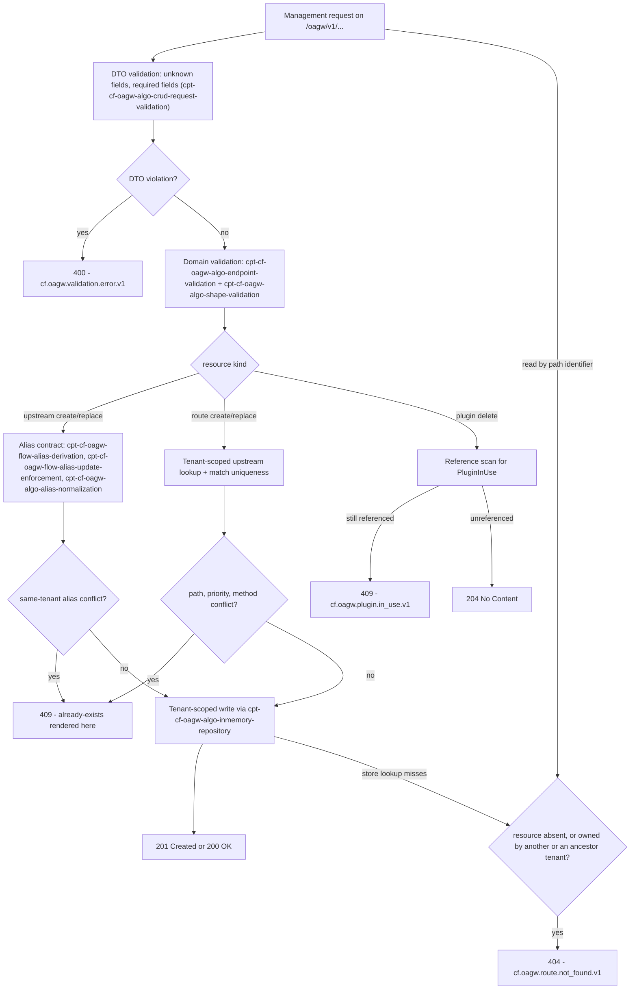

# Feature: Management API (Control Plane)

<!-- toc -->

- [1. Feature Context](#1-feature-context)
  - [1.1 Overview](#11-overview)
  - [1.2 Purpose](#12-purpose)
  - [1.3 Actors](#13-actors)
  - [1.4 References](#14-references)
  - [1.5 Feature-Local Deviations](#15-feature-local-deviations)
- [2. Actor Flows (CDSL)](#2-actor-flows-cdsl)
  - [Upstream Create, Read, Replace and Delete](#upstream-create-read-replace-and-delete)
  - [Route Create, Read, Replace and Delete](#route-create-read-replace-and-delete)
  - [Plugin Create, Read, Delete and Source Retrieval](#plugin-create-read-delete-and-source-retrieval)
- [3. Processes / Business Logic (CDSL)](#3-processes--business-logic-cdsl)
  - [CRUD Request DTO Validation](#crud-request-dto-validation)
  - [List Query Handling](#list-query-handling)
  - [Conflict Status Resolution](#conflict-status-resolution)
- [4. States (CDSL)](#4-states-cdsl)
  - [Resource Enabled State Machine](#resource-enabled-state-machine)
- [5. Definitions of Done](#5-definitions-of-done)
  - [Endpoint Registration](#endpoint-registration)
  - [Upstream CRUD](#upstream-crud)
  - [Route CRUD](#route-crud)
  - [Plugin CRUD](#plugin-crud)
  - [OData List Parameters](#odata-list-parameters)
  - [Tenant Scoping](#tenant-scoping)
  - [Error Status Decisions](#error-status-decisions)
- [6. Acceptance Criteria](#6-acceptance-criteria)

<!-- /toc -->

- [x] `p1` - **ID**: `cpt-cf-oagw-featstatus-management-api-implemented`

<!-- reference to DECOMPOSITION entry -->
`p2` - `cpt-cf-oagw-feature-management-api` — DECOMPOSITION entry 2.4 orders this feature and the text of that entry is the authority for this document's scope; feature progress for this document is owned by the `featstatus` line above.

## 1. Feature Context

### 1.1 Overview

This feature implements the `ControlPlaneService` and the 15 management endpoints of DECOMPOSITION entry 2.4: upstream, route and plugin CRUD under `/oagw/v1/...`, with create/replace semantics, immutable identity fields, tenant scoping that answers 404 for resources the caller does not own, the `enabled` flag, plugin immutability and in-use protection, and the OData list parameters. It is the only actor-facing configuration surface of the gear: every upstream, route and custom plugin that the proxy path later resolves is created, read, replaced or deleted here, and nowhere else.

The feature sits on the route shells that `cpt-cf-oagw-dod-gear-registration` already registers and replaces the 404 placeholder behaviour of `cpt-cf-oagw-feature-gear-wiring` for exactly those 15 paths, leaving the proxy shell to its owning feature. It consumes the aggregates, the closed violation-kind list and the repository traits of `cpt-cf-oagw-feature-domain-model`, and delegates every alias decision to the alias contract of `cpt-cf-oagw-feature-alias-resolution`; it re-states no field list, no value rule and no alias rule of its own. Its own decisions are the ones upstream left to this layer: which HTTP status each domain violation is rendered with, what the list response body looks like, and which method is registered on the plugin path.

The diagram below is the request lifecycle of the create, replace and delete paths — the conflict-and-status lifecycle, which is the one place where the branches differ per resource kind (DTO validation, domain validation, alias or ownership enforcement, conflict rendering, status mapping) — and it is the only diagram in this document for that reason. Its scope is deliberate and narrower than the whole surface: the read and list paths of the 15 endpoints appear in it only through their entry on a path identifier, and the authoritative lifecycle for the read and list paths is the CDSL step lists of §2, which carry the branches the diagram does not. The remaining sections are text-only: their step lists already encode that control flow, and a second diagram would only duplicate it.

| Method | Path | Semantics | Success status |
|---|---|---|---|
| `POST` | `/oagw/v1/upstreams` | Create an upstream; the alias decision is delegated to the alias contract of `cpt-cf-oagw-feature-alias-resolution` | `201 Created` with the stored resource |
| `GET` | `/oagw/v1/upstreams` | List the calling tenant's upstreams with the OData parameters of `cpt-cf-oagw-algo-list-query` | `200 OK` |
| `GET` | `/oagw/v1/upstreams/{id}` | Fetch one upstream by its GTS path identifier, tenant-scoped; 404 when absent or owned by another or an ancestor tenant | `200 OK` |
| `PUT` | `/oagw/v1/upstreams/{id}` | Full replacement: every field is overwritten and omitted optional fields are cleared; the alias update rules apply | `200 OK` |
| `DELETE` | `/oagw/v1/upstreams/{id}` | Delete the upstream, cascading to the same tenant's routes and plugin bindings per `cpt-cf-oagw-algo-inmemory-repository` | `204 No Content` |
| `POST` | `/oagw/v1/routes` | Create a route under an upstream owned by the calling tenant, with match-rule uniqueness enforced | `201 Created` with the stored resource |
| `GET` | `/oagw/v1/routes` | List the calling tenant's routes with the OData parameters | `200 OK` |
| `GET` | `/oagw/v1/routes/{id}` | Fetch one route by its GTS path identifier, tenant-scoped | `200 OK` |
| `PUT` | `/oagw/v1/routes/{id}` | Full replacement with `upstream_id` immutable (absent from the update DTO); match uniqueness re-checked | `200 OK` |
| `DELETE` | `/oagw/v1/routes/{id}` | Delete the route and its plugin bindings | `204 No Content` |
| `POST` | `/oagw/v1/plugins` | Create a custom Starlark plugin resource | `201 Created` with the stored resource |
| `GET` | `/oagw/v1/plugins` | List the calling tenant's custom plugins with the OData parameters | `200 OK` |
| `GET` | `/oagw/v1/plugins/{id}` | Fetch one custom plugin by its GTS path identifier | `200 OK` |
| `DELETE` | `/oagw/v1/plugins/{id}` | Delete a custom plugin; 409 `PluginInUse` while an upstream or route still references it | `204 No Content` |
| `GET` | `/oagw/v1/plugins/{id}/source` | Return the Starlark `source_code` of a stored custom plugin | `200 OK` |

Identifiers on this surface have two forms with a single referent: the `id` field of a stored or returned resource is the bare server-generated UUID that `schemas/upstream.v1.schema.json` and `schemas/route.v1.schema.json` declare (`format: uuid`), while the wrapped `gts.cf.core.oagw.{type}.v1~{uuid}` form is the API-level path-parameter identifier of DESIGN that addresses the same aggregate in the `{id}` path segment. Every `{id}` request of this document and of §6 is written in the wrapped form and every response body carries the bare UUID, so no body puts the wrapped form in its `id` field — and no request body carries `id` at all, because it is not a field of any update DTO.

### 1.2 Purpose

This feature bridges DECOMPOSITION entry 2.4 "Management API (Control Plane)" into an implementation contract. It exists so that upstream, route and plugin configuration reach the repositories of `cpt-cf-oagw-feature-domain-model` through exactly one surface with exactly one set of status decisions: `cpt-cf-oagw-feature-hierarchical-config` resolves effective configuration from what is stored here, `cpt-cf-oagw-feature-proxy-pipeline` serves proxy traffic against it, and neither re-implements a CRUD rule or a status mapping of its own. The 15 paths are the management half of `cpt-cf-oagw-interface-api`, served at the gear-relative base of DECOMPOSITION correction 1.

**Requirements**:

- [ ] `p1` - `cpt-cf-oagw-fr-upstream-mgmt` — the CRUD operations for upstream configurations are the five `/oagw/v1/upstreams` endpoints; tenant scoping is applied on every one of them.
- [ ] `p1` - `cpt-cf-oagw-fr-route-mgmt` — the CRUD operations for routes are the five `/oagw/v1/routes` endpoints, with `upstream_id` ownership enforced at create time.
- [ ] `p1` - `cpt-cf-oagw-fr-enable-disable` — the `enabled` flag (default `true`) is stored and returned by this surface for both aggregates, and drives `cpt-cf-oagw-state-resource-enabled`; the proxy-time consequences of the flag are owned downstream.
- [ ] `p1` - `cpt-cf-oagw-nfr-input-validation` — every management payload passes DTO and domain validation before it is stored, and every violation is rejected with 400.
- [ ] `p1` - `cpt-cf-oagw-nfr-multi-tenancy` — every read and write is scoped to the caller's tenant, so no cross-tenant read or write is reachable through this surface.
- [ ] `p1` - `cpt-cf-oagw-interface-management-api` — the REST management contract of the PRD, served on the paths of §1.1 with the PRD's breaking-change policy.

**Principles**: `p1` - `cpt-cf-oagw-principle-tenant-scope` (all CRUD reads and writes are scoped to `SecurityContext::subject_tenant_id()`, and an ancestor resource is invisible rather than forbidden), `p1` - `cpt-cf-oagw-principle-plugin-immutable` (a plugin resource has no replace operation, so the plugin path registers no PUT).

**Constraints**: `p1` - `cpt-cf-oagw-constraint-toolkit-deploy` (the handlers are registered on the toolkit router of the gear skeleton and the gear owns no listener of its own).

**Components**: `p1` - `cpt-cf-oagw-interface-api` (the DESIGN API-contract element whose management table this feature implements, with the path base of §1.5).

**Data**: `p1` - `cpt-cf-oagw-db-schema` — honoured as the schema contract per DECOMPOSITION correction 3: the `(tenant_id, alias)` and `(tenant_id, name)` uniqueness invariants, the route-match determinism invariant, the cascade semantics and the contiguous binding positions are enforced by the stores behind this surface, and no table is created by this release.

### 1.3 Actors

| Actor | Role in Feature |
|-------|-----------------|
| `cpt-cf-oagw-actor-platform-operator` | Calls the route endpoints of this surface and the upstream/plugin endpoints that carry platform-wide configuration; the actor named by `cpt-cf-oagw-usecase-configure-route` and by `cpt-cf-oagw-usecase-configure-upstream`. |
| `cpt-cf-oagw-actor-tenant-admin` | Calls the upstream and plugin endpoints for its own tenant, supplies explicit aliases where derivation is impossible, and is the direct recipient of the 400, 404 and 409 answers this feature renders. |
| `cpt-cf-oagw-actor-app-developer` | Has no endpoint of this feature: the alias keys and route match rules stored here are what that actor's proxy requests resolve against, which is owned by `cpt-cf-oagw-feature-proxy-pipeline`. |

No actor reaches a repository or an alias algorithm directly: every request arrives through the handlers registered by `cpt-cf-oagw-dod-endpoint-registration`, and the platform authz middleware has already checked the GTS management permission before a handler runs (§1.5).

### 1.4 References

- **PRD**: [PRD.md](../PRD.md) — `cpt-cf-oagw-fr-upstream-mgmt`, `cpt-cf-oagw-fr-route-mgmt`, `cpt-cf-oagw-fr-enable-disable`, `cpt-cf-oagw-nfr-input-validation`, `cpt-cf-oagw-nfr-multi-tenancy`, `cpt-cf-oagw-interface-management-api`, the actors `cpt-cf-oagw-actor-platform-operator`, `cpt-cf-oagw-actor-tenant-admin` and `cpt-cf-oagw-actor-app-developer`, and the use cases `cpt-cf-oagw-usecase-configure-upstream` and `cpt-cf-oagw-usecase-configure-route`
- **Design**: [DESIGN.md](../DESIGN.md) — `cpt-cf-oagw-interface-api` (the Management API table, the CRUD Semantics, Tenant Scoping and List Query Parameters subsections, the Error Response Format table and the Authentication & Authorization subsection with its GTS management permission table), the hierarchical permission table of DESIGN "Permissions and Access Control" (the four `oagw:upstream:*` permissions, including `oagw:upstream:bind`), `cpt-cf-oagw-design-domain-model` (the three aggregates and the Plugin Identification Model), `cpt-cf-oagw-principle-tenant-scope`, `cpt-cf-oagw-principle-plugin-immutable`, `cpt-cf-oagw-db-schema` (the invariants honoured as a schema contract) and `cpt-cf-oagw-component-model` (where `ControlPlaneService` sits)
- **Decomposition**: [DECOMPOSITION.md](../DECOMPOSITION.md) — entry 2.4 "Management API (Control Plane)" and the "Spec corrections applied" block in its overview (corrections 1, 3 and 4 apply to this feature)
- **Schemas**: [schemas/upstream.v1.schema.json](../schemas/upstream.v1.schema.json) and [schemas/route.v1.schema.json](../schemas/route.v1.schema.json) — the field sets the create and update DTOs are derived from, with the endpoint `scheme` enum extended by correction 2
- **Dependencies**:
  - [ ] `p2` - `cpt-cf-oagw-feature-gear-wiring` — a transitive ancestor inherited through the DECOMPOSITION feature graph two steps back from the direct dependency: the registered route shells this feature fills, the problem+json error contract and the `cpt-cf-oagw-algo-error-mapping` table every response of this feature is rendered through.
  - [ ] `p2` - `cpt-cf-oagw-feature-domain-model` — a transitive ancestor inherited through the same graph one step back (the direct dependency below depends on it): the `Upstream`, `Route` and `Plugin` aggregates, the closed violation-kind list of `cpt-cf-oagw-dod-domain-error`, the validation algorithms and the repository traits this feature calls.
  - [ ] `p2` - `cpt-cf-oagw-feature-alias-resolution` — the direct dependency DECOMPOSITION entry 2.4 declares in its "Depends On" line: the alias contract this feature delegates to on every upstream create and replace (`cpt-cf-oagw-flow-alias-derivation`, `cpt-cf-oagw-flow-alias-update-enforcement`, `cpt-cf-oagw-algo-alias-normalization`).
- **Reverse dependents**: `cpt-cf-oagw-feature-hierarchical-config` is the direct dependent in the DECOMPOSITION feature graph (it resolves effective configuration from what this feature stores), `cpt-cf-oagw-feature-proxy-pipeline` and `cpt-cf-oagw-feature-observability` are downstream of it, and `cpt-cf-oagw-feature-plugin-chain` consumes the plugin resource identity this feature stores while depending on `cpt-cf-oagw-feature-domain-model` and `cpt-cf-oagw-feature-gear-wiring` only. None of them may re-state a CRUD semantic, a status decision or a list parameter defined here.

### 1.5 Feature-Local Deviations

Deviations from the supplied spec/platform baseline, recorded per the shared-baseline policy.

**Deviation** — the 15 management endpoints are registered at `/oagw/v1/...` without a leading `/api`, while the Management API table of `cpt-cf-oagw-interface-api` and `cpt-cf-oagw-interface-management-api` write `/api/oagw/v1/...`.
**Rationale** — DECOMPOSITION correction 1: all oagw routes are registered gear-relative, the `/api/oagw/v1/...` form is the operator-gateway-prefixed alias and is not the path this deployment serves, and sibling gears register gear-relative paths for the same reason.
**Review owner**: `cf-generate-author-senior via cf-write-docs review loop`

**Deviation (DECOMPOSITION-level decision)** — `PUT /oagw/v1/plugins/{id}` is not a registered method on the plugin path, so the routing layer answers 405 Method Not Allowed; no handler exists for it.
**Rationale** — DECOMPOSITION entry 2.4 records this as a decomposition-level decision consistent with `cpt-cf-oagw-principle-plugin-immutable` and DESIGN's "Plugins are immutable (no PUT)". A method-mismatch answer is router behaviour, not a gateway error type: no row is added to the 22-row mapping table of `cpt-cf-oagw-algo-error-mapping`, which stays closed, and no plugin update DTO exists.
**Review owner**: `cf-generate-author-senior via cf-write-docs review loop`

**Deviation (feature-local response-shape clarification)** — success statuses over the 15 endpoints are exactly: `201 Created` for the three create endpoints, `200 OK` for the nine read-side endpoints — the three list endpoints, the three get-by-id endpoints, the two replace endpoints and `GET /oagw/v1/plugins/{id}/source` — and `204 No Content` for the three delete endpoints, as pinned in the table of §1.1.
**Rationale** — DESIGN assigns the error statuses and the two 409 conflicts but states no success codes, and DECOMPOSITION entry 2.4 requires "201 with the stored resource" for create; the enumeration is closed at 3 + 9 + 3 = 15 endpoints so that every one of the 15 has exactly one success status and §6 can assert them on the wire.
**Review owner**: `cf-generate-author-senior via cf-write-docs review loop`

**Deviation (feature-local response-shape clarification)** — the list endpoints return a JSON array of the resource objects the two JSON Schemas describe, with no OData envelope, no count wrapper and no next-link.
**Rationale** — the PRD and DESIGN specify OData *query parameters* (`$filter`, `$select`, `$orderby`, `$top`, `$skip`) and say nothing about an OData response envelope, so an envelope would be an invented body shape; the array is also the shape `cpt-cf-oagw-feature-hierarchical-config` consumes when it reads the stored set.
**Review owner**: `cf-generate-author-senior via cf-write-docs review loop`

**Deviation** — the OData support is a declared subset with a closed field universe per parameter: `$filter` supports only the `eq` comparison, and only on the one field DESIGN names for each resource (`alias` for upstreams, `upstream_id` for routes, `type` for plugins, where the plugin filter field `type` addresses the plugin aggregate's `plugin_type` field, since the `Plugin` aggregate carries no field named `type`); `$orderby` and `$select` are evaluated over the aggregate field set of the resource, which is the fields its JSON Schema declares plus the fields `cpt-cf-oagw-feature-domain-model` declares in its §1.5 — that feature puts `enabled` on both aggregates (a schema field for an upstream, an extension field for a route) and `priority` on routes, while a plugin has no field-set extension and takes its field set from the `Plugin` aggregate of `cpt-cf-oagw-design-domain-model`, no JSON Schema being defined for it; `$orderby` accepts exactly one field with an `asc`/`desc` direction; `$top` defaults to 50 and is clamped to a maximum of 100 rather than rejected; `$skip` is a non-negative offset. Any other filter operator or filter field, an unknown `$select` or `$orderby` field, and a malformed or non-numeric `$top` or `$skip` are 400 validation errors — including DESIGN's `$orderby` example `created_at desc` for upstreams, which names no field of the `Upstream` aggregate or of `schemas/upstream.v1.schema.json` and is therefore not satisfiable inside this closed subset and is rejected with 400.
**Rationale** — DESIGN's List Query Parameters section gives one example expression per resource and states the `$top` default and maximum, so a closed subset is the only determinism-preserving reading; the `$orderby`/`$select` universe is the aggregate field set rather than an open grammar because that is the set of fields `cpt-cf-oagw-algo-inmemory-repository` can actually order and project over, and inventing a `created_at` field to satisfy DESIGN's upstream example would add a field that no schema and no aggregate declares; accepting an arbitrary OData grammar would make list results non-deterministic across implementations, and clamping keeps a large `$top` from being a denial-of-service surface while staying inside the declared maximum.
**Review owner**: `cf-generate-author-senior via cf-write-docs review loop`

**Conformance (not a deviation)** — fine-grained permission enforcement is delegated to the platform authz middleware: the GTS management permissions of DESIGN §3.2 "Security Considerations" and §3.3 "Authentication & Authorization", and the four hierarchical permissions `oagw:upstream:bind`, `oagw:upstream:override_auth`, `oagw:upstream:override_rate` and `oagw:upstream:add_plugins` of DESIGN "Permissions and Access Control", are checked before a handler runs, and this feature enforces tenant scoping only.
**Rationale** — DECOMPOSITION correction 4 defers fine-grained permission enforcement to the platform authz middleware for this release; recording the boundary keeps `cpt-cf-oagw-principle-tenant-scope` (owned here) apart from authorisation (owned by the platform), so this feature neither re-implements a permission check nor rejects with 403.
**Review owner**: `cf-generate-author-senior via cf-write-docs review loop`

**Conformance (not a deviation)** — the management surface performs no ancestor walk at create or replace time: an alias that matches an *ancestor* upstream's alias is not a same-tenant conflict, and the ancestor bind outcome (the `oagw:upstream:bind` permission, `enforce` blocking overrides, `private` blocking visibility) is reached by the platform authz middleware and by `cpt-cf-oagw-feature-hierarchical-config` at config-resolution and proxy time. The same boundary puts ancestor resources out of reach of a route create: the `upstream_id` lookup is tenant-scoped, so an ancestor upstream is not addressable and the create fails with the existing not-found violation (404), per DESIGN "Route: `upstream_id` must belong to the calling tenant — ancestor upstreams are not directly addressable". This is also this feature's share of the ancestor-bind ownership that `cpt-cf-oagw-feature-alias-resolution` defers to the management-API layer in its acceptance criteria: the tenant-scoped 404 plus the delegation of the `oagw:upstream:bind` permission check to the platform authz middleware under DECOMPOSITION correction 4, while the config-resolution half of that ownership — what an ancestor's stored configuration resolves to for a descendant — is owned by `cpt-cf-oagw-feature-hierarchical-config`.
**Rationale** — this is entry 2.4's out-of-scope bullet "Hierarchical effective-config merge" together with `cpt-cf-oagw-principle-tenant-scope` and the per-tenant uniqueness invariant of `cpt-cf-oagw-algo-alias-normalization`, which holds independently of the tenant hierarchy; a second, management-side ancestor walk would duplicate the hierarchy logic that feature already owns.
**Review owner**: `cf-generate-author-senior via cf-write-docs review loop`

**Conformance (not a deviation)** — an `upstream_id` that is well formed but does not resolve inside the calling tenant is answered 404 with GTS type `gts.cf.core.errors.err.v1~cf.oagw.route.not_found.v1` and never 400 or 403. For the management surface this supersedes the alternative flow "Upstream not found: Return 400 ValidationError" of PRD `cpt-cf-oagw-usecase-configure-route`: DECOMPOSITION entry 2.4 pins tenant scoping ("ancestor resources 404 to descendants") and DESIGN's Tenant Scoping subsection makes an ancestor-owned resource indistinguishable from an absent one, so a 400 there would disclose that the referenced upstream exists outside the calling tenant. The ownership split between the two layers is: identifier *form* belongs to the domain layer — `cpt-cf-oagw-flow-resource-validation`, through `cpt-cf-oagw-algo-endpoint-validation` and `cpt-cf-oagw-algo-shape-validation`, rejects a missing or non-UUID `upstream_id` with 400 before any lookup runs — while tenant-scoped *resolution* belongs to this feature's `cpt-cf-oagw-flow-route-crud`, which answers an identifier that is absent, foreign-owned or ancestor-owned with the same 404.
**Rationale** — DESIGN's Tenant Scoping subsection ("Ancestor resources are invisible (404) to descendants via the management API") and DECOMPOSITION entry 2.4's tenant-scoping bullet are the later, more specific decisions, and the PRD use case names the same failure with a single non-scoped wording; recording the adjudication here keeps the 400/404 boundary explicit, because the two answers are otherwise indistinguishable to a caller that cannot see other tenants.
**Review owner**: `cf-generate-author-senior via cf-write-docs review loop`

**Conformance (not a deviation)** — storage behind the 15 endpoints is in-memory, and `cpt-cf-oagw-db-schema` is honoured as the schema contract.
**Rationale** — DECOMPOSITION correction 3: `config/e2e-local.yaml` provisions no `database` section for `oagw`, the repository traits keep persistence swappable, the uniqueness, cascade and route-match invariants are enforced by the in-memory stores of `cpt-cf-oagw-algo-inmemory-repository`, and no feature in this release creates tables.
**Review owner**: `cf-generate-author-senior via cf-write-docs review loop`

**Conformance (not a deviation)** — the 409 conflict statuses of entry 2.4 are rendered by this layer and reuse the existing vocabulary: a same-tenant alias conflict on upstream create or replace, and a route-match uniqueness conflict, are both the existing `already-exists` violation kind of `cpt-cf-oagw-dod-domain-error`, and this feature elevates only the HTTP status to 409 while keeping the existing `ValidationError` GTS type; the delete of a referenced plugin is the existing `PluginInUse` row. No new violation kind, no new GTS error type and no new row in the mapping table of `cpt-cf-oagw-feature-gear-wiring` are introduced.
**Rationale** — `cpt-cf-oagw-dod-domain-error` declares the violation kinds enumerated and closed for this release and forbids dependants from adding kinds or mapping rows, and `cpt-cf-oagw-algo-alias-normalization` of `cpt-cf-oagw-feature-alias-resolution` leaves the 409 status of a per-tenant alias conflict to the management-API layer at step `inst-nu-07` (recorded in that feature's own §1.5 conformance entry), so this feature exercises exactly the assignment entry 2.4 makes and adds nothing to the closed error vocabulary.
**Review owner**: `cf-generate-author-senior via cf-write-docs review loop`

**Out of scope** — hierarchical effective-config merge and the ancestor-disable propagation it computes (`cpt-cf-oagw-feature-hierarchical-config`), proxy-time alias and route resolution and the proxy-time 503 rejection of a disabled upstream (`cpt-cf-oagw-feature-proxy-pipeline`), Starlark custom-plugin *execution* (custom plugins remain first-class CRUD resources here, per DECOMPOSITION correction 4), and audit-log and metric emission for the management endpoints (`cpt-cf-oagw-feature-observability`, which owns both).
**Rationale** — DECOMPOSITION entry 2.4 lists the first two in its out-of-scope bullets, correction 4 defers plugin execution, and the observability entry owns telemetry for every oagw surface; this feature emits no audit record and no metric.
**Review owner**: `cf-generate-author-senior via cf-write-docs review loop`

**Not applicable because** — the remaining checklist areas have no object in this feature:

- **Usability and accessibility** — the surface is a machine-facing REST API with no user interface; the only presentation concern is the problem+json error body, which is owned by the error contract of `cpt-cf-oagw-feature-gear-wiring`.
- **Regulatory compliance** — no data subject to a compliance regime crosses this feature: it stores configuration shapes and tenant identifiers, holds no secret material (secret references are validated by `cpt-cf-oagw-algo-shape-validation` and resolved by `cpt-cf-oagw-actor-cred-store` at request time), and writes no audit record.
- **Injection classes** — the injection classes of the security checklist have no object on this surface: no SQL is executed anywhere behind the 15 endpoints (the stores are in-memory per DECOMPOSITION correction 3, so there is no query to parameterise), no HTML is rendered (every body is `application/problem+json` or a JSON array), no shell is invoked, and the path identifiers the handlers accept are server-generated UUIDs, so SQL injection, cross-site scripting, command injection and path traversal have nothing to inject into, render into, execute through or traverse.
- **Rollout and rollback** — the endpoints are registered with the gear skeleton at startup and carry no feature flag, migration or deployable unit of their own; disabling the surface is a configuration concern of the gear, not a staged rollout.
- **Performance** — the surface is configuration-time only and is never on the proxy hot path, which `cpt-cf-oagw-feature-proxy-pipeline` owns, so no latency budget, cache or connection-pool concern attaches to these endpoints; the `$top` clamp at 100 of this section is the only resource bound this feature owns, and it exists to keep a large `$top` from becoming an amplifier rather than to meet a response-time target.
- **Test targets** — the unit-testable boundaries are `cpt-cf-oagw-algo-crud-request-validation`, `cpt-cf-oagw-algo-list-query` and `cpt-cf-oagw-algo-conflict-status`, plus the status decisions of §5, all testable without a proxy; the integration coverage of the proxy path (what a stored `enabled` flag or a disabled ancestor does to live traffic) is owned by `cpt-cf-oagw-feature-proxy-pipeline` and `cpt-cf-oagw-feature-hierarchical-config`.

## 2. Actor Flows (CDSL)

Interactions that start with an actor and describe the end-to-end flow. All three flows begin after the platform authz middleware has accepted the caller: each one starts at a registered handler, reads the caller's tenant id from `SecurityContext::subject_tenant_id()`, and ends at the response the handler returns.

**Use cases**: `p1` - `cpt-cf-oagw-usecase-configure-upstream`, `p1` - `cpt-cf-oagw-usecase-configure-route`

### Upstream Create, Read, Replace and Delete

- [x] `p1` - **ID**: `cpt-cf-oagw-flow-upstream-crud`

**Actor**: `cpt-cf-oagw-actor-tenant-admin`

**Success Scenarios**:

- A hostname-based upstream is created with no `alias` field: the derived alias becomes the routing key and the response is 201 with the stored resource, whose `id` is the server-generated UUID that `schemas/upstream.v1.schema.json` declares (the wrapped `gts.cf.core.oagw.upstream.v1~{uuid}` form is the path identifier that addresses it, not a field of the body).
- An IP-based or otherwise non-derivable upstream is created with the explicit alias the actor supplies, and is returned with `enabled: true` when the payload omits the flag.
- A replace overwrites every field of the stored upstream, including the `enabled` field of its aggregate field set (a schema field for an upstream, an extension field for a route), clears the optional blocks the body omits, and returns 200 with the replaced resource.
- A read returns the stored upstream to its owning tenant; a delete removes it and cascades to the same tenant's routes and plugin bindings.
- A list returns the calling tenant's upstreams as a JSON array, filtered on the `alias` filter field and ordered by a field of the aggregate field set when the OData parameters ask for it.

**Error Scenarios**:

- A body carrying an unknown field — including `id` or `tenant_id`, which are not fields of the update DTO at all — is rejected with 400 before any domain rule runs.
- A payload that violates a domain rule is rejected with 400, with every violation reported together, exactly as the domain layer collected them.
- An alias override or a missing alias is rejected with 400 by the alias contract, not restated here.
- A second upstream with the same alias in the same tenant is answered 409; the same alias in another tenant is accepted.
- A lookup, replace or delete addressed to an absent resource, to a resource of another tenant or to a resource of an ancestor tenant is answered 404, never 403.

**Steps**:

1. [x] - `p1` - Receive the request at `POST /oagw/v1/upstreams`, `GET /oagw/v1/upstreams`, `GET /oagw/v1/upstreams/{id}`, `PUT /oagw/v1/upstreams/{id}` or `DELETE /oagw/v1/upstreams/{id}` and read the caller's tenant id from `SecurityContext::subject_tenant_id()` - `inst-uc-01`
2. [x] - `p1` - Parse the body, when the method carries one, into the create or update DTO through `cpt-cf-oagw-algo-crud-request-validation` - `inst-uc-02`
   1. [x] - `p1` - **CATCH** the unknown-field or missing-required violation and return 400 with GTS type `gts.cf.core.errors.err.v1~cf.oagw.validation.error.v1`, naming every offending field path, before any domain rule runs - `inst-uc-03`
3. [x] - `p1` - Hand the validated payload to the domain validation of `cpt-cf-oagw-flow-resource-validation`, whose `cpt-cf-oagw-algo-endpoint-validation` and `cpt-cf-oagw-algo-shape-validation` own every value rule; this flow restates none of them - `inst-uc-04`
   1. [x] - `p1` - **CATCH** the collected domain violations and return 400 with the same GTS type, reporting all violated rules of the payload together - `inst-uc-05`
4. [x] - `p1` - **IF** the request is a create, delegate the alias decision to `cpt-cf-oagw-flow-alias-derivation` and to `cpt-cf-oagw-algo-alias-normalization`, which derive, normalize and check the `(tenant_id, alias)` uniqueness invariant - `inst-uc-06`
   1. [x] - `p1` - **CATCH** the per-tenant alias conflict and the alias override and missing-alias rejections, and render the conflict 409 through `cpt-cf-oagw-algo-conflict-status` and the two alias rejections 400 as the alias contract reports them - `inst-uc-07`
5. [x] - `p1` - **ELSE IF** the request is a replace, delegate to `cpt-cf-oagw-flow-alias-update-enforcement`, which judges the endpoint change against the alias update transition table and re-checks uniqueness where the alias value could change - `inst-uc-08`
   1. [x] - `p1` - **CATCH** the rejected transition as 400 and a conflict raised by the re-check as 409, through `cpt-cf-oagw-algo-conflict-status` - `inst-uc-09`
6. [x] - `p1` - On a create or a replace, write the upstream through `cpt-cf-oagw-algo-inmemory-repository` under the caller's tenant scope, server-generating the UUID that becomes the stored and returned `id` field — the bare schema identifier, whose wrapped `gts.cf.core.oagw.upstream.v1~{uuid}` form is the API-level path identifier of the same aggregate and not a second field of the body; an ancestor upstream that shares the proposed alias is invisible here and is therefore not a conflict, because the management surface performs no ancestor walk and the bind outcome is owned by the platform authz middleware and by `cpt-cf-oagw-feature-hierarchical-config` - `inst-uc-10`
   1. [x] - `p1` - **CATCH** a duplicate-key violation that reaches the store from a path the alias check did not already render, and render it 409 through `cpt-cf-oagw-algo-conflict-status` - `inst-uc-11`
7. [x] - `p1` - **IF** the request was a create - `inst-uc-12`
   1. [x] - `p1` - **RETURN** 201 with the stored resource, carrying `enabled: true` when the payload omitted the flag - `inst-uc-13`
8. [x] - `p1` - **ELSE IF** the request was a replace - `inst-uc-14`
   1. [x] - `p1` - **RETURN** 200 with the replaced resource, with the omitted optional blocks cleared - `inst-uc-15`
9. [x] - `p1` - **ELSE IF** the request is a read or a delete, resolve the path identifier against the tenant-scoped store, so a resource owned by another tenant or by an ancestor tenant is indistinguishable from an absent one - `inst-uc-16`
   1. [x] - `p1` - **IF** the lookup misses, **RETURN** 404 with GTS type `gts.cf.core.errors.err.v1~cf.oagw.route.not_found.v1` and never a 403, per DESIGN "Tenant Scoping" and `cpt-cf-oagw-principle-tenant-scope` - `inst-uc-17`
   2. [x] - `p1` - **ELSE IF** the request is a read, **RETURN** 200 with the stored resource - `inst-uc-18`
   3. [x] - `p1` - **ELSE** run the cascade of `cpt-cf-oagw-algo-inmemory-repository` over the same tenant's routes and plugin bindings and **RETURN** 204 - `inst-uc-19`
10. [x] - `p1` - **ELSE IF** the request is a list, build the page through `cpt-cf-oagw-algo-list-query` over the calling tenant's upstreams, honouring the `alias` filter field of §1.5 and the aggregate field set of the `$orderby` and `$select` parameters, and **RETURN** 200 with the JSON array - `inst-uc-20`
11. [x] - `p1` - **RETURN** the response of the matched branch, with every gateway error rendered as `application/problem+json` carrying `X-OAGW-Error-Source: gateway` through `cpt-cf-oagw-algo-error-mapping` - `inst-uc-21`

### Route Create, Read, Replace and Delete

- [x] `p1` - **ID**: `cpt-cf-oagw-flow-route-crud`

**Actor**: `cpt-cf-oagw-actor-platform-operator`

**Success Scenarios**:

- A route is created under an upstream owned by the calling tenant, and the response is 201 with the stored resource, whose `id` is the server-generated UUID that `schemas/route.v1.schema.json` declares (the wrapped `gts.cf.core.oagw.route.v1~{uuid}` form is the path identifier that addresses it).
- A replace changes the match rule, rate-limit, plugin and tag fields and the route-only `enabled` and `priority` fields of the declared field-set extension, and leaves `upstream_id` untouched, because it is not a field of the update DTO.
- A list returns the tenant's routes as a JSON array, filtered by `upstream_id` and ordered by `priority` when the OData parameters ask for it.

**Error Scenarios**:

- An `upstream_id` that does not resolve inside the calling tenant is rejected with 404, because an ancestor upstream is not directly addressable from the management surface; the adjudication against the PRD's 400 wording, and the ownership split behind it, are recorded in the unresolvable-`upstream_id` conformance entry of §1.5.
- A second route with the same `path`, `priority` and `method` under the same upstream is answered 409.
- A replace body carrying `upstream_id` is rejected with 400 as an unknown field.
- A lookup, replace or delete addressed to an absent or foreign route is answered 404, never 403.

**Steps**:

1. [x] - `p1` - Receive the request at `POST /oagw/v1/routes`, `GET /oagw/v1/routes`, `GET /oagw/v1/routes/{id}`, `PUT /oagw/v1/routes/{id}` or `DELETE /oagw/v1/routes/{id}` and read the caller's tenant id from `SecurityContext::subject_tenant_id()` - `inst-rc-01`
2. [x] - `p1` - Parse the body, when the method carries one, into the create or update DTO through `cpt-cf-oagw-algo-crud-request-validation`, whose update DTO declares no `upstream_id` field - `inst-rc-02`
   1. [x] - `p1` - **CATCH** the unknown-field or missing-required violation — including a replace body that supplies `upstream_id` — and return 400 with GTS type `gts.cf.core.errors.err.v1~cf.oagw.validation.error.v1` - `inst-rc-03`
3. [x] - `p1` - Hand the validated payload to the domain validation of `cpt-cf-oagw-flow-resource-validation`, which owns the `match` block rules and every other value rule - `inst-rc-04`
   1. [x] - `p1` - **CATCH** the collected domain violations and return 400, reporting all violated rules together - `inst-rc-05`
4. [x] - `p1` - **IF** the request carries an `upstream_id`, look the referenced upstream up through the tenant-scoped `UpstreamRepository`, so only an upstream of the calling tenant is addressable - `inst-rc-06`
   1. [x] - `p1` - **IF** the lookup misses, because the upstream is absent, belongs to another tenant or belongs to an ancestor tenant, **RETURN** 404 with GTS type `gts.cf.core.errors.err.v1~cf.oagw.route.not_found.v1`, per DESIGN "Tenant Scoping" and `cpt-cf-oagw-principle-tenant-scope`, and per the unresolvable-`upstream_id` conformance entry of §1.5 - `inst-rc-07`
5. [x] - `p1` - On a create or a replace, write the route through `cpt-cf-oagw-algo-inmemory-repository`, which enforces the route-match determinism invariant of `cpt-cf-oagw-db-schema` on the write - `inst-rc-08`
   1. [x] - `p1` - **CATCH** the already-exists violation for a second route with the same `path`, `priority` and `method` under the same upstream, and render it 409 through `cpt-cf-oagw-algo-conflict-status` - `inst-rc-09`
6. [x] - `p1` - **IF** the request was a create - `inst-rc-10`
   1. [x] - `p1` - **RETURN** 201 with the stored route, carrying `enabled: true` when the payload omitted the flag - `inst-rc-11`
7. [x] - `p1` - **ELSE IF** the request was a replace - `inst-rc-12`
   1. [x] - `p1` - **RETURN** 200 with the replaced route, with the omitted optional fields cleared and `upstream_id` unchanged - `inst-rc-13`
8. [x] - `p1` - **ELSE IF** the request is a read or a delete, resolve the path identifier against the tenant-scoped store - `inst-rc-14`
   1. [x] - `p1` - **IF** the lookup misses, **RETURN** 404 with GTS type `gts.cf.core.errors.err.v1~cf.oagw.route.not_found.v1` and never a 403 - `inst-rc-15`
   2. [x] - `p1` - **ELSE IF** the request is a read, **RETURN** 200 with the stored route - `inst-rc-16`
   3. [x] - `p1` - **ELSE** apply the cascade of `cpt-cf-oagw-algo-inmemory-repository` to the route's plugin bindings and **RETURN** 204 - `inst-rc-17`
9. [x] - `p1` - **IF** the request is a list, build the page through `cpt-cf-oagw-algo-list-query` over the calling tenant's routes and return 200 with the JSON array - `inst-rc-18`
10. [x] - `p1` - **RETURN** the response, with every gateway error rendered as `application/problem+json` carrying `X-OAGW-Error-Source: gateway` through `cpt-cf-oagw-algo-error-mapping` - `inst-rc-19`

### Plugin Create, Read, Delete and Source Retrieval

- [x] `p1` - **ID**: `cpt-cf-oagw-flow-plugin-crud`

**Actor**: `cpt-cf-oagw-actor-tenant-admin`

**Success Scenarios**:

- A custom Starlark plugin is created with its `plugin_type`, `name`, `config_schema` and Starlark `source_code`, and is returned with the server-generated UUID as its `id` (the wrapped `gts.cf.core.oagw.{type}_plugin.v1~{uuid}` form is the path identifier that addresses it).
- A delete of a plugin that no upstream or route references removes it and returns 204.
- A request to the source endpoint returns the stored Starlark source of a custom plugin.
- A list returns the calling tenant's custom plugins as a JSON array, filtered on the `type` filter field — which addresses the plugin aggregate's `plugin_type` field — when the OData parameters ask for it.

**Error Scenarios**:

- A delete of a plugin still referenced by an upstream or a route is answered 409 `PluginInUse` with the referencing resources named in the body.
- A plugin identifier addressed to a built-in named plugin is answered 404 for get, delete and source, because built-in plugins are not persisted and are not addressable through this surface.
- A `PUT` on the plugin path is answered 405 by the routing layer, because no such method is registered.
- A second plugin with the same `name` in one tenant is rejected through the `(tenant_id, name)` uniqueness invariant.

**Steps**:

1. [x] - `p1` - Receive the request at `POST /oagw/v1/plugins`, `GET /oagw/v1/plugins`, `GET /oagw/v1/plugins/{id}`, `DELETE /oagw/v1/plugins/{id}` or `GET /oagw/v1/plugins/{id}/source`, and read the caller's tenant id from `SecurityContext::subject_tenant_id()` - `inst-pc-01`
2. [x] - `p1` - Parse the body of a create through `cpt-cf-oagw-algo-crud-request-validation` and hand it to the plugin rules of `cpt-cf-oagw-algo-shape-validation`, which own `plugin_type`, `name` and the Starlark shape - `inst-pc-02`
   1. [x] - `p1` - **CATCH** the unknown-field, missing-required or plugin-shape violation and return 400 with GTS type `gts.cf.core.errors.err.v1~cf.oagw.validation.error.v1`, reporting all violated rules together - `inst-pc-03`
3. [x] - `p1` - **IF** the request is a create, store the plugin through `cpt-cf-oagw-algo-inmemory-repository` under the `(tenant_id, name)` uniqueness invariant of `cpt-cf-oagw-db-schema` and **RETURN** 201 with the stored resource - `inst-pc-04`
4. [x] - `p1` - **ELSE IF** the request is a get or a source retrieval, resolve the path identifier against the tenant-scoped `PluginRepository` - `inst-pc-05`
   1. [x] - `p1` - **IF** the identifier is UUID-backed and the stored plugin exists in the calling tenant, **RETURN** 200 with the stored plugin resource for a get, or 200 with the stored Starlark `source_code` for the source endpoint - `inst-pc-06`
   2. [x] - `p1` - **ELSE**, including an identifier whose instance names a built-in plugin and is therefore not persisted, **RETURN** 404 with GTS type `gts.cf.core.errors.err.v1~cf.oagw.route.not_found.v1`, never a 403 — the 404 is anchored in the Plugin Identification Model of `cpt-cf-oagw-design-domain-model` and in `cpt-cf-oagw-dod-plugin-identity` of `cpt-cf-oagw-feature-domain-model`, under which a named plugin is resolved through an in-process registry and never stored, so no tenant-scoped row can answer for it (the in-process registry itself is plugin-chain's, a parallel feature that registers no management endpoint) - `inst-pc-07`
5. [x] - `p1` - **ELSE IF** the request is a delete, resolve the identifier the same way and scan the stored upstreams and routes of the calling tenant for bindings that still reference it, per the plugin identification model of `cpt-cf-oagw-design-domain-model` - `inst-pc-08`
   1. [x] - `p1` - **IF** a binding still references the plugin, render the conflict through `cpt-cf-oagw-algo-conflict-status`, whose plugin-delete branch selects the existing `PluginInUse` row, and **RETURN** 409 with GTS type `gts.cf.core.errors.err.v1~cf.oagw.plugin.in_use.v1`, a `plugin_id` field and a `referenced_by` object listing the `upstreams` and `routes` that still reference it, leaving the stored plugin untouched - `inst-pc-09`
   2. [x] - `p1` - **ELSE** perform the reference scan of `inst-pc-08` and the delete as one atomic store operation of `cpt-cf-oagw-algo-inmemory-repository` — the same in-process guarantee that algorithm applies to a multi-field write — so a binding created after the scan has begun cannot survive the delete, and **RETURN** 204 - `inst-pc-10`
6. [x] - `p1` - **ELSE IF** the request is a list, build the page through `cpt-cf-oagw-algo-list-query` over the calling tenant's custom plugins, filtered on the DESIGN-named `type` filter field, which addresses the plugin aggregate's `plugin_type` field (§1.5), and **RETURN** 200 with the JSON array - `inst-pc-11`
7. [x] - `p1` - **RETURN** the response, with every gateway error rendered as `application/problem+json` carrying `X-OAGW-Error-Source: gateway` through `cpt-cf-oagw-algo-error-mapping`; a `PUT /oagw/v1/plugins/{id}` never reaches this flow, because no such method is registered and the routing layer answers 405 - `inst-pc-12`

## 3. Processes / Business Logic (CDSL)

Internal building blocks called by the three flows above. None of them opens an HTTP route of its own, and none of them re-states a value rule or an alias rule owned by another feature.

### CRUD Request DTO Validation

- [x] `p2` - **ID**: `cpt-cf-oagw-algo-crud-request-validation`

**Input**: the method, the path and the raw body of one of the 15 management requests.

**Output**: the typed create or update DTO handed to the domain layer, or the unknown-field and missing-required violations to render as 400.

**Steps**:

1. [x] - `p1` - Parse the body as JSON and reject anything that is not an object, so a malformed payload never reaches the domain layer - `inst-cv-01`
2. [x] - `p1` - **FOR EACH** top-level field of the parsed body - `inst-cv-02`
   1. [x] - `p1` - Compare the field name against the field set of the DTO that matches the method: the create DTOs follow the field sets of `schemas/upstream.v1.schema.json` and `schemas/route.v1.schema.json` plus the plugin fields of `cpt-cf-oagw-design-domain-model`, extended by the field-set extension that `cpt-cf-oagw-feature-domain-model` declares in its §1.5 — which puts `enabled` on both aggregates (a schema field for an upstream, an extension field for a route) and `priority` on routes — so a create or replace body carrying `enabled` (and, for a route, `priority`) is accepted here rather than reported as an unknown field, and the same extension is what `$orderby=priority` is resolved over; the update DTOs are those same extended field sets minus `id`, `tenant_id` and, for a route, `upstream_id`, which are not fields of any update DTO at all - `inst-cv-03`
   2. [x] - `p1` - Record an unknown-field violation for every field outside that set, naming the field path; the immutability of `id`, `tenant_id` and route `upstream_id` is enforced here, by their absence from the update DTO, and never by comparing a supplied value against a stored one - `inst-cv-04`
3. [x] - `p1` - Verify the required fields of the DTO: `server` and `protocol` for an upstream, `upstream_id` and `match` for a route create, `plugin_type`, `name` and `source_code` for a plugin, recording a missing-required violation for each absent one - `inst-cv-05`
4. [x] - `p1` - **IF** any violation was recorded - `inst-cv-06`
   1. [x] - `p1` - **RETURN** the collected violations to the caller flow, to be rendered as 400 with GTS type `gts.cf.core.errors.err.v1~cf.oagw.validation.error.v1` through `cpt-cf-oagw-algo-error-mapping`, satisfying `cpt-cf-oagw-nfr-input-validation` at the management boundary - `inst-cv-07`
5. [x] - `p1` - **ELSE** hand the typed DTO to the domain validation of `cpt-cf-oagw-flow-resource-validation`, which delegates the endpoint rules to `cpt-cf-oagw-algo-endpoint-validation` and every value-object rule to `cpt-cf-oagw-algo-shape-validation`; this algorithm owns the field-set boundary only and restates no value rule - `inst-cv-08`
6. [x] - `p1` - **RETURN** the validated DTO, or the collected violations - `inst-cv-09`

### List Query Handling

- [x] `p2` - **ID**: `cpt-cf-oagw-algo-list-query`

**Input**: the query string of a list endpoint together with the calling tenant's resource set.

**Output**: one page of resources as a JSON array, or the query violations to render as 400.

**Steps**:

1. [x] - `p1` - Read `$filter`, `$select`, `$orderby`, `$top` and `$skip` from the query string and default `$top` to 50 and `$skip` to 0 when absent - `inst-lq-01`
2. [x] - `p1` - Parse `$filter` and accept only the `eq` comparison on the one field DESIGN names for the resource: `alias` for upstreams, `upstream_id` for routes, `type` for plugins — where the plugin filter field `type` addresses the plugin aggregate's `plugin_type` field, because the `Plugin` aggregate carries no field named `type` - `inst-lq-02`
   1. [x] - `p1` - **CATCH** any other operator, any other field and any unparseable expression as a 400 validation error with GTS type `gts.cf.core.errors.err.v1~cf.oagw.validation.error.v1` - `inst-lq-03`
3. [x] - `p1` - Parse `$select` as a comma-separated projection onto the resource's own fields — the aggregate field set of §1.5 — and reject a name that is not a field of that set - `inst-lq-04`
4. [x] - `p1` - Parse `$orderby` as exactly one field with an optional `asc` or `desc` direction, defaulting to `asc`, and reject a second field, a missing direction keyword in an `asc`/`desc` position, and a name outside the governing field universe of §1.5 — the aggregate field set of the resource; DESIGN's examples are `created_at desc` for upstreams and `priority` for routes, and the first of those names no field of the `Upstream` aggregate or of `schemas/upstream.v1.schema.json`, so it is rejected with 400 exactly like any other unknown `$orderby` field - `inst-lq-05`
5. [x] - `p1` - Parse `$top` and `$skip` as integers, clamping `$top` to the maximum of 100 when a larger value is supplied and rejecting a negative `$skip` - `inst-lq-06`
   1. [x] - `p1` - **CATCH** a malformed or non-numeric `$top` or `$skip` as a 400 validation error with the same GTS type - `inst-lq-07`
6. [x] - `p1` - Read the calling tenant's resources through the tenant-scoped repository of `cpt-cf-oagw-algo-inmemory-repository`, so the result set never contains another tenant's resource - `inst-lq-08`
7. [x] - `p1` - Apply `$filter`, then `$orderby`, then `$skip`, then the clamped `$top`, in that order - `inst-lq-09`
8. [x] - `p1` - Project each result onto the `$select` field set when `$select` was supplied - `inst-lq-10`
9. [x] - `p1` - **RETURN** the page as a JSON array of resource objects with no envelope, satisfying `cpt-cf-oagw-dod-odata-list` - `inst-lq-11`

### Conflict Status Resolution

- [x] `p2` - **ID**: `cpt-cf-oagw-algo-conflict-status`

**Input**: a `DomainError` violation kind raised by the domain or alias layer, together with the operation context that raised it.

**Output**: the HTTP status and GTS `type` of the response this feature returns for it.

**Steps**:

1. [x] - `p1` - Classify the violation kind against the closed list of `cpt-cf-oagw-dod-domain-error`, which this algorithm extends with no kind of its own - `inst-cs-01`
2. [x] - `p1` - **IF** the kind is `already-exists` **AND** the operation is an upstream create or replace whose conflict is a per-tenant alias conflict reported by `cpt-cf-oagw-algo-alias-normalization` - `inst-cs-02`
   1. [x] - `p1` - Render 409, keeping the GTS `type` the domain already produces for the kind, `gts.cf.core.errors.err.v1~cf.oagw.validation.error.v1`, with the body's `status` field carrying 409 and the `detail` naming the colliding `(tenant_id, alias)` key - `inst-cs-03`
3. [x] - `p1` - **ELSE IF** the kind is `already-exists` **AND** the operation is a route create or replace whose conflict is the route-match uniqueness invariant of `cpt-cf-oagw-db-schema` — the same `path`, `priority` and `method` under the same upstream - `inst-cs-04`
   1. [x] - `p1` - Render 409 with the same GTS `type` and a `detail` naming the colliding `(path, priority, method)` key - `inst-cs-05`
4. [x] - `p1` - **ELSE IF** the operation is a plugin delete whose reference scan found a binding - `inst-cs-06`
   1. [x] - `p1` - Render 409 with GTS type `gts.cf.core.errors.err.v1~cf.oagw.plugin.in_use.v1`, the existing `PluginInUse` row of `cpt-cf-oagw-algo-error-mapping`, carrying `plugin_id` and the `referenced_by` object - `inst-cs-07`
5. [x] - `p1` - **ELSE** pass the violation to the mapping table unchanged, so a not-found kind renders 404 with `gts.cf.core.errors.err.v1~cf.oagw.route.not_found.v1` and every other kind renders the 400 `ValidationError` row the domain contract already assigns - `inst-cs-08`
6. [x] - `p1` - Attach `X-OAGW-Error-Source: gateway` to every rendered response and add no row to the mapping table, which stays closed at 22 rows - `inst-cs-09`
7. [x] - `p1` - **RETURN** the status and GTS `type` to the calling flow - `inst-cs-10`

## 4. States (CDSL)

### Resource Enabled State Machine

- [x] `p2` - **ID**: `cpt-cf-oagw-state-resource-enabled`

**States**: `Enabled`, `Disabled`

**Initial State**: `Enabled`

**Transitions**:

1. [x] - `p1` - **FROM** `Enabled` **TO** `Disabled` **WHEN** a PUT from the owning tenant writes `enabled: false` on an upstream or a route - `inst-en-01`
2. [x] - `p1` - **FROM** `Disabled` **TO** `Enabled` **WHEN** a PUT from the owning tenant writes `enabled: true` on the same resource - `inst-en-02`

This machine is the management-side trigger set of `cpt-cf-oagw-state-resource-lifecycle`: the `Active` to `Disabled` and `Disabled` to `Active` transitions of that lifecycle are driven by exactly the two writes above, while existence and deletion stay owned by the domain model, which enters `Deleted` without this machine taking part. A PUT that writes the value the flag already holds is a no-op and leaves the state unchanged, any later transition other than the two above is refused, and no transition reads or writes any field other than `enabled`. The create-time entry of this machine is the state the create body carries — `Enabled` when the flag is omitted or set to `true`, and `Disabled` when the body sets `false`. The omitted-flag case takes the `true` default that `cpt-cf-oagw-fr-enable-disable` states and that `schemas/upstream.v1.schema.json` declares on the upstream's `enabled` field; a route takes the same default through the field-set extension of `cpt-cf-oagw-feature-domain-model` §1.5, because `schemas/route.v1.schema.json` declares no top-level `enabled`. This entry mirrors the `Draft` to `Active` and `Draft` to `Disabled` create-time writes of `cpt-cf-oagw-state-resource-lifecycle` (`inst-rl-01` and `inst-rl-02` of `cpt-cf-oagw-feature-domain-model`), the two PUT transitions above are the only later transitions, and a resource is never created in a state other than the one its body carries. The machine covers the `Upstream` and `Route` aggregates only, since `Plugin` carries no `enabled` field. Ancestor-disabled propagation is not a transition of this machine — the management surface stores and returns the flag of the caller's own tenant, and the propagation of an ancestor disable to descendants, the exclusion of a disabled route from matching and the proxy-time 503 rejection of a disabled upstream are read as inputs by `cpt-cf-oagw-feature-hierarchical-config` and `cpt-cf-oagw-feature-proxy-pipeline`, per `cpt-cf-oagw-fr-enable-disable`.

## 5. Definitions of Done

### Endpoint Registration

- [x] `p1` - **ID**: `cpt-cf-oagw-dod-endpoint-registration`

The system **MUST** register the 15 management handlers on the route shells `cpt-cf-oagw-dod-gear-registration` already enumerates, at the `/oagw/v1/...` base of §1.5, so that each of the 15 paths answers with its own semantics instead of the 404 placeholder of `cpt-cf-oagw-feature-gear-wiring`, and **MUST** leave every other shell — the proxy shell — to its owning feature. The registration set **MUST NOT** declare a method beyond the 15, so that `PUT /oagw/v1/plugins/{id}` is answered 405 by the routing layer.

**Implements**:

- `cpt-cf-oagw-flow-upstream-crud`
- `cpt-cf-oagw-flow-route-crud`
- `cpt-cf-oagw-flow-plugin-crud`

**Constraints**: `p1` - `cpt-cf-oagw-constraint-toolkit-deploy`

**Touches**:

- API: the 15 management paths of the table in §1.1

### Upstream CRUD

- [x] `p1` - **ID**: `cpt-cf-oagw-dod-upstream-crud`

The system **MUST** implement the five upstream endpoints so that a create server-generates the UUID and returns 201 with the stored resource carrying that UUID as its `id` field — the bare schema identifier of `schemas/upstream.v1.schema.json`, whose wrapped `gts.cf.core.oagw.upstream.v1~{uuid}` form is the path identifier that addresses it (§1.1) — together with the `enabled` default `true`, a replace performs a full replacement that clears the optional blocks the body omits, stores and returns the `enabled` flag of `cpt-cf-oagw-state-resource-enabled` and returns 200, a delete applies the cascade of `cpt-cf-oagw-algo-inmemory-repository` and returns 204, and every alias decision is delegated to `cpt-cf-oagw-flow-alias-derivation`, `cpt-cf-oagw-flow-alias-update-enforcement` and `cpt-cf-oagw-algo-alias-normalization` without restating a rule.

**Implements**:

- `cpt-cf-oagw-flow-upstream-crud`
- `cpt-cf-oagw-algo-crud-request-validation`
- `cpt-cf-oagw-algo-conflict-status`
- `cpt-cf-oagw-state-resource-enabled`

**Touches**:

- Entities: `Upstream`
- API: `POST|GET /oagw/v1/upstreams`, `GET|PUT|DELETE /oagw/v1/upstreams/{id}`

### Route CRUD

- [x] `p1` - **ID**: `cpt-cf-oagw-dod-route-crud`

The system **MUST** implement the five route endpoints so that a create resolves `upstream_id` through a tenant-scoped lookup and rejects an unresolvable reference with 404, a replace treats `upstream_id` as immutable by leaving it out of the update DTO, a replace and a create store and return the `enabled` flag of `cpt-cf-oagw-state-resource-enabled`, and a second route sharing `path`, `priority` and `method` under the same upstream is answered 409 by `cpt-cf-oagw-algo-conflict-status`.

**Implements**:

- `cpt-cf-oagw-flow-route-crud`
- `cpt-cf-oagw-algo-crud-request-validation`
- `cpt-cf-oagw-algo-conflict-status`
- `cpt-cf-oagw-state-resource-enabled`

**Touches**:

- Entities: `Route`
- API: `POST|GET /oagw/v1/routes`, `GET|PUT|DELETE /oagw/v1/routes/{id}`
- DB: `cpt-cf-oagw-db-schema` (the route-match determinism invariant, honoured as a schema contract)

### Plugin CRUD

- [x] `p1` - **ID**: `cpt-cf-oagw-dod-plugin-crud`

The system **MUST** implement the five plugin endpoints so that a create stores a custom Starlark plugin and returns 201, a get and the source endpoint return the stored resource and its `source_code`, a delete of a still-referenced plugin returns 409 with `plugin_id` and the `referenced_by` object listing the `upstreams` and `routes` that reference it, a delete of an unreferenced plugin returns 204, and a built-in named plugin identifier is answered 404 on get, delete and source because built-in plugins are not persisted.

**Implements**:

- `cpt-cf-oagw-flow-plugin-crud`
- `cpt-cf-oagw-algo-conflict-status`

**Principles**: `p1` - `cpt-cf-oagw-principle-plugin-immutable`

**Touches**:

- Entities: `Plugin`
- API: `POST|GET /oagw/v1/plugins`, `GET|DELETE /oagw/v1/plugins/{id}`, `GET /oagw/v1/plugins/{id}/source`

### OData List Parameters

- [x] `p1` - **ID**: `cpt-cf-oagw-dod-odata-list`

The system **MUST** implement the `$filter`, `$select`, `$orderby`, `$top` and `$skip` handling of `cpt-cf-oagw-algo-list-query` on all three list endpoints, returning a JSON array with no envelope, defaulting `$top` to 50, clamping it to 100, and rejecting a malformed or unsupported query parameter with 400.

**Implements**:

- `cpt-cf-oagw-algo-list-query`
- `cpt-cf-oagw-flow-upstream-crud`
- `cpt-cf-oagw-flow-route-crud`
- `cpt-cf-oagw-flow-plugin-crud`

**Touches**:

- API: `GET /oagw/v1/upstreams`, `GET /oagw/v1/routes`, `GET /oagw/v1/plugins`

### Tenant Scoping

- [x] `p1` - **ID**: `cpt-cf-oagw-dod-tenant-scoping`

The system **MUST** scope every read and write of the 15 endpoints to `SecurityContext::subject_tenant_id()`, **MUST** answer a resource owned by another tenant or by an ancestor tenant with 404 and the not-found violation rather than 403, and **MUST NOT** expose any management path that reaches a resource outside that scope, so that no cross-tenant read or write is reachable through the management surface.

**Implements**:

- `cpt-cf-oagw-flow-upstream-crud`
- `cpt-cf-oagw-flow-route-crud`
- `cpt-cf-oagw-flow-plugin-crud`

**Principles**: `p1` - `cpt-cf-oagw-principle-tenant-scope`

**Touches**:

- Entities: `Upstream`, `Route`, `Plugin`

### Error Status Decisions

- [x] `p1` - **ID**: `cpt-cf-oagw-dod-error-status-decision`

The system **MUST** render every management response through the error contract of `cpt-cf-oagw-feature-gear-wiring` with exactly the status decisions of `cpt-cf-oagw-algo-conflict-status` — 201 on the three create endpoints, 200 on the three list endpoints, the three get-by-id endpoints, the two replace endpoints and the plugin source endpoint, 204 on the three delete endpoints, 400 for unknown-field, missing-required and domain violations, 404 for absent, foreign, ancestor-owned and unresolvable resources, 409 for the alias and route-match conflicts and for `PluginInUse` — and **MUST NOT** add a row to the mapping table of `cpt-cf-oagw-algo-error-mapping` or introduce a GTS error type, violation kind or success-status variant of its own.

**Implements**:

- `cpt-cf-oagw-algo-conflict-status`
- `cpt-cf-oagw-flow-plugin-crud`
- `cpt-cf-oagw-flow-route-crud`
- `cpt-cf-oagw-flow-upstream-crud`

**Principles**: `p1` - `cpt-cf-oagw-principle-tenant-scope`

**Touches**:

- API: every error response of the 15 management paths
- Entities: `DomainError`

## 6. Acceptance Criteria

- [x] `POST /oagw/v1/upstreams` with a single `https` hostname endpoint and no `alias` field returns 201, and the body carries the server-generated UUID as its `id` field — the bare identifier of `schemas/upstream.v1.schema.json`, not the wrapped `gts.cf.core.oagw.upstream.v1~{uuid}` path form of §1.1 — together with the derived alias and `enabled: true`.
- [x] `POST /oagw/v1/upstreams` with an IP-based endpoint pool and no `alias` field returns 400 with GTS type `gts.cf.core.errors.err.v1~cf.oagw.validation.error.v1` and a `detail` naming the missing alias, so the alias rejections arrive from the delegated alias contract.
- [x] `POST /oagw/v1/upstreams` a second upstream with the same alias in the same tenant returns 409 with GTS type `gts.cf.core.errors.err.v1~cf.oagw.validation.error.v1`, a body `status` of 409 and a `detail` naming the colliding `(tenant_id, alias)` key, while the same alias in a different tenant returns 201.
- [x] `PUT /oagw/v1/upstreams/{id}` with a body that omits an optional block returns 200 and a stored resource that no longer carries that block, and a body that carries `id` or `tenant_id` returns 400 for an unknown field with no immutable-field comparison performed.
- [x] `GET /oagw/v1/upstreams/{id}` for an identifier owned by another tenant or by an ancestor tenant returns 404 with GTS type `gts.cf.core.errors.err.v1~cf.oagw.route.not_found.v1` and never 403, and is indistinguishable from a request for an absent identifier.
- [x] `DELETE /oagw/v1/upstreams/{id}` returns 204, and a following `GET /oagw/v1/routes/{id}` for a route of that upstream returns 404, so the cascade of `cpt-cf-oagw-algo-inmemory-repository` is observable through the management surface.
- [x] `POST /oagw/v1/routes` with an `upstream_id` that does not resolve inside the calling tenant returns 404 with GTS type `gts.cf.core.errors.err.v1~cf.oagw.route.not_found.v1` (per the unresolvable-`upstream_id` conformance entry of §1.5, which also records the ownership split against the domain layer's 400 for a malformed identifier).
- [x] `PUT /oagw/v1/routes/{id}` with `upstream_id` in the body returns 400 for an unknown field, and the same request without it returns 200 with `upstream_id` unchanged.
- [x] `POST /oagw/v1/routes` a second route with the same `path`, `priority` and `method` under the same upstream returns 409 with GTS type `gts.cf.core.errors.err.v1~cf.oagw.validation.error.v1` and a `detail` naming the colliding `(path, priority, method)` key.
- [x] `PUT /oagw/v1/plugins/{id}` returns 405 Method Not Allowed, because no such method is registered on the plugin path, and the 22-row mapping table of `cpt-cf-oagw-algo-error-mapping` is unchanged.
- [x] `DELETE /oagw/v1/plugins/{id}` for a plugin still bound by an upstream or a route returns 409 with GTS type `gts.cf.core.errors.err.v1~cf.oagw.plugin.in_use.v1`, a `plugin_id` field and a `referenced_by` object whose `upstreams` and `routes` entries name the referencing resources, and the plugin remains retrievable afterwards.
- [x] `DELETE /oagw/v1/plugins/{id}` for a plugin no upstream or route references returns 204, and a following `GET /oagw/v1/plugins/{id}` returns 404.
- [x] `GET /oagw/v1/plugins/{id}/source` for a stored custom plugin returns 200 with the Starlark `source_code` that was stored at create time.
- [x] `GET /oagw/v1/plugins/{id}`, `DELETE /oagw/v1/plugins/{id}` and `GET /oagw/v1/plugins/{id}/source` for a built-in named plugin identifier each return 404 with GTS type `gts.cf.core.errors.err.v1~cf.oagw.route.not_found.v1`.
- [x] `GET /oagw/v1/routes?$filter=upstream_id eq '{uuid}'` returns 200 with a JSON array containing only the routes of that upstream, with no envelope field around the array.
- [x] `GET /oagw/v1/routes?$orderby=priority desc` returns 200 with the array ordered by descending `priority`, and `GET /oagw/v1/upstreams?$filter=alias ne 'api.example.com'` returns 400 because `ne` is outside the supported `eq`-only subset.
- [x] `GET /oagw/v1/upstreams?$top=500` returns 200 with at most 100 items rather than a rejection, `GET /oagw/v1/upstreams` with no `$top` returns at most 50, and `GET /oagw/v1/upstreams?$top=abc` returns 400 with GTS type `gts.cf.core.errors.err.v1~cf.oagw.validation.error.v1`.
- [x] Every gateway error returned by the 15 endpoints carries `X-OAGW-Error-Source: gateway` and a problem+json body with the five RFC 9457 standard fields, and no new row appears in the mapping table of `cpt-cf-oagw-algo-error-mapping` for any of them.
