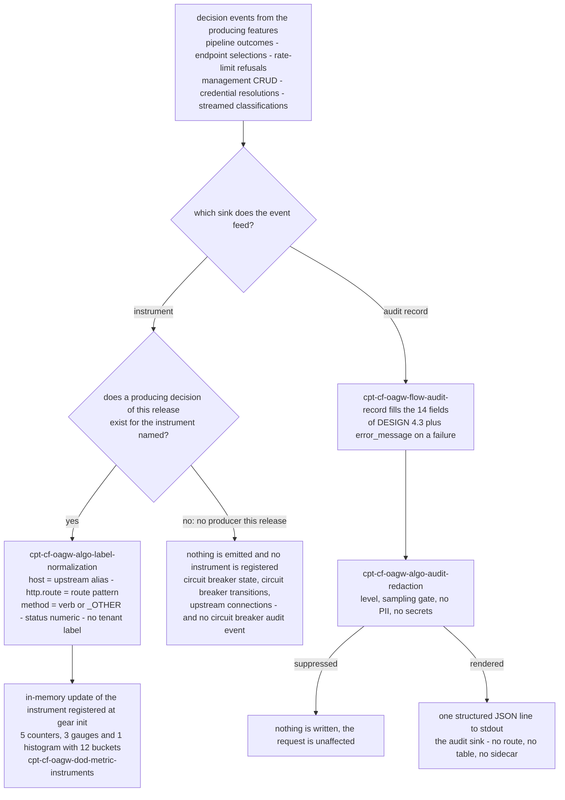

# Feature: Observability

<!-- toc -->

- [1. Feature Context](#1-feature-context)
  - [1.1 Overview](#11-overview)
  - [1.2 Purpose](#12-purpose)
  - [1.3 Actors](#13-actors)
  - [1.4 References](#14-references)
  - [1.5 Feature-Local Deviations](#15-feature-local-deviations)
- [2. Actor Flows (CDSL)](#2-actor-flows-cdsl)
  - [Metric Emission](#metric-emission)
  - [Audit Record](#audit-record)
- [3. Processes / Business Logic (CDSL)](#3-processes--business-logic-cdsl)
  - [Label Normalization](#label-normalization)
  - [Audit Redaction](#audit-redaction)
- [4. States (CDSL)](#4-states-cdsl)
  - [Audit Record State Machine](#audit-record-state-machine)
- [5. Definitions of Done](#5-definitions-of-done)
  - [Metric Instrument Set](#metric-instrument-set)
  - [Audit Record Format](#audit-record-format)
  - [Audit Event Coverage](#audit-event-coverage)
  - [Cardinality and Exposure](#cardinality-and-exposure)
- [6. Acceptance Criteria](#6-acceptance-criteria)

<!-- /toc -->

- [x] `p1` - **ID**: `cpt-cf-oagw-featstatus-observability-implemented`

<!-- reference to DECOMPOSITION entry -->
`p2` - `cpt-cf-oagw-feature-observability`

DECOMPOSITION entry 2.10 "Observability" orders this feature and the text of that entry is the authority for this document's scope: the Purpose, Scope and Out-of-scope bullets below are that entry's and are implemented without widening or narrowing them, and feature progress for this document is owned by the `featstatus` line above.
## 1. Feature Context

### 1.1 Overview

This feature implements the emission half of the `oagw` gear's telemetry: it instantiates the Prometheus metric instruments DESIGN §4.2 names, with the OTel-aligned label keys, the twelve request-duration histogram buckets and the cardinality rules of that section, and it renders the structured JSON audit records DESIGN §4.3 describes onto stdout, for control-plane and data-plane activity alike. It is the downstream leaf of `cpt-cf-oagw-feature-proxy-pipeline` in the DECOMPOSITION feature graph — the edge `proxy-pipeline → observability` is the only edge that reaches it — and it owns no decision that it counts. Every increment, every observation, every gauge update and every audit record is fed by a decision another feature already made and already recorded: the pipeline stages of `cpt-cf-oagw-flow-proxy-request`, the endpoint selections of `cpt-cf-oagw-algo-endpoint-selection`, the rate-limit refusals of `cpt-cf-oagw-flow-rate-limit-check`, the management CRUD of `cpt-cf-oagw-feature-management-api`, the credential resolutions of `cpt-cf-oagw-flow-auth-phase` and the streamed classifications of `cpt-cf-oagw-feature-streaming-proxy`. What this feature owns outright is the instrument set and its label normalization, the redaction and rendering of the audit record, the coverage of the audit events DESIGN §4.3 names, and the posture that exposure belongs to the platform telemetry stack per DECOMPOSITION correction 5.

The feature emits and never decides, and it declares and never re-declares. It registers no route, mounts no `/metrics` endpoint, adds no scrape authentication, adds no `OagwConfig` key, adds no table, no schema object and no persistence path, configures no distributed-tracing export, adds no correlation header, and starts no second process. The twelve instruments DESIGN §4.2 names are dispositioned exactly once in §1.5 — nine of them emitted from decisions that exist this release, three of them (`oagw_circuit_breaker_state{host}`, `oagw_circuit_breaker_transitions_total{host, from_state, to_state}` and `oagw_upstream_connections{host, state}`) recorded as not implemented because no feature of this release produces the decision they count, per DECOMPOSITION correction 4. The 14 audit fields DESIGN §4.3 names are carried as that section writes them, with `error_message` present only on a failed-request record as that section's "What is Logged" block states, and nothing of a request's body, query string, header set or credential material is ever present in a label or a field.

The diagram below is the single decision this feature makes for every event a producing feature hands it: which of the two sinks the event feeds, and whether the event has a producer at all. It is the only diagram in this document: the instrument set and its label keys live in the step list of `cpt-cf-oagw-flow-metric-emission`, the label arithmetic in the step list of `cpt-cf-oagw-algo-label-normalization`, the field set and its redaction in the step lists of `cpt-cf-oagw-flow-audit-record` and `cpt-cf-oagw-algo-audit-redaction`, the record lifecycle in the state machine of §4, and a second diagram would only duplicate what those step lists already encode.

### 1.2 Purpose

Emit the DESIGN's metrics and audit logs for control-plane and data-plane activity, as DECOMPOSITION entry 2.10 states. The feature exists so that the gear has exactly one emission path per instrument and one audit record shape: a producing feature decides and never emits, this feature emits and never decides, and the two halves are joined only by the decision events of §2. Its two derived implementation types are `MetricInstruments` — the nine instrument handles registered once at gear initialization on the toolkit OpenTelemetry SDK the host configures — and `AuditEvent` — the 14-field value object `cpt-cf-oagw-algo-audit-redaction` renders; neither is a DESIGN §3.1 aggregate, neither is persisted, neither is a table of `cpt-cf-oagw-db-schema` and neither is addressable through the management surface, which §1.5 records.

**Requirements**:

- [x] `p2` - `cpt-cf-oagw-nfr-observability` — the correlation-ID request logging that requirement names is the audit record of `cpt-cf-oagw-flow-audit-record` with `request_id` carrying the platform trace context, and the Prometheus metrics for request counts, latencies, error rates and rate-limit state are the instruments of `cpt-cf-oagw-dod-metric-instruments`; the requirement's "/metrics endpoint" exposure threshold is realized at the platform telemetry surface per DECOMPOSITION correction 5 and recorded as the §1.5 deviation, and its "100% of proxy requests logged" threshold is realized as 100% counted and 100% of failed requests logged, high-volume successes being sampled at the posture DESIGN §4.3 states, also recorded as a §1.5 deviation.

**Principles**: `p1` - `cpt-cf-oagw-principle-error-source` — emission never alters the distinction the principle and `cpt-cf-oagw-adr-error-source-distinction` fix: the `error_type` label and the `error_type` field carry the row name of the closed 22-row table of `cpt-cf-oagw-algo-error-mapping`, a passthrough upstream error is still an upstream outcome and a gateway-rendered refusal is still a gateway outcome, and no emission changes a status, a header or a body that a producing feature already fixed.

**Constraints**: `p1` - `cpt-cf-oagw-constraint-toolkit-deploy` — the instruments, their in-memory updates and the stdout audit sink live inside the single executable the constraint requires: no metrics forwarder process, no log-shipper sidecar, no extra deployment unit and no second binary, the metric sink being the process registry the platform telemetry stack scrapes and the log sink being the process's own stdout.

**Components**: `p1` - `cpt-cf-oagw-tech-dependencies` — the telemetry allocation of that element is what this feature implements: the metric instruments on the toolkit OpenTelemetry SDK the host configures, which the gear registers at initialization and never re-registers per request, and the structured audit logging on the gear's own stdout, ingested by the platform's centralized logging system as DESIGN §4.3 states. The element's table in DESIGN names no telemetry technology of its own, the SDK registration posture this feature applies coming from DECOMPOSITION correction 5, and this feature adds no row to that table. No dependency is added, no exporter is configured and no telemetry component is substituted.

**Sequences**: None — the entry declares none and this feature drives no stage of `cpt-cf-oagw-seq-proxy-flow`; it observes the stages the pipeline drives and the operations the control plane performs, and it is the caller of no other feature's flow.

**API**: None — the entry records none and this feature registers no route: no `/metrics` endpoint, no scrape authentication, no audit-query endpoint, no configuration surface of its own and no addition to the shells `cpt-cf-oagw-dod-gear-registration` registers, which §1.5 records.

**Data**: None — the entry records none and this feature creates no table, no schema object and no persistence path: `MetricInstruments` and `AuditEvent` are in-memory and process-local, an audit record lives only as long as the write that emits it, and `oagw_requests_in_flight{host}` is memory a restart resets, which §1.5 records per DECOMPOSITION correction 3.

### 1.3 Actors

| Actor | Role in Feature |
|-------|-----------------|
| `cpt-cf-oagw-actor-platform-operator` | Reads the emitted surface and owns the operational consequences of it: the instrument values the platform telemetry stack scrapes, the audit records the centralized logging system ingests, and the eleven label keys and fourteen fields that bound what can be queried. Owns no knob of this feature — the sampling posture and the DEBUG-disabled posture are feature-local constants, not configuration. |
| `cpt-cf-oagw-actor-app-developer` | Initiates the proxied requests whose outcomes are counted and whose successes and failures are rendered into audit records. Sees nothing of this feature on the wire: no emission alters a status, a header, a body or a latency the request experiences. |
| `cpt-cf-oagw-actor-tenant-admin` | Performs the management configuration changes whose audit records this feature renders, and owns correcting a configuration whose counted outcome is not the one intended. Is identified in a record by `tenant_id` and `principal_id` and never by anything read from a request body, a query string or a header value. |
| `cpt-cf-oagw-actor-upstream-service` | Produces the outcomes whose classifications feed `oagw_errors_total`, `oagw_upstream_available{host, endpoint}` and the failed-request audit records, and whose 401 rejection of injected credentials is the authentication-failure audit event of §1.5. Is never probed by this feature and is named in a record only as the `host` and `endpoint_host` label values the resolved configuration carries. |

Every step of both flows of §2 and both algorithms of §3 is performed by this feature on behalf of a producing feature rather than on behalf of an actor: the producers call this feature's steps as the last action of a decision they have already taken, and no actor invokes `cpt-cf-oagw-algo-label-normalization`, `cpt-cf-oagw-algo-audit-redaction` or the state machine of §4 directly, and no actor reaches the instruments or the audit sink except through the platform telemetry stack and the centralized logging system. The operator is the only actor who reads what this feature emits, and the only actor whose reading this feature's field and label vocabulary bounds.

### 1.4 References

- **PRD**: [PRD.md](../PRD.md) — `cpt-cf-oagw-nfr-observability` (log all proxy requests with correlation IDs and expose Prometheus metrics for request counts, latencies, error rates and rate-limit state, with the "100% of proxy requests logged with correlation ID" and "metrics scraped at /metrics endpoint" thresholds carried per §1.5), `cpt-cf-oagw-nfr-low-latency` (the `<10ms` p95 added-latency budget owned by `cpt-cf-oagw-feature-proxy-pipeline`, which this feature's in-memory emission never spends: no I/O, no buffer and no lock contention is added to a request path), `cpt-cf-oagw-nfr-credential-isolation` (the no-secrets half of the rule applied to every label and field), the use cases `cpt-cf-oagw-usecase-proxy-request` (whose main-flow outcomes are the events the request instruments count) and `cpt-cf-oagw-usecase-configure-upstream` and `cpt-cf-oagw-usecase-configure-route` (whose create, replace and delete decisions are the configuration-change audit events), and the actors `cpt-cf-oagw-actor-platform-operator`, `cpt-cf-oagw-actor-app-developer`, `cpt-cf-oagw-actor-tenant-admin` and `cpt-cf-oagw-actor-upstream-service`
- **Design**: [DESIGN.md](../DESIGN.md) — §4.2 "Metrics and Observability" (the twelve instrument names with their label keys, the `explicit_header`/`round_robin`/`default` enumeration of `selection_method`, the `idle`/`active`/`max` enumeration of the `state` label of the unimplemented `oagw_upstream_connections{host, state}`, the 0=down/1=up values of `oagw_upstream_available{host, endpoint}`, the 0.0 to 1.0 range of `oagw_rate_limit_usage_ratio{host, path}`, the cardinality-management paragraph — no tenant labels, `http.route` the normalized route match pattern, the method normalized to a standard verb or `_OTHER`, the numeric status, status-class queries expressed at query time by regex on the numeric code, the shared label-key vocabulary with the inbound API Gateway and `host` carrying the upstream alias — and the histogram bucket list `[0.001, 0.005, 0.01, 0.025, 0.05, 0.1, 0.25, 0.5, 1.0, 2.5, 5.0, 10.0]`), §4.3 "Audit Logging" (the 14 fields, the "No PII" and "No secrets" rules with their allowlist exception, the high-frequency sampling posture with its 1/100 example, the "What is Logged" block with its five event classes, and the log-level table with its DEBUG-disabled-in-production note), `cpt-cf-oagw-tech-dependencies` (whose table in DESIGN names no telemetry technology; the toolkit OpenTelemetry SDK posture this feature instantiates the instruments under comes from DECOMPOSITION correction 5, and this feature adds no row to that table), `cpt-cf-oagw-interface-api` (the traceability row that maps `cpt-cf-oagw-nfr-observability` onto the interface component this feature emits for), the Gear Structure section (which names no observability directory, so this feature adds none), the §2.1 credential-isolation principle and the §4.3 No-PII and no-secrets rules the redaction carries, and the §4.7 future-work list that defers the circuit breaker
- **Decomposition**: [DECOMPOSITION.md](../DECOMPOSITION.md) — entry 2.10 "Observability" and the "Spec corrections applied" block in its overview (corrections 1, 3, 4 and 5 apply to this feature, as does the "Phase numbering precedence" paragraph)
- **ADR**: [ADR/0001-request-routing.md](../ADR/0001-request-routing.md) (`cpt-cf-oagw-adr-request-routing`) — the "Audit Log JSON Format" block and its canonical 14-field example, which is the record shape this feature renders and never re-declares; [ADR/0007-error-source-distinction.md](../ADR/0007-error-source-distinction.md) (`cpt-cf-oagw-adr-error-source-distinction`) — the header contract emission never alters; [ADR/0006-state-management.md](../ADR/0006-state-management.md) (`cpt-cf-oagw-adr-state-management`) — the data-plane request flow position that places the rate-limit check after the auth plugin and before the guard and transform plugins, the stage order the `phase` label names; [ADR/0003-rate-limiting.md](../ADR/0003-rate-limiting.md) (`cpt-cf-oagw-adr-rate-limiting`) — the token level the usage-ratio gauge observes and the enforcement point the limiter's counter scope keys
- **Dependencies**:
  - [ ] `p2` - `cpt-cf-oagw-feature-proxy-pipeline` — the direct dependency DECOMPOSITION entry 2.10 declares in its "Depends On" line (the edge `proxy-pipeline → observability` in the feature graph, with the dependency rationale line "metrics and audit records are emitted from the proxy pipeline stages"): this feature is the emitter of what that pipeline decides, and it derives no decision of its own. It consumes the arrival instant `inst-pf-01` records, the stage order of `cpt-cf-oagw-flow-proxy-request` as the `phase` label vocabulary, the selection method `inst-es-17` records, the mapped rows of `cpt-cf-oagw-algo-error-mapping` as the `error_type` vocabulary and the endpoint outcomes as the availability gauge's input.
  - Reached transitively through that chain rather than declared directly: `cpt-cf-oagw-feature-rate-limiting` (the refusal and the token level that feed the two rate-limit instruments, and the WARN `Retry-After` log point DESIGN §4.3 assigns), `cpt-cf-oagw-feature-plugin-chain` (the credential-resolution failures of `cpt-cf-oagw-flow-auth-phase` that feed the authentication-failure audit events), `cpt-cf-oagw-feature-management-api` (the create, replace and delete decisions that feed the configuration-change audit events, with `cpt-cf-oagw-algo-inmemory-repository` as the store they mutate), `cpt-cf-oagw-feature-hierarchical-config` (the effective limit the usage ratio is taken over, computed by `cpt-cf-oagw-algo-effective-merge`), `cpt-cf-oagw-feature-domain-model` (the `Upstream`, `Route` and `Endpoint` value objects whose identifiers become label values) and `cpt-cf-oagw-feature-alias-resolution` (the normalized alias that becomes the `host` label value). `cpt-cf-oagw-feature-gear-wiring` is reached through the same graph rather than depended on: it owns the registered shells, the closed `OagwConfig` key set of `cpt-cf-oagw-algo-config-load` and the closed 22-row mapping table this feature reads and never extends. `cpt-cf-oagw-feature-streaming-proxy` is reached through no edge of that graph at all, its DECOMPOSITION leaf declaring it independent of this feature, and its streamed lifecycle events and the failure classifications of `cpt-cf-oagw-algo-stream-failure-classification` arrive as producer events like any other passthrough's.
- **Reverse dependents**: none — entry 2.10 is the last entry of the DECOMPOSITION feature graph and no feature's "Depends On" line names this one, which is what makes this feature a pure leaf: every other feature of the gear names it as the owner of emission, and none of them may emit an instrument, render an audit record, add an instrument, add an audit field, add a label key or mount an exposure surface. A producer that needs a new counter or a new log point has this document as the only place to record it.
- **API and data declarations**: API: None and Data: None, as the DECOMPOSITION entry records them and as §1.2 and the Touches lines of §5 carry.

### 1.5 Feature-Local Deviations

Deviations from the supplied spec/platform baseline, recorded per the shared-baseline policy.

**Conformance (not a deviation)** — the closed disposition of every instrument name DESIGN §4.2 lists, recorded once here so that no name is left unassigned and no name is invented: nine instruments are emitted, `oagw_requests_total{host, http.request.method, http.route, http.response.status_code}`, `oagw_request_duration_seconds{host, http.route, phase}`, `oagw_requests_in_flight{host}`, `oagw_errors_total{host, http.route, error_type}`, `oagw_rate_limit_exceeded_total{host, path}`, `oagw_rate_limit_usage_ratio{host, path}`, `oagw_routing_target_host_used{upstream_id, endpoint_host}`, `oagw_routing_endpoint_selected{upstream_id, endpoint_host, selection_method}` and `oagw_upstream_available{host, endpoint}`, each fed by a decision another feature records. Three are not implemented this release: `oagw_circuit_breaker_state{host}`, `oagw_circuit_breaker_transitions_total{host, from_state, to_state}` and `oagw_upstream_connections{host, state}` — no feature of this release produces a circuit-breaker state transition, DECOMPOSITION correction 4 having deferred the mechanism with the `CircuitBreakerOpen` row of the closed table staying reserved and unreachable, and no feature records a per-state connection count as a decision, the streaming transport sitting behind the `DataPlaneServiceImpl` bridge rather than exposing a pool-state decision. The same disposition applies to DESIGN §4.3's "Circuit breaker events" log point: it has no producer this release, so no such audit event is emitted.
**Rationale** — DECOMPOSITION entry 2.10 scopes "Prometheus metric instruments with the DESIGN 4.2 names" without stating which of them have producers, and the corrections block defers the circuit breaker; recording the three names as not implemented rather than instantiating them at zero keeps a reader from inferring a capability no feature delivers, and keeps a placeholder gauge from standing in for a mechanism that does not exist.
**Review owner**: `cf-generate-author-senior via cf-write-docs review loop`

**Conformance (not a deviation)** — the ownership split this feature sits at the end of: `cpt-cf-oagw-feature-proxy-pipeline` owns the decisions behind `oagw_requests_total`, `oagw_request_duration_seconds`, `oagw_requests_in_flight`, `oagw_errors_total`, the two routing instruments and `oagw_upstream_available`, and names this feature as the emitter at its line 191; `cpt-cf-oagw-feature-rate-limiting` owns the decisions behind `oagw_rate_limit_exceeded_total` and `oagw_rate_limit_usage_ratio` and names this feature as the emitter at its line 160; `cpt-cf-oagw-feature-management-api` owns the configuration-change decisions and names this feature as the owner of both audit and metric emission at its line 181; `cpt-cf-oagw-feature-plugin-chain` names this feature as the owner of emission for the plugin stages at its line 166; `cpt-cf-oagw-feature-streaming-proxy` names this feature as the owner of emission for the streamed stages at its line 155 and emits nothing itself; and `cpt-cf-oagw-feature-gear-wiring` states at its line 102 that no gateway or startup path writes audit records and that this feature owns audit-log emission. This feature owns the emission of all of them and the decision of none. Three producer events stay distinct at this boundary, so one request never reaches an instrument twice through them: a rate-limit refusal arrives as the pipeline's request-outcome event, which `inst-ob-03` and `inst-ob-07` consume, and as the limiter's own refusal event and token-level event, which `inst-ob-11` and `inst-ob-12` consume, so `oagw_errors_total` is fed by the request-outcome event alone and the two rate-limit instruments by the limiter's two. `oagw_errors_total` counts the failures the pipeline renders through the closed 22-row table; a passed-through upstream error status is not counted by it and is visible instead in the numeric `http.response.status_code` label of `oagw_requests_total`, per the query-time status-class rule of DESIGN §4.2's cardinality-management paragraph. The configuration-change decisions of `cpt-cf-oagw-feature-management-api` are decisions on the three resources that surface is addressable on — an upstream, a route or a plugin — and the endpoint, plugin-binding and CORS material a record of such a decision names is the configuration that decision carries, not a fourth or fifth surface of its own.
**Rationale** — DECOMPOSITION assigns emission to entry 2.10 and stage-wise decisions to the features that own the stages, and five sibling documents already state the same split from the producer side; recording it from the emitter side keeps a second emission path from appearing beside any producer's decisions.
**Review owner**: `cf-generate-author-senior via cf-write-docs review loop`

**Deviation** — the gear exposes no `/metrics` endpoint and adds no scrape authentication, and this feature registers no route of any kind. DESIGN §4.2 opens with "Prometheus metrics at `/metrics` (admin-only)", which read literally would make `oagw` serve its own metrics surface behind an administrator gate. The exposure recorded here is the platform telemetry stack per DECOMPOSITION correction 5: the instruments are registered on the toolkit OpenTelemetry SDK the host configures, their values become visible through the process registry that stack scrapes, and the scrape authentication, the scrape path and the admin gating are the platform's concern and not this gear's. `cpt-cf-oagw-feature-gear-wiring` records the same disposition at its line 102 for the shell surface, and neither feature registers a scrape route.
**Rationale** — DECOMPOSITION correction 5 states of the gear that "it does not mount its own `/metrics` route" and entry 2.10 lists "`/metrics` endpoint exposure and scrape auth (platform telemetry surface, correction 5)" in its out-of-scope bullets; recording the deviation keeps DESIGN's admin-only wording from being implemented as a route that no upstream document assigns to this gear.
**Review owner**: `cf-generate-author-senior via cf-write-docs review loop`

**Deviation** — the PRD's "100% of proxy requests logged with correlation ID" threshold is realized as 100% counted and 100% of failed requests logged: `oagw_requests_total` and `oagw_request_duration_seconds` record every request without exception, and every failed request, every refused request, every timeout and every configuration change is rendered into an audit record every time it happens, while a successful request on a high-volume route is sampled at the 1/100 posture DESIGN §4.3 itself states. The PRD threshold and the DESIGN sampling posture cannot both hold verbatim for successes, and the reading recorded here is the one DESIGN's own "High-frequency sampling" paragraph carries.
**Rationale** — DECOMPOSITION entry 2.10 scopes the audit fields and the DESIGN §4.3 behaviour rather than the PRD threshold, and a 100% record rate on a high-volume successful route is exactly the log volume the sampling posture exists to prevent; recording the reconciliation keeps `cpt-cf-oagw-nfr-observability` assertable as 100% counted plus 100% of failures logged instead of leaving the two statements in silent conflict.
**Review owner**: `cf-generate-author-senior via cf-write-docs review loop`

**Conformance (not a deviation)** — the feature owns no `OagwConfig` key. The closed key set `cpt-cf-oagw-feature-gear-wiring` fixes — `proxy_timeout_secs`, `allow_http_upstream`, `ssrf_policy.enabled`, the 100 MB body limit, `token_cache_ttl_secs` and `token_cache_capacity` — is unchanged by this feature, and `cpt-cf-oagw-algo-config-load` would reject any key it added. The sampling ratio of the successful-request class, the DEBUG-disabled-in-production posture, the rate limit applied to the authentication-failure class and every threshold this feature applies are feature-local constants of this document and of the implementation, not configuration, and they are not read from `oagw.config`, not defaulted there and not surfaced to the management API.
**Rationale** — DECOMPOSITION entry 2.10 declares no configuration surface, the API row of the entry is "None", and the mandatory contract of the gear is that the key set is closed; making the posture a constant keeps an operator-facing knob from appearing that no upstream document defines and keeps `cpt-cf-oagw-algo-config-load`'s unknown-key rejection intact.
**Review owner**: `cf-generate-author-senior via cf-write-docs review loop`

**Conformance (not a deviation)** — the redaction rules, applied to every label value and every field value: a request body, a response body, a query string, a query parameter, a header value and credential material never appear in an instrument label or an audit field, and no substitute value is emitted for a dropped one. API keys, tokens, `Authorization` and `Cookie` values, `cred://` references and resolved secret material are absent from every record, which is DESIGN §4.3's "No PII / No secrets" block and `cpt-cf-oagw-principle-cred-isolation` applied at the emission boundary. The one header-shaped value any record carries is the request-identifier context the platform trace context arrives with at `inst-pf-01`; the redaction allowlist is this feature's own and contains only that request-identifier context, which is the value DESIGN §4.3's "(except allowlisted)" clause admits. `error_message` on a failed request carries the mapped row's `title` and `detail` of the closed table and never the occurrence content that triggered it, so two occurrences of the same failure render identical `error_message` values.
**Rationale** — DECOMPOSITION entry 2.10 scopes "no PII, no secrets, no bodies/headers" onto the audit fields and the producers of the gear already hold the same rule at their own boundaries; stating it once at the emission boundary keeps the property testable from §6 instead of distributed across five features.
**Review owner**: `cf-generate-author-senior via cf-write-docs review loop`

**Conformance (not a deviation)** — the cardinality rules of DESIGN §4.2's "Cardinality management" paragraph, applied as written: no tenant label exists on any instrument, no tenant identifier, tenant name, subject identifier or principal identifier entering any label set; `http.route` carries the normalized route match pattern of the route the pipeline matched and never the raw request path, so a client cannot widen the label set by varying its path suffix; `http.request.method` carries a standard verb or `_OTHER`; `http.response.status_code` carries the numeric status — the numeric upstream status on a passthrough and the numeric gateway status of the mapped row on a gateway-rendered outcome, DESIGN's wording in that paragraph naming only the passthrough case — with status-class rates expressed at query time by regex on the numeric code and never pre-aggregated into a label; and `host` remains the OAGW-specific label carrying the upstream alias, so the label-key vocabulary stays aligned with the inbound API Gateway and both gateways share dashboards. The two rate-limit instruments carry `path` as the same normalized route pattern, so no instrument's label set is wider than the request counters'.
**Rationale** — DESIGN states the four rules and the query-time aggregation in one paragraph, and DECOMPOSITION entry 2.10 repeats them as a scope bullet with "no tenant labels" appended; carrying them verbatim into `cpt-cf-oagw-algo-label-normalization` keeps an unbounded label value — a raw path, a tenant identifier, a free-form error string — from becoming a memory-exhaustion vector in the process registry.
**Review owner**: `cf-generate-author-senior via cf-write-docs review loop`

**Conformance (not a deviation)** — correlation is the platform trace context and nothing else: `request_id` in an audit record is the correlation identifier the security context arrives with at `inst-pf-01`, its propagation and its relationship to the platform's trace identifiers being the platform's concern, and this feature adds no correlation header to any outbound request, consistent with `cpt-cf-oagw-feature-proxy-pipeline`'s line 204. Distributed tracing export configuration is out of scope per DECOMPOSITION entry 2.10, so no exporter, no sampler, no span processor and no trace pipeline is configured here, and no instrument or record carries a span identifier of its own making.
**Rationale** — DECOMPOSITION entry 2.10 lists "Distributed tracing export configuration" in its out-of-scope bullets, and the traceability of `cpt-cf-oagw-nfr-observability` is satisfied by the correlation identifier the records already carry; recording the absence keeps a tracing exporter from being read as a missing deliverable of this feature.
**Review owner**: `cf-generate-author-senior via cf-write-docs review loop`

**Conformance (not a deviation)** — the single executable: the instruments, their in-memory updates, the process registry the platform scrapes and the stdout audit sink all live inside the one executable `cpt-cf-oagw-constraint-toolkit-deploy` requires. No metrics forwarder process, no log-shipper sidecar, no extra deployment unit, no second binary and no background worker is started, no port is opened and no connection is made to a telemetry backend by this feature; the metric sink is the registry the platform scrapes and the log sink is the process's own stdout, ingested by the centralized logging system DESIGN §4.3 names.
**Rationale** — DECOMPOSITION entry 2.10 covers `cpt-cf-oagw-constraint-toolkit-deploy` and DESIGN §4.3 names stdout as the audit sink, and a shipper or a forwarder would reintroduce a deployment unit that neither the constraint nor the gear skeleton of `cpt-cf-oagw-feature-gear-wiring` has a place for.
**Review owner**: `cf-generate-author-senior via cf-write-docs review loop`

**Conformance (not a deviation)** — everything this feature holds is in memory, per DECOMPOSITION correction 3: no table, no schema object, no repository trait and no persistence path exists for a metric or an audit record, `oagw_requests_in_flight{host}` is process-local memory that a restart resets to zero, the sampling counters are process-local, an `AuditEvent` lives only as long as the write that emits it, and the instrument values begin each process at zero rather than being restored from anywhere. The in-flight gauge is process-local in its counting as well as in its storage: it is entered only at the outbound issuance, so a request the pipeline refuses before that issuance — an authentication failure, a rate-limit refusal, a scheme or route refusal — never enters its count and is settled without a decrement of it.
**Rationale** — DECOMPOSITION correction 3 replaces the storage tier with in-memory stores and entry 2.10 records "Data: None", and a metric or audit store would recreate exactly the state layer the correction removes; stating the restart loss keeps the counters' meaning — per-process, not cumulative — visible instead of implicit.
**Review owner**: `cf-generate-author-senior via cf-write-docs review loop`

**Conformance (not a deviation)** — the base path posture: this feature registers no route and therefore serves no path, and it adds nothing to the shells `cpt-cf-oagw-dod-gear-registration` registers. Every path this feature writes into an audit record's `path` field is the gear-relative `/oagw/v1/...` path the request arrived on, in the form DECOMPOSITION correction 1 fixes, and the `/api/oagw/v1/...` operator-gateway-prefixed alias never appears in a record, a label or a log line this feature writes.
**Rationale** — DECOMPOSITION correction 1 states that all oagw routes are registered gear-relative at `/oagw/v1/...`, and a record that echoed a prefixed path would disagree with the path the producing features served; recording the posture here keeps the correction applied to the emission boundary as well as to the route surfaces.
**Review owner**: `cf-generate-author-senior via cf-write-docs review loop`

**Conformance (not a deviation)** — the `phase` label vocabulary of `oagw_request_duration_seconds{host, http.route, phase}` is the stage order of `cpt-cf-oagw-flow-proxy-request` as that flow's step list records the stages: classification and preflight detection, config resolution, route matching, endpoint selection, the actual-request CORS check, header processing and validation, the plugin chain with the rate-limit check at its `cpt-cf-oagw-adr-state-management` position, the scheme and SSRF policy, the outbound call, and response passthrough. The streamed stages arrive through the same labels, the SSE and WebSocket lifecycles of `cpt-cf-oagw-feature-streaming-proxy` being observed under the phase names of the stages that perform them, so no second phase vocabulary exists for streamed traffic. The error mapping that closes the pipeline's stage list is observed under the `phase` of the stage that produced the mapped row, no extra `phase` value being introduced for it.
**Rationale** — DESIGN §4.2 names the `phase` label without enumerating its values, DECOMPOSITION entry 2.8 fixes the stage list, and `cpt-cf-oagw-feature-streaming-proxy` records that its contributions arrive through the same instruments; taking the pipeline's stage names as the vocabulary keeps the histogram attributable to a stage a reader can find in one document and keeps a per-stage vocabulary from diverging between features.
**Review owner**: `cf-generate-author-senior via cf-write-docs review loop`

**Conformance (not a deviation)** — the granularity of the duration histogram and of `duration_ms`: `oagw_request_duration_seconds` records one observation per completed pipeline stage under that stage's `phase` label, so a request that passes through five stages contributes five observations, while the audit record's `duration_ms` is the whole-request duration measured from the arrival instant `inst-pf-01` records to the response being handed back. The two measures are different views of one request and neither is derived from the other at emission time.
**Rationale** — DESIGN §4.2 places `phase` on the duration histogram and §4.3 places a single `duration_ms` on the audit record, so the histogram is stage-scoped and the record is request-scoped; recording the reading keeps the histogram's observation count from being read as one-per-request and the record's duration from being read as stage time.
**Review owner**: `cf-generate-author-senior via cf-write-docs review loop`

**Conformance (not a deviation)** — the availability gauge is derived from outcomes and not from probing: `oagw_upstream_available{host, endpoint}` is set to 0 when the pipeline classifies an exchange against that endpoint as `LinkUnavailable` or `ConnectionTimeout` and to 1 when an exchange against it completes, and no health check, no synthetic request and no scheduled probe is configured or sent by this feature. A gauge that reads 1 is therefore a statement about the most recent exchange and not a statement about reachability at scrape time, and the gauge carries no timestamp of its own. The gauge is registered at 0, so a 0 read before the first exchange against that endpoint is the absence of an exchange and not an observed failure.
**Rationale** — DESIGN §4.2 names the gauge and its 0=down/1=up values without naming a probe, DECOMPOSITION entry 2.10 declares no health-check scope, and `cpt-cf-oagw-feature-proxy-pipeline` owns every upstream exchange; deriving the gauge from those outcomes keeps a probe path from appearing that no upstream document assigns to this gear.
**Review owner**: `cf-generate-author-senior via cf-write-docs review loop`

**Conformance (not a deviation)** — the authentication-failure audit event and its two producers: the credential-resolution failures `cpt-cf-oagw-flow-auth-phase` of `cpt-cf-oagw-feature-plugin-chain` maps onto its rows — `PluginNotFound`, `SecretNotFound` and `LinkUnavailable` — and the upstream's rejection of the credentials that phase injected, which reaches the caller as the passed-through 401 `AuthenticationFailed` response that feature records. An inbound caller the platform `toolkit-auth` middleware refuses never reaches an oagw handler at all, so that refusal is answered and recorded by the platform surface that refused it and is not an event of this feature, which is what keeps DECOMPOSITION entry 2.10's "authentication failures ... emitted from the control-plane and proxy paths" implemented without this feature claiming the platform's own records.
**Rationale** — DESIGN §4.3 lists "Auth failures: Failed authentication attempts (rate limited to prevent log flooding)" and `cpt-cf-oagw-feature-plugin-chain` records the 401 row as the upstream-credential path it owns; recording both producers and the platform boundary keeps an unauthenticated request from being counted twice and keeps the platform's authentication records from being duplicated into the gear's.
**Review owner**: `cf-generate-author-senior via cf-write-docs review loop`

**Conformance (not a deviation)** — the field set of the audit record is closed: the base record carries exactly the 14 fields DESIGN §4.3 names — `timestamp`, `level`, `event`, `request_id`, `tenant_id`, `principal_id`, `host`, `path`, `method`, `status`, `duration_ms`, `request_size`, `response_size`, `error_type` — and the one field DESIGN §4.3's "What is Logged" block adds for a failed request, `error_message`, which carries the mapped row's `title` and `detail`. "The mapped row's `title` and `detail`" is the row's own fixed text — the columns the closed 22-row table of `cpt-cf-oagw-algo-error-mapping` carries as that row's meaning — and never the occurrence-specific `detail` member of the problem+json body `cpt-cf-oagw-flow-error-response` renders, that member belonging to the response the caller sees and not to the record this feature writes. No field is added for a configuration change, for a streamed request, for a rate-limit refusal or for any other event class, and no field is renamed, so the canonical example of `cpt-cf-oagw-adr-request-routing`'s "Audit Log JSON Format" block remains a valid record of this feature's output: that example's field set and JSON form remain the form of this feature's output, its `path` value being carried in the gear-relative form DECOMPOSITION correction 1 fixes as §1.5 records.
**Rationale** — DECOMPOSITION entry 2.10 enumerates the 14 fields as the scope of the audit log and the ADR fixes their form, while DESIGN §4.3 names `error_message` only on the failed-request line; recording the closure keeps a producer from appending a fifteenth field for its own event class and keeps the record parseable by the same ingester across all surfaces of the gear.
**Review owner**: `cf-generate-author-senior via cf-write-docs review loop`

**Conformance (not a deviation)** — emission never fails and never alters a request: no emission path of this feature has an error branch that reaches a caller, no emission holds a lock a request path waits on, no emission performs I/O on a request path, and the status, headers, body and `X-OAGW-Error-Source` value of every response are the producing feature's unchanged. The `error_type` label and field are the row name of the closed 22-row table of `cpt-cf-oagw-algo-error-mapping`, so a gateway-classified failure and an upstream-classified failure remain distinguishable in the metrics exactly as `cpt-cf-oagw-adr-error-source-distinction` and `cpt-cf-oagw-principle-error-source` require, and no emission re-maps, re-classifies or re-renders any of them.
**Rationale** — DECOMPOSITION entry 2.10 covers `cpt-cf-oagw-principle-error-source` and this feature sits downstream of every decision the principle governs; recording the non-interference property keeps the emission path from being read as a place where an outcome could be changed, and keeps the header contract assertable in §6 against the emission path.
**Review owner**: `cf-generate-author-senior via cf-write-docs review loop`

**Out of scope** — `/metrics` endpoint exposure, scrape authentication and any metrics route of this gear's own, which are the platform telemetry surface per DECOMPOSITION correction 5; distributed tracing export configuration, per the same entry's out-of-scope bullets, together with any exporter, sampler or span pipeline; the circuit-breaker instruments `oagw_circuit_breaker_state{host}`, `oagw_circuit_breaker_transitions_total{host, from_state, to_state}` and `oagw_upstream_connections{host, state}`, and the circuit-breaker audit event, deferred with the mechanism per DECOMPOSITION correction 4; every decision the instruments count, owned by `cpt-cf-oagw-feature-proxy-pipeline`, `cpt-cf-oagw-feature-rate-limiting`, `cpt-cf-oagw-feature-plugin-chain`, `cpt-cf-oagw-feature-management-api` and `cpt-cf-oagw-feature-streaming-proxy`; the closed 22-row mapping table whose row names are the `error_type` vocabulary, owned by `cpt-cf-oagw-feature-gear-wiring`; the closed `OagwConfig` key set and the registered shells, owned by the same feature; the problem+json rendering a caller sees, owned by `cpt-cf-oagw-flow-error-response` of the gear-wiring feature; the persist-time validation of the resources whose identifiers become label values, owned by `cpt-cf-oagw-feature-domain-model`; the computation of the effective limit the usage ratio is taken over, owned by `cpt-cf-oagw-feature-hierarchical-config`; any SQL table, schema object or persistence path, per DECOMPOSITION correction 3; and any log volume, retention or alerting policy, which the platform's centralized logging system owns.
**Rationale** — DECOMPOSITION entry 2.10 lists the first two in its out-of-scope bullets, correction 4 defers the circuit breaker, and the stage-wise ownership rule and entries 2.1, 2.2, 2.4, 2.5, 2.6, 2.7, 2.8 and 2.9 place the rest with the features that own them; none of them is implemented by this feature and none of them is re-declared by it.
**Review owner**: `cf-generate-author-senior via cf-write-docs review loop`

**Not applicable because** — the remaining checklist areas have no build object in this feature, and where a posture is declared below it is stated rather than built:

- **Data model and persistence** — the feature creates no table, no schema object and no repository trait: `MetricInstruments` is a set of nine handles on the toolkit OpenTelemetry SDK registered once at initialization and `AuditEvent` is a value that lives for the duration of one write, and neither is a table of `cpt-cf-oagw-db-schema` or a row of anything. `cpt-cf-oagw-db-schema` is honoured as the schema contract by the stores behind the configuration this feature reads identifiers from, and this feature writes to none of them.
- **Reliability and failure behaviour** — the feature has no failure path that reaches a caller: a metric update cannot fail, a suppressed record is suppressed, a failed stdout write suppresses its record and the request that produced the event is already complete or in flight elsewhere. There is no retry of a failed write, no buffer to drain and no queue to drain on shutdown, and a process restart loses the gauge values and the sampling counters, which §1.5 states and this release accepts.
- **Security** — credential isolation holds at the emission boundary: this feature never resolves a `cred://` reference, never sees secret material, never reads a header for its value and never writes a body, a query string, a header value or a credential into a label or a field. The injection classes have nothing to inject into, because no SQL is executed, no HTML is rendered and no shell is invoked, and the only structured output is the one JSON line per record whose field set §1.5 closes.
- **Correlation and trace propagation** — the feature owns no correlation identifier and propagates nothing: `request_id` is the platform trace context the request arrives with at `inst-pf-01`, no tracing export is configured, and no correlation header is added to any outbound request, which §1.5 records and which matches `cpt-cf-oagw-feature-proxy-pipeline`'s own line 204.
- **Configuration surface** — the feature owns no `OagwConfig` key and reads none: the sampling ratio, the DEBUG posture and the authentication-failure rate limit are feature-local constants, and the keys `cpt-cf-oagw-algo-config-load` accepts are the closed set of `cpt-cf-oagw-feature-gear-wiring` unchanged.
- **Internationalisation and accessibility** — the feature exposes no user interface and no actor-facing text of its own; the only wording it writes is the `title` and `detail` of a mapped row it copies into `error_message` verbatim, and no wording of its own is authored here.
- **Regulatory compliance** — the records carry identifiers, statuses, durations and sizes rather than content, and no data subject to a compliance regime crosses this feature: no body, no query string, no header value and no credential material is written, and the tenant identifier in a record is the identifier the security context already carried.
- **Rollout and rollback** — the feature has no deployable unit, no migration and no feature flag of its own: it is the emission path of the single executable, registered at initialization, and removing it removes the visibility rather than the behaviour, every producing feature continuing to decide exactly as before.
- **Performance** — the feature adds no budget of its own and consumes none of another feature's: every update is an in-memory increment, set or observation on a handle registered once, the histogram's twelve buckets are fixed at registration, and the one I/O action the feature performs — the stdout write of an audit record — happens after the response is fixed and never on the response path. No upstream document sets a telemetry budget for this gear, so none is asserted here.
- **Usability** — the observable surface is the two sinks the platform already reads, and the vocabulary that bounds them is closed and stated in this document: eleven label keys across the nine instruments and fourteen fields plus `error_message` across the records, so an operator can build a dashboard or a query without reading the producing features.
- **Test targets** — the unit-testable boundaries are `cpt-cf-oagw-algo-label-normalization`, `cpt-cf-oagw-algo-audit-redaction` and the state machine of §4, none of which performs I/O; the emission of the instruments and of the records is integration-testable against a stub upstream on the proxy endpoint and against the in-memory configuration of the domain-model feature, with the sink captured rather than scraped; and the absence of the three unimplemented instruments is checkable by inspecting the registry after a full request exercise, which is why the disposition is stated as a §6 criterion rather than as a performance property.

## 2. Actor Flows (CDSL)

Interactions that start with an actor and describe the end-to-end flow. Neither flow is one an actor reaches directly: `cpt-cf-oagw-flow-metric-emission` and `cpt-cf-oagw-flow-audit-record` are entered only by a producing feature as the last action of a decision it has already taken, the proxy pipeline being the caller of every data-plane step and the management surface the caller of every control-plane step. This feature is the caller of no other feature's flow, and it drives no stage of `cpt-cf-oagw-seq-proxy-flow`.

**Use cases**: `p1` - `cpt-cf-oagw-usecase-proxy-request` — its main-flow outcomes are the events `cpt-cf-oagw-flow-metric-emission` counts and the records `cpt-cf-oagw-flow-audit-record` renders, its "Upstream not found", "Upstream disabled", "Auth plugin fails", "Rate limit exceeded" and "Upstream timeout" alternative flows arriving as the same event classes as a success, differing only in the mapped row and the level; `p1` - `cpt-cf-oagw-usecase-configure-upstream` and `p1` - `cpt-cf-oagw-usecase-configure-route` — their create, replace and delete decisions are the configuration-change audit events of `cpt-cf-oagw-flow-audit-record`, and no instrument counts them, the management surface having no instrument of its own in DESIGN §4.2.

### Metric Emission

- [x] `p1` - **ID**: `cpt-cf-oagw-flow-metric-emission`

**Actor**: `cpt-cf-oagw-actor-app-developer`

**Success Scenarios**:

- A request that reaches any outcome of the pipeline leaves exactly one increment in `oagw_requests_total{host, http.request.method, http.route, http.response.status_code}`, at least one observation in `oagw_request_duration_seconds{host, http.route, phase}` and a settled `oagw_requests_in_flight{host}` value, all under the label set `cpt-cf-oagw-algo-label-normalization` produced and none of them under a label set the request could widen.
- Every endpoint selection the pipeline makes is visible in `oagw_routing_endpoint_selected{upstream_id, endpoint_host, selection_method}` with the method `inst-es-17` recorded, and a selection that consumed an `X-OAGW-Target-Host` value is additionally visible in `oagw_routing_target_host_used{upstream_id, endpoint_host}`.
- Every rate-limit refusal the limiter renders is visible in `oagw_rate_limit_exceeded_total{host, path}`, and the level the check left behind is visible in `oagw_rate_limit_usage_ratio{host, path}` within its 0.0 to 1.0 range.
- An endpoint the pipeline could not exchange with is visible as 0 in `oagw_upstream_available{host, endpoint}` without any probe having been sent, and returns to 1 on the next completed exchange against it.
- The instruments exist before the first request is served, being registered once at gear initialization, so the first counted request is never a dropped one and no instrument is created, looked up or registered per request.

**Error Scenarios**:

- A refusal the pipeline rendered through a row of the closed 22-row table of `cpt-cf-oagw-algo-error-mapping` increments `oagw_errors_total{host, http.route, error_type}` once for that request with the row's name in `error_type`, and `oagw_errors_total` is incremented at most once for the same request however many producer events that request reaches this feature through.
- An aborted stream increments `oagw_errors_total` with `error_type` `StreamAborted` under the same label keys as any other failure, the streamed classification of `cpt-cf-oagw-algo-stream-failure-classification` arriving as an ordinary mapped row.
- No emission path can fail, delay or alter the request that produced the event: a metric update has no error branch that reaches a caller, and nothing is buffered, queued, batched or written to a file.
- No instrument recorded in §1.5 as having no producing decision this release exists at all: no zero-valued placeholder is registered for `oagw_circuit_breaker_state{host}`, `oagw_circuit_breaker_transitions_total{host, from_state, to_state}` or `oagw_upstream_connections{host, state}`.

**Steps**:

1. [x] - `p1` - Receive, from `cpt-cf-oagw-flow-proxy-request` of `cpt-cf-oagw-feature-proxy-pipeline` — the caller of this and every later step and the producer of every data-plane event — one decision event carrying the outcome it has already taken and recorded: the arrival instant, the stages the request completed, the selected endpoint and its selection method, the mapped `OagwError` row, the rate-limit outcome, or the streamed classification; no attribute is re-derived from the request here and no upstream document's decision is re-taken - `inst-ob-01`
2. [x] - `p1` - Note that the instruments were registered once at gear initialization on the toolkit OpenTelemetry SDK the host configures — the nine instruments of §1.5 and no others — and that no instrument is created, looked up or registered in any step below - `inst-ob-02`
3. [x] - `p1` - **IF** the event is a request outcome — a response handed back to the API handler or a refusal rendered - `inst-ob-03`
   1. [x] - `p1` - Increment `oagw_requests_total{host, http.request.method, http.route, http.response.status_code}` with the label set `cpt-cf-oagw-algo-label-normalization` returns, `host` carrying the upstream alias and `http.response.status_code` the numeric status of the response the caller receives - `inst-ob-04`
   2. [x] - `p1` - Record in `oagw_request_duration_seconds{host, http.route, phase}` one observation per completed pipeline stage under that stage's `phase` label, against the twelve buckets `[0.001, 0.005, 0.01, 0.025, 0.05, 0.1, 0.25, 0.5, 1.0, 2.5, 5.0, 10.0]` and no other boundary - `inst-ob-05`
   3. [x] - `p1` - Decrement `oagw_requests_in_flight{host}` for the request being settled, and only for a request whose outbound call was issued — `inst-ob-08` having incremented the gauge at that issuance — so a request the pipeline refused before the outbound issuance is never decremented and the gauge is never driven negative, the value being process-local memory that a restart resets - `inst-ob-06`
   4. [x] - `p1` - **IF** the outcome is a failure rendered through a row of the closed 22-row table of `cpt-cf-oagw-algo-error-mapping`, increment `oagw_errors_total{host, http.route, error_type}` once with `error_type` carrying that row's name, and **RETURN** - `inst-ob-07`
4. [x] - `p1` - **ELSE IF** the event is the issuance of an outbound call, increment `oagw_requests_in_flight{host}` once for the request whose call is issued, the value being process-local and never synchronized with any other process - `inst-ob-08`
5. [x] - `p1` - **ELSE IF** the event is an endpoint selection, increment `oagw_routing_endpoint_selected{upstream_id, endpoint_host, selection_method}` with `selection_method` carrying `explicit_header`, `round_robin` or `default` as `inst-es-17` recorded it, and increment `oagw_routing_target_host_used{upstream_id, endpoint_host}` when the selection consumed an `X-OAGW-Target-Host` value that named the endpoint - `inst-ob-09`
6. [x] - `p1` - **ELSE IF** the event is an upstream availability outcome, set `oagw_upstream_available{host, endpoint}` to 0 when the pipeline classified the exchange `LinkUnavailable` or `ConnectionTimeout` against that endpoint and to 1 when an exchange against it completed, no probe being sent and no health check being configured - `inst-ob-10`
7. [x] - `p1` - **ELSE IF** the event is the refusal `cpt-cf-oagw-flow-rate-limit-check` of `cpt-cf-oagw-feature-rate-limiting` produced, increment `oagw_rate_limit_exceeded_total{host, path}` with `path` carrying the normalized route match pattern of the route the check evaluated - `inst-ob-11`
8. [x] - `p1` - **ELSE IF** the event is the token level the check left behind, set `oagw_rate_limit_usage_ratio{host, path}` to the ratio that level represents over the effective limit `cpt-cf-oagw-algo-effective-merge` of `cpt-cf-oagw-feature-hierarchical-config` computed, within 0.0 to 1.0 - `inst-ob-12`
9. [x] - `p1` - **ELSE** the event names one of the three instruments with no producing decision this release — `oagw_circuit_breaker_state{host}`, `oagw_circuit_breaker_transitions_total{host, from_state, to_state}` or `oagw_upstream_connections{host, state}` — and nothing is emitted, no instrument existing for it and no placeholder standing in for it per §1.5 - `inst-ob-13`
10. [x] - `p1` - Note that every path above is an in-memory update of an already-registered instrument: no I/O, no buffer, no queue, no batch and no second emission path exists, and the update is visible to the process registry the platform telemetry stack scrapes - `inst-ob-14`
11. [x] - `p1` - Note that a streamed response is counted by these same instruments under these same labels: its stage durations arriving under the `phase` labels of the streaming stages, and its failure classifications of `cpt-cf-oagw-algo-stream-failure-classification` arriving as `error_type` values of the closed table, with no streamed instrument and no streamed label value of its own - `inst-ob-15`
12. [x] - `p1` - **RETURN** the updated instrument state to the process registry the platform telemetry stack scrapes, the response the caller receives being the producing feature's and unchanged by anything this flow performed - `inst-ob-16`

### Audit Record

- [x] `p1` - **ID**: `cpt-cf-oagw-flow-audit-record`

**Actor**: `cpt-cf-oagw-actor-tenant-admin`

**Success Scenarios**:

- A create, replace or delete on the management surface of `cpt-cf-oagw-feature-management-api` produces exactly one audit record naming the operation class, the resource, the tenant and the principal, with none of the payload that carried the change.
- A proxied request produces one record for the request, subject only to the sampling gate the successful class is admitted to: at INFO with `error_type` unset when it succeeded, at ERROR with the mapped row's name and message when it failed, and never sampled when it failed.
- A credential-resolution failure or an upstream 401 rejection produces one ERROR record, and a flood of them cannot flood the log.
- A 429 the limiter produced produces the WARN record DESIGN §4.3 assigns to that log point, with the `Retry-After` delay the check computed.

**Error Scenarios**:

- A field value that would carry a request body, a response body, a query string, a header value or credential material is not written: `cpt-cf-oagw-algo-audit-redaction` drops it before rendering and emits no substitute, so no record leaves the process carrying any of them.
- A stdout write failure suppresses the record and never fails the request that produced the event, whose outcome the producing feature has already fixed.
- No record is written for a DEBUG-level event in production, and no circuit-breaker event is written, there being no producer for it this release.
- No record is written by any path other than this flow: no producer writes its own audit record, and no startup, shutdown or configuration-load path of `cpt-cf-oagw-feature-gear-wiring` writes one either.

**Steps**:

1. [x] - `p1` - Receive, from a producing path — the create, replace or delete decisions of `cpt-cf-oagw-feature-management-api` on the upstream, route, endpoint, plugin-binding and CORS surfaces, or the request outcomes of `cpt-cf-oagw-flow-proxy-request` — one event carrying the outcome, the security context, the request identifiers and the measures the path already holds; nothing is re-read from a store, nothing is re-derived and no producer is asked for a value it did not already record - `inst-ob-17`
2. [x] - `p1` - **IF** the event is a management configuration change — a create, replace or delete of an upstream, route or plugin resource of `cpt-cf-oagw-feature-management-api`, or an enable or disable of one of them, the endpoint, plugin-binding and CORS material a decision of that kind carries being nested fields of the resource the decision is on and not surfaces of their own - `inst-ob-18`
   1. [x] - `p1` - Open an `AuditEvent` with `event` naming the operation class and the resource, `tenant_id` the calling tenant and `principal_id` the authenticated subject of the security context, and with no request body, no response body, no query string, no header value and no credential material in any field - `inst-ob-19`
3. [x] - `p1` - **ELSE IF** the event is an authentication failure — a credential-resolution failure `cpt-cf-oagw-flow-auth-phase` of `cpt-cf-oagw-feature-plugin-chain` mapped onto one of its rows, or the upstream's rejection of the credentials that phase injected — open an `AuditEvent` with `level` ERROR and `error_type` carrying the mapped row's name, the class being rate-limited before it is written per `cpt-cf-oagw-algo-audit-redaction` - `inst-ob-20`
4. [x] - `p1` - **ELSE IF** the event is the refusal `cpt-cf-oagw-flow-rate-limit-check` produced on a proxied request, open the WARN record DESIGN §4.3 assigns to that log point, with `error_type` `RateLimitExceeded` and the `Retry-After` delay the check computed - `inst-ob-21`
5. [x] - `p1` - **ELSE IF** the event is a failed proxied request — any outcome the pipeline rendered through a row of the closed table other than a success, or a passed-through upstream error status the pipeline handed back without rendering a row for it — open an `AuditEvent` with `level` ERROR and `status` carrying the passed-through numeric status, `error_type` the mapped row's name and `error_message` the mapped row's `title` and `detail` when a row of the closed table was rendered, and `error_type` left unset when none was, the table supplying no row for an upstream-originated status and `cpt-cf-oagw-adr-error-source-distinction` forbidding a passed-through status to be re-classified into one - `inst-ob-22`
6. [x] - `p1` - **ELSE** the event is a successful proxied request, and it alone is admitted to the sampling gate of `cpt-cf-oagw-algo-audit-redaction` as the only class that can be dropped - `inst-ob-23`
7. [x] - `p1` - Fill the record's remaining fields from the values the producing path already holds — `timestamp`, `request_id`, `host`, `path`, `method`, `status`, `duration_ms` measured from the arrival instant `inst-pf-01` recorded, `request_size` and `response_size` — so that the 14-field base set of DESIGN §4.3 is complete and no field outside it exists - `inst-ob-24`
8. [x] - `p1` - Apply the redaction and rendering filter of `cpt-cf-oagw-algo-audit-redaction` to the filled record, taking back either a record ready to write or the suppressed outcome - `inst-ob-25`
9. [x] - `p1` - **IF** the filter returned the suppressed outcome, **RETURN** without writing: no compensating counter is incremented, nothing is buffered for a later write, and the request that produced the event is unaffected - `inst-ob-26`
10. [x] - `p1` - **ELSE** serialize the record as exactly one structured JSON line on stdout — the audit sink of DESIGN §4.3 — with no second sink, no file, no table, no shipper and no telemetry backend connection of this feature's own - `inst-ob-27`
11. [x] - `p1` - Note that the write is best-effort: a failure to write suppresses the record and never fails the request, whose status, headers and body the producing feature has already fixed - `inst-ob-28`
12. [x] - `p1` - **RETURN** the written record to the producing path, which continues — or has already finished — independently of whether the record was written - `inst-ob-29`

## 3. Processes / Business Logic (CDSL)

Internal building blocks called by the flows above: `cpt-cf-oagw-algo-label-normalization` is called once per instrument update of `cpt-cf-oagw-flow-metric-emission` and `cpt-cf-oagw-algo-audit-redaction` once per candidate record of `cpt-cf-oagw-flow-audit-record`. Neither opens a route, neither performs an upstream call, neither reads a store and neither re-declares a field list, a label key, an instrument name, an error mapping or a configuration key owned by another feature; the values they work on are the ones the producing feature already recorded, and the vocabularies they emit into are the ones DESIGN §4.2, DESIGN §4.3 and `cpt-cf-oagw-algo-error-mapping` fix.

### Label Normalization

- [x] `p2` - **ID**: `cpt-cf-oagw-algo-label-normalization`

**Input**: the attributes a decision event carries — the upstream alias and `upstream_id` of the resolved configuration, the route the pipeline matched, the request method, the status of the response the caller receives, the endpoint host, the mapped `OagwError` row, the token level the limiter left, or the streamed classification — together with the instrument being updated.

**Output**: the label set of that instrument, with the cardinality rules of DESIGN §4.2 applied and no label key or label value outside the instrument's own definition.

**Steps**:

1. [x] - `p1` - Take the event's attributes and the instrument being updated as the inputs, and take the instrument names and label keys of §5 as the only vocabulary: no instrument, no label key and no label value outside them is produced, and no label key is added to any instrument for any event class - `inst-ob-30`
2. [x] - `p1` - Resolve `host` as the upstream alias the resolved configuration carries — never the caller-supplied authority, never the selected endpoint's host and never a `Host` header value — the endpoint host being carried instead by `endpoint_host` and `endpoint` on the instruments that define them - `inst-ob-31`
3. [x] - `p1` - Resolve `http.route` as the normalized route match pattern of the route the pipeline matched, which is its `match.http.path` prefix, and never as the raw request path, so two requests on one route that differ only in their path suffix are counted under one route label and no client can widen the label set by varying its path - `inst-ob-32`
4. [x] - `p1` - Resolve `http.request.method` as the request method when it is one of the verbs the proxy shell accepts — GET, POST, PUT, PATCH, DELETE — and as `_OTHER` for a method outside that set that the router still reports, `_OTHER` being the only aggregation the method label allows - `inst-ob-33`
5. [x] - `p1` - Resolve `http.response.status_code` as the numeric upstream status on a passthrough and as the numeric gateway status of the mapped row on a gateway-rendered outcome, and pre-aggregate no status class: a status-class rate is a query-time expression over the numeric label, never a label of its own - `inst-ob-34`
6. [x] - `p1` - Resolve `error_type` as the row name of the closed 22-row table of `cpt-cf-oagw-algo-error-mapping`, never as a free-form message, never as a GTS type and never as occurrence content, the row name being what keeps a gateway-classified failure distinguishable from an upstream-classified one - `inst-ob-35`
7. [x] - `p1` - Resolve `upstream_id` and `endpoint_host` for the two routing instruments and `endpoint` for `oagw_upstream_available{host, endpoint}`, the endpoint host being the configured endpoint's host and `upstream_id` the identifier of the resolved configuration, both as the persist-time validation of `cpt-cf-oagw-feature-domain-model` left them - `inst-ob-36`
8. [x] - `p1` - Resolve `path` of the two rate-limit instruments as the same normalized route match pattern as `http.route`, so that neither rate-limit instrument carries a wider path label set than the request counters do - `inst-ob-37`
9. [x] - `p1` - **FOR EACH** resolved label value, drop the value and its label when the value would identify a tenant, a subject or a principal: no tenant identifier, tenant name, subject identifier or principal identifier enters any label set of any instrument, and no label key is added to carry one - `inst-ob-38`
10. [x] - `p1` - Compose the label set in the fixed key order of §5 and **RETURN** it to the caller, the composition being total — every label key of the instrument being updated is resolved for every event of that instrument, so no partial label set is ever recorded and no label key is ever absent from a recorded series - `inst-ob-39`

### Audit Redaction

- [x] `p2` - **ID**: `cpt-cf-oagw-algo-audit-redaction`

**Input**: the filled `AuditEvent` of `inst-ob-24`, the event class it was opened for, and the sampling counters the feature holds in process-local memory.

**Output**: the record to write, with its level, its field values and its field set final, or the suppressed outcome.

**Steps**:

1. [x] - `p1` - Take the filled record, the event class and the sampling counters as the inputs, and take the 14-field base set of DESIGN §4.3 plus its failed-request `error_message` as the only field set: no field is added, no field is removed and no field is renamed for any event class, the field set being closed, so a record a redaction rule touches is suppressed rather than written short a field and no partial record is ever emitted - `inst-ob-40`
2. [x] - `p1` - **FOR EACH** field value of the record - `inst-ob-41`
   1. [x] - `p1` - **IF** the value is a request body, a response body, a query string, a query parameter, a header value or credential material, drop it and emit no substitute: no PII and no secrets, per DESIGN §4.3's "No PII / No secrets" block and `cpt-cf-oagw-principle-cred-isolation`, the field set being closed, so a record this rule touches is suppressed whole rather than written short a field and no partial record is ever emitted - `inst-ob-42`
3. [x] - `p1` - Resolve `path` as the request path the request arrived on, in the gear-relative `/oagw/v1/...` form DECOMPOSITION correction 1 fixes, with no query string appended and never in the `/api`-prefixed alias form - `inst-ob-43`
4. [x] - `p1` - Resolve `error_message` of a failed request as the mapped row's `title` and `detail` of the closed table of `cpt-cf-oagw-algo-error-mapping`, never as occurrence content, and leave it unset on a record whose event class is not a failure - `inst-ob-44`
5. [x] - `p1` - Keep as the only header-shaped value in any record the request-identifier context the platform trace context arrives with at `inst-pf-01` — the redaction allowlist being this feature's own, containing only that request-identifier context and admitting exactly the value DESIGN §4.3's "(except allowlisted)" clause admits; every other header is absent from every record, and no header is read for its value anywhere in this algorithm - `inst-ob-45`
6. [x] - `p1` - Resolve `level`: INFO for a successful proxied request and for a management configuration change, WARN for the rate-limit refusal log point with its `Retry-After` delay, ERROR for an upstream failure, a timeout and an authentication failure — and never DEBUG, the DEBUG level DESIGN §4.3 defines for detailed plugin execution being disabled in production and producing no record in this release - `inst-ob-46`
7. [x] - `p1` - Apply the sampling posture: **IF** the event class is a successful proxied request, emit one record in N and drop the rest, N being the feature-local 1/100 posture DESIGN §4.3 names and not a key of `OagwConfig` - `inst-ob-47`
8. [x] - `p1` - **ELSE IF** the event class is an authentication failure, apply the rate limit DESIGN §4.3 applies to that class, so a flood of failed authentications cannot flood the log, the class being the one `cpt-cf-oagw-flow-auth-phase` produces and the upstream credential path records - `inst-ob-48`
9. [x] - `p1` - **ELSE** emit the record unsampled: every failed request, every refused request, every timeout and every management configuration change is written every time it happens - `inst-ob-49`
10. [x] - `p1` - Note that a dropped record is dropped without compensation: no counter is incremented for it, nothing is queued, batched or retried, and the instruments of §5 are unaffected by the sampling, because the counters record every request and only the successful-request records are sampled - `inst-ob-50`
11. [x] - `p1` - **RETURN** the rendered record, or the suppressed outcome, to `cpt-cf-oagw-flow-audit-record`, which either writes the one JSON line or writes nothing - `inst-ob-51`

## 4. States (CDSL)

### Audit Record State Machine

- [x] `p2` - **ID**: `cpt-cf-oagw-state-audit-record`

**States**: `Collected`, `Rendered`, `Suppressed`, `Written`

**Initial State**: `Collected`

**Transitions**:

1. [x] - `p1` - **FROM** `Collected` **TO** `Rendered` **WHEN** the record's 14 base fields are filled from the values the producing path holds and `cpt-cf-oagw-algo-audit-redaction` returns it ready to write - `inst-ob-52`
2. [x] - `p1` - **FROM** `Collected` **TO** `Suppressed` **WHEN** a field value would carry a body, a query string, a header value or credential material and no substitute value exists, the record being dropped before it is rendered - `inst-ob-53`
3. [x] - `p1` - **FROM** `Rendered` **TO** `Written` **WHEN** the single structured JSON line reached stdout - `inst-ob-54`
4. [x] - `p1` - **FROM** `Rendered` **TO** `Suppressed` **WHEN** the sampling gate dropped a successful request's record, or the write to stdout failed - `inst-ob-55`

The machine is the lifecycle of one audit record and of nothing else: it is entered once per decision event, holds no state between events, is never persisted, and has no cache behind it. `Written` and `Suppressed` are both terminal, and no transition out of either exists — a written record is not revisited and a suppressed record is not retried, buffered or counted. `Collected` is entered with the values the producing feature already recorded and never with a value this feature obtained from a store, a request body or a header. The sampling gate is evaluated inside `cpt-cf-oagw-algo-audit-redaction`, before the record is rendered ready to write, so a record that gate drops takes the `Collected` to `Suppressed` transition of item 2 and never reaches `Rendered` first; item 4's `Rendered` to `Suppressed` sampling disjunct covers the suppression observed after the record was already rendered ready to write, which is the write-failure case. Any transition not listed above is invalid and leaves the record unwritten.

## 5. Definitions of Done

### Metric Instrument Set

- [x] `p1` - **ID**: `cpt-cf-oagw-dod-metric-instruments`

The system **MUST** register, once at gear initialization on the toolkit OpenTelemetry SDK the host configures, the nine instruments DESIGN §4.2 names that have a producing decision this release — `oagw_requests_total{host, http.request.method, http.route, http.response.status_code}`, `oagw_request_duration_seconds{host, http.route, phase}`, `oagw_requests_in_flight{host}`, `oagw_errors_total{host, http.route, error_type}`, `oagw_rate_limit_exceeded_total{host, path}`, `oagw_rate_limit_usage_ratio{host, path}`, `oagw_routing_target_host_used{upstream_id, endpoint_host}`, `oagw_routing_endpoint_selected{upstream_id, endpoint_host, selection_method}` and `oagw_upstream_available{host, endpoint}` — with exactly those names and exactly those label keys, **MUST** define `oagw_request_duration_seconds` with the twelve buckets `[0.001, 0.005, 0.01, 0.025, 0.05, 0.1, 0.25, 0.5, 1.0, 2.5, 5.0, 10.0]` and no other boundary, **MUST** constrain `oagw_rate_limit_usage_ratio` to 0.0 to 1.0 and `oagw_upstream_available` to the 0=down/1=up values DESIGN states, **MUST** apply the label normalization of `cpt-cf-oagw-algo-label-normalization` to every update so that no label value is unbounded, **MUST NOT** register `oagw_circuit_breaker_state{host}`, `oagw_circuit_breaker_transitions_total{host, from_state, to_state}` or `oagw_upstream_connections{host, state}` or any placeholder for them, **MUST NOT** register any instrument DESIGN does not name, and **MUST** add no tenant label to any instrument.

**Implements**:

- `cpt-cf-oagw-flow-metric-emission`
- `cpt-cf-oagw-algo-label-normalization`

**Constraints**: `p1` - `cpt-cf-oagw-constraint-toolkit-deploy`

**Touches**:

- Entities: `MetricInstruments`
- Infra: `src/infra/` — the instrument registration at gear initialization on the toolkit OpenTelemetry SDK the host configures; DESIGN's Gear Structure names no observability directory, so none is added
- API: None — this DoD registers no route and no `/metrics` endpoint
- Data: None — this DoD creates no table and no schema

### Audit Record Format

- [x] `p1` - **ID**: `cpt-cf-oagw-dod-audit-record`

The system **MUST** render every audit record as exactly one structured JSON line on stdout carrying the 14 fields DESIGN §4.3 names — `timestamp`, `level`, `event`, `request_id`, `tenant_id`, `principal_id`, `host`, `path`, `method`, `status`, `duration_ms`, `request_size`, `response_size`, `error_type` — plus `error_message` on a failed request, in the form `cpt-cf-oagw-adr-request-routing`'s "Audit Log JSON Format" block shows, **MUST** take `request_id` from the platform trace context the request arrives with at `inst-pf-01`, **MUST** apply the redaction of `cpt-cf-oagw-algo-audit-redaction` to every field value before the line is written, so that no request body, no response body, no query string, no header value and no credential material reaches the sink, **MUST** set `level` per the DESIGN §4.3 table and never to DEBUG in production, **MUST** take `error_type` and `error_message` from the mapped row of the closed table, and **MUST NOT** add a field, rename a field, buffer a line, batch a line, retry a failed write or persist a record anywhere.

**Implements**:

- `cpt-cf-oagw-flow-audit-record`
- `cpt-cf-oagw-algo-audit-redaction`
- `cpt-cf-oagw-state-audit-record`

**Principles**: `p1` - `cpt-cf-oagw-principle-cred-isolation`

**Touches**:

- Entities: `AuditEvent`
- Infra: `src/infra/` — the stdout audit sink inside the single executable; no shipper, no forwarder and no second process
- API: None — this DoD registers no route
- Data: None — this DoD creates no table and no schema

### Audit Event Coverage

- [x] `p1` - **ID**: `cpt-cf-oagw-dod-audit-event-coverage`

The system **MUST** emit an audit record for every event class DESIGN §4.3's "What is Logged" block names that has a producer this release: a successful proxied request at INFO with `error_type` unset, a failed proxied request at ERROR with the mapped `error_type` and `error_message`, a management configuration change on an upstream, route or plugin resource of `cpt-cf-oagw-feature-management-api`, the endpoint, plugin-binding and CORS material such a decision carries being nested fields of that resource and not surfaces of their own, a credential-resolution failure and an upstream 401 credential rejection at ERROR, and the rate-limit refusal at WARN with its `Retry-After` delay, **MUST** emit every failed request, every refused request and every configuration change unsampled, **MUST** sample only the successful-request class, at the feature-local 1/100 posture DESIGN §4.3 states, **MUST** rate-limit the authentication-failure class so a flood of failed authentications cannot flood the log, **MUST NOT** emit a DEBUG record in production, and **MUST NOT** emit a circuit-breaker event, no producer of that class existing this release.

**Implements**:

- `cpt-cf-oagw-flow-audit-record`
- `cpt-cf-oagw-algo-audit-redaction`

**Touches**:

- Entities: `AuditEvent`
- Infra: `src/infra/` — the control-plane and proxy-path emission points that feed the one audit sink
- API: None — this DoD registers no route
- Data: None — this DoD creates no table and no schema

### Cardinality and Exposure

- [x] `p1` - **ID**: `cpt-cf-oagw-dod-cardinality-exposure`

The system **MUST** apply the cardinality rules of DESIGN §4.2 to every label of every instrument — no tenant label, `http.route` the normalized route match pattern and never the raw request path, `http.request.method` a standard verb or `_OTHER`, `http.response.status_code` numeric with status-class rates expressed at query time, and `host` carrying the upstream alias — **MUST** expose the instrument values through the platform telemetry stack's registry and through nothing else, mounting no `/metrics` route, adding no scrape authentication and registering no route of its own, **MUST** add no key to the closed `OagwConfig` set, the sampling posture, the DEBUG posture and every threshold being feature-local constants, **MUST** hold every instrument value, every gauge and every sampling counter in process-local memory that a restart resets, with no table, no schema object and no persistence path, **MUST** run inside the single executable `cpt-cf-oagw-constraint-toolkit-deploy` requires with no second process, no sidecar and no extra deployment unit, and **MUST** leave every response a producing feature rendered unchanged, with no emission able to fail, delay or re-map the request that produced it.

**Implements**:

- `cpt-cf-oagw-flow-metric-emission`
- `cpt-cf-oagw-algo-label-normalization`

**Principles**: `p1` - `cpt-cf-oagw-principle-error-source`

**Constraints**: `p1` - `cpt-cf-oagw-constraint-toolkit-deploy`

**Touches**:

- Entities: `MetricInstruments`, `AuditEvent`
- Infra: `src/infra/` — the in-process instrument registry and the stdout sink, both inside the single executable
- API: None — this DoD registers no route, no `/metrics` endpoint and no scrape authentication
- Data: None — this DoD creates no table and no schema

## 6. Acceptance Criteria

Each criterion below is traceable to a step of §2 or §3, a state of §4, or a DoD of §5, and each is checkable against a stub upstream on the proxy endpoint and the in-memory configuration of the domain-model feature, because this feature persists nothing and holds everything in memory.

- [x] The nine instruments with producing decisions this release are registered with exactly the DESIGN §4.2 names and label keys — `oagw_requests_total{host, http.request.method, http.route, http.response.status_code}`, `oagw_request_duration_seconds{host, http.route, phase}`, `oagw_requests_in_flight{host}`, `oagw_errors_total{host, http.route, error_type}`, `oagw_rate_limit_exceeded_total{host, path}`, `oagw_rate_limit_usage_ratio{host, path}`, `oagw_routing_target_host_used{upstream_id, endpoint_host}`, `oagw_routing_endpoint_selected{upstream_id, endpoint_host, selection_method}` and `oagw_upstream_available{host, endpoint}` — and no other instrument exists (`cpt-cf-oagw-dod-metric-instruments`).
- [x] `oagw_request_duration_seconds` carries exactly the twelve buckets `[0.001, 0.005, 0.01, 0.025, 0.05, 0.1, 0.25, 0.5, 1.0, 2.5, 5.0, 10.0]` and no other boundary, and a stage duration is recorded as one observation per completed pipeline stage under that stage's `phase` label (`cpt-cf-oagw-dod-metric-instruments`).
- [x] No instrument carries a tenant label: no tenant identifier, tenant name, subject identifier or principal identifier appears in any label set, and no label key is added to carry one (`cpt-cf-oagw-algo-label-normalization`).
- [x] `http.route` is the normalized route match pattern of the matched route and never the raw request path, so two requests on one route that differ only in their path suffix are counted under one route label (`cpt-cf-oagw-algo-label-normalization`).
- [x] `http.request.method` carries a standard verb or `_OTHER`, `http.response.status_code` is numeric, and a status-class rate is obtained at query time over the numeric label rather than by a pre-aggregated class label (`cpt-cf-oagw-algo-label-normalization`).
- [x] `host` carries the upstream alias and never the caller-supplied authority or the endpoint host, the routing instruments carrying `upstream_id` and `endpoint_host` instead (`cpt-cf-oagw-algo-label-normalization`).
- [x] `error_type` is the row name of the closed 22-row table of `cpt-cf-oagw-algo-error-mapping` for every failure the pipeline renders through that table and is unset for a passed-through upstream error status, and it is never a free-form message, a GTS type or occurrence content (`cpt-cf-oagw-flow-metric-emission`).
- [x] A passed-through upstream error status is audited at ERROR with `error_type` unset and `status` carrying the passed-through numeric status, the closed table supplying no row for an upstream-originated status (`cpt-cf-oagw-flow-audit-record`).
- [x] `selection_method` carries only `explicit_header`, `round_robin` and `default`, as `inst-es-17` of the pipeline records it, and a selection that consumed an `X-OAGW-Target-Host` value increments both routing instruments while a round-robin or default selection increments `oagw_routing_endpoint_selected` alone (`cpt-cf-oagw-flow-metric-emission`).
- [x] `phase` carries the stage names of `cpt-cf-oagw-flow-proxy-request` in that flow's stage order, and the streamed stages arrive through the same labels with no second phase vocabulary (`cpt-cf-oagw-dod-metric-instruments`).
- [x] A streamed response is counted in `oagw_requests_total` and `oagw_request_duration_seconds` like any other passthrough, and an aborted stream increments `oagw_errors_total` with `error_type` `StreamAborted` under the same label keys as any other failure (`cpt-cf-oagw-flow-metric-emission`).
- [x] A request refused at any pipeline stage increments `oagw_errors_total` exactly once with the mapped row's name, and no request contributes two increments of `oagw_errors_total` however many producer events it reaches this feature through (`cpt-cf-oagw-flow-metric-emission`).
- [x] `oagw_requests_in_flight{host}` is incremented at the outbound issuance and settled at the outcome, so a completed request leaves it unchanged and a restart resets it to zero (`cpt-cf-oagw-flow-metric-emission`).
- [x] `oagw_requests_in_flight{host}` is decremented only for a request that reached the outbound issuance, and a refusal rendered before dispatch — an authentication failure, a rate-limit refusal or a scheme/route refusal — leaves the gauge unchanged rather than driving it negative (`cpt-cf-oagw-flow-metric-emission`).
- [x] `oagw_upstream_available{host, endpoint}` reads 0 after an exchange classified `LinkUnavailable` or `ConnectionTimeout` and 1 after a completed exchange, and no probe, health check or synthetic request is ever sent to an upstream by this feature (`cpt-cf-oagw-flow-metric-emission`).
- [x] `oagw_rate_limit_exceeded_total{host, path}` increments once per refused request and `oagw_rate_limit_usage_ratio{host, path}` stays within 0.0 to 1.0 over the effective limit `cpt-cf-oagw-algo-effective-merge` computed (`cpt-cf-oagw-flow-metric-emission`).
- [x] `oagw_circuit_breaker_state{host}`, `oagw_circuit_breaker_transitions_total{host, from_state, to_state}` and `oagw_upstream_connections{host, state}` are not registered, nothing is emitted for them, no placeholder gauge stands in for them, and no circuit-breaker audit event is emitted (`cpt-cf-oagw-dod-metric-instruments`).
- [x] The gear mounts no `/metrics` route, adds no scrape authentication and registers no route of its own: the exposure surface is the platform telemetry stack per DECOMPOSITION correction 5, and the shells `cpt-cf-oagw-dod-gear-registration` registers are unchanged (`cpt-cf-oagw-dod-cardinality-exposure`).
- [x] No `OagwConfig` key is added, read or defaulted by this feature: the sampling ratio, the DEBUG-disabled-in-production posture and every threshold are feature-local constants, and an unknown key in `oagw.config` is still rejected by `cpt-cf-oagw-algo-config-load` (`cpt-cf-oagw-dod-cardinality-exposure`).
- [x] Every audit record is exactly one structured JSON line carrying the 14 base fields — `timestamp`, `level`, `event`, `request_id`, `tenant_id`, `principal_id`, `host`, `path`, `method`, `status`, `duration_ms`, `request_size`, `response_size`, `error_type` — plus `error_message` on a failed request, and no field outside that set exists for any event class (`cpt-cf-oagw-dod-audit-record`).
- [x] No request body, no response body, no query string, no query parameter, no header value and no credential material appears in any instrument label or audit field, and the only header-shaped value in any record is the request-identifier context the platform trace context arrives with (`cpt-cf-oagw-algo-audit-redaction`).
- [x] `error_message` in a failed-request record is the mapped row's `title` and `detail` of the closed table and never occurrence content, so two occurrences of the same failure produce identical `error_message` values (`cpt-cf-oagw-algo-audit-redaction`).
- [x] `path` in an audit record is the gear-relative `/oagw/v1/...` path the request arrived on, with no query string appended and never in the `/api`-prefixed alias form (`cpt-cf-oagw-algo-audit-redaction`).
- [x] A successful proxied request is recorded at INFO with `error_type` unset, a failed request at ERROR with the mapped `error_type`, a rate-limit refusal at WARN with its `Retry-After` delay, and an upstream failure, a timeout and an authentication failure at ERROR, and no DEBUG record is written in production (`cpt-cf-oagw-dod-audit-event-coverage`).
- [x] A create, replace or delete of an upstream, route or plugin resource of `cpt-cf-oagw-feature-management-api` produces exactly one configuration-change audit record naming the operation class, the tenant and the principal, the endpoint, plugin-binding and CORS material such a decision carries being nested fields of that resource and not surfaces of their own, and no configuration change is recorded by any other path (`cpt-cf-oagw-flow-audit-record`).
- [x] A credential-resolution failure of `cpt-cf-oagw-flow-auth-phase` and an upstream 401 credential rejection each produce an ERROR record, and a flood of failed authentications cannot flood the log because the class is rate-limited (`cpt-cf-oagw-dod-audit-event-coverage`).
- [x] Every failed request, every refused request and every configuration change is recorded unsampled, only the successful-request class is sampled at the feature-local 1/100 posture, and the instruments count every request regardless of sampling, so the PRD's 100% threshold is carried as 100% counted and 100% of failures logged (`cpt-cf-oagw-dod-audit-event-coverage`).
- [x] `request_id` in a record is the platform trace context the request arrives with, and this feature configures no tracing exporter, no sampler and no span pipeline, and adds no correlation header to any outbound request (`cpt-cf-oagw-dod-audit-record`).
- [x] The instruments, the in-memory registry and the stdout sink live inside the single executable `cpt-cf-oagw-constraint-toolkit-deploy` requires: no second process, no sidecar, no log shipper, no metrics forwarder and no extra deployment unit exists (`cpt-cf-oagw-dod-cardinality-exposure`).
- [x] No table, no schema object, no repository trait and no persistence path exists for any instrument or record, and `cpt-cf-oagw-db-schema` is unchanged by this feature (`cpt-cf-oagw-dod-cardinality-exposure`).
- [x] Emission never alters a response: the status, headers, body and `X-OAGW-Error-Source` value of every response are the producing feature's unchanged, a gateway-classified and an upstream-classified failure remain distinguishable in `oagw_errors_total`, and no emission can fail the request that produced the event (`cpt-cf-oagw-dod-cardinality-exposure`).
- [x] The state machine of §4 completes within one decision event, holds no state between events, is never persisted, and any transition other than the four listed leaves the record unwritten (`cpt-cf-oagw-state-audit-record`).
