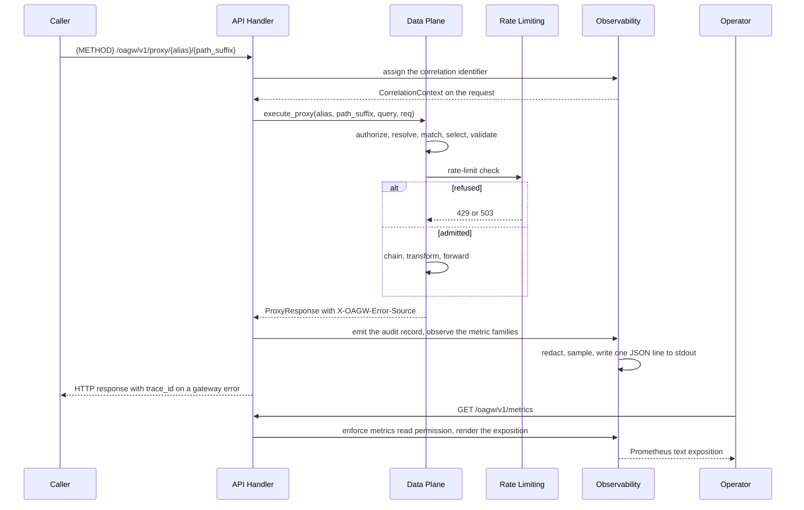

# Feature: Observability

- [ ] `p1` - **ID**: `cpt-cf-oagw-featstatus-observability-implemented`

<!-- reference to DECOMPOSITION entry -->
- [ ] `p2` - `cpt-cf-oagw-feature-observability`

<!-- toc -->

- [1. Feature Context](#1-feature-context)
  - [1.1 Overview](#11-overview)
  - [1.2 Purpose](#12-purpose)
  - [1.3 Actors](#13-actors)
  - [1.4 References](#14-references)
  - [1.5 Feature-Local Deviations from Shared Baselines](#15-feature-local-deviations-from-shared-baselines)
  - [1.6 Explicit Non-Applicability](#16-explicit-non-applicability)
- [2. Actor Flows (CDSL)](#2-actor-flows-cdsl)
  - [Observe a Proxied Request](#observe-a-proxied-request)
  - [Record a Configuration Change](#record-a-configuration-change)
  - [Scrape the Metrics Endpoint](#scrape-the-metrics-endpoint)
- [3. Processes / Business Logic (CDSL)](#3-processes--business-logic-cdsl)
  - [Assign the Correlation Identifier](#assign-the-correlation-identifier)
  - [Emit the Audit Record](#emit-the-audit-record)
  - [Update the Metric Families](#update-the-metric-families)
  - [Render the Prometheus Exposition](#render-the-prometheus-exposition)
- [4. States (CDSL)](#4-states-cdsl)
- [5. Definitions of Done](#5-definitions-of-done)
  - [Correlation Identifier Propagation and the trace_id Echo](#correlation-identifier-propagation-and-the-trace_id-echo)
  - [Structured Audit Records](#structured-audit-records)
  - [Prometheus Metrics Endpoint](#prometheus-metrics-endpoint)
  - [Metric Cardinality Control](#metric-cardinality-control)
  - [Redaction and Credential Isolation](#redaction-and-credential-isolation)
  - [Sampling and Log-Flood Control](#sampling-and-log-flood-control)
  - [Colocated Tests](#colocated-tests)
- [6. Acceptance Criteria](#6-acceptance-criteria)

<!-- /toc -->

## 1. Feature Context

### 1.1 Overview

This feature is the cross-cutting reader of the `oagw` gear and the last entry of the decomposition: it owns no step of the proxy path, answers no policy question, and decides nothing about any request. What it owns is the legibility of the path the other eight features built. Every proxy request the gear serves carries a correlation identifier from the moment it enters the handler to the moment its answer leaves it; every one of those requests is described by at most one structured JSON record written to stdout, exactly one for every request whose record the sampling and the failure-log bound of §1.5 do not drop; every configuration change written through a management route is described by one record of its own; and every traffic, latency, error, and state fact the path produces is exposed as one of the twelve Prometheus metric families DESIGN §4.2 catalogues, scraped at a single endpoint this feature registers.

The feature attaches to the gear at three points and at no others. The first is the entry of the proxy path `cpt-cf-oagw-feature-data-plane-proxy` implements, where the correlation identifier is assigned before that path authorizes anything, because a request the path refuses is still a request an operator needs to find. The second is the exit of the same path, after the `ProxyResponse` exists or the streamed transfer has ended, where the audit record is emitted and the metric families are observed from the outcome the path recorded in the request's execution context. The third is the completion of a management write in `cpt-cf-oagw-feature-control-plane-config`, where the record for the change is emitted at the seam that feature's write path already uses for its post-write notifications. Everything else — resolution, matching, validation, the rate-limit check, the composed chain, the header rules, the transfer mode, the CORS answers — is another feature's act, and this feature reports it without repeating it.

The feature registers exactly one endpoint, `GET /oagw/v1/metrics`, on the gear-relative router mount point `cpt-cf-oagw-feature-gear-foundation` created. It emits no series for its own scrape, writes no audit record for its own scrape, and holds no state that outlives the process.

### 1.2 Purpose

DECOMPOSITION §2.9 places this feature last and states its purpose as making "the outbound path legible to operators", naming it "the feature an operator uses first when an upstream starts misbehaving". DECOMPOSITION §3 makes it a consumer of three features for the reasons that section states: it requires `cpt-cf-oagw-feature-data-plane-proxy` because "correlation, audit fields, and the proxy-path metrics are all derived from the proxy request and response lifecycle"; it requires `cpt-cf-oagw-feature-rate-limiting` because it "reports rate-limit state and 429 outcomes, which only exist once that feature owns them"; and it requires `cpt-cf-oagw-feature-control-plane-config` because it "logs configuration changes and reads configuration state, so it cannot be completed before that feature's write path exists". This document is the reporting surface those three dependencies exist to feed: the proxy feature produces the lifecycle, the rate-limit feature produces the state and the transitions, and the configuration feature produces the writes, and this feature turns all three into records a scrape can read and a log query can filter.

PRD §6.1 states both requirements this feature delivers and states the threshold of each. `cpt-cf-oagw-nfr-observability` requires that the system "log all proxy requests with correlation IDs and expose Prometheus metrics for request counts, latencies, error rates, and rate limit state", with the threshold "100% of proxy requests logged with correlation ID; metrics scraped at /metrics endpoint". `cpt-cf-oagw-nfr-credential-isolation` requires that credentials "MUST never appear in logs, error messages, or API responses", with the threshold "Zero credential exposure in any log, error, or API output". The second is the harder of the two here, because this feature is the one place in the gear whose whole output is logs and API responses: the threshold is realized by the redaction rules of §3 and by the Definition of Done that pins them, and it is the reason the header allowlist of DESIGN §4.3 is closed at one name (§1.5).

This feature delivers the DESIGN §4.2 metrics catalogue and the DESIGN §4.3 audit-log catalogue in full. It has no DESIGN §3.2 subsection, which is the reason DECOMPOSITION §2.9 gives for `cpt-cf-oagw-component-model` staying an umbrella reference here; the catalogues are DESIGN §4 material and are tabulated in §3 of this document rather than derived from any component of §3.2.

DECOMPOSITION §2.9 names this feature's domain model as "`AuditEvent`, `CorrelationContext`, and the metric label sets". The third of the three is a plural and not a type name, and this document fixes its declared form as `MetricLabelSet`: one declared concept carrying the shared label vocabulary of DESIGN §4.2 and the per-family subsets that section enumerates. That declaration is what makes the label sets checkable rather than a convention the implementation happens to follow.

Deliverables:

- The correlation identifier, taken from the header the platform injects when one arrived and generated as a UUID otherwise, recorded on the `CorrelationContext`, propagated to every audit record the request produces, and echoed in every gateway error body the path answers as the `trace_id` extension field.
- The structured JSON audit record of DESIGN §4.3, written to stdout with exactly the fourteen fields that section tabulates, for successful requests, failed requests, configuration changes, authentication failures, and circuit-breaker state transitions.
- The `MetricLabelSet` declaration: the fourteen shared label keys and the per-family subsets of DESIGN §4.2, with the closed value sets each key carries.
- The twelve Prometheus metric families of DESIGN §4.2, observed from the execution context and from the sibling states, and rendered as the Prometheus text exposition format at `GET /oagw/v1/metrics`.
- Cardinality control: no tenant label anywhere in the metrics surface, `http.route` carrying the normalized route match pattern rather than the raw request path, methods normalized to a standard verb or `_OTHER`, and every enumerated label key closed at a bounded value set.
- The redaction rules of DESIGN §4.3: no request body, no response body, no query parameter, and no header value other than the allowlisted one in any record; no API key, no token, no credential material, and no `cred://` reference value in any record, metric label, or error message.
- Sampling of the high-volume success records and a rate-limit bound on the authentication-failure records, both build-time constants with no configuration surface (§1.5).
- Colocated tests under `gears/system/oagw/oagw/tests/`.

**Requirements**:

- [ ] `p2` - `cpt-cf-oagw-nfr-observability`
- [ ] `p1` - `cpt-cf-oagw-nfr-credential-isolation`

Both are listed at the priority DECOMPOSITION §2.9 records. `cpt-cf-oagw-nfr-observability` is the requirement this feature primarily delivers and is the reason the entry is MEDIUM; `cpt-cf-oagw-nfr-credential-isolation` is delivered here in its logging, error, and API-response clauses, which are the clauses this feature's output reaches, and its credential-store and tenant-isolation clauses belong to `cpt-cf-oagw-feature-plugin-system` and `cpt-cf-oagw-feature-control-plane-config`, which own the resolution of the reference and the persistence of the configuration it points into.

**Principles**:

- `p1` - `cpt-cf-oagw-principle-cred-isolation`

`cpt-cf-oagw-principle-cred-isolation` states that the gear "references secrets via `cred_store` URIs (`cred://...`); never stores or logs secret material". The second half of that statement is this feature's to realize: the `cred://` reference value is a credential pointer, and this feature writes it to no record, no label, and no error message, exactly as it writes the material the pointer resolves to.

**Constraints**:

- `p1` - `cpt-cf-oagw-constraint-toolkit-deploy`

This constraint is the one DECOMPOSITION §2.9 records, so no §1.5 row is needed for it, and the reason it is load-bearing here is the same one the sibling features record: the single-executable deployment is what makes the in-process observation seam the only mechanism this feature has, and what makes a scrape of `GET /oagw/v1/metrics` read the same process that served the traffic.

**Design Components**:

- `p2` - `cpt-cf-oagw-component-model`
- `p2` - `cpt-cf-oagw-tech-dependencies`

`cpt-cf-oagw-component-model` stays an umbrella reference for the reason DECOMPOSITION §2.9 gives: this feature has no DESIGN §3.2 subsection to deliver, so the reference names no component surface and carries no subsection row. `cpt-cf-oagw-tech-dependencies` is load-bearing rather than decorative: the Rust and Axum row names the async runtime the emission and the exposition run on, and the metrics-crate row of that table is the registry the twelve families are collected into, which is a dependency the platform supplies and not a mechanism this feature builds.

**Domain Model Entities**:

- `AuditEvent` — one structured record of DESIGN §4.3, carrying exactly the fourteen fields that section tabulates, the event name that selects which of them are populated, and the redaction already applied to every value it carries.
- `CorrelationContext` — one per proxy request, carrying the correlation identifier, whether it was taken from the inbound header or generated, and the sampling decision the request's record is subject to.
- `MetricLabelSet` — the shared label vocabulary of DESIGN §4.2 and the per-family subsets that section enumerates, with the closed value set of each enumerated key.

The first two are named by DECOMPOSITION §2.9 and the third is the declared form of that entry's "the metric label sets" (§1.2). `MetricLabelSet` is a declared concept and not a per-request value: it is the vocabulary the twelve families share, held once, and it is why the cardinality rules of §5 are checkable as a property of the declaration rather than as a property of a call site. Four types are consumed and not redeclared: `ProxyContext` and `ProxyResponse` from `cpt-cf-oagw-feature-data-plane-proxy`, whose members carry the lifecycle the records and series describe, `ResolvedUpstream` from the same feature, and `ErrorContext` from `cpt-cf-oagw-feature-gear-foundation`, which is the single definition point for it and the carrier of the `trace_id` this feature supplies.

**Data**:

- None. DECOMPOSITION §2.9 declares no table for this feature, and it creates, reads, and writes none. An `AuditEvent` is written once to stdout and never revisited, a `CorrelationContext` lives exactly as long as the request it describes, and the twelve families are in-process series whose values are recomputed from live state on every scrape. A restart empties the counters, resets the gauges, and loses no record that had not already been written.

**API**:

- GET /oagw/v1/metrics

That line is the whole of the API statement DECOMPOSITION §2.9 makes, and it is the only path this feature registers. It is the gear-relative form of the `/metrics` endpoint DESIGN §4.2 places and the `/metrics` endpoint PRD §6.1 names in its threshold; the divergence is recorded in §1.5 and the two forms name one endpoint, not two. The endpoint is a scrape surface and not a proxy surface: it carries no alias, no path suffix, and no query, and it is answered from the in-process collectors without contacting any upstream service.

### 1.3 Actors

| Actor | Role in Feature |
|-------|-----------------|
| `cpt-cf-oagw-actor-platform-operator` | Scrapes `GET /oagw/v1/metrics` and reads the audit stream, and is the actor DECOMPOSITION §2.9's purpose names when it calls this "the feature an operator uses first when an upstream starts misbehaving". PRD §2 names reading the metrics and the logs among this actor's needs, and DECOMPOSITION §1.5 lists this feature against the operator alone among the features that report. |
| `cpt-cf-oagw-actor-app-developer` | Issues the proxy request that carries a correlation identifier, receives the answer that echoes it as `trace_id` when the answer is a gateway error, and never sees a record, a label, or a header value the redaction rules exclude. PRD §6.1's threshold of 100% of proxy requests logged with a correlation ID is stated over this actor's requests. |
| `cpt-cf-oagw-actor-tenant-admin` | Performs the create, the override, and the delete through a management route of `cpt-cf-oagw-feature-control-plane-config` whose completion produces the configuration-change record. The write is that feature's act; the record of it is this one's. |

Three actors participate indirectly and are named here so their absence from the table is a record and not a gap:

- `cpt-cf-oagw-actor-upstream-service` is never contacted by this feature. Its answers reach it as the status, the duration, and the byte counts `cpt-cf-oagw-feature-data-plane-proxy` classified and recorded in the execution context, and its failures reach it as the `error_type` of a failed record and the `upstream` value of the `error_type` label. The one thing it supplies directly is nothing: no metric of this feature observes the upstream except through the state another feature already holds.
- `cpt-cf-oagw-actor-cred-store` answers no call this feature makes. The credential material the chain resolved and injected never reaches a record, a label, or an error message, and neither does the `cred://` reference value that points at it, which is the realization of `cpt-cf-oagw-nfr-credential-isolation` this feature owes (§1.5).
- `cpt-cf-oagw-actor-types-registry` issues no call this feature answers. The GTS error-type catalogue was provisioned once at startup by `cpt-cf-oagw-feature-gear-foundation`, and the `error_type` value of a failed record and of the `oagw_errors_total` series is read from that catalogue and never registered by this feature.

### 1.4 References

- **PRD**: [PRD.md](../PRD.md)
- **Design**: [DESIGN.md](../DESIGN.md)
- **Dependencies**: `cpt-cf-oagw-feature-data-plane-proxy` — the proxy path whose entry assigns the correlation identifier and whose exit produces the record and the series, the `ProxyContext` that carries the `CorrelationContext` and the `ResolvedUpstream` and `ProxyResponse` the fields and labels read, the endpoint selection whose `selection_method` the routing families report, and the shared outbound client whose connection pool the `oagw_upstream_connections` gauge reads (DECOMPOSITION §3); `cpt-cf-oagw-feature-rate-limiting` — the breaker state and transitions the `oagw_circuit_breaker_state` and `oagw_circuit_breaker_transitions_total` families observe, the rate-limit state and the 429 outcome the two `rate_limit` families observe, and the admission verdict the in-flight gauge and the success record depend on; and `cpt-cf-oagw-feature-control-plane-config` — the management write path whose completion produces the configuration-change record and the stored upstream and route configuration the `host` and `endpoint` label values are read from.

Supporting sources this feature stays consistent with:

- [DESIGN.md](../DESIGN.md) §4.2 — the twelve metric families with their label sets, the cardinality-management paragraph, the histogram buckets, and the statement that the label-key vocabulary matches the inbound API Gateway so both gateways share dashboards.
- [DESIGN.md](../DESIGN.md) §4.3 — the fourteen audit fields, the no-PII and no-secrets rules, the header allowlist, the five logged categories, the four log levels, and the sampling note whose example ratio this feature carries as a constant (§1.5).
- [DESIGN.md](../DESIGN.md) §3.3 — the error catalogue whose GTS `type` identifiers are the closed value set of the `error_type` label and the `error_type` audit field, and the `retry_after_seconds` extension member whose presence decides whether an answer carries `Retry-After`, which is the WARN-level trigger DESIGN §4.3 names as "retry guidance emitted".
- [ADR/0006-state-management.md](../ADR/0006-state-management.md) (`cpt-cf-oagw-adr-state-management`) — the three pieces of state the ADR assigns the Data Plane, of which the shared outbound client is the one whose connection pool the `oagw_upstream_connections` gauge reads, and the request flow with caching that names the proxy-path phases whose durations the `phase` label carries.
- [ADR/0007-error-source-distinction.md](../ADR/0007-error-source-distinction.md) (`cpt-cf-oagw-adr-error-source-distinction`) — the two error classes and the rule that an upstream-sourced answer passes through with its body unmodified, which is the reason an upstream failure carries no `trace_id` echo.
- [config/e2e-local.yaml](../../../../../config/e2e-local.yaml) — the graded configuration. Its `oagw.config` block carries three of the five keys DECOMPOSITION §2.1 declares — `proxy_timeout_secs`, `allow_http_upstream`, and `ssrf_policy` — and names no sampling, logging, or metrics key, leaving the two token-cache keys at their defaults; its `logging` section configures the platform's own console and file targets and no gear-side audit sink; its `opentelemetry.tracing.enabled` and `opentelemetry.metrics.enabled` are both `false`; its `opentelemetry.tracing.http.inject_request_id_header` names `x-request-id`; its `api-gateway` block sets `require_auth_by_default: true`; and its `e2e-token-tenant-a` entry carries `token_scopes: ["*"]`.

**Run-level assumptions** — premises this feature relies on that come from the platform runtime rather than from PRD, DESIGN, the ADRs, or DECOMPOSITION. Each states what fails if the premise does not hold:

- Assumption: the route this feature registers is enforced with the permission `gts.cf.core.oagw.metrics.v1~:read`, an identifier formed in the same grammar as the `upstream`, `route`, and `proxy` arms DESIGN §3.2 records and outside the family DECOMPOSITION §2.2 writes, which names no `metrics` arm. No supplied document names a permission for the metrics endpoint, and DESIGN §4.2 qualifies it as admin-only while DECOMPOSITION §1.3(6) drops the qualifier. If the platform does not recognize the identifier, the fail direction **MUST** be the one that denies the scrape, because a metrics surface that answers to an unauthenticated caller discloses the traffic, the route, and the error profile of every upstream the gear serves. `config/e2e-local.yaml`'s `e2e-token-tenant-a` carries `token_scopes: ["*"]` and the `api-gateway` sets `require_auth_by_default: true`, so the graded deployment answers the route to that token (§1.5).
- Assumption: the platform injects a request identifier into the headers of an inbound request, and this feature can read it. `config/e2e-local.yaml`'s `opentelemetry.tracing.http.inject_request_id_header` names `x-request-id` as the header the platform injects, and its `opentelemetry.tracing.enabled` and `opentelemetry.metrics.enabled` are both `false`, so no trace context and no platform metric reach the gear in the graded deployment. If the platform injects nothing, the correlation identifier is generated on every request and is still present on every record, because the generation branch is unconditional when the header is absent (§1.5).
- Assumption: the platform resolves the calling tenant and the authenticated subject before the proxy handler runs, so the `tenant_id` and `principal_id` fields of a record are available to it. `config/e2e-local.yaml` sets `require_auth_by_default: true`, and DESIGN §3.3 names `toolkit-auth` as the inbound mechanism. If neither identifier is available for a request the gear still serves, the record **MUST** be written with both fields omitted rather than synthesized, because an invented tenant identifier attributes traffic to a tenant that sent none.
- Assumption: the process writes to a stdout the platform collects, and the write of one JSON line is atomic enough that concurrent requests do not interleave the bytes of one line inside another. DESIGN §4.3 names stdout as the destination and names a centralized logging system as the reader. If the destination fragments lines, the records remain parseable individually but a consumer cannot rely on line boundaries, and this feature **MUST NOT** add a second sink, a buffer, or a batching layer to compensate, because a buffered sink can lose records a crash would otherwise have delivered.
- Assumption: the shared outbound client exposes its connection-pool occupancy per host in a form a gauge can read, which is the premise the `oagw_upstream_connections{host, state}` family rests on. ADR 0006 names the shared client as the second piece of Data Plane state and specifies nothing about its introspection. If the client exposes no such state, that family **MUST** be omitted from the exposition rather than emitted as a constant, because a constant gauge asserts occupancy the gear cannot see.

### 1.5 Feature-Local Deviations from Shared Baselines

| Deviation | Rationale | Review owner | Validation performed |
|-----------|-----------|--------------|----------------------|
| The metrics endpoint is registered gear-relative at `/oagw/v1/metrics`, which DECOMPOSITION §2.9 states, and not at the bare `/metrics` DESIGN §4.2 places or the `/metrics` endpoint PRD §6.1 names in its threshold; the two forms name one endpoint and not a second one. | DECOMPOSITION §1.3(6) makes exactly this correction and gives the reason: the gear's router mounts gear-relative at `/oagw/v1`, which `cpt-cf-oagw-feature-gear-foundation` registers, and the bare `/metrics` of DESIGN §4.2 is the same endpoint under the gear's own prefix rather than a second endpoint at a second path. The same item drops the admin-only qualifier for the reason recorded in the next row. The mount point carries no route outside `/oagw/v1`, so a request to `/metrics` is answered by no OAGW handler at all. | The controller of this run. | Accepted by the semantic review of this run; `cfs validate --artifact` clean. |
| The admin-only gating DESIGN §4.2 states is realized as the permission `gts.cf.core.oagw.metrics.v1~:read`, an identifier formed in the same grammar as the `upstream`, `route`, and `proxy` arms DESIGN §3.2 records and outside the `gts.cf.core.oagw.{upstream,route,*_plugin}.v1~:{create;override;read;delete}` family DECOMPOSITION §2.2 writes. | No supplied document names a permission for the metrics endpoint: DESIGN §4.2 says only "admin-only", and DECOMPOSITION §1.3(6) drops the qualifier because "the graded configuration exposes no admin-gating surface for gear-relative gear routes". A surface that names the traffic, the routes, and the error profile of every upstream is not a surface the gear should answer to an unauthenticated caller, so the endpoint is authenticated and enforced rather than open, and the fail direction when the platform does not recognize the identifier is the one that denies the scrape (§1.4). `config/e2e-local.yaml`'s `e2e-token-tenant-a` carries `token_scopes: ["*"]` and the `api-gateway` sets `require_auth_by_default: true`, so the graded deployment answers the route to that token, which is the consequence recorded in §6. | The controller of this run. | Accepted by the semantic review of this run; `cfs validate --artifact` clean. |
| The correlation identifier is taken from the inbound `X-Request-Id` header when one arrived and is generated as a UUID otherwise, and a caller-supplied value is admitted only when it is a bounded, printable identifier containing no control character; a value that fails that check is discarded and a UUID is generated in its place. | `config/e2e-local.yaml`'s `opentelemetry.tracing.http.inject_request_id_header` names `x-request-id` as the header the platform injects, which is the only header a supplied document names for this purpose, and its `opentelemetry.tracing.enabled` and `opentelemetry.metrics.enabled` are both `false`, so the platform supplies no trace context and no platform metric in the graded deployment and this feature's own identifier is the only correlation the deployment has. The admission check exists because the value is written into every record the request produces and an unbounded or control-bearing value is a log-flooding and log-corruption vector the no-flooding rule of DESIGN §4.3 exists to prevent; a caller cannot use it to escape correlation, because the replacement is itself a correlation identifier. | The controller of this run. | Accepted by the semantic review of this run; `cfs validate --artifact` clean. |
| This document's status identifier carries the `-implemented` suffix, reading `cpt-cf-oagw-featstatus-observability-implemented` where the FEATURE template fixes the same identifier without that suffix, and its backreference to the DECOMPOSITION entry is left unchecked where that template fixes a checked one. | All eight gated sibling FEATURE documents this run has authored — `cpt-cf-oagw-feature-gear-foundation`, `cpt-cf-oagw-feature-control-plane-config`, `cpt-cf-oagw-feature-hierarchical-config`, `cpt-cf-oagw-feature-plugin-system`, `cpt-cf-oagw-feature-data-plane-proxy`, `cpt-cf-oagw-feature-rate-limiting`, `cpt-cf-oagw-feature-cors`, and `cpt-cf-oagw-feature-streaming` — carry the same two forms, so the departure is a run-wide convention and not a defect of this document alone: the suffix names the status value the identifier reports, and the backreference is a traceability pointer whose state the implementation phase owns. | The controller of this run. | Accepted by the semantic review of this run; `cfs validate --artifact` clean. |
| This feature's tests are colocated at `gears/system/oagw/oagw/tests/` instead of `testing/e2e/gears/oagw/`. | DECOMPOSITION §1.3(3) reserves `testing/e2e/gears/oagw/` for the acceptance suite; every unit and integration test this decomposition produces lives with the crate. This is the same deviation all eight sibling feature documents record in their own §1.5 tables, restated here because the tests it governs include this feature's. | The controller of this run. | Accepted by the semantic review of this run; `cfs validate --artifact` clean. |
| The 1/100 high-volume-route sampling ratio of DESIGN §4.3's example is a build-time constant of this feature with no configuration surface and no sourced value beyond the example itself. | The `OagwConfig` surface closes at the five keys `proxy_timeout_secs`, `allow_http_upstream`, `ssrf_policy`, `token_cache_ttl_secs`, and `token_cache_capacity`, which `cpt-cf-oagw-feature-gear-foundation` owns and which name no sampling, logging, or metrics key, so a sampling key here would give one configuration surface two owners. DESIGN §4.3 states the ratio as an example — "e.g., sample 1/100 for high-volume routes" — and no other supplied document states a value. The value is recorded in the implementation as a build-time constant, and what §6 pins is that the sampling exists, that it applies to the success records of high-volume routes only, and that no key of `OagwConfig` and no upstream or route configuration reaches it. This is the same class of recorded constant as the two queue bounds `cpt-cf-oagw-feature-rate-limiting` records and the 60-second idle constant `cpt-cf-oagw-feature-streaming` records. | The controller of this run. | Accepted by the semantic review of this run; `cfs validate --artifact` clean. |
| The rate-limit bound on authentication-failure records is a build-time constant of this feature with no configuration surface and no sourced value, of the same class as the sampling ratio above. | DESIGN §4.3 requires that auth failures be "rate limited to prevent log flooding" and states no bound, and no other supplied document states one. What §6 pins is that the bound exists, that it is finite, that a flood of failed authentication attempts produces at most that many records per interval, and that the bound is recorded in the implementation as a build-time constant; the records beyond the bound within one interval are dropped and not queued, because a queue of unsent failure records is the flood the bound exists to prevent. No key of `OagwConfig` reaches it (§1.5). | The controller of this run. | Accepted by the semantic review of this run; `cfs validate --artifact` clean. |
| The `path` label of `oagw_rate_limit_exceeded_total{host, path}` and `oagw_rate_limit_usage_ratio{host, path}` is read as the normalized route match pattern, the same value the `http.route` label carries, so the label set of both families stays bounded by the number of configured routes. | DESIGN §4.2 enumerates those two families with a `path` label and states, in the same subsection, the cardinality rule that "`http.route` is the normalized route match pattern, not the raw request path" and that there are "no tenant labels". A raw-path reading would put the label set under the control of the callers, which is the unbounded cardinality the subsection's own rule exists to prevent, and would leave the two families inconsistent with the three others that carry `http.route`. Reading `path` as the route match pattern keeps every rule of the subsection true at once and keeps the two families' label sets within the same bound as the rest of the catalogue. | The controller of this run. | Accepted by the semantic review of this run; `cfs validate --artifact` clean. |
| The closed `event` value set the audit routine and §6 point at is: `proxy_request.succeeded` and `proxy_request.failed` for the two request records, `config.upstream.created`, `config.upstream.overridden`, `config.upstream.deleted`, `config.route.created`, `config.route.overridden`, and `config.route.deleted` for the configuration changes over the two kinds `cpt-cf-oagw-feature-control-plane-config` writes, `config.plugin.created` and `config.plugin.deleted` for the two operations `cpt-cf-oagw-feature-plugin-system` admits, `auth.failed` for the authentication failure, and `breaker.transitioned` for the circuit-breaker state transition. | DESIGN §4.3 enumerates the five logged categories and states no literal event name for any of them, and §6's criterion that each record's `event` value is "drawn from the closed set §1.5 records" is untestable until the literals exist. The composition for the configuration change follows that document's own enumeration of "Upstream/route create/update/delete operations" and the `create`/`read`/`delete` arms `cpt-cf-oagw-feature-plugin-system` records, and the two request records follow the success/failed split the same subsection's "What is Logged" table makes. Twelve literals over five categories is the smallest set that keeps every category distinguishable in a record a consumer filters by `event`. | The controller of this run. | Accepted by the semantic review of this run; `cfs validate --artifact` clean. |
| The PRD §6.1 threshold "100% of proxy requests logged with correlation ID" is read as a requirement on the correlation identifier, not on the audit record: every proxy request carries a correlation identifier and every record written carries one in its `request_id` field, while the 1/100 sampling of §1.5 drops some success records of high-volume routes, so not every request produces a record. | PRD §6.1's own sentence ties the threshold to correlation IDs — "log all proxy requests with correlation IDs" — and its threshold clause reads "100% of proxy requests logged with correlation ID", which is a statement about the identifier and not about record survival; the sampling rule is the same subsection's neighbour, DESIGN §4.3's own no-flooding requirement, and the two are in tension only if the threshold is read as a record count. Dropping a sampled success record drops no correlation identifier: the identifier is assigned at the path's entry before the sampling decision runs, and it is carried on every record that is written and in every error body's `trace_id`. A threshold read as a record count would forbid the no-flooding rule DESIGN §4.3 states in the same subsection, so the identifier reading is the only one that keeps both true. | The controller of this run. | Accepted by the semantic review of this run; `cfs validate --artifact` clean. |
| This feature mutates none of the six series that describe state another feature owns: `oagw_circuit_breaker_state`, `oagw_circuit_breaker_transitions_total`, `oagw_rate_limit_exceeded_total`, and `oagw_rate_limit_usage_ratio` are observations of state `cpt-cf-oagw-feature-rate-limiting` owns; `oagw_routing_target_host_used` and `oagw_routing_endpoint_selected` are observations of the endpoint selection `cpt-cf-oagw-feature-data-plane-proxy` performs per ADR 0001; `oagw_upstream_available` is derived from that breaker state per host and endpoint; and `oagw_upstream_connections` is derived from the shared outbound client's connection pool, one of the three pieces of state ADR 0006 assigns the Data Plane. | DECOMPOSITION §3 makes this feature a consumer of `cpt-cf-oagw-feature-rate-limiting` because it "reports rate-limit state and 429 outcomes, which only exist once that feature owns them", and of `cpt-cf-oagw-feature-data-plane-proxy` because the metrics are "derived from the proxy request and response lifecycle". Every sibling that owns the underlying state records the same posture — `cpt-cf-oagw-feature-rate-limiting` names the four series as "that feature's to emit" and names the `host` label as the upstream alias, which is this feature's labelling decision — so the read-only posture is the recorded seam and not an inference. A writer here would give one state two owners and would let a scrape disagree with the answer the request received. | The controller of this run. | Accepted by the semantic review of this run; `cfs validate --artifact` clean. |
| The configuration-change record is written when the management handler of `cpt-cf-oagw-feature-control-plane-config` completes its write, at the same in-process post-write seam that feature already uses for its cache-flush and cleanup notifications; the event name distinguishes the three operations and the resource kinds upstream, route, and plugin; and the record carries no proxy-path field because no proxy request is involved. | DECOMPOSITION §3 makes this feature a consumer of `cpt-cf-oagw-feature-control-plane-config` because it "logs configuration changes and reads configuration state, so it cannot be completed before that feature's write path exists", and that feature records in its own §1.6 that it "emits no audit record of a successful configuration change" because the surface belongs to this feature. DESIGN §4.3 enumerates "Upstream/route create/update/delete operations", and `cpt-cf-oagw-feature-plugin-system` records in its own §1.6 that the audit log describing a plugin create or delete belongs to this feature too, so the plugin kind is carried rather than dropped. The path of the seam is the one the siblings already use: the write is the caller's act, the notification is issued by it, and the record is the notified feature's. | The controller of this run. | Accepted by the semantic review of this run; `cfs validate --artifact` clean. |
| The log-level mapping of DESIGN §4.3 is applied as: INFO for a successful request, a normal operation, and a circuit-breaker transition whose destination state is not `open`, WARN for a rate-limit refusal, a breaker-open answer, retry guidance emitted, and a circuit-breaker transition whose destination state is `open`, ERROR for an upstream failure, a timeout, and an authentication failure, and DEBUG for detailed plugin execution; DEBUG is the one level this feature emits no record at in the graded deployment. | DESIGN §4.3 tabulates the four levels and their subjects. `config/e2e-local.yaml`'s `logging.default.console_level` is `info`, so a DEBUG record would be filtered by the platform's own console target before a consumer read it, and emitting it would spend the sampling budget of the no-flooding rule on a record no consumer receives. The plugin-execution detail the DEBUG level names belongs to the chain that `cpt-cf-oagw-feature-plugin-system` supplies and `cpt-cf-oagw-feature-data-plane-proxy` executes, and the phase durations the execution context carries are that second feature's (§1.5), so no record of this feature depends on a level the graded deployment does not emit. | The controller of this run. | Accepted by the semantic review of this run; `cfs validate --artifact` clean. |
| The audit stream is the gear's own JSON line stream written to stdout and is distinct from the platform log files `config/e2e-local.yaml` configures; log retention is out of scope per DECOMPOSITION §2.9 and remains the PRD's open question. | DESIGN §4.3 names stdout as the destination and a centralized logging system as the reader, while `config/e2e-local.yaml`'s `logging` section configures console and file targets for the platform and for other gears and carries no `oagw` entry at all. Adding one would be a configuration change to a frozen input, and a file target would put a retention decision inside the gear that the PRD's §13 open question — "What is the retention policy for audit logs?" — places outside it. DECOMPOSITION §2.9 puts log retention out of scope, so this feature writes the stream and owns no policy over what happens to it afterwards. | The controller of this run. | Accepted by the semantic review of this run; `cfs validate --artifact` clean. |
| `CorrelationContext` is declared by this feature, as DECOMPOSITION §2.9 assigns, and is carried as a member of `ProxyContext`, which `cpt-cf-oagw-feature-data-plane-proxy` declares and owns. | `cpt-cf-oagw-feature-data-plane-proxy` lists the correlation context among the members of `ProxyContext` in its own §1.2, while DECOMPOSITION §2.9 lists the type under this entry, so the type and the slot that carries it would otherwise have two owners. The split is the same one `cpt-cf-oagw-feature-rate-limiting` records for `RateLimitConfig`, which the baseline lists under that entry for the semantics of its members while the type is declared as the foundation's shared vocabulary: the declaration is here, the slot is there, and this feature neither redeclares `ProxyContext` nor reaches inside it for anything but the correlation member the two documents name. | The controller of this run. | Accepted by the semantic review of this run; `cfs validate --artifact` clean. |
| The §1.4 assumption of `cpt-cf-oagw-feature-data-plane-proxy` that the `trace_id` extension field is omitted rather than synthesized is honoured by making a correlation context present on every proxy request, so the omission case is the one outside this feature's assignment. | That feature records that if no correlation context is available, the `trace_id` extension field **MUST** be omitted rather than synthesized, "because an invented identifier correlates nothing", and DECOMPOSITION §2.9 states that correlation identifiers are propagated on every request and echoed in error bodies. The two are reconciled by the assignment: this feature assigns an identifier on every request the proxy path serves, from the inbound header or generated, so a context is always available on that path and the omission branch is reached only by an answer produced before the correlation step or outside it, such as a request the router matched to no handler. A UUID this feature generated is the correlation identifier it owns and not a synthesized one, because it is the same value every record of that request carries. The supplier half of that sibling assumption and the supplier this document names are the same seam read from two sides: the platform supplies only the request-identifier header, `cpt-cf-oagw-algo-correlate` builds the `CorrelationContext` from it at the proxy path's entry, and the sibling's "supplied by the platform" is read as "supplied to that path already assigned", which is the reading its own step 3 records. | The controller of this run. | Accepted by the semantic review of this run; `cfs validate --artifact` clean. |
| A failed request is recorded with the fourteen fields of DESIGN §4.3 and with no fifteenth member: the human-readable message DESIGN §4.3's "failed requests: all above + error_type, error_message" clause names is not added as a field, and the record carries `error_type` alone. | DECOMPOSITION §2.9 fixes the field set as exactly the fourteen names it lists, and DESIGN §4.3 tabulates the same fourteen as the record's fields while describing the failed-request record in prose as carrying `error_message` as well. Adding a fifteenth field would put this document against the baseline that prevails, and dropping the field loses nothing an operator cannot recover: the message content is the problem `detail` the answer carries, which `cpt-cf-oagw-algo-error-mapping` of `cpt-cf-oagw-feature-gear-foundation` builds and which that feature's own statement bounds to contain no credential material, no `cred://` reference value, and no configuration value. | The controller of this run. | Accepted by the semantic review of this run; `cfs validate --artifact` clean. |
| The `phase` label of `oagw_request_duration_seconds{host, http.route, phase}` is closed at four values — `resolve`, `chain`, `upstream`, and `total` — named for the step of the proxy path whose duration each carries. | DESIGN §4.2 names the `phase` label and enumerates no values, and a label with an open value set is the cardinality risk the same subsection's management paragraph exists to prevent. The four values are the bounded set of phases whose durations the request's execution context carries: `resolve` for `cpt-cf-oagw-algo-resolve-consume` (a Data Plane L1 hit or a hierarchy walk), `chain` for `cpt-cf-oagw-algo-chain-execute`, `upstream` for `cpt-cf-oagw-algo-outbound-forward` (the phase whose two deadline breaches DESIGN §3.3 splits between `ConnectionTimeout` and `RequestTimeout`), and `total` for the whole handler invocation. No phase is added per plugin, per route, or per upstream, so the set cannot grow with traffic or configuration. | The controller of this run. | Accepted by the semantic review of this run; `cfs validate --artifact` clean. |
| The `error_type` label of `oagw_errors_total{host, http.route, error_type}` and the `error_type` field of a failed record are closed at the catalogue slugs of the error variants `cpt-cf-oagw-feature-gear-foundation` provisions plus one further value, `upstream`, for a response the upstream answered with a failure status. | The catalogue is fixed at 22 variants over 21 distinct `gts.cf.core.errors.err.v1~cf.oagw.{slug}.v1` identifiers, which is a bounded set, and DESIGN §4.3's ERROR level names "upstream failures" as a subject the catalogue has no row for, because an upstream failure status is an answer the gateway passes through rather than a `DomainError` it mapped. Naming that case with a closed literal rather than with the upstream's own status text keeps the value set bounded and keeps the two surfaces consistent, since the audit field and the label carry the same value for the same request. | The controller of this run. | Accepted by the semantic review of this run; `cfs validate --artifact` clean. |
| `http.response.status_code` carries the numeric status of the response the caller received, which is the upstream's status when the upstream answered and the gateway's own status when the gateway answered without contacting it. | DESIGN §4.2 states the label as "the numeric upstream status (OTel HTTP semconv)", and a request the gateway answered at 404, 429, or 503 before any outbound call has no upstream status to carry. Omitting the label on those requests would leave `oagw_requests_total` unable to report the status classes its own catalogue is read by, and status-class queries are expressed at query time by regex on the numeric code, which requires the code to be present. The set of statuses the gateway itself produces is bounded by the error catalogue, so the reading adds no cardinality. | The controller of this run. | Accepted by the semantic review of this run; `cfs validate --artifact` clean. |
| A scrape of `GET /oagw/v1/metrics` produces no audit record and no observation of `oagw_requests_total`, and a CORS preflight that `cpt-cf-oagw-feature-cors` answers before the proxy flow is reached produces neither; the 403 answers that feature produces after resolution are recorded like any other refused proxy request. | PRD §6.1's threshold is stated over proxy requests, and a scrape is answered from the in-process collectors without entering the proxy path `cpt-cf-oagw-flow-proxy-request` implements, so counting it would make the traffic series report its own observation and would make the record stream describe a request that resolved nothing. The preflight distinction is the one that feature already records: it answers a preflight at handler level before the proxy path authenticates a caller, so the request reaches no step whose outcome this feature reads, while its origin and method refusals happen after resolution and are recorded in the execution context like every other outcome. | The controller of this run. | Accepted by the semantic review of this run; `cfs validate --artifact` clean. |
| The header allowlist DESIGN §4.3 names is closed at one name, the correlation header the platform injects, and its value appears in a record only as the `request_id` field; the `record_headers` list `config/e2e-local.yaml` configures for the platform's trace collector is the platform's list and is not this feature's allowlist. | DESIGN §4.3 states that headers are "never logged except from an allowlist" without naming the list, and the fourteen-field record carries no header field at all, so the allowlist governs the values that reach the fields that do exist. The one header whose value a field reports is the correlation header, whose value is the `request_id` the record carries, and admitting it is what makes the record findable by the identifier the caller already holds. Every other header value — including `Authorization`, whose token is credential material, and including the three names the platform's own `record_headers` list names for its collector — is excluded, and that list is a trace-surface configuration of the platform that this feature reads nothing of. | The controller of this run. | Accepted by the semantic review of this run; `cfs validate --artifact` clean. |
| The authentication failures this feature records are the ones the proxy path observes: the failures `cpt-cf-oagw-algo-chain-execute` reports when an auth plugin cannot resolve or cannot apply a credential, and the 403 answers of `cpt-cf-oagw-flow-proxy-authorize` for a token without the permission it requires. The 401 the platform middleware answers for a missing or invalid token never reaches the gear and is not a record this feature can write, and the threshold of `cpt-cf-oagw-nfr-observability` is read over the requests the proxy path serves. | DESIGN §3.3 names `toolkit-auth` as the inbound mechanism and `cpt-cf-oagw-feature-data-plane-proxy` records in its own error scenarios that a missing or invalid token is answered 401 by the platform middleware, so that answer is produced before any OAGW handler runs and no record of it can originate here. Logging a request the gear never saw would require the gear to observe a surface it does not hold. Every failure the gear does see is recorded, which is what the 100% threshold is testable over, and the rate-limit bound of §1.5 applies to the records that remain. | The controller of this run. | Accepted by the semantic review of this run; `cfs validate --artifact` clean. |
| A circuit-breaker transition is written as its own record in addition to the one request record the exchange produces, never instead of it, and the fourteen-field record carries no `from_state` or `to_state` member of its own: the two states of a transition are carried on the `oagw_circuit_breaker_transitions_total{host, from_state, to_state}` series the same exchange reports. | DESIGN §4.3 fixes the record at fourteen fields with no fifteenth, so a transition record cannot carry the two states as fields without widening the record the same section closes; DESIGN §4.2 already fixes the states as the labels of `oagw_circuit_breaker_transitions_total`, which the exchange reports at the same observation. Writing the transition record in addition to the request record keeps §1.4's premise that every served request is recorded intact, because the request record of that exchange is still written; without the qualifier the additional record would read as the request record being replaced. The transition record is never sampled and carries the correlation identifier of the request that produced the transition, so a consumer can join the two records of one exchange. | The controller of this run. | Accepted by the semantic review of this run; `cfs validate --artifact` clean. |
| The `auth.failed` literal is selected for the exchanges the proxy path answers with a refusal of the caller's identity or permission: the request that carries no subject, the request the enforcer denies, and the exchange whose error kind is the authentication failure `cpt-cf-oagw-algo-chain-execute` maps. Every such exchange is bounded by the failure-log limit of §1.5, which is what makes the limit reach a served request. | DESIGN §4.3 logs "authentication failures" as a category but names no literal for it, and §1.5 row 177 fixes the exchanges the category covers as the ones the proxy path observes. Selecting the literal on the answer the path produced — the refusal the gateway answered itself or the error kind the chain reported — keeps the category reachable by every branch that answers it, which the fixed event set alone cannot guarantee, and routes the whole category through one bound so a flood of refusals cannot produce unbounded ERROR records. | The controller of this run. | Accepted by the semantic review of this run; `cfs validate --artifact` clean. |
| The `host` label of the three answer families `oagw_requests_total`, `oagw_errors_total`, and `oagw_request_duration_seconds` is the resolved upstream's alias, and a request the gateway answered without resolving one is filed under the one bounded literal `_unresolved`; `oagw_requests_in_flight` keeps the alias the caller addressed, because its raise at the correlate step and its lower at the observation must name the same series. | DESIGN §4.2 fixes `host` as the upstream alias and the same subsection's cardinality-management paragraph exists to keep label value sets out of caller control, while §1.5 row `inst-amo-labels` states the same rule for the `host` field. A request the gateway refused before resolution has no upstream to name, and filing its answer under the alias the caller invented — any RFC 1123 name up to 253 characters — would put a permanent series under caller control, including a permanent `oagw_requests_in_flight` series for an alias no configuration holds. The in-flight gauge is the one exception its own raise/lower pairing forces: filing its raise under the addressed alias and its lower under a sentinel would leak one raised series per invented alias. | The controller of this run. | Accepted by the semantic review of this run; `cfs validate --artifact` clean. |
| This document applies `cpt-cf-oagw-principle-error-source` and cites `cpt-cf-oagw-adr-error-source-distinction` and `cpt-cf-oagw-adr-state-management` in §1.4 and §5, none of which is on the §1.2 lists DECOMPOSITION §2.9 maps to this entry. | DECOMPOSITION §2.9 maps `cpt-cf-oagw-principle-cred-isolation` and `cpt-cf-oagw-constraint-toolkit-deploy` only, and both are on the §1.2 lists. The additions are applied rather than listed because they govern behaviour this feature cannot opt out of: the error-source distinction decides which answers carry a `trace_id` echo at all, and the state ownership of ADR 0006 decides which of the twelve series this feature reads and which it must never write. Every sibling feature document mirrors its baseline list except where it records the superset. | The controller of this run. | Accepted by the semantic review of this run; `cfs validate --artifact` clean. |

### 1.6 Explicit Non-Applicability

The areas below apply to the gear as a whole but not to this feature. Each is stated here so the omission is a recorded decision rather than a silent gap, and each names the feature that does own it.

- **The proxy path itself: resolution, matching, endpoint selection, validation, the rate-limit check, the chain, forwarding, and classification.** `cpt-cf-oagw-feature-data-plane-proxy` owns all of them, `cpt-cf-oagw-feature-rate-limiting` owns the check inside them, and this feature registers none of their steps. The three attachment points §1.1 names are the whole of this feature's presence on that path, and §2 restates no step of it: the flow below names the steps it reads by reference and adds no decision to any of them.
- **The circuit breaker and the rate-limit algorithms.** `cpt-cf-oagw-feature-rate-limiting` owns both, including the closed, open, and half-open machine `cpt-cf-oagw-state-circuit-breaker` declares. This feature observes that machine as a label value and a transition pair and changes nothing about it: no series it emits can trip, open, probe, or close a breaker, and no record it writes feeds a failure count.
- **The ten management routes and the upstream and route write path.** `cpt-cf-oagw-feature-control-plane-config` owns them, and this feature registers no management path and performs no write. The configuration-change record is the only thing this feature contributes to that path, and it is written after the write completed (§1.5).
- **Distributed tracing backends, spans, and trace propagation.** All three are out of scope per DECOMPOSITION §2.9, and this feature opens no span, exports no trace, and reads no W3C trace context. `config/e2e-local.yaml` sets `opentelemetry.tracing.enabled: false` and `opentelemetry.metrics.enabled: false`, so the graded deployment exports neither signal from the platform either; what this feature delivers is the correlation identifier and the two catalogues, which is what the out-of-scope list leaves in.
- **Dashboard provisioning and metric scraping infrastructure outside the gear.** Both are out of scope per DECOMPOSITION §2.9. What this feature delivers is one endpoint that renders the exposition in the format a scraper reads, with `# HELP` and `# TYPE` lines per family; who scrapes it, how often, and what is drawn from the result are an operator's deployment decisions and no surface of this gear.
- **Log retention.** Out of scope per DECOMPOSITION §2.9 and an open question in PRD §13. The audit stream is written and never read back by this feature, no record is rotated, aged, or deleted here, and no retention key exists in `OagwConfig` to set (§1.5).
- **Persistence.** DECOMPOSITION §2.9 declares no table for this feature, and `cpt-cf-oagw-db-schema` is fully claimed by `cpt-cf-oagw-feature-control-plane-config` and `cpt-cf-oagw-feature-plugin-system`. An `AuditEvent` is written once and never revisited, a `CorrelationContext` is dropped with the request, and the twelve families are in-process series that a restart empties.
- **Health and readiness.** `cpt-cf-oagw-feature-gear-foundation` owns the provisioning state machine and the readiness signal, and no metric of this feature reports gear health. The `oagw_upstream_available` gauge reports whether the breaker of an upstream admits, which is a property of that upstream and not of the gear.
- **Latency targets.** The proxy path's budget is `cpt-cf-oagw-nfr-low-latency`'s, whose Definition of Done `cpt-cf-oagw-feature-data-plane-proxy` carries, and this feature states no target of its own. The emission is issued after the response is produced, in the same post-response position the sibling's `last_used_at` write takes, so the cost it adds to the measured path is the reading of values the path already computed and not a computation on it.
- **gRPC proxying and WebTransport.** Both are out of scope per DECOMPOSITION §1.3(4), and neither produces a proxy request this feature observes: a gRPC upstream produces no matching route, which `cpt-cf-oagw-feature-data-plane-proxy` records, and a `wt`-scheme upstream is refused at dial time before any upstream call, so both appear in the surface only as the refused answers they are.
- **Rollout, rollback, versioning, localization, accessibility, and compliance.** The gear is one configuration item and one release unit (DECOMPOSITION §1.4), so this feature ships no rollout of its own. The exposition is fixed-format text and the records are fixed-field JSON, so there is no version negotiation and no schema to migrate. The `# HELP` strings and the problem `detail` strings this feature's answers pass through are English protocol text with no locale negotiation and no rendered actor-facing surface to make accessible. No credential material, no request body, no query parameter, and no header value other than the allowlisted one reaches anything this feature emits, so there is no personal or regulated datum here to hold a compliance obligation over; the one datum that names a caller is the tenant and subject identifier the platform already resolved and the record already reports as an identifier and not as an attribute.
- **Workarounds, deprecation, and migration.** None applies. The two limitations §1.5 records — the sampling ratio and the failure-log bound, both build-time constants with no configuration surface — have no workaround short of a code change, which is outside this run's authority, and every identifier this feature reads is fixed at `.v1`.
- **Diagnostic reading, troubleshooting, and self-healing.** The surface an operator reaches first is the exposition itself, and the reading it supports is fixed by the catalogue: `oagw_requests_total` and `oagw_request_duration_seconds` answer whether a resolved upstream is reachable at all, `oagw_errors_total` with its `error_type` label names the catalogue row the failures fall under, `oagw_circuit_breaker_state` and `oagw_circuit_breaker_transitions_total` answer whether a refusal came from the breaker rather than from the caller, `oagw_rate_limit_exceeded_total` and `oagw_rate_limit_usage_ratio` answer whether a refusal came from a limit, and `oagw_upstream_available` answers whether the breaker has taken an endpoint out of rotation. A family rendered with its `# TYPE` and `# HELP` lines and no sample lines means the state it reports does not exist yet — no request has touched that upstream, or no transition has occurred — and is not a scrape failure. This feature has no self-healing behaviour of its own, because it mutates no state it reports and no state it reads, and the remediation each of those readings points at is the owning feature's.

## 2. Actor Flows (CDSL)

The three flows below are the whole of this feature's presence on the gear's paths. The first runs at two points of the proxy path `cpt-cf-oagw-flow-proxy-request` of `cpt-cf-oagw-feature-data-plane-proxy` implements — its entry, before that path authorizes anything, and its exit, after the answer exists or the streamed transfer has ended — and restates the path's own steps by reference only. The second runs once per management write at the completion point of a handler of `cpt-cf-oagw-feature-control-plane-config`. The third is the one flow this feature owns end to end, because the endpoint it serves is the one path this feature registered.

**Use cases**: none is restated here.

DECOMPOSITION §2.9 names no use case for this entry, and every use case the PRD declares belongs to the feature whose path produces it: `cpt-cf-oagw-usecase-proxy-request` is `cpt-cf-oagw-feature-data-plane-proxy`'s, `cpt-cf-oagw-usecase-configure-upstream` and `cpt-cf-oagw-usecase-configure-route` are `cpt-cf-oagw-feature-control-plane-config`'s, and none is restated here. This feature is reached from those paths and adds no second statement of any of them.

### Observe a Proxied Request

- [x] `p1` - **ID**: `cpt-cf-oagw-flow-request-observed`

**Actor**: `cpt-cf-oagw-actor-app-developer`

This flow runs once per proxy request and is invoked at the two points §1.1 names. It owns the correlation identifier, the record, and the series, and nothing that produced them: by the time its exit point runs, the request has been resolved, matched, authorized, validated, charged, chained, transformed, forwarded, and answered, or refused at whichever step refused it. It adds no decision to the path and no step the caller observes.

**Success Scenarios**:

- Every proxy request the path serves carries a correlation identifier from the moment it enters the handler, taken from the inbound `X-Request-Id` header when one arrived and generated as a UUID otherwise (§1.5).
- Exactly one audit record is written for the request, at the exit point, with the fields its outcome populates and the redaction of §3 already applied.
- The twelve metric families are observed from the outcome, and the in-flight gauge is raised for the duration of the exchange and lowered when it ends.
- A gateway error body carries the correlation identifier as the `trace_id` extension field, through `ErrorContext` and `cpt-cf-oagw-algo-error-mapping`, and an upstream-sourced answer carries the upstream's own body and no echo.
- A streamed exchange is recorded once, when the transfer ends, with the duration and the byte counts the transfer produced.

**Error Scenarios**:

- The path refuses the request before any outbound call — an authorization, validation, matching, or rate-limit refusal — and the record is still written, with the status the refusal produced and the `error_type` of its catalogue variant.
- The upstream answers with a failure status: the answer passes through under the error-source classification, and the record carries `error_type` as `upstream` and the status the upstream produced.
- The correlation header is absent, or carries a value the admission check of §1.5 refuses: a UUID is generated, and the record still carries a correlation identifier.
- The platform resolves no tenant or subject for the request: the record is written with both fields omitted and neither is synthesized (§1.4).

**Steps**:

1. [x] - `p1` - Actor issues the proxy request carrying the method, the alias, an optional path suffix, an optional query, and any headers including `Authorization` - `inst-ro-issue`
2. [x] - `p1` - API: `{METHOD} /oagw/v1/proxy/{alias}[/{path_suffix}][?{query}]` — the proxy path `cpt-cf-oagw-feature-data-plane-proxy` registers, which is the path this flow is reached from and not a second registration of it - `inst-ro-api`
3. [x] - `p1` - At the entry of that path, before any authorization runs, `cpt-cf-oagw-algo-correlate` assigns the correlation identifier, records it on the `CorrelationContext` the `ProxyContext` of that request carries, and raises `oagw_requests_in_flight` for the resolved upstream under the cardinality rules of §1.5, so the gauge is raised at the entry the routine already occupies and lowered at the exit step below - `inst-ro-correlate`
4. [x] - `p1` - `cpt-cf-oagw-flow-proxy-request` runs the path's own steps, restated here by reference and decided by that feature: the alias normalization, the authorization, the resolution, the match, the endpoint selection, the inbound and body validation, the rate-limit check of `cpt-cf-oagw-feature-rate-limiting`, the composed chain, the header transformation, the forward, and the response classification that produces the `ProxyResponse` this flow's exit reads - `inst-ro-path`
5. [x] - `p1` - **IF** the path answered the request from a gateway error it produced - `inst-ro-gateway-if`
   1. [x] - `p1` - The correlation identifier is copied into the `ErrorContext` of that error as its `trace_id` member, and `cpt-cf-oagw-algo-error-mapping` of `cpt-cf-oagw-feature-gear-foundation` attaches it to the problem body as an extension field; no problem body is built here and no second serialization path is added - `inst-ro-echo`
6. [x] - `p1` - **ELSE** - `inst-ro-gateway-else`
   1. [x] - `p1` - The upstream's own answer passes through with its body unmodified under the error-source classification, so it carries no `trace_id`, and no echo is synthesized for it - `inst-ro-no-echo`
7. [x] - `p1` - At the exit of the path, after the `ProxyResponse` exists or the streamed transfer of `cpt-cf-oagw-feature-streaming` has ended, `cpt-cf-oagw-algo-metrics-observe` applies the cardinality rules and updates the twelve metric families from the execution context and the sibling states - `inst-ro-observe`
8. [x] - `p1` - `cpt-cf-oagw-algo-audit-emit` builds the `AuditEvent`, applies the redaction and the header allowlist, applies the sampling decision of the `CorrelationContext`, and writes one JSON line to stdout; for a streamed exchange this step is reached once, when the transfer ends - `inst-ro-emit`
9. [x] - `p1` - **IF** the request was answered by a gateway error, or the upstream answered with a failure status - `inst-ro-failed-if`
   1. [x] - `p1` - The record is a failed record: its level is the one the mapping of §1.5 assigns — ERROR for an upstream failure status, a timeout, and an authentication failure, WARN for a rate-limit refusal and a breaker-open answer, INFO for every other refusal — its `event` literal is `auth.failed` when the failure is the authentication failure §1.5 records and `proxy_request.failed` otherwise, its `error_type` is the catalogue slug of the variant the gateway answered or `upstream` for an upstream failure status, and every field a success record carries is present alongside it (§1.5) - `inst-ro-failed-record`
10. [x] - `p1` - **ELSE** - `inst-ro-failed-else`
    1. [x] - `p1` - The record is a success record at INFO, its `error_type` is omitted, and its sampling decision is the high-volume-route decision §1.5 records - `inst-ro-success-record`
11. [x] - `p1` - **RETURN** the answer unchanged: this flow mutates no header, no status, and no body of any response except the `trace_id` extension field a gateway error body carries, and it adds no latency to the measured path beyond the reading of values the path already computed (§1.6) - `inst-ro-return`

### Record a Configuration Change

- [x] `p1` - **ID**: `cpt-cf-oagw-flow-config-change-logged`

**Actor**: `cpt-cf-oagw-actor-tenant-admin`

This flow runs once per management write that completed, at the completion point of a handler of `cpt-cf-oagw-feature-control-plane-config`, and it records the change and nothing else. It is not a proxy flow: no upstream is contacted, no route is matched, and no rate limit is charged, which is why the record it produces carries no proxy-path field (§1.5).

**Success Scenarios**:

- A create, a replacement, an `enabled` change, or a delete over an upstream, a route, or a plugin completes, and one record is written for it with an event name that carries the resource kind and the operation.
- The record carries the writer's tenant and principal, the management path and method the write was addressed to, and the status the handler answered.
- The record is written before the handler's response is returned to the caller, so a consumer that sees the response has already seen the record's write begin.

**Error Scenarios**:

- The write is refused — by validation, by authorization, or by a conflict — and no configuration-change record is written, because the record reports a change and no change happened; the failure is answered by the management path that refused it, which logs its own failure outcomes.
- The write fails at the storage layer: no record is written, because the persisted state is unchanged.
- The completion notification does not reach this feature: no record is written and the write still succeeds, which is a gap in the audit trail and not a failure of the write (§1.5).

**Steps**:

1. [x] - `p1` - Actor issues the management request — a create, a replacement, an `enabled` change, or a delete over an upstream, a route, or a plugin — through a route `cpt-cf-oagw-feature-control-plane-config` or `cpt-cf-oagw-feature-plugin-system` registers - `inst-cc-issue`
2. [x] - `p1` - API: one of the ten management paths of `cpt-cf-oagw-feature-control-plane-config` or the plugin paths of `cpt-cf-oagw-feature-plugin-system` — the platform middleware authenticates the bearer token, resolves the calling tenant and subject, and the handler enforces the permission of the resource kind - `inst-cc-api`
3. [x] - `p1` - The handler validates the write, applies it in one transaction, and flushes the Control Plane cache, which is the whole of the write path and is that feature's act and not this one's - `inst-cc-write`
4. [x] - `p1` - **IF** the write completed - `inst-cc-completed-if`
   1. [x] - `p1` - `cpt-cf-oagw-algo-audit-emit` builds the configuration-change `AuditEvent` at the same in-process post-write seam that feature's cache-flush and cleanup notifications use (§1.5): the event name carries the resource kind and the operation, `tenant_id` and `principal_id` are the writer's, `path` and `method` are the management path and method addressed, `status` is the status the handler answered, and `host`, `duration_ms`, `request_size`, and `response_size` are omitted because no proxy exchange happened - `inst-cc-emit`
   2. [x] - `p1` - The record is written to stdout at INFO and is not subject to the high-volume sampling decision, because a configuration change is by definition not a high-volume event - `inst-cc-level`
5. [x] - `p1` - **ELSE** - `inst-cc-completed-else`
   1. [x] - `p1` - No configuration-change record is written; the refusal is answered by the management path that produced it, which reports its own failure outcomes with the correlation identifier and logs no request body and no configuration value - `inst-cc-refused`
6. [x] - `p1` - **RETURN** the handler's response unchanged: this flow mutates no status, no header, and no body of it - `inst-cc-return`

### Scrape the Metrics Endpoint

- [x] `p1` - **ID**: `cpt-cf-oagw-flow-metrics-scrape`

**Actor**: `cpt-cf-oagw-actor-platform-operator`

This flow is the one flow this feature owns end to end, because `GET /oagw/v1/metrics` is the one path this feature registered. It reads the in-process collectors and renders them, and it contacts no upstream, walks no hierarchy, and reads no persisted configuration.

**Success Scenarios**:

- A `GET` with a token carrying the metrics read permission is answered 200 with the Prometheus text exposition of the twelve families, each with its `# HELP` and `# TYPE` lines and its label set as §3 declares.
- A family that has observed nothing since process start is rendered with its type and help and no samples, rather than omitted, so a scraper sees the catalogue whole.
- The exposition is rendered from the collectors at scrape time, so a family describing state another feature owns reports that state as it stands when the scrape is served.

**Error Scenarios**:

- The bearer token is missing or invalid: 401, answered by the platform middleware before this feature's handler runs.
- The token lacks `gts.cf.core.oagw.metrics.v1~:read`: 403, and no exposition is rendered (§1.5).
- The method is not `GET`: no handler is registered for it, and the router answers it.
- A family's underlying state is not exposed by the component that owns it: that family is omitted from the exposition rather than emitted as a constant (§1.4).

**Steps**:

1. [x] - `p1` - Actor issues `GET /oagw/v1/metrics` with a bearer token - `inst-ms-issue`
2. [x] - `p1` - API: `GET /oagw/v1/metrics` — the one path this feature registers, on the gear-relative router mount point `cpt-cf-oagw-feature-gear-foundation` created, with the platform middleware authenticating the bearer token - `inst-ms-api`
3. [x] - `p1` - The handler enforces `gts.cf.core.oagw.metrics.v1~:read` before any collector is read, answering 403 for a token without it (§1.5) - `inst-ms-authz`
4. [x] - `p1` - **IF** the token carries the permission - `inst-ms-permitted-if`
   1. [x] - `p1` - `cpt-cf-oagw-algo-metrics-render` reads the twelve in-process collectors and renders the Prometheus text exposition format, with a `# HELP` and a `# TYPE` line per family, the histogram rendered as its `_bucket` series with the `le` label plus its `_sum` and `_count` series, and every label key and value the cardinality rules of §3 admit - `inst-ms-render`
   2. [x] - `p1` - **RETURN** 200 with the exposition and the content type the format names, and write no audit record and observe no series for the scrape itself (§1.5) - `inst-ms-return`
5. [x] - `p1` - **ELSE** - `inst-ms-permitted-else`
   1. [x] - `p1` - **RETURN** 403 with no exposition rendered, through `cpt-cf-oagw-algo-error-mapping` of `cpt-cf-oagw-feature-gear-foundation`, so the refusal is an `application/problem+json` body tagged `X-OAGW-Error-Source: gateway` and carrying the `trace_id` of the correlation context the scrape request was assigned - `inst-ms-forbidden`

## 3. Processes / Business Logic (CDSL)

The four routines below are called by the three flows in §2 and by each other in the order those flows state. None of them opens a socket, reads a database, or contacts another gear: the values they read are the members of the execution context the proxy path built, the live state of the two features whose state they report, and the configuration the management path wrote. Every record they write goes to stdout and nowhere else, and every series they update is in-process.

### Assign the Correlation Identifier

- [x] `p2` - **ID**: `cpt-cf-oagw-algo-correlate`

**Input**: the inbound request headers as the platform middleware delivered them, and the authenticated tenant and subject when the platform resolved them.

**Output**: a `CorrelationContext` carrying the correlation identifier, its source, and the sampling decision of the request.

The routine runs at the entry of the proxy path and before any authorization, because a request the path refuses is still a request an operator needs to find, and because the identifier has to exist before the first thing that can fail. It is the reason DECOMPOSITION §2.9 states that correlation identifiers are propagated on every request and not only on the ones that succeed.

**Steps**:

1. [x] - `p1` - Read the correlation header the platform injects from the inbound request headers - `inst-ac-read`
2. [x] - `p1` - **IF** the header is present and its value is a bounded, printable identifier containing no control character (§1.5) - `inst-ac-adopt-if`
   1. [x] - `p1` - Adopt the value as the correlation identifier and record on the `CorrelationContext` that it was taken from the inbound header - `inst-ac-adopt`
3. [x] - `p1` - **ELSE** - `inst-ac-adopt-else`
   1. [x] - `p1` - Generate a UUID as the correlation identifier and record on the `CorrelationContext` that it was generated, which is the branch every request takes when the platform injects nothing and the branch a value that fails the admission check takes (§1.4) - `inst-ac-generate`
4. [x] - `p1` - Record the tenant and subject identifiers on the `CorrelationContext` when the platform resolved them, and record their absence as an absence rather than as a synthesized value (§1.4) - `inst-ac-ident`
5. [x] - `p1` - Record the sampling decision on the `CorrelationContext`: the high-volume-route ratio for the success record of a route §1.5 classifies as high-volume, and no sampling for every other record the request can produce - `inst-ac-sampling`
6. [x] - `p1` - **RETURN** the `CorrelationContext`, for the `ProxyContext` of the request to carry and for every routine of §3 that writes on the request's behalf to read - `inst-ac-return`

**Error handling**: the routine has no failure mode that refuses a request. A header that carries no value, a value with a control character, and a value beyond the bound all take the generation branch, so the identifier is always present and never unbounded. The routine writes nothing and emits no record; the record for the request is written at its exit by `cpt-cf-oagw-algo-audit-emit`, and an error the path produces before that point is still a request this routine gave an identifier to.

### Emit the Audit Record

- [x] `p2` - **ID**: `cpt-cf-oagw-algo-audit-emit`

**Input**: the outcome recorded in the request's execution context, the `CorrelationContext`, and, for a configuration change, the resource kind, the operation, the management path and method, and the status the handler answered.

**Output**: one JSON line written to stdout, or no line when the sampling decision or the failure-log bound drops it.

The record carries exactly the fourteen fields DESIGN §4.3 tabulates — `timestamp`, `level`, `event`, `request_id`, `tenant_id`, `principal_id`, `host`, `path`, `method`, `status`, `duration_ms`, `request_size`, `response_size`, `error_type` — and no fifteenth member (§1.5). A field with no value for the event is omitted rather than written null or written empty, which is why the fourteen names are the record's field set and not a guarantee that every record carries fourteen values.

**Steps**:

1. [x] - `p1` - Build the `AuditEvent` from the event name the outcome selects, which is one of the closed set §1.5 records: the success request, the failed request, the authentication failure, the circuit-breaker transition, or the configuration change whose event name carries the resource kind and the operation - `inst-ae-event`
2. [x] - `p1` - Populate the fields the event name calls for from the execution context, the `CorrelationContext`, and the sibling states: `timestamp` from the instant the write is issued, read once per record so every field of one record describes one moment, `request_id` from the correlation identifier, `tenant_id` and `principal_id` from the platform-resolved identity, `host` from the resolved upstream's alias, `path` from the matched route pattern or from the management path, `method` from the request, `status` from the answer, `duration_ms` from the measured duration, `request_size` and `response_size` from the byte counts as transferred, and `error_type` from the catalogue slug or the `upstream` literal (§1.5) - `inst-ae-populate`
3. [x] - `p1` - Apply the redaction before any field is serialized: no request body, no response body, no query parameter, and no header value other than the one name the allowlist of §1.5 admits reaches any field, and no API key, no token, no credential material, and no `cred://` reference value reaches any field, any value derived into a field, or any message a field carries - `inst-ae-redact`
4. [x] - `p1` - Assign the level from the mapping of §1.5: INFO for a success record, a normal operation, and a transition whose destination state is not `open`, WARN for a rate-limit refusal, a breaker-open answer, retry guidance emitted, and a transition whose destination state is `open`, ERROR for an upstream failure, a timeout, and an authentication failure, and no record at DEBUG in the graded deployment - `inst-ae-level`
5. [x] - `p1` - **IF** the event is a success record on a route the sampling decision samples - `inst-ae-sample-if`
   1. [x] - `p1` - Apply the 1/100 decision of the `CorrelationContext` and drop the record when the decision is not to sample, keeping the sampling constant per request rather than per route so a route cannot be sampled into silence or out of it by a second decision (§1.5) - `inst-ae-sample`
6. [x] - `p1` - **ELSE IF** the event is an authentication-failure record - `inst-ae-flood-if`
   1. [x] - `p1` - Apply the failure-log bound and drop the record when the interval's allowance is spent, so a flood of failed authentication attempts produces at most that many records per interval and the surplus is dropped rather than queued (§1.5) - `inst-ae-bound`
7. [x] - `p1` - **ELSE** - `inst-ae-else`
   1. [x] - `p1` - Apply neither decision: a failed request, a circuit-breaker transition, and a configuration change are never sampled and never bound, because each is either an event an operator must see or an event that is by definition not high-volume - `inst-ae-unbound`
8. [x] - `p1` - Serialize the record as one JSON object with the fourteen field names in the order DESIGN §4.3 lists them and write one line to stdout, which is the destination DESIGN §4.3 names and not a target of the platform's `logging` section (§1.5) - `inst-ae-write`
9. [x] - `p1` - **RETURN** nothing: the routine produces no value the caller uses, holds nothing after the write, and never revisits a record it wrote - `inst-ae-return`

**Error handling**: a failure to write the line is not a failure of the request that produced it, and the routine raises nothing into the path that called it, because an observability failure must not turn a served request into an unserved one. The routine retries no write, which is `cpt-cf-oagw-principle-no-retry` applied to its own output, and it holds no buffer that could lose a record silently: a dropped record is dropped by a stated rule, either the sampling decision or the failure-log bound, and never by an error path.

### Update the Metric Families

- [x] `p2` - **ID**: `cpt-cf-oagw-algo-metrics-observe`

**Input**: the outcome recorded in the request's execution context, the `CorrelationContext`, the `ResolvedUpstream` and the `SelectedEndpoint` of the request, the breaker state and transitions of `cpt-cf-oagw-feature-rate-limiting`, the rate-limit state and the 429 outcome of the same feature, and the shared outbound client's connection-pool occupancy.

**Output**: updated values for the twelve metric families of DESIGN §4.2.

The routine applies the cardinality rules before it writes any series, because a label value that the rules exclude must never reach a collector: the rules are applied at the observation and not at the render, so a scrape can never expose a value the rules would have refused.

**Steps**:

1. [x] - `p1` - Derive the label values under the rules of §1.5: `host` from the resolved upstream's alias, `http.route` from the matched route's normalized match pattern and never from the raw request path, `http.request.method` as the standard verb or `_OTHER` for a method outside the five literals the shipped route schema declares, and `http.response.status_code` as the numeric status of the response the caller received (§1.5) - `inst-amo-labels`
2. [x] - `p1` - Increment `oagw_requests_total` once per proxy request the path served, with the four labels of its set, and carry the gateway's own status on a request the gateway answered without contacting the upstream (§1.5) - `inst-amo-requests`
3. [x] - `p1` - Record the four `phase` durations of the request into `oagw_request_duration_seconds` against the buckets DESIGN §4.2 states, and no other phase (§1.5) - `inst-amo-duration`
4. [x] - `p1` - Lower `oagw_requests_in_flight` for the resolved upstream now that the exchange has ended, which is the lower half of the raise `cpt-cf-oagw-algo-correlate` performed at the path's entry, so the gauge is raised once at admission and lowered once at the exit and holds its value for the whole of a streamed transfer (§1.5) - `inst-amo-inflight`
5. [x] - `p1` - **IF** the request was answered by a gateway error or the upstream answered with a failure status - `inst-amo-error-if`
   1. [x] - `p1` - Increment `oagw_errors_total` with `host`, `http.route`, and the `error_type` of §1.5, which is the catalogue slug of the variant the gateway answered or `upstream` for an upstream failure status - `inst-amo-error`
6. [x] - `p1` - **ELSE** - `inst-amo-error-else`
   1. [x] - `p1` - Increment nothing in that family, because a successful request is not an error and no series of this feature reports success as one - `inst-amo-no-error`
7. [x] - `p1` - Observe the rate-limit state `cpt-cf-oagw-feature-rate-limiting` owns without mutating it: read the breaker state of the resolved upstream into `oagw_circuit_breaker_state`, increment `oagw_circuit_breaker_transitions_total` with the `from_state` and `to_state` of each transition that machine reported, increment `oagw_rate_limit_exceeded_total` on the 429 outcomes it produced, and read the allowance ratio into `oagw_rate_limit_usage_ratio`, with the `path` label of both `rate_limit` families carrying the normalized route match pattern (§1.5) - `inst-amo-ratelimit`
8. [x] - `p1` - Observe the endpoint selection `cpt-cf-oagw-feature-data-plane-proxy` performed: increment `oagw_routing_endpoint_selected` with the `selection_method` its routine recorded, which is `explicit_header` for a header-selected endpoint, `round_robin` for a load-balanced one, and `default` for the only candidate of a single-endpoint pool, and increment `oagw_routing_target_host_used` when the request named its target through the routing header - `inst-amo-routing`
9. [x] - `p1` - Derive `oagw_upstream_available` per host and endpoint from the breaker state of §1.5, as 1 when the machine admits and 0 when it does not, and read `oagw_upstream_connections` from the shared outbound client's connection-pool occupancy with `state` carrying `idle`, `active`, or `max` as DESIGN §4.2 enumerates - `inst-amo-health`
10. [x] - `p1` - Write no tenant value into any label of any family, which is the one rule of DESIGN §4.2's management paragraph that has no exception and the reason the tenant identifier is an audit field and never a label - `inst-amo-no-tenant`
11. [x] - `p1` - **RETURN** nothing: the routine updates the collectors and produces no value the caller uses - `inst-amo-return`

**Error handling**: the routine reads the state of two other features and mutates neither, which is the posture §1.5 records; a state it cannot read is a family it does not update, and a family whose underlying state is not exposed at all is omitted from the exposition rather than emitted as a constant (§1.4). No credential material, no `cred://` reference value, and no header value reaches a label, because the label vocabulary is closed and none of its keys can carry one.

### Render the Prometheus Exposition

- [x] `p2` - **ID**: `cpt-cf-oagw-algo-metrics-render`

**Input**: the twelve in-process collectors and the permission decision of the handler that invoked it.

**Output**: the Prometheus text exposition of the families, or the 403 the permission decision produced.

The render's cost is bounded by the catalogue itself: twelve families over closed label sets, each read from live state and aggregated nowhere at render time, so a scrape is linear in the number of series and no route rate limit is applied to it, because the bounded render and the `gts.cf.core.oagw.metrics.v1~:read` permission of §1.5 are the whole abuse surface of the path this feature owns.

**Steps**:

1. [x] - `p1` - Read each of the twelve collectors at the moment the scrape is served, so a family describing state another feature owns reports that state as it stands and not as it stood at the last observation - `inst-amr-read`
2. [x] - `p1` - Emit a `# HELP` line and a `# TYPE` line for each family, declaring counter, gauge, or histogram as DESIGN §4.2 assigns, and emit a family that has observed nothing with its type and help and no samples rather than omitting it - `inst-amr-headers`
3. [x] - `p1` - Render the histogram family as its `_bucket` series with the `le` label over the twelve buckets DESIGN §4.2 states, in seconds, plus its `_sum` and its `_count` series, and render every other family as one series per label-value combination its set admits - `inst-amr-histogram`
4. [x] - `p1` - Render every label value under the closed sets §1.5 records, so no value reaches the exposition that the cardinality rules would exclude, including the absence of any tenant value in any label - `inst-amr-values`
5. [x] - `p1` - **RETURN** the rendered exposition with the content type the text exposition format names, and write no audit record for the scrape - `inst-amr-return`

**Error handling**: the routine renders what the collectors hold and invents nothing: a family whose underlying state is not exposed is omitted (§1.4), a counter that has observed nothing is rendered empty and not as zero samples with labels it never carried, and the routine performs no aggregation, no rate computation, and no status-class folding, because DESIGN §4.2 states that status-class queries are expressed at query time by regex on the numeric code and this feature renders the code, not the class.

## 4. States (CDSL)

No state machine is defined for this feature, and the absence is a property of what the feature is rather than a gap in this document. DECOMPOSITION §2.9 assigns this feature no state, and two things in its scope could be mistaken for one, so both are disposed of here.

The first is the circuit breaker. The only lifecycle this feature reads is the closed, open, and half-open machine that `cpt-cf-oagw-state-circuit-breaker` of `cpt-cf-oagw-feature-rate-limiting` declares, and it reads it as a label value on `oagw_circuit_breaker_state`, as a `from_state` and `to_state` pair on `oagw_circuit_breaker_transitions_total`, and as the source of the derived `oagw_upstream_available` gauge. It observes that machine and does not own it: no routine of §3 causes a transition, counts a failure, admits a probe, or closes a circuit, and §1.5 records the read-only posture. A machine this feature cannot move is not a machine this feature declares.

The second is the `AuditEvent`. An audit record is written once, to stdout, and never revisited: it has no states, no transitions, and no lifecycle beyond the write, and the fourteen fields it carries are populated before it is serialized rather than amended afterwards. A record that had to be corrected, retracted, or completed would be a second record, because the stream is append-only by construction and no consumer of it is promised anything but the order the writes arrived in. The same is true of the `CorrelationContext`, which lives exactly as long as the request it describes and is dropped with it, and of `MetricLabelSet`, which is a declared vocabulary held once and not a value with a lifetime.

No persisted state is created, transitioned, or retained here: DECOMPOSITION §2.9 declares no table for this feature, `cpt-cf-oagw-db-schema` is fully claimed elsewhere, and a restart empties the counters, resets the gauges, and loses no record that had not already been written.

## 5. Definitions of Done

### Correlation Identifier Propagation and the trace_id Echo

- [x] `p1` - **ID**: `cpt-cf-oagw-dod-obs-correlation`

The system **MUST** assign a correlation identifier to every proxy request the proxy path of `cpt-cf-oagw-feature-data-plane-proxy` serves, at that path's entry and before any authorization runs, taking the value of the inbound `X-Request-Id` header when one arrived and generating a UUID otherwise (§1.5). It **MUST** admit a caller-supplied value only when it is a bounded, printable identifier containing no control character, and **MUST** generate a UUID in place of a value that fails that check, so the identifier is always present and never unbounded. It **MUST** record the identifier on the `CorrelationContext` the `ProxyContext` of the request carries, **MUST** propagate it to every audit record the request produces, and **MUST** copy it into the `ErrorContext` of every gateway error the path produces so that `cpt-cf-oagw-algo-error-mapping` of `cpt-cf-oagw-feature-gear-foundation` attaches it to the problem body as the `trace_id` extension field. It **MUST NOT** synthesize a `trace_id` for an upstream-sourced answer, which passes through with its body unmodified under the error-source distinction, and **MUST NOT** add a second serialization path for the problem body.

**Implements**:

- `cpt-cf-oagw-flow-request-observed`
- `cpt-cf-oagw-algo-correlate`

**Constraints**: none from DESIGN §2.2; the governing elements are `cpt-cf-oagw-adr-error-source-distinction` and the `trace_id` member of `ErrorContext`, which `cpt-cf-oagw-algo-error-mapping` of `cpt-cf-oagw-feature-gear-foundation` carries into the problem body — that routine is that feature's, and this one supplies only the identifier it reads.

**Touches**:

- API: none — the echo is carried on the answers of `{METHOD} /oagw/v1/proxy/{alias}[/{path_suffix}]`, the path `cpt-cf-oagw-feature-data-plane-proxy` registers
- DB: none
- DB Table: none
- Entities: `CorrelationContext`, `ErrorContext`

### Structured Audit Records

- [x] `p1` - **ID**: `cpt-cf-oagw-dod-obs-audit`

The system **MUST** write exactly one JSON line to stdout for every proxy request the proxy path serves whose record §1.5's sampling and failure-log bound do not drop, carrying exactly the fourteen fields DESIGN §4.3 tabulates and no fifteenth member (§1.5), and **MUST** omit a field that has no value for the event rather than writing it null or empty. It **MUST** write the five logged categories DESIGN §4.3 names — successful requests, failed requests, configuration changes, authentication failures, and circuit-breaker state transitions — with an `event` value drawn from the closed set §1.5 records and with the level the mapping of §1.5 assigns, and **MUST** emit no record at DEBUG in the graded deployment. It **MUST** write the configuration-change record when the management handler of `cpt-cf-oagw-feature-control-plane-config` completes its write, with an event name that carries the resource kind and the operation and with no proxy-path field, and **MUST NOT** write one for a write that was refused or that failed at the storage layer. It **MUST** write the audit stream to stdout and **MUST NOT** write it to a target of the platform's `logging` section, and **MUST NOT** revisit, amend, or retract a record it wrote.

**Implements**:

- `cpt-cf-oagw-flow-request-observed`
- `cpt-cf-oagw-flow-config-change-logged`
- `cpt-cf-oagw-algo-audit-emit`

**Constraints**: `cpt-cf-oagw-constraint-toolkit-deploy`

**Touches**:

- API: none — the records describe requests served on paths other features register
- DB: none
- DB Table: none
- Entities: `AuditEvent`

### Prometheus Metrics Endpoint

- [x] `p1` - **ID**: `cpt-cf-oagw-dod-obs-metrics`

The system **MUST** register exactly one handler for `GET /oagw/v1/metrics` on the gear-relative router mount point `cpt-cf-oagw-feature-gear-foundation` created, and **MUST** register no other method, path, or query parameter for it. It **MUST** require bearer-token authentication on the endpoint, **MUST** enforce `gts.cf.core.oagw.metrics.v1~:read` before any collector is read, answering 401 for a missing or invalid token and 403 for a token without the permission, and **MUST** answer an authorized scrape with 200 and the Prometheus text exposition of the twelve families of DESIGN §4.2, each with its `# HELP` and `# TYPE` lines, its label set as §3 declares, and the histogram rendered as its `_bucket` series over the twelve buckets DESIGN §4.2 states plus its `_sum` and `_count` series. It **MUST** render a family that has observed nothing with its type and help and no samples, **MUST** omit a family whose underlying state is not exposed rather than emit it as a constant, and **MUST** write no audit record and observe no series for the scrape itself.

**Implements**:

- `cpt-cf-oagw-flow-metrics-scrape`
- `cpt-cf-oagw-algo-metrics-render`
- `cpt-cf-oagw-algo-metrics-observe`

**Constraints**: `cpt-cf-oagw-constraint-toolkit-deploy`

**Touches**:

- API: `GET /oagw/v1/metrics`
- DB: none
- DB Table: none
- Entities: `MetricLabelSet`

### Metric Cardinality Control

- [x] `p1` - **ID**: `cpt-cf-oagw-dod-obs-cardinality`

The system **MUST** apply the cardinality rules of DESIGN §4.2 at the observation and before any value reaches a collector: **MUST** place no tenant value in any label of any family, **MUST** carry in `http.route` the normalized route match pattern and never the raw request path, **MUST** normalize `http.request.method` to a standard verb or `_OTHER` for a method outside the five literals the shipped route schema declares, and **MUST** carry in `http.response.status_code` the numeric status of the response the caller received, including the gateway's own status on a request the gateway answered without contacting the upstream (§1.5). It **MUST** declare the label sets once as `MetricLabelSet`, with the fourteen shared keys of DESIGN §4.2 and the per-family subsets that section enumerates, **MUST** close every enumerated key at the bounded value set §1.5 records — `phase` at four, `error_type` at the catalogue slugs plus `upstream`, `state` at the three values DESIGN §4.2 enumerates, `selection_method` at the three values DESIGN §4.2 enumerates, and the breaker states at the three `cpt-cf-oagw-state-circuit-breaker` declares — and **MUST NOT** add a label key, a label value, or a metric family that no supplied document names. It **MUST** mutate none of the six series that describe state another feature owns (§1.5).

**Implements**:

- `cpt-cf-oagw-algo-metrics-observe`
- `cpt-cf-oagw-algo-metrics-render`
- `cpt-cf-oagw-flow-request-observed`

**Constraints**: `cpt-cf-oagw-constraint-toolkit-deploy`

**Touches**:

- API: `GET /oagw/v1/metrics` — the cardinality rules are visible only in the exposition that path renders
- DB: none
- DB Table: none
- Entities: `MetricLabelSet`

### Redaction and Credential Isolation

- [x] `p1` - **ID**: `cpt-cf-oagw-dod-obs-redaction`

The system **MUST** apply the no-PII rule of DESIGN §4.3 to every record it writes: **MUST NOT** log a request body, a response body, or a query parameter, and **MUST NOT** log a header value other than the value of the one name the allowlist of §1.5 admits, that name being the correlation header the platform injects and its value reaching the record only as the `request_id` field. It **MUST** apply the no-secrets rule to every record it writes, every label it places, and every message a field carries: **MUST NOT** log an API key, a token, or any credential material, **MUST NOT** log a `cred://` reference value, and **MUST NOT** place any of them in a metric label or an error message. It **MUST** apply the redaction before any field is serialized, so a redacted value never exists in a serialized form, and **MUST** realize the threshold of `cpt-cf-oagw-nfr-credential-isolation` — zero credential exposure in any log, error, or API output — over the whole of its own output, which is the one place in the gear whose entire output is logs and API responses.

**Implements**:

- `cpt-cf-oagw-algo-audit-emit`
- `cpt-cf-oagw-algo-metrics-observe`
- `cpt-cf-oagw-algo-correlate`
- `cpt-cf-oagw-flow-request-observed`

**Constraints**: none from DESIGN §2.2; the governing elements are `cpt-cf-oagw-principle-cred-isolation` and `cpt-cf-oagw-nfr-credential-isolation`.

**Touches**:

- API: none — the redaction governs the records and the exposition, and the one API path this feature registers carries no credential-bearing field
- DB: none
- DB Table: none
- Entities: `AuditEvent`, `MetricLabelSet`

### Sampling and Log-Flood Control

- [x] `p1` - **ID**: `cpt-cf-oagw-dod-obs-sampling`

The system **MUST** sample the success records of high-volume routes at the 1/100 ratio DESIGN §4.3's example states, carried as a build-time constant of this feature with no configuration surface and no sourced value beyond that example (§1.5), and **MUST** apply the decision per request so a route is neither sampled into silence nor out of it by a second decision. It **MUST** bound the authentication-failure records with a build-time constant per interval of the same class (§1.5), so a flood of failed authentication attempts produces at most that many records per interval, and **MUST** drop the records beyond the bound rather than queue them. It **MUST NOT** sample, bound, or drop a failed request, a circuit-breaker transition, or a configuration-change record, and **MUST NOT** widen the `OagwConfig` surface to make either constant configurable.

**Implements**:

- `cpt-cf-oagw-algo-audit-emit`
- `cpt-cf-oagw-algo-correlate`

**Constraints**: `cpt-cf-oagw-constraint-toolkit-deploy`

**Touches**:

- API: none
- DB: none
- DB Table: none
- Entities: `CorrelationContext`

### Colocated Tests

- [x] `p1` - **ID**: `cpt-cf-oagw-dod-obs-tests`

The system **MUST** deliver this feature's unit and integration tests colocated under `gears/system/oagw/oagw/tests/`, covering the correlation assignment from the header and from the generator and each negative of the admission check, the propagation of the identifier to a record and to a gateway error body's `trace_id` and the absence of the echo on an upstream-sourced answer, the presence and the label set of each of the twelve metric families, the twelve histogram buckets and the `_sum` and `_count` series, every cardinality rule including the absence of any tenant label and the `_OTHER` method normalization, the fourteen audit fields and the omission of an unpopulated one, the five logged categories and their four levels, both redaction rules and the single-name allowlist, both build-time constants and the absence of any configuration surface for either, the permission enforcement on the metrics path and its 200 and 403 answers, the configuration-change record at the write-completion seam and its absence for a refused write, the registration statement, and the entity declarations and the consumed types, and **MUST NOT** add any test under `testing/e2e/gears/oagw/`. The upstream, the sibling states, and the stdout sink are the mock boundary of those tests, and nothing below the proxy path's own exit is substituted by any of them; the test data is the correlation header present and absent, the refusal statuses, the failure statuses, and a sampled and an unsampled route; and each test owns its collectors and its sink, so no test observes another's series.

**Implements**:

- `cpt-cf-oagw-flow-request-observed`
- `cpt-cf-oagw-flow-config-change-logged`
- `cpt-cf-oagw-flow-metrics-scrape`
- `cpt-cf-oagw-algo-correlate`
- `cpt-cf-oagw-algo-audit-emit`
- `cpt-cf-oagw-algo-metrics-observe`
- `cpt-cf-oagw-algo-metrics-render`

**Constraints**: none from DESIGN §2.2; this is the DECOMPOSITION §1.3(3) placement deviation recorded in §1.5.

**Touches**:

- API: none
- DB: none
- DB Table: none
- Entities: none — tests only

## 6. Acceptance Criteria

- [x] Every proxy request the proxy path serves carries a correlation identifier from the moment it enters the handler, and 100% of the audit records written for proxy requests carry one in their `request_id` field.
- [x] A request carrying `X-Request-Id` with a bounded, printable value is recorded with that value as its `request_id`, and a request carrying none is recorded with a generated UUID.
- [x] A caller-supplied correlation value containing a control character, or one beyond the bounded length, is discarded and replaced by a generated UUID, and the request is still correlated and still recorded.
- [x] The correlation identifier of a request answered by a gateway error appears in that answer's `application/problem+json` body as the `trace_id` extension field, attached by `cpt-cf-oagw-algo-error-mapping` and not by a second serialization path in this feature.
- [x] An answer the upstream produced passes through with its body unmodified and carries no `trace_id`, and no echo is synthesized for it.
- [x] The `CorrelationContext` is declared once by this feature and is carried as a member of `ProxyContext`, and `ProxyContext`, `ResolvedUpstream`, `ProxyResponse`, and `ErrorContext` are consumed from their owning features and not redeclared.
- [x] Exactly one JSON line is written to stdout for every proxy request the proxy path serves, and every line parses as one JSON object with no interleaved bytes from a concurrent request.
- [x] Every audit record carries only field names drawn from the fourteen DESIGN §4.3 tabulates — `timestamp`, `level`, `event`, `request_id`, `tenant_id`, `principal_id`, `host`, `path`, `method`, `status`, `duration_ms`, `request_size`, `response_size`, `error_type` — and no record carries a fifteenth field.
- [x] A field with no value for the event is omitted from the record and is never written as null or as an empty string, and a successful record omits `error_type`.
- [x] A successful request is recorded at INFO with `request_id`, `tenant_id`, `host`, `path`, `method`, `status`, `duration_ms`, `request_size`, and `response_size`.
- [x] A failed request is recorded with every field a success record carries plus `error_type`, at the level the mapping assigns, and carries no `error_message` field (§1.5).
- [x] A configuration change written through a management route of `cpt-cf-oagw-feature-control-plane-config` produces exactly one record, written when the handler completes its write, with an event name that carries the resource kind and the operation, the writer's `tenant_id` and `principal_id`, the management path and method, and the answered status.
- [x] The configuration-change record omits `host`, `duration_ms`, `request_size`, and `response_size`, and a write refused by validation, authorization, or conflict produces no configuration-change record at all.
- [x] The five logged categories DESIGN §4.3 names all produce records, and the `event` value of each is drawn from the closed set §1.5 records, with the circuit-breaker transition record written in addition to the one request record the exchange produces and the `from_state` and `to_state` of the transition it reports carried on the `oagw_circuit_breaker_transitions_total{host, from_state, to_state}` series §1.5 records for the same exchange; the set is the twelve literals §1.5 enumerates, and every record's `timestamp` is the instant its write was issued, read once per record.
- [x] The levels of the records follow the mapping of §1.5: INFO for a success, a configuration change, and a circuit-breaker transition whose destination state is not `open`, WARN for a rate-limit refusal, a breaker-open answer, retry guidance emitted, and a circuit-breaker transition whose destination state is `open`, ERROR for an upstream failure, a timeout, and an authentication failure, and no record is emitted at DEBUG with `logging.default.console_level` set to `info`.
- [x] No record contains a request body, a response body, a query parameter, or any header value other than the correlation header's, and the allowlist of §1.5 admits exactly one name.
- [x] No record, no metric label, and no error message contains an API key, a token, credential material, or a `cred://` reference value, including a request whose `Authorization` header carries a valid bearer token and whose route matches a `cred://`-referenced upstream.
- [x] `GET /oagw/v1/metrics` is registered exactly once, gear-relative, and no other method, path, or query parameter is registered for it; a request to the bare `/metrics` path is answered by no OAGW handler.
- [x] A scrape without a bearer token is answered 401, a scrape with a token lacking `gts.cf.core.oagw.metrics.v1~:read` is answered 403 with an `application/problem+json` body tagged `X-OAGW-Error-Source: gateway` and no exposition, and a scrape with `config/e2e-local.yaml`'s `e2e-token-tenant-a` is answered 200.
- [x] The exposition declares all twelve families of DESIGN §4.2 with their `# HELP` and `# TYPE` lines, and a family that has observed nothing is rendered with its type and help and no samples.
- [x] The twelve families and their label sets are exactly the ones DESIGN §4.2 enumerates, including `oagw_requests_total{host, http.request.method, http.route, http.response.status_code}`, `oagw_request_duration_seconds{host, http.route, phase}`, `oagw_requests_in_flight{host}`, `oagw_errors_total{host, http.route, error_type}`, `oagw_circuit_breaker_state{host}`, `oagw_rate_limit_exceeded_total{host, path}`, `oagw_circuit_breaker_transitions_total{host, from_state, to_state}`, `oagw_rate_limit_usage_ratio{host, path}`, `oagw_routing_target_host_used{upstream_id, endpoint_host}`, `oagw_routing_endpoint_selected{upstream_id, endpoint_host, selection_method}`, `oagw_upstream_available{host, endpoint}`, and `oagw_upstream_connections{host, state}`.
- [x] The histogram family is rendered as its `_bucket` series over the twelve buckets `[0.001, 0.005, 0.01, 0.025, 0.05, 0.1, 0.25, 0.5, 1.0, 2.5, 5.0, 10.0]` in seconds, plus its `_sum` and its `_count` series, and no bucket outside that set appears.
- [x] No metric label of any family carries a tenant value, on a request from any tenant and on a scrape by any caller.
- [x] `http.route` carries the matched route's normalized match pattern and never the raw request path, including for a request whose path suffix contains characters no route declares.
- [x] `http.request.method` is normalized to the standard verb for a request whose method is one of the five literals the shipped route schema declares and to `_OTHER` for a method outside them.
- [x] `http.response.status_code` carries the upstream's numeric status on a proxied answer and the gateway's own numeric status on a request the gateway answered without contacting the upstream, and status-class totals are computed at query time by regex on the numeric code and are not pre-aggregated into a label.
- [x] `phase` carries only `resolve`, `chain`, `upstream`, or `total`, and no per-plugin, per-route, or per-upstream phase value ever appears.
- [x] `error_type` carries only a catalogue slug of the variants `cpt-cf-oagw-feature-gear-foundation` provisions or the literal `upstream`, and a request the upstream answered with a failure status increments `oagw_errors_total` with that literal.
- [x] `oagw_circuit_breaker_state`, `oagw_circuit_breaker_transitions_total`, `oagw_rate_limit_exceeded_total`, `oagw_rate_limit_usage_ratio`, `oagw_routing_target_host_used`, and `oagw_routing_endpoint_selected` report state that `cpt-cf-oagw-feature-rate-limiting` and `cpt-cf-oagw-feature-data-plane-proxy` own, and no routine of this feature trips a breaker, counts a failure, admits a probe, closes a circuit, selects an endpoint, or refuses a request.
- [x] The `path` label of `oagw_rate_limit_exceeded_total` and `oagw_rate_limit_usage_ratio` carries the normalized route match pattern, the same value `http.route` carries, and the label set of both families stays bounded by the number of configured routes.
- [x] `oagw_requests_in_flight` is raised by `cpt-cf-oagw-algo-correlate` when a request is admitted and lowered by `cpt-cf-oagw-algo-metrics-observe` when its exchange ends, stays raised for the whole of a streamed transfer, and returns to its prior value after every completed exchange.
- [x] Success records on a high-volume route are emitted at the 1/100 ratio, the ratio is a build-time constant changed by no key of `OagwConfig` and by no upstream or route configuration, and no failed request, breaker transition, or configuration-change record is ever sampled.
- [x] A flood of failed authentication attempts produces at most the bounded number of records per interval, the surplus is dropped and not queued, and the bound is a build-time constant changed by no key of `OagwConfig`.
- [x] The audit stream is written to stdout and no record is written to any file target of the platform's `logging` section, and no retention, rotation, or ageing decision is made by this feature.
- [x] A scrape produces no audit record and increments no series, including `oagw_requests_total` and `oagw_requests_in_flight`, and a CORS preflight answered before the proxy flow is reached produces neither.
- [x] Every test for this feature lives under `gears/system/oagw/oagw/tests/`, passes there, and no test is added under `testing/e2e/gears/oagw/`.
