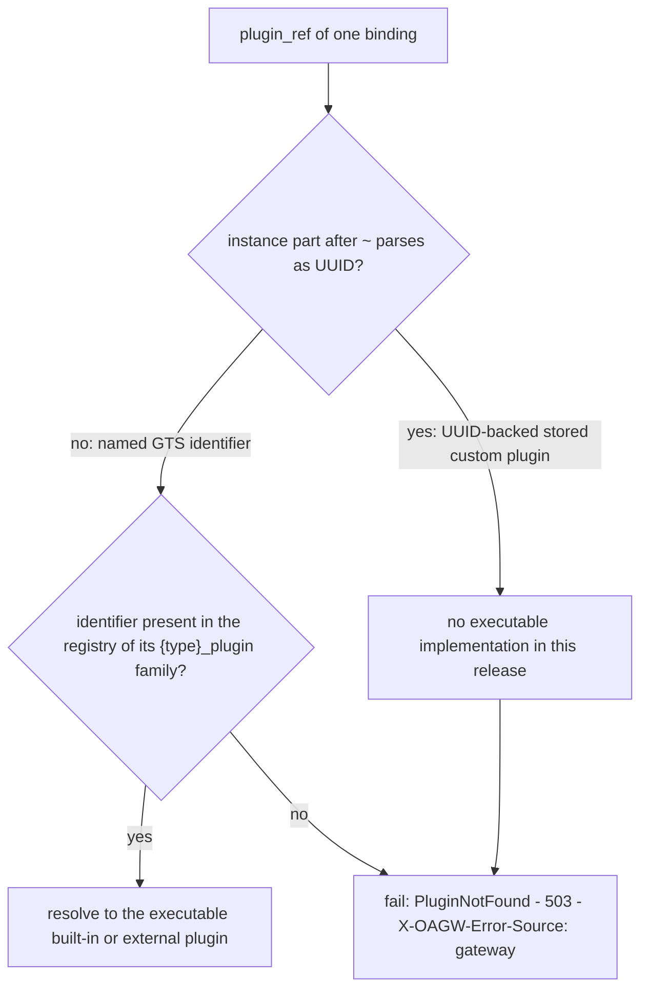

# Feature: Plugin System and Built-in Plugins

<!-- toc -->

- [1. Feature Context](#1-feature-context)
  - [1.1 Overview](#11-overview)
  - [1.2 Purpose](#12-purpose)
  - [1.3 Actors](#13-actors)
  - [1.4 References](#14-references)
  - [1.5 Feature-Local Deviations](#15-feature-local-deviations)
- [2. Actor Flows (CDSL)](#2-actor-flows-cdsl)
  - [Plugin Registry Construction at Gear Init](#plugin-registry-construction-at-gear-init)
  - [Execution Plan for a Binding Set](#execution-plan-for-a-binding-set)
  - [Auth Phase for a Proxied Request](#auth-phase-for-a-proxied-request)
  - [Guard and Transform Phases for the Same Request](#guard-and-transform-phases-for-the-same-request)
- [3. Processes / Business Logic (CDSL)](#3-processes--business-logic-cdsl)
  - [Plugin Binding Resolution](#plugin-binding-resolution)
  - [OAuth2 Client Credentials Token Acquisition with Cache](#oauth2-client-credentials-token-acquisition-with-cache)
  - [API Key Credential Injection](#api-key-credential-injection)
  - [Required Headers Guard Decision](#required-headers-guard-decision)
  - [Request-ID Transform](#request-id-transform)
- [4. States (CDSL)](#4-states-cdsl)
  - [Token Cache Entry State Machine](#token-cache-entry-state-machine)
- [5. Definitions of Done](#5-definitions-of-done)
  - [Plugin Traits](#plugin-traits)
  - [Plugin Registries](#plugin-registries)
  - [Built-in Plugin Behaviors](#built-in-plugin-behaviors)
  - [OAuth2 Client Credentials Token Cache](#oauth2-client-credentials-token-cache)
  - [Deterministic Execution Order](#deterministic-execution-order)
  - [Credential Isolation](#credential-isolation)
- [6. Acceptance Criteria](#6-acceptance-criteria)

<!-- /toc -->

- [x] `p1` - **ID**: `cpt-cf-oagw-featstatus-plugin-chain-implemented`

<!-- reference to DECOMPOSITION entry -->
`p2` - `cpt-cf-oagw-feature-plugin-chain`

DECOMPOSITION entry 2.5 "Plugin System and Built-in Plugins" orders this feature and the text of that entry is the authority for this document's scope: the Purpose, Scope and Out-of-scope bullets below are that entry's and are implemented without widening or narrowing them, and feature progress for this document is owned by the `featstatus` line above.
## 1. Feature Context

### 1.1 Overview

This feature implements the plugin chain of the `oagw` gear: the three plugin traits `AuthPlugin`, `GuardPlugin` and `TransformPlugin` with the exact signatures of `cpt-cf-oagw-adr-plugin-system`, the three registries that resolve a binding's `plugin_ref` to an executable plugin (`AuthPluginRegistry::with_builtins`, `GuardPluginRegistry::with_builtins`, `TransformPluginRegistry::with_builtins`), and the six executable built-in plugins — auth `noop`, `apikey`, `oauth2_client_cred` and `oauth2_client_cred_basic` (the last two being the `Form` and `Basic` variants of one OAuth2 client-credentials implementation with an internal token cache), guard `required_headers`, and transform `request_id`. It also owns the one rule the proxy path depends on for determinism: the execution order Auth → Guards → Transform(on_request) → upstream call → Transform(on_response / on_error), with upstream-level plugins before route-level plugins at every phase, and it exposes, for a given binding set, the deterministic execution plan that realises that rule.

The traits live under `src/domain/plugin/` and the registries and built-in implementations under `src/infra/plugin/`, under the `src/domain/` and `src/infra/` parents that the crate layout of `cpt-cf-oagw-dod-crate-layout` in `cpt-cf-oagw-feature-gear-wiring` stands up and that DESIGN's gear structure names as `domain/plugin/` and `infra/plugin/`. The feature performs no HTTP proxying, matches no route and registers no HTTP route of its own: `cpt-cf-oagw-feature-proxy-pipeline` is the caller that drives the phases per request and performs the upstream call, and this feature hands it the prepared context and the execution plan. Credential isolation is a property of the whole chain rather than of one plugin: secrets exist only as `SecretString` values resolved from the `cred_store` client at request time, configuration carries only `cred://` references, and no secret material reaches a log line, an error variant or a response body.

The diagram below is the `plugin_ref` resolution decision tree of `cpt-cf-oagw-algo-registry-resolution` — how one binding's `plugin_ref` reaches an executable plugin or the `PluginNotFound` failure — and it is the only diagram in this document: it does not show the execution order of §2, the token-cache state machine of §4, or any of the built-in plugin algorithms of §3, whose step lists carry that control flow.

### 1.2 Purpose

This feature bridges DECOMPOSITION entry 2.5 "Plugin System and Built-in Plugins" into an implementation contract. It exists so that the gear has exactly one place where a plugin binding becomes an executable behaviour and exactly one execution-order rule: `cpt-cf-oagw-feature-proxy-pipeline` consumes the traits, the registries and the execution plan of this feature on every proxied request and never resolves a plugin, orders a phase or maps a plugin failure on its own.

**Requirements**:

- [ ] `p2` - `cpt-cf-oagw-fr-plugin-system` — the three plugin types with separate traits and the deterministic execution order (Auth → Guards → Transform(request) → upstream call → Transform(response/error), upstream plugins before route plugins) are the trait set, the registry set and the execution plan this feature delivers; plugin definitions stay immutable after creation, so this feature defines no update path and binds only references.
- [ ] `p2` - `cpt-cf-oagw-fr-builtin-plugins` — the four auth, one guard and one transform built-ins are implemented and registered under their full named GTS identifiers, while the six catalog-only identifiers (`basic`, `bearer`, `timeout`, `cors`, `logging`, `metrics`) stay unresolvable through every registry.
- [ ] `p1` - `cpt-cf-oagw-fr-auth-injection` — credential injection into outbound requests is what `cpt-cf-oagw-flow-auth-phase`, `cpt-cf-oagw-algo-apikey-injection` and `cpt-cf-oagw-algo-oauth2-token-acquisition` perform: every credential is retrieved from the credential store at request time through its reference, never from configuration.
- [ ] `p3` - `cpt-cf-oagw-nfr-starlark-sandbox` — covered by absence in this release (recorded as the §1.5 deviation: it removes a capability DESIGN's Plugin System subsection describes): no Starlark execution path exists, so the sandbox invariants hold vacuously and the trait/registry surface deliberately exposes no hook that could execute plugin source; introducing one requires revisiting this requirement first (§1.5).
- [ ] `p1` - `cpt-cf-oagw-nfr-credential-isolation` — zero credential exposure in any log, error or API output is the property `cpt-cf-oagw-dod-credential-isolation` implements across the whole chain: `SecretString` handling, `cred://`-only configuration, no secret in any failure message.
- [ ] `p1` - `cpt-cf-oagw-contract-cred-store` — the `cred_store` SDK client is the only secret source of this feature: `cpt-cf-oagw-algo-apikey-injection` and `cpt-cf-oagw-algo-oauth2-token-acquisition` resolve `cred://` references through it at request time, in-process, per the PRD contract.

**Principles**: `p1` - `cpt-cf-oagw-principle-cred-isolation` (secrets are referenced through `cred://` URIs and are never stored or logged by the gateway — the property the whole chain implements, not only its auth plugins).

**Constraints**: `p1` - `cpt-cf-oagw-constraint-toolkit-deploy` (single-executable deployment via ToolKit: the registries are constructed inside the gear `init()` of the gear-wiring feature and the external plugins a ToolKit gear supplies at init are registered identically to built-ins; no dynamic loading and no runtime plugin installation exist).

**Components**: `p1` - `cpt-cf-oagw-component-model` — the Plugin System subsection of that component model is what this feature implements: the three plugin types with separate traits, the built-in list, the catalog-only identifier list and the execution-order statement.

**Sequences**: `p1` - `cpt-cf-oagw-seq-proxy-flow` — owned stage-wise per DECOMPOSITION; this feature owns the plugin stages of that sequence (the auth-injection, guard and transform stages before and after the upstream call) and the proxy pipeline owns orchestration and the endpoint-selection stages.

**API**: None — this feature registers no HTTP route and owns no endpoint of the gear; every Touches line of §5 repeats the declaration.

**Data**: None — this feature creates no table, no schema and no persistence object; the token cache is in-process memory owned by one plugin, and the plugin bindings it resolves are stored by `cpt-cf-oagw-feature-domain-model` and created by `cpt-cf-oagw-feature-management-api`.

### 1.3 Actors

| Actor | Role in Feature |
|-------|-----------------|
| `cpt-cf-oagw-actor-platform-operator` | Starts the gateway process; the registries and their built-ins are constructed during the `init()` performed on the operator's behalf, and an unresolvable credential dependency at that point aborts startup with the typed startup error surface of the gear-wiring feature. |
| `cpt-cf-oagw-actor-tenant-admin` | Supplies the plugin bindings (auth plugin identity, guard and transform `plugin_ref` entries with their `config` objects) that this feature resolves into an execution plan, and owns correcting the plugin configuration that a request-time 400 `ValidationError` names for a binding they configured. |
| `cpt-cf-oagw-actor-app-developer` | Consumer of the proxy path; never calls this feature directly. Sees only the outcomes the chain produces on the proxy response: an injected credential that the upstream accepts, a 400 configuration failure for a binding a tenant admin configured, a 400 or 502 guard rejection, or the 503 `PluginNotFound` answer for an upstream whose binding resolves to no executable plugin. |
| `cpt-cf-oagw-actor-cred-store` | Resolves the `cred://` references of the `apikey` and both OAuth2 bindings into `SecretString` values at request time; the only actor in the system that sees secret material, and the reason no other component of this feature ever holds a secret outside a `SecretString`. |

No actor invokes a trait method or a registry lookup directly: the proxy pipeline of `cpt-cf-oagw-feature-proxy-pipeline` is the caller of `cpt-cf-oagw-flow-execution-plan`, `cpt-cf-oagw-flow-auth-phase` and `cpt-cf-oagw-flow-guard-transform-phase`, so Flows B, C and D below are narrated from the application developer's viewpoint as the initiator of the proxied request, with the proxy pipeline as the caller of every one of their steps, while Flow A is narrated from the platform operator's viewpoint and is called by the gear `init()` the ToolKit runtime performs.

### 1.4 References

- **PRD**: [PRD.md](../PRD.md) — `cpt-cf-oagw-fr-plugin-system`, `cpt-cf-oagw-fr-builtin-plugins`, `cpt-cf-oagw-fr-auth-injection`, `cpt-cf-oagw-nfr-starlark-sandbox`, `cpt-cf-oagw-nfr-credential-isolation`, `cpt-cf-oagw-contract-cred-store`, the use case `cpt-cf-oagw-usecase-proxy-request` (whose "System executes plugin chain" step this feature implements) and the actors `cpt-cf-oagw-actor-platform-operator`, `cpt-cf-oagw-actor-tenant-admin`, `cpt-cf-oagw-actor-app-developer`, `cpt-cf-oagw-actor-cred-store`
- **Design**: [DESIGN.md](../DESIGN.md) — `cpt-cf-oagw-component-model` (the Plugin System subsection: three types, execution order, built-in list, catalog-only identifier list), the "Plugin Schemas" section of `cpt-cf-oagw-design-domain-model` with its "Plugin Identification Model" and Resolution Algorithm, `cpt-cf-oagw-principle-cred-isolation`, `cpt-cf-oagw-constraint-toolkit-deploy`, and `cpt-cf-oagw-seq-proxy-flow` (the plugin stages of the proxy request flow)
- **Decomposition**: [DECOMPOSITION.md](../DECOMPOSITION.md) — entry 2.5 "Plugin System and Built-in Plugins" and the "Spec corrections applied" block in its overview (correction 4 applies to this feature)
- **ADR**: [ADR/0002-plugin-system.md](../ADR/0002-plugin-system.md) (`cpt-cf-oagw-adr-plugin-system`) — the three trait signatures, the execution order, the built-in list and the plugin loading pattern; [ADR/0008-oauth2-client-credentials-auth-plugin.md](../ADR/0008-oauth2-client-credentials-auth-plugin.md) (`cpt-cf-oagw-adr-oauth2-client-credentials-auth-plugin`) — the two variants, the config keys, the gear-level `TokenCacheConfig` keys, the cache key design, the `CachedToken` verification, the authentication flow and the TTL rule; [ADR/0009-required-headers-guard-plugin.md](../ADR/0009-required-headers-guard-plugin.md) (`cpt-cf-oagw-adr-required-headers-guard-plugin`) — the guard config keys, the decision flow, the 400/502 phase statuses and the fail-open rule
- **Dependencies**:
  - [ ] `p2` - `cpt-cf-oagw-feature-domain-model` — a direct dependency of DECOMPOSITION entry 2.5: the `Plugin` aggregate and the binding model this feature resolves (`plugin_ref` always present, `plugin_uuid` derived only when the reference is UUID-backed, per `cpt-cf-oagw-dod-plugin-identity`), the `Upstream`/`Route` aggregates whose `plugins` and `auth` config blocks carry the bindings, and the closed `DomainError` violation-kind list this feature maps no new kind onto.
  - [ ] `p2` - `cpt-cf-oagw-feature-gear-wiring` — the other direct dependency of the same entry: the crate skeleton whose `src/domain/` and `src/infra/` parents `cpt-cf-oagw-dod-crate-layout` stands up, the parents of the `plugin/` subdirectories DESIGN's gear structure assigns to this feature, the `OagwConfig` keys `token_cache_ttl_secs` and `token_cache_capacity` with their defaults (300 and 10000) that `cpt-cf-oagw-algo-config-load` owns, the problem+json error contract and the closed 22-row `cpt-cf-oagw-algo-error-mapping` table every failure of this feature is rendered through, and the `cred_store` client resolution of `cpt-cf-oagw-dod-dependency-wiring`.
- **Reverse dependents**: `cpt-cf-oagw-feature-proxy-pipeline` is the direct dependent in the DECOMPOSITION feature graph (the edge `plugin-chain → proxy-pipeline`): it is the caller that drives the phases per request, performs the HTTP call and renders the outcomes this feature produces. `cpt-cf-oagw-feature-streaming-proxy` and `cpt-cf-oagw-feature-observability` sit downstream of that pipeline and reach the plugin stages of `cpt-cf-oagw-seq-proxy-flow` only through it. `cpt-cf-oagw-feature-management-api` creates the bindings this feature resolves but is not a dependent — its direct dependency is `cpt-cf-oagw-feature-alias-resolution`, and it reaches `cpt-cf-oagw-feature-domain-model` and `cpt-cf-oagw-feature-gear-wiring` transitively, which is the direct-versus-transitive marking that feature declares. None of these features may re-declare a trait, a registry, a built-in behaviour or an ordering rule defined here.
- **API and data declarations**: API: None and Data: None, as the DECOMPOSITION entry records them and as §1.2 and the Touches lines of §5 carry.

### 1.5 Feature-Local Deviations

Deviations from the supplied spec/platform baseline, recorded per the shared-baseline policy.

**Conformance (not a deviation)** — the three trait signatures use `RequestContext`, `ResponseContext` and `ErrorContext` exactly as `cpt-cf-oagw-adr-plugin-system` declares them and as DECOMPOSITION entry 2.5 lists the entities. ADR 0008's prose names the auth-phase parameter `AuthContext`; that is a naming variance inside the ADR set, and this feature records the conformance note that `AuthContext` in ADR 0008 maps onto the `RequestContext` of the ADR 0002 signature — there is no second context type, and no `AuthContext` type is introduced.
**Rationale** — two context types for one phase would fork the request state that the proxy pipeline hands to every plugin; the ADR 0002 signature is the one DECOMPOSITION entry 2.5 binds this feature to.
**Review owner**: `cf-generate-author-senior via cf-write-docs review loop`

**Deviation** — the three registries are keyed by the full named GTS identifier form `gts.cf.core.oagw.{type}_plugin.v1~cf.core.oagw.{name}.v1`, so a binding's `plugin_ref` resolves by direct lookup. ADR 0002's `auth_plugins.insert("apikey", …)` loading example uses short names illustratively and is not the key form this feature registers. The six catalog-only identifiers (`cf.core.oagw.basic.v1`, `cf.core.oagw.bearer.v1`, `cf.core.oagw.timeout.v1`, `cf.core.oagw.cors.v1`, `cf.core.oagw.logging.v1`, `cf.core.oagw.metrics.v1`) exist only in the types-registry catalog and are absent from every registry, so a lookup with one of them fails exactly like any unknown identifier. The registry is selected by the identifier's type family (the part before `~`).
**Rationale** — DESIGN's Plugin Identification Model makes the full GTS identifier the canonical `plugin_ref` that bindings store, and DESIGN and the PRD both state that the catalog-only identifiers are not resolvable through a registry; a short-name key would need a second identifier form and a second mapping no upstream document defines.
**Review owner**: `cf-generate-author-senior via cf-write-docs review loop`

**Deviation** — request-time behaviour of a UUID-backed binding: a `plugin_ref` whose instance part is a UUID (a stored custom plugin) has no executable implementation in this release, so resolution treats it as unresolvable and the chain fails the request with the existing `PluginNotFound` variant — HTTP 503, GTS type `gts.cf.core.errors.err.v1~cf.oagw.plugin.not_found.v1`, `X-OAGW-Error-Source: gateway` — rather than silently skipping the plugin. Any `plugin_ref` that resolves in no registry fails the same way. The UUID-backed store path exists for the management surface of `cpt-cf-oagw-feature-management-api`, not for execution. No upstream document states request-time behaviour for a UUID-backed binding; this is the declared interpretation that keeps a mis-bound plugin observable instead of silently absent.
**Rationale** — DECOMPOSITION correction 4 removes the Starlark execution engine, so "custom plugins remain first-class CRUD resources" is the whole of what survives for them this release; silently skipping a bound plugin would make a stored-but-unexecutable binding indistinguishable from a request that never reached its plugin, which would break the determinism the execution order is meant to guarantee.
**Review owner**: `cf-generate-author-senior via cf-write-docs review loop`

**Conformance (not a deviation)** — ownership split with the proxy pipeline of DECOMPOSITION entry 2.8: this feature owns the ordering rule and exposes, for a given binding set, the deterministic execution plan (auth → guards → transform-on_request, then after the upstream call transform-on_response / transform-on_error; upstream-level plugins before route-level plugins at every phase, each tier in binding-position order). The proxy pipeline is the caller that drives the phases per request and performs the HTTP call. This feature performs no HTTP proxying, owns no route matching, resolves no alias and owns no stage of `cpt-cf-oagw-seq-proxy-flow` other than the plugin stages.
**Rationale** — DECOMPOSITION entry 2.5 lists "Plugin chain execution in order" as the pipeline's scope and the traits, registries and built-ins as this feature's scope; recording the split keeps the phase driver and the phase implementations apart so neither re-states the other's rule.
**Review owner**: `cf-generate-author-senior via cf-write-docs review loop`

**Conformance (not a deviation)** — failure mapping: this feature adds no row to the 22-row mapping table of `cpt-cf-oagw-algo-error-mapping` and maps its failures onto existing rows only. An unresolvable plugin (named identifier absent from its registry, catalog-only identifier, or UUID-backed reference) → `PluginNotFound` (503, `gts.cf.core.errors.err.v1~cf.oagw.plugin.not_found.v1`); a `cred://` reference that does not resolve → `SecretNotFound` (500, `gts.cf.core.errors.err.v1~cf.oagw.secret.not_found.v1`); the credential store or the IdP unreachable → `LinkUnavailable` (503, `gts.cf.core.errors.err.v1~cf.oagw.link.unavailable.v1`); a plugin configuration that is unusable at request time (both or neither of `token_endpoint`/`issuer_url`, a missing `client_id_ref` or `client_secret_ref`, both or neither of `key_header`/`key_query`, or a malformed `cred://` form) → `ValidationError` (400, the general `gts.cf.core.errors.err.v1~cf.oagw.validation.error.v1` type). A guard rejection is not an error-mapping event: it produces the ADR 0009 phase status (400 in the request phase, 502 in the response phase) with `error_code` `REQUIRED_HEADER_MISSING`, rendered through the same problem+json contract — the request-phase 400 carries the general validation type the 400 rows already use and the response-phase 502 carries the existing `ProtocolError` type `gts.cf.core.errors.err.v1~cf.oagw.protocol.error.v1`, the 502 row the mapping table already assigns to a protocol-level upstream failure. `AuthenticationFailed` (401) is reserved for the upstream rejecting injected credentials and is out of scope here: ADR 0008 explicitly defers retry-on-upstream-401.
**Rationale** — `cpt-cf-oagw-dod-domain-error` of the domain-model feature and `cpt-cf-oagw-dod-gear-registration` of the gear-wiring feature both declare their error vocabulary closed for this release, so a plugin failure that invented a row would break the one contract every oagw error is rendered through; the four existing rows above already carry exactly these failure classes, and the guard rejection is a plugin decision rather than an `OagwError` variant, so it carries its ADR-specified status and `error_code` directly. (the `error_code` member's presence in the rendered body is the deviation recorded immediately below)
**Review owner**: `cf-generate-author-senior via cf-write-docs review loop`

**Deviation** — the guard-rejection body carries `error_code` `REQUIRED_HEADER_MISSING` as an additional problem+json member on top of the extension fields the problem+json contract of the gear-wiring feature declares, in the request phase (400) and the response phase (502) alike. No row is added to the 22-row mapping table of `cpt-cf-oagw-algo-error-mapping` for it, and no other failure of this feature gains the member.
**Rationale** — ADR 0009's decision flow makes `error_code` part of the rejection the guard plugin returns, and the ADR is the authority for the guard outcome; the gear-wiring contract declares a closed field set that does not include the member, so the addition is recorded here rather than silently assumed.
**Review owner**: `cf-generate-author-senior via cf-write-docs review loop`

**Deviation** — API-key plugin configuration keys: no upstream document names them, so this feature declares `secret_ref` (a `cred://` reference, resolved through the `cred_store` client at request time) and exactly one injection target — `key_header` (header name to inject into) or `key_query` (query parameter name). The resolved secret is injected verbatim as the value; it is never transformed, prefixed or truncated.
**Rationale** — ADR 0002 lists `ApiKeyAuthPlugin` as "API key injection (header/query)" and `cpt-cf-oagw-fr-builtin-plugins` describes the plugin as "API key injection (header/query)" without naming keys, while `cpt-cf-oagw-fr-auth-injection` requires that credentials are retrieved from the credential store at request time; the two-key shape is the smallest one that satisfies both statements and keeps the injection target explicit rather than inferred from a single ambiguous key.
**Review owner**: `cf-generate-author-senior via cf-write-docs review loop`

**Conformance (not a deviation)** — OAuth2 configuration validation and cache behaviour at request time: `token_endpoint` and `issuer_url` are mutually exclusive and exactly one is required; `client_id_ref` and `client_secret_ref` are required `cred://` references; `scopes` is optional and space-separated. The cache key is the ADR 0008 four-component string (subject tenant id, subject id, auth-method tag, deterministic hash of the sorted config), stored via a `CachedToken` wrapper whose key is verified on hit so a hash collision degrades to a miss, never to another tenant's token. The TTL is `min(config_ttl, expires_in − 30s)`; a token whose `expires_in` is at or below 30 seconds is not cached; a failed fetch is never cached. Both `Form` and `Basic` variants are registered as separate plugin ids. `pingora-memory-cache` is the declared cache (already a crate dependency) and `toolkit_auth::oauth2::fetch_token` is the declared fetch path; no background watcher is spawned.
**Rationale** — ADR 0008 states the mutual exclusion, the required references, the optional space-separated scopes, the four key components, the `CachedToken` verification, the TTL formula, the no-cached-failure rule, the two registered variants and the "no background watcher" property; this entry binds them to request-time behaviour so §3 and §6 can assert each one.
**Review owner**: `cf-generate-author-senior via cf-write-docs review loop`

**Conformance (not a deviation)** — `TokenCacheConfig` ownership split: `cpt-cf-oagw-feature-gear-wiring` declares the two configuration keys and their defaults (`token_cache_ttl_secs` = 300, `token_cache_capacity` = 10000) in `cpt-cf-oagw-algo-config-load`; this feature owns the `TokenCacheConfig` parameter object that threads them from the configuration into `AuthPluginRegistry::with_builtins` and the plugin constructors, exactly as ADR 0008's "Gear-Level Configuration" section describes. The same constructor also takes ADR 0008's `token_http_config` IdP HTTP client parameter, which no `OagwConfig` key of the gear-wiring feature names and which this release supplies as `None`, exactly as the ADR's gear-level configuration shows.
**Rationale** — the split mirrors the ADR, which bundles the two keys into one struct and threads it through `DataPlaneServiceImpl::new()` → `AuthPluginRegistry::with_builtins()` → plugin constructors, and keeps the configuration surface owned by the feature that owns `OagwConfig`.
**Review owner**: `cf-generate-author-senior via cf-write-docs review loop`

**Conformance (not a deviation)** — registry construction accepts external plugins: per ADR 0002's loading pattern and `cpt-cf-oagw-constraint-toolkit-deploy`, the `with_builtins` constructors register the built-ins and accept the external plugins that a ToolKit gear supplies at init, registered identically to built-ins under the ids the plugins themselves declare. There is no dynamic loading and no runtime plugin installation: after `init()` returns, no registration path exists and none is reachable from a request. An external plugin registered under an identifier a built-in already holds replaces that entry, which is the map-insertion pattern ADR 0002's loading example shows.
**Rationale** — ADR 0002's decision drivers require the same traits and the same registration for built-in and external plugins, and the ToolKit supplies external plugins at init rather than through a request-time mechanism.
**Review owner**: `cf-generate-author-senior via cf-write-docs review loop`

**Deviation** — `RequestIdTransformPlugin` semantics: phases `on_request` and `on_response` per the DESIGN phase table. In the request phase, if `X-Request-ID` is absent the plugin generates a UUID v4 and sets it; an incoming `X-Request-ID` is never rewritten. In the response phase, if the upstream did not set `X-Request-ID`, the plugin copies the request's value onto the response; an upstream-supplied value is left as-is. In the error phase the plugin mutates nothing, because the DESIGN phase table declares the request and response phases only for this identifier.
**Rationale** — DESIGN and the PRD name the plugin "X-Request-ID injection/propagation" and pin its phases to request and response, but state neither the generate rule nor the propagate rule; the two rules above are the smallest pair that makes the identifier present on every proxied request and its response without ever destroying a value a caller or an upstream chose.
**Review owner**: `cf-generate-author-senior via cf-write-docs review loop`

**Deviation** — no Starlark execution engine exists in this release, so no custom plugin is executable and the sandbox limits of `cpt-cf-oagw-nfr-starlark-sandbox` (no network or file I/O, no imports, timeout ≤ 100 ms, memory ≤ 10 MB per invocation) have no executable object to constrain.
**Rationale** — DECOMPOSITION correction 4 defers Starlark custom-plugin execution while custom plugins remain first-class CRUD resources in `cpt-cf-oagw-feature-management-api`; the sandbox requirement is therefore covered by absence — the invariant "zero sandbox escapes" is satisfied because there is no interpreter to escape, and the trait/registry surface deliberately exposes no hook that could execute plugin source. Introducing one requires revisiting `cpt-cf-oagw-nfr-starlark-sandbox` first. This is a conformance statement about the sandbox invariant, recorded as a deviation because it removes a capability DESIGN's Plugin System subsection describes.
**Review owner**: `cf-generate-author-senior via cf-write-docs review loop`

**Conformance (not a deviation)** — secret handling: secrets exist only as `SecretString` values resolved from the `cred_store` client at request time; they are never logged, never serialized into an error, an API response or a problem+json `detail` field, and never stored beyond the cache entry the OAuth2 plugin owns, which is zeroed on eviction through the `SecretString` drop semantics. Configuration carries only `cred://` references. `AuthenticationFailed` and every other mapped failure message of this feature echo no credential material.
**Rationale** — this is `cpt-cf-oagw-principle-cred-isolation` and `cpt-cf-oagw-nfr-credential-isolation` applied to the one feature that touches secret material at request time; recording it here keeps the property testable from this document's §6 rather than only from the principle statement.
**Review owner**: `cf-generate-author-senior via cf-write-docs review loop`

**Out of scope** — the Starlark custom-plugin execution engine (DECOMPOSITION correction 4, and the deviation above); circuit breaker, CORS and request-timeout enforcement — the circuit-breaker mechanism is deferred by DECOMPOSITION correction 4 and its `CircuitBreakerOpen` mapping row stays reserved, while CORS and request-timeout are core data-plane logic of `cpt-cf-oagw-feature-proxy-pipeline`; all three identifiers are catalog-only here; the plugin management CRUD endpoints and the `PluginInUse` 409, owned by `cpt-cf-oagw-feature-management-api`; the persistence of plugin bindings and the `plugin_ref`/`plugin_uuid` binding model, owned by `cpt-cf-oagw-feature-domain-model`; the phase driving per request, route matching, alias resolution and the upstream HTTP call, owned by `cpt-cf-oagw-feature-proxy-pipeline`; metric and audit emission for the plugin stages, owned by `cpt-cf-oagw-feature-observability`; and retry after an upstream 401, deferred by ADR 0008.
**Rationale** — DECOMPOSITION entry 2.5 lists the first two in its out-of-scope bullets, and the remaining dispositions follow from the ownership splits recorded above; none of them is implemented by this feature and none of them is re-declared by it.
**Review owner**: `cf-generate-author-senior via cf-write-docs review loop`

**Not applicable because** — the remaining checklist areas have no object in this feature:

- **Data model and persistence** — the chain holds no aggregate of its own: the `Plugin` aggregate, the binding model and the repository traits are owned by `cpt-cf-oagw-feature-domain-model`, and the only state this feature owns is the in-process token cache of §4, which is never persisted and does not survive a process restart.
- **Configuration surface** — the two token-cache keys and every other `OagwConfig` key are owned by `cpt-cf-oagw-feature-gear-wiring`; this feature owns the parameter object that carries them (`TokenCacheConfig`) and no configuration key of its own.
- **Internationalisation and accessibility** — the feature exposes no user interface and no actor-facing text of its own; the only wording a caller sees arrives inside a problem+json `detail` field rendered by the error contract of the gear-wiring feature.
- **Regulatory compliance** — no data subject to a compliance regime crosses the chain: it moves request headers, query parameters and secret references, stores no record, writes no audit entry and holds no personal data beyond the subject identifiers that isolate cache entries.
- **Rollout and rollback** — the registries are constructed during the gear `init()` of the gear-wiring feature and carry no feature flag, no migration and no deployable unit of their own; disabling a plugin is a configuration change to a binding, not a staged rollout.
- **Usability** — the observable surface is the proxy response a caller already receives from `cpt-cf-oagw-feature-proxy-pipeline`; this feature adds no surface to evaluate for usability.
- **Performance** — the token cache is a latency feature, but no upstream document sets a hit-rate, latency or throughput target for the chain; this feature declares the cache's functional semantics (§3, §4) and no performance budget of its own.
- **Test targets** — the unit-testable boundaries are `cpt-cf-oagw-algo-registry-resolution`, `cpt-cf-oagw-algo-oauth2-token-acquisition`, `cpt-cf-oagw-algo-apikey-injection`, `cpt-cf-oagw-algo-required-headers-guard` and `cpt-cf-oagw-algo-request-id-transform`, plus the execution plan of `cpt-cf-oagw-flow-execution-plan`; the end-to-end coverage of the phases on live proxy traffic is owned by `cpt-cf-oagw-feature-proxy-pipeline`, which is the caller.

## 2. Actor Flows (CDSL)

Interactions that start with an actor and describe the end-to-end flow. Flow A is the only flow an actor reaches directly, and only through the gear `init()` the ToolKit runtime performs on the platform operator's behalf; Flows B, C and D are called per proxied request by the proxy pipeline of `cpt-cf-oagw-feature-proxy-pipeline`, which is the caller of every step and the performer of the upstream HTTP call. No flow of this feature opens an HTTP route, and no flow performs an upstream call.

**Use cases**: `p1` - `cpt-cf-oagw-usecase-proxy-request` (the "System executes plugin chain" step of that use case is this feature's three per-request flows, `cpt-cf-oagw-flow-execution-plan`, `cpt-cf-oagw-flow-auth-phase` and `cpt-cf-oagw-flow-guard-transform-phase`; `cpt-cf-oagw-flow-registry-init` runs at gear `init()`)

### Plugin Registry Construction at Gear Init

- [x] `p1` - **ID**: `cpt-cf-oagw-flow-registry-init`

**Actor**: `cpt-cf-oagw-actor-platform-operator`

**Success Scenarios**:

- The three registries are constructed during gear `init()` with their built-ins registered under their full named GTS identifiers: four auth plugins (`noop`, `apikey`, `oauth2_client_cred` in its `Form` variant, `oauth2_client_cred_basic` in its `Basic` variant), one guard plugin (`required_headers`) and one transform plugin (`request_id`).
- The external plugins a ToolKit gear supplies at init are registered into the same registries, identically to built-ins, and are resolvable under the identifiers they declare.
- The two token-cache settings reach the OAuth2 plugin constructors through one `TokenCacheConfig` object, so the cache the plugin owns is sized and bounded by gear configuration and not by a plugin-local default.

**Error Scenarios**:

- An unresolvable `cred_store` or `toolkit-auth` dependency aborts startup with the typed startup error surface of `cpt-cf-oagw-feature-gear-wiring`, and no registry is constructed.
- A registry is never constructed partially: a failure inside the auth registry construction leaves the gear without any of the three, so the proxy path cannot resolve half a chain.

**Steps**:

1. [x] - `p1` - Receive the gear `init()` invocation from the ToolKit runtime with the validated `OagwConfig` produced by `cpt-cf-oagw-algo-config-load` and the platform client hub, and read the two token-cache keys `token_cache_ttl_secs` (default 300) and `token_cache_capacity` (default 10000) - `inst-pi-01`
2. [x] - `p1` - Build the `TokenCacheConfig` parameter object from those two keys, bundling the TTL ceiling and the cache capacity exactly as ADR 0008's "Gear-Level Configuration" section defines them - `inst-pi-02`
3. [x] - `p1` - Take the `cred_store` SDK client that `cpt-cf-oagw-dod-dependency-wiring` of the gear-wiring feature already resolved through the toolkit client hub; this flow resolves no platform dependency of its own - `inst-pi-03`
4. [x] - `p1` - **IF** the platform client hub handed to `init()` does not carry the `cred_store` client or the `toolkit-auth` client the token fetch needs — a dependency-wiring failure `cpt-cf-oagw-dod-dependency-wiring` of the gear-wiring feature fails fast at startup, stated here so the flow is total - `inst-pi-04`
   1. [x] - `p1` - **CATCH** the resolution failure and abort startup with the typed startup error surface of `cpt-cf-oagw-feature-gear-wiring` — a `SecretNotFound` for an unresolvable credential dependency or a `LinkUnavailable` for an unreachable one, naming the missing dependency — and construct none of the three registries, so the failure surfaces at startup and not at request time - `inst-pi-05`
5. [x] - `p1` - **ELSE** construct `AuthPluginRegistry::with_builtins(cred_store, token_http_config, TokenCacheConfig)`, which registers the four auth built-ins under their full named GTS identifiers — `gts.cf.core.oagw.auth_plugin.v1~cf.core.oagw.noop.v1`, `gts.cf.core.oagw.auth_plugin.v1~cf.core.oagw.apikey.v1`, `gts.cf.core.oagw.auth_plugin.v1~cf.core.oagw.oauth2_client_cred.v1` (Form) and `gts.cf.core.oagw.auth_plugin.v1~cf.core.oagw.oauth2_client_cred_basic.v1` (Basic) - `inst-pi-06`
6. [x] - `p1` - Construct `GuardPluginRegistry::with_builtins()`, registering `gts.cf.core.oagw.guard_plugin.v1~cf.core.oagw.required_headers.v1` as its only entry - `inst-pi-07`
7. [x] - `p1` - Construct `TransformPluginRegistry::with_builtins()`, registering `gts.cf.core.oagw.transform_plugin.v1~cf.core.oagw.request_id.v1` as its only entry - `inst-pi-08`
8. [x] - `p1` - Register the external plugins a ToolKit gear supplies at init into the same three registries, under the identifiers the plugins themselves declare and identically to the built-ins; no registration path exists after init and none is reachable from a request - `inst-pi-09`
9. [x] - `p1` - **RETURN** the three registries to the gear, whose completed `init()` is what lets the gear-wiring feature's `cpt-cf-oagw-state-gear-lifecycle` reach its `Ready` state; from that state the proxy pipeline resolves plugin bindings from them for the process lifetime - `inst-pi-10`

### Execution Plan for a Binding Set

- [x] `p1` - **ID**: `cpt-cf-oagw-flow-execution-plan`

**Actor**: `cpt-cf-oagw-actor-app-developer`

**Success Scenarios**:

- A binding set whose every `plugin_ref` resolves produces one deterministic execution plan: the single auth plugin, then the guards, then the transforms' request phase, and — after the caller's upstream call — the transforms' response phase, or the transforms' error phase when the call or an earlier phase failed.
- A binding set that mixes upstream-level and route-level plugins is ordered with the upstream-level plugins before the route-level plugins inside every tier, each tier keeping binding-position order, so `[U1, U2] + [R1, R2]` executes as `[U1, U2, R1, R2]`.

**Error Scenarios**:

- A `plugin_ref` that resolves in no registry — a named identifier absent from its registry, one of the six catalog-only identifiers, or a UUID-backed reference to a stored custom plugin — fails the request with `PluginNotFound` (503) and never silently skips the plugin.

**Steps**:

1. [x] - `p1` - Receive, from the proxy pipeline for one proxied request, the resolved binding set: the upstream's auth plugin identity (`auth_plugin_ref`, with `auth_plugin_uuid` when the reference is UUID-backed) and the ordered plugin bindings of the matched upstream and route, each carrying `plugin_ref`, the derived `plugin_uuid` when present, its `config` object and its `position`, together with the request's security context - `inst-px-01`
2. [x] - `p1` - Resolve the auth binding through `cpt-cf-oagw-algo-registry-resolution` against `AuthPluginRegistry` - `inst-px-02`
3. [x] - `p1` - **FOR EACH** guard binding of the merged upstream-and-route set, in binding-position order, resolve it through the same algorithm against `GuardPluginRegistry` - `inst-px-03`
4. [x] - `p1` - **FOR EACH** transform binding of the merged set, in binding-position order, resolve it through the same algorithm against `TransformPluginRegistry` - `inst-px-04`
5. [x] - `p1` - **IF** any resolution fails — a named identifier absent from its registry, a catalog-only identifier, or a UUID-backed reference with no executable implementation in this release - `inst-px-05`
   1. [x] - `p1` - **RETURN** the `PluginNotFound` failure to the caller: HTTP 503, GTS type `gts.cf.core.errors.err.v1~cf.oagw.plugin.not_found.v1`, `X-OAGW-Error-Source: gateway`, rendered by `cpt-cf-oagw-algo-error-mapping`; the plugin is never skipped and no partial plan is handed to the caller - `inst-px-06`
6. [x] - `p1` - **ELSE** assemble the deterministic execution plan: tier 1 the single auth plugin, tier 2 the guards, tier 3 the transforms' `on_request` phase, then — after the caller's upstream call — tier 4 the transforms' `on_response` phase, or tier 4 as `on_error` when the call or an earlier phase failed; within every tier the upstream-level plugins precede the route-level plugins and each tier keeps binding-position order - `inst-px-07`
7. [x] - `p1` - **RETURN** the execution plan to the proxy pipeline, which drives the phases per request and performs the HTTP call - `inst-px-08`

### Auth Phase for a Proxied Request

- [x] `p1` - **ID**: `cpt-cf-oagw-flow-auth-phase`

**Actor**: `cpt-cf-oagw-actor-app-developer`

**Success Scenarios**:

- An upstream bound to `noop` sends its request onward with the request context unchanged: no header, no query parameter and no credential is added.
- An upstream bound to `apikey` has the secret referenced by its `secret_ref` injected verbatim into the configured header or query parameter, resolved from `cpt-cf-oagw-actor-cred-store` at request time.
- An upstream bound to either OAuth2 variant has a bearer token injected, served from the plugin's internal cache when a valid entry exists for the request's (tenant, subject, auth-method, config) tuple and fetched from the IdP otherwise.

**Error Scenarios**:

- A plugin configuration that is unusable at request time is answered 400 with the general validation type, naming the offending key.
- A `cred://` reference that does not resolve is answered 500 `SecretNotFound`; an unreachable credential store or IdP is answered 503 `LinkUnavailable`.
- No failure path of this flow echoes credential material.

**Steps**:

1. [x] - `p1` - Send the proxied request whose upstream binds an auth plugin; the request reaches this phase through the proxy pipeline, which is the caller of the step and the only component that later performs the upstream call - `inst-au-01`
2. [x] - `p1` - Receive the prepared mutable `RequestContext`, the auth plugin resolved by `cpt-cf-oagw-flow-execution-plan` and its binding `config`, and invoke `authenticate(&mut RequestContext)` on the plugin - `inst-au-02`
3. [x] - `p1` - **IF** the resolved plugin is `NoopAuthPlugin` - `inst-au-03`
   1. [x] - `p1` - Leave the request context untouched and return success: no credential, no header and no query parameter is injected, so a `noop` binding is observable as an unchanged request - `inst-au-04`
4. [x] - `p1` - **ELSE IF** the resolved plugin is `ApiKeyAuthPlugin` - `inst-au-05`
   1. [x] - `p1` - Run `cpt-cf-oagw-algo-apikey-injection`, which resolves the `secret_ref` through the `cred_store` client and injects the value into the one configured target - `inst-au-06`
5. [x] - `p1` - **ELSE IF** the resolved plugin is `OAuth2ClientCredAuthPlugin` in its `Form` or `Basic` variant - `inst-au-07`
   1. [x] - `p1` - Run `cpt-cf-oagw-algo-oauth2-token-acquisition`, which validates the configuration, consults the internal token cache and injects the bearer token - `inst-au-08`
6. [x] - `p1` - **CATCH** the plugin failure and map it per the failure-mapping interpretation of §1.5 onto the existing rows of `cpt-cf-oagw-algo-error-mapping` — `PluginNotFound` 503, `SecretNotFound` 500, `LinkUnavailable` 503, `ValidationError` 400 — adding no row, and return the typed failure with a message that carries no credential material - `inst-au-09`
7. [x] - `p1` - **RETURN** the prepared context to the caller for the guard phase; no upstream HTTP call is performed in this flow - `inst-au-10`

### Guard and Transform Phases for the Same Request

- [x] `p1` - **ID**: `cpt-cf-oagw-flow-guard-transform-phase`

**Actor**: `cpt-cf-oagw-actor-app-developer`

**Success Scenarios**:

- The guard tier of the plan runs before any transform: a request whose required headers are all present continues to the transform tier and to the upstream call, and a response whose required headers are all present is returned to the caller.
- The transform tier establishes `X-Request-ID` on the request when it is absent, never rewrites an incoming one, and propagates the request's value onto the response when the upstream did not set one.

**Error Scenarios**:

- A guard rejection in the request phase is answered 400 with `error_code` `REQUIRED_HEADER_MISSING` and the first missing header name in `detail`; a rejection in the response phase is answered 502 with the same `error_code`. Neither rejection is an `OagwError` variant and neither adds a row to the mapping table.

**Steps**:

1. [x] - `p1` - Receive the prepared request context of the same request `cpt-cf-oagw-flow-auth-phase` returned, together with the guard tier and the transform tier of the execution plan and each plugin's binding `config` - `inst-gr-01`
2. [x] - `p1` - **FOR EACH** guard in the guard tier, in plan order, invoke `guard_request(&RequestContext)` and take its `GuardDecision`; an `Err` return of the guard invocation is a plugin failure rather than a rejection decision and is returned to the caller to be mapped per the failure-mapping interpretation of §1.5 - `inst-gr-02`
3. [x] - `p1` - **IF** a guard decision rejects, as decided by `cpt-cf-oagw-algo-required-headers-guard` - `inst-gr-03`
   1. [x] - `p1` - **RETURN** the rejection to the caller with the request-phase status 400, `error_code` `REQUIRED_HEADER_MISSING`, the first missing header name in `detail`, and `X-OAGW-Error-Source: gateway` rendered through the problem+json contract of the gear-wiring feature; no transform runs and no upstream call is made - `inst-gr-04`
4. [x] - `p1` - **ELSE** hand the request context to the transform tier - `inst-gr-05`
5. [x] - `p1` - **FOR EACH** transform in the transform tier, in plan order, invoke `transform_request(&mut RequestContext)`, applying `cpt-cf-oagw-algo-request-id-transform` for the request_id plugin - `inst-tr-01`
6. [x] - `p1` - **RETURN** the transformed request context to the caller, which performs the upstream HTTP call; this flow performs none - `inst-tr-02`
7. [x] - `p1` - **IF** the caller re-enters this flow in the response phase of the same request, receive the upstream `ResponseContext`, or the `ErrorContext` when the upstream call or an earlier phase failed - `inst-gr-06`
8. [x] - `p1` - **FOR EACH** guard in the guard tier, in plan order, invoke `guard_response(&ResponseContext)` and take its `GuardDecision`; an `Err` return of the guard invocation is a plugin failure rather than a rejection decision and is returned to the caller to be mapped per the failure-mapping interpretation of §1.5 - `inst-gr-07`
9. [x] - `p1` - **IF** a guard decision rejects in the response phase - `inst-gr-08`
   1. [x] - `p1` - **RETURN** the rejection with the response-phase status 502, the same `error_code` `REQUIRED_HEADER_MISSING`, the first missing header name in `detail` and `X-OAGW-Error-Source: gateway` - `inst-gr-09`
10. [x] - `p1` - **ELSE IF** the caller re-entered this flow with the upstream `ResponseContext` — invoke, for each transform in the transform tier in plan order, `transform_response(&mut ResponseContext)` on a response, applying the propagation rule of `cpt-cf-oagw-algo-request-id-transform` - `inst-tr-03`
11. [x] - `p1` - **ELSE** the caller re-entered this flow with the `ErrorContext` of a failed call or earlier phase — invoke, for each transform in the transform tier in plan order, `transform_error(&mut ErrorContext)` on a failure; for the request_id plugin this is the no-op its declared phase set implies - `inst-tr-04`
12. [x] - `p1` - **RETURN** the transformed response context or error context to the caller, which renders the outcome through the error contract of the gear-wiring feature; this flow renders no HTTP response of its own - `inst-tr-05`

## 3. Processes / Business Logic (CDSL)

Internal building blocks called by the flows above. None of them opens an HTTP route, none of them performs an upstream HTTP call, and none of them re-declares a validation rule, an error mapping or a configuration key owned by another feature; the request-time `cred://` form checks of `cpt-cf-oagw-algo-apikey-injection` and `cpt-cf-oagw-algo-oauth2-token-acquisition` re-apply the form `cpt-cf-oagw-algo-shape-validation` of the domain-model feature enforces at persist time without re-declaring it.

### Plugin Binding Resolution

- [x] `p2` - **ID**: `cpt-cf-oagw-algo-registry-resolution`

**Input**: one binding's `plugin_ref` (the full GTS identifier), the `plugin_uuid` derived from it when it is UUID-backed, the binding's `config` object, and the registry of the identifier's `{type}_plugin` family.

**Output**: the executable plugin together with the binding's config, or the `PluginNotFound` failure.

**Steps**:

1. [x] - `p1` - Select the registry from the identifier's type family, the part before `~`: `auth_plugin` resolves against `AuthPluginRegistry`, `guard_plugin` against `GuardPluginRegistry` and `transform_plugin` against `TransformPluginRegistry` - `inst-rr-01`
2. [x] - `p1` - Parse the identifier to extract the instance part after `~`, per the Resolution Algorithm of the Plugin Identification Model in `cpt-cf-oagw-design-domain-model` - `inst-rr-02`
3. [x] - `p1` - **IF** the instance part parses as a UUID, that is a UUID-backed reference to a stored custom plugin - `inst-rr-03`
   1. [x] - `p1` - **RETURN** the `PluginNotFound` failure, because DECOMPOSITION correction 4 removes the Starlark execution engine and this release has no executable implementation for a stored custom plugin; the store path exists for the management surface of `cpt-cf-oagw-feature-management-api`, not for execution, and this disposition is the declared interpretation of §1.5 - `inst-rr-04`
4. [x] - `p1` - **ELSE** look the full named identifier up in the selected registry, the key being the whole `gts.cf.core.oagw.{type}_plugin.v1~cf.core.oagw.{name}.v1` form so a binding's `plugin_ref` resolves by direct lookup - `inst-rr-05`
5. [x] - `p1` - **IF** the identifier is present in the registry - `inst-rr-06`
   1. [x] - `p1` - **RETURN** the executable plugin together with the binding's `config`, which the caller hands to the plugin at invocation - `inst-rr-07`
6. [x] - `p1` - **ELSE** the identifier is absent from the registry, including each of the six catalog-only identifiers, which no registry contains - `inst-rr-08`
   1. [x] - `p1` - **RETURN** the `PluginNotFound` failure, identical to the failure any unknown identifier produces, so a catalog-only identifier is not distinguishable at the wire from an unknown one - `inst-rr-09`
7. [x] - `p1` - **RETURN** in every case after a single lookup: there is no second resolution path, no fallback to another registry, no lazy construction and no registration from a request - `inst-rr-10`

### OAuth2 Client Credentials Token Acquisition with Cache

- [x] `p2` - **ID**: `cpt-cf-oagw-algo-oauth2-token-acquisition`

**Input**: the mutable `RequestContext`, the binding's `config` object, the plugin's client auth method (`Form` or `Basic`), the `cred_store` SDK client, and the `TokenCacheConfig` the plugin was constructed with.

**Output**: the context with `Authorization: Bearer <token>` injected, or the typed failure mapped per §1.5.

**Steps**:

1. [x] - `p1` - Parse the OAuth2 config keys: `token_endpoint` and `issuer_url` (mutually exclusive, exactly one required), `client_id_ref` and `client_secret_ref` (both required `cred://` references) and `scopes` (optional, space-separated) - `inst-tk-01`
   1. [x] - `p1` - **CATCH** a configuration that is unusable at request time — both or neither of `token_endpoint` and `issuer_url`, a missing `client_id_ref` or `client_secret_ref`, or a value that is not a `cred://` reference (the `cred://` form `cpt-cf-oagw-algo-shape-validation` already enforces at persist time) — and return the `ValidationError` failure (400, `gts.cf.core.errors.err.v1~cf.oagw.validation.error.v1`) naming the offending key and echoing no credential material - `inst-tk-02`
2. [x] - `p1` - Build the four-component cache key of ADR 0008: the subject tenant id, the subject id, the auth-method tag, and the deterministic hash of the sorted config key/value pairs - `inst-tk-03`
3. [x] - `p1` - Look the key up in the plugin's `pingora_memory_cache` instance - `inst-tk-04`
4. [x] - `p1` - **IF** the lookup hits **AND** the stored `CachedToken.key` equals the lookup key - `inst-tk-05`
   1. [x] - `p1` - Inject `Authorization: Bearer <token>` into the context headers and return success, with no IdP call and no credential-store lookup - `inst-tk-06`
5. [x] - `p1` - **ELSE IF** the lookup hits **AND** the stored key does not equal the lookup key - `inst-tk-07`
   1. [x] - `p1` - Treat the entry as a miss, discard it and continue to the fetch, so a hash collision degrades to a miss and never to another tenant's token - `inst-tk-08`
6. [x] - `p1` - Resolve `client_id_ref` and `client_secret_ref` through the `cred_store` client into `SecretString` values - `inst-tk-09`
   1. [x] - `p1` - **CATCH** a reference that does not resolve and return the `SecretNotFound` failure (500, `gts.cf.core.errors.err.v1~cf.oagw.secret.not_found.v1`) - `inst-tk-10`
   2. [x] - `p1` - **CATCH** an unreachable credential store and return the `LinkUnavailable` failure (503, `gts.cf.core.errors.err.v1~cf.oagw.link.unavailable.v1`) - `inst-tk-11`
7. [x] - `p1` - Call `toolkit_auth::oauth2::fetch_token` with the resolved client configuration and the selected auth method; the call is a one-shot HTTP exchange returning the bearer value and `expires_in`, and it spawns no background watcher - `inst-tk-12`
8. [x] - `p1` - **CATCH** a failed fetch — an unreachable IdP or rejected client credentials — and return the `LinkUnavailable` failure without writing any cache entry, so the next request for the same key re-attempts the IdP - `inst-tk-13`
9. [x] - `p1` - Compute the cache TTL as `min(config_ttl, expires_in − 30s safety margin)`, where `config_ttl` is the `token_cache_ttl_secs` value carried by `TokenCacheConfig` - `inst-tk-14`
10. [x] - `p1` - **IF** `expires_in` is above the 30-second safety margin - `inst-tk-15`
    1. [x] - `p1` - Put `CachedToken { key, token }` into the cache under the four-component key with the computed TTL, the token held as a `SecretString` that is zeroed on eviction - `inst-tk-16`
11. [x] - `p1` - **ELSE** use the token for this request only and write no cache entry, because a token this close to expiry would be stale on its next use - `inst-tk-17`
12. [x] - `p1` - Inject `Authorization: Bearer <token>` into the context headers and **RETURN** success - `inst-tk-18`

### API Key Credential Injection

- [x] `p2` - **ID**: `cpt-cf-oagw-algo-apikey-injection`

**Input**: the mutable `RequestContext`, the binding's `config` object (`secret_ref` and exactly one of `key_header` or `key_query`), and the `cred_store` SDK client.

**Output**: the context with the key injected into the configured target, or the typed failure mapped per §1.5.

**Steps**:

1. [x] - `p1` - Parse `secret_ref` and the injection target from the binding config, requiring exactly one of `key_header` or `key_query` to be present - `inst-ak-01`
   1. [x] - `p1` - **CATCH** both or neither target present, a missing `secret_ref`, or a `secret_ref` that is not a `cred://` reference (the `cred://` form `cpt-cf-oagw-algo-shape-validation` already enforces at persist time), and return the `ValidationError` failure (400, `gts.cf.core.errors.err.v1~cf.oagw.validation.error.v1`) naming the offending key - `inst-ak-02`
2. [x] - `p1` - Resolve `secret_ref` through the `cred_store` client into a `SecretString` at request time - `inst-ak-03`
   1. [x] - `p1` - **CATCH** a reference that does not resolve and return the `SecretNotFound` failure (500), and an unreachable credential store and return the `LinkUnavailable` failure (503), in both cases with a message that carries no credential material - `inst-ak-04`
3. [x] - `p1` - **IF** the configured target is `key_header` - `inst-ak-05`
   1. [x] - `p1` - Set the named request header to the resolved value verbatim, replacing any value the header already carried - `inst-ak-06`
4. [x] - `p1` - **ELSE** set the named query parameter to the resolved value verbatim, replacing any value that parameter already carried - `inst-ak-07`
5. [x] - `p1` - **RETURN** success, with the resolved secret dropped at the end of the call and never logged, serialized or stored - `inst-ak-08`

### Required Headers Guard Decision

- [x] `p2` - **ID**: `cpt-cf-oagw-algo-required-headers-guard`

**Input**: the binding's `config` object for one phase, and the headers of the `RequestContext` (request phase) or of the `ResponseContext` (response phase).

**Output**: an Allow decision, or a Reject decision carrying the phase status and the first missing header name.

**Steps**:

1. [x] - `p1` - Read `required_request_headers` in the request phase or `required_response_headers` in the response phase from the binding config; the two keys are independent and configuring one never affects the other phase - `inst-rh-01`
2. [x] - `p1` - **IF** the key is absent or blank after trimming its entries - `inst-rh-02`
   1. [x] - `p1` - **RETURN** Allow, the fail-open behaviour of ADR 0009 that leaves an unconfigured binding with no behaviour change in either phase - `inst-rh-03`
3. [x] - `p1` - Parse the value by splitting on `,`, trimming each entry, lowercasing it and dropping empty entries - `inst-rh-04`
4. [x] - `p1` - **FOR EACH** parsed header name, in order, check its presence case-insensitively in the phase's headers, checking presence only and never a header value - `inst-rh-05`
5. [x] - `p1` - **IF** every required name is present - `inst-rh-06`
   1. [x] - `p1` - **RETURN** Allow - `inst-rh-07`
6. [x] - `p1` - **ELSE** on the first missing name - `inst-rh-08`
   1. [x] - `p1` - **RETURN** Reject with `error_code` `REQUIRED_HEADER_MISSING` and the phase status of ADR 0009 — 400 in the request phase, 502 in the response phase — with that one name in `detail` and none of the remaining names - `inst-rh-09`
7. [x] - `p1` - **RETURN** the decision as a stateless result: the plugin holds no cache, no security-sensitive material and no per-request state - `inst-rh-10`

### Request-ID Transform

- [x] `p2` - **ID**: `cpt-cf-oagw-algo-request-id-transform`

**Input**: the mutable `RequestContext` in the request phase, or the mutable `ResponseContext` together with the request's established identifier in the response phase.

**Output**: the context with `X-Request-ID` established or propagated, or an unchanged context.

**Steps**:

1. [x] - `p1` - In the request phase, check whether the incoming request already carries `X-Request-ID` - `inst-ri-01`
2. [x] - `p1` - **IF** it is absent, generate a UUID v4 and set it as the request's `X-Request-ID` - `inst-ri-02`
3. [x] - `p1` - **ELSE** leave the incoming value untouched, so an incoming `X-Request-ID` is never rewritten - `inst-ri-03`
4. [x] - `p1` - In the response phase, check whether the upstream set `X-Request-ID` on the response - `inst-ri-04`
5. [x] - `p1` - **IF** the upstream did not set it, copy the request's value onto the response - `inst-ri-05`
6. [x] - `p1` - **ELSE** leave the upstream's value as the response's value - `inst-ri-06`
7. [x] - `p1` - In the error phase, mutate nothing: the DESIGN phase table declares the request and response phases for this identifier, so `transform_error` is a no-op that changes no field of the `ErrorContext` - `inst-ri-07`
8. [x] - `p1` - **RETURN** success, the identifier value never being logged with any credential material attached to it - `inst-ri-08`

## 4. States (CDSL)

### Token Cache Entry State Machine

- [x] `p2` - **ID**: `cpt-cf-oagw-state-token-cache-entry`

**States**: `Absent`, `Cached`

**Initial State**: `Absent`

**Transitions**:

1. [x] - `p1` - **FROM** `Absent` **TO** `Cached` **WHEN** a `fetch_token` call for this cache key succeeds and the IdP reports an `expires_in` above the 30-second safety margin; the entry is written with the computed TTL `min(token_cache_ttl_secs, expires_in − 30)` per ADR 0008, where `token_cache_ttl_secs` defaults to 300 and `token_cache_capacity` to 10000 (both keys and defaults owned by `cpt-cf-oagw-feature-gear-wiring`, threaded here through `TokenCacheConfig`) - `inst-te-01`
2. [x] - `p1` - **FROM** `Absent` **TO** `Absent` **WHEN** the fetch for this key fails (an unreachable IdP or rejected client credentials) or the credential-store lookup that precedes it fails — no entry is written, so the next request for the same key re-attempts the fetch - `inst-te-02`
3. [x] - `p1` - **FROM** `Cached` **TO** `Absent` **WHEN** the entry's TTL elapses — expiry is lazy and observed on the next lookup, so an entry may linger briefly past its TTL until then — or when capacity eviction under `token_cache_capacity` removes it - `inst-te-03`
4. [x] - `p1` - **FROM** `Cached` **TO** `Absent` **WHEN** the stored `CachedToken.key` does not equal the key being looked up; the entry is discarded and the lookup is treated as a miss - `inst-te-04`
5. [x] - `p1` - **FROM** `Cached` **TO** `Cached` **WHEN** a hit whose stored key matches is served; the entry's TTL is unchanged, and no refresh, no re-fetch and no invalidation happens, because the release has no cache-invalidation mechanism - `inst-te-05`

The machine is per cache key, one key per (subject tenant id, subject id, auth-method tag, config hash) tuple, so two tenants, two subjects, the `Form` and `Basic` variants of one upstream, and two different configs never share an entry. The cached value is a `SecretString`, so the token buffer is zeroed on drop when the entry is evicted; the machine holds the only long-lived secret state in the plugin chain, and no other plugin of this feature stores secret material beyond a single request. There is no persistence behind the machine: a process restart begins with every entry `Absent`, and no transition writes outside the plugin's own cache. Any transition not listed above is invalid and leaves the entry unchanged.

## 5. Definitions of Done

### Plugin Traits

- [x] `p1` - **ID**: `cpt-cf-oagw-dod-plugin-traits`

The system **MUST** define the three plugin traits under `src/domain/plugin/` with exactly the signatures of `cpt-cf-oagw-adr-plugin-system`: `AuthPlugin` with `id()`, `plugin_type()` and `authenticate(&self, ctx: &mut RequestContext) -> Result<()>`; `GuardPlugin` with `id()`, `plugin_type()`, `guard_request(&self, ctx: &RequestContext) -> Result<GuardDecision>` and `guard_response(&self, ctx: &ResponseContext) -> Result<GuardDecision>`; `TransformPlugin` with `id()`, `plugin_type()`, `transform_request(&self, ctx: &mut RequestContext) -> Result<()>`, `transform_response(&self, ctx: &mut ResponseContext) -> Result<()>` and `transform_error(&self, ctx: &mut ErrorContext) -> Result<()>`. All three **MUST** be `Send + Sync` object-safe traits under `#[async_trait]`, and **MUST** expose no hook that executes plugin source and no dynamic-loading or runtime-installation path, so that `cpt-cf-oagw-nfr-starlark-sandbox` holds by absence in this release.

**Implements**:

- `cpt-cf-oagw-flow-registry-init`
- `cpt-cf-oagw-flow-execution-plan`
- `cpt-cf-oagw-flow-auth-phase`
- `cpt-cf-oagw-flow-guard-transform-phase`

**Constraints**: `p1` - `cpt-cf-oagw-constraint-toolkit-deploy`

**Touches**:

- Entities: `RequestContext`, `ResponseContext`, `ErrorContext`, `GuardDecision`
- API: None — this DoD defines no endpoint

### Plugin Registries

- [x] `p1` - **ID**: `cpt-cf-oagw-dod-plugin-registries`

The system **MUST** implement `AuthPluginRegistry`, `GuardPluginRegistry` and `TransformPluginRegistry` under `src/infra/plugin/` with `with_builtins` constructors keyed by the full named GTS identifier form of §1.5, **MUST** resolve every built-in under that full form, **MUST** leave the six catalog-only identifiers unresolvable in every registry, **MUST** accept the external plugins a ToolKit gear supplies at init and register them identically to built-ins, and **MUST NOT** expose any registration path after init. An external plugin registered under an identifier a built-in already holds **MUST** replace that entry, the map-insertion pattern ADR 0002's loading example shows, so the last registration at init wins and the shadowed built-in is no longer resolvable. The auth constructor **MUST** take the `cred_store` client, the `token_http_config` parameter of ADR 0008 and the `TokenCacheConfig` parameter object and thread the cache configuration into the OAuth2 plugin constructors.

**Implements**:

- `cpt-cf-oagw-flow-registry-init`
- `cpt-cf-oagw-flow-execution-plan`
- `cpt-cf-oagw-algo-registry-resolution`

**Constraints**: `p1` - `cpt-cf-oagw-constraint-toolkit-deploy`

**Touches**:

- Entities: `Plugin` (the binding view resolved; the aggregate itself is owned by `cpt-cf-oagw-feature-domain-model`)
- Infra: `src/infra/plugin/` (the registries and the built-in modules)
- API: None — this DoD defines no endpoint
- Data: None — this DoD creates no table and no schema

### Built-in Plugin Behaviors

- [x] `p1` - **ID**: `cpt-cf-oagw-dod-builtin-plugin-behaviors`

The system **MUST** implement `NoopAuthPlugin` (no mutation of the request context), `ApiKeyAuthPlugin` (`secret_ref` plus exactly one of `key_header` or `key_query`, resolved through the `cred_store` client at request time and injected verbatim), `RequiredHeadersGuardPlugin` (fail-open when unconfigured, presence-only case-insensitive check, first missing header reported, 400 in the request phase and 502 in the response phase) and `RequestIdTransformPlugin` (UUID v4 generated when the request header is absent, an incoming value never rewritten, the request's value propagated onto the response when the upstream did not set one) per the algorithms of §3, and **MUST NOT** implement any behaviour for the six catalog-only identifiers, which have no plugin trait implementation.

**Implements**:

- `cpt-cf-oagw-flow-auth-phase`
- `cpt-cf-oagw-flow-guard-transform-phase`
- `cpt-cf-oagw-algo-apikey-injection`
- `cpt-cf-oagw-algo-required-headers-guard`
- `cpt-cf-oagw-algo-request-id-transform`

**Principles**: `p1` - `cpt-cf-oagw-principle-cred-isolation`

**Touches**:

- Entities: `RequestContext`, `ResponseContext`
- Infra: `src/infra/plugin/`
- API: None — this DoD defines no endpoint

### OAuth2 Client Credentials Token Cache

- [x] `p1` - **ID**: `cpt-cf-oagw-dod-oauth2-token-cache`

The system **MUST** implement `OAuth2ClientCredAuthPlugin` in its `Form` and `Basic` variants as two separately registered plugin ids, resolving client credentials through the `cred_store` client, fetching with `toolkit_auth::oauth2::fetch_token` and spawning no background watcher, caching in a `pingora_memory_cache` instance sized by `TokenCacheConfig` under the ADR 0008 four-component key with the `CachedToken` key verified on every hit, honouring the TTL `min(config_ttl, expires_in − 30s)`, not caching a token whose `expires_in` is at or below the 30-second margin, and never caching a failed fetch.

**Implements**:

- `cpt-cf-oagw-flow-auth-phase`
- `cpt-cf-oagw-algo-oauth2-token-acquisition`
- `cpt-cf-oagw-state-token-cache-entry`

**Principles**: `p1` - `cpt-cf-oagw-principle-cred-isolation`

**Touches**:

- Entities: `TokenCacheConfig`, `CachedToken`
- Infra: `src/infra/plugin/`
- API: None — this DoD defines no endpoint
- Data: None — the cache is in-process and never persisted

### Deterministic Execution Order

- [x] `p1` - **ID**: `cpt-cf-oagw-dod-plugin-execution-order`

The system **MUST** expose, for a given binding set, the deterministic execution plan of `cpt-cf-oagw-flow-execution-plan` — the auth plugin, then the guards, then the transforms' request phase, then after the caller's upstream call the transforms' response phase or error phase, with upstream-level plugins before route-level plugins within every tier and each tier in binding-position order — and **MUST** fail a request whose binding resolves in no registry with the existing `PluginNotFound` row instead of skipping the plugin. The proxy pipeline of `cpt-cf-oagw-feature-proxy-pipeline` remains the caller that drives the phases and performs the upstream call; this feature performs none.

**Implements**:

- `cpt-cf-oagw-flow-execution-plan`
- `cpt-cf-oagw-flow-guard-transform-phase`
- `cpt-cf-oagw-algo-registry-resolution`

**Touches**:

- Entities: `Plugin`, `RequestContext`, `ResponseContext`, `ErrorContext`
- API: None — this DoD defines no endpoint

### Credential Isolation

- [x] `p1` - **ID**: `cpt-cf-oagw-dod-credential-isolation`

The system **MUST** hold every secret of the plugin chain as a `SecretString` resolved from the `cred_store` client at request time, **MUST** keep plugin configuration limited to `cred://` references, **MUST NOT** write secret material to any log line, error variant, `detail` field, API response or serialized error, and **MUST** zero the cached token on eviction through the `SecretString` drop semantics. The OAuth2 plugin's cache entry is the only long-lived secret state in the chain, and no other plugin holds a secret beyond a single request.

**Implements**:

- `cpt-cf-oagw-flow-auth-phase`
- `cpt-cf-oagw-algo-oauth2-token-acquisition`
- `cpt-cf-oagw-algo-apikey-injection`
- `cpt-cf-oagw-state-token-cache-entry`

**Principles**: `p1` - `cpt-cf-oagw-principle-cred-isolation`

**Touches**:

- Entities: `CachedToken`, `TokenCacheConfig`
- API: None — this DoD defines no endpoint
- Data: None — this DoD creates no table and no schema

## 6. Acceptance Criteria

- [x] The three traits are defined with the ADR 0002 signatures: `AuthPlugin::authenticate` takes the mutable `RequestContext`, both `GuardPlugin` guard methods return a `Result<GuardDecision>`, and `TransformPlugin` declares `transform_request`, `transform_response` and `transform_error` over `RequestContext`, `ResponseContext` and `ErrorContext`; no trait method accepts or returns plugin source.
- [x] `AuthPluginRegistry::with_builtins` constructed from a `cred_store` client, the `token_http_config` parameter and a `TokenCacheConfig` resolves all four auth identifiers under their full named GTS form, `GuardPluginRegistry::with_builtins` resolves `gts.cf.core.oagw.guard_plugin.v1~cf.core.oagw.required_headers.v1`, and `TransformPluginRegistry::with_builtins` resolves `gts.cf.core.oagw.transform_plugin.v1~cf.core.oagw.request_id.v1`.
- [x] A registry constructed with an external plugin list resolves that plugin under the identifier it declares, identically to a built-in, and no registry exposes a registration path after init.
- [x] Each of the six catalog-only identifiers — `basic` and `bearer` in the auth family, `timeout` and `cors` in the guard family, `logging` and `metrics` in the transform family — fails lookup in its family's registry exactly as an unknown identifier does, producing the same `PluginNotFound` outcome.
- [x] For a binding set that carries upstream-level and route-level plugins, the execution plan is auth, then guards, then transform-on_request, then after the upstream call transform-on_response or transform-on_error, with `[U1, U2] + [R1, R2]` ordered as `[U1, U2, R1, R2]` inside every phase tier.
- [x] A request whose upstream binds `noop` leaves the request context unchanged after the auth phase: no header, no query parameter and no credential is added.
- [x] An `apikey` binding configured with `key_header` injects the resolved secret verbatim into that request header, and the same plugin configured with `key_query` injects it verbatim into that query parameter; a configuration carrying both targets, or neither, is answered 400 with GTS type `gts.cf.core.errors.err.v1~cf.oagw.validation.error.v1`.
- [x] An `apikey` binding whose `secret_ref` does not resolve is answered 500 with GTS type `gts.cf.core.errors.err.v1~cf.oagw.secret.not_found.v1`, and one whose `secret_ref` is not a `cred://` reference is answered 400 with the general validation type.
- [x] The `Form` and `Basic` OAuth2 variants are registered as two separate plugin ids, and identical configuration under the two ids produces two distinct cache entries because the auth-method tag is part of the cache key.
- [x] The OAuth2 cache key is the four-component ADR 0008 string — subject tenant id, subject id, auth-method tag, deterministic hash of the sorted config — so two tenants, two subjects, and two configs differing only in `scopes` never share an entry.
- [x] A cached OAuth2 token lives no longer than `min(token_cache_ttl_secs, expires_in − 30)`; a token whose `expires_in` is at or below 30 seconds is used for its request and not cached; a failed fetch writes no entry and the next request for the same key re-attempts the IdP.
- [x] A cache hit whose stored `CachedToken.key` does not equal the lookup key is treated as a miss and the entry is discarded, so a hash collision never serves another tenant's token.
- [x] An OAuth2 binding carrying both or neither of `token_endpoint` and `issuer_url`, or missing `client_id_ref` or `client_secret_ref`, is answered 400 with the general validation type before any credential-store or IdP call is made.
- [x] A `required_headers` binding whose configured key is absent or blank allows the request in both phases, so adding the plugin to a chain without configuration changes no behaviour.
- [x] A `required_headers` request-phase rejection returns 400 with `error_code` `REQUIRED_HEADER_MISSING` and exactly the first missing header name in `detail`, and the same rejection in the response phase returns 502 with the same `error_code`.
- [x] A request arriving without `X-Request-ID` leaves the request phase with a generated UUID v4 in that header, and a request arriving with one keeps the incoming value unchanged.
- [x] A response the upstream sent without `X-Request-ID` leaves the response phase carrying the request's value, and a response that already carries one is returned with the upstream's value.
- [x] A binding whose `plugin_ref` resolves in no registry — including a UUID-backed reference to a stored custom plugin — fails the request with 503, GTS type `gts.cf.core.errors.err.v1~cf.oagw.plugin.not_found.v1` and `X-OAGW-Error-Source: gateway`, and the plugin is never silently skipped.
- [x] No log line, error variant, `detail` field, API response or serialized error produced by any plugin of this feature contains secret material, and the cached token buffer is zeroed when its entry is evicted.
- [x] The traits, registries and built-in implementations compile inside the `cf-gears-oagw` package (lib target `oagw`) under the `src/domain/plugin/` and `src/infra/plugin/` subdirectories of the `src/domain/` and `src/infra/` parents `cpt-cf-oagw-dod-crate-layout` stands up, and the feature registers no HTTP route of its own.
- [x] An external plugin registered at init under an identifier a built-in already holds replaces that registry entry, so the shadowed built-in is no longer resolvable and the external plugin's behaviour is what the chain executes.
- [x] When the upstream call or an earlier phase fails, the error phase invokes `transform_error(&mut ErrorContext)` for every transform in the transform tier in plan order, and the `request_id` plugin's error-phase invocation mutates no field of the `ErrorContext`.
