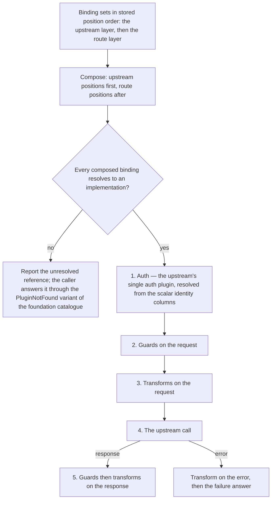

# Feature: Plugin System

<!-- toc -->

- [1. Feature Context](#1-feature-context)
  - [1.1 Overview](#11-overview)
  - [1.2 Purpose](#12-purpose)
  - [1.3 Actors](#13-actors)
  - [1.4 References](#14-references)
  - [1.5 Feature-Local Deviations from Shared Baselines](#15-feature-local-deviations-from-shared-baselines)
  - [1.6 Explicit Non-Applicability](#16-explicit-non-applicability)
- [2. Actor Flows (CDSL)](#2-actor-flows-cdsl)
  - [Provision a Custom Plugin](#provision-a-custom-plugin)
  - [Read a Plugin and Fetch Its Starlark Source](#read-a-plugin-and-fetch-its-starlark-source)
  - [Delete an Unlinked Custom Plugin](#delete-an-unlinked-custom-plugin)
  - [Bind Plugins to an Upstream or a Route](#bind-plugins-to-an-upstream-or-a-route)
  - [Resolve Credentials for an OAuth2 Client-Credentials Auth Plugin](#resolve-credentials-for-an-oauth2-client-credentials-auth-plugin)
- [3. Processes / Business Logic (CDSL)](#3-processes--business-logic-cdsl)
  - [Plugin Contracts and Registry Resolution](#plugin-contracts-and-registry-resolution)
  - [Plugin Chain Composition and Execution Order](#plugin-chain-composition-and-execution-order)
  - [Plugin Reference Resolution Across the Store and the Registry](#plugin-reference-resolution-across-the-store-and-the-registry)
  - [Binding Validation and Write](#binding-validation-and-write)
  - [Immutability, In-Use Protection, and Garbage-Collection Eligibility](#immutability-in-use-protection-and-garbage-collection-eligibility)
  - [Credential Reference Resolution](#credential-reference-resolution)
  - [Token-Cache Lookup, Insert, and Eviction](#token-cache-lookup-insert-and-eviction)
- [4. States (CDSL)](#4-states-cdsl)
  - [Plugin Row Lifecycle](#plugin-row-lifecycle)
- [5. Definitions of Done](#5-definitions-of-done)
  - [Plugin Contracts and Separate Registries](#plugin-contracts-and-separate-registries)
  - [Built-In and Catalog-Only Catalogue](#built-in-and-catalog-only-catalogue)
  - [Plugin Management API and Permissions](#plugin-management-api-and-permissions)
  - [Binding Model and Validation](#binding-model-and-validation)
  - [Plugin and Plugin-Binding Persistence](#plugin-and-plugin-binding-persistence)
  - [Credential Isolation](#credential-isolation)
  - [OAuth2 Token Cache](#oauth2-token-cache)
  - [Immutability, In-Use Protection, and Garbage Collection](#immutability-in-use-protection-and-garbage-collection)
  - [Colocated Tests](#colocated-tests)
- [6. Acceptance Criteria](#6-acceptance-criteria)

<!-- /toc -->

<!-- toc -->

- [ ] `p1` - **ID**: `cpt-cf-oagw-featstatus-plugin-system-implemented`

<!-- reference to DECOMPOSITION entry -->
- [ ] `p2` - `cpt-cf-oagw-feature-plugin-system`

## 1. Feature Context

### 1.1 Overview

This feature supplies the extensibility model of the `oagw` gear: the `AuthPlugin`, `GuardPlugin`, and `TransformPlugin` contracts with their three separate registries, the built-in and catalog-only plugin catalogue, the five plugin management endpoints, the `plugin_ref`/`plugin_uuid` binding model, the plugin and plugin-binding tables, and the credential resolution that turns an opaque `cred://` reference into secret material without ever storing, returning, or logging it.

### 1.2 Purpose

DECOMPOSITION §2.4 places this feature on its own branch off the root, parallel to `cpt-cf-oagw-feature-control-plane-config`: it needs the plugin base-type identifiers, the domain contracts, and the types-registry provisioning that `cpt-cf-oagw-feature-gear-foundation` delivers, and it needs neither upstream nor route persistence. Everything downstream of the junction consumes it — `cpt-cf-oagw-feature-data-plane-proxy` executes the chains this feature composes and resolves the secret material this feature's routines produce, and `cpt-cf-oagw-feature-hierarchical-config` concatenates the binding sets this feature validates and writes. Without it there is no plugin anywhere in the gear: no auth plugin to inject a credential with, no guard to reject a request with, no transform to mutate a request or response with, and no way for an operator to ship a custom Starlark plugin at all.

This feature delivers the DESIGN §3.2 Plugin System and Plugin Lifecycle Management subsections and the plugin share of the DESIGN §3.2 Permissions and Access Control subsection. Authentication injection is a p1 capability (`cpt-cf-oagw-fr-auth-injection`) and lives here as the auth plugin contract, the built-in auth catalogue, and the credential-resolution routine; its execution on a live request does not, and belongs to `cpt-cf-oagw-feature-data-plane-proxy`.

Deliverables:

- The `AuthPlugin`, `GuardPlugin`, and `TransformPlugin` contracts with one registry per contract, the deterministic execution order Auth, then Guards, then Transform on the request, then the upstream call, then Transform on the response or the error, and the upstream-before-route chain composition.
- The built-in catalogue: six resolvable plugin identifiers and six catalog-only identifiers registered in the types-registry only.
- The five plugin management endpoints of DECOMPOSITION §2.4, registered gear-relative under `/oagw/v1/plugins` with the `*_plugin.v1~` permission arms enforced by the same mechanism as the upstream and route endpoints.
- The `plugin_ref`/`plugin_uuid` binding model, its contiguous-from-0 chain positions, the matching rule between `plugin_uuid` and `plugin_ref`, and the resolution of `plugin_ref` across the persisted plugin store and the in-process named registry.
- Immutability after creation, in-use protection answering 409 `PluginInUse`, and garbage-collection eligibility for unlinked custom plugins.
- The plugin and plugin-binding tables, this feature's share of `cpt-cf-oagw-db-schema`, and the scalar auth-plugin identity columns that keep the in-use check off JSON scanning.
- Credential resolution through `cred://` references, and the internal token cache the two OAuth2 Client Credentials variants use.

The feature is delivered in the three phases DECOMPOSITION §2.4 names: plugin contracts and registries, then the built-in catalogue and the management API, then bindings and lifecycle. Nothing in the phase order changes the contract of any endpoint.

**Requirements**:

- [ ] `p2` - `cpt-cf-oagw-fr-plugin-system`
- [ ] `p2` - `cpt-cf-oagw-fr-builtin-plugins`
- [ ] `p1` - `cpt-cf-oagw-fr-auth-injection`
- [ ] `p1` - `cpt-cf-oagw-nfr-credential-isolation`
- [ ] `p1` - `cpt-cf-oagw-contract-cred-store`
- [ ] `p1` - `cpt-cf-oagw-contract-types-registry`
- [ ] `p1` - `cpt-cf-oagw-interface-management-api`

**Principles**:

- `p1` - `cpt-cf-oagw-principle-cred-isolation`
- `p2` - `cpt-cf-oagw-principle-plugin-immutable`
- `p1` - `cpt-cf-oagw-adr-plugin-system`
- `p1` - `cpt-cf-oagw-adr-oauth2-client-credentials-auth-plugin`
- `p1` - `cpt-cf-oagw-adr-required-headers-guard-plugin`

**Constraints**:

- `p1` - `cpt-cf-oagw-constraint-toolkit-deploy`
- `p1` - `cpt-cf-oagw-constraint-no-direct-internet`

**Design Components**:

- `p1` - `cpt-cf-oagw-component-model`
- `p1` - `cpt-cf-oagw-design-layers`
- `p1` - `cpt-cf-oagw-interface-api`

**Domain Model Entities**:

- `Plugin` (the UUID-backed custom plugin row), the plugin binding rows of `oagw_upstream_plugin` and `oagw_route_plugin`, and the named-plugin registry entry
- `AuthContext`, `RequestContext`, `ResponseContext`, and `ErrorContext`, consumed from `cpt-cf-oagw-feature-gear-foundation` and not redeclared here (§1.5)
- `GuardDecision`, the allow-or-reject verdict a guard plugin returns
- The token-cache entry of the two OAuth2 Client Credentials variants, carrying the original cache key and the secret material

**Data**:

- `p1` - `cpt-cf-oagw-db-schema`

`cpt-cf-oagw-interface-management-api` is the PRD §7.1 declaration and `cpt-cf-oagw-interface-api` is the DESIGN §3.3 contract section whose table carries the five plugin rows this feature implements beside the ten upstream and route rows that belong to `cpt-cf-oagw-feature-control-plane-config`: this feature restates that upstream contract in §2 and §5 and does not redesign a single endpoint. The `cpt-cf-oagw-db-schema` claim is shared — DECOMPOSITION §1.6 assigns this feature the plugin and plugin-binding tables and leaves the upstream, route, tag, and match tables to `cpt-cf-oagw-feature-control-plane-config`.

### 1.3 Actors

| Actor | Role in Feature |
|-------|-----------------|
| `cpt-cf-oagw-actor-platform-operator` | Creates custom plugins, binds plugins to the upstreams and routes it owns, and is the actor PRD §5.3 names for `cpt-cf-oagw-fr-builtin-plugins`; it consumes the built-in catalogue and receives the 400 answers of the catalog-only rejection path. |
| `cpt-cf-oagw-actor-tenant-admin` | Creates, reads, fetches the source of, and deletes its tenant's custom plugins, and binds plugins to its own upstreams and routes; it receives the 400, 403, 404, and 409 answers below. |
| `cpt-cf-oagw-actor-cred-store` | Resolves a `cred://` reference into secret material on the credential-resolution miss path, and answers with the secret or with a refusal the routine maps to `SecretNotFound` or `AuthenticationFailed`. |
| `cpt-cf-oagw-actor-types-registry` | Holds the twelve plugin instance identifiers of the built-in and catalog-only catalogue, registered once during the post-init phase this feature performs, and answers each with success or a typed failure. |

The four actors reach this feature through the five plugin management endpoints, through the binding write that rides on the upstream and route write paths, and through the in-process `cred_store` and `types_registry` SDK calls. The difference between the two human actors is which tenant the bearer token resolves to, not which handler runs; PRD §5.3 names both as the actors of `cpt-cf-oagw-fr-plugin-system` and names the platform operator alone for `cpt-cf-oagw-fr-builtin-plugins`, and DECOMPOSITION §1.5 lists this feature against both human actors and both system actors.

The other two actors do not participate:

- `cpt-cf-oagw-actor-app-developer` issues no call this feature answers. Its endpoint is the proxy, delivered by `cpt-cf-oagw-feature-data-plane-proxy`; the plugin chain that request runs through is composed by this feature and executed by that one, and the developer observes the chain only through the response it produces.
- `cpt-cf-oagw-actor-upstream-service` is never contacted. No routine in this feature opens a socket, resolves a host, or dials an upstream; the credential injection that reaches an upstream request happens at proxy time, and the IdP exchange the OAuth2 plugin performs is part of that same proxy-time execution, not of anything this feature runs on its own behalf.

### 1.4 References

- **PRD**: [PRD.md](../PRD.md)
- **Design**: [DESIGN.md](../DESIGN.md)
- **Dependencies**: `cpt-cf-oagw-feature-gear-foundation` — the plugin base-type identifiers this feature registers instances of, the `DomainError` catalogue every 400, 401, 403, 404, 409, and 500 answer below reuses, the `OagwConfig` ceilings the token cache is constructed with, the shared router mount point the five plugin paths are registered on, and the four plugin-execution context types this feature consumes and does not redeclare (DECOMPOSITION §3).

Supporting sources this feature stays consistent with:

- [ADR/0002-plugin-system.md](../ADR/0002-plugin-system.md) (`cpt-cf-oagw-adr-plugin-system`) — the three plugin types, the trait shape, the execution order, the built-in and catalog-only catalogue, and the immutability rule. The one place that ADR contradicts itself is recorded in §1.5.
- [ADR/0008-oauth2-client-credentials-auth-plugin.md](../ADR/0008-oauth2-client-credentials-auth-plugin.md) (`cpt-cf-oagw-adr-oauth2-client-credentials-auth-plugin`) — the two registered variants, the `fetch_token` choice over a background watcher, the cache key design, the `CachedToken` key verification, the TTL rule, and the known residual plaintext.
- [ADR/0009-required-headers-guard-plugin.md](../ADR/0009-required-headers-guard-plugin.md) (`cpt-cf-oagw-adr-required-headers-guard-plugin`) — the one resolvable guard identifier, its two configuration keys, the fail-open posture on absent or blank configuration, and the phase-specific rejection statuses.
- [ADR/0004-cors.md](../ADR/0004-cors.md) — the contrasting precedent behind the catalog-only `cors` guard identifier: CORS is a dedicated `cors` field on `Upstream` and `Route`, enforced by `cpt-cf-oagw-feature-cors`, and is not a `GuardPlugin` implementation.
- [schemas/upstream.v1.schema.json](../schemas/upstream.v1.schema.json) — the `auth` and `plugins` sub-configurations whose references this feature resolves and validates. It is a frozen input this run does not edit.
- [config/e2e-local.yaml](../../../../../config/e2e-local.yaml) — the graded configuration. Its `oagw.config` block sets no token-cache key, so both ceilings take their ADR 0008 defaults; its `credstore` gear selects its value-store backend plugin by vendor and its `static-credstore-plugin` provisions the test secrets keyed by tenant and owner that the credential-resolution routine resolves by `cred://` reference.

**Run-level assumptions** — premises this feature relies on that come from the platform runtime rather than from PRD, DESIGN, the ADRs, or DECOMPOSITION:

- Assumption: the `cred_store` SDK exposes an in-process resolve call that takes a `cred://` reference together with the calling tenant and subject and returns the secret material, per `cpt-cf-oagw-contract-cred-store` ("in-process Rust trait call via the `cred_store` SDK"). `config/e2e-local.yaml` provisions a `credstore` gear with a value-store backend plugin selected by vendor and a `static-credstore-plugin` that declares its secrets with a `tenant_id`, an `owner_id`, a `key`, and a `value`, which is consistent with such a call but states none. If the SDK is absent, or answers nothing for a reference, the credential-resolution routine returns the typed failure the caller maps to `SecretNotFound` — never an empty credential and never a guessed value.
- Assumption: the types-registry SDK accepts the twelve plugin instance identifiers during the post-init phase, after `cpt-cf-oagw-feature-gear-foundation` has registered the three plugin base types. The catalog-only identifiers are registrable there exactly like the backed ones, because DESIGN §3.1 and ADR 0002 both describe the reserved identifiers as "cataloged in the types-registry", and PRD §5.3 states of each that it is a "catalog identifier only" with no backing implementation. If the registry declines one, the post-init phase fails and the gear never reports readiness, exactly as the foundation's provisioning behaves.
- Assumption: the platform middleware resolves the calling tenant and subject from the SecurityContext and enforces the brace-notation permission families as distinct literal permissions, so `gts.cf.core.oagw.auth_plugin.v1~:{create;read;delete}` is three permissions and not one string. If the middleware treats the brace form as a single literal, authorization either always fails or always passes, and the fail direction **MUST** be the one that denies the operation.
- Assumption: the `oagw` gear receives a database handle. The plugin and plugin-binding tables cannot exist without one, and `config/e2e-local.yaml` declares a `database:` block for the `credstore` and `users-info` gears and none under the `oagw` gear. If the runtime provisions no handle for a gear that declares none, the plugin management endpoints answer the platform 500 problem shape and no custom plugin can be stored, while the six backed built-in identifiers remain resolvable from the registry.
- Assumption: the runtime offers the gear a periodic-job facility for the garbage-collection job DESIGN §3.2 Plugin Lifecycle Management describes — the job that marks unlinked plugins by setting `gc_eligible_at` and deletes the rows whose `gc_eligible_at` is in the past. PRD §13 leaves the garbage-collection policy an open question and DESIGN answers it as time-based after a TTL, but no supplied document states that the runtime schedules gear-level jobs. If it does not, the marking and the deletion cannot run, so this feature **MUST** keep `gc_eligible_at` authoritative and derive the explicit-delete decision from the reference scan alone, which never depends on the job having run; an unlinked plugin then persists until its owning tenant deletes it, and is never reported as garbage-collected when it was not.
- Assumption: the `read` permission check on the plugin list path is evaluated against the arm the request selects — the `plugin_type` a `$filter` on `type` names when one is supplied, and any one of the three `*_plugin.v1~:read` permissions otherwise. DESIGN §3.2 tabulates the three plugin permission arms separately and states no rule for a list that is not type-filtered. If the platform middleware cannot express an any-of check, the list **MUST** require all three `read` permissions rather than none, because the fail direction that denies the read is the safe one.

### 1.5 Feature-Local Deviations from Shared Baselines

| Deviation | Rationale | Review owner | Validation performed |
|-----------|-----------|--------------|----------------------|
| The five plugin paths are registered gear-relative at `/oagw/v1/plugins...` with no `/api` prefix. | DECOMPOSITION §1.3(1) corrects the `/api/oagw/v1/...` tabulation in PRD §7.1 and DESIGN §3.3: `/api` is an operator gateway prefix, not a path this gear serves. Every path in this document is the gear-relative form, and the five paths are the restatement of the upstream contract, not a new design. | The controller of this run. | Accepted by the semantic review of this run; `cfs validate --artifact` clean. |
| `basic` and `bearer` have no backing `AuthPlugin` implementation, so the `AuthPluginRegistry` registration sketch in ADR 0002 Plugin Loading, which inserts a `BasicAuthPlugin`, is not implemented. | ADR 0002's own Built-in Plugins section states that `cf.core.oagw.basic.v1` and `cf.core.oagw.bearer.v1` "are reserved GTS identifiers cataloged in the types-registry with no backing `AuthPlugin` implementation in `infra/plugin/`", and PRD §5.3 and DESIGN §3.1 state the same. The sketch is a code illustration inside the ADR that contradicts the ADR's normative statement one section earlier; this feature follows the normative statement. | The controller of this run. | Accepted by the semantic review of this run; `cfs validate --artifact` clean. |
| A catalog-only identifier used as a bindable `plugin_ref` or as the upstream `auth` sub-configuration's plugin-type member is answered 400 with the validation error for all three plugin families. | DESIGN §3.1 states the answer only for the auth family ("using either as `auth.plugin_type` fails with `unknown auth plugin`", that section's prose name for the member, recorded as a divergence below) and states the guard and transform cases as "cannot be bound" and "not resolvable" without naming an answer. One answer for one class of failure keeps the catalogue closed: the identifier is reserved in the types-registry and absent from the plugin registry, which is a property of the body, and a property of the body is what the 400 row answers. The problem `detail` distinguishes an identifier the catalogue reserves from one it does not know, so an operator can tell a reserved-but-unimplemented identifier from a typo. | The controller of this run. | Accepted by the semantic review of this run; `cfs validate --artifact` clean. |
| A duplicate plugin `name` within the calling tenant is answered 400 naming `name`, not a 409. | `oagw_plugin` is unique on `(tenant_id, name)` per DESIGN §3.6, and the duplicate is named in the body, but the catalogue has no variant for it: DESIGN §3.3 tabulates exactly one 409 row, `PluginInUse`, which is a plugin-lifecycle answer, and DECOMPOSITION §1.3(9) closed the catalogue at two management-conflict variants, `AliasConflict` and `MatchConflict`, both scoped to upstream and route writes. Inventing a third 409 variant is outside this feature's authority, and the precedent `cpt-cf-oagw-feature-control-plane-config` sets — a resource named in the body is a validation failure, not a disclosure about another tenant — is followed here. | The controller of this run. | Accepted by the semantic review of this run; `cfs validate --artifact` clean. |
| The garbage-collection TTL is carried as a named constant of 30 days and adds no `OagwConfig` key. | DESIGN §3.2 Plugin System inventories the custom-plugin behaviour as GC for unlinked plugins after a configurable TTL, and DESIGN §3.2 Plugin Lifecycle Management gives that TTL its default of 30 days; no single sentence of that section reads as a quotation, so the two halves are cited separately. The `OagwConfig` surface DECOMPOSITION §2.1 declares closes at five keys — `proxy_timeout_secs`, `allow_http_upstream`, `ssrf_policy`, `token_cache_ttl_secs`, `token_cache_capacity` — and names no garbage-collection key, and `cpt-cf-oagw-feature-gear-foundation` owns that surface. Widening it here would give one configuration surface two owners, so the TTL is a constant with the sourced value and the configurability DESIGN mentions is not delivered. | The controller of this run. | Accepted by the semantic review of this run; `cfs validate --artifact` clean. |
| `last_used_at` is created on the plugin row and never written by this feature. | The DESIGN §3.1 Plugin class declares the column, and the only event that sets it is a use on a live request, which is `cpt-cf-oagw-feature-data-plane-proxy`'s execution obligation and is out of this feature's scope (DECOMPOSITION §2.4). Writing it from a management read would be a lie about use, and writing it from the proxy path would put a Control Plane write on the Data Plane hot path. Garbage-collection eligibility is therefore derived from the reference scan alone and never from `last_used_at`. | The controller of this run. | Accepted by the semantic review of this run; `cfs validate --artifact` clean. |
| The five plugin management paths address persisted custom plugins only, and a named plugin's GTS identifier addressed through any of them answers 404. | DESIGN §3.1 states that named plugins are "not stored in `oagw_plugin` and not subject to GC", so the list returns custom rows only, and a single read, a source read, or a deletion of a named identifier has no row to address. The built-in catalogue is observable through the types-registry, where all twelve identifiers are registered, and not through this API. The 404 is the same indistinguishable answer the upstream and route paths give for a foreign identifier. | The controller of this run. | Accepted by the semantic review of this run; `cfs validate --artifact` clean. |
| The plugin permission arms are enforced with the `{create;read;delete}` members only, and the `override` member DECOMPOSITION §2.2 writes into the brace family gates no plugin endpoint. | DECOMPOSITION §2.2 writes the family as `gts.cf.core.oagw.{upstream,route,*_plugin}.v1~:{create;override;read;delete}`, while DESIGN §3.2 grants the plugin arms `{create;read;delete}` only. There is no plugin endpoint an `override` permission could gate, because plugins are immutable after creation and DESIGN §3.3 states "Plugins are immutable (no PUT)". The narrowing is recorded on the management feature's side as well; this row records the same fact from the plugin side. | The controller of this run. | Accepted by the semantic review of this run; `cfs validate --artifact` clean. |
| The Starlark `source_code` is stored verbatim and is not parsed, compiled, sandbox-checked, or executed at create time. | DECOMPOSITION §2.4 assigns this feature the exposure of the sandbox limits and their enforcement to execution time, which belongs to `cpt-cf-oagw-feature-data-plane-proxy` together with `cpt-cf-oagw-nfr-starlark-sandbox`. No supplied document states a create-time source gate, so adding one would invent a validation no caller is told about and no catalogue row declares. Create-time validation therefore covers the declared fields only: the type, the name, the configuration schema being an object, the declared phases being a subset of the phases the type supports, and the source being non-empty. | The controller of this run. | Accepted by the semantic review of this run; `cfs validate --artifact` clean. |
| The binding validation and the binding-row write are delivered as routines this feature owns, invoked from the upstream and route write paths `cpt-cf-oagw-feature-control-plane-config` registers, and no separate binding endpoint exists. | DECOMPOSITION §2.4 assigns this feature the `plugin_ref`/`plugin_uuid` binding model and the plugin-binding tables, and lists only the five plugin paths as its API; `cpt-cf-oagw-feature-control-plane-config` records in its own §1.5 that it validates the `plugins` sub-object and writes no binding row. The two records meet here: the validation and the write are this feature's, and they run inside the single transaction the parent write already opens. | The controller of this run. | Accepted by the semantic review of this run; `cfs validate --artifact` clean. |
| The four plugin-execution contexts are treated as `cpt-cf-oagw-feature-gear-foundation`'s shared vocabulary, although that feature's own entity list names only `ErrorContext` among the four. | DECOMPOSITION §2.4 lists `AuthContext`, `RequestContext`, `ResponseContext`, and `ErrorContext` with the parenthetical "consumed from `gear-foundation`", and its §2.1 entity list for the foundation names `ErrorContext` but none of the other three. DECOMPOSITION prevails, so the definition point for all four is the foundation and this feature redeclares none of them. The gap is recorded here rather than closed by declaring the three types in this feature, which would give one type two owners and would let the plugin contracts and the proxy path disagree about what a request context carries. | The controller of this run. | Accepted by the semantic review of this run; `cfs validate --artifact` clean. |
| The plugin-execution contexts are four distinct types, not the single `RequestContext` the ADR 0002 trait sketch passes to `authenticate` and to `guard_request`. | ADR 0002's Plugin Traits sketch declares `authenticate(&self, ctx: &mut RequestContext)` and `guard_request(&self, ctx: &RequestContext)`, while ADR 0008 names `AuthContext` as the `authenticate` parameter and DECOMPOSITION §2.4 lists all four context types as this feature's entities. DECOMPOSITION prevails, and the four-type reading is the one that keeps a credential-injection context from carrying the response surface a response transform needs. | The controller of this run. | Accepted by the semantic review of this run; `cfs validate --artifact` clean. |
| The stored `plugin_type` carries one of the three literals `auth`, `guard`, or `transform`, which selects the base type of the plugin's anonymous GTS identifier. | DESIGN §3.1 declares `plugin_type` as a `String` and gives the API identifier as `gts.cf.core.oagw.{type}_plugin.v1~{uuid}`, PRD §5.3 declares exactly three plugin types, and ADR 0002's Appendix A uses the literal `guard`. No supplied document states the full literal set, so it is recorded here: three values, each mapping to one of the three plugin base types `cpt-cf-oagw-feature-gear-foundation` provisioned. | The controller of this run. | Accepted by the semantic review of this run; `cfs validate --artifact` clean. |
| A guard rejection in the response phase is mapped to the `ProtocolError` variant of the foundation catalogue, and a guard rejection in the request phase to the `ValidationError` variant. | ADR 0009 states the phase-specific statuses (400 in the request phase, 502 in the response phase) and the `REQUIRED_HEADER_MISSING` error code, and states no `DomainError` variant. The two rows of DESIGN §3.3 that carry those statuses are `ValidationError` (400, non-retriable) and `ProtocolError` (502, non-retriable, "Protocol-level error"); the response-phase verdict is a statement that the upstream's response violates the configured contract rather than a passthrough of an upstream failure the guard did not evaluate, so the non-retriable 502 row is the one it maps to. Both rejections are gateway-sourced and carry `X-OAGW-Error-Source: gateway`. | The controller of this run. | Accepted by the semantic review of this run; `cfs validate --artifact` clean. |
| This feature's tests are colocated at `gears/system/oagw/oagw/tests/` instead of `testing/e2e/gears/oagw/`. | DECOMPOSITION §1.3(3) reserves `testing/e2e/gears/oagw/` for the acceptance suite; every unit and integration test this decomposition produces lives with the crate. This is the same deviation `cpt-cf-oagw-feature-gear-foundation`, `cpt-cf-oagw-feature-control-plane-config`, and `cpt-cf-oagw-feature-hierarchical-config` record in their own §1.5 tables, restated here because the tests it governs include this feature's. | The controller of this run. | Accepted by the semantic review of this run; `cfs validate --artifact` clean. |
| The binding item this feature validates and writes is the object that carries `position`, `plugin_ref`, `plugin_uuid`, and `config`, and the parent's schema validation is applied with a feature-local override for `plugins.items`, which the shipped `upstream.v1` and `route.v1` schemas declare as an array of bare identifier strings. | DESIGN §3.1 Bindings stores `(position, plugin_ref, plugin_uuid, config)` in `oagw_upstream_plugin` and `oagw_route_plugin`, PRD §5.3 names `plugins.items[].plugin_ref` as the only guard identifier bindable through it, ADR 0009's Upstream Configuration Example carries the items as objects with a `plugin_ref` and a `config`, and DECOMPOSITION §2.4 states each binding carries its chain position, the plugin reference, the optional plugin UUID, and its plugin configuration; the shipped schemas admit none of those members, and neither names a `position` to order the array by. The `plugins` envelope and its `sharing` enum stay under the shipped schema and `cpt-cf-oagw-algo-request-validate`, and the item shape is validated by this feature's own `cpt-cf-oagw-algo-binding-validate`, which applies the parent's schema validation with a feature-local override for `plugins.items` — the same device by which `cpt-cf-oagw-feature-control-plane-config` records the route `priority` and `enabled` root extras its own shipped schema omits. The divergence is recorded here rather than closed by editing a frozen schema. | The controller of this run. | Accepted by the semantic review of this run; `cfs validate --artifact` clean. |
| The wire member of the upstream `auth` sub-configuration that names the auth plugin is read and validated as `auth.type`, which the shipped `upstream.v1` schema declares, and not as `auth.plugin_type`. | DESIGN §3.1's prose calls the member `auth.plugin_type` when it states that using either reserved auth identifier as `auth.plugin_type` fails with `unknown auth plugin`, and PRD never uses that name; the shipped schema declares the member as `type` with the `gts-identifier` format and no `plugin_type` member at all. The wire form is what a caller submits and what this feature validates, so the catalog-only rejection of §1.5 and the credential-reference shape check of `cpt-cf-oagw-algo-binding-validate` both read `auth.type`, and the DESIGN §3.1 prose name is recorded here as the divergence rather than adopted as a second member. | The controller of this run. | Accepted by the semantic review of this run; `cfs validate --artifact` clean. |
| This feature writes the two `auth_plugin_ref` and `auth_plugin_uuid` columns of the upstream row, although it creates and writes no row of the upstream, route, tag, or match tables. | DESIGN §3.1 declares the two scalar columns on the upstream row and DESIGN §3.6's Track Plugin Usage operation reads them, while DECOMPOSITION §1.6 assigns the upstream table itself to `cpt-cf-oagw-feature-control-plane-config` and its §3 declares the two features independent of each other. The columns are written inside the parent's transaction and are reached through that parent write path's invocation of this feature's `cpt-cf-oagw-algo-binding-validate` and `cpt-cf-oagw-algo-plugin-inuse-gc` routines, which makes them the one coupled point between the two features; the routines and their tests remain deliverable against the foundation contracts alone, and every other column of the upstream row stays the parent feature's. | The controller of this run. | Accepted by the semantic review of this run; `cfs validate --artifact` clean. |

### 1.6 Explicit Non-Applicability

The areas below apply to the gear as a whole but not to this feature. Each is stated here so the omission is a recorded decision rather than a silent gap.

- **Plugin execution on a live request**: the contracts, the registries, the composed chain, and the credential material a chain needs are this feature's outputs; invoking them on a request is `cpt-cf-oagw-feature-data-plane-proxy`'s obligation (DECOMPOSITION §2.4 and §2.5). The OAuth2 token cache of §3 is a plugin-internal concern whose lookup and insert run inside `authenticate()`, and every step that touches it is reached through that invocation rather than through a request path this feature owns.
- **Circuit breaking**: core gateway policy, not a plugin — PRD §5.3 states it after `cpt-cf-oagw-fr-plugin-system` and ADR 0002 closes with the same sentence. No `CircuitBreakerPlugin` identifier exists in the catalogue, none is registered, and none is bindable.
- **gRPC proxying**: no gRPC proxy code path is currently implemented or reachable (DESIGN §3.1, DECOMPOSITION §1.3(4)). No plugin contract in this feature is protocol-specific, and none is extended for gRPC.
- **Plugin versioning and lifecycle management as a separate concern**: PRD §4.2 and DESIGN §4.5 both put it out of scope, and DECOMPOSITION §2.4 repeats the exclusion. What this feature delivers is the whole lifecycle the baseline states: immutability after creation, in-use protection, and garbage-collection eligibility. A new version of a plugin is a new plugin row, and rebinding is the caller's operation.
- **Retry on an upstream 401**: ADR 0008 defers it as an area of active design, because the `AuthPlugin` trait returns no signal a Data Plane could use to decide whether a retry with fresh credentials is meaningful. This feature implements no retry orchestration, adds no return metadata to the trait, and does not refresh a credential on a rejected request.
- **Authorization Code Grant**: out of scope by ADR 0008, which requires user consent, redirect callbacks, and refresh-token storage across data centres. Only the two Client Credentials variants are registered.
- **Events**: no event is published or consumed here. The audit log, the metrics, and the configuration-change reporting that describe a plugin create or delete belong to `cpt-cf-oagw-feature-observability`, which DECOMPOSITION §3 makes dependent on features this one does not wait for.
- **Health and diagnostics**: this feature contributes no readiness or health signal of its own. Gear readiness belongs to `cpt-cf-oagw-feature-gear-foundation`'s provisioning state machine, and this feature's contribution to it is the post-init registration of the twelve plugin instance identifiers, whose per-entry failure fails readiness exactly as any other catalogue entry's failure does. Every failure this feature produces surfaces as a protocol answer through the foundation's mapping — a 400, a 401, a 403, a 404, a 409, or the platform 500 problem shape for a storage failure — and never as a status endpoint, a readiness gate, or a diagnostic surface of its own.
- **Rollout and rollback**: the gear is one configuration item and one release unit (DECOMPOSITION §1.4), so this feature ships no rollout of its own and no independent rollback path. Deleting a plugin row is an operator decision answered 409 while the plugin is in use, so no rollback of a bound plugin is ever needed.
- **Versioning**: every GTS identifier this feature registers or resolves is fixed at `.v1` by DESIGN §3.1, and the breaking-change policy of `cpt-cf-oagw-interface-management-api` (major version bump from v1 to v2) is a PRD-level declaration about the interface, not a mechanism this feature implements. No version negotiation, aliasing, or migration surface exists here, and the `plugin_ref`/`plugin_uuid` binding model is not a versioning mechanism.
- **Localization and accessibility**: the `title` and `detail` of every problem body this feature answers are English protocol strings produced by the foundation's error mapping, and there is no locale negotiation, no translated surface, and no actor-facing rendered UI to make accessible.
- **Compliance and privacy**: the only sensitive material this feature handles is credential material, and `cpt-cf-oagw-nfr-credential-isolation` governs all of it. No personal data and no regulated data are persisted — the plugin row holds a type, a name, a description, a configuration schema, and Starlark source, and the binding rows hold a position, a reference, an optional UUID, and a configuration object. Secret material is held in the zeroizing secret type ADR 0008 names, is never persisted, never returned in a management response, and never written to a log or to a problem `detail`; the two known residual plaintexts that ADR 0008 records — the constructed bearer header value and the in-flight token inside the one-shot fetch — are that ADR's recorded residual and are not eliminated here.
- **Performance**: no latency or throughput target is set here, because `cpt-cf-oagw-nfr-low-latency` is allocated to `cpt-cf-oagw-feature-data-plane-proxy`, which owns the request hot path. The two performance ceilings this feature's output feeds are the token-cache ones: `token_cache_ttl_secs` defaults to 300 and `token_cache_capacity` to 10000 per ADR 0008's gear-level table, both keys are carried and range-checked by the foundation's `cpt-cf-oagw-algo-config-load-validate`, and both are consumed at execution time by the OAuth2 plugin through `AuthPluginRegistry::with_builtins` — this feature constructs the cache with them and evaluates neither at management time. The chain composition of §3 allocates one composed chain per resolution and reads only the binding rows already resolved, so its cost is linear in the number of bindings the effective configuration carries, and no composed chain is cached here: the Control Plane L1 cache belongs to `cpt-cf-oagw-feature-control-plane-config` and the Data Plane L1 cache to `cpt-cf-oagw-feature-data-plane-proxy`.
- **Credential material in problem detail**: no problem `detail` this feature answers ever echoes request body content, a `cred://` reference value, or a resolved secret. A `detail` names the failing property, the addressed plugin, the colliding reference, or the rejected identifier, and nothing copied from the body. The reference itself is not secret material, but it is never echoed either, because a reference that appears in a log is a pointer an operator can follow and a detail that appears in a third-party ticket is not the place for it.

## 2. Actor Flows (CDSL)

The flows below follow the management operation order DESIGN §3.5 states — authenticate, validate the body, write, respond — and the path-based routing of `cpt-cf-oagw-adr-plugin-system`'s host ADR set, which sends `/oagw/v1/plugins/*` to the Control Plane (DESIGN §3.2 Request Routing). Path parameters carry anonymous GTS identifiers of the form `gts.cf.core.oagw.{type}_plugin.v1~{uuid}`, and the five paths are the gear-relative restatement of the DESIGN §3.3 contract. The binding flow does not register a path of its own: it rides on the upstream and route write paths `cpt-cf-oagw-feature-control-plane-config` registers, with the validation and the write performed by the routines this feature delivers (§1.5).

**Use cases**: none. Every `cpt-cf-oagw-usecase-*` identifier in PRD §8 is exercised by another feature — `cpt-cf-oagw-usecase-configure-upstream` and `cpt-cf-oagw-usecase-configure-route` by `cpt-cf-oagw-feature-control-plane-config`, `cpt-cf-oagw-usecase-proxy-request` and `cpt-cf-oagw-usecase-sse-streaming` by `cpt-cf-oagw-feature-data-plane-proxy`, and `cpt-cf-oagw-usecase-rate-limit-exceeded` by `cpt-cf-oagw-feature-rate-limiting` — and PRD §8 declares no plugin use case for this feature to claim. The binding flow below contributes the plugin-reference branch of the two configure use cases without restating either.

### Provision a Custom Plugin

- [x] `p1` - **ID**: `cpt-cf-oagw-flow-plugin-create`

**Actor**: `cpt-cf-oagw-actor-tenant-admin`

**Success Scenarios**:

- A plugin of type `guard` with a name unique within the calling tenant, an object configuration schema, and non-empty Starlark source is created; the row is persisted with a server-generated identifier and the response carries the identifier as `gts.cf.core.oagw.guard_plugin.v1~{uuid}`.
- A plugin whose declared phases are a subset of the phases its type supports is created, including a plugin that declares exactly one phase.
- A plugin created without an explicit description or configuration schema is created with those members left absent, both being optional.
- A platform operator performs the same operation for its own tenant and receives the same answer; the two human actors reach this flow through the same endpoint.

**Error Scenarios**:

- The body fails validation — no `plugin_type`, a `plugin_type` outside the three literals of §1.5, no `name`, an empty `source_code`, a `config_schema` that is not an object, or a declared phase the plugin type does not support — and is answered 400 naming every failing property.
- A catalog-only identifier is submitted where a backed plugin type is required: 400, with a `detail` that distinguishes a reserved identifier from an unknown one (§1.5).
- Another plugin of the calling tenant already holds the `name`: 400 naming `name` (§1.5).
- The bearer token is missing or invalid: 401; it lacks the `create` permission of the plugin type's arm: 403.
- The storage layer fails: the platform 500 problem shape, and no row is written.

**Steps**:
1. [x] - `p1` - Actor issues the create request carrying the plugin definition: `plugin_type`, `name`, and any of `description`, `config_schema`, `source_code`, and the declared phases - `inst-pl-create-issue`
2. [x] - `p1` - API: POST /oagw/v1/plugins — the platform middleware authenticates the bearer token and the handler enforces the `create` permission of the arm the body's `plugin_type` selects, before any validation runs - `inst-pl-create-authz`
3. [x] - `p1` - `cpt-cf-oagw-algo-plugin-contract-registry` confirms the requested `plugin_type` names one of the three plugin base types and that the declared phases are a subset of the phases that type supports - `inst-pl-create-type`
4. [x] - `p1` - **IF** the `plugin_type` does not name a backed plugin base type, or the source is empty, the configuration schema is not an object, or a declared phase is outside the type's supported set - `inst-pl-create-validate-if`
   1. [x] - `p1` - **RETURN** 400 naming every failing property; no row is written, and the source is never parsed or executed at create time (§1.5) - `inst-pl-create-validate-return`
5. [x] - `p1` - **ELSE** - `inst-pl-create-validate-else`
   1. [x] - `p1` - Continue with the validated definition and the verbatim source - `inst-pl-create-validate-continue`
6. [x] - `p1` - DB: SELECT the plugin rows of the calling tenant whose `name` equals the submitted one, through the secure ORM with the tenant equality in the same predicate as every other key - `inst-pl-create-dup`
7. [x] - `p1` - **IF** a row matched - `inst-pl-create-dup-if`
   1. [x] - `p1` - **RETURN** 400 naming `name` as taken within the calling tenant; no 409 variant exists for this conflict (§1.5) - `inst-pl-create-dup-return`
8. [x] - `p1` - **ELSE** - `inst-pl-create-dup-else`
   1. [x] - `p1` - DB: INSERT into `oagw_plugin` the row with the server-generated `id`, the calling tenant, the `plugin_type`, the `name`, the configuration schema, the verbatim source, and `gc_eligible_at` unset, in one transaction; no binding row is written and `last_used_at` stays unset (§1.5) - `inst-pl-create-insert`
9. [x] - `p1` - **RETURN** 201 with the created representation and the `id` as `gts.cf.core.oagw.{type}_plugin.v1~{uuid}` - `inst-pl-create-return`

### Read a Plugin and Fetch Its Starlark Source

- [x] `p1` - **ID**: `cpt-cf-oagw-flow-plugin-read-source`

**Actor**: `cpt-cf-oagw-actor-tenant-admin`

This flow covers the three read paths — `GET /oagw/v1/plugins`, `GET /oagw/v1/plugins/{id}`, and `GET /oagw/v1/plugins/{id}/source` — and it writes nothing: no cache is flushed, no row is touched, and `last_used_at` is not updated, because a read is not a use (§1.5).

**Success Scenarios**:

- A plugin addressed by identifier and owned by the calling tenant is returned with its representation and its `id` as the anonymous GTS identifier of its type.
- The source path returns the stored Starlark source of the addressed plugin and nothing else: no configuration value, no credential reference, and no secret material.
- A list request returns the calling tenant's custom plugin rows, bounded by the OData parameters DESIGN §3.3 tabulates for the plugin list (`$filter`, `$select`, `$top`, `$skip`), and the list holds no named plugin because none is persisted (§1.5).

**Error Scenarios**:

- The identifier in the path names a nonexistent plugin, one owned by another tenant including an ancestor, or a named plugin that has no row: 404, with the three causes indistinguishable.
- A query parameter is malformed or an expression names a field the plugin row does not expose: 400.
- The bearer token is missing or invalid: 401; it lacks the `read` permission of the arm the request selects: 403 (§1.4).

**Steps**:
1. [x] - `p1` - Actor issues a `GET` against one of the three read paths, with an `{id}` path parameter for a single read or for a source read, and OData query parameters for a list - `inst-pl-read-issue`
2. [x] - `p1` - API: GET /oagw/v1/plugins, GET /oagw/v1/plugins/{id}, or GET /oagw/v1/plugins/{id}/source — the platform middleware authenticates the bearer token and the handler enforces the `read` permission of the arm the request selects before any query is built - `inst-pl-read-authz`
3. [x] - `p1` - DB: SELECT the plugin row by `id` and calling tenant, or the tenant-scoped page for a list, through the secure ORM with the tenant equality in the same predicate as every other key and with no raw SQL (`cpt-cf-oagw-principle-tenant-scope`) - `inst-pl-read-scope`
4. [x] - `p1` - **IF** no row matched, because the identifier does not exist, because it belongs to another tenant including an ancestor, or because it names a named plugin that has no row - `inst-pl-read-404-if`
   1. [x] - `p1` - **RETURN** 404; the three causes are deliberately indistinguishable so the endpoint discloses nothing about other tenants' plugins or about the registry's contents - `inst-pl-read-404-return`
5. [x] - `p1` - **ELSE** - `inst-pl-read-404-else`
   1. [x] - `p1` - Assemble the representation, or the stored source alone for the source path, with the configuration schema and the source carried as stored and never re-rendered - `inst-pl-read-assemble`
6. [x] - `p1` - **RETURN** 200 with the representation, the bounded page, or the source; the source path returns the Starlark source of the addressed plugin and no other member of the row - `inst-pl-read-return`

### Delete an Unlinked Custom Plugin

- [x] `p1` - **ID**: `cpt-cf-oagw-flow-plugin-delete`

**Actor**: `cpt-cf-oagw-actor-tenant-admin`

**Success Scenarios**:

- A custom plugin of the calling tenant that no upstream or route references is deleted with `204 No Content` and no body, and the row disappears in one transaction.
- Deleting a plugin never touches a binding row: no foreign key runs from the binding tables to `oagw_plugin` (DESIGN §3.1), so the deletion cannot orphan or rewrite a binding.
- A plugin that is still linked is not deleted, and nothing about it changes.

**Error Scenarios**:

- The identifier names a nonexistent plugin, one owned by another tenant including an ancestor, or a named plugin: 404, with the three causes indistinguishable.
- The plugin is referenced by a binding row in `oagw_upstream_plugin` or `oagw_route_plugin`, or by an upstream's `auth_plugin_uuid` column: 409 with the `PluginInUse` variant, and the answer names no referencing resource beyond the fact of the reference.
- The bearer token is missing or invalid: 401; it lacks the `delete` permission of the plugin type's arm: 403.
- The storage layer fails: the platform 500 problem shape, and no row is removed.

**Steps**:
1. [x] - `p1` - Actor issues `DELETE /oagw/v1/plugins/{id}` with no body - `inst-pl-del-issue`
2. [x] - `p1` - API: DELETE /oagw/v1/plugins/{id} — the platform middleware authenticates the bearer token and the handler enforces the `delete` permission of the plugin type's arm before any query is built - `inst-pl-del-authz`
3. [x] - `p1` - DB: SELECT the plugin row by `id` and calling tenant through the secure ORM - `inst-pl-del-scope`
4. [x] - `p1` - **IF** no row matched - `inst-pl-del-404-if`
   1. [x] - `p1` - **RETURN** 404, indistinguishable between a missing identifier, a foreign one, and a named plugin - `inst-pl-del-404-return`
5. [x] - `p1` - **ELSE** - `inst-pl-del-404-else`
   1. [x] - `p1` - `cpt-cf-oagw-algo-plugin-inuse-gc` scans the reference set for the resolved row - `inst-pl-del-inuse`
6. [x] - `p1` - **IF** any binding row in `oagw_upstream_plugin` or `oagw_route_plugin` carries the plugin, or any upstream row carries it in `auth_plugin_uuid` - `inst-pl-del-inuse-if`
   1. [x] - `p1` - **RETURN** 409 with the `PluginInUse` variant (`gts.cf.core.errors.err.v1~cf.oagw.plugin.in_use.v1`); the row is left untouched and its `gc_eligible_at` is left as the reference scan found it - `inst-pl-del-inuse-return`
7. [x] - `p1` - **ELSE** - `inst-pl-del-inuse-else`
   1. [x] - `p1` - DB: DELETE the `oagw_plugin` row by identifier in one transaction; the plugin becomes `Deleted` in `cpt-cf-oagw-state-plugin-lifecycle` and no other row changes - `inst-pl-del-write`
8. [x] - `p1` - **RETURN** `204 No Content` with no body; a deletion has no representation to return - `inst-pl-del-return`

### Bind Plugins to an Upstream or a Route

- [x] `p1` - **ID**: `cpt-cf-oagw-flow-bind-plugins`

**Actor**: `cpt-cf-oagw-actor-tenant-admin`

A platform operator reaches the same operation for its own tenant and receives the same answers; the two human actors issue the same parent request, exactly as the create, read, and delete flows record. The management operation is the create or replacement of an upstream or a route, which `cpt-cf-oagw-feature-control-plane-config` registers and validates against the shipped schemas. This flow is the plugin-reference branch of that operation: the `plugins` sub-object the body carries, and for an upstream the `auth` sub-configuration's plugin identity, are resolved, validated, and written by the routines this feature delivers, inside the single transaction the parent write already opens (§1.5). No path is registered here.

**Success Scenarios**:

- An upstream whose `plugins` items carry contiguous positions from 0, backed `plugin_ref` values of the guard or transform type, and no `plugin_uuid` is created, and the binding rows are written in the parent's transaction.
- A binding that names a custom plugin by `plugin_ref` and by the matching `plugin_uuid` is accepted, and the stored row carries the reference always and the UUID only because the plugin is UUID-backed.
- An upstream that binds one auth plugin through the `auth` sub-configuration is created, and the identity lands in the scalar `auth_plugin_ref` and `auth_plugin_uuid` columns rather than in a binding row.
- A route whose `plugins` items are validated the same way is created, with the route's own positions starting at 0 independently of any upstream positions.
- A replacement that drops a binding item is accepted, and the row it unlinks becomes garbage-collection-eligible when it was the last reference.

**Error Scenarios**:

- A `plugin_ref` names a catalog-only identifier, an identifier no registry or store resolves, or an identifier whose plugin type does not match the family the binding slot carries: 400, with the `detail` distinguishing a reserved identifier from an unknown one (§1.5).
- The submitted positions are not the contiguous set from 0, or two items carry the same position: 400.
- A binding carries a `plugin_uuid` that does not match the UUID embedded in its `plugin_ref`, or a `plugin_uuid` on a named plugin: 400.
- An upstream body binds a second auth plugin, or a route body carries an `auth` sub-configuration at all: 400.
- The parent write fails for a reason that feature answers — 400 for a schema failure, 404 for a foreign parent, 409 for an alias or match conflict — and no binding row is written, because the parent's transaction is the only writer.
- The bearer token is missing or invalid: 401; it lacks the management permission of the parent resource: 403.

**Steps**:
1. [x] - `p1` - Actor issues the create or replacement carrying the `plugins` sub-object with its ordered items, and for an upstream the `auth` sub-configuration naming one auth plugin - `inst-bind-issue`
2. [x] - `p1` - API: POST /oagw/v1/upstreams, PUT /oagw/v1/upstreams/{id}, POST /oagw/v1/routes, or PUT /oagw/v1/routes/{id} — the platform middleware authenticates the bearer token and the handler enforces the parent resource's management permission; the path is `cpt-cf-oagw-feature-control-plane-config`'s registration (`cpt-cf-oagw-interface-management-api`) - `inst-bind-authz`
3. [x] - `p1` - `cpt-cf-oagw-algo-request-validate` validates the body against the shipped schema for the parent resource, which confirms the `plugins` sub-object's envelope and the `sharing` enum on it; the shape of the items that envelope carries is **NOT** confirmed by that schema, which declares them as bare identifier strings, and is validated instead by this feature's `cpt-cf-oagw-algo-binding-validate` (§1.5) - `inst-bind-parent-validate`
4. [x] - `p1` - `cpt-cf-oagw-algo-binding-validate` resolves every `plugin_ref` through `cpt-cf-oagw-algo-plugin-ref-resolve`, validates the positions, the `plugin_uuid` match, and the type match, and validates the auth plugin identity and its credential references for `cred://` shape - `inst-bind-validate`
5. [x] - `p1` - **IF** any resolution or validation fails - `inst-bind-fail-if`
   1. [x] - `p1` - **RETURN** 400 naming the failing item, its position, and the reason; no binding row and no parent row is written, and the failure is indistinguishable from any other validation failure of the parent write - `inst-bind-fail-return`
6. [x] - `p1` - **ELSE** - `inst-bind-fail-else`
   1. [x] - `p1` - DB: INSERT or REPLACE the `oagw_upstream_plugin` or `oagw_route_plugin` rows for the parent, and for an upstream set the scalar `auth_plugin_ref` and `auth_plugin_uuid` columns on the upstream row, all inside the parent's single transaction - `inst-bind-write`
7. [x] - `p1` - `cpt-cf-oagw-algo-plugin-inuse-gc` recomputes the reference set of every plugin whose linkage the write changed, so a plugin that lost its last reference becomes garbage-collection-eligible and one that gained one loses that eligibility - `inst-bind-gc`
8. [x] - `p1` - **RETURN** the parent write's own answer — 201 for a create, the replaced representation for a replacement — carrying no plugin source and no credential material - `inst-bind-return`

### Resolve Credentials for an OAuth2 Client-Credentials Auth Plugin

- [x] `p1` - **ID**: `cpt-cf-oagw-flow-oauth2-token-cache`

**Actor**: `cpt-cf-oagw-actor-cred-store`

This feature delivers the auth plugin contract, the two registered OAuth2 variants, the cache, and the credential-resolution routine. The invocation of `authenticate()` on a live request is `cpt-cf-oagw-feature-data-plane-proxy`'s execution obligation and is out of this feature's scope (§1.6), so the steps below are the credential-resolution contract the plugin exposes, reached through that invocation and not through any endpoint or request path of this feature.

**Success Scenarios**:

- First use for a given tenant, subject, auth method, and configuration: the cache holds no entry, the two credential references are resolved through the credential store, the IdP exchange returns a bearer value and its `expires_in`, the entry is stored with the TTL of §3, and the bearer value is injected into the request context's headers.
- Every subsequent use inside the TTL: the cache returns an entry whose stored key equals the lookup key, and the bearer value is injected with no credential-store call and no IdP call.
- A cache hit whose stored key does not equal the lookup key is treated as a miss, so a hash collision can never hand one tenant's token to another.
- A token the IdP issues with an `expires_in` at or below the 30-second safety margin is injected but not stored, so no entry is served that is already at expiry.

**Error Scenarios**:

- A credential reference fails the `cred://` shape check: the plugin returns its typed failure before any credential-store call, and no reference value is echoed.
- The credential store cannot resolve a reference, or declines it for the calling tenant: the routine returns the typed failure the caller maps to `SecretNotFound` or `AuthenticationFailed`, and nothing is cached.
- The IdP exchange fails: the plugin returns its typed failure and nothing is cached, so the next request for the same key retries the IdP.
- The cache is at its `token_cache_capacity` ceiling: the eviction policy of the cache decides which entry is dropped, and the new entry is stored; the ceiling never causes a request to fail.

**Steps**:
1. [x] - `p1` - The Data Plane invokes the plugin's `authenticate()` with the `AuthContext` it built; this step names the boundary, not an obligation of this feature - `inst-tc-invoke`
2. [x] - `p1` - `cpt-cf-oagw-algo-credential-resolution` validates every credential reference in the plugin configuration for `cred://` shape, and the plugin returns its typed failure on the first one that fails - `inst-tc-shape`
3. [x] - `p1` - The plugin builds the cache key from the four identity components of §3 — the subject tenant, the subject, the auth method tag of the variant, and the deterministic hash of the plugin configuration - `inst-tc-key`
4. [x] - `p1` - **IF** the cache returns an entry whose stored key equals the lookup key - `inst-tc-hit-if`
   1. [x] - `p1` - Inject the entry's bearer value into the request context's authorization header and return success; no credential-store call and no IdP call is made, and the entry's secret material never leaves the cache in any form but the injected header - `inst-tc-hit`
5. [x] - `p1` - **ELSE** - `inst-tc-miss-else`
   1. [x] - `p1` - `cpt-cf-oagw-algo-credential-resolution` resolves the client identifier reference and the client secret reference through the credential store, in that order, and returns the typed failure if either is unresolvable or declined - `inst-tc-resolve`
   2. [x] - `p1` - **TRY** - `inst-tc-fetch-try`
      1. [x] - `p1` - Perform the one-shot token exchange for the variant's client auth method, which returns the bearer value and its `expires_in` and spawns no background task (ADR 0008) - `inst-tc-fetch`
   3. [x] - `p1` - **CATCH** the exchange failing - `inst-tc-fetch-catch`
      1. [x] - `p1` - **RETURN** the plugin's typed failure without caching anything, so the next request for the same key retries the IdP - `inst-tc-fetch-catch-handle`
   4. [x] - `p1` - Compute the entry TTL as the minimum of the configured ceiling and the reported lifetime less the 30-second safety margin - `inst-tc-ttl`
   5. [x] - `p1` - **IF** the reported lifetime is above the safety margin - `inst-tc-store-if`
      1. [x] - `p1` - Store the entry keyed by the full key and carrying that key alongside the secret material, so a later hit can be verified against the key it was stored under - `inst-tc-store`
6. [x] - `p1` - **RETURN** success with the bearer value injected, or the plugin's typed failure with nothing cached - `inst-tc-return`

## 3. Processes / Business Logic (CDSL)

The routines below are called by the flows in §2, by the upstream and route write paths `cpt-cf-oagw-feature-control-plane-config` registers, and by each other in the order the flows state. Only `cpt-cf-oagw-algo-credential-resolution` and `cpt-cf-oagw-algo-token-cache` leave the process, and they do so through the in-process `cred_store` SDK call and the IdP exchange the OAuth2 plugin performs at proxy time; nothing here opens a connection to an upstream service. Every failure any of them returns is a `DomainError` from the foundation catalogue, except the storage failure, which has no catalogue row and is answered with the platform's RFC 9457 500 problem shape carrying `X-OAGW-Error-Source: gateway`, logged with the correlation identifier, and failed without partial writes.

### Plugin Contracts and Registry Resolution

- [x] `p2` - **ID**: `cpt-cf-oagw-algo-plugin-contract-registry`

**Input**: a plugin GTS identifier or a `plugin_type` literal, the phase being resolved, and the three registries.

**Output**: the registered implementation for that identifier and phase, or the reason it is not resolvable.

The three contracts, their registries, and the phases each exposes, per ADR 0002:

| Contract | Registry | Phases | Cardinality per parent |
|----------|----------|--------|------------------------|
| `AuthPlugin` | `AuthPluginRegistry` | credential injection before guards | one per upstream, never on a route |
| `GuardPlugin` | `GuardPluginRegistry` | `guard_request` before the upstream call, `guard_response` after it | many per upstream and per route |
| `TransformPlugin` | `TransformPluginRegistry` | `on_request`, `on_response`, `on_error`, each declared by the plugin | many per upstream and per route |

The sandbox limits the contracts expose — no network I/O, no file I/O, no imports, a per-invocation timeout of at most 100 ms, and at most 10 MB of memory per invocation, from `cpt-cf-oagw-nfr-starlark-sandbox` — are carried as part of the contract surface this feature publishes. Their enforcement is execution-time work and belongs to `cpt-cf-oagw-feature-data-plane-proxy`; this feature exposes the limits and enforces none of them (§1.6).

**Steps**:
1. [x] - `p1` - Parse the plugin GTS identifier into its base type and its instance part, the substring after the `~` separator - `inst-reg-parse`
2. [x] - `p1` - Map the base type to its registry, so an auth identifier is never looked up in the guard or transform registry - `inst-reg-map`
3. [x] - `p1` - **IF** the identifier names a catalog-only plugin of the catalogue table under `cpt-cf-oagw-dod-builtin-catalogue` - `inst-reg-catalog-if`
   1. [x] - `p1` - **RETURN** not resolvable, with the distinction between a reserved identifier and an unknown one carried in the reason - `inst-reg-catalog-return`
4. [x] - `p1` - **ELSE** - `inst-reg-else`
   1. [x] - `p1` - Look the identifier up in its own registry, which holds the six backed built-in implementations registered at initialization and no others - `inst-reg-lookup`
5. [x] - `p1` - **IF** the registry holds no entry for the identifier - `inst-reg-empty-if`
   1. [x] - `p1` - **RETURN** not resolvable - `inst-reg-empty-return`
6. [x] - `p1` - **ELSE** - `inst-reg-empty-else`
   1. [x] - `p1` - **RETURN** the entry together with the phases it declares, so the caller can skip a phase the implementation does not declare - `inst-reg-return`

### Plugin Chain Composition and Execution Order

- [x] `p2` - **ID**: `cpt-cf-oagw-algo-chain-compose`

**Input**: the effective plugin binding set for the upstream layer and for the route layer, in stored `position` order, plus the auth plugin identity of the upstream.

**Output**: one composed chain per phase, ordered deterministically.

The order DESIGN §3.2 Plugin System states, and the composition that produces it:

- The phase order is Auth, then Guards, then Transform on the request, then the upstream call, then Transform on the response, and Transform on the error when the call fails.
- Within a phase, upstream plugins execute before route plugins, so `[U1, U2] + [R1, R2]` composes to `[U1, U2, R1, R2]`.
- Within a layer, the stored `position` decides the order, and the positions are contiguous from 0 by the validation of `cpt-cf-oagw-algo-binding-validate`.
- Positions are scoped to one parent row and one layer. The cross-layer concatenation of an ancestor's and a descendant's binding set is the merge `cpt-cf-oagw-feature-hierarchical-config` performs, and this feature composes only the binding sets it is given, never re-deriving an inherited one.

**Steps**:
1. [x] - `p1` - Resolve the upstream's single auth plugin through `cpt-cf-oagw-algo-plugin-ref-resolve` from the scalar identity columns; an upstream with none resolves to the no-op behaviour, and a route contributes no auth phase at all - `inst-compose-auth`
2. [x] - `p1` - Order the upstream layer's guard and transform bindings by `position`, then the route layer's, and concatenate them in that order - `inst-compose-order`
3. [x] - `p1` - **FOR EACH** composed binding, in the composed order - `inst-compose-loop`
   1. [x] - `p1` - Resolve its implementation through `cpt-cf-oagw-algo-plugin-ref-resolve` and record the phases that implementation declares - `inst-compose-resolve`
4. [x] - `p1` - **FOR EACH** phase in {guards on request, transforms on request, guards on response, transforms on response, transforms on error} - `inst-compose-phase-loop`
   1. [x] - `p1` - Emit the sub-chain of composed bindings whose implementation declares that phase, preserving the composed order within it - `inst-compose-phase`
5. [x] - `p1` - **IF** a composed binding resolves to no implementation, because its plugin row was deleted after the binding was written or its identifier is no longer registered - `inst-compose-missing-if`
   1. [x] - `p1` - Report the unresolved reference to the caller, which answers it through the `PluginNotFound` variant of the foundation catalogue; the composition never silently drops a binding it was given - `inst-compose-missing`
6. [x] - `p1` - **RETURN** the per-phase sub-chains with the auth plugin identity attached - `inst-compose-return`

### Plugin Reference Resolution Across the Store and the Registry

- [x] `p2` - **ID**: `cpt-cf-oagw-algo-plugin-ref-resolve`

**Input**: a `plugin_ref` value, the binding's `plugin_uuid` when the caller carries one, and the layer the binding belongs to.

**Output**: the resolved plugin — a persisted custom row or a named registry entry — or the reason it is not resolvable.

The algorithm DESIGN §3.1 Plugin Identification Model states, applied in its order:

**Steps**:
1. [x] - `p1` - Parse the GTS identifier to extract the instance part after the `~` separator - `inst-ref-parse`
2. [x] - `p1` - **IF** the instance part parses as a UUID - `inst-ref-uuid-if`
   1. [x] - `p1` - DB: SELECT the `oagw_plugin` row by that identifier through the secure ORM, scoped to the tenant the binding's parent row belongs to - `inst-ref-store`
   2. [x] - `p1` - **IF** no row matched, or the row's `plugin_type` does not match the base type the identifier's prefix names - `inst-ref-store-fail-if`
      1. [x] - `p1` - **RETURN** not resolvable, naming whether the identifier was absent or of the wrong type - `inst-ref-store-fail-return`
3. [x] - `p1` - **ELSE** - `inst-ref-named-else`
   1. [x] - `p1` - Resolve the identifier through `cpt-cf-oagw-algo-plugin-contract-registry`, whose lookup fails for a catalog-only identifier and for an unknown one alike - `inst-ref-named`
   2. [x] - `p1` - **IF** the resolution fails - `inst-ref-named-fail-if`
      1. [x] - `p1` - **RETURN** not resolvable, with the reserved-versus-unknown distinction of §1.5 carried in the reason - `inst-ref-named-fail-return`
4. [x] - `p1` - **IF** the caller carries a `plugin_uuid` - `inst-ref-uuidcheck-if`
   1. [x] - `p1` - **IF** the resolved plugin is UUID-backed and its identifier differs from the carried `plugin_uuid`, or the resolved plugin is a named one and a `plugin_uuid` was carried at all - `inst-ref-uuidcheck-fail-if`
      1. [x] - `p1` - **RETURN** not resolvable; the application validates that `plugin_uuid` matches `plugin_ref` when present (DESIGN §3.1) - `inst-ref-uuidcheck-fail-return`
5. [x] - `p1` - **RETURN** the resolved plugin, carrying whether it is UUID-backed so the caller stores the UUID only when it is - `inst-ref-return`

A binding is persisted with its `plugin_ref` always and its `plugin_uuid` only when the resolved plugin is UUID-backed, which leaves every named-plugin binding row with a null `plugin_uuid` (DESIGN §3.1).

### Binding Validation and Write

- [x] `p2` - **ID**: `cpt-cf-oagw-algo-binding-validate`

**Input**: the validated parent body, the `plugins` sub-object with its ordered items, the auth plugin identity for an upstream, and the calling tenant.

**Output**: the binding write set and the auth plugin column values, or the validation error that fails the parent write.

The checks this routine performs, and the source of each:

| Check | Rule | Source |
|-------|------|--------|
| Contiguous positions | the submitted `position` values are exactly the integers from 0 to one less than the item count, in the submitted order, with no duplicate and no gap | DESIGN §3.6 key invariants |
| Reference resolution | every `plugin_ref` resolves through `cpt-cf-oagw-algo-plugin-ref-resolve` | DESIGN §3.1 Resolution Algorithm |
| Catalog-only rejection | an identifier the catalogue reserves and no registry resolves is rejected rather than bound | DECOMPOSITION §2.4, §1.5 |
| Type match | an auth slot carries an auth identifier, a guard slot a guard identifier, and a transform slot a transform identifier | PRD §5.3, DESIGN §3.1 |
| UUID and reference match | a carried `plugin_uuid` equals the UUID embedded in the same item's `plugin_ref`, and no named item carries a `plugin_uuid` at all | DESIGN §3.1, §3.6 |
| Single auth plugin | at most one auth plugin per upstream, and none on a route | DESIGN §3.1, §3.2 |
| Credential reference shape | every credential reference in the auth plugin configuration and in the `auth` sub-configuration matches the `cred://` shape, and none is resolved here | `cpt-cf-oagw-nfr-credential-isolation`, DESIGN §3.2 Secret Access Control |
| Custom plugin tenancy | a `plugin_ref` that resolves to a custom row resolves only within the parent row's tenant | `cpt-cf-oagw-nfr-multi-tenancy`, DESIGN §3.3 Tenant Scoping |

**Steps**:
1. [x] - `p1` - Read the submitted items in the order the body carries them and confirm the `position` values form the contiguous set from 0; the submitted order is the stored order - `inst-bindv-positions`
2. [x] - `p1` - **FOR EACH** item, in `position` order - `inst-bindv-loop`
   1. [x] - `p1` - Resolve its `plugin_ref` through `cpt-cf-oagw-algo-plugin-ref-resolve` and check the resolved type against the family the slot carries - `inst-bindv-resolve`
   2. [x] - `p1` - **IF** the resolution failed, the type does not match, or the item carries a `plugin_uuid` that does not match its reference - `inst-bindv-item-fail-if`
      1. [x] - `p1` - Collect the failure with the item's position and the reason - `inst-bindv-item-fail`
3. [x] - `p1` - **IF** the parent is an upstream - `inst-bindv-upstream-if`
   1. [x] - `p1` - Resolve the `auth` sub-configuration's plugin identity and confirm at most one is present; a route body that carries an `auth` sub-configuration is a schema failure the parent validation already answered - `inst-bindv-auth`
   2. [x] - `p1` - Validate every credential reference the auth plugin configuration carries for `cred://` shape, and resolve none of them - `inst-bindv-credshape`
4. [x] - `p1` - **IF** any check failed - `inst-bindv-fail-if`
   1. [x] - `p1` - **RETURN** one validation error naming every failing item with its position and reason, so a caller is not made to retry once per defect - `inst-bindv-fail-return`
5. [x] - `p1` - **ELSE** - `inst-bindv-fail-else`
   1. [x] - `p1` - Build the write set as the full replacement of the parent's binding rows, carrying the reference on every row and the UUID only on a UUID-backed one, and the auth plugin column values for an upstream - `inst-bindv-write-set`
6. [x] - `p1` - **RETURN** the write set and the column values, for the parent's single-transaction write - `inst-bindv-return`

A replacement that omits the `plugins` sub-object clears the parent's binding rows, which is the full-replacement rule DESIGN §3.3 states for the parent write and which `cpt-cf-oagw-algo-put-replace-diff` of that feature applies. An ancestor's `enforce` items are never written to the descendant's rows, because the effective chain is composed at resolution time from the merge that feature performs.

### Immutability, In-Use Protection, and Garbage-Collection Eligibility

- [x] `p2` - **ID**: `cpt-cf-oagw-algo-plugin-inuse-gc`

**Input**: a `Plugin` row identifier, the binding rows of the two binding tables, the upstream rows' `auth_plugin_uuid` values, and whether the caller is deleting or writing a binding.

**Output**: the in-use verdict, the garbage-collection eligibility of the row, and the reference set that produced both.

**Steps**:
1. [x] - `p1` - Scan `oagw_upstream_plugin` and `oagw_route_plugin` for rows whose `plugin_uuid` equals the identifier, and the upstream rows whose `auth_plugin_uuid` equals it; the scalar column is what keeps this check off JSON scanning (DESIGN §3.1) - `inst-inuse-scan`
2. [x] - `p1` - **IF** the reference set is non-empty and the caller is deleting - `inst-inuse-delete-if`
   1. [x] - `p1` - **RETURN** in use, which the caller answers 409 with the `PluginInUse` variant - `inst-inuse-delete-return`
3. [x] - `p1` - **ELSE** - `inst-inuse-delete-else`
   1. [x] - `p1` - Continue with the reference set as the input to the eligibility decision - `inst-inuse-continue`
4. [x] - `p1` - **IF** the caller is writing a binding set for a parent row and the write removes this plugin's last reference - `inst-inuse-unlink-if`
   1. [x] - `p1` - Mark the row garbage-collection-eligible by setting `gc_eligible_at`, and leave the row in place - `inst-inuse-unlink`
5. [x] - `p1` - **ELSE IF** the write adds a reference to a row whose `gc_eligible_at` is set - `inst-inuse-relink-if`
   1. [x] - `p1` - Clear `gc_eligible_at`, so a plugin that is rebound before the TTL elapses never disappears under a live binding - `inst-inuse-relink`
6. [x] - `p1` - **IF** the row is a named plugin, which has no row in `oagw_plugin` at all - `inst-inuse-named-if`
   1. [x] - `p1` - **RETURN** not applicable; named plugins are never stored, never garbage-collected, and never deleteable (DESIGN §3.1, §3.2) - `inst-inuse-named-return`
7. [x] - `p1` - **RETURN** the in-use verdict, the eligibility state, and the reference set - `inst-inuse-return`

Immutability is not a step in this routine because it is not a transition: no plugin endpoint accepts a replacement, there is no PUT on any of the five paths (DESIGN §3.3), and `cpt-cf-oagw-principle-plugin-immutable` is therefore enforced by the absence of an operation rather than by a check inside one. A new version of a plugin is a new row, and rebinding the references to it is the caller's operation.

The garbage-collection job this routine's marking feeds is the periodic job of §1.4: it marks unlinked rows by setting `gc_eligible_at`, deletes the rows whose `gc_eligible_at` is in the past, and leaves everything else alone. Its marking is the same reference scan that drives transition 1 of `cpt-cf-oagw-state-plugin-lifecycle`, so a row whose reference set the job finds empty is marked on that run whether it lost its last reference to a binding write or never gained one at all, and a custom plugin that is created and never bound is marked at the first run of the job after its creation. The 30-day TTL is the constant of §1.5. The job never deletes a row whose reference set is non-empty at the moment it runs, so a plugin rebound between the marking and the deletion is never removed.

### Credential Reference Resolution

- [x] `p2` - **ID**: `cpt-cf-oagw-algo-credential-resolution`

**Input**: a credential reference string, the calling tenant and subject resolved from the SecurityContext, and the resolved `cred_store` SDK client.

**Output**: the secret material, or the typed failure the caller maps to `SecretNotFound` or `AuthenticationFailed`.

**Steps**:
1. [x] - `p1` - Validate the reference for `cred://` shape only: the `cred://` scheme, a non-empty remainder, no surrounding whitespace, and no fragment; a reference that fails the shape check fails here before any credential-store call - `inst-cred-shape`
2. [x] - `p1` - **TRY** - `inst-cred-try`
   1. [x] - `p1` - Call the credential store's in-process resolve with the reference and the calling tenant and subject, so the store can apply its own sharing policy, including the ancestor sharing DESIGN §3.2 Secret Access Control describes - `inst-cred-call`
3. [x] - `p1` - **CATCH** the SDK being unreachable or failing - `inst-cred-catch`
   1. [x] - `p1` - **RETURN** the typed internal failure; no credential material is returned, nothing is cached, and no reference value is echoed - `inst-cred-catch-handle`
4. [x] - `p1` - **IF** the store answers no material for the reference - `inst-cred-missing-if`
   1. [x] - `p1` - **RETURN** the typed failure the caller maps to `SecretNotFound` (500, `gts.cf.core.errors.err.v1~cf.oagw.secret.not_found.v1`) - `inst-cred-missing-return`
5. [x] - `p1` - **ELSE IF** the store declines the reference for the calling tenant or subject - `inst-cred-declined-if`
   1. [x] - `p1` - **RETURN** the typed failure the caller maps to `AuthenticationFailed` (401, `gts.cf.core.errors.err.v1~cf.oagw.auth.failed.v1`), which is the answer DESIGN §3.2 states for an inaccessible secret - `inst-cred-declined-return`
6. [x] - `p1` - **ELSE** - `inst-cred-ok-else`
   1. [x] - `p1` - **RETURN** the material wrapped in the zeroizing secret type ADR 0008 names, so eviction zeroes it rather than leaking it to a deallocated buffer - `inst-cred-ok`
7. [x] - `p1` - **RETURN** the material or the typed failure - `inst-cred-return`

This routine is the only thing in the gear that turns a `cred://` reference into material (`cpt-cf-oagw-principle-cred-isolation`). It is never called at management time: a create, a replacement, a read, or a delete resolves no reference, because resolving one at management time would put a credential-store dependency on a write path that has no use for the material and would let a management answer depend on a secret's availability. The reference is carried opaque through the store and the binding tables, and the material exists only inside the plugin that requested it and for the duration of the request that needed it.

### Token-Cache Lookup, Insert, and Eviction

- [x] `p2` - **ID**: `cpt-cf-oagw-algo-token-cache`

**Input**: the `AuthContext` the Data Plane built, the variant's client auth method, the plugin configuration, and the `TokenCacheConfig` the registry was constructed with.

**Output**: the cached bearer value, or a miss that sends the caller through the fetch path of `cpt-cf-oagw-flow-oauth2-token-cache`.

The cache key's four components, each present because its absence would break an isolation boundary (ADR 0008 Cache Key Design):

| Component | Isolates |
|-----------|----------|
| the subject tenant | one tenant's cached token is never served to another tenant |
| the subject | one subject's cached token is never served to another subject of the same tenant, which is what the credential store's `private` sharing mode requires |
| the auth method tag | the `Form` and `Basic` variants sharing one configuration never collide with each other |
| the deterministic hash of the plugin configuration | two upstreams whose configurations differ in any key, including the scopes, get different entries |

**Steps**:
1. [x] - `p1` - Build the key by concatenating the four components with a separator that cannot appear in any of them, and hash the plugin configuration over its keys in sorted order so the hash is deterministic across processes and restarts - `inst-cache-key`
2. [x] - `p1` - **TRY** - `inst-cache-get-try`
   1. [x] - `p1` - Read the cache at that key; the cache is the in-memory cache ADR 0008 names, sized to `token_cache_capacity` and bounded by `token_cache_ttl_secs` - `inst-cache-get`
3. [x] - `p1` - **CATCH** the cache being unavailable - `inst-cache-catch`
   1. [x] - `p1` - Treat it as a miss and continue; a cache failure is never a request failure while the IdP is reachable, and never a reason to skip the isolation check - `inst-cache-catch-handle`
4. [x] - `p1` - **IF** an entry was returned and its stored key equals the lookup key - `inst-cache-verify-if`
   1. [x] - `p1` - **RETURN** the entry's bearer value, which the caller injects; the stored key is the defence against the hash-collision risk ADR 0008 records, and a mismatch is a miss and never another tenant's token - `inst-cache-verify`
5. [x] - `p1` - **ELSE** - `inst-cache-miss-else`
   1. [x] - `p1` - **RETURN** a miss, with no material read and no reference resolved - `inst-cache-miss`
6. [x] - `p1` - **IF** the caller is inserting, the fetch succeeded, and the reported lifetime is above the 30-second safety margin - `inst-cache-put-if`
   1. [x] - `p1` - Store the entry with the TTL of the minimum of the configured ceiling and the reported lifetime less the margin, carrying the key alongside the material so step 4 can verify it - `inst-cache-put`
7. [x] - `p1` - **ELSE** - `inst-cache-noput-else`
   1. [x] - `p1` - Store nothing; a failed fetch is never cached, and a token at or inside the safety margin is injected once and never cached - `inst-cache-noput`
8. [x] - `p1` - **RETURN** the cached value or the miss - `inst-cache-return`

The ceilings and their source: `token_cache_ttl_secs` defaults to 300 and `token_cache_capacity` to 10000, both declared in ADR 0008's gear-level configuration table, both carried and range-checked by the foundation's `cpt-cf-oagw-algo-config-load-validate`, and both threaded to the plugin constructors through `AuthPluginRegistry::with_builtins`. The TTL ceiling is kept short because there is no cache-invalidation mechanism: a revoked or rotated token stays served until its entry expires, which is the staleness window ADR 0008 accepts. Eviction is the cache's own policy at the capacity ceiling; this feature sets the ceiling and does not choose the victim. No background task is created for the cache — the one-shot exchange returns and ends, which is why ADR 0008 chose `fetch_token` over the long-lived token handle that would have spawned a watcher per cache miss.

## 4. States (CDSL)

### Plugin Row Lifecycle

- [x] `p2` - **ID**: `cpt-cf-oagw-state-plugin-lifecycle`

**States**: `Linked`, `Unlinked`, `Deleted`

**Initial State**: `Linked`

The machine is justified by the baseline rather than invented for it: DESIGN §3.2 Plugin Lifecycle Management states that a periodic job marks plugins eligible by setting `gc_eligible_at` when they become unlinked and deletes the rows whose `gc_eligible_at` is in the past, and the DESIGN §3.1 Plugin class declares `gc_eligible_at` as a stored column. A stored column whose value the system sets, clears, and acts on is a lifecycle, and two states plus the terminal one are the smallest machine that describes it. There is no `Created` state separate from `Linked`: a newly created row has no reference yet, and DESIGN's own wording makes eligibility a function of being unlinked rather than of being referenced, so a row is born `Linked` in the sense that it is not yet eligible and becomes `Unlinked` at the first reference scan that finds it with no reference — the scan that follows a binding write which unlinked it, or, for a row that was created and never bound, the first scan the periodic job runs after its creation. Immutability is not a state — it is the absence of an update operation, as §3 records.

**Transitions**:
1. [x] - `p1` - **FROM** `Linked` **TO** `Unlinked` **WHEN** the reference scan of `cpt-cf-oagw-algo-plugin-inuse-gc` finds no binding row in either binding table and no upstream `auth_plugin_uuid` carrying the row — whether that scan is the transactional one the routine runs after a binding write that removed the last reference, or the periodic job's own scan of a row that never gained one - `inst-state-unlink`
2. [x] - `p1` - **FROM** `Unlinked` **TO** `Linked` **WHEN** a binding write adds a reference to the row, which clears `gc_eligible_at` and restores the row to full use - `inst-state-relink`
3. [x] - `p1` - **FROM** `Unlinked` **TO** `Deleted` **WHEN** the garbage-collection TTL elapses and the periodic job deletes the row, or when the owning tenant deletes it explicitly through `cpt-cf-oagw-flow-plugin-delete`, which the in-use scan permits exactly because no reference exists - `inst-state-gc`
4. [x] - `p1` - **FROM** `Linked` **TO** `Deleted` is refused, and the row stays `Linked`, **WHEN** the owning tenant attempts the deletion while any reference exists: this is the 409 `PluginInUse` answer of `cpt-cf-oagw-flow-plugin-delete`, and no path reaches `Deleted` from `Linked` - `inst-state-inuse-guard`
5. [x] - `p1` - `Deleted` is terminal: the row is gone, no binding row referenced it, and no transition returns it - `inst-state-terminal`

The machine is per row and per tenant. It is not the lifecycle of a named plugin, which has no row, no `gc_eligible_at`, and no deletion, and it is not the lifecycle of a plugin version, which this feature does not model: a new version is a new row in `Linked`, and the old row follows this machine on its own. Because the state is stored rather than computed, transitions 1 and 2 are writes inside the transaction of the binding change that caused them, so a binding write and the eligibility it produces commit together or not at all.

## 5. Definitions of Done

### Plugin Contracts and Separate Registries

- [x] `p1` - **ID**: `cpt-cf-oagw-dod-plugin-contracts-registries`

The system **MUST** declare the `AuthPlugin`, `GuardPlugin`, and `TransformPlugin` contracts in the domain layer with one registry per contract — `AuthPluginRegistry`, `GuardPluginRegistry`, and `TransformPluginRegistry` — and **MUST** keep the three registries separate, so an auth identifier is never looked up in the guard or transform registry and a guard identifier never in the transform one. The `GuardPlugin` contract **MUST** expose both `guard_request` and `guard_response`, the `TransformPlugin` contract all three of `transform_request`, `transform_response`, and `transform_error`, and the `AuthPlugin` contract the single credential-injection phase, with the `AuthContext`, `RequestContext`, `ResponseContext`, and `ErrorContext` parameters consumed from `cpt-cf-oagw-feature-gear-foundation` and not redeclared (§1.5). The contract surface **MUST** expose the sandbox limits of `cpt-cf-oagw-nfr-starlark-sandbox` — no network I/O, no file I/O, no imports, at most 100 ms per invocation, and at most 10 MB of memory per invocation — and **MUST NOT** enforce any of them, which is execution-time work that belongs to `cpt-cf-oagw-feature-data-plane-proxy` (`cpt-cf-oagw-adr-plugin-system`, `cpt-cf-oagw-design-layers`).

**Implements**:

- `cpt-cf-oagw-algo-plugin-contract-registry`
- `cpt-cf-oagw-algo-chain-compose`

**Constraints**: `cpt-cf-oagw-constraint-toolkit-deploy`, `cpt-cf-oagw-constraint-no-direct-internet`

**Touches**:

- API: none — the contracts are domain types with no endpoint of their own
- DB: none — the contracts are not persisted; the rows are claimed by `cpt-cf-oagw-dod-plugin-persistence`
- DB Table: none
- Entities: `AuthPlugin`, `GuardPlugin`, `TransformPlugin`, `AuthContext`, `RequestContext`, `ResponseContext`, `ErrorContext`, `GuardDecision`

### Built-In and Catalog-Only Catalogue

- [x] `p1` - **ID**: `cpt-cf-oagw-dod-builtin-catalogue`

The system **MUST** register the six backed plugin identifiers in their own registries at initialization — the four auth identifiers `gts.cf.core.oagw.auth_plugin.v1~cf.core.oagw.noop.v1`, `...apikey.v1`, `...oauth2_client_cred.v1`, and `...oauth2_client_cred_basic.v1`, the one guard identifier `gts.cf.core.oagw.guard_plugin.v1~cf.core.oagw.required_headers.v1`, and the one transform identifier `gts.cf.core.oagw.transform_plugin.v1~cf.core.oagw.request_id.v1` — and **MUST** register all twelve plugin identifiers of PRD §5.3 in the types-registry during the post-init phase, which adds the six catalog-only identifiers `...auth_plugin.v1~cf.core.oagw.basic.v1`, `...auth_plugin.v1~cf.core.oagw.bearer.v1`, `...guard_plugin.v1~cf.core.oagw.timeout.v1`, `...guard_plugin.v1~cf.core.oagw.cors.v1`, `...transform_plugin.v1~cf.core.oagw.logging.v1`, and `...transform_plugin.v1~cf.core.oagw.metrics.v1` (`cpt-cf-oagw-contract-types-registry`, `cpt-cf-oagw-fr-builtin-plugins`). The six catalog-only identifiers **MUST** be resolvable in the types-registry and **MUST NOT** be resolvable in any plugin registry, and a `plugin_ref` or an `auth.type` that names one **MUST** be rejected with 400 rather than bound (§1.5). `basic` and `bearer` **MUST** have no backing `AuthPlugin` implementation, including the one the ADR 0002 Plugin Loading sketch shows (§1.5); `timeout` and `cors` **MUST** remain core Data Plane behaviour rather than guard implementations (`cpt-cf-oagw-adr-required-headers-guard-plugin`); and `logging` and `metrics` **MUST** remain core Data Plane instrumentation rather than transform implementations (`cpt-cf-oagw-adr-plugin-system`, DESIGN §3.1).

**Implements**:

- `cpt-cf-oagw-algo-plugin-contract-registry`
- `cpt-cf-oagw-algo-plugin-ref-resolve`
- `cpt-cf-oagw-flow-oauth2-token-cache`

**Constraints**: `cpt-cf-oagw-constraint-toolkit-deploy`, `cpt-cf-oagw-constraint-no-direct-internet`

**Touches**:

- API: none — the catalogue is registered at initialization and in the post-init phase, not through an endpoint
- DB: none
- DB Table: none
- Entities: the twelve plugin instance identifiers of PRD §5.3, the six backed registry entries, and the `TokenCacheConfig` the two OAuth2 entries are constructed with

### Plugin Management API and Permissions

- [x] `p1` - **ID**: `cpt-cf-oagw-dod-plugin-management-api`

The system **MUST** register exactly the five plugin endpoints of DECOMPOSITION §2.4 — `POST /oagw/v1/plugins`, `GET /oagw/v1/plugins`, `GET /oagw/v1/plugins/{id}`, `GET /oagw/v1/plugins/{id}/source`, and `DELETE /oagw/v1/plugins/{id}` — on the gear-relative router mount point the foundation created, with `{id}` accepted as `gts.cf.core.oagw.{type}_plugin.v1~{uuid}`, and **MUST** register no plugin replacement endpoint, because plugins are immutable after creation and DESIGN §3.3 states "Plugins are immutable (no PUT)". Every endpoint **MUST** require bearer-token authentication through `toolkit-auth` and **MUST** enforce the `{create;read;delete}` members of the arm the operation addresses — `gts.cf.core.oagw.auth_plugin.v1~`, `gts.cf.core.oagw.guard_plugin.v1~`, or `gts.cf.core.oagw.transform_plugin.v1~` — by the same mechanism as the upstream and route endpoints, with 401 for a missing or invalid token and 403 for a token without the required permission, in both cases before any validation or database access. The `source` endpoint **MUST** return the stored Starlark source of the addressed plugin and nothing else from the row, and a successful deletion **MUST** be answered `204 No Content` with no body. The list endpoint **MUST** support `$filter`, `$select`, `$top`, and `$skip` as DESIGN §3.3 tabulates them for the plugin list (`cpt-cf-oagw-interface-management-api`, `cpt-cf-oagw-interface-api`).

**Implements**:

- `cpt-cf-oagw-flow-plugin-create`
- `cpt-cf-oagw-flow-plugin-read-source`
- `cpt-cf-oagw-flow-plugin-delete`

**Constraints**: `cpt-cf-oagw-constraint-toolkit-deploy`

**Touches**:

- API: `POST /oagw/v1/plugins`, `GET /oagw/v1/plugins`, `GET /oagw/v1/plugins/{id}`, `GET /oagw/v1/plugins/{id}/source`, `DELETE /oagw/v1/plugins/{id}`
- DB: none — registration only; the tables are claimed by `cpt-cf-oagw-dod-plugin-persistence`
- DB Table: none
- Entities: none — the domain types were declared by `cpt-cf-oagw-feature-gear-foundation`

### Binding Model and Validation

- [x] `p1` - **ID**: `cpt-cf-oagw-dod-binding-model`

The system **MUST** implement the `plugin_ref`/`plugin_uuid` binding model DESIGN §3.1 declares and DECOMPOSITION §2.4 restates — the binding row is the object form that carries a chain `position`, a `plugin_ref`, an optional `plugin_uuid`, and a plugin configuration, which the shipped parent schemas do not themselves declare (§1.5): every binding row carries its chain `position`, its `plugin_ref`, its optional `plugin_uuid`, and its plugin configuration; the submitted positions **MUST** be the contiguous set from 0 in the submitted order, with no duplicate and no gap; a carried `plugin_uuid` **MUST** equal the UUID embedded in the same item's `plugin_ref`, and no named-plugin item **MUST** carry a `plugin_uuid` at all; and the resolution of a `plugin_ref` **MUST** follow the DESIGN §3.1 algorithm, preferring the persisted store for a UUID instance and the in-process registry for a named one, with the resolved plugin's base type required to match the identifier's prefix. An auth plugin **MUST** be bound through the upstream's scalar `auth_plugin_ref` and `auth_plugin_uuid` columns rather than through a binding row, at most one auth plugin **MUST** be bound to an upstream, and no route **MUST** carry an auth plugin. A catalog-only identifier and an identifier no store or registry resolves **MUST** each be rejected with 400 before any row is written, and the whole binding write **MUST** land in the same transaction as the parent upstream or route write so a failed parent leaves no binding behind. Every credential reference the binding carries **MUST** be validated for `cred://` shape and **MUST NOT** be resolved (`cpt-cf-oagw-fr-plugin-system`).

**Implements**:

- `cpt-cf-oagw-algo-binding-validate`
- `cpt-cf-oagw-algo-plugin-ref-resolve`
- `cpt-cf-oagw-flow-bind-plugins`
- `cpt-cf-oagw-algo-chain-compose`

**Constraints**: `cpt-cf-oagw-constraint-multi-sql`, `cpt-cf-oagw-constraint-toolkit-deploy`

**Touches**:

- API: `POST /oagw/v1/upstreams`, `PUT /oagw/v1/upstreams/{id}`, `POST /oagw/v1/routes`, `PUT /oagw/v1/routes/{id}` — the parent paths `cpt-cf-oagw-feature-control-plane-config` registers, referenced by `cpt-cf-oagw-interface-management-api`
- DB: `cpt-cf-oagw-db-schema` — the binding rows and the auth plugin identity columns
- DB Table: `oagw_upstream_plugin`, `oagw_route_plugin`, `oagw_upstream`
- Entities: `Plugin`, the plugin binding rows, the named-plugin registry entry

### Plugin and Plugin-Binding Persistence

- [x] `p1` - **ID**: `cpt-cf-oagw-dod-plugin-persistence`

The system **MUST** persist plugins in the table set DECOMPOSITION §1.6 assigns to this feature: `oagw_plugin` keyed on `id` and unique on `(tenant_id, name)`, carrying the `plugin_type`, the `name`, the configuration schema, the verbatim Starlark source, the `last_used_at` column the DESIGN §3.1 class declares, and the `gc_eligible_at` column the lifecycle sets; and `oagw_upstream_plugin` with `oagw_route_plugin` keyed on `(parent_id, position)` and carrying the reference, the optional UUID, and the plugin configuration. There **MUST** be no foreign key from either binding table to `oagw_plugin`, because named plugins have no rows (DESIGN §3.1), and a plugin deletion **MUST** therefore remove no binding row. The upstream's auth plugin identity **MUST** be stored in the scalar `auth_plugin_ref` and `auth_plugin_uuid` columns so the in-use check does not depend on JSON scanning. Every multi-table write **MUST** land in a single transaction, **MUST** carry the tenant equality in the same predicate as every other key through the secure ORM and with no raw SQL (`cpt-cf-oagw-principle-tenant-scope`, `cpt-cf-oagw-nfr-multi-tenancy`), **MUST** stay portable across the PostgreSQL, MySQL, and SQLite backends of `cpt-cf-oagw-constraint-multi-sql` by avoiding backend-specific features, and **MUST NOT** create or write rows of the upstream, route, tag, or match tables, which DECOMPOSITION §1.6 assigns to `cpt-cf-oagw-feature-control-plane-config` — the two `auth_plugin_ref` and `auth_plugin_uuid` columns of the upstream row excepted, which this feature **MUST** write inside the parent's transaction as DESIGN §3.1 requires of it, without creating, altering, or writing any other column of that row.

A persistence-layer failure is **NOT** a `DomainError` catalogue variant. It **MUST** be answered by the platform's RFC 9457 500 problem shape carrying `X-OAGW-Error-Source: gateway`, **MUST** be logged with the correlation identifier, and **MUST** fail the request without partial writes.

**Implements**:

- `cpt-cf-oagw-flow-plugin-create`
- `cpt-cf-oagw-flow-plugin-delete`
- `cpt-cf-oagw-flow-bind-plugins`
- `cpt-cf-oagw-algo-binding-validate`
- `cpt-cf-oagw-algo-plugin-inuse-gc`

**Constraints**: `cpt-cf-oagw-constraint-multi-sql`, `cpt-cf-oagw-constraint-toolkit-deploy`

**Touches**:

- API: `POST /oagw/v1/plugins`, `DELETE /oagw/v1/plugins/{id}`, and the four parent paths listed under `cpt-cf-oagw-dod-binding-model`
- DB: `cpt-cf-oagw-db-schema` — this feature's share of the shared schema
- DB Table: `oagw_plugin`, `oagw_upstream_plugin`, `oagw_route_plugin`, `oagw_upstream` — the last only for its two auth plugin identity columns, which this feature writes inside the parent's transaction and whose rows remain `cpt-cf-oagw-feature-control-plane-config`'s
- Entities: `Plugin`, the plugin binding rows, the `(tenant_id, name)` uniqueness key

### Credential Isolation

- [x] `p1` - **ID**: `cpt-cf-oagw-dod-credential-isolation`

The system **MUST** carry every credential as an opaque `cred://` reference — the `auth.secret_ref` member of the upstream `auth` sub-configuration and the credential-reference keys of the auth plugin configuration — **MUST** validate every such reference for shape only, and **MUST** resolve it through nothing but the credential store, at request time, never at management time (`cpt-cf-oagw-principle-cred-isolation`, `cpt-cf-oagw-nfr-credential-isolation`, `cpt-cf-oagw-contract-cred-store`). No credential material **MUST** be persisted in any table this feature owns, returned in any management response, written to any log, or carried in any problem `detail`. An unresolvable reference **MUST** map to `SecretNotFound` and a reference the store declines for the calling tenant or subject **MUST** map to `AuthenticationFailed`, both through the foundation's mapping and both without echoing the reference value or the material. The material the OAuth2 path holds **MUST** be wrapped in the zeroizing secret type ADR 0008 names, so eviction zeroes it. The material **MUST** be tenant-isolated, which the cache key's tenant component and the credential store's own sharing policy together guarantee.

**Implements**:

- `cpt-cf-oagw-algo-credential-resolution`
- `cpt-cf-oagw-algo-token-cache`
- `cpt-cf-oagw-flow-oauth2-token-cache`
- `cpt-cf-oagw-flow-bind-plugins`

**Constraints**: `cpt-cf-oagw-constraint-no-direct-internet`, `cpt-cf-oagw-constraint-toolkit-deploy`

**Touches**:

- API: none — no endpoint of this feature returns or accepts credential material
- DB: `cpt-cf-oagw-db-schema` — references only, never material
- DB Table: `oagw_plugin`, `oagw_upstream_plugin`, `oagw_route_plugin`, `oagw_upstream`
- Entities: `AuthContext`, the token-cache entry

### OAuth2 Token Cache

- [x] `p1` - **ID**: `cpt-cf-oagw-dod-token-cache`

The system **MUST** give the two OAuth2 Client Credentials variants an internal token cache with the cache key's four components — the subject tenant, the subject, the auth method tag, and the deterministic hash of the plugin configuration over its keys in sorted order — and **MUST** store each entry wrapped so that the key it was stored under is verified on every hit, treating a mismatch as a miss rather than as a hit on another tenant's or subject's token (ADR 0008). The entry **MUST** be stored with the TTL of the minimum of the configured ceiling and the reported lifetime less the 30-second safety margin, **MUST NOT** be stored when the reported lifetime is at or below that margin, and **MUST NOT** be stored after a failed fetch, so the next request for the same key retries the IdP. The cache **MUST** be constructed with the `token_cache_ttl_secs` and `token_cache_capacity` values the registry receives, whose defaults of 300 and 10000 come from ADR 0008's gear-level table and whose range checks come from the foundation's configuration validation. The cache **MUST NOT** create a background refresh task, and the injected header value **MUST NOT** be written to any log or error message.

**Implements**:

- `cpt-cf-oagw-algo-token-cache`
- `cpt-cf-oagw-flow-oauth2-token-cache`
- `cpt-cf-oagw-dod-credential-isolation`

**Constraints**: `cpt-cf-oagw-constraint-toolkit-deploy`, `cpt-cf-oagw-constraint-no-direct-internet`

**Touches**:

- API: none — the cache is plugin-internal and is reached only through the invocation the Data Plane performs
- DB: none — the cache holds no persisted state
- DB Table: none
- Entities: the token-cache entry of the two OAuth2 Client Credentials variants, `TokenCacheConfig`

### Immutability, In-Use Protection, and Garbage Collection

- [x] `p1` - **ID**: `cpt-cf-oagw-dod-plugin-inuse-gc`

The system **MUST** keep a custom plugin immutable after creation, which the absence of any replacement endpoint on the five plugin paths enforces, and **MUST** refuse the deletion of a plugin that any binding row in `oagw_upstream_plugin` or `oagw_route_plugin` references, or that any upstream row carries in `auth_plugin_uuid`, with 409 and the `PluginInUse` variant (`gts.cf.core.errors.err.v1~cf.oagw.plugin.in_use.v1`). The reference scan **MUST** be the scalar-column scan DESIGN §3.6 names and **MUST NOT** scan a JSON configuration column. A plugin that loses its last reference **MUST** become garbage-collection-eligible by having `gc_eligible_at` set, one that gains a reference **MUST** have it cleared, and the periodic job **MUST** delete only the rows whose `gc_eligible_at` is in the past and whose reference set is empty at the moment it runs, after the 30-day TTL of §1.5. Named plugins **MUST** be exempt from all of it: no row, no `gc_eligible_at`, no deletion, and no garbage collection. `last_used_at` **MUST** be left unset by this feature, and no garbage-collection decision **MUST** depend on it (`cpt-cf-oagw-principle-plugin-immutable`, `cpt-cf-oagw-fr-plugin-system`).

**Implements**:

- `cpt-cf-oagw-algo-plugin-inuse-gc`
- `cpt-cf-oagw-flow-plugin-delete`
- `cpt-cf-oagw-flow-bind-plugins`
- `cpt-cf-oagw-state-plugin-lifecycle`

**Constraints**: `cpt-cf-oagw-constraint-multi-sql`, `cpt-cf-oagw-constraint-toolkit-deploy`

**Touches**:

- API: `DELETE /oagw/v1/plugins/{id}`, and the four parent paths listed under `cpt-cf-oagw-dod-binding-model`
- DB: `cpt-cf-oagw-db-schema` — the reference scan, the `gc_eligible_at` writes, and the deletion
- DB Table: `oagw_plugin`, `oagw_upstream_plugin`, `oagw_route_plugin`, `oagw_upstream`
- Entities: `Plugin`, the plugin binding rows, `gc_eligible_at`

### Colocated Tests

- [x] `p1` - **ID**: `cpt-cf-oagw-dod-plugin-tests`

The system **MUST** deliver this feature's unit and integration tests colocated under `gears/system/oagw/oagw/tests/`, covering the three contracts and their separate registries, the built-in and catalog-only catalogue with its resolvability rules, the five management endpoints and their permission arms, the binding model with its contiguity, match, and type rules, the reference resolution across the store and the registry, the in-use protection and the garbage-collection eligibility, the credential resolution with its shape check and its two failure mappings, and the token cache with its key, its verification, and its ceilings, and **MUST NOT** add any test under `testing/e2e/gears/oagw/` (DECOMPOSITION §1.3(3)). The coverage **MUST** include a case asserting that no management answer, no log line, and no problem `detail` produced by this feature contains credential material or a `cred://` reference value, and a case asserting that a cached token for one tenant is never returned for a lookup keyed by another tenant's subject, including under a simulated key collision.

**Implements**:

- `cpt-cf-oagw-algo-plugin-contract-registry`
- `cpt-cf-oagw-algo-chain-compose`
- `cpt-cf-oagw-algo-plugin-ref-resolve`
- `cpt-cf-oagw-algo-binding-validate`
- `cpt-cf-oagw-algo-plugin-inuse-gc`
- `cpt-cf-oagw-algo-credential-resolution`
- `cpt-cf-oagw-algo-token-cache`
- `cpt-cf-oagw-state-plugin-lifecycle`

**Constraints**: `cpt-cf-oagw-constraint-toolkit-deploy`

**Touches**:

- API: all five paths listed under `cpt-cf-oagw-dod-plugin-management-api`, and the four parent paths listed under `cpt-cf-oagw-dod-binding-model`
- DB: `cpt-cf-oagw-db-schema` — the tables the integration tests exercise
- DB Table: `oagw_plugin`, `oagw_upstream_plugin`, `oagw_route_plugin`, `oagw_upstream`
- Entities: none — tests only

## 6. Acceptance Criteria

- [x] Exactly the five plugin paths of DECOMPOSITION §2.4 are registered, all gear-relative, a request to the `/api/oagw/v1/plugins` form is answered by no OAGW handler, and `GET /oagw/v1/plugins/{id}` resolves a plugin addressed as `gts.cf.core.oagw.guard_plugin.v1~{uuid}` while a path parameter that is not the anonymous GTS identifier of one of the caller's plugins resolves to no resource.
- [x] No replacement operation exists on any plugin path: a `PUT` or `PATCH` against `/oagw/v1/plugins/{id}` is answered by no OAGW handler, and the stored source, configuration schema, and name of an existing plugin are byte-identical after any sequence of management calls that creates, reads, lists, and deletes plugins.
- [x] A plugin management request without a bearer token is answered 401 and reaches no handler and no database access; a valid token without the `create` permission of a plugin arm is answered 403 on `POST /oagw/v1/plugins` and writes no row; and a token holding only `read` succeeds on `GET /oagw/v1/plugins` while failing on the create and on the delete of a plugin it owns.
- [x] A create body with no `plugin_type`, a `plugin_type` outside the three literals, no `name`, empty `source_code`, or a `config_schema` that is not an object is answered 400 with a validation error naming every failing property, and no row is written.
- [x] A create body declaring a phase its plugin type does not support is answered 400, and a body declaring a subset of the supported phases is accepted.
- [x] A second plugin with the same `name` in the same tenant is answered 400 naming `name`, and the same `name` in a different tenant is not a conflict.
- [x] All twelve plugin identifiers of PRD §5.3 are resolvable through the types-registry after startup — the six backed identifiers and the six catalog-only ones included, those six being the auth identifiers `basic` and `bearer`, the guard identifiers `timeout` and `cors`, and the transform identifiers `logging` and `metrics` — and re-registering any of them with byte-identical content does not fail startup.
- [x] The six backed identifiers resolve in their own registries and the six catalog-only identifiers resolve in none of them; a lookup of `basic` or `bearer` in `AuthPluginRegistry`, of `timeout` or `cors` in `GuardPluginRegistry`, and of `logging` or `metrics` in `TransformPluginRegistry` fails, and no implementation exists for any of the six.
- [x] A `plugin_ref` naming `timeout`, `cors`, `logging`, or `metrics` in a `plugins` item, and an `auth.type` naming `basic` or `bearer`, are each answered 400 before any row is written, with a `detail` that distinguishes the reserved identifier from an unknown one.
- [x] A `plugin_ref` naming an identifier no registry holds and no catalogue row reserves is answered 400, and the answer does not disclose the contents of the registry or the catalogue beyond the fact of the failure.
- [x] A binding set whose positions are 0, 1, 2 is accepted; one whose positions are 0 and 2, one with a duplicate position, and one whose first position is 1 are each answered 400; and the stored order of the accepted set is the submitted order.
- [x] A binding whose `plugin_uuid` equals the UUID embedded in its `plugin_ref` is stored with both values, a binding whose `plugin_uuid` differs from it is answered 400, and a binding whose `plugin_ref` names a built-in plugin and that nevertheless carries a `plugin_uuid` is answered 400.
- [x] A binding that names a custom plugin of the calling tenant resolves through the persisted store, and the same `plugin_ref` submitted by a different tenant resolves to nothing; a binding that names a built-in plugin resolves through the registry and stores a null `plugin_uuid`.
- [x] A guard or transform identifier submitted in a slot of the other family is answered 400, an upstream body binding two auth plugins is answered 400, a route body carrying an `auth` sub-configuration is answered 400, and an upstream that binds one auth plugin stores the identity in its scalar `auth_plugin_ref` and `auth_plugin_uuid` columns and in no binding row.
- [x] A `cred://` reference that is well-formed is accepted at write time and not resolved; one that is empty, carries surrounding whitespace, or carries a fragment is answered 400; and no create, replacement, read, list, or delete of a plugin or of a binding triggers a credential-store call.
- [x] `GET /oagw/v1/plugins/{id}/source` returns the stored Starlark source of the addressed plugin and no other member of the row, and the response contains no credential material, no `cred://` reference value, and no configuration value.
- [x] A descendant tenant's `GET`, source read, and `DELETE` of a plugin owned by an ancestor tenant are each answered 404, indistinguishably from a request for a nonexistent identifier, and a named plugin's GTS identifier addressed through any of the three read-and-delete paths is answered 404 as well.
- [x] A list request with no `$top` returns a bounded page, a `$filter` on the plugin type narrows it, a malformed `$top` or `$skip` or a `$filter` naming a field the plugin row does not expose is answered 400 rather than interpreted as an absent parameter, and no page contains another tenant's plugin row.
- [x] `DELETE /oagw/v1/plugins/{id}` of a plugin referenced by a row in `oagw_upstream_plugin`, by a row in `oagw_route_plugin`, or by an upstream's `auth_plugin_uuid` column is answered 409 with the `PluginInUse` variant and its GTS type identifier, the row is left in place, and the answer names no referencing resource.
- [x] `DELETE /oagw/v1/plugins/{id}` of an unlinked plugin is answered `204 No Content` with no body, removes the row in one transaction on each of the PostgreSQL, MySQL, and SQLite backends, leaves every binding row untouched, and leaves no partial row behind when the write fails partway.
- [x] A binding write that removes a plugin's last reference sets `gc_eligible_at` in the same transaction, a later binding write that references it again clears `gc_eligible_at`, and the periodic job deletes only the rows whose `gc_eligible_at` is in the past and whose reference set is empty when it runs; no row is deleted while a reference exists, and `last_used_at` is never written by any of these operations.
- [x] A custom plugin that is created and never bound becomes garbage-collection-eligible at the first run of the periodic job after its creation — its `gc_eligible_at` is set by that job's own reference scan and not by any binding write — and the job deletes it once the 30-day TTL of §1.5 has passed; no row that never gained a reference is left unmarked for want of an unbinding write.
- [x] The credential-resolution routine resolves a well-formed reference through the credential store with the calling tenant and subject, maps an absent reference to `SecretNotFound` with its GTS type, maps a declined reference to `AuthenticationFailed` with its GTS type, and returns the material only inside the zeroizing wrapper, so no log line, no management response, and no problem `detail` produced by the routine contains credential material or a reference value.
- [x] For the same tenant, subject, auth method, and configuration, the first request resolves both credential references and performs the IdP exchange, and every subsequent request inside the TTL performs neither; the stored TTL is the minimum of the configured ceiling and the reported lifetime less the 30-second margin, and a token whose reported lifetime is at or below that margin is injected once and never stored.
- [x] A cache lookup keyed by one tenant's subject never returns an entry stored for another tenant's or another subject's token, including when the lookup key hashes to the same slot; a failed fetch stores nothing and the next request retries the IdP; and the cache is sized to `token_cache_capacity` with entries bounded by `token_cache_ttl_secs`, with no background refresh task created.
- [x] Every test for this feature lives under `gears/system/oagw/oagw/tests/`, passes there, and no test is added under `testing/e2e/gears/oagw/`.
