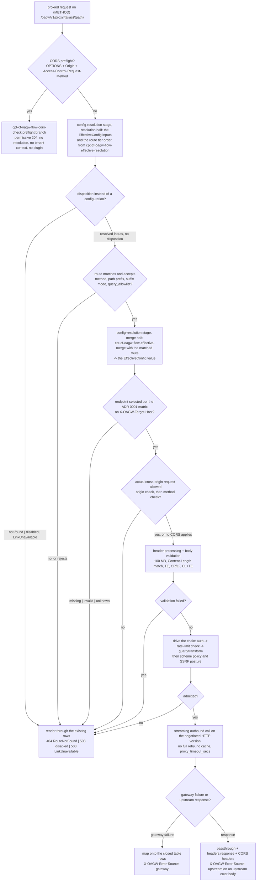

# Feature: Proxy Pipeline

<!-- toc -->

- [1. Feature Context](#1-feature-context)
  - [1.1 Overview](#11-overview)
  - [1.2 Purpose](#12-purpose)
  - [1.3 Actors](#13-actors)
  - [1.4 References](#14-references)
  - [1.5 Feature-Local Deviations](#15-feature-local-deviations)
- [2. Actor Flows (CDSL)](#2-actor-flows-cdsl)
  - [Proxy Request Pipeline](#proxy-request-pipeline)
  - [Built-in CORS Check](#built-in-cors-check)
- [3. Processes / Business Logic (CDSL)](#3-processes--business-logic-cdsl)
  - [Protocol-Scoped HTTP Route Matching](#protocol-scoped-http-route-matching)
  - [Outbound Endpoint Selection](#outbound-endpoint-selection)
- [4. States (CDSL)](#4-states-cdsl)
  - [Proxy Context State Machine](#proxy-context-state-machine)
- [5. Definitions of Done](#5-definitions-of-done)
  - [Proxy Request Pipeline](#proxy-request-pipeline-1)
  - [Endpoint Selection Contract](#endpoint-selection-contract)
  - [Error Source Header](#error-source-header)
  - [Inbound Request Validation](#inbound-request-validation)
- [6. Acceptance Criteria](#6-acceptance-criteria)

<!-- /toc -->

- [x] `p1` - **ID**: `cpt-cf-oagw-featstatus-proxy-pipeline-implemented`

<!-- reference to DECOMPOSITION entry -->
`p2` - `cpt-cf-oagw-feature-proxy-pipeline`

DECOMPOSITION entry 2.8 "Proxy Pipeline (Data Plane)" orders this feature and the text of that entry is the authority for this document's scope: the Purpose, Scope and Out-of-scope bullets below are that entry's and are implemented without widening or narrowing them, and feature progress for this document is owned by the `featstatus` line above.
## 1. Feature Context

### 1.1 Overview

This feature implements `DataPlaneService` and the proxy endpoint `{METHOD} /oagw/v1/proxy/{alias}/{path}`: it is the per-request pipeline of the `oagw` gear and the only place a client request becomes an outbound call. One proxied request passes through the stages of `cpt-cf-oagw-seq-proxy-flow` in a fixed order — request classification, the resolution half of the effective-configuration dispositions of `cpt-cf-oagw-feature-hierarchical-config`, route matching, the merge half of that stage, outbound endpoint selection on `X-OAGW-Target-Host`, the built-in CORS check of ADR 0004, header processing, body and header validation, the plugin chain with the rate-limit check at its ADR 0006 position, the outbound call under the scheme and SSRF policy, response passthrough, and error mapping with `X-OAGW-Error-Source` onto the closed 22-row table of `cpt-cf-oagw-algo-error-mapping`. The outbound call is the streaming bridge `DataPlaneServiceImpl` on hyper/hyper-util that DECOMPOSITION correction 4 substitutes for the Pingora engine, and no stage of the pipeline issues a full client-request retry, caches a response, or opens or consults a circuit breaker.

The feature drives and never re-implements. It consumes the `EffectiveConfig` value object instead of walking a tenant chain, invokes `cpt-cf-oagw-flow-rate-limit-check` of `cpt-cf-oagw-feature-rate-limiting` instead of holding a token bucket, drives the chain of `cpt-cf-oagw-feature-plugin-chain` instead of executing a plugin phase, maps onto the error table of `cpt-cf-oagw-feature-gear-wiring` instead of owning a row, and references `cpt-cf-oagw-feature-streaming-proxy` for the SSE and WebSocket behaviours instead of implementing them. What it owns outright is the stage order, the matching and selection algorithms, the default request validation, the scheme and SSRF policy at the outbound boundary, the response passthrough, the per-request error mapping, and the `<10ms` p95 added-latency budget of `cpt-cf-oagw-nfr-low-latency` that DECOMPOSITION entry 2.8 assigns to it.

The diagram below is the per-request decision of `cpt-cf-oagw-flow-proxy-request` from the arrival of the request to the response the caller receives, with `cpt-cf-oagw-flow-cors-check` appearing twice because its preflight branch short-circuits before resolution and its actual-request branch sits after endpoint selection. It is the only diagram in this document: the matching arithmetic lives in the step list of `cpt-cf-oagw-algo-route-matching`, the six-row selection matrix in the step list of `cpt-cf-oagw-algo-endpoint-selection`, and the request lifecycle in the state machine of §4, and a second diagram would only duplicate what those step lists already encode.

### 1.2 Purpose

This feature bridges DECOMPOSITION entry 2.8 "Proxy Pipeline (Data Plane)" into an implementation contract. It exists so that the gear has exactly one place where a request is classified, matched, selected, validated, dispatched and answered: `cpt-cf-oagw-feature-hierarchical-config` hands over the configuration this pipeline executes, `cpt-cf-oagw-feature-rate-limiting` and `cpt-cf-oagw-feature-plugin-chain` are invoked by it and never by anything else, `cpt-cf-oagw-feature-gear-wiring` renders what it decides, and `cpt-cf-oagw-feature-streaming-proxy` extends it for the streamed cases.

**Requirements**:

- [x] `p1` - `cpt-cf-oagw-fr-request-proxy` — the proxy endpoint `{METHOD} /oagw/v1/proxy/{alias}/{path}` (the `/api/oagw/v1/...` form being the operator-gateway-prefixed alias per DECOMPOSITION correction 1), the alias resolution, the route match, the configuration merge, the plugin chain and the forward that requirement enumerates are the stages of `cpt-cf-oagw-flow-proxy-request`, and the no-automatic-full-retry rule with its connector-level failover exception is that requirement's own sentence, carried per §1.5.
- [x] `p1` - `cpt-cf-oagw-fr-header-transform` — the set, add, remove and passthrough operations over request and response headers and the automatic hop-by-hop strip list (`Connection`, `Keep-Alive`, `Proxy-Authenticate`, `Proxy-Authorization`, `TE`, `Trailer`, `Transfer-Encoding`, `Upgrade`) are the header-processing stage, with the `Upgrade`/`Connection`/`Sec-WebSocket-*` carve-out belonging to `cpt-cf-oagw-feature-streaming-proxy` for upgrade requests only.
- [x] `p1` - `cpt-cf-oagw-fr-enable-disable` — the proxy-time 503 rejection of a disabled upstream is rendered by this feature, per the ownership `cpt-cf-oagw-feature-management-api` records at its line 181 and the typed `Disabled` disposition `cpt-cf-oagw-feature-hierarchical-config` returns; the exclusion of a disabled route from matching is `cpt-cf-oagw-algo-route-matching`'s own rule.
- [x] `p1` - `cpt-cf-oagw-fr-error-codes` — the per-request mapping onto the closed error table is this feature's: the rows the pipeline can produce are the ones §1.5 enumerates, and it adds none.
- [x] `p1` - `cpt-cf-oagw-nfr-ssrf-protection` — the IP pinning rules, the allowed segments and the scheme allowlist are applied at the outbound boundary of `cpt-cf-oagw-flow-proxy-request` behind the `ssrf_policy.enabled` hook, with the DNS-resolution "separate concern" of DESIGN 4.5 kept out per §1.5.
- [x] `p1` - `cpt-cf-oagw-nfr-low-latency` — the `<10ms` p95 added latency excluding the upstream response time is owned by this feature per DECOMPOSITION entry 2.8; the budget and its levers are stated in §1.5.
- [x] `p1` - `cpt-cf-oagw-nfr-input-validation` — path, query parameter, header and body-size validation of every inbound proxy request before forwarding, with `cpt-cf-oagw-dod-request-validation` as the implementing contract.
- [x] `p1` - `cpt-cf-oagw-nfr-high-availability` — realised this release as the 504/502/503 semantics plus the no-retry posture of `cpt-cf-oagw-principle-no-retry`; the circuit-breaker mechanism the requirement also names is deferred per DECOMPOSITION correction 4 and recorded as the §1.5 deviation.
- [x] `p1` - `cpt-cf-oagw-interface-proxy-api` — the proxy endpoint contract this feature is the handler of, at the base path of §1.5.

**Principles**: `p1` - `cpt-cf-oagw-principle-no-retry` (no failed upstream request is ever retried by the gateway as a whole, retry being the client's responsibility), `p1` - `cpt-cf-oagw-principle-no-cache` (no upstream response is cached anywhere in the pipeline, caching being the client's and upstream's responsibility), `p1` - `cpt-cf-oagw-principle-error-source` (every response the pipeline produces carries `X-OAGW-Error-Source: gateway|upstream`), `p1` - `cpt-cf-oagw-principle-cred-isolation` (the pipeline references secrets only through the `cred://` references the auth plugins resolve and never stores, logs or forwards secret material).

**Constraints**: `p1` - `cpt-cf-oagw-constraint-body-limit` (the 100 MB body hard limit, rejected before buffering, is enforced by the validation stage of `cpt-cf-oagw-flow-proxy-request`), `p1` - `cpt-cf-oagw-constraint-https-only` (HTTPS-only for upstream connections is the default posture, lifted only by the `allow_http_upstream` knob of DECOMPOSITION correction 2).

**Components**: `p1` - `cpt-cf-oagw-interface-api` — the Proxy API subsection of that component contract is what this feature implements, with the path base of §1.5; `p1` - `cpt-cf-oagw-component-model` — the `DataPlaneService` element that orchestrates proxy requests, resolves configuration through the control plane and builds the outbound request, implemented this release as the streaming bridge of DECOMPOSITION correction 4 rather than on the `pingora` dependency of `cpt-cf-oagw-tech-dependencies`.

**Sequences**: `p1` - `cpt-cf-oagw-seq-proxy-flow` — owned stage-wise per DECOMPOSITION: this feature owns orchestration and the endpoint-selection stages of that sequence and drives every other stage; the config-resolution stage belongs to `cpt-cf-oagw-feature-hierarchical-config`, the rate-limit stage to `cpt-cf-oagw-feature-rate-limiting`, the plugin stages to `cpt-cf-oagw-feature-plugin-chain`, and the streaming stages to `cpt-cf-oagw-feature-streaming-proxy`.

**API**: `{METHOD} /oagw/v1/proxy/{alias}/{path}` — the shell DECOMPOSITION entry 2.8 declares as `GET /oagw/v1/proxy/{alias}` and `POST|PUT|PATCH|DELETE /oagw/v1/proxy/{alias}/{path}`, registered by `cpt-cf-oagw-feature-gear-wiring` as one `{METHOD}` shell accepting GET, POST, PUT, PATCH and DELETE, and owned by this feature; the `/api/oagw/v1/proxy/...` form is the operator-gateway-prefixed alias per §1.5, the endpoint being `unstable` per `cpt-cf-oagw-interface-proxy-api`, a major version bump being required for a breaking change. The `X-OAGW-Target-Host` request header is consumed for routing and never forwarded.

**Data**: None — the pipeline persists nothing, creates no table and adds no schema object: it reads the stored upstreams, routes and bindings through the resolution of `cpt-cf-oagw-feature-hierarchical-config` and the repository traits of `cpt-cf-oagw-feature-domain-model`, and the only state it owns is the per-request `ProxyContext` of §4 and the in-memory per-host HTTP-version capability and round-robin cursors described in §1.5.

### 1.3 Actors

| Actor | Role in Feature |
|-------|-----------------|
| `cpt-cf-oagw-actor-app-developer` | Initiates every proxied request on the proxy shell and is the recipient of every outcome this feature produces: the upstream response passed through, or one of the problem+json rejections of §1.5. Never calls a stage of the pipeline directly and never sees `X-OAGW-Target-Host` echoed back, the routing headers being consumed. |
| `cpt-cf-oagw-actor-tenant-admin` | Configures the upstreams and routes whose match rules, endpoint pools, header rules and CORS blocks this feature executes, and owns correcting a configuration whose routing outcome is not the one intended. Sees a disabled resource as a proxy rejection, not as a management error. |
| `cpt-cf-oagw-actor-platform-operator` | Owns the `OagwConfig` keys this pipeline reads — `proxy_timeout_secs`, `allow_http_upstream`, `ssrf_policy.enabled` and the body limit — and the ancestor-tier disable decisions the pipeline renders as the 503 rejection. |
| `cpt-cf-oagw-actor-upstream-service` | Receives the outbound call this feature performs and returns the response this feature passes through. Its error responses are passed through as-is with `X-OAGW-Error-Source: upstream`; its unreachability, its timeouts and its protocol failures are gateway-classified and mapped onto the closed table. |

Every step of both flows of §2 is performed by this feature on behalf of `cpt-cf-oagw-actor-app-developer`: no actor invokes `cpt-cf-oagw-algo-route-matching`, `cpt-cf-oagw-algo-endpoint-selection` or the state machine of §4 directly, and no actor reaches the resolution, the limiter, the plugin chain or the error table except through the pipeline. The preflight branch of `cpt-cf-oagw-flow-cors-check` is the one stage a browser client reaches before any tenant context exists, per ADR 0004.

### 1.4 References

- **PRD**: [PRD.md](../PRD.md) — `cpt-cf-oagw-fr-request-proxy` (the proxy endpoint, the stage list, and the no-automatic-full-retry rule with the connector-level endpoint failover exception), `cpt-cf-oagw-fr-header-transform` (set/add/remove/passthrough and the hop-by-hop strip list), `cpt-cf-oagw-fr-enable-disable` (the 503 rejection of a disabled upstream and the exclusion of a disabled route from matching), `cpt-cf-oagw-fr-error-codes` (the error-code requirement whose rows the closed table of `cpt-cf-oagw-algo-error-mapping` realises in full), `cpt-cf-oagw-nfr-ssrf-protection` (DNS validation, IP pinning, header stripping, path and query validation), `cpt-cf-oagw-nfr-low-latency` (the `<10ms` p95 added-latency threshold), `cpt-cf-oagw-nfr-input-validation` (path, query, header and body-size validation with 100% of malformed requests rejected), `cpt-cf-oagw-nfr-high-availability` (99.9% availability and the circuit-breaker threshold deferred per §1.5), `cpt-cf-oagw-interface-proxy-api`, the use case `cpt-cf-oagw-usecase-proxy-request` whose main flow and whose "Upstream not found", "Upstream disabled", "Auth plugin fails", "Rate limit exceeded" and "Upstream timeout" alternative flows this feature renders, the "Auth plugin fails" alternative flow being rendered through the refusal rows `cpt-cf-oagw-feature-plugin-chain` maps, its 401 `AuthenticationFailed` being reserved for the upstream-credential path that feature records, and the actors `cpt-cf-oagw-actor-app-developer`, `cpt-cf-oagw-actor-tenant-admin`, `cpt-cf-oagw-actor-platform-operator`, `cpt-cf-oagw-actor-upstream-service`
- **Design**: [DESIGN.md](../DESIGN.md) — `cpt-cf-oagw-component-model` (`DataPlaneService` and the Request Routing table), `cpt-cf-oagw-interface-api` (the Proxy API subsection with its request classification and the error response format table (20 rows in DESIGN, extended to the closed 22-row form of `cpt-cf-oagw-algo-error-mapping` by the two ADR 0004 CORS rows carried by `cpt-cf-oagw-feature-gear-wiring`)), `cpt-cf-oagw-seq-proxy-flow` (the proxy request sequence this feature orchestrates), the "Headers Transformation" subsection (the three header categories, the strip table, `Host` replacement, the `:authority` pseudo-header rules and the `upstream.headers` transformations), the "Guard Rules" table (method allowlist, `query_allowlist`, `path_suffix_mode`, body, CORS origin, CORS method), the "Body Validation Rules" table (Content-Length match, 100 MB limit, Transfer-Encoding), the "Transformation Rules" table, the "Request Classification" statement that `upstream.protocol` selects the match strategy, "Multi-Endpoint Load Balancing" (round-robin over a homogeneous pool), `cpt-cf-oagw-db-schema` (the Common Queries row "Find Matching Route for Request" that `cpt-cf-oagw-algo-route-matching` performs and the route-match determinism invariant it relies on), the metrics `oagw_routing_target_host_used{upstream_id, endpoint_host}`, `oagw_routing_endpoint_selected{upstream_id, endpoint_host, selection_method}`, `oagw_requests_total`, `oagw_request_duration_seconds{host, http.route, phase}`, `oagw_requests_in_flight{host}`, `oagw_errors_total` and `oagw_upstream_available{host, endpoint}`, the log point of §4.3 and the `Retry-After` WARN guidance of §4.3, `cpt-cf-oagw-principle-no-retry`, `cpt-cf-oagw-principle-no-cache`, `cpt-cf-oagw-principle-error-source`, `cpt-cf-oagw-principle-cred-isolation`, `cpt-cf-oagw-principle-rfc9457`, `cpt-cf-oagw-constraint-body-limit`, `cpt-cf-oagw-constraint-https-only`, `cpt-cf-oagw-tech-dependencies` and the §4.4 Security Considerations block (SSRF, CORS, HTTP smuggling, HTTP/2 adaptive negotiation with the 1h capability TTL) and the §4.7 future-work list that defers the circuit breaker
- **Decomposition**: [DECOMPOSITION.md](../DECOMPOSITION.md) — entry 2.8 "Proxy Pipeline (Data Plane)" and the "Spec corrections applied" block in its overview (corrections 1, 2, 3, 4, 5 and 7 apply to this feature, as does the "Phase numbering precedence" paragraph)
- **ADR**: [ADR/0001-request-routing.md](../ADR/0001-request-routing.md) (`cpt-cf-oagw-adr-request-routing`) — the Routing Rules, the Proxy Operations request flow, the request-classification statement and the six-row `X-OAGW-Target-Host` Behavior Matrix of Appendix A; [ADR/0004-cors.md](../ADR/0004-cors.md) (`cpt-cf-oagw-adr-cors`) — the built-in handler decision and its rejected alternatives, the configuration schema, the preflight and actual-request handling, origin matching, the security considerations and the two 403 error payloads; [ADR/0002-plugin-system.md](../ADR/0002-plugin-system.md) (`cpt-cf-oagw-adr-plugin-system`) — the Auth → Guards → Transform(request) → Upstream call → Transform(response/error) order the pipeline drives; [ADR/0006-state-management.md](../ADR/0006-state-management.md) (`cpt-cf-oagw-adr-state-management`) — the data-plane request flow that places the rate-limit check after the auth plugin and before the guard and transform plugins; [ADR/0007-error-source-distinction.md](../ADR/0007-error-source-distinction.md) (`cpt-cf-oagw-adr-error-source-distinction`) — the header contract, the passthrough rule for upstream error bodies and the problem+json form for gateway errors
- **Dependencies**:
  - [ ] `p2` - `cpt-cf-oagw-feature-rate-limiting` — the direct dependency DECOMPOSITION entry 2.8 declares in its "Depends On" line (the edge `rate-limiting → proxy-pipeline` in the feature graph): this feature is the caller of `cpt-cf-oagw-flow-rate-limit-check` on every proxied request, places it after the auth plugin and before the guard and transform plugins, and renders the 429 that check produces. This feature evaluates no rate limit of its own and derives no counter key.
  - [ ] `p2` - `cpt-cf-oagw-feature-plugin-chain` — the second direct dependency the DECOMPOSITION feature graph declares (the edge `plugin-chain → proxy-pipeline` and the dependency rationale line, though the entry's "Depends On" line names only rate-limiting): this feature drives `cpt-cf-oagw-flow-execution-plan` and the three per-request phases and performs none of them.
  - Reached transitively through that chain rather than declared directly: `cpt-cf-oagw-feature-hierarchical-config` (the `EffectiveConfig` value, the route tier order fixed at `inst-ef-08`/`inst-ef-11` and the not-found, disabled and `LinkUnavailable` dispositions this pipeline consumes), `cpt-cf-oagw-feature-gear-wiring` (the registered proxy shell, the `OagwConfig` keys `cpt-cf-oagw-algo-config-load` defaults, the problem+json error contract `cpt-cf-oagw-flow-error-response` and the closed 22-row mapping table `cpt-cf-oagw-algo-error-mapping`), `cpt-cf-oagw-feature-domain-model` (the `Upstream`, `Route` and `Endpoint` value objects and the persist-time validation of `cpt-cf-oagw-algo-shape-validation` and `cpt-cf-oagw-algo-endpoint-validation` this pipeline consumes without re-validating) and `cpt-cf-oagw-feature-alias-resolution` (the normalized alias this pipeline resolves and the alias-kind classification `cpt-cf-oagw-algo-endpoint-selection` reads).
- **Reverse dependents**: `cpt-cf-oagw-feature-streaming-proxy` is the direct dependent in the DECOMPOSITION feature graph (the edge `proxy-pipeline → streaming-proxy`): it extends the base pipeline this document defines with the SSE and WebSocket behaviours, owns the `Upgrade`/`Connection`/`Sec-WebSocket-*` carve-out of the hop-by-hop strip list for upgrade requests only, and inherits the stage order, the selection contract and the error-source contract of this document. `cpt-cf-oagw-feature-observability` sits downstream of the same edge and emits what this pipeline decides. `cpt-cf-oagw-feature-management-api` names this feature as the owner of the proxy-time 503 rejection of a disabled upstream but is not a dependent — its direct dependency is `cpt-cf-oagw-feature-alias-resolution`. None of them may re-order the pipeline stages, re-match a route, re-select an endpoint or add a row to the closed mapping table.
- **API and data declarations**: API: `{METHOD} /oagw/v1/proxy/{alias}/{path}` and Data: None, as the DECOMPOSITION entry records them and as §1.2 and the Touches lines of §5 carry.

### 1.5 Feature-Local Deviations

Deviations from the supplied spec/platform baseline, recorded per the shared-baseline policy.

**Conformance (not a deviation)** — the ownership split this pipeline sits at the centre of: this feature owns orchestration, request classification, route-matching execution, endpoint selection, the built-in CORS check, header processing, body and header validation, the scheme and SSRF policy at the outbound boundary, the outbound call, the response passthrough and the per-request error mapping. `cpt-cf-oagw-feature-hierarchical-config` computes the `EffectiveConfig` and returns the typed dispositions this pipeline consumes without re-walking a chain or re-applying a sharing mode; `cpt-cf-oagw-feature-rate-limiting` owns the check and this feature owns its invocation and position; `cpt-cf-oagw-feature-plugin-chain` owns the execution plan and every plugin phase and this feature drives them; `cpt-cf-oagw-feature-gear-wiring` owns the registered shell and the closed 22-row error table and this feature owns the per-request mapping onto those rows; `cpt-cf-oagw-feature-streaming-proxy` owns the SSE and WebSocket behaviours and this feature owns the base pipeline they extend.
**Rationale** — DECOMPOSITION records the stage-wise ownership of `cpt-cf-oagw-seq-proxy-flow`, entry 2.4 places proxy-time behaviour with this feature and `cpt-cf-oagw-feature-management-api` names this feature the renderer of the proxy-time 503 of a disabled upstream, and entry 2.9 scopes the streaming behaviours out of this one; recording the split keeps five features from re-stating one another's rules.
**Review owner**: `cf-generate-author-senior via cf-write-docs review loop`

**Conformance (not a deviation)** — the config-resolution stage of `cpt-cf-oagw-seq-proxy-flow` is entered in two halves by this pipeline: `cpt-cf-oagw-flow-effective-resolution` runs before route matching and `cpt-cf-oagw-flow-effective-merge` runs after `cpt-cf-oagw-algo-route-matching` returns the matched route, `inst-pf-08` being the only step of the pipeline that consumes the `EffectiveConfig` value the merge returns. The split follows from that stage's own contract: the merge's defined input at `inst-mg-01` of `cpt-cf-oagw-feature-hierarchical-config` is the selected target, its ancestor chain and the matched route, and two of its outputs are route-derived — `inst-mg-04` positions the matched route's blocks after every upstream tier and `inst-mg-05` computes the `min(..., route limit)` that `inst-me-10` fixes — so the merge cannot precede the match, while the dispositions rendered at `inst-pf-06` are outcomes of the resolution half alone.
**Rationale** — the main flow of `cpt-cf-oagw-usecase-proxy-request` orders "matches route by method/path" before "merges configs (upstream < route < tenant)", and `cpt-cf-oagw-feature-hierarchical-config` leaves the wire decision of the merge to this caller, so recording the two halves keeps one stage name from being read as one invocation.
**Review owner**: `cf-generate-author-senior via cf-write-docs review loop`

**Deviation** — the method allowlist is part of the match key and not a post-match guard: a method that no candidate route of the tier allows leaves no matched route, and the request is answered 404 `RouteNotFound`. DESIGN's Guard Rules row for Method reads "Must be in `match.http.methods`; reject if not allowed", which read as a post-match rule would make that rejection 400 `ValidationError`, but DESIGN's own request-classification statement reads "HTTP: method allowlist + longest path prefix match" and its match key is `(upstream_id, method, longest path prefix, priority)` under the method-partitioned determinism invariant. The reading recorded here is the match-filter one: DESIGN's "reject if not allowed" row is realised as the skip of `inst-rm-05`/`inst-rm-06` rather than as a post-match 400 `ValidationError`, which is the reading that lets two routes share one path prefix with disjoint method sets and that DESIGN's own request-classification statement and match key carry.
**Rationale** — the two DESIGN statements conflict, and the match-key reading is the one the determinism invariant and the §6 route-ordering criterion already depend on; recording it keeps `cpt-cf-oagw-dod-request-validation` assertable.
**Review owner**: `cf-generate-author-senior via cf-write-docs review loop`

**Deviation** — the proxy base path this feature serves is `/oagw/v1/proxy/{alias}/{path}`, without the leading `/api` segment that `cpt-cf-oagw-interface-proxy-api`, the Proxy API subsection of `cpt-cf-oagw-interface-api` and the ADR 0001 Routing Rules and Appendix A examples all write. The `/api/oagw/v1/proxy/...` form is documented as the operator-gateway-prefixed alias and is not the path this deployment serves, so the alias this feature resolves is the segment after `/oagw/v1/proxy/`, the `instance` field of a problem+json body carries the gear-relative path, and the same base decision is already recorded by `cpt-cf-oagw-feature-gear-wiring`, `cpt-cf-oagw-feature-management-api`, `cpt-cf-oagw-feature-hierarchical-config` and `cpt-cf-oagw-feature-alias-resolution` for the surfaces they own.
**Rationale** — DECOMPOSITION correction 1: all oagw routes are registered gear-relative at `/oagw/v1/...`, the prefixed form being the absolute path behind an operator-facing gateway, and sibling gears register gear-relative paths for the same reason.
**Review owner**: `cf-generate-author-senior via cf-write-docs review loop`

**Conformance (not a deviation)** — the two CORS positions: the preflight is answered by the handler before anything else happens, and the actual-request checks sit inside the pipeline. ADR 0004 places the preflight at handler level with "no upstream resolution, no tenant context required" and places origin validation "on actual requests after upstream resolution, before forwarding", and DECOMPOSITION entry 2.8 lists the built-in CORS handler without a position. The resolution recorded here is that `cpt-cf-oagw-flow-cors-check` is entered twice per request family: at its preflight branch as the first decision of `cpt-cf-oagw-flow-proxy-request` (before the config-resolution stage, so a preflight is never charged a resolution, a route match or a plugin), and at its actual-request branch after endpoint selection and before header processing, which is the position the stage list of the pipeline fixes.
**Rationale** — the ADR states both positions in different sentences and the DECOMPOSITION stage list fixes the actual-request one; recording both keeps a preflight from being read as requiring a resolved upstream and an origin check from being read as happening before the target is known.
**Review owner**: `cf-generate-author-senior via cf-write-docs review loop`

**Conformance (not a deviation)** — which existing row carries which request-time rejection: no route of the tier matching the request is 404 `RouteNotFound`, and a method no route of the tier allows is 404 `RouteNotFound` as well, there being no matched route to reject it; a route that matched but rejected the request on its `query_allowlist` or its `path_suffix_mode: disabled` is 400 `ValidationError`; a body or header syntax failure is 400 `ValidationError`; the 100 MB limit is 413 `PayloadTooLarge`; a missing, malformed or unknown `X-OAGW-Target-Host` is the existing `MissingTargetHost`, `InvalidTargetHost` or `UnknownTargetHost` row; a rejected origin or method is the existing `CorsOriginNotAllowed` or `CorsMethodNotAllowed` row; a disabled upstream is the 503 of the next entry. `RouteError` — "General route validation error", distinct from `ValidationError` only in that description — is the row this feature uses for a defect in the route configuration discovered at request time rather than in the request, and it is unreachable this release **for the route-defect case**, the persist-time validation of `cpt-cf-oagw-feature-domain-model` closing that defect before a route can be stored; its one reachable use this release is the non-proxied-scheme answer of `inst-rm-03` and `inst-pf-30`, and the row is cited and never widened.
**Rationale** — `cpt-cf-oagw-nfr-input-validation` requires invalid requests to be rejected with 400 and DESIGN's body-validation table names `ValidationError` and `PayloadTooLarge` explicitly, while "No matching route found" is the `RouteNotFound` description verbatim; no upstream document states the 400/404 boundary for a match failure, so recording it here keeps `cpt-cf-oagw-dod-request-validation` assertable on the wire without adding a row to the closed table.
**Review owner**: `cf-generate-author-senior via cf-write-docs review loop`

**Conformance (not a deviation)** — the disabled-upstream 503 is rendered through the existing `LinkUnavailable` row: the typed `Disabled` disposition `cpt-cf-oagw-feature-hierarchical-config` returns gains no row of its own in the closed table, and this feature — the caller that the management-api feature names as the renderer — maps it onto the existing `LinkUnavailable` row (503, `gts.cf.core.errors.err.v1~cf.oagw.link.unavailable.v1`, retriable `Yes`) with `X-OAGW-Error-Source: gateway` and a `detail` naming the disabled upstream, which is a gateway error type as `cpt-cf-oagw-usecase-proxy-request`'s "Upstream disabled: Return 503 with gateway error type" alternative flow requires. No `CircuitBreakerOpen` and no `PluginNotFound` is used for it, and no row is added.
**Rationale** — no row of the closed 22-row table means "disabled upstream", so the disposition must be rendered through an existing one; `LinkUnavailable` is the only 503 row whose meaning — the configured target cannot serve this request — and whose `Retriable: Yes` value match a state an operator can change by re-enabling the upstream, and `cpt-cf-oagw-feature-hierarchical-config` leaves the wire-status decision explicitly to this caller.
**Review owner**: `cf-generate-author-senior via cf-write-docs review loop`

**Conformance (not a deviation)** — the route tie-break: candidates are ordered by longest matching `match.http.path` prefix first; among candidates whose prefix has the same length, the route from the descendant tier wins over an inherited ancestor route, per the route tier order `cpt-cf-oagw-feature-hierarchical-config` fixes at `inst-ef-08`; and among candidates with the same prefix inside one tier, the greater `priority` value wins. No upstream document states the direction of the `priority` field — DESIGN states only the match key `(upstream_id, method, longest path prefix, priority)` and the determinism invariant that no two enabled routes under the same upstream share `(path_prefix, priority)` for the same method — so this is the resolution recorded here, and it is the reading that makes a raised `priority` make a route win, which is what the field's name asserts.
**Rationale** — the invariant makes `(path_prefix, priority)` unique per upstream and method, so after the longest-prefix and tier steps at most one candidate per prefix remains and the `priority` comparison is a total order that cannot end in a tie, the `priority` comparison being consulted only between candidates of one upstream, candidates at the same prefix carried by different ancestor upstreams being ordered by the chain position `inst-ef-08` fixes, which is why the tier step precedes it; recording the direction keeps the match deterministic and §6 assertable, and no upstream document is contradicted by it.
**Review owner**: `cf-generate-author-senior via cf-write-docs review loop`

**Conformance (not a deviation)** — `X-OAGW-Error-Source` on a successful response: ADR 0007's confirmation requires the header on success responses as well as on both error classes, and states a value only for the two error cases. The resolution recorded here is that a proxied success response carries `X-OAGW-Error-Source: upstream` — the body the caller receives originating at `cpt-cf-oagw-actor-upstream-service`, which is the same source distinction the header exists to make — and that the preflight 204 of `cpt-cf-oagw-flow-cors-check` carries `X-OAGW-Error-Source: gateway`, the status and headers of that response being OAGW-generated. `cpt-cf-oagw-dod-error-source-header` binds both.
**Rationale** — the header is defined by DESIGN 3.3 and ADR 0007 as an indicator of where the response came from, and the confirmation sentence of ADR 0007 requires its presence on every response; reading the success value off the body's origin keeps one rule for all cases instead of inventing a third value.
**Review owner**: `cf-generate-author-senior via cf-write-docs review loop`

**Conformance (not a deviation)** — the proxy shell method set: ADR 0004 requires a browser preflight to be detected and answered locally by the proxy handler with the permissive 204, and `cpt-cf-oagw-dod-error-source-header` binds the gateway source header that 204 carries, so the preflight has to be reachable over the wire. `cpt-cf-oagw-feature-gear-wiring` fixes the shell as `{METHOD} /oagw/v1/proxy/{alias}/{path}` accepting GET, POST, PUT, PATCH and DELETE *as defined by DECOMPOSITION entry 2.8*, delegating the definition of `{METHOD}` to this entry; the resolution recorded here is that the closed set those two shell paths register is those five methods plus `OPTIONS`, which is what lets an `OPTIONS` request carrying `Origin` and `Access-Control-Request-Method` reach the preflight branch of `cpt-cf-oagw-flow-cors-check` instead of being answered `405` by the routing layer. A non-preflight `OPTIONS` — the method without both headers — is not a preflight: it falls through to the route match, no route of an upstream allows it, and it is answered with the existing `404 RouteNotFound` row, which is the answer the shell would give it under either reading. No new route path is registered by this resolution; the two shell paths stay the two `cpt-cf-oagw-feature-gear-wiring` mounts, carrying six methods each.
**Rationale** — the shell widening is the difference between a preflight decision that exists only inside the crate and one a browser can obtain, and ADR 0004's fast path ("preflight requests contain no credentials … the proxy handler detects preflight and returns a permissive 204") is stated as a wire behaviour, not an internal one; recording it here keeps `cpt-cf-oagw-dod-gear-registration` — which pins the five methods it registered at entry-2.1 time and defers the definition — and the ADR from being read as contradicting each other.
**Review owner**: `cf-generate-author-senior via cf-write-docs review loop`

**Deviation** — the scheme policy: `http` is accepted as the `Upstream.server.endpoints[].scheme` value by the configuration surface, and whether a plaintext connection is actually established is decided only by the `allow_http_upstream` knob of the `OagwConfig` (default `false`, defaulted by `cpt-cf-oagw-feature-gear-wiring`), which lifts the `cpt-cf-oagw-constraint-https-only` posture for that endpoint alone. The two concerns stay apart: the scheme enum `http`, `https`, `wss`, `grpc`, `wt` is the config-surface question `cpt-cf-oagw-algo-shape-validation` settles at persist time, and the plaintext question is this feature's runtime decision at `inst-pf-30`. An endpoint whose scheme is `wt` is valid configuration that is never proxied, and an endpoint whose scheme is `grpc` is valid configuration with no proxy code path: both are answered with the gateway `RouteError`/`ProtocolError` problem+json semantics rather than forwarded.
**Rationale** — DECOMPOSITION corrections 2 and 7 and the "Phase numbering precedence" paragraph declare exactly this separation and these two residuals; keeping the enum question and the plaintext question apart is what correction 2 asks for, and answering a non-proxied scheme with an existing gateway type rather than silently forwarding it keeps an accepted configuration value from being read as a proxy guarantee. The per-case assignment is that a `wt` or `grpc` endpoint is answered with 400 `RouteError` — the row `cpt-cf-oagw-feature-gear-wiring` carries as "General route validation error" (400, `gts.cf.core.errors.err.v1~cf.oagw.validation.error.v1`, retriable `No`), the request-time route-configuration class the row-mapping entry above already assigns it — while `ProtocolError` remains the row for a protocol failure in an attempted exchange at `inst-pf-34`; correction 7 names the pair, and this resolution fixes which of the two a non-proxied scheme answers with, adding no row.
**Review owner**: `cf-generate-author-senior via cf-write-docs review loop`

**Deviation** — no circuit breaker: the pipeline neither opens, nor consults, nor exposes a circuit breaker. The `CircuitBreakerOpen` row (503, `gts.cf.core.errors.err.v1~cf.oagw.circuit_breaker.open.v1`) stays reserved in the closed table, the `oagw_circuit_breaker_state{host}` and `oagw_circuit_breaker_transitions_total{host, from_state, to_state}` instruments are never emitted, and the `Circuit breaker events` log point of DESIGN 4.3 has no producer. This narrows `cpt-cf-oagw-nfr-high-availability`, whose "circuit breaker trips within 5 failed requests in 30s window" threshold has no executable mechanism this release: the availability posture this feature delivers is the 504 `ConnectionTimeout`/`RequestTimeout`/`IdleTimeout`, 502 `ProtocolError`/`DownstreamError`/`StreamAborted` and 503 `LinkUnavailable` semantics of the closed table together with the no-retry rule, which bounds the work one unhealthy upstream can cause to a single request and prevents cascade by refusing rather than by accumulating in-flight retries.
**Rationale** — DECOMPOSITION correction 4 defers the circuit-breaker mechanism and DESIGN 4.7 lists it as future work, and a breaker that opened but was never consulted would be worse than none; stating the residual keeps the reserved row and the unserved NFR threshold visible instead of implicit.
**Review owner**: `cf-generate-author-senior via cf-write-docs review loop`

**Conformance (not a deviation)** — the retry and cache boundary: no failed upstream request is ever re-issued as a whole and no upstream response is ever cached, per `cpt-cf-oagw-principle-no-retry` and `cpt-cf-oagw-principle-no-cache` and per DESIGN 4.5, which lists response caching and automatic retries as out of scope. The distinction `cpt-cf-oagw-fr-request-proxy` itself draws is carried unchanged: the prohibition is on re-issuing the original client request as a whole, while connector-level endpoint failover and connection-retry attempts performed by the upstream connector — an endpoint-level retry that the caller never observes as a second client request — remain permitted. There is no response cache, no cache invalidation and no ADR 0005 L1/L2 or ADR 0006 DP L1 tier anywhere in this pipeline, DECOMPOSITION correction 4 having superseded both in favour of the in-memory stores of correction 3.
**Rationale** — the PRD sentence states the boundary in its own terms and the pipeline is the place where the boundary is either kept or broken; recording which side the connector sits on keeps `cpt-cf-oagw-principle-no-retry` from being read as forbidding a transport-level reconnect.
**Review owner**: `cf-generate-author-senior via cf-write-docs review loop`

**Conformance (not a deviation)** — HTTP version negotiation and `:authority`: the outbound connection is established with adaptive per-host version detection per DESIGN §4.4 — the first request to a host attempts HTTP/2 via ALPN during the TLS handshake, a success caches "HTTP/2 supported" for that host and a failure caches "HTTP/1.1 only", and subsequent requests use the cached version, the cache entry living for the 1 hour TTL DESIGN states. The capability cache is in-memory, per host/IP, process-lifetime state of the data plane, never persisted and lost on restart, so a restart re-attempts the negotiation. On an HTTP/2 hop the `:authority` pseudo-header is replaced with the upstream authority exactly as `Host` is on an HTTP/1.1 hop, and neither ever replaces `X-OAGW-Target-Host` as the routing input, which is consumed before either is written. HTTP/3 (QUIC) is future work per DESIGN 4.5 and has no code path.
**Rationale** — DESIGN states the negotiation algorithm, the TTL and the `:authority` rule and leaves them unowned; DECOMPOSITION entry 2.8 assigns "HTTP/2 support: adaptive per-host version negotiation with a cached per-host capability" to this feature, so recording the cache's lifetime and loss-on-restart keeps an implementation from adding a persistence or invalidation path no upstream document asks for.
**Review owner**: `cf-generate-author-senior via cf-write-docs review loop`

**Conformance (not a deviation)** — the streaming boundary: this feature owns the base pipeline and the streaming transport — the `DataPlaneServiceImpl` bridge forwards the request body and the response body without buffering them, which is what makes the passthrough streaming — and it does not implement any SSE or WebSocket behaviour. The detection of an upstream `text/event-stream` and its frame-by-frame forwarding, the client upgrade → upstream upgrade handshake and the bidirectional frame pump, the stream-abort 502 `StreamAborted` mapping and the idle-read timeout of a live stream are `cpt-cf-oagw-feature-streaming-proxy`'s, as is the one carve-out into this feature's strip list: `Upgrade`, `Connection` and `Sec-WebSocket-*` are exempt from the hop-by-hop strip for WebSocket upgrade requests only, and only in that feature's implementation. This feature strips `Upgrade` and `Connection` unconditionally on a non-upgrade request and references the carve-out without implementing it.
**Rationale** — DECOMPOSITION entry 2.9 declares the carve-out as that feature's and scopes the SSE and WebSocket behaviours out of entry 2.8, while entry 2.8 keeps "the streaming outbound call" here; recording the boundary keeps the strip list's exception from being implemented twice or read as a general exemption.
**Review owner**: `cf-generate-author-senior via cf-write-docs review loop`

**Conformance (not a deviation)** — the latency budget: the `<10ms` added latency at p95 excluding the upstream response time that `cpt-cf-oagw-nfr-low-latency` states is owned by this feature per DECOMPOSITION entry 2.8, and it is measured across the whole pipeline from the arrival instant recorded at `inst-pf-01` to the response returned to the API handler. The levers this feature controls are the ones the correction block leaves it: in-memory resolution consumed as a value with no second walk, in-memory route matching and endpoint selection with no I/O, the in-memory limiter of `cpt-cf-oagw-feature-rate-limiting`, no configuration cache and no response cache to add a layer or a lookup, and a streaming passthrough that never buffers a body it does not have to validate. Plugin execution timeouts are the other half of that requirement and are the plugin-chain feature's concern.
**Rationale** — DECOMPOSITION assigns the budget to this feature and the correction block removes the cache tiers that would otherwise be the obvious lever, so stating the budget together with what bounds it keeps the threshold attributable rather than aspirational.
**Review owner**: `cf-generate-author-senior via cf-write-docs review loop`

**Conformance (not a deviation)** — the SSRF and smuggling posture at the outbound boundary: `ssrf_policy.enabled` is the `OagwConfig` hook `cpt-cf-oagw-feature-gear-wiring` owns and defaults to `true`, and when enabled this feature applies the three controls DESIGN §4.4 names — the scheme allowlist of `inst-pf-30`, the allowed-segment match on the resolved endpoint host, and the IP pinning rule that the endpoint the configuration names, not a caller-supplied host, is the only address the outbound connection may reach. The HTTP request-smuggling defences of DESIGN §4.4 are the validation of `inst-pf-21`: CR/LF rejected in any header value, `Content-Length` together with `Transfer-Encoding` rejected, `Transfer-Encoding` limited to `chunked`, and a `Content-Length` that does not match the received size rejected. The DNS-resolution and IP-pinning implementation that DESIGN 4.5 lists as a separate concern is not built here: no DNS resolver and no pinning table is maintained by this feature, and the pinning rule is applied to the already-resolved endpoint address the configuration carries.
**Rationale** — DESIGN §4.4 states the SSRF and smuggling controls and §4.5 moves their DNS half to a separate concern, and `cpt-cf-oagw-nfr-ssrf-protection` names the same four controls; recording that the hook is applied at the outbound boundary and that no resolver is built keeps a security control from being read as an unimplemented aspiration while keeping this feature from growing a DNS subsystem no upstream document assigns to it.
**Review owner**: `cf-generate-author-senior via cf-write-docs review loop`

**Conformance (not a deviation)** — the instruments this feature's decisions feed: `oagw_requests_total{host, http.request.method, http.route, http.response.status_code}`, `oagw_request_duration_seconds{host, http.route, phase}`, `oagw_requests_in_flight{host}`, `oagw_errors_total{host, http.route, error_type}`, `oagw_routing_target_host_used{upstream_id, endpoint_host}`, `oagw_routing_endpoint_selected{upstream_id, endpoint_host, selection_method}` and `oagw_upstream_available{host, endpoint}`, the last driven by this pipeline's outcomes and emitted by `cpt-cf-oagw-feature-observability` like the rest, together with the structured audit record of DESIGN §4.3 and the `Retry-After` WARN log point that section assigns to the rate-limit stage. Their emission, their label cardinality rules and their exposure belong to `cpt-cf-oagw-feature-observability`, and exposure is the platform telemetry stack per DECOMPOSITION correction 5 — `oagw` mounts no `/metrics` route of its own. This feature owns the decisions those instruments count: the selection method is recorded at `inst-es-17`, the `selection_method` label carrying `explicit_header`, `round_robin` and `default` as DESIGN's routing-metrics block enumerates them, the mapped `error_type` is the row name of `cpt-cf-oagw-algo-error-mapping`, and the `phase` label of the duration histogram is the pipeline stage.
**Rationale** — DECOMPOSITION assigns metric and audit emission to `cpt-cf-oagw-feature-observability`, and naming the instruments without owning their emission keeps the counters attributable to the pipeline's decisions without a second emission path.
**Review owner**: `cf-generate-author-senior via cf-write-docs review loop`

**Out of scope** — WebSocket and WebTransport specifics, the upgrade handshake, the frame pump, the SSE frame pass-through and the `Upgrade`/`Connection`/`Sec-WebSocket-*` carve-out, owned by `cpt-cf-oagw-feature-streaming-proxy`; gRPC proxying, which has no code path this release per the corrections block's phase-numbering precedence; the circuit-breaker mechanism and the reserved `CircuitBreakerOpen` row, deferred per DECOMPOSITION correction 4; the computation of `EffectiveConfig` and the tenant-chain walk behind it, owned by `cpt-cf-oagw-feature-hierarchical-config`; the token bucket, the counter key and the 429, owned by `cpt-cf-oagw-feature-rate-limiting`; the execution plan and the auth, guard and transform phase implementations, owned by `cpt-cf-oagw-feature-plugin-chain`; the registration of the proxy shell and the ownership of the closed 22-row error table, owned by `cpt-cf-oagw-feature-gear-wiring`; the management CRUD of the upstreams, routes, endpoints and CORS blocks this pipeline reads, owned by `cpt-cf-oagw-feature-management-api`; the persist-time validation of those resources, owned by `cpt-cf-oagw-feature-domain-model`; metric, audit and log emission for every stage of the pipeline, owned by `cpt-cf-oagw-feature-observability`; DNS resolution and IP-pinning as a standalone concern, per DESIGN §4.5; any SQL table, schema object or persistence path, per DECOMPOSITION correction 3; and HTTP/3 (QUIC), which DESIGN §4.5 lists as future work.
**Rationale** — DECOMPOSITION entry 2.8 lists the first three in its out-of-scope bullets, the stage-wise ownership rule and entries 2.4, 2.6, 2.7, 2.9 and 2.10 place the rest with the features that own them, and the remaining dispositions follow from the spec corrections recorded above; none of them is implemented by this feature and none of them is re-declared by it.
**Review owner**: `cf-generate-author-senior via cf-write-docs review loop`

**Not applicable because** — the remaining checklist areas have no build object in this feature, and where a posture is declared below it is stated rather than built:

- **Data model and persistence** — the feature creates no table, no schema object and no repository trait: the only state it owns is the per-request `ProxyContext` of §4, the per-host HTTP-version capability cache and the per-pool round-robin cursor, all in-memory, none persisted, and all three lost on a process restart, which §1.5 states and this release accepts. `cpt-cf-oagw-db-schema` is honoured as the schema contract by the stores behind the resolution this feature consumes, and the "Find Matching Route for Request" row is performed in memory over the tier the resolution returned.
- **Reliability and failure behaviour** — every failure of the pipeline degrades to one row of the closed mapping table and to nothing else: 504 for a connection, request or idle timeout, 502 for a protocol, downstream or stream failure, 503 for an unavailable link or a disabled upstream, 400/403/404/413 for a rejected request. There is no panic path, no partial response body written before a failure is classified, and no retry of a failed call; a failure after the outbound call has begun is `StreamAborted`, not a re-issued request.
- **Security** — credential isolation holds at the pipeline boundary: the pipeline never resolves a `cred://` reference, never sees secret material, never logs a header or body, and never forwards a credential anywhere but the outbound request it belongs to; the SSRF posture, the smuggling defences and the scheme policy are the §1.5 entry above; the injection classes have nothing to inject into, because no SQL is executed (the stores are in-memory per DECOMPOSITION correction 3), no HTML is rendered (every gateway body is `application/problem+json` and every upstream body is passed through untouched) and no shell is invoked. Path traversal has no connection target to traverse to either: the outbound path is only the matched route's base path plus the suffix under `path_suffix_mode`, the authority, port and scheme coming from the resolved endpoint under the pinning rule, so no dot-segment in the suffix can change where the outbound connection goes.
- **Correlation and trace propagation** — the pipeline owns no correlation identifier: the correlation and trace context a proxied request is logged under is the platform trace context the security context arrives with at `inst-pf-01`, its propagation and its logging being the platform's and `cpt-cf-oagw-feature-observability`'s concern, and this feature adds no correlation header of its own to the outbound request.
- **Configuration surface** — the feature owns no `OagwConfig` key: `proxy_timeout_secs`, `allow_http_upstream`, `ssrf_policy.enabled`, the body limit and the token-cache keys are owned by `cpt-cf-oagw-feature-gear-wiring` and defaulted by `cpt-cf-oagw-algo-config-load`, and the match, endpoint, header, CORS and rate-limit fields the pipeline executes are resource fields of `Route` and `Upstream`, not gear configuration. `proxy_timeout_secs` defaults to 30 per that feature's §1.5 and this feature reads it rather than re-declaring it.
- **Internationalisation and accessibility** — the feature exposes no user interface and no actor-facing text of its own; the only wording a caller sees arrives inside a problem+json `detail` field rendered by the error contract of the gear-wiring feature.
- **Regulatory compliance** — no data subject to a compliance regime crosses the pipeline: it holds no record beyond the per-request context, writes nothing outside the process, and the audit record DESIGN §4.3 describes carries identifiers, statuses and durations rather than bodies, headers or query parameters.
- **Rollout and rollback** — the pipeline has no deployable unit, no migration and no feature flag of its own: it is the handler behind the shell the gear skeleton registers at startup, and removing the configuration a request resolves against removes the traffic rather than the code path.
- **Performance** — the `<10ms` p95 added-latency budget excluding the upstream response time is owned here per DECOMPOSITION entry 2.8 and stated with its levers in §1.5; no upstream document sets a budget for any single stage of the pipeline, so no stage declares one of its own, and the streaming passthrough is the control that keeps the budget from being spent on buffering. Connection establishment and reuse sit behind the `DataPlaneServiceImpl` bridge of DECOMPOSITION correction 4: DESIGN 3.4's connection-pooling and load-balancing allocation to `pingora` is deferred with that engine, so this feature asserts no pooling guarantee and no per-request handshake cost this release.
- **Usability** — the observable surface is the proxy response itself: a caller reads the upstream status and body it asked for, or a problem+json document whose `type`, `detail` and `X-OAGW-Error-Source` let it distinguish a gateway rejection from an upstream failure without probing, which is the whole point of `cpt-cf-oagw-principle-error-source`.
- **Test targets** — the unit-testable boundaries are `cpt-cf-oagw-algo-route-matching`, `cpt-cf-oagw-algo-endpoint-selection` and the state machine of §4, none of which performs I/O; the pipeline stages, the CORS branches, the error mapping and the timeout are integration-testable against a stub upstream on the proxy endpoint, and the `<10ms` p95 budget is checkable only against a benchmark harness, which is why it is stated as a budget with levers rather than as a per-stage assertion.

## 2. Actor Flows (CDSL)

Interactions that start with an actor and describe the end-to-end flow. `cpt-cf-oagw-flow-proxy-request` is the pipeline itself and the only flow an actor reaches directly, and only through the proxy shell the gear skeleton registered; `cpt-cf-oagw-flow-cors-check` is reached twice from it and never directly. The pipeline is the caller of every step of both flows, and it is also the caller — and the only performer of the upstream HTTP call — for the resolution, the rate-limit check and the plugin phases it drives.

**Use cases**: `p1` - `cpt-cf-oagw-usecase-proxy-request` — its main-flow steps 2 to 7 are this feature's stages (resolve upstream by alias, match route by method/path, merge configs, retrieve credentials and transform, execute the plugin chain, forward and return), its "Upstream not found" and "Upstream disabled" alternative flows are the disposition renderings of `inst-pf-06`, its "Rate limit exceeded" flow is the 429 the invoked check produces, and its "Upstream timeout" flow is the 504 `RequestTimeout` of `inst-pf-35`; `p1` - `cpt-cf-oagw-usecase-rate-limit-exceeded` reaches the pipeline only at `inst-pf-25`, where the check is invoked, its refusal being rendered at `inst-pf-26`/`inst-pf-27`.

### Proxy Request Pipeline

- [x] `p1` - **ID**: `cpt-cf-oagw-flow-proxy-request`

**Actor**: `cpt-cf-oagw-actor-app-developer`

**Success Scenarios**:

- A request that resolves, matches, selects, validates and is admitted reaches the upstream once and returns the upstream response with the gateway's header work applied and nothing of its own added to the body.
- The configuration the request executes is the one `cpt-cf-oagw-feature-hierarchical-config` computed, in two halves: the resolution half arrives before the route match with the route tier and the selected upstream's `upstream.headers` block, and the `EffectiveConfig` the merge half returns after the match carries the auth block, the effective rate limit, the ordered plugin bindings, the CORS block and the tags, all as values and never re-derived here.
- A request that is not cross-origin performs no CORS work, and a preflight is answered without a resolution, a route match, a plugin or an upstream round-trip.
- The negotiated HTTP version, the selected endpoint and the applied strip list are the same for every request that resolves the same configuration, so the pipeline is deterministic for a given configuration and request.

**Error Scenarios**:

- Every rejection is rendered through an existing row of the closed 22-row mapping table of `cpt-cf-oagw-algo-error-mapping` with `X-OAGW-Error-Source: gateway`, and no row is added: 400 `RouteError`/`ValidationError`, 400 `MissingTargetHost`/`InvalidTargetHost`/`UnknownTargetHost`, 403 `CorsOriginNotAllowed`/`CorsMethodNotAllowed`, 404 `RouteNotFound`, 413 `PayloadTooLarge`, 429 `RateLimitExceeded`, 500 `SecretNotFound`, 502 `ProtocolError`/`DownstreamError`/`StreamAborted`, 503 `LinkUnavailable`/`PluginNotFound`, 504 `ConnectionTimeout`/`RequestTimeout`/`IdleTimeout` (the 401 `AuthenticationFailed` row staying reserved for the upstream-credential rejection `cpt-cf-oagw-feature-plugin-chain` records, which reaches the caller as a passed-through upstream response).
- An error response produced by the upstream is not re-serialized: it is passed through as-is with only `X-OAGW-Error-Source: upstream` added, per `cpt-cf-oagw-adr-error-source-distinction`.
- No failure path of the pipeline echoes credential material, a request body, a response body or a header value into a problem+json `detail`.

**Steps**:

1. [x] - `p1` - Receive the proxied request from the API handler on the registered shell `{METHOD} /oagw/v1/proxy/{alias}/{path}` — the method, the normalized alias, the path suffix, the query string, the headers and the body stream, together with the security context the platform `toolkit-auth` middleware established for the `gts.cf.core.oagw.proxy.v1~:invoke` permission — and open the `ProxyContext` of §4 in its `Classified` state, recording the arrival instant that both the request timeout and the `<10ms` latency budget are measured from; the alias arrives already normalized by `cpt-cf-oagw-algo-alias-normalization` of `cpt-cf-oagw-feature-alias-resolution` and no case handling of its own is performed - `inst-pf-01`
2. [x] - `p1` - **IF** the request is a CORS preflight — method `OPTIONS` carrying an `Origin` header and an `Access-Control-Request-Method` header - `inst-pf-02`
   1. [x] - `p1` - Answer it at the preflight branch of `cpt-cf-oagw-flow-cors-check` and **RETURN** the 204 without resolving the upstream, without obtaining a tenant context, without matching a route, without selecting an endpoint and without running any plugin — the fast path ADR 0004 decides, subject only to the infrastructure-level controls outside this gear - `inst-pf-03`
3. [x] - `p1` - **ELSE** drive the resolution half of the config-resolution stage of `cpt-cf-oagw-seq-proxy-flow` by invoking `cpt-cf-oagw-flow-effective-resolution` of `cpt-cf-oagw-feature-hierarchical-config` with the normalized alias, the method, the path and the request's security context, and consume the selected upstream, the route tier order it fixed at `inst-ef-08` and the not-found, `Disabled` and `LinkUnavailable` dispositions it can return, the merge half of the stage being invoked after the route match per §1.5; this feature re-walks no tenant chain, re-applies no sharing mode and re-computes no `min()` - `inst-pf-04`
4. [x] - `p1` - **IF** the resolution returned a disposition rather than a configuration — the not-found disposition, the `Disabled` disposition, or the `LinkUnavailable` failure of `cpt-cf-oagw-algo-tenant-chain-walk` - `inst-pf-05`
   1. [x] - `p1` - Render the disposition through the existing rows of `cpt-cf-oagw-algo-error-mapping`: the not-found disposition as 404 `RouteNotFound`, the `LinkUnavailable` failure as 503 `LinkUnavailable`, and the `Disabled` disposition as the 503 gateway rejection `cpt-cf-oagw-fr-enable-disable` requires, rendered through that same row's 503 status and GTS type with a `detail` naming the disabled upstream, all three as `application/problem+json` with `X-OAGW-Error-Source: gateway`; no row is added to the closed table, and no route match, no plugin and no upstream call follows a disposition - `inst-pf-06`
   2. [x] - `p1` - Close the `ProxyContext` in `Failed` and **RETURN** the rendered response to the API handler - `inst-pf-07`
5. [x] - `p1` - **ELSE** match the route through `cpt-cf-oagw-algo-route-matching` against the route tier the resolution fixed at `inst-ef-08` — the selected upstream's own routes first, then the inherited ancestor routes — using the request method, the path suffix and the query string, and take the outbound base path the matched route composes; when a route matched, invoke `cpt-cf-oagw-flow-effective-merge` of `cpt-cf-oagw-feature-hierarchical-config` with the selected target, its ancestor chain and the matched route, and consume the `EffectiveConfig` value the merge returns - `inst-pf-08`
6. [x] - `p1` - **IF** no route of the tier matched, or a matched route rejected the request on its `query_allowlist` or its `path_suffix_mode` - `inst-pf-09`
   1. [x] - `p1` - Reject with 404 `RouteNotFound` when no route matched — including when the request's method is in no candidate route's allowlist — and with 400 `ValidationError` when a route matched and rejected the request content, both rendered through the existing rows with `X-OAGW-Error-Source: gateway`; no endpoint is selected and no plugin runs - `inst-pf-10`
   2. [x] - `p1` - Close the `ProxyContext` in `Failed` and **RETURN** the rendered rejection to the API handler - `inst-pf-11`
7. [x] - `p1` - **ELSE** select the outbound endpoint through `cpt-cf-oagw-algo-endpoint-selection`, reading `X-OAGW-Target-Host` for routing and consuming it - `inst-pf-12`
8. [x] - `p1` - **IF** the selection failed — the header is required and absent, its form is invalid, or it names no endpoint of the pool - `inst-pf-13`
   1. [x] - `p1` - Reject through the existing `MissingTargetHost`, `InvalidTargetHost` or `UnknownTargetHost` row (all 400) with `X-OAGW-Error-Source: gateway`, the `detail` naming the valid hosts where the row supplies them, and no forwarding takes place - `inst-pf-14`
   2. [x] - `p1` - Close the `ProxyContext` in `Failed` and **RETURN** the rendered rejection to the API handler - `inst-pf-15`
9. [x] - `p1` - **ELSE** run the actual-request branch of `cpt-cf-oagw-flow-cors-check` for a cross-origin request against the CORS block the `EffectiveConfig` merged — the origin check, then the method check — this being the position after upstream resolution and endpoint selection and before forwarding, and a request with no `Origin` header or no enabled CORS block passing through with no CORS work at all - `inst-pf-16`
10. [x] - `p1` - **IF** the CORS check rejected the request - `inst-pf-17`
   1. [x] - `p1` - Reject with 403 `CorsOriginNotAllowed` or 403 `CorsMethodNotAllowed` through the existing rows with `X-OAGW-Error-Source: gateway`; no plugin has run and no forwarding takes place - `inst-pf-18`
   2. [x] - `p1` - Close the `ProxyContext` in `Failed` and **RETURN** the rendered rejection to the API handler - `inst-pf-19`
11. [x] - `p1` - **ELSE** process the outbound header set: consume `X-OAGW-Target-Host` without ever forwarding it, strip the hop-by-hop list `Connection`, `Keep-Alive`, `Proxy-Authenticate`, `Proxy-Authorization`, `TE`, `Trailer`, `Transfer-Encoding` and `Upgrade` — the `Upgrade`/`Connection`/`Sec-WebSocket-*` carve-out for upgrade requests belonging to `cpt-cf-oagw-feature-streaming-proxy` and only referenced here — replace `Host` with the selected endpoint's host and, on an HTTP/2 hop, `:authority` with the upstream authority, and then apply the `request.*` rules of the selected upstream's `upstream.headers` block of DESIGN and entry 2.8 that the resolution returned, in the order set, add, remove, passthrough - `inst-pf-20`
12. [x] - `p1` - Validate the body and the header syntax through the default rules of `cpt-cf-oagw-dod-request-validation`: `Content-Length` a valid integer that matches the received size, the total size within the 100 MB limit of `cpt-cf-oagw-constraint-body-limit` rejected before buffering, `Transfer-Encoding` limited to `chunked`, no CR or LF in any header value, and no `Content-Length` carried together with a `Transfer-Encoding` - `inst-pf-21`
13. [x] - `p1` - **IF** the body or header validation failed - `inst-pf-22`
   1. [x] - `p1` - Reject with 400 `ValidationError`, or 413 `PayloadTooLarge` for the size limit, through the existing rows with `X-OAGW-Error-Source: gateway`; no plugin runs and no upstream call is made - `inst-pf-23`
   2. [x] - `p1` - Close the `ProxyContext` in `Failed` and **RETURN** the rendered rejection to the API handler - `inst-pf-24`
14. [x] - `p1` - **ELSE** drive the plugin chain of `cpt-cf-oagw-feature-plugin-chain` over the ordered binding set the `EffectiveConfig` carries: hand the prepared context to `cpt-cf-oagw-flow-execution-plan`, invoke its `cpt-cf-oagw-flow-auth-phase`, then invoke the rate-limit check `cpt-cf-oagw-flow-rate-limit-check` of `cpt-cf-oagw-feature-rate-limiting` at the stage position `cpt-cf-oagw-adr-state-management` fixes — after the auth plugin and before the guard and transform plugins — then invoke `cpt-cf-oagw-flow-guard-transform-phase` for the request tiers; this feature owns the invocation and the stage order and performs none of the phases - `inst-pf-25`
15. [x] - `p1` - **IF** a chain phase or the rate-limit check refused the request - `inst-pf-26`
   1. [x] - `p1` - Render the refusal through the row the refusing stage names — 429 `RateLimitExceeded`, 503 `PluginNotFound`, 500 `SecretNotFound`, 503 `LinkUnavailable` or the 400 `ValidationError` a guard rejection renders — adding no row to the table, and skip the upstream call, the `Retry-After` and `X-RateLimit-Limit`/`-Remaining`/`-Reset` headers the invoked check produces being carried onto the rendered response unchanged on the 429 case; the `X-OAGW-Error-Source: gateway` header and the problem+json body are rendered by `cpt-cf-oagw-flow-error-response` of the gear-wiring feature - `inst-pf-27`
   2. [x] - `p1` - Close the `ProxyContext` in `Failed` and **RETURN** the rendered refusal to the API handler - `inst-pf-28`
16. [x] - `p1` - **ELSE** apply the outbound scheme policy and the SSRF posture to the selected endpoint - `inst-pf-29`
   1. [x] - `p1` - Allow `https` and `wss` unconditionally, allow `http` only when `allow_http_upstream` is `true` and reject the request with 400 `ValidationError` when it is `false` — the `cpt-cf-oagw-constraint-https-only` posture lifted only by that knob — answer an endpoint whose scheme is `grpc` or `wt` with the gateway `RouteError`/`ProtocolError` problem+json semantics rather than proxying it, and apply the `ssrf_policy.enabled` hook: the scheme allowlist, the allowed-segment match and the IP pinning rule of `cpt-cf-oagw-nfr-ssrf-protection` - `inst-pf-30`
   2. [x] - `p1` - Close the `ProxyContext` in `Failed` and **RETURN** the rendered rejection to the API handler when the policy refused the endpoint - `inst-pf-31`
17. [x] - `p1` - Perform the streaming outbound call over the `DataPlaneServiceImpl` bridge on the negotiated HTTP version, forwarding the transformed request and streaming the response back without buffering it; no full client-request retry is issued and no response is cached, per `cpt-cf-oagw-principle-no-retry` and `cpt-cf-oagw-principle-no-cache`, while connector-level endpoint failover and connection-retry attempts inside the upstream connector remain permitted per `cpt-cf-oagw-fr-request-proxy`; the request timeout is `proxy_timeout_secs` measured from the arrival instant of `inst-pf-01` - `inst-pf-32`
18. [x] - `p1` - **IF** the outbound call or the upstream exchange failed at the transport or protocol level — the connection could not be established, the request timeout elapsed, an idle read timed out, the protocol failed, or the stream aborted - `inst-pf-33`
   1. [x] - `p1` - Map the failure onto the existing rows — 504 `ConnectionTimeout`, `RequestTimeout` or `IdleTimeout`, 502 `ProtocolError`, `DownstreamError` or `StreamAborted`, 503 `LinkUnavailable` — with `X-OAGW-Error-Source: gateway`, hand the resulting `ErrorContext` back through the transform tier's `on_error` phase of `cpt-cf-oagw-flow-guard-transform-phase`, and return the problem+json body that error contract produces - `inst-pf-34`
   2. [x] - `p1` - Close the `ProxyContext` in `Failed` and **RETURN** the rendered failure to the API handler - `inst-pf-35`
19. [x] - `p1` - **ELSE** passthrough the upstream response - `inst-pf-36`
   1. [x] - `p1` - Forward the upstream status, headers and body as received, apply the `response.*` rules of the selected upstream's `upstream.headers` block of DESIGN and entry 2.8 that the resolution returned, add the CORS response headers and `Vary: Origin` on an allowed cross-origin request, and never re-serialize an upstream body: an error status received from the upstream is passed through as-is with only `X-OAGW-Error-Source: upstream` added, a successful proxied response carries the same header with the same value per §1.5, and every gateway-produced body is `application/problem+json` with `X-OAGW-Error-Source: gateway` - `inst-pf-37`
   2. [x] - `p1` - Close the `ProxyContext` in `Responded` and **RETURN** the `ProxyResponse` to the API handler - `inst-pf-38`

### Built-in CORS Check

- [x] `p1` - **ID**: `cpt-cf-oagw-flow-cors-check`

**Actor**: `cpt-cf-oagw-actor-app-developer`

**Success Scenarios**:

- A preflight is answered locally with a permissive 204 that echoes the requested origin, method and headers, with no upstream round-trip, no tenant context, no per-request auth and no plugin — the fast path ADR 0004 decides.
- An actual cross-origin request whose origin and method are both allowed continues along the pipeline with the CORS response headers attached, and `Vary: Origin` is present whether the request is allowed, rejected or not cross-origin at all.
- A request with no `Origin` header, or against an upstream and route with no enabled CORS block, performs no CORS work at all — the deny-by-default posture of ADR 0004.

**Error Scenarios**:

- An actual cross-origin request whose origin is not in `allowed_origins` is rejected with 403 `CorsOriginNotAllowed` before any plugin runs and before any forwarding takes place.
- An actual cross-origin request whose method is not in `allowed_methods` is rejected with 403 `CorsMethodNotAllowed` at the same point.
- A configuration combining `allow_credentials` with a wildcard origin never reaches this flow: it is rejected at persist time by the validation `cpt-cf-oagw-feature-domain-model` owns, per ADR 0004's `CorsError::InvalidConfig`, so no runtime branch exists for it.

**Steps**:

1. [x] - `p1` - Receive, from `cpt-cf-oagw-flow-proxy-request` — the caller of this and every later step — the request with its method, its `Origin` header, its `Access-Control-Request-Method` and `Access-Control-Request-Headers` headers where present, and the CORS block the `EffectiveConfig` carries; at the preflight branch the caller has resolved nothing yet, so no tenant context and no upstream exist - `inst-cc-01`
2. [x] - `p1` - **IF** the request is a preflight — method `OPTIONS` with an `Origin` header and an `Access-Control-Request-Method` header - `inst-cc-02`
   1. [x] - `p1` - Return 204 No Content echoing the request's `Origin`, the requested method and the requested headers, with `Access-Control-Max-Age` and `Vary: Origin, Access-Control-Request-Method, Access-Control-Request-Headers`, performing no upstream resolution, no tenant-context lookup, no route match and no per-request auth or plugin check; origin and method validation is deferred to the actual request, which is the whole point of the permissive 204 - `inst-cc-03`
   2. [x] - `p1` - **RETURN** the 204 with `X-OAGW-Error-Source: gateway` to the caller, which returns it without entering the pipeline further - `inst-cc-04`
3. [x] - `p1` - **ELSE IF** the request carries no `Origin` header, or the `EffectiveConfig` carries no CORS block with `enabled: true` - `inst-cc-05`
   1. [x] - `p1` - Report that no CORS applies: the request continues with no origin check, no method check and no `Access-Control-*` response header, `Vary: Origin` being added by the caller so a cached response cannot be served to a different origin - `inst-cc-06`
4. [x] - `p1` - **ELSE** match the request's `Origin` against the CORS block's `allowed_origins` by exact, port-sensitive and protocol-sensitive string comparison, with no regex pattern anywhere in the comparison, per ADR 0004's security considerations - `inst-cc-07`
5. [x] - `p1` - **IF** the origin is not in the list - `inst-cc-08`
   1. [x] - `p1` - Reject with 403 `CorsOriginNotAllowed` — GTS type `gts.cf.core.errors.err.v1~cf.oagw.cors.origin_not_allowed.v1`, `detail` naming the rejected origin, `X-OAGW-Error-Source: gateway` — through the existing row, with no plugin having run and no forwarding having taken place - `inst-cc-09`
6. [x] - `p1` - **ELSE IF** the request method is not in the CORS block's `allowed_methods` - `inst-cc-10`
   1. [x] - `p1` - Reject with 403 `CorsMethodNotAllowed` — GTS type `gts.cf.core.errors.err.v1~cf.oagw.cors.method_not_allowed.v1`, `detail` naming the rejected method, `X-OAGW-Error-Source: gateway` — through the existing row, at the same point and with the same consequences - `inst-cc-11`
7. [x] - `p1` - **ELSE** the request continues: the caller attaches `Access-Control-Allow-Origin` echoing the matched origin, `Access-Control-Expose-Headers` from `expose_headers` and `Access-Control-Allow-Credentials` when `allow_credentials` is `true`, together with `Vary: Origin` - `inst-cc-12`
8. [x] - `p1` - Note that the credential restriction is a configuration invariant and not a runtime check: `allow_credentials` with a wildcard origin is rejected when the upstream or route is stored, so no CORS block this flow can ever read carries that combination, and no branch exists here to handle it - `inst-cc-13`
9. [x] - `p1` - **RETURN** the outcome — continue, or one of the two 403 rows — to `cpt-cf-oagw-flow-proxy-request`, which either drives the next stage or renders the rejection through the error contract of `cpt-cf-oagw-feature-gear-wiring` - `inst-cc-14`

## 3. Processes / Business Logic (CDSL)

Internal building blocks called by the flow above: `cpt-cf-oagw-flow-proxy-request` calls `cpt-cf-oagw-algo-route-matching` once per request that received an `EffectiveConfig`, and `cpt-cf-oagw-algo-endpoint-selection` once per request that matched a route. Neither opens an HTTP route, neither performs an upstream call, and neither re-declares a field list, a validation rule, an error mapping or a sharing mode owned by another feature; the match and endpoint fields they read were validated at persist time by `cpt-cf-oagw-algo-shape-validation` and `cpt-cf-oagw-algo-endpoint-validation` of `cpt-cf-oagw-feature-domain-model` and are consumed here without being re-validated.

### Protocol-Scoped HTTP Route Matching

- [x] `p2` - **ID**: `cpt-cf-oagw-algo-route-matching`

**Input**: the route tier the resolution fixed — the selected upstream's own routes first, then the inherited ancestor routes — the request method, the path suffix the proxy URL carried beyond `/oagw/v1/proxy/{alias}`, the query string, and the `protocol` of the selected upstream.

**Output**: the matched route with the outbound base path it composes, or the reason no route matched or a matched route rejected the request.

**Steps**:

1. [x] - `p1` - Take the route tier, the method, the path suffix, the query string and the upstream `protocol` as the inputs, and take the match key from the request classification of `cpt-cf-oagw-adr-request-routing` and `cpt-cf-oagw-interface-api`: the match strategy is selected by the upstream's `protocol`, with `Content-Type` never used to select it - `inst-rm-01`
2. [x] - `p1` - **IF** the upstream `protocol` is not HTTP — `grpc` and `wt` being legal configuration values per DECOMPOSITION correction 2 - `inst-rm-02`
   1. [x] - `p1` - Report the not-proxied outcome and stop: no HTTP match is attempted and no gRPC match key is ever read, the caller answering with the gateway `RouteError`/`ProtocolError` problem+json semantics per correction 7 and the phase-numbering precedence that leaves no gRPC proxy code path in this release - `inst-rm-03`
3. [x] - `p1` - **FOR EACH** route of the tier in the fixed order, skipping a route whose `enabled` flag is `false`, a disabled route being excluded from route matching per `cpt-cf-oagw-fr-enable-disable` - `inst-rm-04`
4. [x] - `p1` - **IF** the request method is not in the route's `match.http.methods` — the allowlist the route schema constrains to GET, POST, PUT, DELETE and PATCH - `inst-rm-05`
   1. [x] - `p1` - Skip the route and continue the walk - `inst-rm-06`
5. [x] - `p1` - **ELSE IF** the route's `match.http.path` is not a prefix of the path suffix `inst-pf-08` hands it under the longest-prefix-wins rule - `inst-rm-07`
   1. [x] - `p1` - Skip the route and continue the walk - `inst-rm-08`
6. [x] - `p1` - **ELSE IF** `path_suffix_mode` is `disabled` and the request carried a path suffix beyond the matched prefix - `inst-rm-09`
   1. [x] - `p1` - Report the route-level rejection — 400 `ValidationError` — and stop the walk, the suffix having been offered to a route that forbids it - `inst-rm-10`
7. [x] - `p1` - **ELSE IF** the request carries a query parameter whose name is not in `query_allowlist`, an empty allowlist allowing none - `inst-rm-11`
   1. [x] - `p1` - Report the route-level rejection — 400 `ValidationError` — and stop the walk, the unlisted parameter never reaching the outbound query string - `inst-rm-12`
8. [x] - `p1` - **ELSE** the route matches: record it, its `match.http.path` as the outbound base path, and whether the suffix is appended (`path_suffix_mode: append`, the schema default) or the base path is used alone (`disabled`) - `inst-rm-13`
9. [x] - `p1` - Order the recorded candidates by longest matching path prefix first, then by the tier order the resolution fixed — a descendant route over an inherited ancestor route at the same prefix, per `inst-ef-08` — then by the greater `priority` value, and take the first; the determinism invariant that no two enabled routes under the same upstream share `(path_prefix, priority)` for the same method makes the order total, and it is enforced at persist time by `cpt-cf-oagw-feature-domain-model` rather than re-checked here - `inst-rm-14`
10. [x] - `p1` - Compose the outbound path from the matched route: the base path with the suffix appended when `path_suffix_mode` is `append`, the suffix alone never being sent, and the outbound query string being the allowlisted subset of the inbound one in inbound order - `inst-rm-15`
11. [x] - `p1` - Note that the match is deterministic and in memory: the tier is a value the resolution handed over, no repository read and no tenant walk happens inside this algorithm, and the same tier, method, suffix and query always produce the same route - `inst-rm-16`
12. [x] - `p1` - **RETURN** the matched route, its outbound path and its outbound query string, or the reason — no route matched, or a route-level rejection — to `cpt-cf-oagw-flow-proxy-request` - `inst-rm-17`

### Outbound Endpoint Selection

- [x] `p2` - **ID**: `cpt-cf-oagw-algo-endpoint-selection`

**Input**: the endpoint pool of the selected upstream's `ServerConfig` — one or more homogeneous `Endpoint` values sharing `protocol`, `scheme` and `port` — the alias kind the upstream was created with, and the `X-OAGW-Target-Host` header value or its absence.

**Output**: the selected `Endpoint` together with the selection method, or the typed failure the caller renders.

**Steps**:

1. [x] - `p1` - Take the endpoint pool, the alias kind and the header value as the inputs; the pool's homogeneity — every endpoint of one upstream sharing `protocol`, `scheme` and `port` per DESIGN's "Multi-Endpoint Load Balancing" — was validated at persist time by `cpt-cf-oagw-algo-endpoint-validation` and is relied on here without being re-checked - `inst-es-01`
2. [x] - `p1` - Classify the request into one of the six rows of the `X-OAGW-Target-Host` Behavior Matrix of `cpt-cf-oagw-adr-request-routing`: single endpoint, multi-endpoint with an explicit alias, or multi-endpoint with a common-suffix alias, each with the header present or absent — the classification reading the alias kind `cpt-cf-oagw-feature-alias-resolution` and the alias rules of `cpt-cf-oagw-interface-api` fixed at create time, not re-deriving it - `inst-es-02`
3. [x] - `p1` - **IF** the pool holds exactly one endpoint - `inst-es-03`
   1. [x] - `p1` - **IF** the header is absent, select it — the row that routes to the endpoint with no change - `inst-es-04`
   2. [x] - `p1` - **ELSE IF** the header is present, validate it per `inst-es-12` and require it to name that endpoint, rejecting with `InvalidTargetHost` or `UnknownTargetHost` when it does not — the "optional but validated if present" row of the matrix - `inst-es-05`
4. [x] - `p1` - **ELSE IF** the pool holds several endpoints and the alias is explicit, having no registrable common suffix - `inst-es-06`
   1. [x] - `p1` - **IF** the header is absent, select the next endpoint of the pool round-robin — the `selection_method` `round_robin` the routing metrics name — and never reject for a missing header, the load balancing being the pool's whole purpose - `inst-es-07`
   2. [x] - `p1` - **ELSE** match the header value against the pool's endpoint hosts and select the matching endpoint, bypassing load balancing - `inst-es-08`
5. [x] - `p1` - **ELSE** the pool holds several endpoints and the alias is a common-suffix alias - `inst-es-09`
   1. [x] - `p1` - **IF** the header is absent, reject with 400 `MissingTargetHost` — GTS type `gts.cf.core.errors.err.v1~cf.oagw.routing.missing_target_host.v1`, `detail` naming the valid hosts of the pool — the header being required to disambiguate the target and no default being invented - `inst-es-10`
   2. [x] - `p1` - **ELSE** match the header value against the pool's endpoint hosts and select the matching endpoint - `inst-es-11`
6. [x] - `p1` - Validate the header's form whenever it is present and consumed: it must be a hostname or an IP address, with no port, no path and no special characters — the form `cpt-cf-oagw-interface-api`'s `InvalidTargetHost` row describes — a malformed value being rejected with 400 `InvalidTargetHost` at `inst-es-05`, `inst-es-08` and `inst-es-11` before that step's pool comparison, never after it - `inst-es-12`
7. [x] - `p1` - **IF** the header is present, well formed, and names no endpoint of this pool - `inst-es-13`
   1. [x] - `p1` - Reject with 400 `UnknownTargetHost` — GTS type `gts.cf.core.errors.err.v1~cf.oagw.routing.unknown_target_host.v1` — the value being matched against this request's own pool and never against another upstream's - `inst-es-14`
8. [x] - `p1` - Hold the round-robin cursor as per-pool in-memory state of the data plane, never persisted and never shared between pools, so its position after a restart is unobservable and no two upstreams advance one another's cursor - `inst-es-15`
9. [x] - `p1` - Consume the header: the value that routed this request is stripped at `inst-pf-20` and never reaches the upstream, and no header other than `X-OAGW-Target-Host` influences the selection - `inst-es-16`
10. [x] - `p1` - **RETURN** the selected `Endpoint` — host, port and scheme — with its selection method, or the typed failure, to `cpt-cf-oagw-flow-proxy-request` - `inst-es-17`

## 4. States (CDSL)

### Proxy Context State Machine

- [x] `p2` - **ID**: `cpt-cf-oagw-state-proxy-context`

**States**: `Classified`, `Routed`, `EndpointSelected`, `Validated`, `Dispatched`, `Responded`, `Failed`

**Initial State**: `Classified`

**Transitions**:

1. [x] - `p1` - **FROM** `Classified` **TO** `Routed` **WHEN** the config-resolution stage returned an `EffectiveConfig` and `cpt-cf-oagw-algo-route-matching` matched a route that accepted the request's method, path suffix and query string - `inst-ct-01`
2. [x] - `p1` - **FROM** `Classified` **TO** `Failed` **WHEN** the resolution returned a disposition, no route of the tier matched, or a matched route rejected the request - `inst-ct-02`
3. [x] - `p1` - **FROM** `Routed` **TO** `EndpointSelected` **WHEN** `cpt-cf-oagw-algo-endpoint-selection` returned an endpoint and the actual-request CORS check, where one applied, let the request continue - `inst-ct-03`
4. [x] - `p1` - **FROM** `Routed` **TO** `Failed` **WHEN** the endpoint selection failed on a missing, malformed or unknown `X-OAGW-Target-Host`, or the CORS check rejected the origin or the method - `inst-ct-04`
5. [x] - `p1` - **FROM** `EndpointSelected` **TO** `Validated` **WHEN** the header processing of `inst-pf-20` and the body and header validation of `inst-pf-21` both passed - `inst-ct-05`
6. [x] - `p1` - **FROM** `EndpointSelected` **TO** `Failed` **WHEN** the header or body validation failed — a `Content-Length` mismatch, an unsupported `Transfer-Encoding`, a CR or LF in a header value, a `Content-Length` with a `Transfer-Encoding`, or a body above the 100 MB limit - `inst-ct-06`
7. [x] - `p1` - **FROM** `Validated` **TO** `Dispatched` **WHEN** the auth phase, the rate-limit check and the guard and transform request tiers all admitted the request, the scheme and SSRF policy allowed the endpoint, and the outbound call was issued - `inst-ct-07`
8. [x] - `p1` - **FROM** `Validated` **TO** `Failed` **WHEN** a chain phase or the rate-limit check refused, the scheme or SSRF policy refused the endpoint, or the outbound call could not be established before it was issued - `inst-ct-08`
9. [x] - `p1` - **FROM** `Dispatched` **TO** `Responded` **WHEN** an upstream response was received and passed through with its header work applied - `inst-ct-09`
10. [x] - `p1` - **FROM** `Dispatched` **TO** `Failed` **WHEN** the exchange failed — a connection, request or idle timeout, a protocol error, a downstream error, an aborted stream, or an unavailable link - `inst-ct-10`
11. [x] - `p1` - **FROM** `Responded` **TO** `Classified` **WHEN** the next proxied request arrives: the machine is the per-request lifecycle of one request, so a completed outcome is never carried into the next one - `inst-ct-11`
12. [x] - `p1` - **FROM** `Failed` **TO** `Classified` **WHEN** the next proxied request arrives, the failure having been rendered and the context discarded with the request that produced it - `inst-ct-12`

The machine is the per-request lifecycle of one proxied request: it holds no state between requests, is never persisted, and has no cache behind it — every request opens a fresh `Classified` context and the only transitions out of `Responded` and `Failed` belong to that next request. `Responded` and `Failed` are both terminal within one request, and no state other than them is observable from outside the gear. A request that is answered at the preflight branch of `cpt-cf-oagw-flow-cors-check` never leaves `Classified`, because no resolution, no route match and no endpoint selection ran for it. There is no persistence behind the machine, and the three pieces of in-memory state the pipeline does keep across requests — the per-host HTTP-version capability, the per-pool round-robin cursor and the process-lifetime plugin registries that `cpt-cf-oagw-feature-plugin-chain` owns and this pipeline reads — are not states of this machine but inputs to it. `Dispatched` is entered only once the request has been written to the established connection (`inst-ct-07`), so a connection-establishment failure resolves through `inst-ct-08` and never through `inst-ct-10`. Any transition not listed above is invalid and leaves the context unchanged.

## 5. Definitions of Done

### Proxy Request Pipeline

- [x] `p1` - **ID**: `cpt-cf-oagw-dod-proxy-request-pipeline`

The system **MUST** implement the per-request pipeline of `cpt-cf-oagw-flow-proxy-request` on the proxy shell `{METHOD} /oagw/v1/proxy/{alias}/{path}` registered by `cpt-cf-oagw-feature-gear-wiring`, **MUST** run its stages in the fixed order of §2 — classification and preflight detection, config-resolution consumption, route matching, endpoint selection, the actual-request CORS check, header processing, body and header validation, the plugin chain with the rate-limit check at its ADR 0006 position, the scheme and SSRF policy, the streaming outbound call, response passthrough, error mapping — **MUST** consume the `EffectiveConfig`, the route tier and the dispositions of `cpt-cf-oagw-feature-hierarchical-config` without re-walking a chain, re-applying a sharing mode or re-computing a `min()`, **MUST** drive the plugin chain of `cpt-cf-oagw-feature-plugin-chain` and the rate-limit check of `cpt-cf-oagw-feature-rate-limiting` without executing any of their phases itself, **MUST** time the request from `proxy_timeout_secs` — defaulting to 30 per the gear-wiring feature — and map its expiry onto 504 `RequestTimeout`, **MUST** perform the outbound call as a streaming bridge that never buffers a body it does not have to validate, **MUST** establish the outbound connection with the adaptive per-host version negotiation of DESIGN §4.4 recorded in §1.5 — the first request to a host attempting HTTP/2 via ALPN, the per-host capability cached for the 1 hour TTL and lost on restart — **MUST NOT** issue a full client-request retry or cache a response while permitting connector-level endpoint failover and connection-retry attempts inside the upstream connector, **MUST NOT** open or consult a circuit breaker this release, **MUST** answer a `wt` or `grpc` endpoint with the gateway `RouteError`/`ProtocolError` semantics rather than proxying it, and **MUST** add no row to the closed mapping table.

**Implements**:

- `cpt-cf-oagw-flow-proxy-request`
- `cpt-cf-oagw-flow-cors-check`
- `cpt-cf-oagw-algo-route-matching`
- `cpt-cf-oagw-algo-endpoint-selection`
- `cpt-cf-oagw-state-proxy-context`

**Principles**: `p1` - `cpt-cf-oagw-principle-no-retry`, `p1` - `cpt-cf-oagw-principle-no-cache`, `p1` - `cpt-cf-oagw-principle-cred-isolation`

**Constraints**: `p1` - `cpt-cf-oagw-constraint-body-limit`, `p1` - `cpt-cf-oagw-constraint-https-only`

**Touches**:

- Entities: `Upstream`, `Route`, `Endpoint`, `ProxyContext`, `ProxyResponse`
- Infra: `src/infra/proxy/` — the `DataPlaneServiceImpl` streaming bridge and the per-host HTTP-version capability cache, the directory DESIGN's Gear Structure names for the data plane
- API: `{METHOD} /oagw/v1/proxy/{alias}/{path}` (GET, POST, PUT, PATCH, DELETE; registered by `cpt-cf-oagw-feature-gear-wiring`, owned by this feature)
- Data: None — this DoD creates no table and no schema

### Endpoint Selection Contract

- [x] `p1` - **ID**: `cpt-cf-oagw-dod-endpoint-selection-contract`

The system **MUST** implement the six-row `X-OAGW-Target-Host` Behavior Matrix of `cpt-cf-oagw-adr-request-routing` exactly through `cpt-cf-oagw-algo-endpoint-selection`: a single-endpoint upstream routes with the header absent and validates it when present, a multi-endpoint upstream with an explicit alias round-robins when the header is absent and routes to the named endpoint when present, and a multi-endpoint upstream with a common-suffix alias requires the header and answers its absence with 400 `MissingTargetHost`; the system **MUST** reject a malformed header value with 400 `InvalidTargetHost` and a well-formed value that names no endpoint of the request's own pool with 400 `UnknownTargetHost`, **MUST** hold the round-robin cursor as per-pool in-memory state that is never persisted, **MUST** consume `X-OAGW-Target-Host` for routing and never forward it to the upstream, **MUST** replace `Host` with the selected endpoint's host and `:authority` with the upstream authority on an HTTP/2 hop without ever letting either of them take over routing, and **MUST** record the selection method the routing metrics name.

**Implements**:

- `cpt-cf-oagw-algo-endpoint-selection`
- `cpt-cf-oagw-flow-proxy-request`

**Touches**:

- Entities: `Endpoint`, `ServerConfig`, `Upstream`, `ProxyContext`
- API: `{METHOD} /oagw/v1/proxy/{alias}/{path}` (the `X-OAGW-Target-Host` request header, consumed and stripped)
- Data: None — this DoD creates no table and no schema

### Error Source Header

- [x] `p1` - **ID**: `cpt-cf-oagw-dod-error-source-header`

The system **MUST** set `X-OAGW-Error-Source: upstream` on every response whose body originates at `cpt-cf-oagw-actor-upstream-service` and `X-OAGW-Error-Source: gateway` on every response the gateway produces, per `cpt-cf-oagw-adr-error-source-distinction` and `cpt-cf-oagw-principle-error-source`, **MUST** render every gateway-produced body as `application/problem+json` through the closed 22-row table of `cpt-cf-oagw-algo-error-mapping` while adding no row, **MUST** pass an upstream error body through as-is without re-serializing it, **MUST** include the header on every response the pipeline produces — including a successful proxied response, where it carries `upstream`, and the preflight 204, where it carries `gateway` per §1.5 — and **MUST** map the failures this pipeline can produce onto exactly the rows the flow of §2 names, with the `CircuitBreakerOpen` row remaining reserved and unemitted.

**Implements**:

- `cpt-cf-oagw-flow-proxy-request`
- `cpt-cf-oagw-flow-cors-check`

**Principles**: `p1` - `cpt-cf-oagw-principle-error-source`, `p1` - `cpt-cf-oagw-principle-rfc9457`

**Touches**:

- Entities: `ProxyResponse`, `ProxyContext`
- API: every response returned on `{METHOD} /oagw/v1/proxy/{alias}/{path}` (the header is rendered by the error contract of `cpt-cf-oagw-feature-gear-wiring` for gateway bodies)
- Data: None — this DoD creates no table and no schema

### Inbound Request Validation

- [x] `p1` - **ID**: `cpt-cf-oagw-dod-request-validation`

The system **MUST** validate the method, the path suffix, the query parameters, the headers and the body size of every inbound proxy request before any forwarding takes place, **MUST** treat the method allowlist as part of the match, so that a method no candidate route allows leaves no matched route and is answered 404 `RouteNotFound`, and reject a query parameter outside `query_allowlist` and a path suffix offered to a route with `path_suffix_mode: disabled` with 400 `ValidationError`, **MUST** reject a `Content-Length` that is not a valid integer or does not match the received size with 400 `ValidationError`, **MUST** reject a body above the 100 MB limit of `cpt-cf-oagw-constraint-body-limit` with 413 `PayloadTooLarge` before buffering it, **MUST** reject a `Transfer-Encoding` other than `chunked` with 400 `ValidationError`, **MUST** reject a CR or LF in any header value and a request carrying both `Content-Length` and `Transfer-Encoding` with 400 `ValidationError` per the smuggling defences of DESIGN §4.4, **MUST** apply the SSRF posture of `cpt-cf-oagw-nfr-ssrf-protection` behind `ssrf_policy.enabled` — the scheme allowlist, the allowed segments and the IP pinning of the resolved endpoint — and **MUST** reject a plaintext upstream connection unless `allow_http_upstream` is `true`, so that no malformed request reaches an upstream.

**Implements**:

- `cpt-cf-oagw-flow-proxy-request`
- `cpt-cf-oagw-algo-route-matching`

**Constraints**: `p1` - `cpt-cf-oagw-constraint-body-limit`, `p1` - `cpt-cf-oagw-constraint-https-only`

**Touches**:

- Entities: `Route`, `Endpoint`, `ProxyContext`
- API: `{METHOD} /oagw/v1/proxy/{alias}/{path}` (inbound validation only; no endpoint of its own)
- Data: None — this DoD creates no table and no schema

## 6. Acceptance Criteria

Each criterion below is traceable to a step of §2 or §3, a state of §4, or a DoD of §5, and each is checkable against a stub upstream and the in-memory configuration of the domain-model feature, because the pipeline performs no persistence of its own.

- [x] A request to `{METHOD} /oagw/v1/proxy/{alias}/{path}` that resolves, matches, selects, validates and is admitted reaches the configured endpoint exactly once and returns the upstream status, headers and body unchanged apart from the gateway's header work (`cpt-cf-oagw-flow-proxy-request`).
- [x] Every stage runs in the fixed order of §2, and a request refused at any stage performs none of the stages after it — no endpoint selection after a route rejection, no plugin after a CORS rejection, no upstream call after a validation failure, and no passthrough after a gateway failure (`cpt-cf-oagw-dod-proxy-request-pipeline`).
- [x] An `OPTIONS` request carrying `Origin` and `Access-Control-Request-Method` is answered with 204 and the echoed `Access-Control-Allow-Origin`, `Access-Control-Allow-Methods`, `Access-Control-Allow-Headers`, `Access-Control-Max-Age` and `Vary` headers, and no upstream resolution, tenant lookup, route match or plugin execution is performed for it (`cpt-cf-oagw-flow-cors-check`).
- [x] An actual cross-origin request whose origin is not in `allowed_origins` is rejected with 403 and GTS type `gts.cf.core.errors.err.v1~cf.oagw.cors.origin_not_allowed.v1`, and one whose method is not in `allowed_methods` is rejected with 403 and `gts.cf.core.errors.err.v1~cf.oagw.cors.method_not_allowed.v1`, in that order and before any plugin runs (`cpt-cf-oagw-flow-cors-check`).
- [x] A request with no `Origin` header, or against an upstream and route with no enabled CORS block, receives no `Access-Control-*` response header and is never rejected by the CORS stage, while `Vary: Origin` is present on the response (`cpt-cf-oagw-flow-cors-check`).
- [x] No configuration combining `allow_credentials` with a wildcard origin can be stored, so no request ever reaches a CORS block carrying that combination (`cpt-cf-oagw-flow-cors-check`).
- [x] Of two routes under the same upstream and method where one matches a longer path prefix, the longer prefix wins; of two routes with the same prefix in different tiers, the descendant tier wins; and of two routes with the same prefix in one tier, the greater `priority` wins (`cpt-cf-oagw-algo-route-matching`).
- [x] A route with `enabled: false` is never matched, and a route whose `path_suffix_mode` is `disabled` rejects a request that carries a path suffix with 400 `ValidationError` (`cpt-cf-oagw-algo-route-matching`, `cpt-cf-oagw-dod-request-validation`).
- [x] A request carrying a query parameter outside `query_allowlist` is rejected with 400 `ValidationError`, and an empty `query_allowlist` rejects every query parameter (`cpt-cf-oagw-algo-route-matching`).
- [x] An upstream whose `protocol` is not HTTP is never route-matched as HTTP, and a request routed to a `wt` or `grpc` endpoint is answered with the gateway `RouteError`/`ProtocolError` semantics rather than proxied, `RouteError` being the row §1.5 fixes for a non-proxied scheme (`cpt-cf-oagw-algo-route-matching`).
- [x] A request whose method is in no candidate route's `match.http.methods` is answered 404 `RouteNotFound`, and a route whose allowlist contains the request's method never rejects the request for its method (`cpt-cf-oagw-algo-route-matching`).
- [x] A single-endpoint upstream routes to its endpoint with no `X-OAGW-Target-Host` header, rejects a malformed header value with 400 `InvalidTargetHost` and a well-formed value naming another host with 400 `UnknownTargetHost` (`cpt-cf-oagw-algo-endpoint-selection`).
- [x] A multi-endpoint upstream with an explicit alias distributes requests round-robin when the header is absent, routes to the named endpoint when it is present, and never rejects for its absence (`cpt-cf-oagw-algo-endpoint-selection`).
- [x] A multi-endpoint upstream with a common-suffix alias rejects a request with no `X-OAGW-Target-Host` header with 400 `MissingTargetHost` whose `detail` names the valid hosts, and routes to the named endpoint when the header is present (`cpt-cf-oagw-algo-endpoint-selection`).
- [x] An `X-OAGW-Target-Host` value carrying a port, a path or a special character is rejected with 400 `InvalidTargetHost` before any pool comparison, and a well-formed value naming no endpoint of the request's own pool is rejected with 400 `UnknownTargetHost` (`cpt-cf-oagw-algo-endpoint-selection`).
- [x] `X-OAGW-Target-Host` never appears in the outbound request, and `Host` carries the selected endpoint's host rather than the gateway's (`cpt-cf-oagw-dod-endpoint-selection-contract`).
- [x] The hop-by-hop headers `Connection`, `Keep-Alive`, `Proxy-Authenticate`, `Proxy-Authorization`, `TE`, `Trailer`, `Transfer-Encoding` and `Upgrade` are absent from the outbound request on a non-upgrade request, and the `request.*` set, add, remove and passthrough rules of the selected upstream's `upstream.headers` block are applied after the strip list (`cpt-cf-oagw-flow-proxy-request`).
- [x] A body larger than 100 MB is rejected with 413 `PayloadTooLarge` before being buffered, and a `Content-Length` that does not match the received size is rejected with 400 `ValidationError` (`cpt-cf-oagw-dod-request-validation`).
- [x] A request carrying a `Transfer-Encoding` other than `chunked`, a CR or LF in any header value, or both `Content-Length` and `Transfer-Encoding` is rejected with 400 `ValidationError` and never reaches an upstream (`cpt-cf-oagw-dod-request-validation`).
- [x] An endpoint whose scheme is `http` is proxied only when `allow_http_upstream` is `true`, and is rejected with 400 `ValidationError` when it is `false`, while `https` and `wss` endpoints are proxied regardless of the knob (`cpt-cf-oagw-dod-request-validation`).
- [x] With `ssrf_policy.enabled` true, the outbound connection reaches only the endpoint the resolved configuration names: a caller-supplied header or parameter cannot steer the outbound host, port or scheme (`cpt-cf-oagw-dod-request-validation`).
- [x] The rate-limit check runs after the auth plugin and before the guard and transform plugins, a 429 it produces leaves no guard, transform or upstream work in the response path, and the `Retry-After` and `X-RateLimit-*` headers the check produces reach the client on the rendered 429 (`cpt-cf-oagw-dod-proxy-request-pipeline`).
- [x] A request that resolves no enabled upstream for its alias is answered 404 with GTS type `gts.cf.core.errors.err.v1~cf.oagw.route.not_found.v1`, and a request whose target is disabled by enabled inheritance is answered 503 with GTS type `gts.cf.core.errors.err.v1~cf.oagw.link.unavailable.v1` and a `detail` naming the disabled upstream, both with `X-OAGW-Error-Source: gateway` and neither adding a row to the mapping table (`cpt-cf-oagw-flow-proxy-request`).
- [x] Every gateway-produced error body is `application/problem+json` carrying `type`, `title`, `status`, `detail` and `instance`, and no row is added to the closed 22-row table for any outcome this feature produces (`cpt-cf-oagw-dod-error-source-header`).
- [x] An error status received from the upstream is returned with the upstream's body as-is, `Content-Type` as the upstream sent it, and `X-OAGW-Error-Source: upstream`, and it is never re-serialized into a problem+json document (`cpt-cf-oagw-dod-error-source-header`).
- [x] A successful proxied response carries `X-OAGW-Error-Source: upstream`, and the preflight 204 carries `X-OAGW-Error-Source: gateway` (`cpt-cf-oagw-dod-error-source-header`).
- [x] A request whose upstream does not answer within `proxy_timeout_secs` is answered 504 with GTS type `gts.cf.core.errors.err.v1~cf.oagw.timeout.request.v1`, a connection attempt that elapses `proxy_timeout_secs` without connecting is answered 504 `ConnectionTimeout`, one refused or otherwise unavailable before an exchange is answered 503 `LinkUnavailable`, and neither is retried (`cpt-cf-oagw-dod-proxy-request-pipeline`).
- [x] A first request to a host negotiates the outbound HTTP version by ALPN, a second request to the same host reuses the cached capability, and a process restart re-attempts the negotiation (`cpt-cf-oagw-dod-proxy-request-pipeline`).
- [x] A failed outbound call is never re-issued as a whole: the client receives exactly one response for exactly one request, and no response is ever served from a cache (`cpt-cf-oagw-dod-proxy-request-pipeline`).
- [x] No `CircuitBreakerOpen` response is ever produced, and no circuit-breaker metric or log event is emitted anywhere in the pipeline (`cpt-cf-oagw-dod-proxy-request-pipeline`).
- [x] The `response.*` set, add, remove and passthrough rules of the selected upstream's `upstream.headers` block are applied to the returned response, and `Vary: Origin` plus the CORS response headers accompany an allowed cross-origin response (`cpt-cf-oagw-flow-proxy-request`).
- [x] No credential material, request body, response body, header value or query string appears in any problem+json `detail`, log record or metric label the pipeline produces (`cpt-cf-oagw-principle-cred-isolation`).
- [x] The state machine of §4 completes within one request, holds no state between requests, is never persisted, and any transition other than the twelve listed leaves the context unchanged (`cpt-cf-oagw-state-proxy-context`).
- [x] The pipeline adds less than 10ms at p95 to a proxied request, measured from arrival to the response being handed back and excluding the upstream response time, with no configuration cache and no response cache anywhere in the path (`cpt-cf-oagw-nfr-low-latency`).
- [x] This feature registers no HTTP route of its own, owns no management endpoint and creates no table, schema object or repository trait: the only surface it touches is the proxy shell registered by `cpt-cf-oagw-feature-gear-wiring` (`cpt-cf-oagw-dod-proxy-request-pipeline`).
