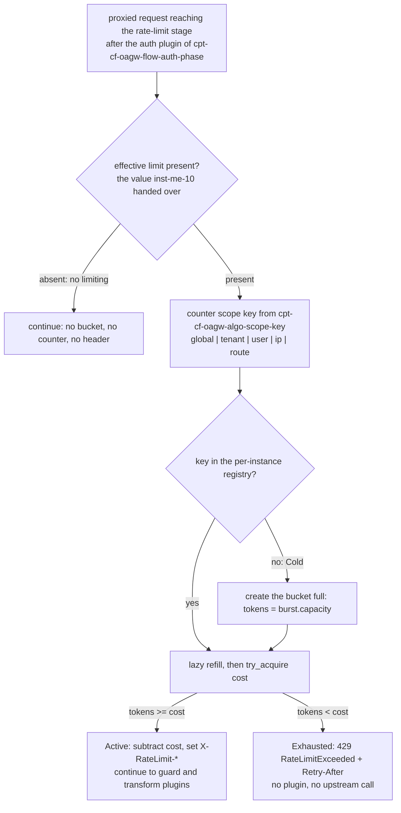

# Feature: Rate Limiting

<!-- toc -->

- [1. Feature Context](#1-feature-context)
  - [1.1 Overview](#11-overview)
  - [1.2 Purpose](#12-purpose)
  - [1.3 Actors](#13-actors)
  - [1.4 References](#14-references)
  - [1.5 Feature-Local Deviations](#15-feature-local-deviations)
- [2. Actor Flows (CDSL)](#2-actor-flows-cdsl)
  - [Rate Limit Check for a Proxied Request](#rate-limit-check-for-a-proxied-request)
- [3. Processes / Business Logic (CDSL)](#3-processes--business-logic-cdsl)
  - [Token Bucket Refill and Acquisition](#token-bucket-refill-and-acquisition)
  - [Counter Scope Key Resolution](#counter-scope-key-resolution)
- [4. States (CDSL)](#4-states-cdsl)
  - [Token Bucket State Machine](#token-bucket-state-machine)
- [5. Definitions of Done](#5-definitions-of-done)
  - [Rate Limit Enforcement on the Proxy Path](#rate-limit-enforcement-on-the-proxy-path)
  - [Dual-Rate Configuration Contract](#dual-rate-configuration-contract)
  - [Scope Key Determinism](#scope-key-determinism)
- [6. Acceptance Criteria](#6-acceptance-criteria)

<!-- /toc -->

- [x] `p1` - **ID**: `cpt-cf-oagw-featstatus-rate-limiting-implemented`

<!-- reference to DECOMPOSITION entry -->
`p2` - `cpt-cf-oagw-feature-rate-limiting`

DECOMPOSITION entry 2.7 "Rate Limiting" orders this feature and the text of that entry is the authority for this document's scope: the Purpose, Scope and Out-of-scope bullets below are that entry's and are implemented without widening or narrowing them, and feature progress for this document is owned by the `featstatus` line above.
## 1. Feature Context

### 1.1 Overview

This feature enforces the rate limit of the `oagw` gear on the proxy path: it receives the effective limit that `cpt-cf-oagw-algo-effective-merge` of `cpt-cf-oagw-feature-hierarchical-config` computed for the request at its `inst-me-10` step, resolves the counter scope key from the request context — "counter scope key" being the key's name here and in the §3 heading that resolves it, and "counter key" the declared short form used for that one key object throughout the rest of this document — and acquires `cost` tokens from a per-instance token bucket owned by the data plane. A request whose bucket can pay the cost continues to the guard and transform phases carrying the `X-RateLimit-*` headers; a request whose bucket cannot is refused with 429 `RateLimitExceeded` and `Retry-After` and reaches neither a plugin nor an upstream. The limiter is core policy of the data plane and not a plugin: it adds no binding, resolves no `plugin_ref` and executes no phase of the plugin chain, which is the core-policy framing the PRD applies to the circuit breaker.

The feature is the enforcement half of a two-feature contract and nothing more. It computes no `min()`, walks no tenant chain, applies no sharing mode and checks no permission: the effective limit arrives as a value, and an ABSENT limit — the result `inst-me-10` produces when no tier of the chain configures one — is read as "no limiting". Its state is a per-instance in-memory registry keyed by the counter scope key, with no persistence and no cross-instance synchronisation: the distributed half of `cpt-cf-oagw-adr-rate-limiting` is future work, and the per-instance accuracy caveat that follows from it is recorded in §1.5. The proxy pipeline of `cpt-cf-oagw-feature-proxy-pipeline` is the caller of the check on every proxied request: it owns route matching, the stage order of `cpt-cf-oagw-seq-proxy-flow`, the upstream call and the `<10ms` p95 budget of `cpt-cf-oagw-nfr-low-latency`, and it invokes this feature's check after the auth plugin and before the guard and transform plugins.

The diagram below is the per-request decision of `cpt-cf-oagw-flow-rate-limit-check` — from the effective limit the merge handed over, through the scope key and the bucket acquisition, to the two outcomes a caller can observe. It is the only diagram in this document: the refill arithmetic lives in the step list of `cpt-cf-oagw-algo-token-bucket`, the key composition in the step list of `cpt-cf-oagw-algo-scope-key`, and the bucket lifecycle in the state machine of §4, and a second diagram would only duplicate what those step lists already encode.

### 1.2 Purpose

This feature bridges DECOMPOSITION entry 2.7 "Rate Limiting" into an implementation contract. It exists so that the gear has exactly one place where a request costs tokens, one place where a counter key is derived and one place where a 429 is produced: `cpt-cf-oagw-feature-proxy-pipeline` invokes the check per request and never evaluates a rate limit of its own, and `cpt-cf-oagw-feature-hierarchical-config` computes the limit this feature enforces without ever enforcing one.

**Requirements**:

- [x] `p1` - `cpt-cf-oagw-fr-rate-limiting` — enforcement at the upstream and route levels is what the consumed effective limit already carries, because the merge that produced it included the selected upstream's limit and the matched route's limit in its `min()`; the configuration fields that requirement lists (rate, window, capacity, cost, scope, strategy) are the dual-rate field contract `cpt-cf-oagw-dod-dual-rate-config` binds, with the strategy list narrowed per DECOMPOSITION correction 6 and recorded as the §1.5 deviation.
- [x] `p1` - `cpt-cf-oagw-nfr-low-latency` — DESIGN's NFR allocation maps this requirement to "In-memory rate limiters" under `cpt-cf-oagw-tech-dependencies`, and that is what the registry is: one direct in-memory access, one lazy refill and one comparison, with no I/O, no network call and no lock beyond the bucket's own entry. The check contributes a bounded, in-memory-only cost to the proxy path; the `<10ms` p95 budget for the whole path is owned by `cpt-cf-oagw-feature-proxy-pipeline` per DECOMPOSITION entry 2.8, and `cpt-cf-oagw-adr-rate-limiting` states the sub-millisecond driver for the check itself.
- [x] `p2` - `cpt-cf-oagw-fr-hierarchical-config` — the `min(all ancestor enforced rates, selected upstream rate, route rate)` rule is computed by `cpt-cf-oagw-algo-effective-merge` and handed to this feature as a value; this feature consumes it and never re-derives it. The `[x]` mirrors the upstream PRD definition state per the DECOMPOSITION checkbox convention and does not indicate oagw implementation progress.

**Principles**: `p1` - `cpt-cf-oagw-principle-tenant-scope` — the only tenant identity this feature reads is the subject tenant id of the request's security context, and it enters the counter key as the `tenant` and `user` scope dimensions, so a bucket is reachable only through the context that produced its key and no step of this feature reads another tenant's chain, configuration or counter.

**Constraints**: `p1` - `cpt-cf-oagw-constraint-toolkit-deploy` — the registry is constructed inside the gear `init()` and lives in the single executable the ToolKit deploys: no external rate-limit service, no sidecar and no Redis dependency exists this release, which is also why the distributed half of `cpt-cf-oagw-adr-rate-limiting` is out of scope.

**Components**: `p1` - `cpt-cf-oagw-component-model` — the "Token bucket with dual-rate config" element that DESIGN's traceability table maps to `cpt-cf-oagw-fr-rate-limiting` is what this feature implements, over the `RateLimitConfig rate_limit` field that both the `Upstream` and the `Route` classes of `cpt-cf-oagw-design-domain-model` carry.

**Sequences**: `p1` - `cpt-cf-oagw-seq-proxy-flow` — owned stage-wise per DECOMPOSITION: this feature owns the rate-limit stage of that sequence, sitting after the auth plugin and before the guard and transform plugins; the proxy pipeline owns orchestration and the endpoint-selection stages, and `cpt-cf-oagw-feature-plugin-chain` owns the plugin stages on both sides of the check.

**API**: `POST /oagw/v1/proxy/{alias}/{path}` (the form entry 2.7 records; the registered shell is `{METHOD}` per entry 2.8 and `cpt-cf-oagw-feature-gear-wiring`, and the check applies to every proxied method) — the 429 enforcement on the proxy path only, per DECOMPOSITION entry 2.7. The path is registered by `cpt-cf-oagw-feature-gear-wiring` and owned by `cpt-cf-oagw-feature-proxy-pipeline`; this feature registers no route, owns no management endpoint and adds no path of its own, and the rate-limit CRUD of the management surface belongs to `cpt-cf-oagw-feature-management-api`.

**Data**: None — the limiter registry is an in-memory map of the data plane, holds no persisted record, creates no table and adds no schema object; the `RateLimitConfig` configuration it reads is stored by `cpt-cf-oagw-feature-domain-model` and written by `cpt-cf-oagw-feature-management-api`.

### 1.3 Actors

| Actor | Role in Feature |
|-------|-----------------|
| `cpt-cf-oagw-actor-app-developer` | Consumer of the proxy path; never calls this feature directly. Sees only the two outcomes the check produces on the proxy response: a request that continues carrying `X-RateLimit-Limit`, `X-RateLimit-Remaining` and `X-RateLimit-Reset`, or a 429 `RateLimitExceeded` with `Retry-After` and the same three headers. |
| `cpt-cf-oagw-actor-tenant-admin` | Configures the `rate_limit` block of their own upstreams and routes — the dual-rate fields, their `scope` and their `strategy` — that this feature enforces, and owns correcting a configuration whose 429 behaviour is not the one they intended. |
| `cpt-cf-oagw-actor-platform-operator` | Owns the ancestor-level limits whose `sharing: enforce` the merge collects into the effective limit this feature enforces, and the posture that decides whether the proxy path enforces rate limiting at all. |

The proxy pipeline of `cpt-cf-oagw-feature-proxy-pipeline` is the caller of every step: no actor invokes `cpt-cf-oagw-flow-rate-limit-check`, `cpt-cf-oagw-algo-token-bucket` or `cpt-cf-oagw-algo-scope-key` directly, and no actor reaches the limiter registry except through a proxied request. The flow of §2 is therefore narrated from the application developer's viewpoint as the initiator of the proxied request, with the proxy pipeline as the caller of every one of its steps.

### 1.4 References

- **PRD**: [PRD.md](../PRD.md) — `cpt-cf-oagw-fr-rate-limiting` (enforcement at upstream and route levels; the configuration field list including rate, window, capacity, cost, scope and strategy; the reject outcome of 429 with `Retry-After`), `cpt-cf-oagw-nfr-low-latency` (the `<10ms` p95 proxy-path threshold this feature's in-memory check contributes to), the use case `cpt-cf-oagw-usecase-rate-limit-exceeded` (whose "System evaluates rate limit counter" step and reject-strategy alternative this feature implements) and `cpt-cf-oagw-usecase-proxy-request` (the proxy request whose path carries the check), and the actors `cpt-cf-oagw-actor-platform-operator`, `cpt-cf-oagw-actor-tenant-admin`, `cpt-cf-oagw-actor-app-developer`
- **Design**: [DESIGN.md](../DESIGN.md) — `cpt-cf-oagw-design-domain-model` (the `RateLimitConfig rate_limit` field on both the `Upstream` and the `Route` class), the "Shadowing Behavior" statement that `effective_rate = min(selected_rate, route_rate, all_ancestor_enforced_rates)` (computed by `cpt-cf-oagw-feature-hierarchical-config` and consumed here), the "Permissions and Access Control" table with `oagw:upstream:override_rate` ("Specify own rate limits (subject to min())"), `cpt-cf-oagw-seq-proxy-flow` (the rate-limit stage of the proxy request flow), the error table row `RateLimitExceeded | 429 | gts.cf.core.errors.err.v1~cf.oagw.rate_limit.exceeded.v1 | Yes`, the metrics `oagw_rate_limit_exceeded_total{host, path}` and `oagw_rate_limit_usage_ratio{host, path}`, `cpt-cf-oagw-component-model` (the token bucket with dual-rate config) and `cpt-cf-oagw-tech-dependencies` (the "In-memory rate limiters" allocation of `cpt-cf-oagw-nfr-low-latency`)
- **Decomposition**: [DECOMPOSITION.md](../DECOMPOSITION.md) — entry 2.7 "Rate Limiting" and the "Spec corrections applied" block in its overview (corrections 4, 6 and 8 apply to this feature)
- **ADR**: [ADR/0003-rate-limiting.md](../ADR/0003-rate-limiting.md) (`cpt-cf-oagw-adr-rate-limiting`) — the dual-rate field table with its defaults, the token-bucket implementation note and its reference struct, the response-header block, the per-instance MVP statement and the Redis sync protocol that is future work; [ADR/0006-state-management.md](../ADR/0006-state-management.md) (`cpt-cf-oagw-adr-state-management`) — the decision that rate limiters are owned by the data plane and the request flow that places the check after the auth plugin and before the guard and transform plugins
- **Dependencies**:
  - [ ] `p2` - `cpt-cf-oagw-feature-hierarchical-config` — the direct dependency DECOMPOSITION entry 2.7 declares in its "Depends On" line (the edge `hierarchical-config → rate-limiting` in the feature graph): the effective limit this feature enforces is the value `cpt-cf-oagw-algo-effective-merge` computes at `inst-me-10` and hands to the data plane, together with the merged rate-limit block whose non-numeric fields this feature reads. This feature never re-walks the tenant chain, never re-applies a sharing mode and never re-computes the `min()`.
  - Reached transitively through that chain rather than declared directly: `cpt-cf-oagw-feature-domain-model` (the `RateLimitConfig` value object with the field set `cpt-cf-oagw-algo-shape-validation` validates at persist time, and the `Upstream` and `Route` aggregates that carry it), `cpt-cf-oagw-feature-gear-wiring` (the crate layout of `cpt-cf-oagw-dod-crate-layout`, the problem+json error contract and the closed 22-row table of `cpt-cf-oagw-algo-error-mapping`) and `cpt-cf-oagw-feature-management-api` (the CRUD surface that writes the configuration this feature reads).
- **Reverse dependents**: `cpt-cf-oagw-feature-proxy-pipeline` is the direct dependent in the DECOMPOSITION feature graph (the edge `rate-limiting → proxy-pipeline`): it is the caller that invokes the check on every proxied request, owns the stage order and the proxy-path latency budget, and renders the outcomes this feature produces. `cpt-cf-oagw-feature-streaming-proxy` and `cpt-cf-oagw-feature-observability` sit downstream of that pipeline and reach the rate-limit stage only through it. `cpt-cf-oagw-feature-management-api` writes the configuration this feature enforces but is not a dependent — its direct dependency is `cpt-cf-oagw-feature-alias-resolution`, and it reaches this feature's inputs transitively. None of them may re-derive a counter key, re-implement the refill or re-map the 429 defined here.
- **API and data declarations**: API: `POST /oagw/v1/proxy/{alias}/{path}` (429 enforcement) and Data: None, as the DECOMPOSITION entry records them and as §1.2 and the Touches lines of §5 carry.

### 1.5 Feature-Local Deviations

Deviations from the supplied spec/platform baseline, recorded per the shared-baseline policy.

**Conformance (not a deviation)** — pipeline position: the check runs after the auth plugin and before the guard and transform plugins, which is the order the request flow of `cpt-cf-oagw-adr-state-management` fixes (`Execute auth plugin` → `Check rate limiter (DP-owned)` → `Execute guard/transform plugins` → HTTP call) and the rate-limit stage DECOMPOSITION assigns to this feature in the stage-wise ownership of `cpt-cf-oagw-seq-proxy-flow`. The invocation, the stage sequencing and everything the pipeline does before and after the check belong to `cpt-cf-oagw-feature-proxy-pipeline`; this feature owns the check itself and states the position only so a refusal is known to precede any guard, transform or upstream work.
**Rationale** — ADR 0006 is the authority for the order and DECOMPOSITION records the stage-wise ownership of the sequence; recording the position here keeps the limiter's placement from being re-decided by its caller, while leaving the ordering rule itself where it belongs.
**Review owner**: `cf-generate-author-senior via cf-write-docs review loop`

**Conformance (not a deviation)** — consume-only enforcement: the effective limit this feature enforces is the value `cpt-cf-oagw-algo-effective-merge` computes at its `inst-me-10` step — `min(all collected enforced ancestor limits, selected upstream limit, route limit)` — handed to the data plane as a value and never as an enforcement. This feature performs no tenant-chain walk, applies no `private`/`inherit`/`enforce` sharing mode, re-computes no `min()` and evaluates no permission gate: the inheritance-rule table of `cpt-cf-oagw-adr-rate-limiting` (§3, "Inheritance rules") is realised by the sharing modes `cpt-cf-oagw-feature-hierarchical-config` applies during the merge, and `oagw:upstream:override_rate` is enforced by the platform authz middleware per DECOMPOSITION correction 4. An ABSENT limit — an empty collected set with no upstream limit and no route limit — is read as "no limiting".
**Rationale** — DECOMPOSITION entry 2.7 states the effective limit is "**consumed** from the effective config computed by feature-hierarchical-config", and re-deriving it here would put a second `min()` and a second chain walk in the gear; recording the split keeps the resolution contract and the enforcement contract apart.
**Review owner**: `cf-generate-author-senior via cf-write-docs review loop`

**Conformance (not a deviation)** — which tier's non-numeric fields apply: the effective limit value is the `min()` of `inst-me-10`, and the remaining enforcement parameters — `algorithm`, `burst.capacity`, `scope`, `cost`, `strategy` and `response_headers` — are read from the merged rate-limit block the same merge produces, in which the matched route's block enters after every upstream tier (`inst-me-09`) and a field an ancestor forced with `sharing: enforce` keeps the forced value (`inst-me-11`). No upstream document states which tier supplies these parameters when several tiers configure a rate limit; this is the resolution recorded here.
**Rationale** — the numeric rule is a commutative `min` over tiers while the other fields are single-valued, so they must come from one block; taking them from the merge's own result reuses the sharing-mode rules `cpt-cf-oagw-feature-hierarchical-config` already owns instead of adding a second precedence rule, and it is the reading that makes a route's `cost` and `scope` meaningful on the path they were configured for.
**Review owner**: `cf-generate-author-senior via cf-write-docs review loop`

**Conformance (not a deviation)** — the `scope` enum: the values this feature resolves are the field table of `cpt-cf-oagw-adr-rate-limiting` — `global`, `tenant`, `user`, `ip`, `route` — which adds `route` to the parenthetical list "global/tenant/user/IP" that `cpt-cf-oagw-fr-rate-limiting` carries. The ADR and the JSON Schemas of the domain-model feature are the governing field set, and the PRD's parenthetical is an illustration rather than the exhaustive enum; `cpt-cf-oagw-algo-shape-validation` enforces the five values at persist time and this feature re-validates none of them.
**Rationale** — the strategy and the algorithm narrowings each carry an entry, and the `route` scope is the one remaining delta in the field contract the ADR adds over the PRD; recording it as conformance keeps the PRD's parenthetical from being read as an exhaustive enum this feature would then have to narrow.
**Review owner**: `cf-generate-author-senior via cf-write-docs review loop`

**Deviation** — strategy narrowing: only the `reject` strategy is implemented this release. `reject`, `queue` and `degrade` remain accepted configuration values, and `queue` and `degrade` resolve to `reject` behaviour — a 429 with `Retry-After` — rather than to a bounded queue or a reduced-functionality response; any other value fails validation, as `cpt-cf-oagw-algo-shape-validation` of the domain-model feature already enforces at persist time. This narrows `cpt-cf-oagw-fr-rate-limiting`, whose strategy list is "reject with 429 + Retry-After, queue, or degrade", and `cpt-cf-oagw-usecase-rate-limit-exceeded`, whose queue and degrade alternative flows have no executable path in this release.
**Rationale** — DECOMPOSITION correction 6 declares exactly this narrowing, and an unimplemented strategy that silently queued or degraded requests would be indistinguishable from an implemented one; resolving both values to the implemented `reject` behaviour keeps the accepted configuration surface intact while the enforced behaviour stays honest.
**Review owner**: `cf-generate-author-senior via cf-write-docs review loop`

**Deviation** — `sliding_window` is enforced as a fixed-window approximation: the `algorithm` value is accepted per the field table of `cpt-cf-oagw-adr-rate-limiting`, but a block configured with it is enforced as an aligned window of length `sustained.window` that grants `min(sustained.rate, capacity)` tokens at each boundary — capped by the bucket's declared maximum exactly as `inst-tb-05` grants — and carries none across it, using the same registry, the same `cost` test and the same 429 outcome as the token bucket. `token_bucket`, the default, is the exact algorithm of this release. The approximation's residual is the boundary burst a fixed window allows and a sliding window does not — the property the algorithm comparison of `cpt-cf-oagw-adr-rate-limiting` itself attributes to Fixed Window.
**Rationale** — DECOMPOSITION correction 8 declares exactly this approximation, and documenting the residual keeps an accepted configuration value from being read as a guarantee of sliding-window accuracy that this release does not make.
**Review owner**: `cf-generate-author-senior via cf-write-docs review loop`

**Deviation** — distribution: the registry is per-instance only. The decision `cpt-cf-oagw-adr-rate-limiting` records for distributed state — "Hybrid Local + Periodic Sync", with a `rate_limit_sync` configuration block and a default 100 ms sync interval — is not implemented: there is no sync thread, no Redis client and no `rate_limit_sync` key. The accuracy consequence is stated honestly rather than borrowed from the ADR's hybrid option: this release follows the ADR's MVP statement rather than Option A's rule that the effective limit is `configured_limit / node_count`, so each instance enforces the full limit the merge consumed and admits up to it independently; for a registry with no sync, the resulting over-admission is therefore sustained rather than bounded — aggregate throughput across the instances serving the same counter approaches N × the configured rate and is unbounded by any sync interval — and not a worst-case burst of `burst_capacity * node_count`, which is the caveat the ADR records for the Hybrid option it defers. This narrows the ADR's chosen option to the MVP it describes alongside it, and DECOMPOSITION entry 2.7 lists "Redis-backed distributed sync (ADR 0003 future work)" in this feature's out-of-scope bullets.
**Rationale** — DECOMPOSITION corrections 3 and 4 leave this release on in-memory state, and entry 2.7 scopes the Redis half out explicitly; a partially implemented sync protocol would add a network dependency to the check without delivering the global accuracy it exists for.
**Review owner**: `cf-generate-author-senior via cf-write-docs review loop`

**Deviation** — `X-RateLimit-Reset` is a delay in seconds, not an absolute timestamp: the response-header block of `cpt-cf-oagw-adr-rate-limiting` illustrates the header as `X-RateLimit-Reset: 1706626800`, while this feature renders the number of seconds until the bucket refills to capacity at the sustained rate. `Retry-After` on a refusal carries the tighter delay — the seconds until the balance reaches the ceiling the bucket can actually reach, `min(cost, capacity)`, at the same rate, which is never later than the reset delay. When `cost` exceeds `burst.capacity` the bucket is already at that ceiling, the computed delay is `0`, and the refusal is permanent for that key, because no delay can make a `cost` above `burst.capacity` payable — the outcome the ADR's own `tokens >= cost` test produces.
**Rationale** — the ADR's own example block cites the IETF rate-limit headers draft, which defines the reset value as a delay in seconds rather than a date, and a lazily refilled token bucket has no wall-clock window boundary to anchor an absolute timestamp to; the delay form is the one that keeps the three headers and `Retry-After` self-consistent with the refill model of `cpt-cf-oagw-algo-token-bucket`.
**Review owner**: `cf-generate-author-senior via cf-write-docs review loop`

**Conformance (not a deviation)** — the `response_headers` field of the ADR field table: the ADR 0003 field `response_headers` is not part of the validated field set the domain-model feature carries — the `rate_limit` object of both `schemas/route.v1.schema.json` and `schemas/upstream.v1.schema.json` is `additionalProperties: false` and carries no such property, and the domain-model conformance record states that the `budget` and `response_headers` extensions of `cpt-cf-oagw-adr-rate-limiting` are not carried as required fields — so the ADR default `true` is the only reachable value this release and the three rate-limit headers are always set when a block configures a limit. The `false` branch the DoD of §5 and §6 preserve is the ADR-level behaviour of `cpt-cf-oagw-adr-rate-limiting`, kept so the header contract is stated against the ADR's field table and not narrowed to this release's validated surface.
**Rationale** — the JSON Schemas of the domain-model feature are the governing field set, so no payload can reach this feature carrying `response_headers: false`; recording the branch as ADR-level keeps the document from asserting an enforcement this release can never trigger while still stating the header contract the ADR's field table defines.
**Review owner**: `cf-generate-author-senior via cf-write-docs review loop`

**Deviation** — the address the `ip` scope counts by: `scope: ip` reads the peer address of the connection the request arrived on, in its canonical textual form. No forwarded, proxied or caller-supplied header contributes to it, and no upstream document names the source of the address for this scope.
**Rationale** — a forwarded header is caller-controlled, so an `ip` counter keyed on one would be forgeable by the very caller the limit is meant to restrain, which would defeat the abuse-control boundary the limiter provides; taking the peer address is the reading that keeps the counter keyed by something the caller cannot choose.
**Review owner**: `cf-generate-author-senior via cf-write-docs review loop`

**Conformance (not a deviation)** — the counter key reuses the components of the key structure `cpt-cf-oagw-adr-rate-limiting` states for its Redis backend — `oagw:ratelimit:{resource_type}:{resource_id}:{scope}:{scope_id}:{window}` — as the key of the in-memory registry, minus the trailing date-bucket component that key form appends for fixed-window counting. The date bucket belongs to the Redis protocol and to the deferred sync, and a lazily refilled token bucket has no wall-clock bucket; the `{window}` component is kept so two limits that differ only in window never share a counter.
**Rationale** — the Redis sync the key structure was written for is out of scope this release, but the component list is the ADR's own answer to what identifies one counter, and reusing it keeps a future Redis migration from changing what a key means; dropping only the date bucket is the minimal adaptation the token-bucket semantics require.
**Review owner**: `cf-generate-author-senior via cf-write-docs review loop`

**Conformance (not a deviation)** — failure mapping: this feature adds no row to the closed 22-row mapping table of `cpt-cf-oagw-algo-error-mapping` and triggers the existing `RateLimitExceeded` row — HTTP 429, GTS type `gts.cf.core.errors.err.v1~cf.oagw.rate_limit.exceeded.v1`, the `Retriable` column value `Yes` — which `cpt-cf-oagw-feature-gear-wiring` already carries. The 429 is rendered as problem+json by the error contract of that feature with `X-OAGW-Error-Source: gateway`, on the proxy path `POST /oagw/v1/proxy/{alias}/{path}` (the `/oagw/v1` base per DECOMPOSITION correction 1), and the rendering is the caller's: this feature returns the typed outcome and adds no mapping and no response of its own.
**Rationale** — the row exists and is the one DESIGN's error table assigns to this outcome, so a second mapping would fork the one contract every oagw error is rendered through; recording where the rendering happens keeps the enforcement decision and the wire status apart.
**Review owner**: `cf-generate-author-senior via cf-write-docs review loop`

**Conformance (not a deviation)** — the limiter is core policy, not a plugin: it holds no `plugin_ref`, occupies no position in the binding list `cpt-cf-oagw-flow-execution-plan` orders, resolves through no registry of `cpt-cf-oagw-feature-plugin-chain` and cannot be added, removed or reordered by a plugin binding. The PRD's framing of the circuit breaker as core policy rather than a plugin applies to this check for the same reason: it is the data plane's own policy, evaluated between two plugin phases rather than inside one.
**Rationale** — `cpt-cf-oagw-fr-plugin-system` fixes the plugin types as auth, guard and transform, and a rate limiter is none of them; making the check a plugin would let a binding remove the very control `cpt-cf-oagw-fr-rate-limiting` makes mandatory.
**Review owner**: `cf-generate-author-senior via cf-write-docs review loop`

**Conformance (not a deviation)** — the registry is an in-memory map of the data plane keyed by the counter scope key, with one direct lookup per request and no cache layer in front of it: no persistence, no TTL, no invalidation path and no cross-instance synchronisation. Entry cardinality is unbounded for the `ip` and `user` scopes, and the map grows with distinct keys for the life of the process, with no eviction policy this release — the prefix-based cleanup ADR 0003 motivates for its `{resource_type}:{resource_id}` key form (efficient prefix-based cleanup when a resource is deleted) being the Redis-half lever, which sits in this feature's out-of-scope below with the distributed sync. This is the state ownership `cpt-cf-oagw-adr-state-management` decides — rate limiters owned by the data plane, which holds the full request context — with the data-plane L1 cache of that ADR superseded by DECOMPOSITION correction 4, as `cpt-cf-oagw-feature-hierarchical-config` records for the control-plane side; the counter state is consequently lost on a process restart, and every bucket begins the new process `Cold`.
**Rationale** — DECOMPOSITION correction 4 replaces the ADR's cache tiering with the in-memory stores of correction 3, and a rate-limit registry that persisted or synced would reintroduce exactly the state layer that correction removes; stating the restart loss and the unbounded growth keeps accepted limitations visible instead of implicit.
**Review owner**: `cf-generate-author-senior via cf-write-docs review loop`

**Conformance (not a deviation)** — the instruments this feature's outcome feeds are `oagw_rate_limit_exceeded_total{host, path}` (counter) and `oagw_rate_limit_usage_ratio{host, path}` (gauge), both named by DESIGN for the rate-limit stage. Their emission, their labels and their exposure belong to `cpt-cf-oagw-feature-observability`, and exposure is the platform telemetry stack per DECOMPOSITION correction 5 — `oagw` mounts no `/metrics` route of its own. This feature owns the decisions those instruments count: an exceeded limit is one `oagw_rate_limit_exceeded_total` increment, and the token level the check leaves behind is what the usage ratio observes.
**Rationale** — DECOMPOSITION assigns metric and audit emission to `cpt-cf-oagw-feature-observability`, and naming the instruments without owning their emission keeps the counters attributable to the limiter's outcome without a second emission path.
**Review owner**: `cf-generate-author-senior via cf-write-docs review loop`

**Conformance (not a deviation)** — protocol reach: the limiter applies to every proxied request the pipeline drives, keyed by the enforcement point and the matched route rather than by the match type that selected the route; gRPC proxying is not implemented this release per the corrections block's "Phase numbering precedence" paragraph — the PRD's Phase 4 governs — and entry 2.8's out-of-scope bullet "gRPC proxying (PRD out of scope, Phase 4)", so no gRPC-matched request reaches the limiter.
**Rationale** — the scope enum of `cpt-cf-oagw-adr-rate-limiting` carries no protocol dimension, and adding one would widen a field set no upstream document extends; recording the absence of a gRPC path keeps the `route` scope from being read as protocol-aware.
**Review owner**: `cf-generate-author-senior via cf-write-docs review loop`

**Conformance (not a deviation)** — security framing: the limiter is an abuse-control boundary and not an authentication boundary. Whether a request may proceed at all is the auth plugin's decision, taken before the check; the limiter decides only how much of the configured budget the request may consume, and its contribution to multi-tenancy is the tenant and user dimensions of the counter key, which keep one subject's traffic from spending another subject's bucket.
**Rationale** — `cpt-cf-oagw-fr-rate-limiting` states the purpose as preventing abuse, cost overruns and harm to external service agreements, while authentication is `cpt-cf-oagw-fr-auth-injection`'s concern; recording the boundary keeps the two from being read as interchangeable controls.
**Review owner**: `cf-generate-author-senior via cf-write-docs review loop`

**Out of scope** — Redis-backed distributed sync and every distributed-accuracy guarantee (ADR 0003 future work, and the §1.5 deviation above); the budget-allocation schema extension of `cpt-cf-oagw-adr-rate-limiting` (`budget.mode`, `budget.total`, `overcommit_ratio` and the validation of child allocations against a parent budget), which is not implemented, so the `budget` block is not read by this feature and no overcommit validation exists; the `queue` and `degrade` strategies as behaviours (accepted values, `reject` behaviour, correction 6); the management CRUD of rate-limit configuration, owned by `cpt-cf-oagw-feature-management-api`; the proxy pipeline's stage sequencing, route matching and upstream call, owned by `cpt-cf-oagw-feature-proxy-pipeline`; metric, audit and WARN-log emission for the rate-limit stage — including the `WARN` log point DESIGN 4.3 assigns explicitly to "Rate limit exceeded", with its `Retry-After` retry guidance — owned by `cpt-cf-oagw-feature-observability`; and any gRPC proxy path, which is not implemented this release.
**Rationale** — DECOMPOSITION entry 2.7 lists the first two in its out-of-scope bullets, correction 6 places the next one, and the remaining dispositions follow from the ownership splits recorded above; none of them is implemented by this feature and none of them is re-declared by it.
**Review owner**: `cf-generate-author-senior via cf-write-docs review loop`

**Not applicable because** — the remaining checklist areas have no build object in this feature, and where a posture is declared below it is stated rather than built:

- **Data model and persistence** — the feature creates no table, no schema object and no repository trait: the only state it owns is the in-memory registry of §4, which is never persisted and does not survive a process restart, a limitation stated in §1.5 and accepted for this release.
- **Reliability and failure behaviour** — an exhausted bucket degrades to the 429 of `cpt-cf-oagw-dod-rate-limit-enforcement` and to nothing else: no panic, no partial acquisition, no negative token count and no request that bypasses the check because a bucket could not be read, since the check is a direct in-memory access with no failure path of its own.
- **Security** — the limiter is an abuse-control boundary and not an authentication boundary: the auth plugin decides whether the request may proceed and this feature decides how much of the configured budget it may consume, and no caller-supplied header or parameter can steer the counter key it is counted into.
- **Configuration surface** — the feature owns no `OagwConfig` key: every gear-level key is owned by `cpt-cf-oagw-feature-gear-wiring` and `cpt-cf-oagw-algo-config-load`, and the rate-limit fields this feature enforces are resource fields of `RateLimitConfig`, not gear configuration; the `rate_limit_sync` block the ADR describes belongs to the deferred distributed half and is not a key of this release.
- **Internationalisation and accessibility** — the feature exposes no user interface and no actor-facing text of its own; the only wording a caller sees arrives inside a problem+json `detail` field rendered by the error contract of the gear-wiring feature.
- **Regulatory compliance** — no data subject to a compliance regime crosses the check: the counter key is derived from identifiers the request already carries, the registry holds token counts and timestamps and no request payload, and nothing is written outside the process.
- **Rollout and rollback** — the limiter has no deployable unit, no migration and no feature flag of its own: enforcement is config-driven, so removing the rate-limit configuration from the upstreams and routes removes the check, and an ABSENT effective limit is the "no limiting" reading of `inst-me-10` rather than a disabled feature.
- **Performance** — the check contributes a bounded, in-memory-only cost to the proxy path: one registry access, one lazy refill, one comparison and, when configured, a header write. `cpt-cf-oagw-adr-rate-limiting` states the sub-millisecond driver for the check and `cpt-cf-oagw-nfr-low-latency` states the `<10ms` p95 threshold for the whole proxy path, whose owner is `cpt-cf-oagw-feature-proxy-pipeline` per DECOMPOSITION entry 2.8; no upstream document sets a latency budget for the limiter alone, so this feature declares functional semantics and no budget of its own.
- **Usability** — the observable surface is the proxy response the caller already receives from `cpt-cf-oagw-feature-proxy-pipeline`; the three rate-limit headers and `Retry-After` are the only surface this feature adds to it, and they exist precisely so a caller can read its own budget instead of probing for it.
- **Test targets** — the unit-testable boundaries are `cpt-cf-oagw-algo-token-bucket`, `cpt-cf-oagw-algo-scope-key` and the state machine of §4, none of which performs I/O; the 429 path, the headers and the placement of the check in the stage order are integration-testable through the proxy endpoint, whose driver is `cpt-cf-oagw-feature-proxy-pipeline` as the caller.

## 2. Actor Flows (CDSL)

Interactions that start with an actor and describe the end-to-end flow. The single flow of this feature is called per proxied request by the proxy pipeline of `cpt-cf-oagw-feature-proxy-pipeline`, which is the caller of every step; it opens no HTTP route, renders no HTTP response of its own and performs no upstream call, and the upstream call it precedes belongs to that caller.

**Use cases**: `p2` - `cpt-cf-oagw-usecase-rate-limit-exceeded` — the "System evaluates rate limit counter" step and the reject-strategy alternative flow of that use case are `cpt-cf-oagw-flow-rate-limit-check`, whose 429 with `Retry-After` is the implemented strategy per §1.5; and `p1` - `cpt-cf-oagw-usecase-proxy-request`, the proxy request whose path carries the check between its auth and plugin stages.

### Rate Limit Check for a Proxied Request

- [x] `p1` - **ID**: `cpt-cf-oagw-flow-rate-limit-check`

**Actor**: `cpt-cf-oagw-actor-app-developer`

**Success Scenarios**:

- A request whose bucket can pay `cost` tokens continues to the guard and transform phases: the bucket is refilled lazily, the cost is subtracted and the limit it was charged against is reported on the response.
- The effective limit is enforced exactly as `cpt-cf-oagw-algo-effective-merge` computed it: a stricter enforced ancestor limit, a stricter route limit and the selected upstream's own limit all bind through the single value this feature receives, and no second `min()` is computed here.
- A request whose effective limit is ABSENT — no tier of the chain configured a rate limit — proceeds with no bucket, no counter and no rate-limit header, which is the "no limiting" reading of `inst-me-10`.
- An unseen counter key starts from a full bucket, so the first request a scope issues is never refused by state this feature invented.

**Error Scenarios**:

- A request whose bucket cannot pay `cost` tokens is refused with 429 `RateLimitExceeded`, `Retry-After` and the three rate-limit headers, rendered through the existing row of `cpt-cf-oagw-algo-error-mapping`; no plugin runs after the check and no upstream call is made.
- The refusal is the only failure path of the flow: the check is a direct in-memory access with no I/O, so no unavailable dependency, no timeout and no transport error is reachable from any step, and no failure path of this flow echoes request content beyond the identifiers the counter key already carries.

**Steps**:

1. [x] - `p1` - Receive, from the proxy pipeline of `cpt-cf-oagw-feature-proxy-pipeline` for one proxied request that has already passed the auth plugin, the resolved effective configuration: the effective limit value `cpt-cf-oagw-algo-effective-merge` computed at `inst-me-10`, the enforcement parameters of the merged rate-limit block (`algorithm`, `burst.capacity`, `scope`, `cost`, `strategy`, `response_headers`), the selected upstream and matched route, and the request's security context; the pipeline being the caller of this and every later step - `inst-rl-01`
2. [x] - `p1` - **IF** the effective limit is the ABSENT limit `inst-me-10` produces when no collected enforced ancestor limit, no selected upstream limit and no route limit is configured - `inst-rl-02`
   1. [x] - `p1` - Read it as "no limiting" and **RETURN** success to the caller without consulting, creating or touching any bucket, setting no `X-RateLimit-*` header and recording no counter; no tier's configuration is invented to limit with - `inst-rl-03`
3. [x] - `p1` - **ELSE** resolve the counter scope key through `cpt-cf-oagw-algo-scope-key`, from the `scope` of the merged block and the request context — the subject tenant and subject of the security context, the peer address, and the (upstream, route) pair the pipeline matched - `inst-rl-04`
4. [x] - `p1` - Look the key up in the per-instance registry: one direct in-memory access keyed by that key, with no cache layer, no I/O and no cross-instance call, per DECOMPOSITION correction 4 - `inst-rl-05`
5. [x] - `p1` - **IF** the registry holds no entry for that key - `inst-rl-06`
   1. [x] - `p1` - Create the bucket through the `Cold` → `Active` transition of §4, starting full: `tokens` = `burst.capacity` (the default `sustained.rate` when the block does not configure a burst allowance) and `last_update` = now, so a first request is never refused by state this feature invented - `inst-rl-07`
6. [x] - `p1` - Acquire `cost` tokens through `cpt-cf-oagw-algo-token-bucket`, which refills the bucket lazily on access and then tests `tokens >= cost` - `inst-rl-08`
7. [x] - `p1` - **IF** the acquisition succeeds - `inst-rl-09`
   1. [x] - `p1` - Set the three rate-limit headers on the response when `response_headers` is true — `X-RateLimit-Limit` carrying the numeric sustained rate of the effective limit, `X-RateLimit-Remaining` carrying the tokens left after the acquisition, `X-RateLimit-Reset` carrying the seconds until the bucket refills to capacity at that rate — and set none of them when `response_headers` is false - `inst-rl-10`
   2. [x] - `p1` - **RETURN** success to the caller, which continues with the guard and transform phases and the upstream call; this flow performs neither - `inst-rl-11`
8. [x] - `p1` - **ELSE** the bucket cannot pay the cost (`tokens < cost` after the refill) - `inst-rl-12`
   1. [x] - `p1` - Refuse the request through the existing `RateLimitExceeded` row of `cpt-cf-oagw-algo-error-mapping` — HTTP 429, GTS type `gts.cf.core.errors.err.v1~cf.oagw.rate_limit.exceeded.v1`, retriable `Yes` — with the `Retry-After` delay `cpt-cf-oagw-algo-token-bucket` computes for the refusal, and with the same three headers as `inst-rl-10` defines them, `X-RateLimit-Remaining` carrying the tokens the bucket still holds, when `response_headers` is true; the implemented strategy is `reject`, and `queue` and `degrade` resolve to this same outcome per §1.5 - `inst-rl-13`
   2. [x] - `p1` - **RETURN** the refusal to the caller for rendering, with no guard or transform phase after the check and no upstream call; this flow renders no HTTP response of its own and adds no row to the mapping table - `inst-rl-14`
9. [x] - `p1` - Note that every path above performs the whole check in memory and without I/O — at most one registry access, one lazy refill and one comparison, with one subtraction only on the Acquired path — so the check adds no I/O to the proxy path and leaves the counter state this request produced available to the next request that resolves the same key - `inst-rl-15`

## 3. Processes / Business Logic (CDSL)

Internal building blocks called by the flow above: `cpt-cf-oagw-flow-rate-limit-check` calls `cpt-cf-oagw-algo-scope-key` once per request that carries an effective limit, and `cpt-cf-oagw-algo-token-bucket` once per request that holds a bucket. Neither opens an HTTP route, neither performs an upstream call, and neither re-declares a field list, a validation rule, an error mapping or a sharing mode owned by another feature; the field contract of the rate-limit block is validated at persist time by `cpt-cf-oagw-algo-shape-validation` of `cpt-cf-oagw-feature-domain-model` and is consumed here without being re-validated.

### Token Bucket Refill and Acquisition

- [x] `p2` - **ID**: `cpt-cf-oagw-algo-token-bucket`

**Input**: the bucket state found or created for the counter key — `tokens`, `last_update`, `capacity` and `refill_rate` — together with the `cost` of the request, the `algorithm` of the merged block, and the instant of the check.

**Output**: an Acquired or Exhausted decision, the token count the bucket holds after the decision, and the reset and retry delays the response headers report.

**Steps**:

1. [x] - `p1` - Take the four fields of the reference struct of `cpt-cf-oagw-adr-rate-limiting`'s implementation note — `tokens`, `last_update`, `capacity`, `refill_rate` — from the bucket the caller found or created, and take `cost` from the merged block, reading the ADR default `1` when the validated block omits it - `inst-tb-01`
2. [x] - `p1` - Derive `refill_rate` from the effective limit value: `sustained.rate` tokens per `sustained.window`, converted to tokens per second (`second` → rate, `minute` → rate / 60, `hour` → rate / 3600, `day` → rate / 86400), so one number drives the refill, the `X-RateLimit-Limit` value and both delay computations - `inst-tb-02`
3. [x] - `p1` - Take `capacity` from `burst.capacity`, reading the ADR default `sustained.rate` when the block does not configure a burst allowance, so the bucket never holds more than the burst it was configured with - `inst-tb-03`
4. [x] - `p1` - **IF** the block's `algorithm` is `sliding_window` — accepted configuration per DECOMPOSITION correction 8, enforced as the fixed-window approximation of §1.5 - `inst-tb-04`
   1. [x] - `p1` - Grant `min(sustained.rate, capacity)` tokens at each boundary of an aligned `sustained.window` window — the grant capped by the bucket's declared maximum, `burst.capacity` below `sustained.rate` being legal configuration the validated field set does not cross-check — carry none across a boundary, test the same `cost` against the same registry entry, and report the same Acquired or Exhausted outcome and the same 429 as the token bucket, the boundary burst being the residual the approximation declares - `inst-tb-05`
5. [x] - `p1` - **ELSE** refill lazily on access — `tokens = min(capacity, tokens + elapsed * refill_rate)` over the monotonic-clock interval since `last_update`, then `last_update` = now — there being no background refill task, no ticker and no wall-clock read in this release - `inst-tb-06`
6. [x] - `p1` - **IF** the refilled `tokens` is at least `cost` - `inst-tb-07`
   1. [x] - `p1` - Subtract `cost` from `tokens` and report Acquired with the remaining token count, the whole cost being taken or none of it - `inst-tb-08`
7. [x] - `p1` - **ELSE** report Exhausted with `tokens` unchanged, the bucket never going negative and no partial acquisition, the refilled balance staying in place for the next check - `inst-tb-09`
8. [x] - `p1` - Compute the reset delay the headers report as the seconds until the bucket is full again at `refill_rate` — `ceil((capacity - tokens) / refill_rate)`, `0` when the bucket is already at capacity — and the `Retry-After` delay of a refusal as the seconds until `tokens` reaches the ceiling the bucket can actually reach, `min(cost, capacity)`, at the same rate; a `cost` above `burst.capacity` therefore never becomes payable, and every request for that key is refused, which is the outcome the ADR's own `tokens >= cost` test produces and no cross-check of the two fields is invented here - `inst-tb-10`
9. [x] - `p1` - Keep the arithmetic in memory only: no I/O, no store access, no lock beyond the bucket's own entry and no clock other than the monotonic one, so a wall-clock adjustment cannot inject tokens and the check adds a bounded cost to the proxy path - `inst-tb-11`
10. [x] - `p1` - **RETURN** the decision, the post-decision token count and the computed delays to `cpt-cf-oagw-flow-rate-limit-check` - `inst-tb-12`

### Counter Scope Key Resolution

- [x] `p2` - **ID**: `cpt-cf-oagw-algo-scope-key`

**Input**: the `scope` of the merged rate-limit block, the sustained window of the effective limit, the selected upstream and matched route, the peer address of the connection, and the security context of the request.

**Output**: the counter scope key of the registry entry, or nothing when the effective limit is ABSENT and no counter is needed.

**Steps**:

1. [x] - `p1` - Take `scope` from the merged rate-limit block, reading the `cpt-cf-oagw-adr-rate-limiting` default `tenant` when the validated block omits the field; the enum `global`, `tenant`, `user`, `ip`, `route` is already enforced at persist time by `cpt-cf-oagw-algo-shape-validation` of the domain-model feature, so no value outside it reaches this step and none is re-validated here - `inst-sk-01`
2. [x] - `p1` - Compose the key from the components `cpt-cf-oagw-adr-rate-limiting` states — `oagw:ratelimit:{resource_type}:{resource_id}:{scope}:{scope_id}:{window}` — where `{resource_type}`/`{resource_id}` identify the enforcement point this request resolved (the matched route's id under `route` when the effective block is the route's, the selected upstream's id under `upstream` otherwise, the route's id already fixing its upstream), `{scope}` is the configured scope, `{scope_id}` is the subject dimension the scope selects, and `{window}` is the sustained window of the effective limit - `inst-sk-02`
3. [x] - `p1` - **IF** `scope` is `global` - `inst-sk-03`
   1. [x] - `p1` - Take `scope_id` as the constant `global`, so one counter per enforcement point and window is shared by every subject and every tenant of this instance, and by no other instance - `inst-sk-04`
4. [x] - `p1` - **ELSE IF** `scope` is `tenant`, the ADR default - `inst-sk-05`
   1. [x] - `p1` - Take `scope_id` as the subject tenant id of the request's security context, so two tenants never share a bucket and one tenant's traffic cannot exhaust another tenant's - `inst-sk-06`
5. [x] - `p1` - **ELSE IF** `scope` is `user` - `inst-sk-07`
   1. [x] - `p1` - Take `scope_id` as the security-context subject id qualified by its subject tenant id, so a subject identifier that recurs in another tenant cannot reach that tenant's bucket - `inst-sk-08`
6. [x] - `p1` - **ELSE IF** `scope` is `ip` - `inst-sk-09`
   1. [x] - `p1` - Take `scope_id` as the peer address of the connection the request arrived on, in its canonical textual form, with no forwarded or caller-supplied header contributing to it per §1.5 - `inst-sk-10`
7. [x] - `p1` - **ELSE** `scope` is `route` - `inst-sk-11`
   1. [x] - `p1` - Take `scope_id` as the (upstream, route) pair the proxy pipeline matched, so a counter is per route and never shared with the upstream's other routes or with the upstream's own unscoped counter - `inst-sk-12`
8. [x] - `p1` - Derive nothing else from the request: no header, no query parameter, no path segment and no caller-supplied identifier enters the key beyond the fields above, so a caller cannot steer the counter it is counted into - `inst-sk-13`
9. [x] - `p1` - Note the determinism the key is held to: the same scope inputs always produce the same key, and two keys that differ in any component never name the same bucket - `inst-sk-14`
10. [x] - `p1` - **RETURN** the key to `cpt-cf-oagw-flow-rate-limit-check`, which looks it up in the registry - `inst-sk-15`

## 4. States (CDSL)

### Token Bucket State Machine

- [x] `p2` - **ID**: `cpt-cf-oagw-state-bucket-state`

**States**: `Cold`, `Active`, `Exhausted`

**Initial State**: `Cold`

**Transitions**:

1. [x] - `p1` - **FROM** `Cold` **TO** `Active` **WHEN** a request for a key the registry has never seen creates the bucket full — `tokens` = `burst.capacity` and `last_update` = now — so the first request a scope issues is charged against a bucket it did not inherit - `inst-bs-01`
2. [x] - `p1` - **FROM** `Cold` **TO** `Cold` **WHEN** any event other than the first acquisition of `inst-bs-01` — `Cold` is unchanged by a lookup that misses and by every other request outcome, and only `inst-bs-01` creates the entry - `inst-bs-02`
3. [x] - `p1` - **FROM** `Active` **TO** `Active` **WHEN** an acquisition succeeds after the lazy refill and the bucket still holds at least `cost` tokens, the refill having topped the balance up to at most `capacity` before the subtraction - `inst-bs-03`
4. [x] - `p1` - **FROM** `Active` **TO** `Exhausted` **WHEN** an acquisition fails because the refilled balance is below `cost`; the balance is left as the refill left it, never negative and never partially spent - `inst-bs-04`
5. [x] - `p1` - **FROM** `Exhausted` **TO** `Active` **WHEN** a later check's lazy refill raises the balance to at least `cost`, or, for the fixed-window approximation of §1.5, the boundary grant raises the balance to at least `cost` — the same registry entry refilled in place, with no new allocation and no remembered debt - `inst-bs-05`
6. [x] - `p1` - **FROM** `Exhausted` **TO** `Exhausted` **WHEN** a later check still finds the balance below `cost`, each such refusal reporting the `Retry-After` it computes from the balance it observes - `inst-bs-06`
7. [x] - `p1` - **FROM** `Active` **TO** `Cold` **WHEN** the process restarts and the in-memory registry is empty, so the next request for that key finds no entry and starts again from a full bucket; the same fresh start is observed through a new key, a resource replacing a deleted one carrying a different `resource_id` and therefore resolving a key the registry has never seen, whose first request creates a fresh entry — while an entry orphaned by a deletion is never removed this release: it stays in the map and merely stops being resolved, per §1.5 - `inst-bs-07`
8. [x] - `p1` - **FROM** `Exhausted` **TO** `Cold` **WHEN** the same causes apply — the process restart that empties the registry, or the new key a replacement resource produces — an exhausted balance never being remembered across a restart, and an orphaned entry keeping its exhausted balance in the map without ever being resolved again - `inst-bs-08`

The machine is per registry entry, one entry per counter key of `cpt-cf-oagw-algo-scope-key`, so two scopes, two tenants, two subjects, two client addresses and two routes never share an entry, and a key that differs in any component names a different bucket. `Cold` is the state of an absent entry and is not a bucket at all: the bucket comes into existence only at the `Cold` → `Active` transition, which is why a first request is never refused by state this feature invented. `Active` and `Exhausted` are both terminal within one request — the outcome is returned to the caller and the entry stays in the registry with the balance the check left — and the only transitions out of them belong to a later check against the same entry, or to the restart that empties the registry. There is no persistence behind the machine: a process restart begins with every entry `Cold`, the counter state being in-memory and lost on restart, which §1.5 states and this release accepts. Any transition not listed above is invalid and leaves the entry unchanged.

## 5. Definitions of Done

### Rate Limit Enforcement on the Proxy Path

- [x] `p1` - **ID**: `cpt-cf-oagw-dod-rate-limit-enforcement`

The system **MUST** implement the per-request check of `cpt-cf-oagw-flow-rate-limit-check` on the proxy path `POST /oagw/v1/proxy/{alias}/{path}`, **MUST** consume the effective limit as the value `cpt-cf-oagw-algo-effective-merge` hands over at `inst-me-10` without recomputing it, walking the tenant chain or applying a sharing mode, **MUST** refuse a request whose bucket cannot pay `cost` tokens with 429 and GTS type `gts.cf.core.errors.err.v1~cf.oagw.rate_limit.exceeded.v1` through the existing `RateLimitExceeded` row of `cpt-cf-oagw-algo-error-mapping`, adding no row, **MUST** set `Retry-After` on that refusal, **MUST** set `X-RateLimit-Limit`, `X-RateLimit-Remaining` and `X-RateLimit-Reset` on the responses the check admits and on the refusals it produces, all three gated by `response_headers` (default `true`), **MUST** take the position the request flow of `cpt-cf-oagw-adr-state-management` and §1.5 fix for it — after the auth plugin and before the guard and transform plugins, an ordering its caller preserves rather than a behaviour this feature owns, this feature controlling no call site — **MUST** resolve `queue` and `degrade` to the same `reject` outcome, and **MUST** degrade an exhausted bucket to that 429 and never to a panic, a partial acquisition or a negative balance.

**Implements**:

- `cpt-cf-oagw-flow-rate-limit-check`
- `cpt-cf-oagw-algo-token-bucket`
- `cpt-cf-oagw-state-bucket-state`

**Constraints**: `p1` - `cpt-cf-oagw-constraint-toolkit-deploy`

**Touches**:

- Entities: `RateLimitConfig`, `TokenBucket`
- API: `POST /oagw/v1/proxy/{alias}/{path}` (429 enforcement; the path is registered by `cpt-cf-oagw-feature-gear-wiring` and owned by `cpt-cf-oagw-feature-proxy-pipeline`)
- Data: None — this DoD creates no table and no schema; the registry is in-memory and unpersisted

### Dual-Rate Configuration Contract

- [x] `p1` - **ID**: `cpt-cf-oagw-dod-dual-rate-config`

The system **MUST** enforce the dual-rate field contract of `cpt-cf-oagw-adr-rate-limiting` exactly as the domain-model feature stores it, consuming the `RateLimitConfig` that `cpt-cf-oagw-algo-shape-validation` validated at persist time without re-validating it, and **MUST** apply the ADR defaults to the fields a payload omits: `algorithm` `token_bucket`, `sustained.window` `second`, `burst.capacity` `sustained.rate`, `scope` `tenant`, `strategy` `reject`, `response_headers` `true`, `cost` `1` — `sharing` taking no default here, it being a control-plane field the merge of `cpt-cf-oagw-feature-hierarchical-config` consumes and this feature never reads. It **MUST** treat `sustained.rate` as the required numeric core of the limit and derive the refill rate from it and from `sustained.window`, **MUST** implement `token_bucket` as the exact lazy-refill algorithm of `cpt-cf-oagw-algo-token-bucket`, **MUST** enforce `sliding_window` as the fixed-window approximation recorded in §1.5, **MUST** honour `response_headers: false` by setting none of the three rate-limit headers while still refusing with 429 (the ADR-level branch; the validated field set of this release carries no `response_headers` field, so the default `true` is the only reachable value), and **MUST NOT** read the `budget` block, which is not implemented this release.

**Implements**:

- `cpt-cf-oagw-flow-rate-limit-check`
- `cpt-cf-oagw-algo-token-bucket`
- `cpt-cf-oagw-algo-scope-key`

**Constraints**: `p1` - `cpt-cf-oagw-constraint-toolkit-deploy`

**Touches**:

- Entities: `RateLimitConfig`, `TokenBucket`
- API: None — this DoD defines no endpoint
- Data: None — this DoD creates no table and no schema

### Scope Key Determinism

- [x] `p1` - **ID**: `cpt-cf-oagw-dod-scope-key-determinism`

The system **MUST** derive the counter key through `cpt-cf-oagw-algo-scope-key` deterministically, so the same scope inputs always produce the same key, and **MUST** guarantee that two keys differing in any component never name the same registry entry: `global` shared across every subject of the instance, `tenant` by subject tenant id, `user` by subject id qualified by its tenant, `ip` by the peer address of the connection, and `route` by the (upstream, route) pair the pipeline matched. It **MUST** accept no caller-supplied header, query parameter, path segment or other request content into the key beyond those fields, **MUST** keep the registry keyed by that key with no persistence and no cross-instance sharing, and **MUST** create an entry only when a request resolves the key.

**Implements**:

- `cpt-cf-oagw-flow-rate-limit-check`
- `cpt-cf-oagw-algo-scope-key`
- `cpt-cf-oagw-state-bucket-state`

**Principles**: `p1` - `cpt-cf-oagw-principle-tenant-scope`

**Touches**:

- Entities: `TokenBucket`, `RateLimitConfig`
- Infra: the per-instance limiter registry, owned by the data plane per `cpt-cf-oagw-adr-state-management` and hosted in `src/infra/proxy/`, the directory DESIGN's Gear Structure names for the `DataPlaneServiceImpl` — unbounded in cardinality and never evicted this release, per §1.5
- API: None — this DoD defines no endpoint
- Data: None — this DoD creates no table and no schema

## 6. Acceptance Criteria

Each criterion below is traceable to a step of §2 or §3, a state of §4, or a DoD of §5, and each is checkable against an in-memory registry without any external dependency, because the check performs no I/O.

- [x] A request whose bucket holds at least `cost` tokens after the lazy refill continues to the guard and transform phases, and the bucket's balance after the check is exactly the pre-check balance refilled to at most `capacity` and then reduced by `cost` (`cpt-cf-oagw-algo-token-bucket`).
- [x] A request whose bucket holds fewer than `cost` tokens after the refill is refused with 429, GTS type `gts.cf.core.errors.err.v1~cf.oagw.rate_limit.exceeded.v1` and `Retry-After`, and reaches neither a plugin phase after the check nor the upstream (`cpt-cf-oagw-dod-rate-limit-enforcement`).
- [x] The refusal is rendered through the existing `RateLimitExceeded` row of `cpt-cf-oagw-algo-error-mapping` — retriable `Yes`, `X-OAGW-Error-Source: gateway` — and no row is added to the closed 22-row table (`cpt-cf-oagw-dod-rate-limit-enforcement`).
- [x] A successful response carries `X-RateLimit-Limit` with the numeric sustained rate of the effective limit, `X-RateLimit-Remaining` with the tokens left after the acquisition and `X-RateLimit-Reset` with the seconds until the bucket is full again at that rate (`cpt-cf-oagw-flow-rate-limit-check`).
- [x] A refused response carries the same three headers as `inst-rl-10` defines them, with `X-RateLimit-Remaining` carrying the tokens the bucket still holds, and a `Retry-After` that is never later than the `X-RateLimit-Reset` it carries alongside (`cpt-cf-oagw-flow-rate-limit-check`).
- [x] A block configured (per ADR 0003's field table) with `response_headers: false` produces no rate-limit header on an admitted request and on a refusal, while the 429 and the `Retry-After` remain (`cpt-cf-oagw-dod-dual-rate-config`).
- [x] A bucket that has been idle refills to at most `capacity` and never beyond it, and a bucket that reaches `0` recovers only through the refill, never through a reset to full on demand (`cpt-cf-oagw-state-bucket-state`).
- [x] The first request for an unseen counter key is charged against a full bucket and is refused only if `cost` exceeds `burst.capacity`, in which case every request for that key is refused at any balance, since the validated field set does not cross-check the two fields and this feature invents no cross-check (`cpt-cf-oagw-algo-token-bucket`).
- [x] `burst.capacity` defaults to `sustained.rate`, `cost` to `1`, `scope` to `tenant`, `algorithm` to `token_bucket`, `sustained.window` to `second`, `strategy` to `reject` and `response_headers` to `true`, each default applied only when the validated block omits the field (`cpt-cf-oagw-dod-dual-rate-config`).
- [x] A block configured with `algorithm: sliding_window` is enforced as the fixed-window approximation of §1.5 — an aligned `sustained.window` window granting `sustained.rate` tokens with no carry-over — and produces the same 429 outcome as `token_bucket` (`cpt-cf-oagw-dod-dual-rate-config`).
- [x] A block configured with `strategy: queue` or `strategy: degrade` produces exactly the same 429 with `Retry-After` that `strategy: reject` produces, and no queueing or reduced-functionality path exists (`cpt-cf-oagw-dod-rate-limit-enforcement`).
- [x] A request whose effective limit is ABSENT proceeds without touching the registry: no bucket is created, no counter is read and no rate-limit header is set (`cpt-cf-oagw-flow-rate-limit-check`).
- [x] Two requests from one tenant, for the same enforcement point and window, resolve the same counter key under `scope: tenant` and share one bucket, and the same two requests under two different tenants resolve different keys and never share one (`cpt-cf-oagw-dod-scope-key-determinism`).
- [x] With `scope: user`, two subjects of one tenant are counted separately, and a subject identifier that recurs in another tenant resolves a different key from that tenant's (`cpt-cf-oagw-algo-scope-key`).
- [x] With `scope: ip`, the key is derived from the peer address of the connection alone, and no request header or query parameter the caller controls can change the key the request is counted into (`cpt-cf-oagw-algo-scope-key`).
- [x] With `scope: route`, two routes of the same upstream resolve different keys, and neither shares the upstream's own counter (`cpt-cf-oagw-algo-scope-key`).
- [x] With `scope: global`, every subject and every tenant of the instance shares one counter per enforcement point and window, and no other instance shares it (`cpt-cf-oagw-algo-scope-key`).
- [x] Two effective limits that differ only in their `sustained.window` resolve different counter keys and never share a bucket (`cpt-cf-oagw-algo-scope-key`).
- [x] Every bucket of a restarted process begins again `Cold` — no balance, no exhaustion and no debt is remembered across the restart — and a resource replacing a deleted one begins `Cold` because it carries a different `resource_id` and therefore a new counter key, while an entry orphaned by a deletion is never removed this release and stays in the map merely unresolved (`cpt-cf-oagw-state-bucket-state`).
- [x] The effective limit is enforced exactly as received: a request is refused when the limit `cpt-cf-oagw-algo-effective-merge` handed over is exhausted, and this feature computes no `min()`, walks no tenant chain and applies no sharing mode anywhere in §2 or §3 (`cpt-cf-oagw-dod-rate-limit-enforcement`).
- [x] The check is invoked at the position §1.5 records and the request flow of `cpt-cf-oagw-adr-state-management` fixes — after the auth plugin and before the guard and transform plugins on the proxied request, an ordering the caller preserves rather than one this feature controls — and a refused request shows no guard, transform or upstream work after it (`cpt-cf-oagw-dod-rate-limit-enforcement`).
- [x] The check performs no I/O of any kind: no store access, no network call, no external rate-limit service and no clock other than the monotonic one (`cpt-cf-oagw-algo-token-bucket`).
- [x] The registry is an in-memory map keyed by the counter key, with no persistence, no TTL, no invalidation path and no cross-instance synchronisation; entry cardinality is unbounded for the `ip` and `user` scopes and the map grows with distinct keys for the life of the process, with no eviction policy this release; and the per-instance accuracy caveat is stated rather than hidden — this release follows the ADR's MVP statement rather than Option A's `configured_limit / node_count` rule, so aggregate throughput across the instances serving one counter approaches N × the configured rate and is unbounded by any sync interval, not a burst bounded by `burst_capacity * node_count`, which is the caveat the ADR records for the hybrid option it defers (`cpt-cf-oagw-dod-scope-key-determinism`).
- [x] This feature registers no route of its own, owns no management endpoint and reads no `budget` block: the only surface it touches is the 429 enforcement on `POST /oagw/v1/proxy/{alias}/{path}`, whose path belongs to `cpt-cf-oagw-feature-proxy-pipeline` and whose configuration CRUD belongs to `cpt-cf-oagw-feature-management-api` (`cpt-cf-oagw-dod-dual-rate-config`).
- [x] Any transition of the state machine other than the eight listed leaves the entry unchanged, and the machine holds no state outside the registry entry it describes (`cpt-cf-oagw-state-bucket-state`).
