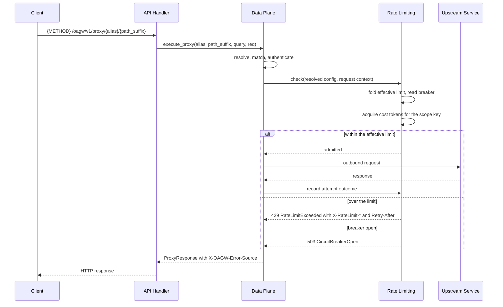
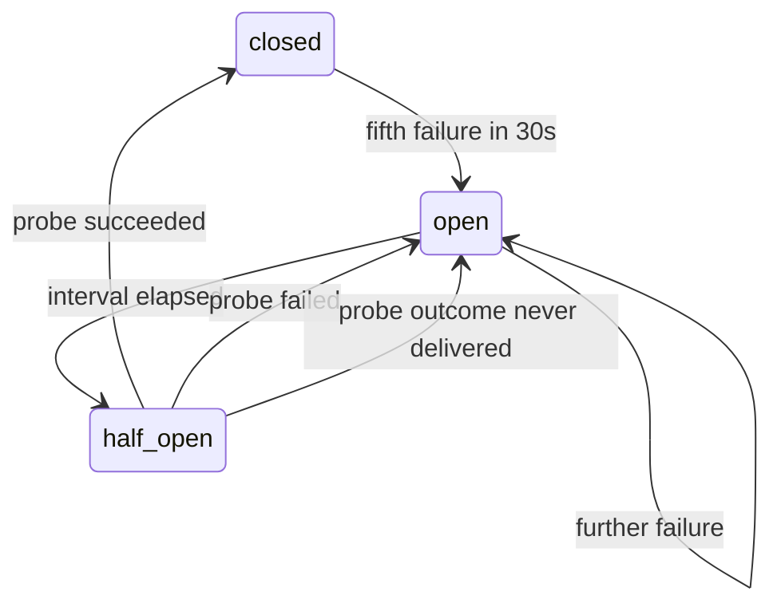

# Feature: Rate Limiting

<!-- toc -->

- [1. Feature Context](#1-feature-context)
  - [1.1 Overview](#11-overview)
  - [1.2 Purpose](#12-purpose)
  - [1.3 Actors](#13-actors)
  - [1.4 References](#14-references)
  - [1.5 Feature-Local Deviations from Shared Baselines](#15-feature-local-deviations-from-shared-baselines)
  - [1.6 Explicit Non-Applicability](#16-explicit-non-applicability)
- [2. Actor Flows (CDSL)](#2-actor-flows-cdsl)
  - [Enforce the Rate Limit on a Proxy Request](#enforce-the-rate-limit-on-a-proxy-request)
  - [Apply the Configured Over-Limit Strategy](#apply-the-configured-over-limit-strategy)
  - [Release Rate-Limit State on a Configuration Deletion](#release-rate-limit-state-on-a-configuration-deletion)
- [3. Processes / Business Logic (CDSL)](#3-processes--business-logic-cdsl)
  - [Fold the Effective Limit](#fold-the-effective-limit)
  - [Refill and Acquire from the Token Bucket](#refill-and-acquire-from-the-token-bucket)
  - [Count the Sliding Window](#count-the-sliding-window)
  - [Allocate and Validate the Budget](#allocate-and-validate-the-budget)
  - [Emit the Rate-Limit Response Headers](#emit-the-rate-limit-response-headers)
  - [Count Upstream Failures and Trip the Breaker](#count-upstream-failures-and-trip-the-breaker)
- [4. States (CDSL)](#4-states-cdsl)
  - [Circuit Breaker State Machine](#circuit-breaker-state-machine)
- [5. Definitions of Done](#5-definitions-of-done)
  - [Rate-Limit Check on the Proxy Path](#rate-limit-check-on-the-proxy-path)
  - [Token Bucket and Sliding Window Algorithms](#token-bucket-and-sliding-window-algorithms)
  - [Hierarchical Enforcement and Budget Allocation](#hierarchical-enforcement-and-budget-allocation)
  - [Rate-Limit Response Headers](#rate-limit-response-headers)
  - [Over-Limit Strategies](#over-limit-strategies)
  - [Circuit Breaker](#circuit-breaker)
  - [Per-Instance State, Cleanup, and Distributed Posture](#per-instance-state-cleanup-and-distributed-posture)
  - [Rate-Limit Entities and Layering](#rate-limit-entities-and-layering)
  - [Latency Budget](#latency-budget)
  - [Colocated Tests](#colocated-tests)
- [6. Acceptance Criteria](#6-acceptance-criteria)

<!-- /toc -->

- [ ] `p1` - **ID**: `cpt-cf-oagw-featstatus-rate-limiting-implemented`

<!-- reference to DECOMPOSITION entry -->
- [ ] `p2` - `cpt-cf-oagw-feature-rate-limiting`

## 1. Feature Context

### 1.1 Overview

This feature is the rate-limit and circuit-breaker policy of the `oagw` gear. It attaches to the proxy path `cpt-cf-oagw-feature-data-plane-proxy` owns and evaluates one question per request: may this call go out, and if not, what does the caller see. It folds the upstream, route, and tenant layers of the resolved configuration into one effective limit, counts the request against a token bucket or a sliding window under the configured counter scope, and answers an over-limit caller with 429 and the standard rate-limit headers so it can retry correctly. It also owns the circuit breaker that takes an unhealthy upstream out of rotation with 503 before the gateway dials it again.

The feature registers no endpoint and no sequence of its own. A rejection is an answer on the proxy path the caller already called, produced before the outbound request is built and tagged `X-OAGW-Error-Source: gateway` like every other gateway answer.

### 1.2 Purpose

DECOMPOSITION §2.6 places this feature as the first of the three policy tails that hang off the proxy spine: `cpt-cf-oagw-feature-data-plane-proxy` resolves, matches, and forwards, and this feature decides whether a resolved request is admitted. DECOMPOSITION §3 makes it a consumer of the proxy feature because "the check runs inside the resolved proxy context, and 429 and 503 answers replace the response the proxy would have produced", and makes `cpt-cf-oagw-feature-observability` a consumer of this one because that feature "reports rate-limit state and 429 outcomes, which only exist once that feature owns them".

This feature delivers the enforcement half of ADR 0003 (`cpt-cf-oagw-adr-rate-limiting`) — the token bucket, the dual-rate configuration, the counter scopes, the over-limit strategies, and the hierarchical fold of the canonical merge formula — and the breaker half of `cpt-cf-oagw-nfr-high-availability`. The configuration side of the same ADR is split three ways and this document names the split: the `rate_limit` object's schema validation at write time is `cpt-cf-oagw-feature-control-plane-config`'s, the per-field merge and the sharing modes are `cpt-cf-oagw-feature-hierarchical-config`'s, and what the merged members mean at enforcement time is this feature's.

Deliverables:

- The rate-limit check on the proxy path, invoked ahead of the composed chain at the position the request flow with caching of `cpt-cf-oagw-adr-state-management` fixes.
- The token bucket as the default algorithm and the sliding window as the optional alternative, selected by the `algorithm` member the resolved configuration carries.
- Dual-rate enforcement of `sustained.rate` with `sustained.window`, `burst.capacity`, and the per-request `cost`.
- Counter scoping over `global`, `tenant`, `user`, `ip`, and `route`.
- The three over-limit strategies `reject`, `queue`, and `degrade`, with the `queue` strategy delivered as its bounded behaviour and no further backpressure machinery.
- Hierarchical enforcement through `effective = min(selected_rate, route_rate, all_ancestor_enforced_rates)`, holding across alias shadowing, with budget allocation and overcommit validation.
- The 429 answer with the `X-RateLimit-*` header set and `Retry-After`, gated by the `response_headers` member.
- The circuit breaker state machine over `closed`, `open`, and `half_open`, tripping within the configured failure window and answering 503 `CircuitBreakerOpen`; the breaker's configuration parameters are deferred per DESIGN §4.7(1) and are not delivered here.
- The per-instance in-memory bucket registry of `cpt-cf-oagw-adr-state-management`, with prefix-based cleanup when an upstream or route is deleted.
- Colocated tests under `gears/system/oagw/oagw/tests/`.

**Requirements**:

- [ ] `p1` - `cpt-cf-oagw-fr-rate-limiting`
- [ ] `p1` - `cpt-cf-oagw-nfr-high-availability`
- [ ] `p1` - `cpt-cf-oagw-nfr-low-latency`
- [x] `p2` - `cpt-cf-oagw-fr-hierarchical-config`
- [ ] `p2` - `cpt-cf-oagw-usecase-rate-limit-exceeded`

`cpt-cf-oagw-fr-hierarchical-config` carries the checked state DECOMPOSITION §2.6 records: its merge behaviour is delivered by `cpt-cf-oagw-feature-hierarchical-config`, and what this feature consumes of it is the merged `EffectiveRateLimit` result rather than a second merge.

**Principles**:

- `p1` - `cpt-cf-oagw-principle-error-source`
- `p1` - `cpt-cf-oagw-adr-rate-limiting`
- `p1` - `cpt-cf-oagw-adr-state-management`
- `p1` - `cpt-cf-oagw-adr-error-source-distinction`

**Constraints**:

- `p1` - `cpt-cf-oagw-constraint-toolkit-deploy`

**Design Components**:

- `p1` - `cpt-cf-oagw-component-model`
- `p1` - `cpt-cf-oagw-tech-dependencies`

This feature delivers the rate-limit merge row of the DESIGN §3.2 Hierarchical Configuration subsection — the row whose strategy is `min(ancestor, descendant)` — as its enforcement-time consumption, together with the Shadowing Behavior paragraph that states the canonical formula. The merge table itself, the hierarchy walk, and the sharing-mode decision are `cpt-cf-oagw-feature-hierarchical-config`'s and are not restated here.

**Domain Model Entities**:

- `TokenBucket` — one bucket per counter key, carrying its tokens, its last update instant, its capacity, and its refill rate (ADR 0003's implementation notes name the type).
- `RateLimiterRegistry` — the per-instance registry of buckets and breaker machines the Data Plane holds (`cpt-cf-oagw-adr-state-management` names `rate_limiters` as the third piece of Data Plane state).
- `BudgetAllocation` — the budget mode, the parent total, the overcommit ratio, and the child allocations validated against them; DECOMPOSITION §2.6 names the concept "budget allocation" and this document fixes the type name.
- `CircuitBreakerState` — one machine per resolved upstream, carrying its state, its rolling failure window, and the instant its open interval began.

`TokenBucket`, `BudgetAllocation`, and `CircuitBreakerState` are declared here and DECOMPOSITION §2.6 lists all three under this entry; `RateLimiterRegistry` is declared here because `cpt-cf-oagw-adr-state-management` names `rate_limiters` as the third piece of Data Plane state, which the baseline's entity list does not carry, and `RateLimitConfig` is listed by DECOMPOSITION §2.6 for the enforcement semantics of its members and is consumed from `cpt-cf-oagw-feature-gear-foundation` rather than declared (§1.5). `RateLimitConfig` is consumed from `cpt-cf-oagw-feature-gear-foundation`, which declares it as shared vocabulary, and `EffectiveRateLimit` is consumed from `cpt-cf-oagw-feature-hierarchical-config`, which produces it; neither is redeclared (§1.5). `ResolvedUpstream`, `MatchedRoute`, `ProxyContext`, and `ProxyResponse` are consumed from `cpt-cf-oagw-feature-data-plane-proxy`, and `ErrorContext` from `cpt-cf-oagw-feature-gear-foundation`.

**Data**:

- None. DECOMPOSITION §2.6 declares no table for this feature, and it creates, reads, or writes none. The buckets, the counters, the budget allocations, and the breaker machines are in-process and persisted nowhere; a restart loses them and a restart is the only thing that resets them (§1.5).

**API**:

- None. Rejections are returned on the existing `{METHOD} /oagw/v1/proxy/{alias}[/{path_suffix}]` path that `cpt-cf-oagw-feature-data-plane-proxy` registers, which is the whole of the API statement DECOMPOSITION §2.6 makes.

This feature invents no path, no method, no query parameter, and no response shape. The management write path that changes the configuration it enforces is `cpt-cf-oagw-feature-control-plane-config`'s, and this feature is a callee of that path for two purposes only: the overcommit validation of a child allocation, and the cleanup notification of a deletion (§1.5).

### 1.3 Actors

| Actor | Role in Feature |
|-------|-----------------|
| `cpt-cf-oagw-actor-app-developer` | Sends the proxy request whose rate limit is evaluated and receives either the upstream's response or the 429 answer with the rate-limit headers. PRD §5.2 names this actor for the proxy requirements and PRD §8 names it the actor of `cpt-cf-oagw-usecase-rate-limit-exceeded`, whose three strategy outcomes are this feature's §2 answers. |
| `cpt-cf-oagw-actor-platform-operator` | Deletes an upstream or a route through the management API and thereby triggers the prefix-based cleanup of the buckets and breaker entries that configuration owned. The deletion itself is `cpt-cf-oagw-feature-control-plane-config`'s act; what this feature does on the notification of it is §2's third flow. |
| `cpt-cf-oagw-actor-upstream-service` | Answers the outbound attempt whose outcome the breaker counts. It is contacted by `cpt-cf-oagw-feature-data-plane-proxy` and never by this feature; what reaches this feature is the classification of that attempt, which is the only signal that opens or closes the breaker. |

Two actors participate indirectly and are named here so their absence from the table is a record and not a gap:

- `cpt-cf-oagw-actor-tenant-admin` configures the rate limits of its own tenant hierarchy — a stricter rate, a tighter scope, an own `cost` — through the management API of `cpt-cf-oagw-feature-control-plane-config` under the `oagw:upstream:override_rate` permission `cpt-cf-oagw-feature-hierarchical-config` evaluates. PRD §2 names setting stricter rate limits as that actor's need, and the configuring is a write-time act this feature performs nothing of.
- `cpt-cf-oagw-actor-types-registry` and `cpt-cf-oagw-actor-cred-store` issue no call this feature answers. The error-type catalogue was provisioned at startup by `cpt-cf-oagw-feature-gear-foundation`, and the credential material a forwarded request carries is resolved by `cpt-cf-oagw-feature-plugin-system` before the check this feature runs.

### 1.4 References

- **PRD**: [PRD.md](../PRD.md)
- **Design**: [DESIGN.md](../DESIGN.md)
- **Dependencies**: `cpt-cf-oagw-feature-data-plane-proxy` — the proxy path this feature runs inside, the `ProxyContext`, `ResolvedUpstream`, `MatchedRoute`, and `ProxyResponse` types it consumes, the resolution and route matching that precede the check, the outbound attempt whose outcome the breaker counts, and the error-source classification that tags every answer it produces (DECOMPOSITION §3); and `cpt-cf-oagw-feature-hierarchical-config` — the `EffectiveRateLimit` result and the per-family sharing modes the check consumes, delivered by `cpt-cf-oagw-algo-field-family-merge` of that feature.

Supporting sources this feature stays consistent with:

- [ADR/0003-rate-limiting.md](../ADR/0003-rate-limiting.md) (`cpt-cf-oagw-adr-rate-limiting`) — the token bucket over the sliding window, the dual-rate field table with its defaults, the counter scopes, the three strategies, the inheritance table, the budget modes with the overcommit arithmetic, the worked Example 1 that min-merges the burst capacity beside the sustained rate, the `response_headers` gate, the response header set, and the prefix-based cleanup of a deleted resource.
- [ADR/0006-state-management.md](../ADR/0006-state-management.md) (`cpt-cf-oagw-adr-state-management`) — the per-instance token buckets owned by the Data Plane because it "has full request context (tenant, upstream, route)", the request flow with caching that fixes where the check sits, and the `RateLimiterRegistry` the Data Plane state holds.
- [ADR/0007-error-source-distinction.md](../ADR/0007-error-source-distinction.md) (`cpt-cf-oagw-adr-error-source-distinction`) — `X-OAGW-Error-Source: gateway` for the 429 and the 503 this feature answers, the `application/problem+json` body both carry, and the `retry_after_seconds` extension member beside the `Retry-After` header.
- [schemas/upstream.v1.schema.json](../schemas/upstream.v1.schema.json) and [schemas/route.v1.schema.json](../schemas/route.v1.schema.json) — the frozen `definitions.rate_limit` shape this feature enforces against: `sharing`, `algorithm`, `sustained.rate` with `sustained.window`, `burst.capacity`, `scope`, `strategy`, and `cost`, with `sustained` required and every numeric member at least 1. Both files are frozen inputs this run does not edit, and neither declares the `response_headers` or `budget` member ADR 0003 names (§1.5).
- [config/e2e-local.yaml](../../../../../config/e2e-local.yaml) — the graded configuration. Its only `rate_limit` key sits under the `api-gateway` gear's `defaults` block and carries `rps: 1000`, `burst: 200`, and `in_flight: 64`: the inbound platform gateway's own limiter, whose members (`rps`, `in_flight`) are not members of the OAGW `rate_limit` object at all. No tenant, upstream, or route declared in it carries a `rate_limit` block, and its `oagw.config` block carries no rate-limit key, so every rate limit the graded gear enforces is one written through the management API at run time, and with none written the gear enforces no limit at all.

**Run-level assumptions** — premises this feature relies on that come from the platform runtime rather than from PRD, DESIGN, the ADRs, or DECOMPOSITION. Each states what fails if the premise does not hold:

- Assumption: the Data Plane process has a monotonic clock for bucket refill, sliding-window accounting, and the breaker's rolling failure window, and a wall clock for the absolute epoch second the `X-RateLimit-Reset` header reports. ADR 0003's implementation notes read an instant-of-day monotonic source for refill, and its header example reports `X-RateLimit-Reset` as an absolute epoch value, which no monotonic clock can produce. If only a wall clock is available, the refill arithmetic **MUST** be computed from differences of successive wall readings so a clock adjustment cannot add or remove tokens, and if no wall clock is available the `X-RateLimit-Reset` header **MUST** be omitted rather than synthesized, because an invented absolute time correlates nothing.
- Assumption: the graded deployment runs one process, which is the single-executable branch of `cpt-cf-oagw-constraint-toolkit-deploy` that DECOMPOSITION §1.4 records, so the per-instance registry sees every proxied request. If a deployment runs more than one instance serving the same upstream, each instance holds its own buckets, the aggregate admission can exceed the configured rate by up to the instance count, and this feature **MUST NOT** report global accuracy, **MUST NOT** add a sync path, and **MUST NOT** present the per-instance counters as the configured limit (§1.5).
- Assumption: the platform supplies the identifiers the counter scopes key on — the calling tenant and subject from the authenticated context, and the peer address of the inbound connection. A `scope` of `user` on a request with no authenticated subject, or of `ip` on a connection whose peer address cannot be resolved, is a counter the gateway cannot key, and skipping enforcement would turn a configured limit into no limit. Either case **MUST** therefore fall back to the `tenant` scope rather than skip the check, and the fallback **MUST** be the same for every request that lacks the identifier, so a caller cannot move between scopes to escape a limit. The peer address is the one the platform's inbound handler exposes for the connection that reached the gear; this feature **MUST NOT** parse a proxying header such as `X-Forwarded-For` to recover a client address, because no supplied document assigns the gear that duty and a self-derived address is a key a caller can forge. Where the platform does not forward the client identity, the `ip` scope degenerates to one bucket shared by every caller behind that hop, which is a recorded consequence and not a failure.
- Assumption: the classification of one outbound attempt reaches this feature as a per-attempt outcome, produced by `cpt-cf-oagw-algo-response-classify` of `cpt-cf-oagw-feature-data-plane-proxy`, which is the feature that owns the classification. No supplied document states who reports a failure to the breaker, and the breaker has no other source of evidence. If no outcome is delivered, the breaker **MUST** stay closed and **MUST NOT** open on the absence of information, because taking an upstream out of rotation without evidence is a worse failure than the one the breaker prevents.
- Assumption: the notification of a successful upstream or route deletion reaches this feature's registry in the same process and before the delete's response is produced, which is the same in-process ordering `cpt-cf-oagw-feature-data-plane-proxy` already relies on for its cache flush and which the single-executable posture makes the only mechanism (§1.5). If the notification does not arrive, the buckets and breaker entries of the deleted configuration remain resident and are never consulted again, because no resolution can reach a deleted row; that is a memory leak and not a correctness one, and this feature **MUST NOT** re-resolve a deleted resource to discover that it is gone. `cpt-cf-oagw-flow-route-delete` and the deletion branch of the upstream write flow of `cpt-cf-oagw-feature-control-plane-config` produce that notification, which is the producer this feature's cleanup flow receives it from.
- Assumption: the platform's inbound handler can hold a proxy request open while the `queue` strategy holds it, because a queued request is one that has been read and not yet answered. The outbound deadline `oagw.config.proxy_timeout_secs` bounds the upstream exchange and not the inbound wait, so it does not bound the queue. If the runtime cannot suspend a handler, the `queue` strategy **MUST** degrade to the `reject` answer rather than hold a worker indefinitely, and the degradation **MUST** be the whole strategy and not a per-request choice, so a deployment either queues or it does not.

### 1.5 Feature-Local Deviations from Shared Baselines

| Deviation | Rationale | Review owner | Validation performed |
|-----------|-----------|--------------|----------------------|
| The two circuit-breaker parameters DESIGN §4.7(1) defers are carried as the constants PRD §6.1 states — the breaker trips within 5 failed requests in a 30-second window — and add no `OagwConfig` key. | PRD §6.1 states both numbers as the threshold of `cpt-cf-oagw-nfr-high-availability`, and DESIGN §4.7(1) defers the breaker's "config and fallback strategies", which is a deferral of their configurability and not of the machine this feature is assigned. The `OagwConfig` surface closes at the five keys DECOMPOSITION §2.1 declares and `cpt-cf-oagw-feature-gear-foundation` owns, and names no breaker key, so a breaker key here would give one configuration surface two owners. A deployment that needs different values changes a build-time constant, not a configuration file. | The controller of this run. | Accepted by the semantic review of this run; `cfs validate --artifact` clean. |
| The open-to-half-open interval is a named constant of this feature with no configuration surface and no sourced value. | PRD §6.1 states a trip threshold and states no reopen delay; DESIGN §3.3 tabulates the `CircuitBreakerOpen` row and states no interval; ADR 0003 does not cover the breaker at all; and DESIGN §4.7(1) defers exactly this configuration. A machine that can open must also be able to try again, so the interval cannot be left undefined, and stating a number here would be the invention the constants rule forbids. The value is recorded in the implementation as a build-time constant, and the behaviour this document pins is that the interval exists, that it is finite, and that no request is forwarded while it runs. | The controller of this run. | Accepted by the semantic review of this run; `cfs validate --artifact` clean. |
| What counts as a breaker failure is fixed to three rows of the DESIGN §3.3 catalogue — `ConnectionTimeout` and `RequestTimeout` at 504, and `LinkUnavailable` at 503 — and to nothing else. | No supplied document enumerates the failures a breaker counts, so the enumeration is a recorded decision. The three rows are the ones DESIGN §3.3 marks unconditionally retriable whose descriptions say the gateway obtained no answer from the target: a connection that never established, an exchange that never completed, and a link that was unavailable. `DownstreamError` at 502 is marked retriable "Depends" and describes an upstream that answered, so it is evidence about the upstream's mood and not about its reachability; a 4xx answer is the upstream's own verdict on the request; and a 429 this feature produced is evidence about nothing but the caller's own rate. | The controller of this run. | Accepted by the semantic review of this run; `cfs validate --artifact` clean. |
| A successful outbound attempt clears the upstream's failure count. | PRD §6.1 states the trip condition as a count within a window and states no recovery from partial accumulation. Without a clearing rule, a host that alternates one failure with many successes accumulates five failures across a long period and opens, which contradicts the breaker's purpose of isolating a target that is unhealthy now. Clearing on success ties the count to the target's recent behaviour, which is what the "30-second window" of PRD §6.1 describes. | The controller of this run. | Accepted by the semantic review of this run; `cfs validate --artifact` clean. |
| While `half_open`, the machine admits one probe; every further concurrent request for the same upstream is answered 503 `CircuitBreakerOpen` until that probe resolves. | DESIGN §4.7(2) defers concurrency control, so no in-flight limit exists for the machine to borrow, and an unbounded half-open state would forward an arbitrary number of requests to a target that just failed five times. One probe is the smallest bound that still tests the target, and the 503 answer is the catalogue row for a breaker that is not admitting, which is what the machine is during the probe. | The controller of this run. | Accepted by the semantic review of this run; `cfs validate --artifact` clean. |
| `Retry-After` is the whole-second delay until the effective bucket holds the request's `cost`, rounded up to at least 1, and `X-RateLimit-Reset` is the epoch second at which the bucket reaches capacity. | ADR 0003 cites RFC 6585 and the IETF rate-limit headers draft, shows the four headers beside one another in its More Information section, and states no derivation for either value; DESIGN §3.3 names the `retry_after_seconds` extension member as "Retry guidance" and states no derivation; and ADR 0007's worked example shows `Retry-After` and `retry_after_seconds` carrying the same value. The derivation above is the only one the dual-rate configuration determines, and the two members carry the same number because the one example that shows both shows them equal. | The controller of this run. | Accepted by the semantic review of this run; `cfs validate --artifact` clean. |
| The `response_headers` and `budget` members of ADR 0003 are carried as that ADR's declared defaults and are not configurable in this deployment, because the shipped `definitions.rate_limit` of both frozen schemas declares `additionalProperties: false` and lists neither member. | `cpt-cf-oagw-feature-control-plane-config` rejects an unknown member of the `rate_limit` object at write time, so a configuration carrying either member is refused and cannot reach this feature. DECOMPOSITION §2.6 carries both into this feature's scope, so neither is dropped: the header set is emitted under ADR 0003's declared default `response_headers: true`, and the budget mode is its declared default `unlimited`. The `allocated` and `shared` modes and the overcommit validation of ADR 0003 are delivered and tested at the domain layer and become reachable from a written configuration only when a schema revision admits the member, which is a change this run does not make to a frozen input. Neither member adds an `OagwConfig` key. | The controller of this run. | Accepted by the semantic review of this run; `cfs validate --artifact` clean. |
| The overcommit validation of ADR 0003 is a routine this feature owns and the management write path of `cpt-cf-oagw-feature-control-plane-config` invokes when a child upstream or route that declares a budget is written, because this feature registers no management endpoint. | ADR 0003 frames the validation as happening on child creation, which is a management-write act, while DECOMPOSITION §2.6 assigns the validation to this feature and declares its API as none. The resolution is the same call-direction seam `cpt-cf-oagw-feature-data-plane-proxy` records for its cache flush and `cpt-cf-oagw-feature-plugin-system` records for the routines the proxy invokes: the act is this feature's and the trigger is another feature's. A rejected allocation is answered 400 through the foundation's `ValidationError` variant, which is the catalogue row for a failed request validation and needs no new variant. | The controller of this run. | Accepted by the semantic review of this run; `cfs validate --artifact` clean. |
| The prefix-based cleanup of a deleted upstream or route is split at a named seam: the notification of a successful deletion is `cpt-cf-oagw-feature-control-plane-config`'s act, and the cleanup is this feature's, executed in process before the delete's response is produced. | ADR 0003's Redis key structure paragraph gives the `{resource_type}:{resource_id}` prefix for "efficient prefix-based cleanup … when a resource is deleted", and names two mechanisms for it, the in-memory `retain` and the Redis `SCAN`; the Redis half is out of scope per DECOMPOSITION §2.6, so only the in-memory half is delivered. The write path already issues one in-process notification per interested owner — to `cpt-cf-oagw-feature-data-plane-proxy`'s flush routine, per that feature's own §1.5 — and this feature is a second interested owner of the same event. | The controller of this run. | Accepted by the semantic review of this run; `cfs validate --artifact` clean. |
| The rate-limit check sits ahead of the composed chain on the proxy path. | ADR 0006's request flow with caching orders the proxy steps as the auth plugin, then "Check rate limiter (DP-owned)", then the guard and transform plugins, then the outbound call, and no other supplied document places the check; DESIGN §3.5's sequence diagram names no rate-limit step at all. The chain that `cpt-cf-oagw-algo-chain-execute` runs bundles the auth plugin with the guards and the transforms into one call, so the position ADR 0006 fixes for the check is realized ahead of that chain, and the credential injection it performs happens after the check — which the check never needs, because it keys on the tenant, the subject, and the peer address the middleware resolved. The position is load-bearing: it is after resolution, so the check has the effective configuration; it is before the guard chain, so a rejected request costs no plugin execution; and it is before the send, so an over-limit request never reaches the upstream. | The controller of this run. | Accepted by the semantic review of this run; `cfs validate --artifact` clean. |
| The canonical formula is applied here as a layer minimum over the three layer values the resolution produced, and its `all_ancestor_enforced_rates` term arrives already folded into those layer values by `cpt-cf-oagw-algo-field-family-merge` of `cpt-cf-oagw-feature-hierarchical-config`. | DESIGN §3.2's Shadowing Behavior states `effective_rate = min(selected_rate, route_rate, all_ancestor_enforced_rates)` and its merge table states the rate-limit row as `min(ancestor, descendant)`; `cpt-cf-oagw-feature-hierarchical-config` applies that minimum across the ancestor chain, normalizes the compared values to one scale, and reports one result per layer, and its Definition of Done forbids a downstream feature from re-walking the chain or re-applying a per-field strategy. Re-folding the ancestor term here would walk the chain a second time for a value it already carries. | The controller of this run. | Accepted by the semantic review of this run; `cfs validate --artifact` clean. |
| The four `rate_limit` members that carry no merge — `algorithm`, `scope`, `strategy`, and `cost` — are taken from the last layer that declares them in the upstream, then route, then tenant order. | ADR 0003's inheritance table and DESIGN §3.2's merge row state a strategy for the limits and for none of the four; `cpt-cf-oagw-fr-config-layering` states the layer order as upstream base, then route, then tenant highest, and `cpt-cf-oagw-feature-data-plane-proxy` records that the tenant layer is applied last and therefore prevails. The same order decides a member no source assigns a merge to, which is why the route's `cost` of ADR 0003's Example 3 wins over an upstream `cost` and a tenant `cost` wins over both. | The controller of this run. | Accepted by the semantic review of this run; `cfs validate --artifact` clean. |
| A counter scope the platform cannot key falls back to the `tenant` scope, and a request whose resolved configuration names no `rate_limit` at all is enforced by nothing. | The first half is the fail-consequence of the scope-identifier assumption in §1.4. The second half is the shipped schema's own shape: `rate_limit` is an optional member of both the upstream and the route, so its absence is a legal configuration and not an error, and PRD §5.2 conditions enforcement on limits being configured at those levels. A missing limit is a configuration choice an operator made, not a failure to report. A missing limit at *every* layer is that configuration choice; a limit at any one layer is enforced, which is the fold's outcome and not the two-layer look the check's guard once suggested. | The controller of this run. | Accepted by the semantic review of this run; `cfs validate --artifact` clean. |
| A request whose `cost` exceeds the effective `burst.capacity` is never admittable and is refused on every attempt for as long as that configuration stands. | `sustained.rate` and `cost` are both at least 1 and neither is bounded against the other by the shipped schema, so the configuration is legal and the refusal is its consequence: the bucket's ceiling is the capacity, and a cost above the ceiling can never be covered. ADR 0003's Example 3 shows costs of 1 and 10 against a tenant budget of 1000 per minute, so the case is not the ADR's intent, and the answer is a deterministic 429 rather than an intermittent one, which is the honest rendering of a limit that can never be met. | The controller of this run. | Accepted by the semantic review of this run; `cfs validate --artifact` clean. |
| The `queue` strategy is delivered as its bounded behaviour only, and its two bounds are named constants of this feature with no configuration surface and no sourced value: the queue holds at most a fixed number of requests and a queued request waits at most a fixed interval before it is answered 429 exactly as a full queue answers. | PRD §8 states the outcome as "Request queued for later execution within bounded capacity" and states no value for either bound; DESIGN §4.7(3) defers backpressure queueing as a future development; and DECOMPOSITION §2.6 puts "backpressure queueing strategies beyond the `queue` strategy's bounded behaviour" out of scope. What this document pins is the existence of both bounds and their consequence — a full queue answers 429 with the header set the `reject` strategy produces, the queue never grows past its count bound, and a queued request that outwaits the wait bound is answered the same 429 and charged nothing — and both values are recorded in the implementation as build-time constants. | The controller of this run. | Accepted by the semantic review of this run; `cfs validate --artifact` clean. |
| The `degrade` strategy withholds the burst reserve: under the `token_bucket` algorithm a degraded request is evaluated against a bucket whose capacity is reduced to the sustained rate, and under the `sliding_window` algorithm there is no burst reserve to withhold, ADR 0003's own comparison table giving that algorithm "No boundary burst", so the degraded request is evaluated against the unchanged window and the strategy's only observable effect is the absence of a 429 for a request the window admits. | PRD §8 states the outcome as "Request processed with reduced functionality" and names no reduction, and the reduction this feature applies is expressed in the currency each algorithm has; DESIGN and ADR 0003 name `degrade` only as an enum value. The response body belongs to the upstream and its transfer mode to `cpt-cf-oagw-feature-streaming`, so the only reduction this feature can apply without touching a surface another feature owns is the allowance it computes itself. A degraded request that the reduced capacity cannot cover is still refused, because a strategy that admitted everything would make the strategy indistinguishable from no limit. | The controller of this run. | Accepted by the semantic review of this run; `cfs validate --artifact` clean. |
| `RateLimitConfig` is consumed and not redeclared, and the ownership of the rate-limit types is split three ways and named here. | `cpt-cf-oagw-feature-gear-foundation` declares `RateLimitConfig` with the other sub-configuration types as the gear's shared vocabulary (DECOMPOSITION §2.1); `cpt-cf-oagw-feature-hierarchical-config` declares `EffectiveRateLimit` as its merge result and states in its own §1.5 that the token-bucket meaning of the members, the budget modes, and the overcommit validation belong to this feature; and this feature declares the four enforcement types listed in §1.2. DECOMPOSITION §2.6 lists `RateLimitConfig` under this entry because the enforcement semantics of its members are this feature's, not because the type is declared twice. | The controller of this run. | Accepted by the semantic review of this run; `cfs validate --artifact` clean. |
| Rate-limit state is not persisted across a restart, and the brief burst window a restart opens is accepted. | PRD §12 offers two mitigations for the restart risk: persist the rate limit counters, or accept a brief burst on cold start. DECOMPOSITION §1.4 records that this run accepts the burst window "rather than introducing a Redis dependency", which selects the second mitigation and declines the first, and DECOMPOSITION §2.6 puts Redis-backed counters out of scope altogether. A cold bucket starts full, so the window is bounded by the configured `burst.capacity` and closes as the bucket refills. | The controller of this run. | Accepted by the semantic review of this run; `cfs validate --artifact` clean. |
| The per-instance counters are a recorded limitation for multi-instance deployments and are stated as one wherever the limit is described. | DECOMPOSITION §1.4 records that there is no cross-instance state and no distributed rate-limit sync, and ADR 0003's Option A — the only fully local option it considers — states the consequence itself: "Effective limit = `configured_limit / node_count`", with the further caveat that the division is accurate only when traffic is evenly distributed. The hybrid option ADR 0003 recommends and the centralized option it rejects both require the Redis dependency DECOMPOSITION §2.6 excludes, so the limitation is the price of the posture the graded deployment chooses, and this feature reports it rather than papering over it. | The controller of this run. | Accepted by the semantic review of this run; `cfs validate --artifact` clean. |
| This feature's tests are colocated at `gears/system/oagw/oagw/tests/` instead of `testing/e2e/gears/oagw/`. | DECOMPOSITION §1.3(3) reserves `testing/e2e/gears/oagw/` for the acceptance suite; every unit and integration test this decomposition produces lives with the crate. This is the same deviation `cpt-cf-oagw-feature-gear-foundation`, `cpt-cf-oagw-feature-control-plane-config`, `cpt-cf-oagw-feature-hierarchical-config`, `cpt-cf-oagw-feature-data-plane-proxy`, and `cpt-cf-oagw-feature-plugin-system` record in their own §1.5 tables, restated here because the tests it governs include this feature's. | The controller of this run. | Accepted by the semantic review of this run; `cfs validate --artifact` clean. |
| This feature's §1.4 declares `cpt-cf-oagw-feature-hierarchical-config` as a second dependency, which DECOMPOSITION §3 withholds from it while granting the same wait to `cpt-cf-oagw-feature-cors` in the same sentence. | DECOMPOSITION §2.6 itself assigns the per-field merge table to `cpt-cf-oagw-feature-hierarchical-config` and carries the canonical formula into this feature's scope, and `cpt-cf-oagw-algo-effective-limit-fold` consumes the `EffectiveRateLimit` result that feature produces, so the dependency is a real consumption and the §3 sentence records build parallelism rather than consumption. Recording it here keeps the dependency graph the implementation phase follows consistent with the baseline's. | The controller of this run. | Accepted by the semantic review of this run; `cfs validate --artifact` clean. |
| The `ip` scope keys on the peer address the platform's inbound handler exposes for the connection that reached the gear, and this feature parses no proxying header such as `X-Forwarded-For` to recover a client address; where the platform does not forward the client identity the scope holds one bucket shared by every caller behind that hop. | No supplied document assigns the gear the duty of recovering a client address from a proxying header, and a self-derived address is a key a caller can forge, so the peer address the §1.4 assumption names is the only source the scope reads. An address the platform does expose is a resolvable one, so the §1.4 `tenant` fallback does not fire for it, and the shared bucket that results is a recorded consequence and not a failure. | The controller of this run. | Accepted by the semantic review of this run; `cfs validate --artifact` clean. |
| The §1.2 Principles list carries `cpt-cf-oagw-adr-state-management` and `cpt-cf-oagw-adr-error-source-distinction` beyond the two entries DECOMPOSITION §2.6 records, both of which this feature implements and cites in §1.4. | Both added ADRs are load-bearing here — the per-instance registry of ADR 0006 is the state this feature holds, and the error-source distinction of ADR 0007 tags every answer it produces — and every sibling feature document mirrors its baseline list exactly, so the superset is recorded rather than silently carried. | The controller of this run. | Accepted by the semantic review of this run; `cfs validate --artifact` clean. |

### 1.6 Explicit Non-Applicability

The areas below apply to the gear as a whole but not to this feature. Each is stated here so the omission is a recorded decision rather than a silent gap, and each names the feature that does own it.

- **The hierarchy walk, alias shadowing, the sharing-mode decision, and the per-field merge table.** DECOMPOSITION §2.3 places all four in `cpt-cf-oagw-feature-hierarchical-config`, and this feature consumes their result through `EffectiveRateLimit`. `cpt-cf-oagw-algo-tenant-chain-walk`, `cpt-cf-oagw-algo-alias-shadow-resolve`, `cpt-cf-oagw-algo-sharing-mode-decision`, and `cpt-cf-oagw-algo-field-family-merge` are that feature's routines; §3 of this document calls the last of them indirectly, through the resolution, and restates no merge row.
- **The `rate_limit` configuration schema and its write-time validation.** `cpt-cf-oagw-feature-control-plane-config` validates the `rate_limit` sub-object of both frozen schemas, and this feature enforces against a configuration that already passed that validation. The one routine of §3 that runs at write time is the overcommit validation, which that feature's write path calls and which is not a schema check (§1.5).
- **The proxy path itself: resolution, matching, endpoint selection, inbound and body validation, header transformation, forwarding, and error-source classification.** `cpt-cf-oagw-feature-data-plane-proxy` owns all of them, and this feature produces neither the `ProxyResponse` nor the `X-OAGW-Error-Source` tag — it produces the `DomainError` the tag attaches to, and the classification is that feature's.
- **Redis-backed distributed counters, the hybrid sync of ADR 0003's Option C, and the centralized store of its Option B.** DECOMPOSITION §2.6 and DECOMPOSITION §1.4 both exclude them, and the graded posture of `cpt-cf-oagw-constraint-toolkit-deploy` uses L1 state only. ADR 0003's own consequences list records the trade: the Redis dependency is gone, and the accuracy across instances is gone with it (§1.5).
- **Backpressure queueing strategies beyond the `queue` strategy's bounded behaviour, and concurrency control.** DESIGN §4.7(3) defers the former and §4.7(2) defers the latter. What §3 delivers is the bound and its 429 answer, and no in-flight limit, no admission control, and no graceful-degradation machinery.
- **Circuit-breaker configuration parameters and fallback strategies.** DESIGN §4.7(1) defers both. What §4 delivers is the state machine and the 503 answer DECOMPOSITION §2.6 assigns, and no configurable threshold, no fallback response, and no per-route breaker policy.
- **Metrics emission and audit log formatting.** `cpt-cf-oagw-feature-observability` owns the Prometheus surface and the structured record, and DECOMPOSITION §3 makes it a consumer of this feature because it "reports rate-limit state and 429 outcomes". The `oagw_rate_limit_usage_ratio`, `oagw_rate_limit_exceeded_total`, `oagw_circuit_breaker_state`, and `oagw_circuit_breaker_transitions_total` series DESIGN §4.2 names are that feature's to emit, and the `host` label under which the breaker state is reported is the upstream alias, which is that feature's labelling decision. What this feature supplies is the state and the transitions those series describe.
- **Persistence.** DECOMPOSITION §2.6 declares no table for this feature, and `cpt-cf-oagw-db-schema` is fully claimed by `cpt-cf-oagw-feature-control-plane-config` and `cpt-cf-oagw-feature-plugin-system`. Nothing this feature computes outlives the process.
- **gRPC proxying and WebTransport.** Both are out of scope per DECOMPOSITION §1.3(4), and `cpt-cf-oagw-feature-data-plane-proxy` records that a gRPC upstream produces no matching route and a `wt` upstream is refused at dial time. A request that never resolves to a forwardable target never reaches the check, so this feature enforces no limit and holds no breaker for either.
- **The plugin contracts, the registries, the chain composition, and credential resolution.** `cpt-cf-oagw-feature-plugin-system` owns them, and the check this feature runs sits ahead of the chain that composes them, executing neither the auth plugin nor any guard. A guard that rejects a request after the check has charged it does not refund the charge, which is the behaviour of a counter that records an admitted request rather than a forwarded one.
- **CORS preflight and streaming connection lifecycles.** `cpt-cf-oagw-feature-cors` owns the preflight answer, which requires no upstream resolution and therefore no rate-limit check, and `cpt-cf-oagw-feature-streaming` owns the stream lifecycles. A request that upgrades to a stream is charged once, at the check, and the stream's own duration consumes no further tokens.
- **Rollout, rollback, versioning, localization, accessibility, and compliance.** The gear is one configuration item and one release unit (DECOMPOSITION §1.4), so this feature ships no rollout of its own. Every identifier it reads is fixed at `.v1`. The 429 and 503 bodies are English protocol strings from the foundation's mapping, and the rate-limit headers are protocol values an accessibility requirement does not reach. No credential material, no request body, and no caller identifier other than the scope key enters a bucket, and the scope key is never echoed in a problem `detail`.

## 2. Actor Flows (CDSL)

The flows below run inside the proxy request flow of `cpt-cf-oagw-seq-proxy-flow` (DESIGN §3.5) at the position ADR 0006 fixes, and they answer the three outcomes of `cpt-cf-oagw-usecase-rate-limit-exceeded` (PRD §8): handled per strategy, whether that strategy rejected, queued, or degraded the request. None of them registers a path; each is reached through the proxy handler `cpt-cf-oagw-feature-data-plane-proxy` registered.

**Use cases**: `cpt-cf-oagw-usecase-rate-limit-exceeded`

`cpt-cf-oagw-usecase-proxy-request` is `cpt-cf-oagw-feature-data-plane-proxy`'s and is not restated here; this feature is reached from it and adds no second statement of it.

### Enforce the Rate Limit on a Proxy Request

- [x] `p1` - **ID**: `cpt-cf-oagw-flow-rate-limit-check`

**Actor**: `cpt-cf-oagw-actor-app-developer`

This flow is invoked once per proxy request by `cpt-cf-oagw-flow-proxy-request` of `cpt-cf-oagw-feature-data-plane-proxy`, ahead of the composed chain at the position §1.5 records. It answers with an admission, with a gateway error, or with nothing at all when no limit is configured; it never answers with a passthrough, because it produces no upstream response.

**Success Scenarios**:

- A request whose counter can cover its `cost` is charged and the proxy path continues with no answer from this flow, which is the ordinary case and produces no header of its own.
- A burst is admitted up to `burst.capacity`: a caller that sends more than the sustained rate for a short period is admitted from stored tokens, which is the behaviour ADR 0003's Confirmation item 1 names as the first thing the tests verify.
- The same upstream under a `route` scope charges the matched route's counter and under a `tenant` scope charges the calling tenant's, so the scope selects a counter and never a limit.
- A request whose counter key falls back to the `tenant` scope under §1.4 is enforced against that tenant's counter, and the fallback is the same for every request that lacks the identifier.
- A configuration change that tightens the effective limit takes effect on the next request with no restart, no flush, and no action from this feature, because the limit is read from the resolution the proxy already performed and the bucket is keyed by the resolved identity.
- A request whose resolved configuration carries no `rate_limit` at any layer is enforced by nothing and charged to nothing (§1.5).

**Error Scenarios**:

- The counter cannot cover the `cost` and the configured strategy is `reject`: 429 with the `RateLimitExceeded` variant (`gts.cf.core.errors.err.v1~cf.oagw.rate_limit.exceeded.v1`), the header set of §3, and `X-OAGW-Error-Source: gateway`; nothing is forwarded.
- The counter cannot cover the `cost` and the strategy is `queue`: the request is held under `cpt-cf-oagw-flow-rate-limit-strategy` and no answer is produced yet; when the queue is at its bound, the same 429 answer is produced instead.
- The counter cannot cover the `cost` and the strategy is `degrade`: the request is admitted with the burst reserve withheld and forwarded, and no 429 is produced for it.
- The breaker for the resolved upstream is `open` or is in its `half_open` probe window with the probe already in flight: 503 with the `CircuitBreakerOpen` variant (`gts.cf.core.errors.err.v1~cf.oagw.circuit_breaker.open.v1`), produced before any charge is made and before the outbound attempt.
- The `cost` exceeds the effective `burst.capacity`: 429 on every attempt for as long as that configuration stands (§1.5).

**Steps**:

1. [x] - `p1` - Receive the check request from the proxy path carrying the resolved upstream and route, the matched route's identity, the calling tenant and subject, the peer address, and the request's `cost` - `inst-rlc-issue`
2. [x] - `p1` - **IF** `cpt-cf-oagw-algo-effective-limit-fold` returns the no-limit outcome over every layer the resolution produced, upstream, route, tenant, and the ancestor `enforce` families it carried - `inst-rlc-none-if`
   1. [x] - `p1` - **RETURN** admission with no charge, no counter, and no rate-limit header, so an unconfigured upstream is not silently limited by a default it never declared (§1.5), and a limit declared at any one layer is enforced rather than bypassed by a guard that looked at two - `inst-rlc-none-return`
3. [x] - `p1` - **ELSE** - `inst-rlc-none-else`
   1. [x] - `p1` - `cpt-cf-oagw-algo-effective-limit-fold` produces the effective limit and the effective `algorithm`, `scope`, `strategy`, and `cost` from the resolved layers - `inst-rlc-fold`
   2. [x] - `p1` - **IF** the breaker machine for the resolved upstream is not admitting - `inst-rlc-breaker-if`
      1. [x] - `p1` - **RETURN** 503 with the `CircuitBreakerOpen` variant and `X-OAGW-Error-Source: gateway`, before any charge and before the outbound attempt, carrying `retry_after_seconds` set to the seconds remaining of the open interval, which the foundation's error mapping emits as `Retry-After` for one of its six retriable rows - `inst-rlc-breaker-return`
   3. [x] - `p1` - **ELSE** - `inst-rlc-breaker-else`
      1. [x] - `p1` - Form the counter key under the structure ADR 0003's Redis key structure gives: the `{resource_type}:{resource_id}` prefix of the resource whose `rate_limit` the effective limit came from — the matched route when the effective limit is the route layer's, and the resolved upstream for every other layer — followed by the effective `scope`, its identifier, and the effective `sustained.window` (§1.5) - `inst-rlc-key`
      2. [x] - `p2` - **IF** the effective scope is `user` with no authenticated subject, or `ip` with no resolvable peer address - `inst-rlc-key-fallback-if`
         1. [x] - `p2` - Fall back to the `tenant` scope and its key rather than skip enforcement, so a counter the gateway cannot key never becomes a limit it does not apply (§1.4) - `inst-rlc-key-fallback`
      3. [x] - `p1` - Attempt the acquisition against the bucket or window the effective `algorithm` selects: `cpt-cf-oagw-algo-token-bucket` for the default `token_bucket`, `cpt-cf-oagw-algo-sliding-window` for `sliding_window` - `inst-rlc-acquire`
      4. [x] - `p1` - **IF** the acquisition is admitted - `inst-rlc-allow-if`
         1. [x] - `p1` - Charge the `cost` to the counter and hand the request back to the proxy path to be forwarded - `inst-rlc-allow`
      5. [x] - `p1` - **ELSE** - `inst-rlc-allow-else`
         1. [x] - `p1` - Hand the refusal to `cpt-cf-oagw-flow-rate-limit-strategy` with the counter state and the request's `cost` - `inst-rlc-over`
4. [x] - `p1` - **RETURN** the admission, the over-limit answer, or the breaker answer, and record the outcome for `cpt-cf-oagw-feature-observability` to report without emitting a metric of its own — the outcome being the admission verdict, the over-limit refusal, or the breaker answer, recorded in the request's execution context, which is the record that feature reads; this feature registers no sink and emits no metric of its own - `inst-rlc-return`

### Apply the Configured Over-Limit Strategy

- [x] `p1` - **ID**: `cpt-cf-oagw-flow-rate-limit-strategy`

**Actor**: `cpt-cf-oagw-actor-app-developer`

This flow runs only when `cpt-cf-oagw-flow-rate-limit-check` refused the acquisition. It is the CDSL statement of the three strategy outcomes PRD §8 lists for `cpt-cf-oagw-usecase-rate-limit-exceeded`, and it produces the only 429 answer in the gear.

**Success Scenarios**:

- The `reject` strategy answers 429 with the `RateLimitExceeded` variant, the header set of `cpt-cf-oagw-algo-rate-limit-headers`, and `X-OAGW-Error-Source: gateway`, and the request is never forwarded and never queued.
- The `queue` strategy holds the request within its bound and re-runs `cpt-cf-oagw-flow-rate-limit-check` when it is released; a released and admitted request proceeds exactly as an immediately admitted one would, with no marker that it waited.
- The `degrade` strategy admits the request against the allowance the burst reserve's withholding leaves — a capacity reduced to the sustained rate under `token_bucket`, and the unchanged window under `sliding_window` — charges its `cost`, and forwards it with no 429, no queueing, and no response transformation (§1.5).

**Error Scenarios**:

- The `queue` strategy is selected and its queue is already at its bound: the 429 answer of the `reject` strategy, with the same variant, the same header set, and the same error source, so a caller cannot tell a full queue from an exhausted bucket (§1.5).
- The `degrade` strategy is selected and the allowance the degraded posture leaves cannot cover the `cost`: the same 429 answer, because a strategy that admitted everything would be indistinguishable from no limit (§1.5).
- A request released from the queue is refused again: it is answered 429 and is not queued a second time, so the queue cannot become a retry loop and no request is held indefinitely.
- A queued request that passes the wait bound is answered 429 and charged nothing, which is the second bound §1.5 records.
- A client that disconnects while queued leaves the queue with no charge and no answer, and its slot returns to the bound.
- The runtime cannot suspend the inbound handler: the whole `queue` strategy degrades to the `reject` answer, and not per request (§1.4).

**Steps**:

1. [x] - `p1` - Read the effective `strategy` from the folded limit, which is `reject` when no layer declared one, that being the default ADR 0003's field table declares - `inst-rst-read`
2. [x] - `p1` - **IF** the strategy is `reject` - `inst-rst-reject-if`
   1. [x] - `p1` - `cpt-cf-oagw-algo-rate-limit-headers` builds the header set and the `retry_after_seconds` value from the counter state - `inst-rst-headers`
   2. [x] - `p1` - **RETURN** 429 with the `RateLimitExceeded` variant mapped through `cpt-cf-oagw-algo-error-mapping` of `cpt-cf-oagw-feature-gear-foundation`, carrying the header set and `X-OAGW-Error-Source: gateway` - `inst-rst-reject`
3. [x] - `p1` - **ELSE IF** the strategy is `queue` - `inst-rst-queue-if`
   1. [x] - `p1` - **IF** the queue for the counter key holds its bound - `inst-rst-queue-full-if`
      1. [x] - `p1` - Produce the 429 answer of step 2 with no enqueueing, so the bound is a property of the strategy and not a condition the caller can wait out - `inst-rst-queue-full`
   2. [x] - `p1` - **ELSE** - `inst-rst-queue-full-else`
      1. [x] - `p1` - Enqueue the request, release the queued requests in the order they arrived, and re-run `cpt-cf-oagw-flow-rate-limit-check` for each release - `inst-rst-queue-hold`
      2. [x] - `p1` - **IF** a queued request has waited past the wait bound - `inst-rst-queue-expire-if`
         1. [x] - `p1` - Answer it the 429 of step 2, dequeue it, and charge it nothing, so a request the queue cannot admit in time is refused rather than held - `inst-rst-queue-expire`
      3. [x] - `p1` - **IF** the client of a queued request disconnects before it is released - `inst-rst-queue-gone-if`
         1. [x] - `p1` - Dequeue it silently, charge it nothing, and produce no answer, so a queue slot is not spent on a caller that is no longer there - `inst-rst-queue-gone`
      4. [x] - `p1` - **IF** a released request is refused again - `inst-rst-queue-recheck-if`
         1. [x] - `p1` - Answer it 429 through step 2 and enqueue it no second time - `inst-rst-queue-recheck`
4. [x] - `p1` - **ELSE** - the strategy is `degrade`, which withholds the burst reserve the effective `algorithm` has (§1.5) - `inst-rst-degrade-if`
   1. [x] - `p1` - **IF** the allowance the degraded posture leaves covers the `cost` - the reduced capacity under `token_bucket`, and the unchanged window under `sliding_window` - `inst-rst-degrade-cover-if`
      1. [x] - `p1` - Charge the `cost` against that reduced capacity and hand the request back to the proxy path to be forwarded, producing no 429 and no response transformation (§1.5) - `inst-rst-degrade-admit`
   2. [x] - `p1` - **ELSE** - `inst-rst-degrade-cover-else`
      1. [x] - `p1` - Produce the 429 answer of step 2 - `inst-rst-degrade-refuse`
5. [x] - `p1` - **RETURN** the strategy's outcome - `inst-rst-return`

### Release Rate-Limit State on a Configuration Deletion

- [x] `p2` - **ID**: `cpt-cf-oagw-flow-rate-limit-cleanup`

**Actor**: `cpt-cf-oagw-actor-platform-operator`

This flow runs on the management write path of `cpt-cf-oagw-feature-control-plane-config` and not on the proxy path, so it is the one flow in this feature that no proxy request triggers. It delivers the in-memory half of the prefix-based cleanup ADR 0003 states for a deleted resource (§1.5). The prefixes the two drop steps below key on are the `{resource_type}:{resource_id}` prefixes ADR 0003's key structure puts at the head of every key, which is what makes a prefix drop well defined over the keys the check of `cpt-cf-oagw-flow-rate-limit-check` forms.

**Success Scenarios**:

- Deleting an upstream drops every bucket keyed under that upstream's prefix and the breaker machine held for it, so no state outlives the configuration that gave it meaning.
- Deleting a route drops every bucket keyed under that route's prefix and leaves the upstream's own buckets and the breaker machine untouched, because the route's counters are not the upstream's.
- The cleanup completes before the delete's response is produced, so no request can be charged against a bucket whose owner is already gone.

**Error Scenarios**:

- The notification does not reach the registry: the buckets and breaker entries of the deleted configuration remain resident and are never consulted again, which is a memory leak and not a correctness one (§1.4).
- A deletion of a configuration that holds no bucket drops nothing and reports no failure, because the cleanup is idempotent over an absent key set.
- A failed deletion notifies nothing: the database it failed against is unchanged, and so is the registry.

**Steps**:

1. [x] - `p2` - Receive the notification from the write path of `cpt-cf-oagw-feature-control-plane-config` that an upstream or a route deletion succeeded, in process and before the delete's response is produced - `inst-rcu-notify`
2. [x] - `p2` - **IF** the notification names an upstream - `inst-rcu-upstream-if`
   1. [x] - `p2` - Drop every entry whose key begins with that upstream's prefix, including the breaker machine held for it, and retain nothing - `inst-rcu-upstream-drop`
3. [x] - `p2` - **ELSE IF** the notification names a route - `inst-rcu-route-if`
   1. [x] - `p2` - Drop every entry whose key begins with that route's prefix and retain the upstream's own buckets and breaker machine - `inst-rcu-route-drop`
4. [x] - `p2` - **ELSE** - `inst-rcu-else`
   1. [x] - `p2` - Drop nothing, because a notification that names no resource is not a cleanup instruction - `inst-rcu-none`
5. [x] - `p2` - **RETURN** the number of entries dropped, which is a diagnostic value and not a condition any caller branches on - `inst-rcu-return`

## 3. Processes / Business Logic (CDSL)

The routines below are called by the flows in §2 and by the management write path named in §1.5. Only one of them leaves the process: `cpt-cf-oagw-algo-budget-allocate` is invoked by `cpt-cf-oagw-feature-control-plane-config`'s write path, which is the same in-process seam that path uses for its own cache flush. Every failure any of them returns is a `DomainError` from the foundation catalogue, mapped by `cpt-cf-oagw-algo-error-mapping` of that feature into an RFC 9457 body carrying `X-OAGW-Error-Source: gateway`; a failure of the registry itself has no catalogue row and is answered with the platform's RFC 9457 500 problem shape carrying `X-OAGW-Error-Source: gateway`, and **MUST** fail closed — a registry this feature cannot read is not a limit it can claim to enforce, and forwarding on an unreadable counter would enforce nothing.

### Fold the Effective Limit

- [x] `p1` - **ID**: `cpt-cf-oagw-algo-effective-limit-fold`

**Input**: the resolved configuration `cpt-cf-oagw-algo-resolve-consume` of `cpt-cf-oagw-feature-data-plane-proxy` produced — the upstream-layer and route-layer `EffectiveRateLimit` values of `cpt-cf-oagw-feature-hierarchical-config`, the tenant-layer contributions, the ancestor `enforce` families the resolution carried, and the matched route's identity.

**Output**: one effective sustained rate reported in one window, one effective `burst.capacity`, and one effective `algorithm`, `scope`, `strategy`, and `cost`; or the outcome that no limit is configured.

This routine is the enforcement-time application of the rate-limit merge row of DESIGN §3.2 and of the canonical formula in its Shadowing Behavior paragraph. It applies a minimum and nothing else; the merge strategies, the sharing modes, and the ancestor walk are `cpt-cf-oagw-feature-hierarchical-config`'s (§1.5).

**Steps**:

1. [x] - `p1` - Collect every layer value the resolution produced that a `private` ancestor did not withhold, in the order upstream, then route, then tenant - `inst-fold-collect`
2. [x] - `p1` - Take the minimum of the visible sustained rates, which `cpt-cf-oagw-algo-field-family-merge` has already normalized to one scale and reported in the winning layer's window - `inst-fold-rate`
3. [x] - `p1` - Take the minimum of the visible `burst.capacity` values under the same mode gate, which is the merge ADR 0003's Example 1 performs beside the sustained one - `inst-fold-burst`
4. [x] - `p1` - Carry `algorithm`, `scope`, `strategy`, and `cost` from the last layer that declares each, in the upstream, then route, then tenant order of §1.5, and apply the declared default of ADR 0003's field table for any of the four that no layer declares - `inst-fold-members`
5. [x] - `p1` - **IF** no layer carries a `rate_limit` - `inst-fold-none-if`
   1. [x] - `p1` - **RETURN** the no-limit outcome, and let `cpt-cf-oagw-flow-rate-limit-check` enforce nothing - `inst-fold-none`
6. [x] - `p1` - **RETURN** the effective limit and its four carried members - `inst-fold-return`

**Error handling**: a sustained rate or a capacity below 1 cannot occur, because the shipped schema sets a minimum of 1 on both and `cpt-cf-oagw-feature-control-plane-config` rejected anything else at write time; an `algorithm`, `scope`, or `strategy` outside its enum cannot occur for the same reason. A layer value that arrives unnormalized is a defect in the resolution and **MUST** fail closed as a registry failure rather than be compared on mixed scales, because a minimum over mixed units is not a limit.

### Refill and Acquire from the Token Bucket

- [x] `p1` - **ID**: `cpt-cf-oagw-algo-token-bucket`

**Input**: the bucket held for the counter key under the effective scope, the effective sustained rate and its window, the effective `burst.capacity`, the request's `cost`, and a reading of the monotonic clock.

**Output**: an admission verdict, the tokens remaining after it, and the delay until the `cost` becomes affordable.

The refill rate is the sustained rate converted to tokens per second, and the capacity is the `burst.capacity`, which defaults to the `sustained.rate` when no layer declares one, that being the default ADR 0003's field table declares.

**Steps**:

1. [x] - `p1` - **IF** no bucket exists for the counter key - `inst-tb-init-if`
   1. [x] - `p1` - Initialize one at full capacity, so a first burst is admitted up to `burst.capacity`, which is the behaviour ADR 0003's Confirmation item 1 names - `inst-tb-init`
2. [x] - `p1` - Refill: add to the stored tokens the elapsed time since the bucket's last update multiplied by the refill rate, capped at the capacity, and stamp the update instant - `inst-tb-refill`
3. [x] - `p1` - Compare the refilled tokens against the request's `cost` - `inst-tb-compare`
4. [x] - `p1` - **IF** the tokens cover the `cost` - `inst-tb-allow-if`
   1. [x] - `p1` - Subtract the `cost`, report the admission and the tokens remaining - `inst-tb-allow`
5. [x] - `p1` - **ELSE** - `inst-tb-allow-else`
   1. [x] - `p1` - Report the refusal, the tokens remaining, and the delay as the shortfall against the `cost` divided by the refill rate, rounded up to a whole second - `inst-tb-refuse`

**Error handling**: a refill rate of zero cannot occur, because `sustained.rate` is at least 1. A `cost` above the capacity can never be covered, and the refusal is permanent for that configuration, which §1.5 records and which `cpt-cf-oagw-flow-rate-limit-strategy` answers as any other refusal. A clock that moves backwards between two readings of the same bucket **MUST** be treated as no elapsed time at all rather than as a negative refill, so a clock adjustment cannot add tokens.

### Count the Sliding Window

- [x] `p2` - **ID**: `cpt-cf-oagw-algo-sliding-window`

**Input**: the window held for the counter key under the effective scope, the effective sustained rate, the effective `sustained.window` converted to a length, the request's `cost`, and a reading of the monotonic clock.

**Output**: an admission verdict, the charged total in the current window, and the delay until the total drops enough to admit the `cost`.

This is the alternative `algorithm` value the shipped schema admits and the one ADR 0003 prefers where strict rate enforcement matters more than burst tolerance, its comparison table giving the sliding window "No boundary burst, accurate" against the token bucket's "Burst at window boundary".

**Steps**:

1. [x] - `p1` - Drop every charge recorded for the counter key whose instant falls outside the window length, which is the conversion of the `second`, `minute`, `hour`, and `day` literals the shipped schema enumerates - `inst-sw-expire`
2. [x] - `p1` - Sum the charges that remain - `inst-sw-sum`
3. [x] - `p1` - **IF** the sum plus the request's `cost` does not exceed the effective sustained rate - `inst-sw-allow-if`
   1. [x] - `p1` - Record the `cost` against the counter at the current instant and report the admission and the new total - `inst-sw-allow`
4. [x] - `p1` - **ELSE** - `inst-sw-allow-else`
   1. [x] - `p1` - Report the refusal, the current total, and the delay as the time until the oldest recorded charge ages out of the window enough to admit the `cost` - `inst-sw-refuse`

**Error handling**: a refused request records no charge and therefore does not extend the window, so a caller that retries faster only ever sees the same answer and never a worse one. A `cost` above the sustained rate can never be admitted within one window, and the refusal is permanent for that configuration, which is the sliding-window counterpart of the deviation §1.5 records for the token bucket.

### Allocate and Validate the Budget

- [x] `p2` - **ID**: `cpt-cf-oagw-algo-budget-allocate`

**Input**: a parent configuration's `budget` object — its mode, its `total`, and its `overcommit_ratio` — and the allocations the children declare, including the one being validated or charged.

**Output**: an acceptance or a rejection of an `allocated` child, the remaining amount of a `shared` pool, or the no-tracking outcome of `unlimited`.

The three modes and the arithmetic are ADR 0003's: `unlimited` tracks nothing, `allocated` gives each child a fixed slice of the parent's budget, and `shared` lets the children draw on the parent's total first-come-first-served with no individual guarantee. This routine is invoked at write time by the management write path (§1.5); its `shared`-mode charge is exercised through this routine's own contract and its colocated tests, and `cpt-cf-oagw-flow-rate-limit-check` does not invoke it, because the `shared` mode is unreachable from a written configuration (§1.5).

**Steps**:

1. [x] - `p1` - **IF** the mode is `unlimited` - `inst-bud-unlimited-if`
   1. [x] - `p1` - **RETURN** the no-tracking outcome, no validation performed, which is the mode ADR 0003 declares as the default for a leaf tenant - `inst-bud-unlimited`
2. [x] - `p1` - **ELSE IF** the mode is `allocated` - `inst-bud-allocated-if`
   1. [x] - `p1` - Sum the children's declared allocations together with the one under consideration - `inst-bud-sum`
   2. [x] - `p1` - **IF** the sum exceeds the parent's `total` multiplied by the `overcommit_ratio` - `inst-bud-over-if`
      1. [x] - `p1` - **RETURN** the rejection, which the write path answers 400 through the foundation's `ValidationError` variant (§1.5) - `inst-bud-over`
   3. [x] - `p1` - **ELSE** - `inst-bud-over-else`
      1. [x] - `p1` - **RETURN** the acceptance, with a warning recorded when the sum exceeds the parent's `total` but not the ratio's ceiling, which is the outcome ADR 0003's worked arithmetic shows for a ratio above 1.0 - `inst-bud-accept`
3. [x] - `p1` - **ELSE** - `inst-bud-shared-if`
   1. [x] - `p1` - Charge the request's `cost` against the parent's pool counter and report the amount remaining, with no per-child allocation validated, which is the first-come-first-served behaviour ADR 0003 states for the mode - `inst-bud-shared`

**Error handling**: an `overcommit_ratio` below 1.0 cannot occur in a written configuration, because no written configuration can carry a `budget` member at all (§1.5); at the domain layer, where ADR 0003's field table sets `overcommit_ratio` a minimum of 1.0 and `total` a minimum of 1, a caller that passes a lower value is a caller error and **MUST** be answered with a rejection of its own rather than with the 400 validation answer a written configuration earns. A parent whose budget is absent while a child declares an allocation is a configuration the merged resolution would not have produced, and **MUST** be treated as `unlimited` rather than as a rejection, because a mode that tracks nothing cannot be exceeded.

### Emit the Rate-Limit Response Headers

- [x] `p2` - **ID**: `cpt-cf-oagw-algo-rate-limit-headers`

**Input**: the effective limit, the counter state at the refusal, the request's `cost`, the gate the `response_headers` member sets, and a reading of the wall clock.

**Output**: the header set of the 429 answer and the `retry_after_seconds` value the problem body carries, or an empty set.

The four headers are the set ADR 0003's More Information section lists under RFC 6585 and the IETF rate-limit headers draft, and the extension member is the one DESIGN §3.3 names.

**Steps**:

1. [x] - `p2` - **IF** the `response_headers` gate is closed, its declared default being open (§1.5) - `inst-hdr-gate-if`
   1. [x] - `p2` - **RETURN** the empty set, and with it no `retry_after_seconds` member, so a deployment that withholds the headers withholds the guidance with them - `inst-hdr-gate`
2. [x] - `p2` - Set `X-RateLimit-Limit` to the effective sustained rate expressed per its window - `inst-hdr-limit`
3. [x] - `p2` - Set `X-RateLimit-Remaining` to the amount the counter still holds — the tokens left in the bucket under `token_bucket`, and the effective sustained rate minus the charged total in the current window under `sliding_window` - `inst-hdr-remaining`
4. [x] - `p2` - Set `X-RateLimit-Reset` to the epoch second at which the counter reaches its capacity, read from the wall clock — the instant the bucket is full again under `token_bucket`, and the instant the oldest charge ages out of the window under `sliding_window` - `inst-hdr-reset`
5. [x] - `p2` - Set `Retry-After` to the whole-second delay until the counter holds the request's `cost`, rounded up to at least 1, and set the problem body's `retry_after_seconds` member to the same number (§1.5) - `inst-hdr-retry`
6. [x] - `p2` - **RETURN** the header set and the value - `inst-hdr-return`

**Error handling**: the header set is produced for a refusal and for nothing else; an admitted request, a degraded request, and a queued request that has not yet been answered produce no rate-limit header, because ADR 0003's Confirmation item 3 ties the set to the 429 response. A wall clock that is unavailable leaves `X-RateLimit-Reset` unset and the other three headers intact (§1.4), and `Retry-After` is unaffected by it because it is a relative value. Both per-algorithm readings are the two currencies the effective `algorithm` selects, and a header is computed once in the currency of the algorithm that produced the refusal.

### Count Upstream Failures and Trip the Breaker

- [x] `p1` - **ID**: `cpt-cf-oagw-algo-breaker-count`

**Input**: the breaker machine held for the resolved upstream, the classification of one outbound attempt produced by `cpt-cf-oagw-algo-response-classify` of `cpt-cf-oagw-feature-data-plane-proxy`, and a reading of the monotonic clock.

**Output**: the machine's next state, or no change.

The breaker is one machine per resolved upstream, which is the granularity the `oagw_circuit_breaker_state` gauge of DESIGN §4.2 reports against the upstream alias. It counts only the three catalogue rows §1.5 enumerates and it clears on success (§1.5).

**Steps**:

1. [x] - `p1` - **IF** no classification is delivered for an attempt - `inst-brc-absent-if`
   1. [x] - `p1` - Change nothing and leave the machine in the state it already holds, so the breaker never opens on the absence of evidence (§1.5); a `half_open` machine that never receives its probe's outcome returns to `open` when the open interval elapses again, counted from the same stamp `inst-cb-probe` read, so one lost classification cannot hold the upstream at 503 until a restart - `inst-brc-absent`
2. [x] - `p1` - **ELSE IF** the attempt succeeded - `inst-brc-success-if`
   1. [x] - `p1` - Clear the upstream's failure count (§1.5) and, if the machine is `half_open`, return it to `closed` - `inst-brc-success`
3. [x] - `p1` - **ELSE IF** the attempt failed with one of the three rows §1.5 enumerates - `inst-brc-fail-if`
   1. [x] - `p1` - Append the failure to the upstream's rolling window and drop the entries older than the 30 seconds PRD §6.1 states - `inst-brc-record`
   2. [x] - `p1` - **IF** the machine is `closed` and the window holds 5 or more failures - `inst-brc-trip-if`
      1. [x] - `p1` - Move the machine to `open` and stamp the instant the open interval began, which is the trip of PRD §6.1's threshold - `inst-brc-trip`
4. [x] - `p1` - **ELSE** - `inst-brc-else`
   1. [x] - `p1` - Change nothing, because a 4xx answer, an upstream error status passed through as `DownstreamError`, and a 429 this feature produced are not evidence about the target's reachability (§1.5) - `inst-brc-ignore`
5. [x] - `p1` - **RETURN** the resulting state - `inst-brc-return`

**Error handling**: an attempt whose machine was dropped by the cleanup of `cpt-cf-oagw-flow-rate-limit-cleanup` re-initializes at `closed`, which is the correct posture for a target whose configuration was rewritten. A failure recorded for an upstream that resolves to a different upstream after a re-resolution is recorded against the machine the request actually resolved to, so no count crosses an upstream boundary.

## 4. States (CDSL)

### Circuit Breaker State Machine

- [x] `p1` - **ID**: `cpt-cf-oagw-state-circuit-breaker`

This is the one state machine this feature owns and the one DECOMPOSITION §2.6 assigns it: the closed, open, and half-open machine that keeps an unhealthy upstream from cascading. Its two thresholds are the constants §1.5 records, and its configuration parameters are deferred per DESIGN §4.7(1), so nothing in this machine is configurable. `cpt-cf-oagw-feature-data-plane-proxy` records in its own §4 that this machine is the one on its path that belongs elsewhere.

**States**: `closed`, `open`, `half_open`

**Initial State**: `closed`

The diagram renders the six transitions below; the prose remains the normative statement of each.

**Transitions**:

1. [x] - `p1` - **FROM** `closed` **TO** `open` **WHEN** the rolling 30-second window holds the fifth failed outbound attempt for the upstream, which is the trip threshold of `cpt-cf-oagw-nfr-high-availability` (§1.5) - `inst-cb-trip`
2. [x] - `p1` - **FROM** `open` **TO** `open` **WHEN** a further failure is recorded while the machine is open, so an accumulating failure count neither re-trips the machine nor extends the interval it is already serving - `inst-cb-stay-open`
3. [x] - `p1` - **FROM** `open` **TO** `half_open` **WHEN** the open interval elapses, that interval being the constant §1.5 records, and the machine then admits one probe and no more - `inst-cb-probe`
4. [x] - `p1` - **FROM** `half_open` **TO** `closed` **WHEN** the probe attempt succeeds, which also clears the failure count under `cpt-cf-oagw-algo-breaker-count` - `inst-cb-recover`
5. [x] - `p1` - **FROM** `half_open` **TO** `open` **WHEN** the probe attempt fails, which restarts the open interval from its beginning - `inst-cb-reopen`
6. [x] - `p1` - **FROM** `half_open` **TO** `open` **WHEN** the open interval elapses again from the same stamp with no probe outcome delivered, which is the fail-safe `cpt-cf-oagw-algo-breaker-count` applies and the reason a lost classification is a re-probe and not a permanent outage - `inst-cb-stall`

**Invalid transitions**:

- `closed` to `half_open` is invalid, because a probe exists to test a target the machine has already taken out of rotation, and a target that has never been tripped needs no probe.
- `open` to `closed` is invalid, because a machine must earn its way back through a successful probe and not through the passage of time alone; the transition that bypasses the probe would reopen a target on no evidence.
- `half_open` to `half_open` on a second concurrent request is invalid, and that request is answered 503 `CircuitBreakerOpen` rather than forwarded, which is the bound §1.5 records (§1.4).
- Any transition out of `closed` on a delivered outcome other than the three rows §1.5 enumerates is invalid, and the machine ignores that outcome rather than counting it.

**What is stored**: for each resolved upstream, the current state, the failure outcomes of the rolling window each with the instant it was recorded at, the instant the current open interval began, and the identity of the in-flight probe while the machine is `half_open`, the probe itself being an outbound attempt bounded by the `proxy_timeout_secs` deadline the Data Plane applies to every upstream exchange, so it cannot run indefinitely. All of it is in-process, keyed under the upstream's prefix in the same registry as the buckets, dropped by the cleanup of `cpt-cf-oagw-flow-rate-limit-cleanup` when the upstream is deleted, and lost on a restart exactly as the buckets are (§1.5).

## 5. Definitions of Done

### Rate-Limit Check on the Proxy Path

- [x] `p1` - **ID**: `cpt-cf-oagw-dod-rate-limit-check`

The system **MUST** run `cpt-cf-oagw-flow-rate-limit-check` once per proxy request per admission attempt, the queue's releases being the re-runs §2 records, at the position §1.5 records ahead of the composed chain, and **MUST** enforce nothing only when the fold returns the no-limit outcome over every layer the resolution produced, and **MUST** enforce a limit declared at any single layer including the tenant layer and an ancestor `enforce` family. It **MUST** answer a breaker that is not admitting with 503 and the `CircuitBreakerOpen` variant before any charge and before the outbound attempt, **MUST** answer an over-limit request through `cpt-cf-oagw-flow-rate-limit-strategy`, and **MUST** fall back to the `tenant` scope when the configured scope's key cannot be formed (§1.4). It **MUST NOT** forward an over-limit request under the `reject` strategy, **MUST NOT** register any endpoint, and **MUST NOT** produce a rate-limit header for an admitted, degraded, or queued request.

**Implements**:

- `cpt-cf-oagw-flow-rate-limit-check`
- `cpt-cf-oagw-fr-rate-limiting`
- `cpt-cf-oagw-usecase-rate-limit-exceeded`

**Constraints**: `cpt-cf-oagw-constraint-toolkit-deploy`

**Touches**:

- API: none — rejections are returned on `{METHOD} /oagw/v1/proxy/{alias}[/{path_suffix}]`, the path `cpt-cf-oagw-feature-data-plane-proxy` registers
- DB: none
- DB Table: none
- Entities: `RateLimiterRegistry`

### Token Bucket and Sliding Window Algorithms

- [x] `p1` - **ID**: `cpt-cf-oagw-dod-rate-limit-algorithms`

The system **MUST** enforce the token bucket of `cpt-cf-oagw-algo-token-bucket` as the default algorithm, initializing an absent bucket at full capacity, refilling it at the sustained rate converted to tokens per second, capping it at `burst.capacity`, and subtracting the request's `cost` on an admission, and **MUST** enforce the sliding window of `cpt-cf-oagw-algo-sliding-window` when the resolved configuration selects it. It **MUST** treat a clock that moves backwards as no elapsed time, **MUST** refuse a request whose `cost` exceeds the effective capacity on every attempt, and **MUST NOT** record a charge for a refused request. Both algorithms **MUST** take their rate, window, capacity, cost, and scope from the resolved configuration and from nothing else.

**Implements**:

- `cpt-cf-oagw-algo-token-bucket`
- `cpt-cf-oagw-algo-sliding-window`

**Constraints**: none from DESIGN §2.2; the governing element is `cpt-cf-oagw-adr-rate-limiting`, whose algorithm comparison and dual-rate field table both algorithms implement.

**Touches**:

- API: none
- DB: none
- DB Table: none
- Entities: `TokenBucket`

### Hierarchical Enforcement and Budget Allocation

- [x] `p1` - **ID**: `cpt-cf-oagw-dod-rate-limit-hierarchy`

The system **MUST** fold the resolved layers into one effective limit through `cpt-cf-oagw-algo-effective-limit-fold`, taking the minimum of the visible sustained rates and the minimum of the visible `burst.capacity` values under the mode gate `cpt-cf-oagw-feature-hierarchical-config` applied, and **MUST** take `algorithm`, `scope`, `strategy`, and `cost` from the last layer that declares each in the upstream, then route, then tenant order (§1.5). It **MUST** apply the canonical formula of DESIGN §3.2's Shadowing Behavior with limits inherited across alias shadowing, **MUST** re-walk no chain and re-apply no per-field merge strategy, and **MUST** validate a child allocation against its parent's budget through `cpt-cf-oagw-algo-budget-allocate` under the three modes ADR 0003 declares, at the domain layer and in its colocated tests, since no written configuration can carry a `budget` member (§1.5), rejecting a sum above the parent's `total` multiplied by the `overcommit_ratio` and warning on a sum above the `total` alone.

**Implements**:

- `cpt-cf-oagw-algo-effective-limit-fold`
- `cpt-cf-oagw-algo-budget-allocate`
- `cpt-cf-oagw-fr-hierarchical-config`

**Constraints**: none from DESIGN §2.2; the governing elements are the merge row of DESIGN §3.2 Hierarchical Configuration and the layer order of `cpt-cf-oagw-fr-config-layering`.

**Touches**:

- API: none
- DB: none — the validation is a routine the write path of `cpt-cf-oagw-feature-control-plane-config` calls
- DB Table: none
- Entities: `BudgetAllocation`

### Rate-Limit Response Headers

- [x] `p1` - **ID**: `cpt-cf-oagw-dod-rate-limit-headers`

The system **MUST** emit `X-RateLimit-Limit`, `X-RateLimit-Remaining`, `X-RateLimit-Reset`, and `Retry-After` on a 429 answer under `cpt-cf-oagw-algo-rate-limit-headers`, with the values §1.5 records, and **MUST** set the problem body's `retry_after_seconds` extension member to the same number as `Retry-After`. It **MUST** gate the whole set on the `response_headers` member, whose declared default is open, and **MUST** omit `X-RateLimit-Reset` rather than synthesize it when no wall clock is available (§1.4). It **MUST NOT** emit the set on any answer other than a 429, and **MUST NOT** emit a `Retry-After` on any non-retriable catalogue row, that emission rule being `cpt-cf-oagw-feature-data-plane-proxy`'s.

**Implements**:

- `cpt-cf-oagw-algo-rate-limit-headers`
- `cpt-cf-oagw-flow-rate-limit-strategy`

**Constraints**: none from DESIGN §2.2; the governing elements are the header set of `cpt-cf-oagw-adr-rate-limiting` and the gateway tagging of `cpt-cf-oagw-adr-error-source-distinction`.

**Touches**:

- API: none
- DB: none
- DB Table: none
- Entities: none — the headers are produced from the counter state alone

### Over-Limit Strategies

- [x] `p1` - **ID**: `cpt-cf-oagw-dod-rate-limit-strategies`

The system **MUST** deliver all three strategies the shipped schema enumerates: `reject` answering 429 with the `RateLimitExceeded` variant and `X-OAGW-Error-Source: gateway`, `queue` holding a request within a bounded in-process queue and re-running the check on release, and `degrade` admitting the request against the allowance the burst reserve's withholding leaves, which is the reduced capacity under `token_bucket` and the unchanged window under `sliding_window` (§1.5). It **MUST** default the strategy to `reject` when no layer declares one, **MUST** answer a request the bound queue cannot hold with the same 429 answer the `reject` strategy produces, **MUST** bound the queue in count and in wait so a request past either bound is answered 429 and charged nothing, **MUST** dequeue a disconnected client's queued request without a charge, **MUST** refuse to queue a released request a second time, and **MUST NOT** implement any backpressure strategy beyond the bound (§1.5).

**Implements**:

- `cpt-cf-oagw-flow-rate-limit-strategy`
- `cpt-cf-oagw-usecase-rate-limit-exceeded`

**Constraints**: none from DESIGN §2.2; the governing element is `cpt-cf-oagw-adr-rate-limiting`'s strategy enum and the bounded-queue outcome PRD §8 states.

**Touches**:

- API: none
- DB: none
- DB Table: none
- Entities: none — the queue is in-process state of the registry

### Circuit Breaker

- [x] `p1` - **ID**: `cpt-cf-oagw-dod-circuit-breaker`

The system **MUST** run one `CircuitBreakerState` machine per resolved upstream through `cpt-cf-oagw-state-circuit-breaker` and `cpt-cf-oagw-algo-breaker-count`, starting at `closed`, tripping to `open` when the rolling 30-second window holds 5 failed attempts, moving to `half_open` when the open interval elapses, and returning to `closed` on a successful probe (§1.5). It **MUST** count only the three catalogue rows §1.5 enumerates, **MUST** clear the failure count on a successful attempt, **MUST** answer 503 with the `CircuitBreakerOpen` variant and `X-OAGW-Error-Source: gateway` while it is not admitting, **MUST** change nothing when no attempt outcome is delivered (§1.4), and **MUST NOT** expose a configurable threshold, an open-interval setting, or a fallback response, which DESIGN §4.7(1) defers.

**Implements**:

- `cpt-cf-oagw-state-circuit-breaker`
- `cpt-cf-oagw-algo-breaker-count`
- `cpt-cf-oagw-nfr-high-availability`

**Constraints**: `cpt-cf-oagw-constraint-toolkit-deploy`

**Touches**:

- API: none — the 503 is answered on the proxy path
- DB: none
- DB Table: none
- Entities: `CircuitBreakerState`

### Per-Instance State, Cleanup, and Distributed Posture

- [x] `p1` - **ID**: `cpt-cf-oagw-dod-rate-limit-state`

The system **MUST** hold every bucket, counter, budget pool, and breaker machine in the per-instance in-process `RateLimiterRegistry` ADR 0006 assigns to the Data Plane, keyed under the upstream and route prefixes ADR 0003 gives for cleanup, and **MUST** persist none of it. Every key the registry holds **MUST** carry the `{resource_type}:{resource_id}` prefix ADR 0003's key structure gives, so two upstreams limited at the same `scope` never share a counter and a prefix drop has exactly one owner. It **MUST** run `cpt-cf-oagw-flow-rate-limit-cleanup` on the notification the write path of `cpt-cf-oagw-feature-control-plane-config` issues for a successful upstream or route deletion, dropping the deleted configuration's prefix and leaving every other tenant's and every sibling route's entries in place (§1.5). It **MUST** accept the burst window a restart opens and the per-instance accuracy a multi-instance deployment gets, **MUST** report the limitation rather than hide it, and **MUST NOT** add a Redis dependency, a sync path, or a periodic refresh.

**Implements**:

- `cpt-cf-oagw-flow-rate-limit-cleanup`
- `cpt-cf-oagw-nfr-high-availability`

**Constraints**: `cpt-cf-oagw-constraint-toolkit-deploy`

**Touches**:

- API: none
- DB: none — no counter is persisted, and the restart loss of PRD §12 is accepted (§1.5)
- DB Table: none
- Entities: `RateLimiterRegistry`, `TokenBucket`, `CircuitBreakerState`

### Rate-Limit Entities and Layering

- [x] `p1` - **ID**: `cpt-cf-oagw-dod-rate-limit-entities`

The system **MUST** declare `TokenBucket`, `RateLimiterRegistry`, `BudgetAllocation`, and `CircuitBreakerState` once, in the domain layer, free of transport and persistence types (`cpt-cf-oagw-component-model`, `cpt-cf-oagw-design-layers`), and **MUST** reference `RateLimitConfig` from `cpt-cf-oagw-feature-gear-foundation`, `EffectiveRateLimit` from `cpt-cf-oagw-feature-hierarchical-config`, and `ProxyContext`, `ResolvedUpstream`, `MatchedRoute`, and `ProxyResponse` from `cpt-cf-oagw-feature-data-plane-proxy` rather than redeclare any of them. It **MUST** consume the foundation's `DomainError` catalogue for both of its answers and **MUST NOT** introduce a variant outside it, and a failure of the registry itself **MUST** be answered with the platform's RFC 9457 500 problem shape carrying `X-OAGW-Error-Source: gateway` and never with a `DomainError`.

**Implements**:

- `cpt-cf-oagw-algo-effective-limit-fold`
- `cpt-cf-oagw-state-circuit-breaker`

**Constraints**: none from DESIGN §2.2; the governing element is `cpt-cf-oagw-design-domain-model`, whose `RateLimitConfig` members this feature gives their enforcement meaning.

**Touches**:

- API: none
- DB: none
- DB Table: none
- Entities: `TokenBucket`, `RateLimiterRegistry`, `BudgetAllocation`, `CircuitBreakerState`

### Latency Budget

- [x] `p1` - **ID**: `cpt-cf-oagw-dod-rate-limit-latency`

The system **MUST** keep the check inside the budget `cpt-cf-oagw-nfr-low-latency` allocates to the proxy path — less than 10 ms of overhead at p95 excluding the upstream response time — which is the only latency target any feature of this decomposition sets for this path and the statement `cpt-cf-oagw-feature-data-plane-proxy` already records. It **MUST** realize the driver DESIGN §1.2 names for the requirement, in-memory rate limiters, so the check is an in-process read and no counter, no budget pool, and no breaker state is reached over a network or through a lock the outbound path holds. ADR 0003's decision driver states the design intent for the check's own share as a sub-millisecond rate check, and this document records it as the ADR's intent and **MUST NOT** restate it as a second requirement threshold on the same path.

**Implements**:

- `cpt-cf-oagw-flow-rate-limit-check`
- `cpt-cf-oagw-nfr-low-latency`

**Constraints**: `cpt-cf-oagw-constraint-toolkit-deploy`

**Touches**:

- API: none
- DB: none
- DB Table: none
- Entities: `RateLimiterRegistry`

### Colocated Tests

- [x] `p1` - **ID**: `cpt-cf-oagw-dod-rate-limit-tests`

The system **MUST** deliver this feature's unit and integration tests colocated under `gears/system/oagw/oagw/tests/`, covering the token bucket's burst up to capacity and its refill, the sliding window's boundary behaviour, the five counter scopes and the `tenant` fallback, the hierarchical fold including the min-merged `burst.capacity` of ADR 0003's Example 1 and the inheritance across alias shadowing, the budget modes and the overcommit arithmetic of ADR 0003's worked example, the three strategies including the bound queue and the withheld burst reserve, the header set and the `Retry-After` derivation, the 10 ms p95 overhead target of `cpt-cf-oagw-dod-rate-limit-latency`, the breaker's trip, probe, recovery, and its refusal to open on absent evidence, the prefix cleanup of a deleted upstream and of a deleted route, the no-limit configuration, and the `cost` above capacity refusal, and **MUST NOT** add any test under `testing/e2e/gears/oagw/`.

**Implements**:

- `cpt-cf-oagw-dod-rate-limit-check`
- `cpt-cf-oagw-dod-rate-limit-algorithms`
- `cpt-cf-oagw-dod-rate-limit-hierarchy`
- `cpt-cf-oagw-dod-rate-limit-headers`
- `cpt-cf-oagw-dod-rate-limit-strategies`
- `cpt-cf-oagw-dod-circuit-breaker`
- `cpt-cf-oagw-dod-rate-limit-state`

**Constraints**: none from DESIGN §2.2; this is the DECOMPOSITION §1.3(3) placement deviation recorded in §1.5.

**Touches**:

- API: none
- DB: none
- DB Table: none
- Entities: none — tests only

## 6. Acceptance Criteria

- [x] A request within the effective limit is charged its `cost` and forwarded with no rate-limit header of any kind, and the same request over the limit under the `reject` strategy is answered 429 with `gts.cf.core.errors.err.v1~cf.oagw.rate_limit.exceeded.v1` and `X-OAGW-Error-Source: gateway`.
- [x] Neither the resolved upstream nor the matched route carrying a `rate_limit` means the request is enforced by nothing: no counter is charged, no bucket is created, and no rate-limit header is produced.
- [x] No path, method, or route is registered by this feature: the only request it answers arrives on `{METHOD} /oagw/v1/proxy/{alias}[/{path_suffix}]`, and the management endpoints that change the configuration it enforces belong to `cpt-cf-oagw-feature-control-plane-config`.
- [x] A caller that exceeds the sustained rate for a short period is admitted up to `burst.capacity` from stored tokens, and a bucket that has been idle refills to its capacity and no further.
- [x] The same upstream with `sustained.rate` of `10` per `second` and `burst.capacity` of `50` admits 50 immediate requests and then refuses, and admits again once the refill has restored the tokens the burst consumed.
- [x] With `algorithm: sliding_window`, a caller that exceeds the sustained rate is refused across the window boundary rather than admitted by it, and a refused request records no charge and so never extends the window against itself.
- [x] Both algorithms take their rate, window, capacity, cost, and scope from the resolved configuration alone, no `OagwConfig` key changes either algorithm's behaviour, and the `oagw.config` block of the graded configuration names no rate-limit key at all.
- [x] A clock that moves backwards between two readings of the same bucket adds no tokens and removes none, and a request evaluated after the adjustment sees the tokens the bucket already held.
- [x] A `cost` of `10` charged to a bucket of capacity `50` admits 5 requests and refuses the sixth, and a `cost` above the effective capacity is refused on every attempt for as long as that configuration stands.
- [x] A `scope` of `global` charges one counter for the whole gear, `tenant` one per calling tenant, `user` one per authenticated subject, `ip` one per peer address, and `route` one per matched route; and a request whose `user` or `ip` key cannot be formed is charged to the calling tenant's counter instead of going unenforced.
- [x] An ancestor `rate_limit` marked `enforce` at `10000` per `minute` with a descendant declaring `1000` per `minute` enforces `1000` per `minute`, and the same descendant declaring `20000` enforces `10000`; and the ancestor's `burst.capacity` of `1000` against a descendant's `100` enforces a capacity of `100`, which is the min-merge ADR 0003's Example 1 performs beside the sustained rate.
- [x] A descendant upstream that shadows an ancestor's alias is still limited by the ancestor's `enforce` rate, and a descendant whose ancestor marks the family `private` is limited by its own value alone.
- [x] The four members that carry no merge are taken from the last layer that declares them in the upstream, then route, then tenant order: a route `cost` of `10` overrides an upstream `cost` of `1`, a tenant `cost` overrides both, and a strategy declared only at the tenant layer is the strategy enforced.
- [x] The check runs ahead of the composed chain, so a rejected request executes no plugin at all and a forwarded request has already been charged, and the check re-reads the effective limit from the resolution on every request so a configuration change takes effect with no restart.
- [x] Under the `reject` strategy the 429 answer carries `X-RateLimit-Limit` with the effective sustained rate per its window, `X-RateLimit-Remaining` with the amount the counter holds, `X-RateLimit-Reset` with the epoch second the counter reaches capacity, and `Retry-After` with a whole-second value of at least 1, and the problem body's `retry_after_seconds` member carries the same number as `Retry-After`.
- [x] `Retry-After` on a 429 names the delay until the counter holds the request's `cost`: a bucket short by 5 tokens refilling at 10 per second answers `Retry-After` of 1, and one short by 5 refilling at 1 per second answers `Retry-After` of 5.
- [x] A configuration whose `response_headers` gate is closed produces a 429 with no `X-RateLimit-*` header and no `Retry-After`, and the `RateLimitExceeded` variant and the error-source tag are unchanged by the gate.
- [x] No response other than a 429 carries an `X-RateLimit-*` header: an admitted request, a degraded request, a queued request that is later admitted, and a 503 from the breaker all carry none.
- [x] When no wall clock is available the `X-RateLimit-Reset` header is omitted rather than synthesized, and the other three headers and the `Retry-After` value are unaffected by the omission.
- [x] A configuration that declares no `strategy` answers an over-limit request 429, which is the default ADR 0003's field table declares.
- [x] Under the `queue` strategy a request over the limit is held and re-checked rather than answered, a released request that is admitted is forwarded exactly as an immediately admitted one would be, and a released request that is refused again is answered 429 and never queued a second time.
- [x] A queue that has reached its bound answers the next over-limit request with the same 429 answer, the same header set, and the same error source that the `reject` strategy produces, and holds no request beyond its bound.
- [x] Under the `degrade` strategy a request over the limit is charged against the allowance the burst reserve's withholding leaves — the reduced capacity under `token_bucket` and the unchanged window under `sliding_window` — and is forwarded with no 429 and no change to the response body or its transfer mode, and a degraded request that allowance cannot cover is answered 429.
- [x] The breaker starts `closed`, opens when the fifth failed outbound attempt for one upstream falls inside a rolling 30-second window, and answers every request for that upstream 503 with `gts.cf.core.errors.err.v1~cf.oagw.circuit_breaker.open.v1` and `X-OAGW-Error-Source: gateway` while it is open.
- [x] Four failures inside the window followed by a successful attempt do not open the breaker, because the success clears the count; and a failure recorded outside the window does not contribute to a later trip.
- [x] A breaker failure is counted for a connection that never established within the deadline, an exchange that exceeded it, and an unavailable link, and is not counted for an upstream 4xx, an upstream error status passed through as `DownstreamError`, or a 429 this feature produced.
- [x] After the open interval elapses the breaker admits one probe and answers every concurrent request for the same upstream 503 `CircuitBreakerOpen` until the probe resolves; a successful probe closes the breaker and a failed one reopens it with the interval restarted; a probe whose outcome is never delivered returns the machine to `open` when the interval elapses again, and the upstream is re-probed rather than bricked.
- [x] A breaker that receives no outcome for an attempt changes nothing and stays closed, and a breaker whose upstream is deleted is dropped with that upstream's prefix and re-initializes at `closed` if the same alias is recreated.
- [x] The 503 `CircuitBreakerOpen` answer carries `Retry-After` naming the seconds remaining of the open interval, because `CircuitBreakerOpen` is one of the six retriable rows of the foundation catalogue and emits the header when it carries `retry_after_seconds`, and it carries no `X-RateLimit-*` header, because the breaker is not a rate limit.
- [x] No configuration key, no route-level setting, and no per-upstream setting changes the breaker's trip threshold, its open interval, or its probe bound, and a breaker that is closed produces no fallback response of its own: the caller receives the upstream's own answer or the gateway error the proxy path classifies.
- [x] Deleting an upstream through the management API drops every bucket and the breaker machine keyed under its prefix before the delete's response is produced, and deleting a route drops that route's buckets and leaves the upstream's own buckets and its breaker machine in place; every key dropped carries the `{resource_type}:{resource_id}` prefix ADR 0003's key structure gives, so two upstreams limited at the same `scope` never share a counter and a prefix drop has exactly one owner.
- [x] Exercised at the domain layer through `cpt-cf-oagw-algo-budget-allocate`'s colocated tests and not through a written configuration, which cannot carry a `budget` member (§1.5): a child allocation whose sum with its siblings exceeds the parent's `total` at an `overcommit_ratio` of 1.0 is rejected with a 400 validation answer, and the same sum at a ratio of 1.5 is accepted with a warning, which is the arithmetic ADR 0003's budget validation works through.
- [x] Exercised at the domain layer through `cpt-cf-oagw-algo-budget-allocate`'s colocated tests and not through a written configuration, which cannot carry a `budget` member (§1.5): a `budget` mode of `unlimited` performs no tracking and no validation, a mode of `shared` charges each request to the parent's pool with no per-child guarantee, and a parent with no `budget` at all is treated as `unlimited` rather than as a rejection.
- [x] A restart of the gear loses every bucket, counter, and breaker machine, and a cold bucket starts full, so the burst window the restart opens is bounded by the configured `burst.capacity` and closes as the bucket refills.
- [x] Two instances serving the same upstream each hold their own buckets, the aggregate admission across them can exceed the configured rate, and neither the documentation nor any response claims global accuracy for the counters.
- [x] The registry adds no Redis dependency, no periodic refresh, and no cross-instance sync, and a configuration write that is not a deletion invalidates no bucket, no budget pool, and no breaker machine.
- [x] Every rate-limit and breaker answer is a `DomainError` variant of the foundation catalogue, a failure of the registry itself is answered with the platform's RFC 9457 500 problem shape carrying `X-OAGW-Error-Source: gateway`, and no variant outside that catalogue is introduced.
- [x] The rate-limit check adds less than 10 ms of overhead at p95 to a proxy request excluding the upstream response time, every counter and breaker read is an in-process access, and no counter is reached over a network.
- [x] `TokenBucket`, `RateLimiterRegistry`, `BudgetAllocation`, and `CircuitBreakerState` are declared once in the domain layer, free of transport and persistence types, and `RateLimitConfig`, `EffectiveRateLimit`, `ProxyContext`, `ResolvedUpstream`, `MatchedRoute`, and `ProxyResponse` are referenced from their owning features rather than redeclared.
- [x] Every test for this feature lives under `gears/system/oagw/oagw/tests/`, passes there, and no test is added under `testing/e2e/gears/oagw/`.
