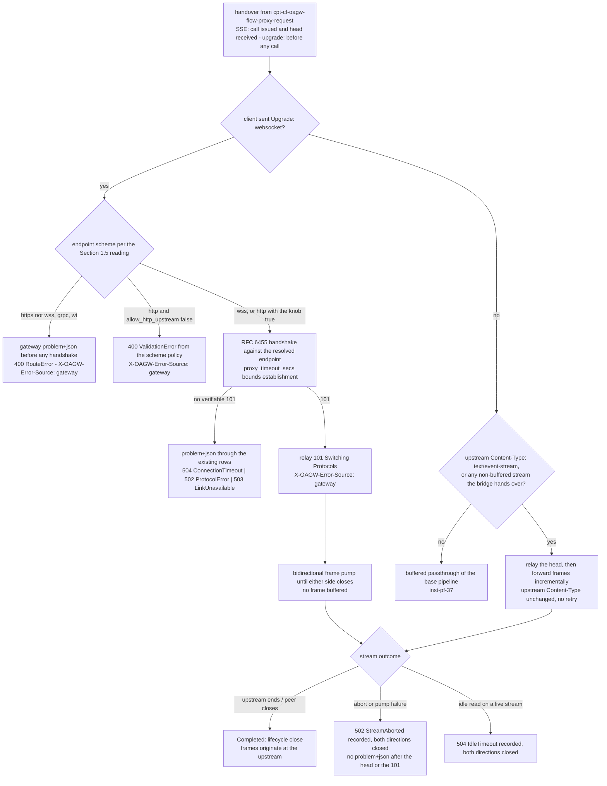

# Feature: Streaming Proxy

<!-- toc -->

- [1. Feature Context](#1-feature-context)
  - [1.1 Overview](#11-overview)
  - [1.2 Purpose](#12-purpose)
  - [1.3 Actors](#13-actors)
  - [1.4 References](#14-references)
  - [1.5 Feature-Local Deviations](#15-feature-local-deviations)
- [2. Actor Flows (CDSL)](#2-actor-flows-cdsl)
  - [SSE Passthrough](#sse-passthrough)
  - [WebSocket Upgrade Proxying](#websocket-upgrade-proxying)
- [3. Processes / Business Logic (CDSL)](#3-processes--business-logic-cdsl)
  - [Upgrade Header Carve-Out](#upgrade-header-carve-out)
  - [Stream Failure Classification](#stream-failure-classification)
- [4. States (CDSL)](#4-states-cdsl)
  - [Stream Session State Machine](#stream-session-state-machine)
- [5. Definitions of Done](#5-definitions-of-done)
  - [SSE Passthrough](#sse-passthrough-1)
  - [WebSocket Upgrade Proxying](#websocket-upgrade-proxying-1)
  - [Stream Timeout Semantics and Failure Classification](#stream-timeout-semantics-and-failure-classification)
- [6. Acceptance Criteria](#6-acceptance-criteria)

<!-- /toc -->

- [x] `p1` - **ID**: `cpt-cf-oagw-featstatus-streaming-proxy-implemented`

<!-- reference to DECOMPOSITION entry -->
`p2` - `cpt-cf-oagw-feature-streaming-proxy`

DECOMPOSITION entry 2.9 "Streaming Proxy (SSE and WebSocket)" orders this feature and the text of that entry is the authority for this document's scope: the Purpose, Scope and Out-of-scope bullets below are that entry's and are implemented without widening or narrowing them, and feature progress for this document is owned by the `featstatus` line above.

## 1. Feature Context

### 1.1 Overview

This feature is the streaming half of the proxy endpoint `GET /oagw/v1/proxy/{alias}/{path}`: it passes streamed responses through without buffering them and it proxies WebSocket upgrades, and every response it produces carries `X-OAGW-Error-Source`. It extends the base pipeline of `cpt-cf-oagw-feature-proxy-pipeline` — the direct dependency DECOMPOSITION entry 2.9 declares — at exactly two points of that pipeline's flow — the response passthrough, where an upstream `text/event-stream` body (or any non-buffered stream the `DataPlaneServiceImpl` bridge hands over) is forwarded to the caller frame by frame with the upstream `Content-Type` passed through unchanged, and the outbound boundary, where a client `Upgrade: websocket` is established against the resolved endpoint through an RFC 6455 handshake and then pumped bidirectionally until either side closes — plus the one header-processing exception it owns inside that pipeline's strip list, recorded in §1.5. An aborted stream is 502 `StreamAborted` and an idle read on a live stream is 504 `IdleTimeout`, both being closed-table rows of `cpt-cf-oagw-algo-error-mapping` that this feature consumes and never adds to.

The feature drives nothing that the base pipeline does not hand it. The stages of `cpt-cf-oagw-flow-proxy-request` run for a streamed request exactly as for any other — request classification, the two halves of the config-resolution stage, route matching, endpoint selection, the actual-request CORS check, header processing, body and header validation, the plugin chain with the rate-limit check at its ADR 0006 position, and the scheme and SSRF policy — and no stage is skipped because the request happens to carry an `Upgrade` header. What this feature owns outright is the detection of a stream on the upstream response, the frame-by-frame forwarding, the client upgrade to upstream upgrade handshake, the bidirectional frame pump, the `Upgrade`/`Connection`/`Sec-WebSocket-*` carve-out into the hop-by-hop strip list that `inst-pf-20` references without implementing, the stream-abort mapping and the idle-read timeout of a live stream. No streamed failure is ever retried, no frame is ever buffered, and no row is added to the closed 22-row table.

The diagram below is the streaming decision this feature makes, from the handover the base pipeline performs once its outbound call has been issued and its response head received, to the outcome the caller observes. It is the only diagram in this document: the forwarding and pump arithmetic lives in the step lists of the two flows of §2, the failure mapping in the step list of `cpt-cf-oagw-algo-stream-failure-classification`, the carve-out in the step list of `cpt-cf-oagw-algo-upgrade-header-carve-out`, and the stream lifecycle in the state machine of §4, and a second diagram would only duplicate what those step lists already encode. The two branches enter it at different points: the SSE branch arrives after the base pipeline's outbound call has been issued and its response head received, while the upgrade branch arrives at the outbound boundary before any call is issued, the establishment being `inst-ws-09`'s through the `DataPlaneServiceImpl` bridge — the node labelled as the SSE handover is the only one that carries the received head.

### 1.2 Purpose

This feature bridges DECOMPOSITION entry 2.9 "Streaming Proxy (SSE and WebSocket)" into an implementation contract. It exists so that the gear has exactly one place where a response is streamed and exactly one place where an upgrade is established: `cpt-cf-oagw-feature-proxy-pipeline` owns the base pipeline, the streaming transport and the strip list whose carve-out this feature owns, and this feature extends that pipeline for the two streamed cases the entry names. Everything before the streaming stage is the base pipeline's and is driven by it; everything from the detection of a stream onwards is this feature's, rendered through the same error rows at the same branch the base pipeline maps its own transport failures onto.

**Requirements**:

- [x] `p1` - `cpt-cf-oagw-fr-streaming` — the SSE streaming with proper connection lifecycle handling (open, close, error) and the WebSocket session flow that requirement names are `cpt-cf-oagw-flow-sse-passthrough` and `cpt-cf-oagw-flow-websocket-upgrade`; the WebTransport session flow of the same sentence is the residual DECOMPOSITION correction 7 records and is answered rather than proxied, per §1.5.
- [x] `p1` - `cpt-cf-oagw-fr-request-proxy` — the proxy endpoint and the forward that requirement enumerates are the stages of `cpt-cf-oagw-flow-proxy-request`, and this feature supplies the streamed behaviour of that forward; the no-automatic-full-retry rule with its connector-level exception is carried unchanged into the streamed path, where a partial response makes a retry impossible as well as forbidden.
- [x] `p2` - `cpt-cf-oagw-nfr-observability` — the Prometheus metrics and structured logging that requirement names are contributed to by this feature as the streamed-request lifecycle events the pipeline's instruments count; the emission, the label cardinality rules and the exposure belong to `cpt-cf-oagw-feature-observability`, per the §1.5 conformance entry.

**Principles**: `p1` - `cpt-cf-oagw-principle-no-retry` (no failed stream is ever retried, re-issued or re-connected by the gateway, a partial streamed response having nothing to retry from), `p1` - `cpt-cf-oagw-principle-error-source` (every response this feature produces carries the header, the 101 included, and the streamed body carries `upstream` because that is where its bytes originate).

**Constraints**: `p1` - `cpt-cf-oagw-constraint-body-limit` — the 100 MB hard limit is the buffered request body the base pipeline validates before dispatch and is enforced there; it never applies to a streamed response byte or to a WebSocket frame, neither of which this feature buffers, per the boundary recorded in §1.5.

**Components**: `p1` - `cpt-cf-oagw-interface-api` — the Proxy API subsection is the component contract whose proxy endpoint this feature gives its SSE and WebSocket behaviour to, at the base path of §1.5.

**Sequences**: `p1` - `cpt-cf-oagw-seq-proxy-flow` — the streaming stages of that sequence, owned stage-wise per DECOMPOSITION: this feature owns the streaming stages and drives nothing else in the sequence, the base pipeline owning orchestration and the endpoint-selection stages, and the config-resolution, rate-limit and plugin stages belonging to the features that own them.

**API**: `GET /oagw/v1/proxy/{alias}/{path}` (SSE) and `GET /oagw/v1/proxy/{alias}/{path}` (WebSocket upgrade) — the two API rows DECOMPOSITION entry 2.9 declares, both being the same proxy shell registered by `cpt-cf-oagw-feature-gear-wiring` and owned by `cpt-cf-oagw-feature-proxy-pipeline`, this feature owning their streaming behaviour and registering no route of its own; the `/api/oagw/v1/proxy/...` form is the operator-gateway-prefixed alias per §1.5. `X-OAGW-Target-Host` is consumed for routing by the base pipeline and never reaches an upstream, an upgrade request included.

**Data**: None — the feature persists nothing, creates no table and adds no schema object: it reads the `Upstream`, `Endpoint` and `ProxyContext` values the base pipeline holds, and the only state it owns is the per-stream session of §4, which is in-memory, lives for one streamed request and is never persisted.

### 1.3 Actors

| Actor | Role in Feature |
|-------|-----------------|
| `cpt-cf-oagw-actor-app-developer` | Initiates every streamed request on the proxy shell and is the recipient of every outcome this feature produces: the SSE frames as the upstream produces them, the 101 and the frames pumped after it, or one of the problem+json rejections of §1.5. Never calls a streaming stage directly and never observes a buffered stream, a retried attempt or a re-issued request. |
| `cpt-cf-oagw-actor-tenant-admin` | Configures the upstreams and routes whose endpoints, match rules, CORS blocks and `upstream.headers` blocks the streamed path executes, and owns correcting a configuration whose streamed routing outcome is not the one intended. Sees a scheme that cannot carry the requested stream as a proxy rejection, not as a management error. |
| `cpt-cf-oagw-actor-platform-operator` | Owns the `OagwConfig` keys the streamed path reads — `proxy_timeout_secs` governing both the establishment and the idle-read interval, `allow_http_upstream` deciding whether an `http` endpoint may carry an upgrade or a plaintext stream, `ssrf_policy.enabled` and the body limit — and the knob that lifts the HTTPS-only posture. |
| `cpt-cf-oagw-actor-upstream-service` | Produces the streamed body and is the far side of the frame pump. Its `text/event-stream` body is forwarded frame by frame; its upgrade acceptance is verified and relayed; its unreachability, its timeouts, its unverifiable handshake answer and its mid-stream aborts are gateway-classified and mapped onto the closed table. |

Every step of both flows of §2 is performed by this feature on behalf of `cpt-cf-oagw-actor-app-developer`, with `cpt-cf-oagw-flow-proxy-request` as the caller of every one of them: no actor invokes `cpt-cf-oagw-algo-stream-failure-classification`, `cpt-cf-oagw-algo-upgrade-header-carve-out` or the state machine of §4 directly, and no actor reaches a streaming stage except through the base pipeline, which is also the caller that hands the streamed case over and receives the outcome back.

### 1.4 References

- **PRD**: [PRD.md](../PRD.md) — `cpt-cf-oagw-fr-streaming` (HTTP request/response proxying and SSE streaming with proper connection lifecycle handling (open/close/error); WebSocket and WebTransport session flows, the WebTransport half being the correction-7 residual §1.5 records), `cpt-cf-oagw-fr-request-proxy` (the proxy endpoint, its stage list and the no-automatic-full-retry rule with the connector-level endpoint failover exception), `cpt-cf-oagw-nfr-observability` (Prometheus metrics and structured logging), `cpt-cf-oagw-interface-proxy-api` (the proxy endpoint contract whose streaming behaviour this feature supplies), the use case `cpt-cf-oagw-usecase-proxy-request` whose main-flow forward step carries the streamed cases and whose "Upstream timeout" alternative flow is the 504 family this feature renders, and the actors `cpt-cf-oagw-actor-app-developer`, `cpt-cf-oagw-actor-tenant-admin`, `cpt-cf-oagw-actor-platform-operator`, `cpt-cf-oagw-actor-upstream-service`
- **Design**: [DESIGN.md](../DESIGN.md) — `cpt-cf-oagw-interface-api` (the Proxy API subsection, the error response format table whose `StreamAborted` and `IdleTimeout` rows this feature consumes, and the error source distinction block), the "Headers Transformation" subsection (the three header categories and the strip table whose `Upgrade | Stripped` row this feature carves out for upgrade requests only), the HTTP/2 `:authority` pseudo-header rule, the HTTP version negotiation with its 1 hour capability TTL (an upgrade and an SSE stream both ride the negotiated version the base pipeline caches), the §4.4 Security Considerations block (SSRF posture and the HTTP request-smuggling defences the upgrade request passes through), `cpt-cf-oagw-seq-proxy-flow` (the sequence whose streaming stages this feature owns), the traceability row that maps `cpt-cf-oagw-fr-streaming` onto `cpt-cf-oagw-interface-api`, `cpt-cf-oagw-principle-no-retry`, `cpt-cf-oagw-principle-error-source`, `cpt-cf-oagw-constraint-body-limit`, and the metrics block (`oagw_requests_total`, `oagw_request_duration_seconds{host, http.route, phase}`, `oagw_errors_total{host, http.route, error_type}`) whose streamed cases this feature feeds
- **Decomposition**: [DECOMPOSITION.md](../DECOMPOSITION.md) — entry 2.9 "Streaming Proxy (SSE and WebSocket)" and the "Spec corrections applied" block (corrections 1, 2, 3, 4, 5 and 7 apply to this feature, as does the "Phase numbering precedence" paragraph), and the feature graph of §3 whose edge `proxy-pipeline → streaming-proxy` makes this feature a leaf
- **ADR**: [ADR/0007-error-source-distinction.md](../ADR/0007-error-source-distinction.md) (`cpt-cf-oagw-adr-error-source-distinction`) — the header contract this feature applies to a streamed success body, to the relayed 101 and to a post-upgrade failure; [ADR/0001-request-routing.md](../ADR/0001-request-routing.md) (`cpt-cf-oagw-adr-request-routing`) — the request classification and the `X-OAGW-Target-Host` Behavior Matrix an upgrade request passes through like any other; [ADR/0006-state-management.md](../ADR/0006-state-management.md) (`cpt-cf-oagw-adr-state-management`) — the data-plane request flow position that puts the rate-limit check before the guard and transform plugins on the upgrade path too; [ADR/0002-plugin-system.md](../ADR/0002-plugin-system.md) (`cpt-cf-oagw-adr-plugin-system`) — the Auth → Guards → Transform order the upgrade request drives before the handshake
- **Dependencies**:
  - [ ] `p2` - `cpt-cf-oagw-feature-proxy-pipeline` — the direct dependency DECOMPOSITION entry 2.9 declares in its "Depends On" line (the edge `proxy-pipeline → streaming-proxy` in the feature graph): this feature extends that pipeline's outbound call and response mapping with the SSE and WebSocket behaviours and inherits its stage order, its selection contract and its error-source contract; this feature may not re-order the pipeline stages, re-match a route, re-select an endpoint or add a row to the closed mapping table, and it performs no stage of `cpt-cf-oagw-seq-proxy-flow` other than the streaming ones.
  - Reached transitively through that edge rather than declared directly: `cpt-cf-oagw-feature-gear-wiring` (the registered proxy shell this feature's two API rows ride on, the `OagwConfig` keys and defaults `cpt-cf-oagw-algo-config-load` fixes, the problem+json error contract `cpt-cf-oagw-flow-error-response` and the closed 22-row mapping table `cpt-cf-oagw-algo-error-mapping`), `cpt-cf-oagw-feature-domain-model` (the `Upstream` and `Endpoint` value objects whose persist-time validation `cpt-cf-oagw-algo-shape-validation` and `cpt-cf-oagw-algo-endpoint-validation` perform, this feature consuming the accepted scheme enum without re-validating it), `cpt-cf-oagw-feature-hierarchical-config` (the `EffectiveConfig` value and the `cpt-cf-oagw-flow-effective-resolution`/`cpt-cf-oagw-flow-effective-merge` halves and the `cpt-cf-oagw-algo-tenant-chain-walk` dispositions the base pipeline consumes before this feature is entered), `cpt-cf-oagw-feature-management-api` (the CRUD surface that writes the upstreams and routes whose endpoints the streamed path dials), `cpt-cf-oagw-feature-alias-resolution` (the normalized alias `cpt-cf-oagw-algo-alias-normalization` produces and this feature never re-normalises), `cpt-cf-oagw-feature-rate-limiting` (the `cpt-cf-oagw-flow-rate-limit-check` the base pipeline invokes before the outbound call, a streamed response being no more exempt from it than any other) and `cpt-cf-oagw-feature-plugin-chain` (the `cpt-cf-oagw-flow-execution-plan`, `cpt-cf-oagw-flow-auth-phase` and `cpt-cf-oagw-flow-guard-transform-phase` phases the base pipeline drives before the upgrade is attempted, the transform tier's `on_error` phase included).
- **Reverse dependents**: none — this feature is a leaf of the DECOMPOSITION feature graph: entry 2.9 is the last entry the graph reaches and no entry declares this feature in its "Depends On" line, the only other edge leaving `cpt-cf-oagw-feature-proxy-pipeline` being the one to `cpt-cf-oagw-feature-observability`, which is a sibling leaf and not a dependent of this one. No feature of the graph may re-detect a stream, re-perform the upgrade handshake, re-pump a frame, re-apply the `Upgrade`/`Connection`/`Sec-WebSocket-*` carve-out or add a row to the closed mapping table.
- **API and data declarations**: API: `GET /oagw/v1/proxy/{alias}/{path}` (SSE) and `GET /oagw/v1/proxy/{alias}/{path}` (WebSocket upgrade) and Data: None, as the DECOMPOSITION entry records them and as §1.2 and the Touches lines of §5 carry.

### 1.5 Feature-Local Deviations

Deviations from the supplied spec/platform baseline, recorded per the shared-baseline policy.

**Conformance (not a deviation)** — the ownership split this feature sits at the end of: this feature owns the detection of an upstream `text/event-stream` (or any non-buffered stream) and its frame-by-frame forwarding, the client upgrade to upstream upgrade handshake and the bidirectional frame pump, the stream-abort 502 `StreamAborted` mapping, the idle-read timeout of a live stream and the `Upgrade`/`Connection`/`Sec-WebSocket-*` carve-out into the strip list; `cpt-cf-oagw-feature-proxy-pipeline` owns the base pipeline, the streaming transport of the `DataPlaneServiceImpl` bridge, the stage order, the matching and selection contracts, the strip list itself and the per-request error mapping. This feature inherits that pipeline's stage order, its selection contract and its error-source contract, extends its outbound call and its response mapping, and references `cpt-cf-oagw-flow-proxy-request`, `cpt-cf-oagw-algo-endpoint-selection` and `cpt-cf-oagw-state-proxy-context` instead of restating any of them.
**Rationale** — DECOMPOSITION entry 2.9 declares the edge `proxy-pipeline → streaming-proxy` and scopes the SSE and WebSocket behaviours out of entry 2.8, and the streaming-boundary entry of the proxy-pipeline feature's own §1.5 delegates exactly these behaviours to this feature while keeping the streaming transport there; recording the split keeps two features from implementing one carve-out or two features from detecting one stream.
**Review owner**: `cf-generate-author-senior via cf-write-docs review loop`

**Conformance (not a deviation)** — no stage of the pipeline is skipped or re-ordered for a streamed request: an upgrade request is classified, resolved, matched, selected, CORS-checked, header-processed, validated, plugin-driven and rate-limited exactly as any other request, and only then handed to the streaming stage, so an unauthenticated, unratelimited, CORS-rejected or validation-failing upgrade is answered before any handshake is attempted and never reaches an upstream. The one difference the streamed path makes is the carve-out, which is the header-processing stage's own exception and not a new stage, a new ordering or a bypass of `inst-pf-21`'s validation.
**Rationale** — the stage list of `cpt-cf-oagw-flow-proxy-request` and the ordering rule of `cpt-cf-oagw-adr-plugin-system` name no streamed exception, and the reverse-dependents bullet of the proxy-pipeline feature's §1.4 states that this feature inherits the stage order; recording the sentence keeps an upgrade from being read as a separate fast path.
**Review owner**: `cf-generate-author-senior via cf-write-docs review loop`

**Conformance (not a deviation)** — the failure-class split with the base pipeline's own failure branch: the transport-failure branch of `cpt-cf-oagw-flow-proxy-request` at `inst-pf-33`/`inst-pf-34` already names `StreamAborted` and `IdleTimeout` among the failures it maps, and this feature does not open a second branch. The split is: that branch covers a non-streamed response that fails mid-passthrough, and this feature owns the streamed cases — an SSE abort, a WebSocket pump failure and an idle read on a live stream — mapped through the same rows at the same branch, recorded rather than delivered where the head or the 101 was already relayed, so the caller's mapping and this feature's mapping never disagree on a row, and `DownstreamError` remains the base branch's row, which this feature never produces for a streamed case.
**Rationale** — DECOMPOSITION entry 2.9 names both rows for the streamed cases while `cpt-cf-oagw-flow-proxy-request` already maps them for the non-streamed ones; recording which side owns which case keeps one row from being produced by two different mappings and keeps the row set closed.
**Review owner**: `cf-generate-author-senior via cf-write-docs review loop`

**Deviation** — the streaming base path this feature serves is `GET /oagw/v1/proxy/{alias}/{path}`, without the leading `/api` segment that `cpt-cf-oagw-interface-proxy-api` and the Proxy API subsection of `cpt-cf-oagw-interface-api` write. The `/api/oagw/v1/proxy/...` form is the operator-gateway-prefixed alias and is not the path this deployment serves, so the alias this feature streams against is the segment after `/oagw/v1/proxy/`, the `instance` field of a problem+json body carries the gear-relative path, and the same base decision is already recorded by `cpt-cf-oagw-feature-gear-wiring`, `cpt-cf-oagw-feature-management-api`, `cpt-cf-oagw-feature-hierarchical-config`, `cpt-cf-oagw-feature-alias-resolution` and `cpt-cf-oagw-feature-proxy-pipeline` for the surfaces they own.
**Rationale** — DECOMPOSITION correction 1: all oagw routes are registered gear-relative at `/oagw/v1/...`, the prefixed form being the absolute path behind an operator-facing gateway.
**Review owner**: `cf-generate-author-senior via cf-write-docs review loop`

**Conformance (not a deviation)** — the detection side and the passthrough of an SSE stream: the stream is detected on the upstream response — a `Content-Type` of `text/event-stream`, or any non-buffered stream the `DataPlaneServiceImpl` bridge hands over, meaning a response head whose body arrives as an unbounded stream rather than as a body the passthrough can write at once — and never on the client request, an `Accept: text/event-stream` request header alone never making a response a stream. The upstream `Content-Type` is passed through unchanged and never rewritten to a canonical form, the body is forwarded incrementally with no frame buffered and no re-framing or re-encoding of an event, and the connection lifecycle `cpt-cf-oagw-fr-streaming` requires is observable as open (the upstream head relayed), close (the upstream ends the body and the stream completes) and error (a failure classified, never retried).
**Rationale** — DECOMPOSITION entry 2.9 scopes the detection and the incremental forwarding to this feature and names the abort mapping, while the passthrough rule of `cpt-cf-oagw-flow-proxy-request` at `inst-pf-37` already forbids re-serialising an upstream body; recording that detection is upstream-side keeps a request header from becoming a routing signal no upstream document makes it.
**Review owner**: `cf-generate-author-senior via cf-write-docs review loop`

**Deviation** — which endpoint scheme can carry a WebSocket upgrade: an upgrade is proxied to endpoints whose scheme is `wss` unconditionally and to endpoints whose scheme is `http` only when `allow_http_upstream` is `true`, the enum having no plain `ws` value, so the plaintext question is the same knob's that DECOMPOSITION correction 2 assigns the runtime decision to. An endpoint whose scheme is `https` but not `wss`, a `grpc` endpoint and a `wt` endpoint answer the upgrade with the gateway `RouteError`/`ProtocolError` problem+json semantics before any handshake is attempted, `RouteError` being the row the scheme-policy resolution of the proxy-pipeline feature's §1.5 fixes for a non-proxied scheme, and an `http` endpoint with the knob `false` is refused with the 400 `ValidationError` that feature's `inst-pf-30` already renders. This scopes the base pipeline's scheme allowlist — which reads "allow `https` and `wss` unconditionally" for the proxy request as a whole — to the upgrade case recorded here, adding no row and no scheme value.
**Deviation note** — for a `grpc` endpoint, a `wt` endpoint and an `http` endpoint with `allow_http_upstream` `false`, the base pipeline's scheme policy at `inst-pf-30` has already refused the request and closed its `ProxyContext` before the streaming stage is entered, so no session of §4 ever opens for them and the reading recorded above governs on the wire only for the `https`-that-is-not-`wss` case, which reaches this feature because the base allowlist admits `https` unconditionally; the upgrade refusal this flow renders for that case is a feature-local use of the same existing `RouteError` row, additional to the two `inst-*` sites the proxy-pipeline feature's §1.5 names for the proxy path — no use of the row on that path, no row added and no row widened.
**Rationale** — DECOMPOSITION corrections 2 and 7 keep the enum question and the plaintext question apart and leave `wt` and gRPC unproxied, and a TLS HTTP endpoint that is not a WebSocket endpoint cannot complete an RFC 6455 handshake; recording the per-scheme reading keeps an accepted configuration value from being read as an upgrade guarantee and keeps the carve-out from being applied to a handshake that never happens.
**Review owner**: `cf-generate-author-senior via cf-write-docs review loop`

**Deviation** — the idle-read timeout is the same `proxy_timeout_secs` value applied as the maximum interval without a received byte or frame on an established stream, its expiry mapping onto 504 `IdleTimeout`: one knob governs both timings and no new configuration key is created, the `OagwConfig` key set being the gear-wiring feature's and closed. The consequence this feature records is that the base pipeline's request timeout — `proxy_timeout_secs` measured from the arrival instant `inst-pf-01` records and mapped onto 504 `RequestTimeout` — bounds the establishment of a stream, the handshake and the 101 included, but does not bound the total duration of a live stream, which may outlive the value by as long as it keeps producing bytes or frames within the interval.
**Rationale** — DECOMPOSITION entry 2.9 states the two timings and names `proxy_timeout_secs` for the first, but no upstream document supplies an idle value and none may be invented here, since `cpt-cf-oagw-algo-config-load` owns the closed key set; reusing the one configured value keeps the timeout semantics of the entry implementable without a schema change, and recording that the request timeout stops at the streamed head keeps the two readings from contradicting each other on the wire.
**Review owner**: `cf-generate-author-senior via cf-write-docs review loop`

**Conformance (not a deviation)** — the error-source values and the post-upgrade failure surface: a streamed success body carries `X-OAGW-Error-Source: upstream` on the relayed head, its bytes originating at `cpt-cf-oagw-actor-upstream-service`; the relayed `101 Switching Protocols` carries `X-OAGW-Error-Source: gateway`, because the status and headers the client sees on that response are OAGW-generated even though the upgrade decision was the upstream's; and every gateway-produced failure before the upgrade completes is `application/problem+json` rendered through the closed rows with `gateway`. After the upgrade has begun — a pump failure, an aborted stream or an idle read on a session — the failure is not re-serialised into problem+json: nothing can be written onto a connection whose head or 101 was already relayed, so the connection is closed, the client observing the stream or session ending, and the classification is recorded through `cpt-cf-oagw-algo-stream-failure-classification` (502 `StreamAborted` for the abort case, 504 `IdleTimeout` for the idle one) rather than delivered as a body that cannot be sent. A failure classified before the streamed head or the 101 was relayed is rendered as problem+json by `cpt-cf-oagw-flow-error-response`, which is the only case a streaming failure produces a body.
**Rationale** — ADR 0007 requires the header on every response and names a value only for the two error classes, the sibling resolution pattern already reads the success value off the body's origin, and an HTTP response head cannot be rewritten once bytes have been forwarded; recording the boundary keeps a partial stream from being answered with a second status line.
**Review owner**: `cf-generate-author-senior via cf-write-docs review loop`

**Conformance (not a deviation)** — the scope of the carve-out this feature owns into the base pipeline's strip list: it covers exactly the three header families the DECOMPOSITION entry names — `Upgrade`, `Connection` and the `Sec-WebSocket-*` family — and nothing else in the strip list, it applies to WebSocket upgrade requests only and to the request direction only, and it is implemented only here, `inst-pf-20` referencing it without implementing it. On a non-upgrade request the strip list is unconditional and this carve-out does not exist as a rule: `Upgrade` and `Connection` are stripped from an SSE request and from every other proxied request exactly as `inst-pf-20` strips them, `Sec-WebSocket-*` never being a strip-list member to exempt. The carve-out is applied exactly once per request — by the header-processing stage at `inst-pf-20` when the request carries `Upgrade: websocket` — and the step `inst-ws-03` records and confirms that applied exemption rather than applying it a second time, so no `Sec-WebSocket-*` header is stripped before the handshake of `inst-ws-09` needs it.
**Rationale** — DECOMPOSITION entry 2.9 declares the carve-out as this feature's and scopes it to upgrade requests, and the streaming-boundary entry of the proxy-pipeline feature's §1.5 states the same scope from the strip-list side; recording the scope keeps a general upgrade exemption from being implemented once and read as two.
**Review owner**: `cf-generate-author-senior via cf-write-docs review loop`

**Conformance (not a deviation)** — the body-limit boundary: the 100 MB hard limit of `cpt-cf-oagw-constraint-body-limit` applies to the buffered request body the base pipeline validates before dispatch and is enforced there, at `inst-pf-21`, before any streaming decision exists. It does not apply to a streamed response byte, to an SSE frame or to a WebSocket frame, none of which this feature buffers or accumulates, so no streamed byte is ever counted against the limit and no streamed body is ever rejected for its size. The constraint is neither widened onto the response nor silently dropped on the request it governs.
**Rationale** — DECOMPOSITION entry 2.9 lists the constraint as covered by this feature, and the only way to cover it without widening it is to state where it stops; the validation rule of the base pipeline already names "reject before buffering" as the limit's own mechanism, which is what keeps it a request-side rule.
**Review owner**: `cf-generate-author-senior via cf-write-docs review loop`

**Conformance (not a deviation)** — the observability split: metric and audit emission belongs to `cpt-cf-oagw-feature-observability`, the DECOMPOSITION entry 2.10 that sits downstream of the same proxy-pipeline edge, and exposure is the platform telemetry stack per DECOMPOSITION correction 5, `oagw` mounting no `/metrics` route of its own. What this feature contributes is the streamed-request lifecycle events the pipeline's instruments count: the streamed response counted in `oagw_requests_total` and `oagw_request_duration_seconds` like any other passthrough, an aborted stream in `oagw_errors_total` with the mapped `error_type` `StreamAborted`, and an idle or establishment failure with the `error_type` its row names. This feature emits no instrument, no audit record and no log line itself.
**Rationale** — DECOMPOSITION assigns emission to entry 2.10 and correction 5 assigns exposure to the platform, and naming what this feature feeds without owning the emission keeps a second emission path from appearing beside the observability feature's.
**Review owner**: `cf-generate-author-senior via cf-write-docs review loop`

**Out of scope** — WebTransport, which `cpt-cf-oagw-fr-streaming` names and DECOMPOSITION correction 7 catalogues as valid configuration that is never proxied in this release, a request routed to a `wt` endpoint being answered with the gateway `RouteError`/`ProtocolError` semantics rather than proxied; gRPC streaming, which has no code path this release and whose phasing the PRD's Phase 4 governs per the "Phase numbering precedence" paragraph; the base pipeline and every stage of it before the streaming stage, owned by `cpt-cf-oagw-feature-proxy-pipeline`; the streaming transport of the `DataPlaneServiceImpl` bridge, owned by the same feature per its §1.5; the registration of the proxy shell and the ownership of the closed 22-row table and of the `OagwConfig` keys, owned by `cpt-cf-oagw-feature-gear-wiring`; the persist-time validation of the scheme enum and of the endpoint pool, owned by `cpt-cf-oagw-feature-domain-model`; the execution plan and the auth, guard and transform phases, owned by `cpt-cf-oagw-feature-plugin-chain`; the rate-limit check and its counter key, owned by `cpt-cf-oagw-feature-rate-limiting`; the computation of `EffectiveConfig`, owned by `cpt-cf-oagw-feature-hierarchical-config`; metric, audit and log emission for the streamed stages, owned by `cpt-cf-oagw-feature-observability`; HTTP/3 (QUIC), which DESIGN §4.5 lists as future work; and any SQL table, schema object or persistence path, per DECOMPOSITION correction 3.
**Rationale** — DECOMPOSITION entry 2.9 lists WebTransport and gRPC streaming in its out-of-scope bullets, the stage-wise ownership rule and entries 2.1, 2.2, 2.5, 2.6, 2.7, 2.8 and 2.10 place the rest with the features that own them, and the remaining dispositions follow from the corrections recorded above; none of them is implemented by this feature and none of them is re-declared by it.
**Review owner**: `cf-generate-author-senior via cf-write-docs review loop`

**Not applicable because** — the remaining checklist areas have no build object in this feature, and where a posture is declared below it is stated rather than built:

- **Data model and persistence** — the feature creates no table, no schema object and no repository trait: the only state it owns is the per-stream session of §4, which is in-memory, lives for one streamed request, is never persisted and is lost with the connection that carried it. `cpt-cf-oagw-db-schema` is honoured as the schema contract by the stores behind the configuration the base pipeline resolves, and no streamed decision reads or writes any of it.
- **Reliability and failure behaviour** — every failure of the streamed path degrades to one row of the closed mapping table and to nothing else: 502 for an abort or a protocol failure, 504 for an idle, connection or request timeout, 503 for an unavailable link, 400 for a refused scheme or validation failure. There is no panic path, no second attempt, no re-issue and no reconnect by the gateway, and a failure after the head or the 101 was relayed ends the connection rather than producing a body.
- **Security** — credential isolation holds unchanged on the streamed path: this feature never resolves a `cred://` reference, never sees secret material and never logs a header, a body or a frame; the SSRF posture and the smuggling defences are applied to a streamed request by the base pipeline's validation and scheme policy exactly as to any other, the carve-out being the only header difference; and the injection classes have nothing to inject into, because no SQL is executed (the stores are in-memory per DECOMPOSITION correction 3), no HTML is rendered (every gateway body is `application/problem+json`, every SSE body is forwarded untouched and no frame is parsed as markup) and no shell is invoked. An application frame's content is never interpreted, so no frame can steer routing, headers or the outbound target.
- **Correlation and trace propagation** — the feature owns no correlation identifier: the correlation and trace context a streamed request is logged under is the platform trace context the request arrives with, its propagation and its logging being the platform's and `cpt-cf-oagw-feature-observability`'s concern, and this feature adds no correlation header of its own to the outbound request or to the 101.
- **Configuration surface** — the feature owns no `OagwConfig` key: `proxy_timeout_secs`, `allow_http_upstream`, `ssrf_policy.enabled` and the body limit are owned by `cpt-cf-oagw-feature-gear-wiring` and defaulted by `cpt-cf-oagw-algo-config-load`, and this feature reads the one timeout value for both of its timings rather than adding a key, per the §1.5 resolution above.
- **Internationalisation and accessibility** — the feature exposes no user interface and no actor-facing text of its own; the only wording a caller sees arrives inside a problem+json `detail` field rendered by the error contract of the gear-wiring feature, or in the upstream's own SSE and WebSocket bytes, which are forwarded untouched.
- **Regulatory compliance** — no data subject to a compliance regime is stored by the feature: it holds no record beyond the per-stream session, writes nothing outside the process, forwards bodies and frames without inspecting them, and any audit record covering a streamed request carries identifiers, statuses and durations rather than bodies, headers or frame content.
- **Rollout and rollback** — the feature has no deployable unit, no migration and no feature flag of its own: it is the streaming behaviour behind the proxy shell the gear skeleton registers at startup, and removing the configuration a streamed request resolves against removes the traffic rather than the code path.
- **Performance** — the `<10ms` p95 added-latency budget excluding the upstream response time is owned by `cpt-cf-oagw-feature-proxy-pipeline` per DECOMPOSITION entry 2.8, and this feature contributes to it by never buffering: a frame is written as it arrives, so no streaming decision adds a queuing stage, and no upstream document sets a latency budget for a stream's own duration, which is the upstream's pacing.
- **Usability** — the observable surface is the streamed response itself: a caller reads the upstream's `Content-Type` and its frames as they are produced, or the 101 and the frames of a session, or a problem+json document whose `type`, `detail` and `X-OAGW-Error-Source` let it distinguish a gateway rejection from an upstream failure without probing, which is the whole point of `cpt-cf-oagw-principle-error-source`.
- **Test targets** — the unit-testable boundaries are `cpt-cf-oagw-algo-stream-failure-classification` and `cpt-cf-oagw-algo-upgrade-header-carve-out`, neither of which performs I/O; the detection, the forwarding, the handshake and the pump are integration-testable against a stub upstream that speaks `text/event-stream` and RFC 6455 on the proxy endpoint; and the idle-read timeout is checkable only against a stub whose sending is controllable, which is why it is stated as an interval rather than as a wall-clock assertion.

## 2. Actor Flows (CDSL)

Interactions that start with an actor and describe the end-to-end flow. Both flows of this document are entered from `cpt-cf-oagw-flow-proxy-request` at its streaming stage and never directly: the base pipeline is the caller of every step of both, hands over the request, the selected `Endpoint` and the response stream, and receives the outcome back. Neither flow re-runs a stage of the pipeline, re-matches a route, re-selects an endpoint or renders an error body of its own.

**Use cases**: `p1` - `cpt-cf-oagw-usecase-proxy-request` — its main-flow "forward and return" step is where the streamed cases of this feature live, its "Upstream timeout" alternative flow is the 504 family this feature renders for the streamed timings, and its "Upstream not found", "Upstream disabled", "Rate limit exceeded" and "Auth plugin fails" alternative flows are reached before this feature is entered, the base pipeline rendering them.

### SSE Passthrough

- [x] `p1` - **ID**: `cpt-cf-oagw-flow-sse-passthrough`

**Actor**: `cpt-cf-oagw-actor-app-developer`

**Success Scenarios**:

- An upstream response whose `Content-Type` is `text/event-stream`, or any non-buffered stream the `DataPlaneServiceImpl` bridge hands over, is forwarded to the caller frame by frame as the upstream produces frames, with the upstream `Content-Type` passed through unchanged, no frame buffered and no retry of any kind.
- The connection lifecycle `cpt-cf-oagw-fr-streaming` requires is observable on the streamed response as open (the upstream head relayed), close (the upstream ends the body and the stream completes) and error (a failure classified and recorded, never retried).
- The relayed streamed head carries `X-OAGW-Error-Source: upstream`, and the streamed response is counted by the same instruments the base pipeline's buffered passthrough is counted by.

**Error Scenarios**:

- An upstream connection that dies before the upstream ended the body is classified 502 `StreamAborted` at the same branch the base pipeline maps transport failures, is never retried and never re-issued as a second client request.
- An idle read on a live stream — no byte received for `proxy_timeout_secs` — is classified 504 `IdleTimeout` and both connections are closed.
- A failure classified before the streamed head was forwarded is rendered as `application/problem+json` with `X-OAGW-Error-Source: gateway`; a failure classified after it can only end the stream, per §1.5.

**Steps**:

1. [x] - `p1` - Receive, from `cpt-cf-oagw-flow-proxy-request` at its streaming stage — the caller of this and every later step — the established outbound call's response head and body stream, together with the `ProxyContext` the pipeline opened at `inst-pf-01`, the selected `Endpoint` and the arrival instant the establishment timing is measured from; every stage of the pipeline before this one has already run and none is re-run here - `inst-sse-01`
2. [x] - `p1` - **IF** the upstream response head carries `Content-Type: text/event-stream`, or the bridge hands over a response whose body is a non-buffered stream rather than a body the passthrough can write at once — the stream being detected on the upstream response only, never on the client request, an `Accept: text/event-stream` request header alone never making a response a stream - `inst-sse-02`
   1. [x] - `p1` - Classify the response as a stream and continue in this flow, the detection being this feature's and the classification of the response never altering the upstream's status, its headers or its `Content-Type` value - `inst-sse-03`
3. [x] - `p1` - **ELSE** report "not a stream" to the caller and **RETURN**: the buffered passthrough of `cpt-cf-oagw-flow-proxy-request` at `inst-pf-37` handles the response as received and this flow is done - `inst-sse-04`
4. [x] - `p1` - Relay the upstream response head to the caller as received — the upstream `Content-Type` passed through unchanged and never rewritten, the `response.*` rules of the selected upstream's `upstream.headers` block applied by the caller per `inst-pf-37`, and `X-OAGW-Error-Source: upstream` added because the body originates at `cpt-cf-oagw-actor-upstream-service` — with no retry, no buffer and no re-issuance of the client request anywhere in the path, per `cpt-cf-oagw-principle-no-retry` - `inst-sse-05`
5. [x] - `p1` - **FOR EACH** body frame the bridge delivers, write it to the client connection as it arrives, without accumulating frames, without waiting for the stream to end, and without re-framing, re-chunking or re-encoding an SSE event - `inst-sse-06`
6. [x] - `p1` - Hold the idle-read clock over the established stream: **FOR EACH** interval between received bytes, compare it against `proxy_timeout_secs` — the same value the establishment is bounded by, applied here as the maximum interval without a received byte on an established stream per §1.5 - `inst-sse-07`
7. [x] - `p1` - **IF** an idle-read interval reached `proxy_timeout_secs` without a received byte - `inst-sse-08`
   1. [x] - `p1` - Classify the failure through `cpt-cf-oagw-algo-stream-failure-classification` — 504 `IdleTimeout` — close the upstream connection and the client connection, and record the classification for the instruments `cpt-cf-oagw-feature-observability` emits, no problem+json body being written onto a connection whose streamed head was already forwarded - `inst-sse-09`
   2. [x] - `p1` - Close the `ProxyContext` in `Failed` and **RETURN** the classification to `cpt-cf-oagw-flow-proxy-request` - `inst-sse-10`
8. [x] - `p1` - **ELSE IF** the upstream connection failed or was closed before the upstream ended the body - `inst-sse-11`
   1. [x] - `p1` - Classify the failure through the same algorithm — 502 `StreamAborted` — close both connections, and never re-issue the request, never retry the stream and never re-connect by the gateway's own decision, per `cpt-cf-oagw-principle-no-retry`; a failure classified before the streamed head was forwarded is rendered as `application/problem+json` by `cpt-cf-oagw-flow-error-response` of `cpt-cf-oagw-feature-gear-wiring` instead - `inst-sse-12`
   2. [x] - `p1` - Close the `ProxyContext` in `Failed` and **RETURN** the classification to `cpt-cf-oagw-flow-proxy-request` - `inst-sse-13`
9. [x] - `p1` - **ELSE** the upstream ended the body: complete the stream, flush any final bytes the bridge already delivered, and close the client connection in the direction the upstream closed, which is the close half of the lifecycle the requirement names - `inst-sse-14`
10. [x] - `p1` - Close the `ProxyContext` in `Responded` and **RETURN** the streamed outcome to `cpt-cf-oagw-flow-proxy-request`, the streamed response being counted by `oagw_requests_total` and `oagw_request_duration_seconds` like any other passthrough, its emission belonging to `cpt-cf-oagw-feature-observability` - `inst-sse-15`

### WebSocket Upgrade Proxying

- [x] `p1` - **ID**: `cpt-cf-oagw-flow-websocket-upgrade`

**Actor**: `cpt-cf-oagw-actor-app-developer`

**Success Scenarios**:

- A client request carrying `Upgrade: websocket` runs every stage of `cpt-cf-oagw-flow-proxy-request` exactly as any other request — no stage is skipped and none is re-ordered — and then the gateway establishes the upstream WebSocket against the resolved endpoint, verifies the upstream's `Sec-WebSocket-Accept` against the client's `Sec-WebSocket-Key`, and relays 101 Switching Protocols.
- After the 101 the gateway pumps frames bidirectionally until either side closes, propagating a Close frame received from one side to the other and buffering no frame.
- Every gateway-produced failure before the upgrade completes is `application/problem+json` rendered through the closed table with `X-OAGW-Error-Source: gateway`, and the relayed 101 itself carries `X-OAGW-Error-Source: gateway`.

**Error Scenarios**:

- An upgrade against an endpoint whose scheme cannot carry a WebSocket per the §1.5 reading — `https` that is not `wss`, `grpc`, or `wt` — is answered with the gateway `RouteError`/`ProtocolError` problem+json semantics before any handshake is attempted, and an upgrade against an `http` endpoint when `allow_http_upstream` is `false` is refused with the 400 `ValidationError` the scheme policy renders.
- A handshake that does not complete within `proxy_timeout_secs`, whose upstream answer is not a 101 or whose `Sec-WebSocket-Accept` does not verify, is answered with problem+json through the existing rows before anything was relayed to the client connection.
- A pump failure after the 101 is not re-serialised: both directions are closed, the client observes the session ending, and the failure is recorded as 502 `StreamAborted` or 504 `IdleTimeout`.

**Steps**:

1. [x] - `p1` - Receive, from `cpt-cf-oagw-flow-proxy-request` at its streaming stage — the caller of this and every later step — the request with its `Upgrade`, `Connection` and `Sec-WebSocket-*` headers as the header-processing stage left them, the selected `Endpoint`, the `EffectiveConfig` value and the `ProxyContext`, every stage of the pipeline from classification through the scheme and SSRF policy having already run for the upgrade request exactly as for any other - `inst-ws-01`
2. [x] - `p1` - **IF** the client request carries `Upgrade: websocket` — the upgrade being detected on the client request, which is the one detection this feature performs on the request side - `inst-ws-02`
   1. [x] - `p1` - Apply the carve-out through `cpt-cf-oagw-algo-upgrade-header-carve-out` so that `Upgrade`, `Connection` and the `Sec-WebSocket-*` family survive the hop-by-hop strip list of `inst-pf-20` and no other member of that list is exempted - `inst-ws-03`
3. [x] - `p1` - **ELSE** report "not an upgrade" to the caller and **RETURN**: the SSE flow of §2 or the buffered passthrough of `inst-pf-37` handles the response and this flow is done - `inst-ws-04`
4. [x] - `p1` - Read the endpoint scheme the endpoint selection returned and decide whether the endpoint can carry the upgrade - `inst-ws-05`
   1. [x] - `p1` - **IF** the scheme is `wss`, or it is `http` and `allow_http_upstream` is `true`, the endpoint is eligible and the handshake of `inst-ws-09` follows - `inst-ws-06`
   2. [x] - `p1` - **ELSE** answer the upgrade before any handshake: an endpoint whose scheme is `https` but not `wss`, a `grpc` endpoint and a `wt` endpoint are answered with 400 `RouteError` through the existing row with `X-OAGW-Error-Source: gateway`, and an `http` endpoint with `allow_http_upstream` `false` is refused with 400 `ValidationError` through the scheme policy of `inst-pf-30`, no row being added and no header being carved out for a request that is refused here - `inst-ws-07`
      1. [x] - `p1` - Close the `ProxyContext` in `Failed` and **RETURN** the rendered rejection to `cpt-cf-oagw-flow-proxy-request` - `inst-ws-08`
5. [x] - `p1` - Perform the RFC 6455 handshake against the resolved endpoint over the `DataPlaneServiceImpl` bridge: send the client's `Sec-WebSocket-Key` in the upstream upgrade request, require the upstream's `101 Switching Protocols` with a `Sec-WebSocket-Accept` derived from that key, and bound the whole establishment — connection and handshake — by `proxy_timeout_secs` - `inst-ws-09`
6. [x] - `p1` - **IF** the handshake failed — the upstream refused the upgrade, its answer was not a 101, its `Sec-WebSocket-Accept` did not verify against the key, the endpoint was unreachable, or `proxy_timeout_secs` elapsed - `inst-ws-10`
   1. [x] - `p1` - Render the failure through the existing rows of `cpt-cf-oagw-algo-error-mapping` with `X-OAGW-Error-Source: gateway` — 504 `ConnectionTimeout` for an elapsed establishment, 502 `ProtocolError` for an unverifiable accept or a non-101 answer, 503 `LinkUnavailable` for an unreachable or refused endpoint — through `cpt-cf-oagw-flow-error-response` of `cpt-cf-oagw-feature-gear-wiring`, adding no row, and relay nothing to the client connection - `inst-ws-11`
   2. [x] - `p1` - Close the `ProxyContext` in `Failed` and **RETURN** the rendered failure to `cpt-cf-oagw-flow-proxy-request` - `inst-ws-12`
7. [x] - `p1` - **ELSE** relay the upstream `101 Switching Protocols` to the client with the handshake headers the RFC 6455 exchange produced, the status and headers of that response being OAGW-generated on the client side and therefore carrying `X-OAGW-Error-Source: gateway` per §1.5 - `inst-ws-13`
8. [x] - `p1` - Pump frames bidirectionally: **FOR EACH** frame arriving from either direction, write it to the other side as it arrives, with no frame buffered, no frame re-encoded, and no interpretation of an application frame's content - `inst-ws-14`
9. [x] - `p1` - Propagate the close: **IF** either side sends a Close frame or closes its connection, relay the Close frame to the other side when one was received and close both directions, so the session ends where its peer ended it - `inst-ws-15`
10. [x] - `p1` - **IF** the pump failed on one direction — a read or write error on an established session, or an idle interval of `proxy_timeout_secs` without a received frame on either side - `inst-ws-16`
    1. [x] - `p1` - Close both directions without serialising a problem+json body onto the upgraded connection, the failure being one the client observes as the session ending, and classify it through `cpt-cf-oagw-algo-stream-failure-classification` — 502 `StreamAborted` for an aborted session, 504 `IdleTimeout` for an idle one — the mapping being recorded rather than delivered - `inst-ws-17`
    2. [x] - `p1` - Close the `ProxyContext` in `Failed` and **RETURN** the classification to `cpt-cf-oagw-flow-proxy-request` - `inst-ws-18`
11. [x] - `p1` - **ELSE** the session ended by a peer's close: close both directions, close the `ProxyContext` in `Responded` and **RETURN** the session outcome to `cpt-cf-oagw-flow-proxy-request`, the pumped frames having originated at `cpt-cf-oagw-actor-upstream-service` even though the 101 relayed at `inst-ws-13` carries the gateway source per §1.5, and no frame ever having been buffered - `inst-ws-19`

## 3. Processes / Business Logic (CDSL)

Internal building blocks called by the flows above and by the base pipeline: `cpt-cf-oagw-algo-upgrade-header-carve-out` is applied once per request, by the header-processing stage of `cpt-cf-oagw-flow-proxy-request` for a WebSocket upgrade request, and its applied exemption is what `cpt-cf-oagw-flow-websocket-upgrade` confirms at `inst-ws-03`, and `cpt-cf-oagw-algo-stream-failure-classification` is invoked by the failure branches of both flows of §2. Neither opens an HTTP route, neither performs an upstream call, and neither re-declares a strip list, a validation rule, an error mapping or a configuration key owned by another feature; the rows they map onto are the closed table's and are consumed without being re-defined.

### Upgrade Header Carve-Out

- [x] `p2` - **ID**: `cpt-cf-oagw-algo-upgrade-header-carve-out`

**Input**: the outbound header set the header-processing stage of `cpt-cf-oagw-flow-proxy-request` prepared at `inst-pf-20`, the request's `Upgrade` header value, and whether the request is a WebSocket upgrade.

**Output**: the outbound header set with the hop-by-hop strip list applied, with or without the three-family exemption.

**Steps**:

1. [x] - `p1` - Take the header set, the `Upgrade` header value and the upgrade flag as the inputs; the strip list itself — `Connection`, `Keep-Alive`, `Proxy-Authenticate`, `Proxy-Authorization`, `TE`, `Trailer`, `Transfer-Encoding`, `Upgrade` — is the base pipeline's at `inst-pf-20` and is not restated, re-owned or extended here - `inst-hc-01`
2. [x] - `p1` - **IF** the request is not a WebSocket upgrade - `inst-hc-02`
   1. [x] - `p1` - Apply the strip list unconditionally, exempting nothing, and **RETURN** the stripped header set: the carve-out is scoped to WebSocket upgrade requests only and has no existence outside them, so an SSE request and every other proxied request are stripped exactly as `inst-pf-20` strips them - `inst-hc-03`
3. [x] - `p1` - **ELSE** exempt exactly three header families from the strip list: `Upgrade`, `Connection` and the `Sec-WebSocket-*` family, the last not being a strip-list member at all and therefore needing only to be kept - `inst-hc-04`
   1. [x] - `p1` - Keep `Upgrade` so the upstream sees the upgrade token, keep `Connection` so the upgrade's connection-level tokens survive, and keep every header whose name begins with `Sec-WebSocket-`, of which `Sec-WebSocket-Key`, `Sec-WebSocket-Version`, `Sec-WebSocket-Protocol` and `Sec-WebSocket-Extensions` are the ones the RFC 6455 exchange uses - `inst-hc-05`
   2. [x] - `p1` - Strip every other member of the list — `Keep-Alive`, `Proxy-Authenticate`, `Proxy-Authorization`, `TE`, `Trailer`, `Transfer-Encoding` — with no second exemption, no general upgrade exemption and no exemption for any header outside the list, and leave the `request.*` rules of the selected upstream's `upstream.headers` block to be applied afterwards in the order the pipeline applies them - `inst-hc-06`
4. [x] - `p1` - Note that the exemption is a request-side rule only: it carves the outbound request headers of an upgrade and never the response headers of the 101 relayed at `inst-ws-13`, which are relayed as the RFC 6455 exchange produced them - `inst-hc-07`
5. [x] - `p1` - **RETURN** the outbound header set to the caller — the header-processing stage of `cpt-cf-oagw-flow-proxy-request` for an upgrade request, or `cpt-cf-oagw-flow-websocket-upgrade` at `inst-ws-03` - `inst-hc-08`

### Stream Failure Classification

- [x] `p2` - **ID**: `cpt-cf-oagw-algo-stream-failure-classification`

**Input**: the failure a stream produced — an SSE abort, an SSE idle read, a pump-direction failure or a pump idle read — together with whether anything of the streamed response or the upgrade had already been relayed.

**Output**: the closed-table row the failure maps onto, the connection disposition, and whether a problem+json body could still be delivered.

**Steps**:

1. [x] - `p1` - Take the failure and the relayed flag as the inputs, and the closed 22-row table of `cpt-cf-oagw-algo-error-mapping` as the only vocabulary: no row is added, no row is renamed, and the mapping the base pipeline performs at `inst-pf-34` is the same mapping this algorithm consults - `inst-fc-01`
2. [x] - `p1` - **IF** the failure is an idle interval of `proxy_timeout_secs` without a received byte or frame on an established stream or session - `inst-fc-02`
   1. [x] - `p1` - Map onto the existing `IdleTimeout` row — HTTP 504, GTS type `gts.cf.core.errors.err.v1~cf.oagw.timeout.idle.v1`, retriable `Yes` — the row the DECOMPOSITION entry's timeout bullet names - `inst-fc-03`
3. [x] - `p1` - **ELSE IF** the upstream connection aborted mid-stream, or one direction of an established pump failed - `inst-fc-04`
   1. [x] - `p1` - Map onto the existing `StreamAborted` row — HTTP 502, GTS type `gts.cf.core.errors.err.v1~cf.oagw.stream.aborted.v1`, retriable `No` — the row the DECOMPOSITION entry's SSE bullet names, and never onto `DownstreamError`, whose assignment belongs to the base branch's own mapping and which this feature never produces - `inst-fc-05`
4. [x] - `p1` - **ELSE IF** the failure happened while the connection or the upgrade was still being established - `inst-fc-06`
   1. [x] - `p1` - Map onto the existing rows the base pipeline already maps establishment failures onto: 504 `ConnectionTimeout` for an elapsed `proxy_timeout_secs`, 503 `LinkUnavailable` for an unreachable or refused endpoint, 502 `ProtocolError` for a handshake answer that is not a verifiable 101 - `inst-fc-07`
5. [x] - `p1` - **ELSE** the failure is a protocol failure of an attempted exchange - `inst-fc-08`
   1. [x] - `p1` - Map onto the existing `ProtocolError` row — HTTP 502 — and never invent a streaming-specific variant, a streaming-specific status or a streaming-specific GTS type - `inst-fc-09`
6. [x] - `p1` - Decide the delivery surface from the relayed flag: **IF** nothing of the streamed response and nothing of the upgrade had been relayed yet - `inst-fc-10`
   1. [x] - `p1` - Render the mapped row as `application/problem+json` with `X-OAGW-Error-Source: gateway` through `cpt-cf-oagw-flow-error-response` of `cpt-cf-oagw-feature-gear-wiring`, the rendering being that feature's and this algorithm supplying only the row - `inst-fc-11`
7. [x] - `p1` - **ELSE** deliver nothing: close the upstream connection and the client connection, record the mapped row for the instruments `cpt-cf-oagw-feature-observability` emits — `oagw_errors_total` with the mapped `error_type` — and let the caller observe the stream or session ending, no problem+json being written onto a connection whose head or 101 was already relayed - `inst-fc-12`
8. [x] - `p1` - Never retry: the failure produces exactly one classification, no second upstream attempt, no re-issue of the client request and no gateway-side reconnect, per `cpt-cf-oagw-principle-no-retry` - `inst-fc-13`
9. [x] - `p1` - **RETURN** the mapped row, the connection disposition and the delivery surface to the calling flow — `cpt-cf-oagw-flow-sse-passthrough` or `cpt-cf-oagw-flow-websocket-upgrade` - `inst-fc-14`

## 4. States (CDSL)

### Stream Session State Machine

- [x] `p2` - **ID**: `cpt-cf-oagw-state-stream-session`

**States**: `HandedOver`, `Detected`, `Establishing`, `Streaming`, `Completed`, `Failed`

**Initial State**: `HandedOver`

**Transitions**:

1. [x] - `p1` - **FROM** `HandedOver` **TO** `Detected` **WHEN** the upstream response was classified a stream at `inst-sse-03`, or the client request was classified an upgrade at `inst-ws-02` - `inst-ss-01`
2. [x] - `p1` - **FROM** `HandedOver` **TO** `Completed` **WHEN** neither classification matched: the response is the buffered passthrough of `inst-pf-37` and this machine never opened a stream - `inst-ss-02`
3. [x] - `p1` - **FROM** `Detected` **TO** `Establishing` **WHEN** the endpoint-scheme reading of §1.5 allowed the endpoint and the handshake of `inst-ws-09` began, an SSE stream entering this state only as it reaches the head relay, which is the whole establishment an SSE stream performs - `inst-ss-03`
4. [x] - `p1` - **FROM** `Detected` **TO** `Failed` **WHEN** the scheme reading refused the endpoint at `inst-ws-07` — no handshake attempted and the rejection rendered as problem+json - `inst-ss-04`
5. [x] - `p1` - **FROM** `Establishing` **TO** `Streaming` **WHEN** the 101 was relayed at `inst-ws-13`, or the streamed head was relayed at `inst-sse-05` - `inst-ss-05`
6. [x] - `p1` - **FROM** `Establishing` **TO** `Failed` **WHEN** the handshake failed at `inst-ws-11` — `proxy_timeout_secs` elapsed, the answer was not a 101, the `Sec-WebSocket-Accept` did not verify, or the endpoint was unreachable — the failure being rendered as problem+json because nothing was relayed - `inst-ss-06`
7. [x] - `p1` - **FROM** `Streaming` **TO** `Completed` **WHEN** the upstream ended the SSE body at `inst-sse-14`, or either peer closed the session at `inst-ws-15` - `inst-ss-07`
8. [x] - `p1` - **FROM** `Streaming` **TO** `Failed` **WHEN** an idle read reached `proxy_timeout_secs` at `inst-sse-08`, the upstream connection aborted at `inst-sse-12`, or a pump direction failed at `inst-ws-17`, the mapped row being recorded and both directions closed - `inst-ss-08`
9. [x] - `p1` - **FROM** `Completed` **TO** `HandedOver` **WHEN** the next streamed request is handed over: the machine is the lifecycle of one stream and holds no state between streams - `inst-ss-09`
10. [x] - `p1` - **FROM** `Failed` **TO** `HandedOver` **WHEN** the next streamed request is handed over, the classification having been recorded and the context discarded with the request that produced it - `inst-ss-10`

The machine is the per-stream lifecycle of one streamed request: it holds no state between streams, is never persisted, and has no cache behind it — every streamed request opens a fresh `HandedOver` session and the only transitions out of `Completed` and `Failed` belong to the next one. `Completed` and `Failed` are both terminal within one stream, and no state other than them is observable from outside the gear. A request that is answered before the streaming stage is reached never opens a session at all, because no detection, no handshake and no pump ran for it. The machine is nested inside the `Dispatched` to `Responded`/`Failed` span of `cpt-cf-oagw-state-proxy-context`, whose stage order it inherits and never re-orders: a session begins after `inst-pf-32` issued the outbound call and ends before the pipeline closes its own context, so no transition of this machine contradicts one of that machine's twelve. Any transition not listed above is invalid and leaves the session unchanged.

## 5. Definitions of Done

### SSE Passthrough

- [x] `p1` - **ID**: `cpt-cf-oagw-dod-sse-passthrough`

The system **MUST** implement the SSE passthrough of `cpt-cf-oagw-flow-sse-passthrough` on the proxy shell `GET /oagw/v1/proxy/{alias}/{path}` registered by `cpt-cf-oagw-feature-gear-wiring` and owned by `cpt-cf-oagw-feature-proxy-pipeline`, **MUST** detect the stream on the upstream response only — a `Content-Type` of `text/event-stream`, or any non-buffered stream the `DataPlaneServiceImpl` bridge hands over — and never on the client request, **MUST** forward body frames incrementally as the upstream produces them with the upstream `Content-Type` passed through unchanged and no frame buffered, **MUST** handle the connection lifecycle `cpt-cf-oagw-fr-streaming` names as open, close and error, **MUST NOT** issue a retry of any kind, re-issue the client request or buffer a streamed body, **MUST** classify an aborted stream as 502 `StreamAborted` and an idle read on a live stream as 504 `IdleTimeout` through the existing rows of `cpt-cf-oagw-algo-error-mapping`, and **MUST** add `X-OAGW-Error-Source: upstream` to the relayed streamed head.

**Implements**:

- `cpt-cf-oagw-flow-sse-passthrough`
- `cpt-cf-oagw-algo-stream-failure-classification`

**Principles**: `p1` - `cpt-cf-oagw-principle-no-retry`, `p1` - `cpt-cf-oagw-principle-error-source`

**Touches**:

- Entities: `ProxyContext`, `Upstream`, `Endpoint`
- Infra: `src/infra/proxy/` — the SSE forwarding path of the `DataPlaneServiceImpl` streaming bridge, the directory DESIGN's Gear Structure names for the data plane
- API: `GET /oagw/v1/proxy/{alias}/{path}` (SSE; registered by `cpt-cf-oagw-feature-gear-wiring`, streamed by this feature)
- Data: None — this DoD creates no table and no schema

### WebSocket Upgrade Proxying

- [x] `p1` - **ID**: `cpt-cf-oagw-dod-websocket-upgrade`

The system **MUST** implement the upgrade proxying of `cpt-cf-oagw-flow-websocket-upgrade`, **MUST** run every stage of `cpt-cf-oagw-flow-proxy-request` for an upgrade request without skipping or re-ordering one, **MUST** apply `cpt-cf-oagw-algo-upgrade-header-carve-out` so that `Upgrade`, `Connection` and the `Sec-WebSocket-*` family survive the strip list of `inst-pf-20` for a WebSocket upgrade request only and no other member of that list is exempted, **MUST** perform the RFC 6455 handshake against the resolved endpoint — the client's `Sec-WebSocket-Key` sent upstream, the upstream's `Sec-WebSocket-Accept` verified, the `101 Switching Protocols` relayed —, **MUST** pump frames bidirectionally until either side closes with Close frames propagated and no frame buffered, **MUST** keep the `application/problem+json` semantics with `X-OAGW-Error-Source: gateway` for every gateway-produced failure before the upgrade completes, **MUST** carry `X-OAGW-Error-Source: gateway` on the relayed 101 and treat the pumped frames as the upstream source, and **MUST** close both directions without serialising a problem+json body onto an upgraded connection when a pump direction fails, classifying that failure 502 `StreamAborted` or 504 `IdleTimeout`.

**Implements**:

- `cpt-cf-oagw-flow-websocket-upgrade`
- `cpt-cf-oagw-algo-upgrade-header-carve-out`
- `cpt-cf-oagw-state-stream-session`

**Principles**: `p1` - `cpt-cf-oagw-principle-no-retry`, `p1` - `cpt-cf-oagw-principle-error-source`

**Touches**:

- Entities: `ProxyContext`, `Upstream`, `Endpoint`
- Infra: `src/infra/proxy/` — the RFC 6455 handshake and the bidirectional frame pump of the `DataPlaneServiceImpl` streaming bridge
- API: `GET /oagw/v1/proxy/{alias}/{path}` (WebSocket upgrade; registered by `cpt-cf-oagw-feature-gear-wiring`, streamed by this feature)
- Data: None — this DoD creates no table and no schema

### Stream Timeout Semantics and Failure Classification

- [x] `p1` - **ID**: `cpt-cf-oagw-dod-stream-timeout-and-error-source`

The system **MUST** apply `proxy_timeout_secs` — defaulting to 30 per the gear-wiring feature and read from the configuration the base pipeline consumed — to the establishment of a stream, the handshake and the 101 included, and **MUST** apply the same value as the idle-read timeout of an established stream, being the maximum interval without a received byte or frame, mapping its expiry onto 504 `IdleTimeout` without inventing a configuration key, **MUST** classify every streamed failure through `cpt-cf-oagw-algo-stream-failure-classification` onto the existing rows — 502 `StreamAborted`, 504 `IdleTimeout`, 504 `ConnectionTimeout`, 502 `ProtocolError`, 503 `LinkUnavailable` — adding no row and never disagreeing with the base pipeline's mapping at `inst-pf-34`, **MUST** render a mapped row as `application/problem+json` only while nothing of the streamed response or the upgrade has been relayed and **MUST** close the connection without a body afterwards, **MUST NOT** apply the 100 MB limit of `cpt-cf-oagw-constraint-body-limit` to a streamed response byte or to a WebSocket frame, neither of which is buffered, and **MUST** emit no metric, no audit record and no log line itself, contributing only the streamed lifecycle events the pipeline's instruments count.

**Implements**:

- `cpt-cf-oagw-flow-sse-passthrough`
- `cpt-cf-oagw-flow-websocket-upgrade`
- `cpt-cf-oagw-algo-stream-failure-classification`
- `cpt-cf-oagw-state-stream-session`

**Principles**: `p1` - `cpt-cf-oagw-principle-no-retry`, `p1` - `cpt-cf-oagw-principle-error-source`

**Constraints**: `p1` - `cpt-cf-oagw-constraint-body-limit`

**Touches**:

- Entities: `ProxyContext`, `Upstream`, `Endpoint`
- API: the streamed responses of `GET /oagw/v1/proxy/{alias}/{path}` (the header values this DoD fixes; no endpoint of its own)
- Data: None — this DoD creates no table and no schema

## 6. Acceptance Criteria

Each criterion below is traceable to a step of §2 or §3, a state of §4, or a DoD of §5, and each is checkable against a stub upstream that speaks `text/event-stream` and RFC 6455 and against the in-memory configuration of the domain-model feature, because this feature performs no persistence of its own.

- [x] An upstream response whose `Content-Type` is `text/event-stream` is forwarded to the caller frame by frame as the upstream produces them, with the upstream `Content-Type` unchanged, no frame buffered and no retry of any kind (`cpt-cf-oagw-dod-sse-passthrough`).
- [x] A response the bridge hands over as a non-buffered stream is forwarded incrementally even when its `Content-Type` is not `text/event-stream`, and a buffered response is passed through by the base pipeline at `inst-pf-37` without entering the SSE flow (`cpt-cf-oagw-flow-sse-passthrough`).
- [x] An `Accept: text/event-stream` request header alone never makes a response a stream: detection reads the upstream response and never the client request (`cpt-cf-oagw-dod-sse-passthrough`).
- [x] The relayed streamed head carries `X-OAGW-Error-Source: upstream`, the relayed `101 Switching Protocols` carries `X-OAGW-Error-Source: gateway`, and the pumped frames of an established session originate at `cpt-cf-oagw-actor-upstream-service` (`cpt-cf-oagw-dod-stream-timeout-and-error-source`).
- [x] An upstream connection that dies mid-stream is answered with 502 and GTS type `gts.cf.core.errors.err.v1~cf.oagw.stream.aborted.v1` when nothing of the streamed response was relayed yet, is never retried, and the same classification is recorded for the instruments when the head was already relayed (`cpt-cf-oagw-algo-stream-failure-classification`).
- [x] An idle interval of `proxy_timeout_secs` without a received byte on an established SSE stream, or without a received frame on an established WebSocket session, ends the stream with 504 `IdleTimeout` and GTS type `gts.cf.core.errors.err.v1~cf.oagw.timeout.idle.v1` (`cpt-cf-oagw-dod-stream-timeout-and-error-source`).
- [x] A live stream that keeps producing bytes is never ended by the request timeout: `proxy_timeout_secs` bounds the interval without a received byte or frame, not the total duration of the stream (`cpt-cf-oagw-dod-stream-timeout-and-error-source`).
- [x] An upgrade request runs every stage of `cpt-cf-oagw-flow-proxy-request` in the fixed order of its §2, no stage skipped and none re-ordered, so an unauthenticated, unratelimited, CORS-rejected or validation-failing upgrade is answered before any handshake is attempted (`cpt-cf-oagw-dod-websocket-upgrade`).
- [x] On a WebSocket upgrade request the outbound request carries `Upgrade`, `Connection` and the `Sec-WebSocket-*` headers the RFC 6455 exchange needs, while `Keep-Alive`, `Proxy-Authenticate`, `Proxy-Authorization`, `TE`, `Trailer` and `Transfer-Encoding` are still stripped (`cpt-cf-oagw-algo-upgrade-header-carve-out`).
- [x] On every non-upgrade request the strip list is applied unconditionally: `Upgrade` and `Connection` are absent from the outbound request of an SSE request and of every other proxied request (`cpt-cf-oagw-algo-upgrade-header-carve-out`).
- [x] A client upgrade is proxied to a `wss` endpoint and to an `http` endpoint only when `allow_http_upstream` is `true`; an `https` endpoint that is not `wss`, a `grpc` endpoint and a `wt` endpoint are answered with 400 `RouteError` before any handshake, and an `http` endpoint with the knob `false` is refused with 400 `ValidationError` (`cpt-cf-oagw-flow-websocket-upgrade`).
- [x] The upstream's `Sec-WebSocket-Accept` is verified against the client's `Sec-WebSocket-Key` before the 101 is relayed, and an unverifiable accept or a non-101 answer is answered 502 `ProtocolError` with nothing relayed to the client connection (`cpt-cf-oagw-dod-websocket-upgrade`).
- [x] After the 101, frames are pumped in both directions until either side closes, a Close frame received from one side is relayed to the other, and no frame is buffered, re-encoded or interpreted (`cpt-cf-oagw-dod-websocket-upgrade`).
- [x] A pump failure after the upgrade writes no problem+json onto the upgraded connection: both directions are closed, the caller observes the session ending, and the failure is recorded as 502 `StreamAborted` or 504 `IdleTimeout` (`cpt-cf-oagw-algo-stream-failure-classification`).
- [x] A handshake that does not complete within `proxy_timeout_secs` is answered 504 `ConnectionTimeout` and an unreachable or refused endpoint 503 `LinkUnavailable`, both rendered as `application/problem+json` with `X-OAGW-Error-Source: gateway` before anything was relayed (`cpt-cf-oagw-dod-stream-timeout-and-error-source`).
- [x] Every gateway-produced failure before an upgrade completes is `application/problem+json` through an existing row of the closed 22-row table, and no row is added for any outcome this feature produces (`cpt-cf-oagw-dod-stream-timeout-and-error-source`).
- [x] A streamed response is counted by `oagw_requests_total` and `oagw_request_duration_seconds` like any other proxied response and an aborted stream by `oagw_errors_total` with `error_type` `StreamAborted`, while this feature emits no metric, no audit record and no log line of its own and mounts no `/metrics` route (`cpt-cf-oagw-dod-stream-timeout-and-error-source`).
- [x] The 100 MB limit rejects a buffered request body before dispatch as the base pipeline validates it, and no streamed response byte and no WebSocket frame is ever counted against it or buffered (`cpt-cf-oagw-dod-stream-timeout-and-error-source`).
- [x] A `wt` endpoint remains valid configuration that is never proxied and a gRPC streaming request has no code path this release, the PRD's Phase 4 governing the phasing (`cpt-cf-oagw-flow-websocket-upgrade`).
- [x] No failed stream is ever retried, re-issued or re-connected by the gateway: the caller observes exactly one response or one ended stream for exactly one request (`cpt-cf-oagw-dod-sse-passthrough`, `cpt-cf-oagw-dod-websocket-upgrade`).
- [x] The stream-session state machine of §4 completes within one streamed request, is nested inside the `Dispatched` to `Responded`/`Failed` span of `cpt-cf-oagw-state-proxy-context`, is never persisted, and any transition other than the ten listed leaves the session unchanged (`cpt-cf-oagw-state-stream-session`).
- [x] A streamed failure classified after the streamed head was relayed is mapped through the same row at the same branch, is recorded for the instruments rather than delivered, and produces no problem+json body because the head was already relayed, so the caller's mapping and this feature's never disagree on a row (`cpt-cf-oagw-algo-stream-failure-classification`).
- [x] An SSE request and an upgrade request are both answered on the same proxy shell `GET /oagw/v1/proxy/{alias}/{path}` registered by `cpt-cf-oagw-feature-gear-wiring`, this feature registering no route of its own and creating no table, schema object or repository trait (`cpt-cf-oagw-dod-sse-passthrough`).
- [x] `proxy_timeout_secs` is read once and governs both timings, and no idle-timeout configuration key, no `ws` scheme value and no streaming-specific error variant is invented anywhere in this feature (`cpt-cf-oagw-dod-stream-timeout-and-error-source`).
- [x] No credential material, request body, response body, header value, query string or application frame content appears in any problem+json `detail`, log record or metric label this feature produces (`cpt-cf-oagw-principle-cred-isolation`).
