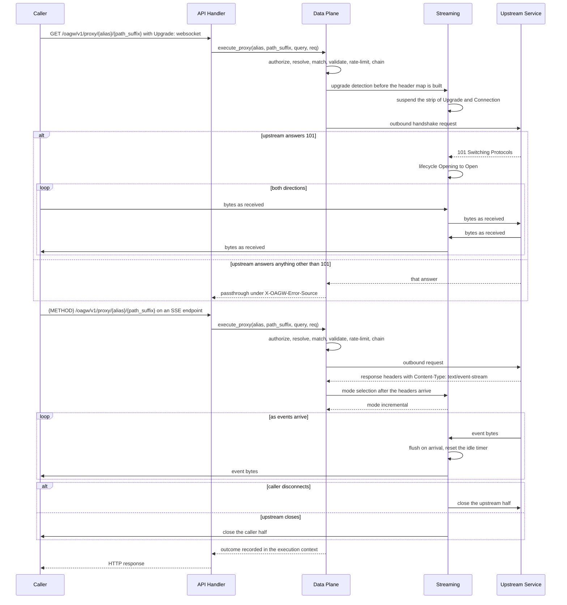
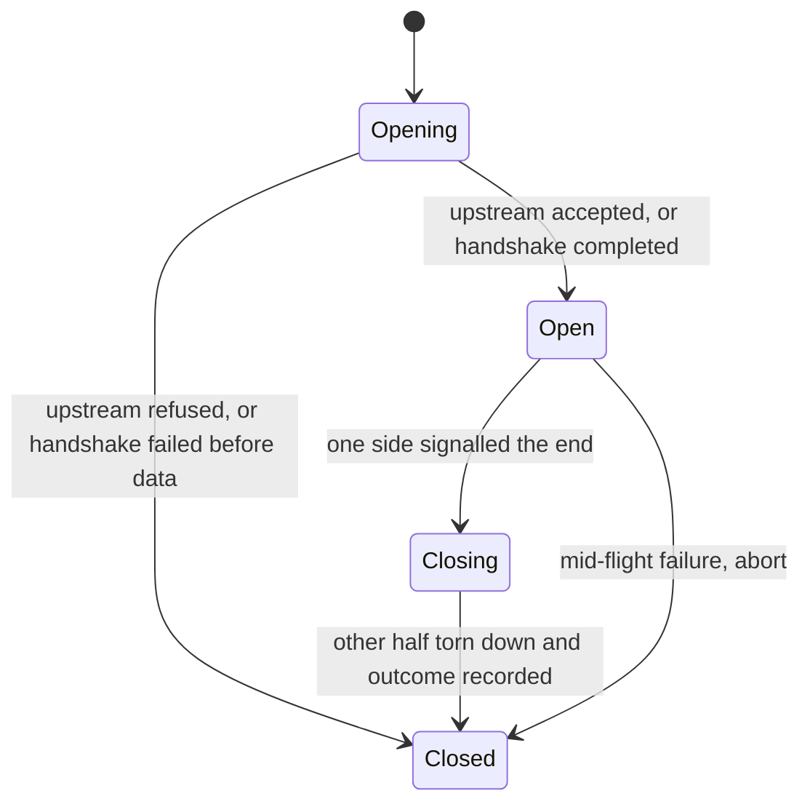

# Feature: Streaming

- [ ] `p1` - **ID**: `cpt-cf-oagw-featstatus-streaming-implemented`

<!-- reference to DECOMPOSITION entry -->
- [ ] `p2` - `cpt-cf-oagw-feature-streaming`

<!-- toc -->

- [1. Feature Context](#1-feature-context)
  - [1.1 Overview](#11-overview)
  - [1.2 Purpose](#12-purpose)
  - [1.3 Actors](#13-actors)
  - [1.4 References](#14-references)
  - [1.5 Feature-Local Deviations from Shared Baselines](#15-feature-local-deviations-from-shared-baselines)
  - [1.6 Explicit Non-Applicability](#16-explicit-non-applicability)
- [2. Actor Flows (CDSL)](#2-actor-flows-cdsl)
  - [Transfer a Streaming Response Body](#transfer-a-streaming-response-body)
  - [Proxy a WebSocket Upgrade and Tunnel](#proxy-a-websocket-upgrade-and-tunnel)
- [3. Processes / Business Logic (CDSL)](#3-processes--business-logic-cdsl)
  - [Select the Transfer Mode](#select-the-transfer-mode)
  - [Build the Upgrade Handshake and Judge its Answer](#build-the-upgrade-handshake-and-judge-its-answer)
  - [Pump the Stream](#pump-the-stream)
- [4. States (CDSL)](#4-states-cdsl)
  - [Stream Session Lifecycle State Machine](#stream-session-lifecycle-state-machine)
- [5. Definitions of Done](#5-definitions-of-done)
  - [Server-Sent Event Forwarding](#server-sent-event-forwarding)
  - [Stream Lifecycle and Teardown](#stream-lifecycle-and-teardown)
  - [WebSocket Upgrade Proxying](#websocket-upgrade-proxying)
  - [Stream Timeouts](#stream-timeouts)
  - [Stream Error Mapping](#stream-error-mapping)
  - [Stream Entities and Layering](#stream-entities-and-layering)
  - [Colocated Tests](#colocated-tests)
- [6. Acceptance Criteria](#6-acceptance-criteria)

<!-- /toc -->

## 1. Feature Context

### 1.1 Overview

This feature is the third policy tail of the `oagw` gear and the one that owns how a response body moves rather than what a request resolves to. It attaches to the proxy path `cpt-cf-oagw-feature-data-plane-proxy` owns and is invoked from `cpt-cf-oagw-flow-proxy-request` at exactly two points. The first is the upgrade detection at that path's header-transformation step: before `cpt-cf-oagw-algo-header-transform` builds the outbound header map, this feature decides whether the request is an upgrade request, and if it is, the strip of `Upgrade` and `Connection` is suspended so the handshake reaches the upstream. The second is the body transfer after `cpt-cf-oagw-algo-outbound-forward` has received the upstream's response headers: at that point this feature selects the transfer mode of the body and owns the transfer itself, reading one connection half and writing the other for as long as either carries bytes.

Everything that precedes the body is not this feature's and is not relaxed for a streaming request. Resolution, route matching, the permission check, inbound and body validation, the rate-limit check, the composed plugin chain, and the configured header rules all run exactly as they run for a non-streaming request. An upgrade request bypasses nothing, which is the deliberate contrast with `cpt-cf-oagw-feature-cors`: that feature answers a preflight at handler level before the proxy path authenticates a caller, because the browser that sends a preflight sends no credentials, while an upgrade request is a full proxy request that carries a bearer token, consumes a rate-limit allowance, executes the chain, and is validated like any other. The feature registers no path of its own and no second registration of the proxy path; the only state it holds is the `StreamSession`, which lives exactly as long as the two connection halves it describes and is gone when they are.

### 1.2 Purpose

DECOMPOSITION §2.8 places this feature as the last of the three policy tails that hang off the proxy spine, and DECOMPOSITION §3 makes it a consumer of `cpt-cf-oagw-feature-data-plane-proxy` for the reason that entry states: it "changes how the proxy response body is transferred, not what is resolved". `cpt-cf-oagw-feature-data-plane-proxy` resolves, matches, forwards, and classifies, and its own §1.5 records that the transfer mode of the body is not its to decide; this feature is where that decision lives. Streaming APIs such as chat completions answer with server-sent events that must reach the caller as the upstream emits them, and bidirectional clients upgrade to WebSocket, which the proxy path cannot serve by stripping the handshake headers and buffering the answer. PRD §5.4 states the requirement, PRD §8 states the use case, and PRD §9 states the acceptance criterion — "SSE streaming proxies events with correct lifecycle handling".

This feature delivers the DESIGN §3.2 Headers Transformation upgrade exception, which is the suspension of the `Upgrade` and `Connection` strip rule for a handshake, and the body-passthrough row of the §3.2 Transformation Rules subsection, whose reading this document fixes in §1.5. The stream lifecycle itself has no DESIGN §3.2 subsection, so the machine in §4 is stated here and nowhere else. DECOMPOSITION §2.8 records the same assignment: it lists `cpt-cf-oagw-component-model` as an umbrella reference precisely because no §3.2 subsection carries the lifecycle.

Deliverables:

- The transfer-mode selection for a response, taken from the request and the upstream's response headers, with `tunnel` and `incremental` as the only two modes and no third one that buffers.
- Server-sent event forwarding as events arrive, with no whole-body buffering, no frame parsing, no event rewriting, and no injected keepalive.
- The WebSocket upgrade handshake: the three-part detection, the suspension of two of the eight hop-by-hop headers, the 101 judgement, and the non-101 passthrough.
- The bidirectional byte tunnel that follows a 101, which frames nothing, interprets nothing, and applies the idle timer to the absence of traffic in either direction.
- The stream lifecycle machine and the two teardown directions: a client disconnect closes the upstream connection, and an upstream close closes the client connection.
- The idle timeout for a stalled stream and the error answers for a mid-flight termination, both mapped through the foundation's single RFC 9457 problem-body path.
- Colocated tests under `gears/system/oagw/oagw/tests/`.

**Requirements**:

- [ ] `p1` - `cpt-cf-oagw-fr-streaming`
- [ ] `p1` - `cpt-cf-oagw-usecase-sse-streaming`

`cpt-cf-oagw-fr-streaming` is delivered in part by this feature, exactly as DECOMPOSITION §2.8 states: the HTTP request/response, SSE, and WebSocket clauses are in scope, and its WebTransport clause is not (DECOMPOSITION §1.3, item 4). The HTTP request/response clause is delivered by the incremental transfer mode, which every response body takes; the SSE clause by the flush-as-they-arrive discipline over the same mode; and the WebSocket clause by the handshake and the tunnel. The WebTransport clause is recorded as not delivered in §1.6 with the answer a caller receives.

**Principles**:

- `p1` - `cpt-cf-oagw-principle-error-source`
- `p1` - `cpt-cf-oagw-principle-no-cache`

`cpt-cf-oagw-principle-no-cache` has a specific implementation here and not merely an absence: the gateway never buffers a complete response body before forwarding, which is why no cache surface exists on this path at all, and why the Data Plane L1 configuration cache that `cpt-cf-oagw-algo-dp-cache` owns, as a routine of `cpt-cf-oagw-feature-data-plane-proxy`, is forbidden from holding a response body by that feature's own Definition of Done.

**Constraints**:

- `p1` - `cpt-cf-oagw-constraint-toolkit-deploy`

This constraint is a §1.5 superset beyond the empty constraint list DECOMPOSITION §2.8 records, added for the same reason the sibling policy tails add it: the single-executable deployment is what makes the in-process invocation seam and the byte tunnel the only mechanisms this feature has.

**Design Components**:

- `p1` - `cpt-cf-oagw-component-model`
- `p1` - `cpt-cf-oagw-tech-dependencies`

`cpt-cf-oagw-component-model` stays an umbrella reference for the reason DECOMPOSITION §2.8 gives. `cpt-cf-oagw-tech-dependencies` is load-bearing here rather than decorative: the Rust and Axum row of that table names the async runtime, and the `pingora` row names the shared outbound client, and both are what the pump and the tunnel consume. The pump is a task over two connection halves on that runtime, and the incremental transfer mode is a body type the crate's ToolKit integration provides; neither is a mechanism this feature builds.

**Domain Model Entities**:

- `StreamSession` — one streaming exchange, carrying its two connection halves (the caller's and the upstream's), the transfer mode selected for it, the response `Content-Type` recorded for it, the lifecycle state it is in, the deadlines in force over it, and the outcome recorded when it ended.
- `UpgradeHandshake` — one upgrade exchange, carrying the outbound handshake request's suspended headers and the upstream's answer.

Both are declared here and DECOMPOSITION §2.8 lists both under this entry: it names "`StreamSession`, stream lifecycle state, and the upgrade handshake result", and the third of those three, "the upgrade handshake result", is `UpgradeHandshake`. The lifecycle state is `cpt-cf-oagw-state-stream-lifecycle` and not a third type, so a session carries a state of the machine in §4 rather than a duplicated enum. Five types are consumed and not redeclared: `ResolvedUpstream`, `SelectedEndpoint`, `MatchedRoute`, and `ProxyResponse` from `cpt-cf-oagw-feature-data-plane-proxy`, and `ErrorContext` from `cpt-cf-oagw-feature-gear-foundation`, which is the single definition point for it.

**Data**:

- None. DECOMPOSITION §2.8 declares no table for this feature, and it creates, reads, and writes none. A `StreamSession` is an in-process description of two live connections and cannot outlive them; nothing about a stream is persisted, so a restart changes no answer this feature gives and ends every session it held.

**API**:

- `{METHOD} /oagw/v1/proxy/{alias}[/{path_suffix}]` with server-sent event responses forwarded as received
- GET /oagw/v1/proxy/{alias}[/{path_suffix}] with `Upgrade: websocket` for upgrade proxying

Both lines are the two statements DECOMPOSITION §2.8 makes, and both are the proxy path `cpt-cf-oagw-feature-data-plane-proxy` registers taken under the conditions each line names. They are not second registrations: that feature's Definition of Done registers the handler for `{METHOD} /oagw/v1/proxy/{alias}[/{path_suffix}][?{query}]`, and this feature adds no handler, no route, and no path segment to it. A server-sent event response is reached by any method the matched route's allowlist admits, and the upgrade statement names the one method the three-part detection requires.

### 1.3 Actors

| Actor | Role in Feature |
|-------|-----------------|
| `cpt-cf-oagw-actor-app-developer` | Issues the proxy request that produces a streaming response, and the `GET` request that carries `Upgrade: websocket`, and receives either the bytes as the upstream emits them or the answer an upgrade that was not taken up produces. PRD §5.4 names this actor for `cpt-cf-oagw-fr-streaming` and PRD §8 names it the actor of `cpt-cf-oagw-usecase-sse-streaming`. |
| `cpt-cf-oagw-actor-upstream-service` | Emits the response headers whose content type selects the transfer mode, the event bytes that follow them, the 101 that completes a handshake, and the close that ends either half. It is the only actor this feature exchanges bytes with, and it sees the handshake headers it needs and no routing header, no hop-by-hop header other than the two the suspension preserves, and no credential other than the one the chain injected before the body moved. |

Three actors participate indirectly and are named here so their absence from the table is a record and not a gap:

- `cpt-cf-oagw-actor-cred-store` answers no call this feature makes. The credential material an upgrade request's outbound handshake carries was resolved and injected by the chain that `cpt-cf-oagw-algo-chain-execute` ran before the send, which is the same order a non-streaming request takes; by the time the pump holds the two halves, the material has been written into the request and the store is no longer in the path. DECOMPOSITION §1.5 lists the credential store under `cpt-cf-oagw-feature-plugin-system` alone.
- `cpt-cf-oagw-actor-types-registry` issues no call this feature answers. No request-time path registers or reads a type, and the error `type` identifiers this feature's answers carry were provisioned once at startup by `cpt-cf-oagw-feature-gear-foundation`.
- `cpt-cf-oagw-actor-platform-operator` and `cpt-cf-oagw-actor-tenant-admin` have no surface here: there is no streaming configuration key to write, because the idle timeout is a build-time constant of this feature and the transfer mode is selected from the request and the response rather than from configuration (§1.5). An operator tunes how long a stream may stall by rebuilding nothing and configuring nothing, because no supplied document provides the key and none is invented here.

### 1.4 References

- **PRD**: [PRD.md](../PRD.md)
- **Design**: [DESIGN.md](../DESIGN.md)
- **Dependencies**: `cpt-cf-oagw-feature-data-plane-proxy` — the proxy path both flows run on, the handler registration that receives both, the header transformation whose strip this feature suspends, the outbound client that opens the upstream half, the response classification that hands the body over, the `ResolvedUpstream`, `SelectedEndpoint`, `MatchedRoute`, and `ProxyResponse` types both consume, and the `proxy_timeout_secs` deadline whose reach this feature narrows (DECOMPOSITION §3).

Supporting sources this feature stays consistent with:

- [DESIGN.md](../DESIGN.md) §3.2 — the Headers Transformation subsection whose hop-by-hop table is tabulated `Inbound Header | Rule` and whose `Upgrade` and `Connection` rows are the two this feature suspends; the Guard Rules subsection whose method, query, and path rows are evaluated for an upgrade request exactly as for any other; the Transformation Rules subsection whose body row is the passthrough this feature implements; and the Security Considerations subsection whose HTTP version negotiation and HTTP/3 note bound what a tunnel can be carried over.
- [DESIGN.md](../DESIGN.md) §3.3 — the `StreamAborted`, `IdleTimeout`, `ConnectionTimeout`, `RequestTimeout`, `DownstreamError`, and `ProtocolError` rows of the error catalogue, with their statuses, GTS `type` identifiers, and Retriable cells, and the `retry_after_seconds` extension member this feature deliberately leaves unset.
- [ADR/0006-state-management.md](../ADR/0006-state-management.md) (`cpt-cf-oagw-adr-state-management`) — the three pieces of state ADR 0006 assigns the Data Plane, none of which is a stream session, and its rejection of the fully stateless option, and the shared outbound client that opens the upstream half of one.
- [ADR/0007-error-source-distinction.md](../ADR/0007-error-source-distinction.md) (`cpt-cf-oagw-adr-error-source-distinction`) — the `X-OAGW-Error-Source` header values, the problem-details rule for gateway errors, the passthrough rule for upstream answers, and the ADR's own confirmation item that the header works with streaming protocols.
- [schemas/upstream.v1.schema.json](../schemas/upstream.v1.schema.json) — the endpoint `scheme` enum of `https`, `wss`, `wt`, and `grpc`, of which the dial-time check admits `https` always and `http` exactly when `oagw.config.allow_http_upstream` is `true`, and never `wt` or `grpc`, and the `headers.request` and `headers.response` rule sets whose `passthrough` default of `none` interacts with the handshake headers (§1.5).
- [schemas/route.v1.schema.json](../schemas/route.v1.schema.json) — the `match.http.methods` enum of `GET`, `POST`, `PUT`, `DELETE`, and `PATCH`, which admits `GET` and therefore lets an upgrade request match a route.
- [config/e2e-local.yaml](../../../../../config/e2e-local.yaml) — the graded configuration. Its `oagw.config` block sets `proxy_timeout_secs: 2` and `allow_http_upstream: true` and sets neither token-cache key, and no streaming key exists in it to set. The graded consequence of the 2-second value is stated in §1.5 and in §6.

**Run-level assumptions** — premises this feature relies on that come from the platform runtime rather than from PRD, DESIGN, the ADRs, or DECOMPOSITION. Each states what fails if the premise does not hold:

- Assumption: the platform serves long-lived responses and upgrade tunnels, and exposes a response body type the handler can stream through, without an intermediary between the caller and this feature's handler buffering either. DESIGN §4.6 names "streaming support" among the HTTP client abstractions the platform must supply, and the `pingora` row of `cpt-cf-oagw-tech-dependencies` names the reverse-proxy engine that provides it. If the platform buffers a streamed body into a whole response before the handler sees it, or buffers an upgraded connection's frames, server-sent events arrive in one block at the end and the upgrade cannot complete at all; in the first case the stream is silently degraded and nothing in this feature can compensate, because the buffering happens below every routine of §3, and in the second case the three-part detection never reaches a 101 and the caller receives a plain error answer.
- Assumption: the upstream's response headers arrive before its body, so the transfer mode is selectable from the headers alone. This is the HTTP response framing contract and the reason `cpt-cf-oagw-algo-response-classify` can tag an answer and hand its body over before any body byte moves, which that feature's own step records as the order. If a transport delivered body bytes before the headers were complete, no mode selection could run ahead of them, and this feature **MUST** treat the exchange as failed and answer 502 with the `StreamAborted` variant rather than guess a mode, because a guessed mode is the difference between a tunnel and a body transfer and the two tear down differently.
- Assumption: the shipped route schema's `match.http.methods` enum admits `GET`, so an upgrade request can match a route and reach the header-transformation step at all. The enum admits five literals and `GET` is one of them, which is what distinguishes the upgrade request from the ordinary `OPTIONS` request `cpt-cf-oagw-feature-cors` records: that method is admitted by no route in the shipped schema, so an ordinary `OPTIONS` proxy request matches nothing and is answered 404, while a `GET` upgrade request matches a route that lists it and proceeds. If a deployment's route configuration omits `GET` from every allowlist, no upgrade request can be proxied by that deployment, and the answer is the ordinary 404 `RouteNotFound` rather than a streaming-specific one, because the failure is a match failure and not a transfer one.
- Assumption: the `OagwConfig` surface is closed at the five keys DECOMPOSITION §2.1 declares and `cpt-cf-oagw-feature-gear-foundation` owns, and names no streaming key. If the surface were widened by another feature, this feature would owe a second owner an answer about the idle deadline; since it is not, the idle timeout is a build-time constant of this feature and the behaviour §6 pins is that the deadline exists, that it is finite, and that no configuration input reaches it.
- Assumption: the platform delivers `Connection` and `Upgrade` to this feature's detection point intact on an upgrade request, with their values unmodified and un-normalized, because the detection reads the token list of the one and the protocol name of the other and because the suspension forwards them as the caller sent them. If the platform stripped or rewrote either header before the handler ran, the handshake could not be reconstructed, and this feature **MUST** answer the request as a plain request/response exchange under `cpt-cf-oagw-flow-stream-transfer` rather than emit a handshake request the upstream would answer 400, because a handshake this feature cannot complete honestly is not one it should begin.

### 1.5 Feature-Local Deviations from Shared Baselines

| Deviation | Rationale | Review owner | Validation performed |
|-----------|-----------|--------------|----------------------|
| This feature is invoked from `cpt-cf-oagw-flow-proxy-request` at two points — the upgrade detection at that flow's header-transformation step, and the body transfer after `cpt-cf-oagw-algo-outbound-forward` has received the upstream's response headers — and that flow records no step for either invocation. | `cpt-cf-oagw-algo-header-transform` states at its own strip step that "the upgrade-handshake exception that suspends two of them belongs to `cpt-cf-oagw-feature-streaming` and is not applied here", and `cpt-cf-oagw-algo-response-classify` states at its own stream step that the body is "hand[ed] to `cpt-cf-oagw-feature-streaming`, which owns how it is transferred", so both invocation points are named by the sibling's routines without its flow carrying a step for them. The sibling is a frozen input this run does not edit, and the invocation is the same in-process seam that path already uses for the rate-limit check and for the CORS enforcement, so the position is recorded here rather than added there. | The controller of this run. | Accepted by the semantic review of this run; `cfs validate --artifact` clean. |
| The upgrade detection is three-part: the request method is `GET`, the `Upgrade` header names `websocket`, and the `Connection` header names the `upgrade` token, compared case-insensitively over a comma-separated token list; all three must hold for a request to be an upgrade request. | No supplied document states a detection rule. The three parts are the three things the handshake requires and the strip rule would otherwise destroy: DECOMPOSITION §2.8 names only the WebSocket upgrade as the upgrade this feature proxies, the WebSocket handshake's own request-side requirements fix the method and the two headers, and DESIGN §3.2's hop-by-hop table is the rule the suspension exists to escape. A request that carries `Upgrade: websocket` on a `POST` is not a WebSocket handshake, and one that names another protocol on a `GET` is not the upgrade DECOMPOSITION §2.8 delivers, so each negative is a request this feature hands back stripped rather than one it half-serves. | The controller of this run. | Accepted by the semantic review of this run; `cfs validate --artifact` clean. |
| The strip suspension is one-directional: only the request direction suspends the strip of `Upgrade` and `Connection`, and no response-direction strip is suspended, because no response-direction strip exists. | DESIGN §3.2's hop-by-hop table is tabulated with the column headings `Inbound Header` and `Rule`, so every row it states is a rule over the request direction. The response direction carries only the configured `headers.response` `set`, `add`, and `remove` rules that `cpt-cf-oagw-feature-data-plane-proxy` applies, which appears nowhere in DESIGN and is that feature's to apply (its own §1.5). A 101 answer therefore needs nothing suspended on its way back: the headers it carries reach the caller through that configured rule set alone, and an operator who configures a removal of a handshake answer's header has configured it. | The controller of this run. | Accepted by the semantic review of this run; `cfs validate --artifact` clean. |
| The six hop-by-hop headers of DESIGN §3.2's table other than `Upgrade` and `Connection` — `Keep-Alive`, `Proxy-Authenticate`, `Proxy-Authorization`, `TE`, `Trailer`, and `Transfer-Encoding` — stay stripped on an upgrade request. | DECOMPOSITION §2.8 suspends "the `Upgrade` and `Connection` strip rule", which is one row-pair of the eight the table states and the eight PRD §5.2 names for `cpt-cf-oagw-fr-header-transform`, and names no general suspension. `cpt-cf-oagw-algo-header-transform` strips all eight on a plain exchange and its own step defers only the exception this feature owns, so a suspension wider than the two would change a surface the sibling owns and would forward headers whose hop-by-hop meaning is unchanged by an upgrade. | The controller of this run. | Accepted by the semantic review of this run; `cfs validate --artifact` clean. |
| On a detected upgrade request the WebSocket handshake's own request headers — `Sec-WebSocket-Key`, `Sec-WebSocket-Version`, and any `Sec-WebSocket-Extensions` and `Sec-WebSocket-Protocol` the caller offered — are forwarded to the upstream regardless of the resolved `headers.request.passthrough` mode, including at that mode's shipped default of `none`. | DECOMPOSITION §2.8 states the suspension's purpose as "so the handshake headers reach the upstream and the 101 response can complete", and the shipped schema's `passthrough` default forwards no inbound header at all, so suspending the two hop-by-hop headers alone would deliver an outbound request carrying `Upgrade` and `Connection` but none of the fields a handshake is judged by. The upstream would refuse it, and the refusal would look like an unsupported upstream rather than like a configuration default. The four headers are the handshake's own fields and no other inbound header is admitted by this reading; the `headers.request` `set`, `add`, and `remove` rules and the `Host` or `:authority` replacement still apply to the handshake request exactly as to any other. | The controller of this run. | Accepted by the semantic review of this run; `cfs validate --artifact` clean. |
| The single `proxy_timeout_secs` deadline is read here as bounding the wait for the upstream's response headers and nothing more once the transfer mode is streaming, and the two 504 catalogue rows split accordingly: `RequestTimeout` answers the header-arrival wait, `IdleTimeout` answers the body. | `cpt-cf-oagw-feature-data-plane-proxy` records in its own §1.5 that the one configured deadline is applied to both the connection-establishment phase and the request/response exchange phase of one outbound call, with `ConnectionTimeout` and `RequestTimeout` as their answers, and records in its own §1.6 that "the idle-timeout 504 of a stalled stream is that feature's answer, not `RequestTimeout`". Reading the exchange phase as covering the whole body would kill every long-lived response at `proxy_timeout_secs`, which is the opposite of what DECOMPOSITION §2.8 exists to prevent, and reading it as covering nothing would leave the header-arrival wait unbounded. The split above is the only one that keeps both sibling statements true, and the third 504 row of the catalogue is exactly the one that answers the body. | The controller of this run. | Accepted by the semantic review of this run; `cfs validate --artifact` clean. |
| The idle timeout is a build-time constant of 60 seconds with no configuration surface and no sourced value. | The `OagwConfig` surface closes at the five keys `proxy_timeout_secs`, `allow_http_upstream`, `ssrf_policy`, `token_cache_ttl_secs`, and `token_cache_capacity`, which `cpt-cf-oagw-feature-gear-foundation` owns and which name no idle deadline; no supplied document states an idle value; and DESIGN §3.3 tabulates the `IdleTimeout` row without a threshold. A stalled stream must be answered rather than held open indefinitely, so the value cannot be left undefined, and stating a number here is the same class of recorded constant as the ones the sibling policy tails record for their own unsourced values. 60 seconds is long enough to keep a healthy event stream open across the gap an upstream is expected to emit into, and short enough to answer a genuinely stalled one before a caller gives up on its own. | The controller of this run. | Accepted by the semantic review of this run; `cfs validate --artifact` clean. |
| The graded consequence of the split above is stated: with `proxy_timeout_secs: 2`, the wait for the upstream's response headers is bounded at 2 seconds, and a stream that emits its first bytes within it outlives that deadline for as long as it keeps emitting. | `config/e2e-local.yaml` sets `proxy_timeout_secs: 2` in its `oagw.config` block, which is the value `cpt-cf-oagw-algo-outbound-forward` applies to both phases it bounds. The 2-second value is a configuration choice the graded deployment made for the request/response path, and under the §1.5 split it does not bound a stream's body, which is why a long-lived event stream is servable in that deployment at all. | The controller of this run. | Accepted by the semantic review of this run; `cfs validate --artifact` clean. |
| The body row of DESIGN §3.2's Transformation Rules table — inbound `Body` to outbound `Body`, rule "Passthrough by default; plugin mutable" — is read as "every response body is forwarded as received", so the incremental transfer mode is the answer for every response body `cpt-cf-oagw-algo-response-classify` hands over, and no such body is ever buffered in full before its first byte is forwarded. | DESIGN §3.2 states the row as a passthrough and states no buffering step, and `cpt-cf-oagw-principle-no-cache` forbids holding a response. A buffered mode would make the gateway a cache of one response per request and would make every server-sent event arrive after the upstream finished, which is the failure the feature exists to prevent. The row's "plugin mutable" clause stays with the request direction, where `cpt-cf-oagw-algo-chain-execute` runs the transform phase before the send; no response-phase body mutation is delivered here, because a body that is being forwarded as it arrives cannot be transformed whole. The boundary of that reading is the sibling's own step: a response that routine does not tag as a stream it assembles into its `ProxyResponse` and returns itself, so the reading claims the bodies handed over and not the answers the sibling keeps. | The controller of this run. | Accepted by the semantic review of this run; `cfs validate --artifact` clean. |
| A mid-flight termination is answered 502 with the `StreamAborted` variant whichever side caused it, and the `DownstreamError` variant is not used by this feature at all. | DECOMPOSITION §2.8 fixes the case and the row: "502 `StreamAborted` with `X-OAGW-Error-Source: gateway` when a stream is terminated mid-flight". The catalogue describes `DownstreamError` as an "Upstream service error", which is an answer about a response the gateway received and not about a transfer it was performing, and the distinction matters because the two rows carry different Retriable cells and different GTS `type` identifiers. Attributing the termination to one side would also require the gateway to decide something it cannot observe, namely which peer was at fault for a socket that closed under it. | The controller of this run. | Accepted by the semantic review of this run; `cfs validate --artifact` clean. |
| Neither of the two answers this feature produces carries `Retry-After`, so `IdleTimeout` is retriable in the catalogue and is nevertheless answered without the header, and `StreamAborted` is non-retriable and is answered without it because the mapping emits the header only for retriable rows. | The convention `cpt-cf-oagw-algo-error-mapping` of `cpt-cf-oagw-feature-gear-foundation` performs is to emit `Retry-After` only for the catalogue rows DESIGN §3.3 marks retriable and only when the variant carries `retry_after_seconds`. `IdleTimeout` is in the retriable-and-carrying set, so its missing header is a decision of this feature and not a property of the mapping, because the variant carries no `retry_after_seconds` for the gateway to emit; `StreamAborted` is outside that set, so `cpt-cf-oagw-algo-error-mapping` would omit the header for it in any case, and the absence there is a property of the mapping rather than a decision. For the row the decision does cover, the gateway has no interval to state for a stream that died: it does not know when the upstream will emit again and it does not re-issue requests per `cpt-cf-oagw-principle-no-retry`. A caller that retries a stalled stream does so on its own schedule, which is what that principle assigns to it. | The controller of this run. | Accepted by the semantic review of this run; `cfs validate --artifact` clean. |
| DECOMPOSITION §2.8's "upstream close closes the client connection and logs the event" is satisfied through the outcome recorded in the request's execution context, which `cpt-cf-oagw-feature-observability` reports, and this feature emits no log line, no metric, and no span of its own. | The audit record and the metric surface are that feature's per DESIGN §4.2 and §4.3, and DECOMPOSITION §3 makes it a consumer of this path precisely to read the request lifecycle those records describe. An outcome written into the execution context is the same record every sibling policy tail contributes — `cpt-cf-oagw-feature-cors` records the same posture for its two 403 answers — and a second emission path would report one exchange twice with two owners of its fields. | The controller of this run. | Accepted by the semantic review of this run; `cfs validate --artifact` clean. |
| This feature's tests are colocated at `gears/system/oagw/oagw/tests/` instead of `testing/e2e/gears/oagw/`. | DECOMPOSITION §1.3(3) reserves `testing/e2e/gears/oagw/` for the acceptance suite; every unit and integration test this decomposition produces lives with the crate. This is the same deviation `cpt-cf-oagw-feature-gear-foundation`, `cpt-cf-oagw-feature-control-plane-config`, `cpt-cf-oagw-feature-hierarchical-config`, `cpt-cf-oagw-feature-plugin-system`, `cpt-cf-oagw-feature-data-plane-proxy`, `cpt-cf-oagw-feature-rate-limiting`, and `cpt-cf-oagw-feature-cors` record in their own §1.5 tables, restated here because the tests it governs include this feature's. | The controller of this run. | Accepted by the semantic review of this run; `cfs validate --artifact` clean. |
| This feature's §1.2 Constraints list carries `cpt-cf-oagw-constraint-toolkit-deploy` beyond the empty constraint list DECOMPOSITION §2.8 records. | The single-executable deployment of DECOMPOSITION §1.4 is what makes the in-process invocation seam and the byte tunnel the only mechanisms this feature has: both invocation points are function calls in one address space, and no queue, no broker, and no second process sits between the proxy path and the pump. The sibling policy tails add the same constraint for the same reason, and every sibling feature document mirrors its baseline list except where it records the superset, so the addition is recorded rather than silently carried. | The controller of this run. | Accepted by the semantic review of this run; `cfs validate --artifact` clean. |
| This document applies `cpt-cf-oagw-principle-no-retry` in its prose and cites `cpt-cf-oagw-adr-error-source-distinction` in §5, neither of which is on the §1.2 lists DECOMPOSITION §2.8 maps to this entry. | DECOMPOSITION §2.8 maps `cpt-cf-oagw-principle-error-source` and `cpt-cf-oagw-principle-no-cache` only, and both are on the §1.2 list; the two additions are applied rather than listed because they govern behaviour this feature cannot opt out of — a stream that has been consumed cannot be consumed again, and the error-source distinction decides which of its two answers carries the gateway tag. The owner of the retry posture on the proxy path is `cpt-cf-oagw-feature-data-plane-proxy`, whose own flow performs the send, so the application here records where the principle bites rather than a second owner of it. Every sibling feature document mirrors its baseline list except where it records the superset. | The controller of this run. | Accepted by the semantic review of this run; `cfs validate --artifact` clean. |
| This document's status identifier carries the `-implemented` suffix, reading `cpt-cf-oagw-featstatus-streaming-implemented` where the FEATURE template fixes the same identifier without that suffix, and its backreference to the DECOMPOSITION entry is left unchecked where that template fixes a checked one. | All eight FEATURE documents this run has authored so far, this one included, carry the same two forms, so the departure is a run-wide convention and not a defect of this document alone: the suffix names the status value the identifier reports rather than a second identifier, and the backreference is a traceability pointer whose state the implementation phase owns. The departure is therefore a stated convention rather than a silent one. | The controller of this run. | Accepted by the semantic review of this run; `cfs validate --artifact` clean. |

### 1.6 Explicit Non-Applicability

The areas below apply to the gear as a whole but not to this feature. Each is stated here so the omission is a recorded decision rather than a silent gap, and each names the feature that does own it.

- **WebTransport, the `wt` clause of `cpt-cf-oagw-fr-streaming`.** It is the one clause of that requirement this feature does not deliver, per the scope reduction DECOMPOSITION §1.3(4) records and DECOMPOSITION §2.8 repeats. `cpt-cf-oagw-feature-data-plane-proxy` owns the answer a caller receives: it records in its own §1.5 that a proxy attempt against a `wt`-scheme upstream is answered 502 through the `ProtocolError` variant with `X-OAGW-Error-Source: gateway`, and its dial-time scheme check returns that refusal inside the send `cpt-cf-oagw-flow-upgrade-proxy` performs, so the handshake `cpt-cf-oagw-algo-upgrade-handshake` built is never taken up, the session that routine opened in `Opening` moves to `Closed`, and no tunnel is carried. The `wt` literal remains a legal write-time admission in the shipped schema, which is the same divergence that feature and `cpt-cf-oagw-feature-gear-foundation` already record.
- **gRPC streaming and HTTP/3.** Both are out of scope per DECOMPOSITION §2.8. A gRPC upstream produces no matching route and is answered with the ordinary 404 `RouteNotFound`, which `cpt-cf-oagw-feature-data-plane-proxy` records, and no `match.http.methods` allowlist can produce a gRPC match because the shipped route schema's gRPC match keys are never evaluated here. HTTP/3 (QUIC) is future work per DESIGN §3.2 Security Considerations and §4.5, so no tunnel is carried over it and no event stream is negotiated onto it.
- **Response header transformation and the `headers.response` rules.** `cpt-cf-oagw-feature-data-plane-proxy` owns both, and it applies them before the body is handed over: its own §1.5 records that the outbound response header rules are its act and the transfer mode of the body is this feature's. `cpt-cf-oagw-algo-response-classify` applies the `set`, `add`, and `remove` rules and tags the answer before `cpt-cf-oagw-algo-stream-mode-select` runs, so the response the caller receives during a streamed transfer already carries the configured mutation and the error-source tag, and this feature mutates neither.
- **Body validation, the query allowlist, and the guard rules.** `cpt-cf-oagw-feature-data-plane-proxy` owns all three, and an upgrade request is subject to all three like any other: it carries no body, so `cpt-cf-oagw-algo-body-validate` has nothing to reject, which is the only case in which that routine is reached with no body at all, and its query parameters are judged against the matched route's `match.http.query_allowlist` and its method against the route's allowlist before the handshake is built. A guard that rejects an upgrade request answers 400 in the request phase exactly as ADR 0009's request-phase status states, and the handshake is never built for a request the chain refused.
- **Resolution, matching, the permission check, the rate-limit check, and the composed chain.** `cpt-cf-oagw-feature-data-plane-proxy` owns the first four and `cpt-cf-oagw-feature-rate-limiting` owns the check inside them; both flows in §2 are reached from `cpt-cf-oagw-flow-proxy-request` and restate no step of it. An upgrade request consumes exactly one rate-limit allowance at that feature's check, and the stream's own duration consumes no further tokens and refunds none, which is the posture `cpt-cf-oagw-feature-rate-limiting` records for a request that upgrades to a stream.
- **Metrics, audit logs, correlation, tracing, health, and diagnostics.** `cpt-cf-oagw-feature-observability` owns the Prometheus surface, the structured audit record, and the correlation identifier, and `cpt-cf-oagw-feature-gear-foundation` owns the health surface and the `trace_id` an error body carries. This feature emits no series, writes no audit line, opens no span, and assigns no correlation identifier; what it supplies is the outcome recorded in the request's execution context, which is the record those surfaces report (§1.5).
- **Persistence.** DECOMPOSITION §2.8 declares no table for this feature, and `cpt-cf-oagw-db-schema` is fully claimed by `cpt-cf-oagw-feature-control-plane-config` and `cpt-cf-oagw-feature-plugin-system`. Nothing this feature computes outlives the two connections it describes, and the lifecycle state of §4 is held in the `StreamSession` and nowhere else.
- **Latency targets.** The proxy path's budget is `cpt-cf-oagw-nfr-low-latency`'s, whose threshold is less than 10 ms of added latency at p95 excluding the upstream response time, and `cpt-cf-oagw-feature-data-plane-proxy` carries the Definition of Done that consumes it. This feature states no target of its own, and the cost it adds to the path is per-byte forwarding rather than a per-request computation: the work it does is proportional to the number of bytes the upstream emits and not to the number of decisions the path makes, so the omission is recorded here rather than left silent.
- **Data protection.** No personal-adjacent datum reaches this feature beyond the request the proxy path already carries, and nothing is persisted, logged, or echoed here. The pump moves bytes and inspects none of them, so it cannot disclose a body it does not read; the handshake carries the caller's handshake headers and no credential beyond the one the chain injected; and neither problem `detail` this feature produces names a caller, a path it was not given, or a body it moved.
- **Rollout, rollback, versioning, localization, accessibility, and compliance.** The gear is one configuration item and one release unit (DECOMPOSITION §1.4), so this feature ships no rollout or rollback of its own and there is one configuration item to roll back. Every identifier it reads and every `type` it writes is fixed at `.v1`, so there is no version negotiation and no predecessor to migrate from. The two problem bodies it produces are English protocol strings from the foundation's mapping, the headers it forwards and suspends are protocol values an accessibility requirement does not reach, and there is no rendered actor-facing surface here to make accessible. Compliance has no surface here to assess, because the feature persists nothing, emits no record of its own, and produces only the two problem bodies the foundation's mapping owns.
- **Workarounds, deprecation, and migration.** None applies. The two limitations §1.5 records — the 60-second constant with no configuration surface, and the three-part detection with no configurable widening — have no workaround short of a code change or a schema revision, both of which are outside this run's authority, and every identifier this feature reads is fixed at `.v1`.

## 2. Actor Flows (CDSL)

The two flows below run on the proxy path `cpt-cf-oagw-flow-proxy-request` of `cpt-cf-oagw-feature-data-plane-proxy` implements, and neither registers a path of its own. The first is reached after that flow's outbound call has received the upstream's response headers, at the position `cpt-cf-oagw-algo-response-classify` names when it hands a stream body over. The second is reached at that flow's header-transformation step, at the position `cpt-cf-oagw-algo-header-transform` names when it defers the upgrade-handshake exception. Both are in-process invocations from that flow, and §1.5 records that its steps name neither.

**Use cases**: `cpt-cf-oagw-usecase-sse-streaming`

`cpt-cf-oagw-usecase-proxy-request` is `cpt-cf-oagw-feature-data-plane-proxy`'s and is not restated here; this feature is reached from it and adds no second statement of it. The SSE use case is reached through the endpoint that feature registers, which is why DECOMPOSITION §3 makes this feature a consumer of that one rather than the reverse.

### Transfer a Streaming Response Body

- [x] `p1` - **ID**: `cpt-cf-oagw-flow-stream-transfer`

**Actor**: `cpt-cf-oagw-actor-app-developer`

This flow is invoked once per proxy response whose body is not a completed tunnel, by `cpt-cf-oagw-flow-proxy-request` of `cpt-cf-oagw-feature-data-plane-proxy`, after `cpt-cf-oagw-algo-outbound-forward` has received the upstream's response headers and `cpt-cf-oagw-algo-response-classify` has tagged the answer. It owns the transfer of the body and nothing that produced it: by the time it runs, the request has been resolved, matched, authorized, validated, charged, chained, and transformed, and the answer has been classified and tagged.

**Success Scenarios**:

- A response whose `Content-Type` is `text/event-stream` is forwarded as events arrive, and each event's bytes reach the caller in the order and at the cadence the upstream emitted them, with no whole-body buffering and no frame parsing.
- Every other response body that `cpt-cf-oagw-algo-response-classify` hands over is also forwarded as received, without buffering the whole body, which is the reading of the body-passthrough row §1.5 records.
- The caller disconnects: the upstream half is closed, the outcome is recorded in the request's execution context, and the lifecycle reaches `Closed` through `Closing`.
- The upstream closes its half: the bytes already read are written to the caller, the caller's half is closed, and the same recording and lifecycle apply.
- The upstream's response headers arrive within `proxy_timeout_secs` and the first body bytes follow: the stream outlives that deadline, which in the graded configuration is 2 seconds, for as long as it keeps emitting.

**Error Scenarios**:

- The upstream's response headers do not arrive within `proxy_timeout_secs`: 504 with the `RequestTimeout` variant, answered by `cpt-cf-oagw-algo-outbound-forward` before this flow is invoked, and no `StreamSession` is opened.
- No byte arrives in either direction for 60 seconds: 504 with the `IdleTimeout` variant (`gts.cf.core.errors.err.v1~cf.oagw.timeout.idle.v1`), `X-OAGW-Error-Source: gateway`, and no `Retry-After` (§1.5).
- The transfer terminates mid-flight on either side while bytes are still expected: 502 with the `StreamAborted` variant (`gts.cf.core.errors.err.v1~cf.oagw.stream.aborted.v1`) and `X-OAGW-Error-Source: gateway`, whichever side caused it (§1.5).
- The response is an upgrade that the upstream took up: this flow is not invoked for it, because the tunnel is `cpt-cf-oagw-flow-upgrade-proxy`'s and the body transfer is not a body transfer at all.

**Steps**:

1. [x] - `p1` - Actor issues the proxy request carrying the method, the alias, an optional path suffix, and the headers the matched route admits, expecting a response whose body arrives over time - `inst-st-issue`
2. [x] - `p1` - API: `{METHOD} /oagw/v1/proxy/{alias}[/{path_suffix}][?{query}]` — resolved, matched, authorized, validated, charged, chained, and forwarded by `cpt-cf-oagw-flow-proxy-request` exactly as for a non-streaming request, with no streaming-specific relaxation anywhere before the send - `inst-st-api`
3. [x] - `p1` - `cpt-cf-oagw-algo-outbound-forward` receives the upstream's response headers, which is the boundary the `RequestTimeout` deadline bounds and the last moment at which the exchange can still be answered as a whole - `inst-st-headers`
4. [x] - `p1` - `cpt-cf-oagw-algo-response-classify` tags the answer, applies `headers.response`, and hands the body over, and `cpt-cf-oagw-algo-stream-mode-select` selects the transfer mode from the request and those headers - `inst-st-mode`
5. [x] - `p1` - **IF** the selected mode is `tunnel` - `inst-st-tunnel-if`
   1. [x] - `p1` - **RETURN** nothing for this flow to transfer, because the exchange is `cpt-cf-oagw-flow-upgrade-proxy`'s and its two halves are already held there - `inst-st-tunnel-return`
6. [x] - `p1` - **ELSE** - `inst-st-tunnel-else`
   1. [x] - `p1` - Open the `StreamSession` in the `Open` state, carrying the caller's half, the upstream half `cpt-cf-oagw-algo-outbound-forward` opened, the `incremental` mode `cpt-cf-oagw-algo-stream-mode-select` returned, the response `Content-Type` it attached, the idle deadline in force, and no outcome - `inst-st-session`
   2. [x] - `p1` - `cpt-cf-oagw-algo-stream-pump` transfers the body: it reads from the upstream half, writes and flushes to the caller's half, and resets the idle timer on every byte in either direction - `inst-st-pump`
   3. [x] - `p1` - **IF** the caller disconnects - `inst-st-client-if`
      1. [x] - `p1` - Close the upstream half, record the client-disconnect outcome in the request's execution context, and take the lifecycle through `Closing` to `Closed`, which is the first of the two teardown directions DECOMPOSITION §2.8 states - `inst-st-client-close`
   4. [x] - `p1` - **ELSE IF** the upstream closes its half - `inst-st-upstream-if`
      1. [x] - `p1` - Write the bytes already read to the caller, close the caller's half, record the upstream-close outcome in the same execution context, and take the lifecycle through `Closing` to `Closed`, which is the second of the two teardown directions - `inst-st-upstream-close`
   5. [x] - `p1` - **ELSE IF** the idle timer expires at 60 seconds with no byte in either direction - `inst-st-idle-if`
      1. [x] - `p1` - Tear both halves down and answer 504 with the `IdleTimeout` variant and `X-OAGW-Error-Source: gateway`, carrying no `Retry-After` (§1.5) - `inst-st-idle-return`
   6. [x] - `p1` - **ELSE IF** either half fails while bytes are still expected - `inst-st-abort-if`
      1. [x] - `p1` - Tear both halves down and answer 502 with the `StreamAborted` variant and `X-OAGW-Error-Source: gateway`, whichever side failed (§1.5) - `inst-st-abort-return`
7. [x] - `p1` - **RETURN** the outcome recorded in the request's execution context, for `cpt-cf-oagw-feature-observability` to report; this flow emits no log line, no metric, and no span of its own (§1.5) - `inst-st-return`

### Proxy a WebSocket Upgrade and Tunnel

- [x] `p1` - **ID**: `cpt-cf-oagw-flow-upgrade-proxy`

**Actor**: `cpt-cf-oagw-actor-app-developer`

This flow is invoked once per proxy request, at the header-transformation step of `cpt-cf-oagw-flow-proxy-request` of `cpt-cf-oagw-feature-data-plane-proxy`, before `cpt-cf-oagw-algo-header-transform` builds the outbound header map. It answers one question there — is this an upgrade request — and, when the answer is yes, it owns the handshake and the tunnel that follows it. Unlike the CORS preflight of `cpt-cf-oagw-feature-cors`, which is answered before the proxy path authenticates a caller, this flow bypasses nothing: the permission check, the resolution, the match, the validations, the rate-limit charge, and the composed chain all ran before the handshake is built, and a request any of them refused never reaches it.

**Success Scenarios**:

- A request whose method is `GET`, whose `Upgrade` header names `websocket`, and whose `Connection` header names the `upgrade` token is detected as an upgrade request, and the strip of `Upgrade` and `Connection` is suspended for it while the other six hop-by-hop headers stay stripped.
- The outbound handshake request carries the suspended two, the handshake's own request headers, the configured `headers.request` mutations, and the replaced `Host` or `:authority`; the upstream answers 101; the lifecycle moves from `Opening` to `Open`.
- After the 101 the gateway is a byte tunnel in both directions: it frames nothing, interprets nothing, injects nothing, and applies the idle timer to the absence of traffic in either direction.
- The caller disconnects and the upstream half is closed; the upstream closes and the caller's half is closed after the bytes already read are written.

**Error Scenarios**:

- The three-part detection does not recognize an upgrade request: no suspension is applied, all eight hop-by-hop headers are stripped, and the exchange proceeds as a plain request/response transfer under `cpt-cf-oagw-flow-stream-transfer`.
- The upstream answers anything other than 101: that answer passes through unchanged under the error-source classification, the session opened at the send moves to `Closed` without any half being read, and the connection stays a plain request/response exchange.
- The handshake fails before any data moves — a refused connection, a deadline breach, or an unavailable link — and the answer is the one `cpt-cf-oagw-algo-outbound-forward` produced, with the lifecycle moving from `Opening` to `Closed`.
- No traffic moves in either direction for 60 seconds: 504 with the `IdleTimeout` variant and no `Retry-After` (§1.5).
- The tunnel terminates mid-flight: 502 with the `StreamAborted` variant and `X-OAGW-Error-Source: gateway`, whichever side caused it (§1.5).
- The selected endpoint's scheme is `wt`: 502 with the `ProtocolError` variant, answered by `cpt-cf-oagw-algo-outbound-forward` at this flow's send step, which is the disposition §1.6 records rather than restates.

**Steps**:

1. [x] - `p1` - Actor issues the upgrade request carrying the `GET` method, the `Upgrade: websocket` header, the `Connection` header naming the `upgrade` token, the handshake's own request headers, and a bearer token for `gts.cf.core.oagw.proxy.v1~:invoke` - `inst-up-issue`
2. [x] - `p1` - API: `GET /oagw/v1/proxy/{alias}[/{path_suffix}][?{query}]` — the proxy path `cpt-cf-oagw-feature-data-plane-proxy` registers taken under those conditions, with the permission check, the resolution, the match, the validations, the rate-limit charge, and the composed chain all executed before this flow is reached, so the upgrade request bypasses nothing - `inst-up-api`
3. [x] - `p1` - Before `cpt-cf-oagw-algo-header-transform` builds the outbound header map, `cpt-cf-oagw-algo-stream-mode-select` applies its three-part detection to the request as the proxy path holds it - `inst-up-detect`
4. [x] - `p1` - **IF** the method is not `GET`, or `Upgrade` does not name `websocket`, or `Connection` does not name the `upgrade` token - `inst-up-detect-if`
   1. [x] - `p1` - **RETURN** no suspension and no `UpgradeHandshake`, so `cpt-cf-oagw-algo-header-transform` strips all eight hop-by-hop headers and the exchange stays under `cpt-cf-oagw-flow-stream-transfer`; a request that fails any one of the three parts is an ordinary proxy request and not a handshake - `inst-up-detect-return`
5. [x] - `p1` - **ELSE** - `inst-up-detect-else`
   1. [x] - `p1` - `cpt-cf-oagw-algo-upgrade-handshake` builds the `UpgradeHandshake`: it suspends the strip of `Upgrade` and `Connection`, keeps the other six stripped, forwards the handshake's own request headers regardless of the `headers.request.passthrough` mode (§1.5), and applies the configured `headers.request` rules and the `Host` or `:authority` replacement - `inst-up-build`
   2. [x] - `p1` - Send the handshake request through `cpt-cf-oagw-algo-outbound-forward`, which applies the dial-time scheme check and bounds the wait for the answer with the `RequestTimeout` deadline (§1.5) - `inst-up-send`
   3. [x] - `p1` - **IF** the upstream answers 101 - `inst-up-101-if`
      1. [x] - `p1` - Judge the handshake complete, carry the answer on the `UpgradeHandshake`, and move the lifecycle from `Opening` to `Open`, so the two halves become a tunnel - `inst-up-101-open`
   4. [x] - `p1` - **ELSE** - `inst-up-not-101-else`
      1. [x] - `p1` - Judge the handshake not taken up, and let `cpt-cf-oagw-algo-upgrade-handshake` carry that answer through unchanged, so the caller receives the upstream's own response rather than a gateway variant of it - `inst-up-not-101`
6. [x] - `p1` - For the session `cpt-cf-oagw-algo-upgrade-handshake` opened in `Opening` and the 101 branch moved to `Open`, run `cpt-cf-oagw-algo-stream-pump` over both halves in the `tunnel` mode: it reads from either half, writes to the other, frames nothing, interprets nothing, and resets the idle timer on every byte in either direction - `inst-up-tunnel`
7. [x] - `p1` - **IF** the caller disconnects - `inst-up-teardown-client-if`
   1. [x] - `p1` - Close the upstream half, record the client-disconnect outcome in the request's execution context, and take the lifecycle through `Closing` to `Closed` - `inst-up-teardown-client`
8. [x] - `p1` - **ELSE IF** the upstream closes its half - `inst-up-teardown-upstream-if`
   1. [x] - `p1` - Close the caller's half, record the upstream-close outcome in the same execution context, and take the lifecycle through `Closing` to `Closed` - `inst-up-teardown-upstream`
9. [x] - `p1` - **ELSE IF** no traffic moves in either direction for 60 seconds - `inst-up-idle-if`
   1. [x] - `p1` - Tear both halves down and answer 504 with the `IdleTimeout` variant and `X-OAGW-Error-Source: gateway`, carrying no `Retry-After` (§1.5) - `inst-up-idle-return`
10. [x] - `p1` - **ELSE IF** the tunnel terminates mid-flight - `inst-up-abort-if`
    1. [x] - `p1` - Tear both halves down and answer 502 with the `StreamAborted` variant and `X-OAGW-Error-Source: gateway`, whichever side caused it (§1.5) - `inst-up-abort-return`
11. [x] - `p1` - **IF** the handshake failed before any data moved - `inst-up-fail-if`
    1. [x] - `p1` - Move the lifecycle from `Opening` to `Closed` and **RETURN** the answer `cpt-cf-oagw-algo-outbound-forward` produced, which is 504 with the `ConnectionTimeout` or `RequestTimeout` variant, 503 with the `LinkUnavailable` variant, or the gateway refusal for a scheme the dial-time check rejects - `inst-up-fail-return`
12. [x] - `p1` - **RETURN** the outcome recorded in the request's execution context, for `cpt-cf-oagw-feature-observability` to report; this flow emits no log line, no metric, and no span of its own (§1.5) - `inst-up-return`

## 3. Processes / Business Logic (CDSL)

The three routines below are called by the two flows in §2 and by each other in the order those flows state them. None of them opens a socket: the caller's half is held by the platform's inbound handler and the upstream half was opened by `cpt-cf-oagw-algo-outbound-forward` of `cpt-cf-oagw-feature-data-plane-proxy`, which is why `cpt-cf-oagw-constraint-no-direct-internet` is that feature's constraint to enforce and not this one's. The handshake send leaves the process, and it does so through that feature's routine rather than through a client of its own. Every failure any of them returns is mapped through `cpt-cf-oagw-algo-error-mapping` of `cpt-cf-oagw-feature-gear-foundation` into an RFC 9457 body with `X-OAGW-Error-Source: gateway`, and this feature adds no second serialization path.

### Select the Transfer Mode

- [x] `p2` - **ID**: `cpt-cf-oagw-algo-stream-mode-select`

**Input**: the request as the proxy path holds it — its method, its `Upgrade` header, and its `Connection` header — and, after the send, the upstream's response headers as `cpt-cf-oagw-algo-outbound-forward` received them, with the `SelectedEndpoint` and the `MatchedRoute` for context.

**Output**: the upgrade detection for the header-transformation step, and, after the send, the transfer mode with the 101 answer or the response `Content-Type` attached, for the flow or routine that opens the session to carry.

The routine runs in two halves at the two invocation points §1.5 records, which is why its input names both the request and the response headers and why each half is total on the inputs it has at that point. The first half runs before `cpt-cf-oagw-algo-header-transform` builds the outbound header map and answers only the detection question, because the response does not exist yet. The second half runs after the response headers arrive and answers only the mode question, because the request has already been sent. The transfer mode has exactly two values, `tunnel` and `incremental`; there is no third mode that buffers a complete response body, and the reason is recorded in §1.5.

| Input condition | Outcome | Source |
|---|---|---|
| Method `GET`, `Upgrade` naming `websocket`, `Connection` naming the `upgrade` token | the upgrade detection, and after the send `tunnel` when the answer is 101 | DECOMPOSITION §2.8's WebSocket upgrade clause |
| Response `Content-Type` of `text/event-stream` | `incremental`, flushed as events arrive | DECOMPOSITION §2.8's SSE clause |
| Every other response body | `incremental`, forwarded as received | DESIGN §3.2 Transformation Rules, body row |

**Steps**:

1. [x] - `p1` - Read the request's method, `Upgrade` header, and `Connection` header as the proxy path holds them, before `cpt-cf-oagw-algo-header-transform` builds the outbound header map and before any strip runs - `inst-sms-request`
2. [x] - `p1` - **IF** the method is `GET`, `Upgrade` names `websocket`, and `Connection` names the `upgrade` token, each compared case-insensitively and the last over a comma-separated token list (§1.5) - `inst-sms-upgrade-if`
   1. [x] - `p1` - Return the upgrade detection, so `cpt-cf-oagw-algo-upgrade-handshake` builds the handshake and applies the suspension, and hold the detection on the request for the second half to consume - `inst-sms-upgrade-return`
3. [x] - `p1` - **ELSE** - `inst-sms-upgrade-else`
   1. [x] - `p1` - Return no upgrade detection, so the strip runs over all eight hop-by-hop headers and the exchange proceeds as a plain request/response transfer - `inst-sms-not-upgrade`
4. [x] - `p1` - After `cpt-cf-oagw-algo-outbound-forward` receives the upstream's response headers, read the response status and the `Content-Type` header, and take the detection the first half recorded - `inst-sms-response`
5. [x] - `p1` - **IF** the request was an upgrade request and the response status is 101 - `inst-sms-tunnel-if`
   1. [x] - `p1` - Select `tunnel`, and return it with the 101 answer, so `cpt-cf-oagw-algo-upgrade-handshake` opens the session it already began in `Opening` and carries both halves - `inst-sms-tunnel`
6. [x] - `p1` - **ELSE** - `inst-sms-tunnel-else`
   1. [x] - `p1` - Select `incremental`, and return it with the response `Content-Type` recorded for the session the flow that called this routine is to open; the mode is the same value for `text/event-stream` and for every other body, and neither buffers a complete response body (§1.5) - `inst-sms-incremental`
7. [x] - `p1` - **RETURN** the detection for the first half and the mode, with the 101 answer or the response `Content-Type` attached, for the flow or routine that opens the session to carry - `inst-sms-return`

**Error handling**: the routine reads headers and compares literals, so it has no failure mode of its own and cannot fail on one. A method outside the shipped route schema's five literals cannot reach it, because the route's allowlist refused it earlier and the answer is 404 with the `RouteNotFound` variant; a request that reached it through a route that admits `GET` is the only request whose method can satisfy the first part. The routine neither normalizes nor repairs a header value: an `Upgrade` value carrying whitespace or a list of protocols is matched against the `websocket` literal and against nothing else, and a value that does not name it is a request this feature does not upgrade.

### Build the Upgrade Handshake and Judge its Answer

- [x] `p2` - **ID**: `cpt-cf-oagw-algo-upgrade-handshake`

**Input**: the request as the proxy path holds it, the upgrade detection `cpt-cf-oagw-algo-stream-mode-select` returned, the `SelectedEndpoint`, and the `ResolvedUpstream`'s `headers` rules.

**Output**: an `UpgradeHandshake` carrying the outbound handshake request's suspended headers and the upstream's answer, or the recorded fact that the handshake failed before data.

The suspension this routine applies is the DESIGN §3.2 Headers Transformation upgrade exception, which DECOMPOSITION §2.8 assigns to this feature and which `cpt-cf-oagw-algo-header-transform` explicitly does not apply. It is scoped to two of the eight hop-by-hop headers and to the request direction (§1.5), and it changes nothing else about the request the proxy path would have sent.

**Steps**:

1. [x] - `p1` - Suspend the strip of `Upgrade` and `Connection` for the outbound request, so both reach the upstream with the values the caller sent and the handshake can be taken up - `inst-uh-suspend`
2. [x] - `p1` - Strip the other six hop-by-hop headers DESIGN §3.2's table names — `Keep-Alive`, `Proxy-Authenticate`, `Proxy-Authorization`, `TE`, `Trailer`, and `Transfer-Encoding` — exactly as the unconditional rule strips them, because an upgrade changes the meaning of neither (§1.5) - `inst-uh-six`
3. [x] - `p1` - Forward the WebSocket handshake's own request headers — `Sec-WebSocket-Key`, `Sec-WebSocket-Version`, and any `Sec-WebSocket-Extensions` and `Sec-WebSocket-Protocol` the caller offered — regardless of the resolved `headers.request.passthrough` mode, including at that mode's shipped default of `none` (§1.5) - `inst-uh-sec`
4. [x] - `p1` - Apply the `headers.request` `set`, `add`, and `remove` rules of the resolved upstream and the `Host` or `:authority` replacement, so the handshake request is transformed exactly as a non-upgrade request would be apart from the suspension - `inst-uh-rules`
5. [x] - `p1` - **TRY** the send through `cpt-cf-oagw-algo-outbound-forward`, which applies the dial-time scheme check and bounds the wait for the answer with the `RequestTimeout` deadline - `inst-uh-try`
6. [x] - `p1` - Open the `StreamSession` in the `Opening` state as the send begins, carrying the caller's half, the upstream half `cpt-cf-oagw-algo-outbound-forward` is opening, the `tunnel` mode, the idle deadline in force, and no outcome, so the session exists for as long as the handshake is in flight - `inst-uh-session`
7. [x] - `p1` - **CATCH** the failure that send reports - `inst-uh-catch`
   1. [x] - `p1` - Record on the `UpgradeHandshake` that the handshake failed before data and return that failure, which the caller answers through the variants `cpt-cf-oagw-algo-outbound-forward` names, and move the lifecycle of the session this routine opened in `Opening` to `Closed`, and no half survives it with an open connection - `inst-uh-catch-handle`
8. [x] - `p1` - **IF** the upstream's answer is 101 - `inst-uh-101-if`
   1. [x] - `p1` - Judge the handshake complete, carry the answer on the `UpgradeHandshake`, and move the lifecycle of the session this routine opened in `Opening` to `Open`, so the session carries the two halves and they become a tunnel - `inst-uh-101`
9. [x] - `p1` - **ELSE** - `inst-uh-101-else`
   1. [x] - `p1` - Judge the handshake not taken up: the upstream's answer passes through unchanged under the error-source classification, the session this routine opened in `Opening` moves to `Closed` and no tunnel is carried, and the connection stays a plain request/response exchange, with no variant of the catalogue substituted for the answer the upstream itself produced - `inst-uh-not-101`
10. [x] - `p1` - **RETURN** the `UpgradeHandshake` - `inst-uh-return`

**Error handling**: the routine never re-issues a handshake the upstream refused, which is `cpt-cf-oagw-principle-no-retry` applied to the one request type that cannot be repeated idempotently, because the caller's handshake key is spent and a second one would be a different handshake. A `Connection` header naming the `upgrade` token plus a protocol other than `websocket` reaches the upstream stripped and unupgraded rather than refused, because the detection in §1.5 fixed which upgrade this feature delivers and the request that fails it is an ordinary one. The response direction applies only the configured `headers.response` rules, so a handshake answer reaches the caller complete unless an operator configured a removal of one of its headers (§1.5).

### Pump the Stream

- [x] `p2` - **ID**: `cpt-cf-oagw-algo-stream-pump`

**Input**: a `StreamSession` in the `Open` state, its two connection halves, its transfer mode, and the idle deadline in force.

**Output**: the bytes transferred, the outcome of the transfer recorded on the session, and the teardown of both halves.

The pump is one routine for both transfer modes and for both directions, and the mode changes only which halves it reads and writes: the `tunnel` mode reads and writes both, and the `incremental` mode reads the upstream half and writes the caller's. This is the routine that implements `cpt-cf-oagw-principle-no-cache` on this path, because it never holds a complete response body, and it is also the routine that keeps the SSE contract, because it parses nothing: no SSE frame is parsed, no event is rewritten, no `id:` or `retry:` field is interpreted, and no keepalive or heartbeat is injected (§1.5).

**Steps**:

1. [x] - `p1` - Read from whichever half has the next byte and write to the other, in the direction the mode fixes: both directions for `tunnel`, upstream to caller for `incremental` - `inst-sp-direction`
2. [x] - `p1` - Write and flush each chunk as soon as it is read, never accumulating a complete response body, which is the implementation of `cpt-cf-oagw-principle-no-cache` this feature delivers (§1.5) - `inst-sp-flush`
3. [x] - `p1` - Hold at most one chunk between the halves at any moment: a read from a half is suspended until the chunk it last read has been written and flushed to the other half, so a caller that stops accepting bytes stops the reads that would fill the buffer rather than growing it - `inst-sp-bounded`
4. [x] - `p1` - Count a byte as moved only once it has been read from one half and written and flushed to the other, which is the event the idle timer measures and the reason a caller that accepts nothing is indistinguishable from an upstream that emits nothing - `inst-sp-moved`
5. [x] - `p1` - Reset the idle timer every time a byte moves in either direction under the definition of the step above, so a healthy stream is never answered for being quiet between events and a stalled one is - `inst-sp-idle-reset`
6. [x] - `p1` - **IF** the idle timer expires at 60 seconds with no byte moved in either direction under the definition above - `inst-sp-idle-if`
   1. [x] - `p1` - Tear both halves down, record the stalled outcome on the session, and answer 504 with the `IdleTimeout` variant (`gts.cf.core.errors.err.v1~cf.oagw.timeout.idle.v1`) and `X-OAGW-Error-Source: gateway`, carrying no `Retry-After` (§1.5) - `inst-sp-idle-return`
7. [x] - `p1` - **ELSE IF** the caller's half ends - `inst-sp-client-if`
   1. [x] - `p1` - Close the upstream half, record the client-disconnect outcome on the session, and take the lifecycle through `Closing` to `Closed`; the upstream is not told why, because the gateway conveys only the close - `inst-sp-client-return`
8. [x] - `p1` - **ELSE IF** the upstream's half ends - `inst-sp-upstream-if`
   1. [x] - `p1` - Write the bytes already read to the caller, close the caller's half, record the upstream-close outcome on the session, and take the lifecycle through `Closing` to `Closed` - `inst-sp-upstream-return`
9. [x] - `p1` - **ELSE IF** either half fails while bytes are still expected - `inst-sp-abort-if`
   1. [x] - `p1` - Tear both halves down, record the aborted outcome on the session, and answer 502 with the `StreamAborted` variant (`gts.cf.core.errors.err.v1~cf.oagw.stream.aborted.v1`) and `X-OAGW-Error-Source: gateway`, whichever side failed (§1.5) - `inst-sp-abort-return`
10. [x] - `p1` - **RETURN** the outcome recorded on the session, which the flow above carries into the request's execution context - `inst-sp-return`

**Error handling**: the pump never re-reads, re-orders, or re-requests a byte, because a stream that has been consumed cannot be consumed again and `cpt-cf-oagw-principle-no-retry` forbids the gateway from re-issuing the request that produced it. A half that ends cleanly is a close and not an abort, whichever half it is, so an upstream that finishes a response and closes is answered with a completed transfer rather than a 502; the abort answer is for a half that failed while bytes were still expected, which is the only case in which the caller received an incomplete body and needs to know it. The pump inspects no byte, so it cannot transform, filter, or drop one, and the only thing it ever withholds is a chunk it has not yet read.

## 4. States (CDSL)

### Stream Session Lifecycle State Machine

- [x] `p1` - **ID**: `cpt-cf-oagw-state-stream-lifecycle`

This is the one state machine this feature owns and the one DECOMPOSITION §2.8 assigns it as "stream lifecycle state". It is a machine over a `StreamSession` and over nothing else, which is why it is not a third domain type beside `StreamSession` and `UpgradeHandshake`: the session carries the state, and the machine describes how that member moves. It is the only state on the proxy path that `cpt-cf-oagw-feature-data-plane-proxy` does not own and that is not a keyed entry in a registry — it exists only while two connections are open, and it is gone when they close.

**States**: `Opening`, `Open`, `Closing`, `Closed`

**Initial State**: `Opening`

The diagram renders the five transitions below; the prose remains the normative statement of each.

**Transitions**:

1. [x] - `p1` - **FROM** `Opening` **TO** `Open` **WHEN** the upstream takes the handshake up: a 101 arrives for a `tunnel` and the session `cpt-cf-oagw-algo-upgrade-handshake` opened at the send moves to `Open`; the guard is that the answer is one the gateway can forward, so a 4xx or 5xx answer is not this transition - `inst-state-open`
2. [x] - `p1` - **FROM** `Opening` **TO** `Closed` **WHEN** the handshake fails or is refused after the send began: a non-101 answer to a handshake, a breach of the `RequestTimeout` deadline, a `LinkUnavailable` answer, or the dial-time scheme refusal; the guard is that the session `cpt-cf-oagw-algo-upgrade-handshake` opened at the send is the one that closes, and no `StreamSession` survives this transition with an open half - `inst-state-refused`
3. [x] - `p1` - **FROM** `Open` **TO** `Closing` **WHEN** one side signals the end: the caller disconnects, or the upstream closes its half; the guard is that at least one byte has moved or the half has ended cleanly, so a half that failed while bytes were still expected takes the abort transition instead - `inst-state-closing`
4. [x] - `p1` - **FROM** `Closing` **TO** `Closed` **WHEN** the other half is torn down and the outcome is recorded in the request's execution context; the guard is that no byte is in flight in either direction when the state changes, so a caller never observes a `Closed` session that still has a half to drain - `inst-state-closed`
5. [x] - `p1` - **FROM** `Open` **TO** `Closed` **WHEN** a mid-flight failure aborts the transfer on either side, which is the only transition that bypasses `Closing`, because a failed half has nothing to drain and both halves are torn down together - `inst-state-abort`

**Invalid transitions**:

- `Closed` is terminal: no transition leaves it, because the two connections the session described no longer exist and there is nothing left to move.
- `Closing` to `Open` is invalid, because a session that has begun to tear down has already lost the half that signalled the end and cannot be reopened.
- `Opening` to `Closing` is invalid, because a session that never opened has no bytes in flight to drain and takes the refusal transition instead.
- `Opening` to `Open` on a non-101 answer to a handshake is invalid: the upstream did not take the handshake up, so there is no tunnel to open and the exchange stays a plain request/response transfer under `cpt-cf-oagw-flow-upgrade-proxy`'s passthrough branch.
- An `incremental` session is never in `Opening`, because `cpt-cf-oagw-flow-stream-transfer` opens it in `Open` only after the upstream's response headers have arrived and this feature is first reached at that point; there is no in-flight window for it to describe.

**Persistence answer**: none. A stream session lives only as long as its connections, DECOMPOSITION §2.8 declares no table for this feature, and no state of this machine is written to any store. `cpt-cf-oagw-adr-state-management` assigns the Data Plane three pieces of state — the small L1 cache, the shared outbound client, and the per-instance rate limiters — and a stream session is none of them, so it is held on the request's execution context and dropped with it. A restart changes nothing about any answer this feature gives and ends every session it held, which is the consequence of the state being inseparable from the connections it describes.

## 5. Definitions of Done

### Server-Sent Event Forwarding

- [x] `p1` - **ID**: `cpt-cf-oagw-dod-stream-sse-forwarding`

The system **MUST** transfer every response body whose mode `cpt-cf-oagw-algo-stream-mode-select` selects as `incremental` by reading the upstream half and writing the caller's half as bytes arrive, and **MUST** flush each chunk as it is written, so a response whose `Content-Type` is `text/event-stream` reaches the caller as events arrive and in the order the upstream emitted them. It **MUST NOT** buffer a complete response body before its first byte is forwarded, **MUST NOT** parse an SSE frame, rewrite an event, or interpret an `id:` or `retry:` field, and **MUST NOT** inject a keepalive or a heartbeat of its own, because the only SSE-specific behaviour this feature delivers is that bytes are flushed as they arrive rather than accumulated. It **MUST** apply the same forwarding to a response body `cpt-cf-oagw-algo-response-classify` hands over whose content type is not `text/event-stream`, and **MUST** leave the `headers.response` rules and the `X-OAGW-Error-Source` tag to `cpt-cf-oagw-algo-response-classify`, which applied them before the body was handed over.

**Implements**:

- `cpt-cf-oagw-flow-stream-transfer`
- `cpt-cf-oagw-algo-stream-mode-select`
- `cpt-cf-oagw-algo-stream-pump`
- `cpt-cf-oagw-usecase-sse-streaming`

**Constraints**: `cpt-cf-oagw-constraint-toolkit-deploy`

**Touches**:

- API: `{METHOD} /oagw/v1/proxy/{alias}[/{path_suffix}]` — answered on the proxy path `cpt-cf-oagw-feature-data-plane-proxy` registers, which is the first API statement DECOMPOSITION §2.8 declares for this feature and not a second registration of it
- DB: none
- DB Table: none
- Entities: `StreamSession`

### Stream Lifecycle and Teardown

- [x] `p1` - **ID**: `cpt-cf-oagw-dod-stream-lifecycle`

The system **MUST** carry every streaming exchange on a `StreamSession` whose lifecycle state is a state of `cpt-cf-oagw-state-stream-lifecycle`, **MUST** open a `tunnel` session in `Opening` when the outbound handshake request is sent and move it to `Open` when the 101 arrives, and open an `incremental` session in `Open` when the upstream's response headers have arrived, because this feature is first reached at that point and no in-flight window precedes it, and **MUST** close it through `Closing` to `Closed` when the other half is torn down and the outcome is recorded. It **MUST** close the upstream connection when the caller disconnects and the caller's connection when the upstream closes, which are the two teardown directions DECOMPOSITION §2.8 states, and **MUST** record the outcome in the request's execution context rather than emitting a log line, a metric, or a span of its own (§1.5). It **MUST NOT** persist any state of the machine, and **MUST** drop the session with the connections it describes.

**Implements**:

- `cpt-cf-oagw-flow-stream-transfer`
- `cpt-cf-oagw-flow-upgrade-proxy`
- `cpt-cf-oagw-algo-stream-pump`
- `cpt-cf-oagw-state-stream-lifecycle`

**Constraints**: `cpt-cf-oagw-constraint-toolkit-deploy`

**Touches**:

- API: none — the lifecycle is held on the sessions of exchanges the proxy path already serves
- DB: none
- DB Table: none
- Entities: `StreamSession`, `cpt-cf-oagw-state-stream-lifecycle`

### WebSocket Upgrade Proxying

- [x] `p1` - **ID**: `cpt-cf-oagw-dod-stream-upgrade`

The system **MUST** detect an upgrade request by the three parts of §1.5 — the method is `GET`, `Upgrade` names `websocket`, and `Connection` names the `upgrade` token — at the header-transformation step of `cpt-cf-oagw-flow-proxy-request` and before `cpt-cf-oagw-algo-header-transform` builds the outbound header map, and **MUST** suspend the strip of `Upgrade` and `Connection` for a request all three parts identify while keeping the other six hop-by-hop headers stripped. It **MUST** forward the WebSocket handshake's own request headers regardless of the resolved `headers.request.passthrough` mode (§1.5), and **MUST** apply the configured `headers.request` rules and the `Host` or `:authority` replacement to the handshake request exactly as to any other. It **MUST** judge the handshake complete only on a 101 answer, **MUST** pass any other answer through unchanged under the error-source classification, with the session `cpt-cf-oagw-algo-upgrade-handshake` opened in `Opening` moved to `Closed` and no tunnel carried, and **MUST** run the tunnel that follows a 101 as a byte tunnel in both directions that frames nothing, interprets nothing, and injects nothing. It **MUST** run detection, the permission check, resolution, matching, validation, the rate-limit check, and the composed chain for an upgrade request exactly as for a non-streaming request, and **MUST NOT** bypass any of them.

**Implements**:

- `cpt-cf-oagw-flow-upgrade-proxy`
- `cpt-cf-oagw-algo-upgrade-handshake`
- `cpt-cf-oagw-algo-stream-mode-select`

**Constraints**: `cpt-cf-oagw-constraint-toolkit-deploy`

**Touches**:

- API: `GET /oagw/v1/proxy/{alias}[/{path_suffix}]` with `Upgrade: websocket` — answered on the proxy path `cpt-cf-oagw-feature-data-plane-proxy` registers, which is the second API statement DECOMPOSITION §2.8 declares for this feature and not a second registration of it
- DB: none
- DB Table: none
- Entities: `UpgradeHandshake`

### Stream Timeouts

- [x] `p1` - **ID**: `cpt-cf-oagw-dod-stream-timeouts`

The system **MUST** apply an idle timeout of 60 seconds to every streaming exchange, as a build-time constant of this feature with no configuration surface and no sourced value (§1.5), and **MUST** reset it on every byte that moves in either direction, so it measures the absence of traffic and not the duration of the exchange. It **MUST** answer a breach with 504 and the `IdleTimeout` variant (`gts.cf.core.errors.err.v1~cf.oagw.timeout.idle.v1`) carrying `X-OAGW-Error-Source: gateway`. It **MUST** leave the wait for the upstream's response headers to the `proxy_timeout_secs` deadline `cpt-cf-oagw-algo-outbound-forward` applies, which is the phase whose breach that feature answers with the `RequestTimeout` variant, and **MUST NOT** answer a mid-body stall with `RequestTimeout`, because once the headers have arrived and the mode is streaming the only deadline on the body is the idle timeout (§1.5). It **MUST NOT** widen the `OagwConfig` surface to make the constant configurable.

**Implements**:

- `cpt-cf-oagw-algo-stream-pump`
- `cpt-cf-oagw-algo-stream-mode-select`
- `cpt-cf-oagw-flow-stream-transfer`
- `cpt-cf-oagw-flow-upgrade-proxy`

**Constraints**: `cpt-cf-oagw-constraint-toolkit-deploy`

**Touches**:

- API: none
- DB: none
- DB Table: none
- Entities: `StreamSession`

### Stream Error Mapping

- [x] `p1` - **ID**: `cpt-cf-oagw-dod-stream-errors`

The system **MUST** answer a mid-flight termination with 502 and the `StreamAborted` variant (`gts.cf.core.errors.err.v1~cf.oagw.stream.aborted.v1`) carrying `X-OAGW-Error-Source: gateway`, whichever side caused it, and **MUST NOT** answer that case with the `DownstreamError` variant (§1.5). It **MUST** answer a stalled stream with 504 and the `IdleTimeout` variant carrying the same tag. It **MUST** serialize both answers through `cpt-cf-oagw-algo-error-mapping` of `cpt-cf-oagw-feature-gear-foundation` as `application/problem+json` bodies carrying the variant's GTS `type` identifier and the present `ErrorContext` members as extension fields, and **MUST NOT** add a second serialization path. It **MUST NOT** set `retry_after_seconds` on either answer, so neither carries `Retry-After`, including `IdleTimeout`, which the catalogue marks retriable and which is answered without the header for the reason §1.5 records. It **MUST NOT** substitute a gateway error for an upstream answer that the handshake received, which passes through unchanged under the error-source classification.

**Implements**:

- `cpt-cf-oagw-algo-stream-pump`
- `cpt-cf-oagw-algo-upgrade-handshake`
- `cpt-cf-oagw-algo-error-mapping` of `cpt-cf-oagw-feature-gear-foundation`
- `cpt-cf-oagw-algo-response-classify` of `cpt-cf-oagw-feature-data-plane-proxy`

**Constraints**: none from DESIGN §2.2; the governing elements are `cpt-cf-oagw-principle-error-source`, `cpt-cf-oagw-adr-error-source-distinction`, and the `StreamAborted` and `IdleTimeout` rows of the DESIGN §3.3 catalogue.

**Touches**:

- API: none — both answers are returned on `{METHOD} /oagw/v1/proxy/{alias}[/{path_suffix}]`, the path `cpt-cf-oagw-feature-data-plane-proxy` registers
- DB: none
- DB Table: none
- Entities: `StreamSession`, `ErrorContext`

### Stream Entities and Layering

- [x] `p1` - **ID**: `cpt-cf-oagw-dod-stream-entities`

The system **MUST** declare `StreamSession` and `UpgradeHandshake` once, in the domain layer, free of transport and persistence types, with the members §1.2 assigns each, and **MUST** carry the lifecycle state of a session as a state of `cpt-cf-oagw-state-stream-lifecycle` rather than as a third type. It **MUST** consume `ResolvedUpstream`, `SelectedEndpoint`, `MatchedRoute`, and `ProxyResponse` from `cpt-cf-oagw-feature-data-plane-proxy` and `ErrorContext` from `cpt-cf-oagw-feature-gear-foundation` rather than redeclaring any of them, and **MUST NOT** declare a second `ProxyResponse`, a second `ErrorContext`, or a cache that holds a response body.

**Implements**:

- `cpt-cf-oagw-algo-stream-mode-select`
- `cpt-cf-oagw-algo-upgrade-handshake`
- `cpt-cf-oagw-algo-stream-pump`
- `cpt-cf-oagw-state-stream-lifecycle`

**Constraints**: `cpt-cf-oagw-constraint-toolkit-deploy`

**Touches**:

- API: none
- DB: none
- DB Table: none
- Entities: `StreamSession`, `UpgradeHandshake`

### Colocated Tests

- [x] `p1` - **ID**: `cpt-cf-oagw-dod-stream-tests`

The system **MUST** deliver this feature's unit and integration tests colocated under `gears/system/oagw/oagw/tests/`, covering the three-part upgrade detection and each of its negatives, the suspension of the two headers and the retention of the other six, the forwarding of the handshake's own request headers at the shipped `passthrough` default, the 101 judgement and the non-101 passthrough, the tunnel's byte transparency in both directions, the incremental transfer of a `text/event-stream` body and of a body that is not one, the absence of whole-body buffering and of frame parsing, both teardown directions and their recorded outcomes, every transition and every invalid transition of the lifecycle machine, the 60-second idle timeout and its absence of a configuration surface, the boundary of `RequestTimeout` at the response headers and the 2-second graded value of the header-arrival wait, the two error answers with their GTS types, their tags, and their missing `Retry-After`, the entity declarations and the consumed types, and the registration statement, and **MUST NOT** add any test under `testing/e2e/gears/oagw/`. The upstream and the caller's half are the mock boundary of those tests, and nothing below `cpt-cf-oagw-algo-outbound-forward` is substituted by any of them; the test data is the detection-positive and detection-negative header sets plus a `text/event-stream` body and a body that is not one; and each test owns its session and its two halves, so no test observes another's.

**Implements**:

- `cpt-cf-oagw-flow-stream-transfer`
- `cpt-cf-oagw-flow-upgrade-proxy`
- `cpt-cf-oagw-algo-stream-mode-select`
- `cpt-cf-oagw-algo-upgrade-handshake`
- `cpt-cf-oagw-algo-stream-pump`
- `cpt-cf-oagw-state-stream-lifecycle`

**Constraints**: none from DESIGN §2.2; this is the DECOMPOSITION §1.3(3) placement deviation recorded in §1.5.

**Touches**:

- API: none
- DB: none
- DB Table: none
- Entities: none — tests only

## 6. Acceptance Criteria

- [x] A request whose method is `GET`, whose `Upgrade` header names `websocket`, and whose `Connection` header names the `upgrade` token is detected as an upgrade request at the header-transformation step of `cpt-cf-oagw-flow-proxy-request`, and the strip of `Upgrade` and `Connection` is suspended for the outbound request.
- [x] A `POST` carrying `Upgrade: websocket` and `Connection: upgrade` is not detected as an upgrade request, `Upgrade` and `Connection` are stripped from its outbound request, and the exchange is transferred as a plain request/response body.
- [x] A `GET` carrying `Upgrade: h2c` is not detected as an upgrade request and the strip runs over all eight hop-by-hop headers, because the only upgrade DECOMPOSITION §2.8 delivers names `websocket`.
- [x] A `GET` carrying `Upgrade: websocket` with no `Connection` header naming the `upgrade` token is not detected as an upgrade request, and the same is true of a `GET` carrying `Connection: upgrade` with no `Upgrade` header.
- [x] On a detected upgrade request the six hop-by-hop headers `Keep-Alive`, `Proxy-Authenticate`, `Proxy-Authorization`, `TE`, `Trailer`, and `Transfer-Encoding` are absent from the outbound request, exactly as they are on a plain request/response exchange.
- [x] On a detected upgrade request `Sec-WebSocket-Key`, `Sec-WebSocket-Version`, and any offered `Sec-WebSocket-Extensions` and `Sec-WebSocket-Protocol` reach the upstream even when the resolved `headers.request.passthrough` mode is its shipped default of `none`, and the configured `headers.request` `set`, `add`, and `remove` rules and the `Host` replacement still apply to the handshake request.
- [x] A handshake the upstream answers with 101 completes, the lifecycle moves from `Opening` to `Open`, and the response direction applies only the configured `headers.response` rules with no strip suspended.
- [x] A handshake the upstream answers with anything other than 101 is returned to the caller with that upstream response unchanged, with `X-OAGW-Error-Source` set by the error-source classification, with the session opened in `Opening` moved to `Closed`, and with the connection left a plain request/response exchange.
- [x] After a 101, bytes sent by the caller reach the upstream and bytes sent by the upstream reach the caller, with no frame added, no frame interpreted, no keepalive injected, and no byte withheld, dropped, or reordered.
- [x] The idle timer of a tunnel is reset by traffic in either direction, so a tunnel that is quiet because both peers are quiet is answered for the quiet and not for its age.
- [x] A response whose `Content-Type` is `text/event-stream` is forwarded to the caller as the upstream's events arrive, and an event the upstream emits is visible to the caller before the next one is emitted.
- [x] No SSE frame is parsed, no event is rewritten, no `id:` or `retry:` field is interpreted, and no keepalive or heartbeat is injected into a streamed response, verified by a byte-for-byte comparison of the upstream's bytes against the caller's.
- [x] A response body whose content type is not `text/event-stream` is also forwarded as received, and no response body of any transfer is buffered in full before its first byte is forwarded.
- [x] When the caller disconnects, the upstream connection is closed by the gateway and the outcome is recorded in the request's execution context.
- [x] When the upstream closes its half, the bytes already read are written to the caller, the caller's connection is closed, and the same outcome is recorded.
- [x] The lifecycle moves from `Opening` to `Open` when the upstream's response headers arrive for an incremental transfer or a 101 arrives for a tunnel, and from `Opening` to `Closed` when the upstream refuses, the handshake fails before data, the deadline is breached, or the scheme is refused at dial time.
- [x] The lifecycle moves from `Open` to `Closing` when one side signals the end and from `Closing` to `Closed` when the other half is torn down and the outcome is recorded, and `Closed` is terminal.
- [x] A mid-flight failure on either side moves the lifecycle from `Open` directly to `Closed`, bypassing `Closing`, and no `Closing` session ever moves back to `Open` or from `Opening` to `Closing`.
- [x] No state of the lifecycle machine is persisted: a restart changes no answer this feature gives and ends every session it held, and no table of `cpt-cf-oagw-db-schema` is written by any routine of §3.
- [x] A stream that receives no byte in either direction for 60 seconds is answered 504 with `gts.cf.core.errors.err.v1~cf.oagw.timeout.idle.v1` and `X-OAGW-Error-Source: gateway`, and the 60-second value is changed by no key of `OagwConfig` and by no upstream or route configuration.
- [x] A stream whose upstream emits a byte at least once every 60 seconds is never answered for stalling, however long it runs, because the idle timer measures the gap and not the duration, and whose caller keeps accepting them, because a caller that accepts nothing stops the movement the timer measures.
- [x] The wait for the upstream's response headers is bounded by `proxy_timeout_secs` and answered 504 with `gts.cf.core.errors.err.v1~cf.oagw.timeout.request.v1` on a breach, and once those headers have arrived and the mode is streaming, no mid-body stall is answered with that variant.
- [x] With `config/e2e-local.yaml`'s `proxy_timeout_secs: 2`, a stream whose response headers arrive within 2 seconds and whose body continues past it outlives the deadline, and a request whose headers do not arrive within it is answered 504 `RequestTimeout`, with no `incremental` `StreamSession` opened and any `tunnel` session opened at the send closed in `Opening`.
- [x] A transfer that terminates mid-flight on either side is answered 502 with `gts.cf.core.errors.err.v1~cf.oagw.stream.aborted.v1` and `X-OAGW-Error-Source: gateway`, whichever side terminated it, and the `DownstreamError` variant is never used for that case.
- [x] The 502 `StreamAborted` answer carries `Content-Type: application/problem+json`, the RFC 9457 fields, and no `Retry-After` header.
- [x] The 504 `IdleTimeout` answer carries the same body shape, the same tag, and no `Retry-After` header, although the catalogue marks that row retriable, because the value `retry_after_seconds` is not set on either answer this feature produces.
- [x] `StreamSession` and `UpgradeHandshake` are declared once in the domain layer and free of transport and persistence types, the lifecycle state of a session is a state of `cpt-cf-oagw-state-stream-lifecycle` and not a third type, and `ResolvedUpstream`, `SelectedEndpoint`, `MatchedRoute`, `ProxyResponse`, and `ErrorContext` are consumed from their owning features and not redeclared.
- [x] Every test for this feature lives under `gears/system/oagw/oagw/tests/`, passes there, and no test is added under `testing/e2e/gears/oagw/`.
- [x] Both API statements of §1.2 are served by the handler `cpt-cf-oagw-feature-data-plane-proxy` registers for `{METHOD} /oagw/v1/proxy/{alias}[/{path_suffix}][?{query}]`, no second handler or route is registered for either, and no streaming-specific path, method, or query parameter exists anywhere in the gear.
- [x] An upgrade request consumes exactly one rate-limit allowance at the check `cpt-cf-oagw-feature-rate-limiting` runs, and the stream's own duration consumes no further tokens and refunds none.
- [x] A proxy request whose matched route's method allowlist omits `GET` is answered 404 with the `RouteNotFound` variant and never reaches the upgrade detection, and the answer names the upstream that resolved rather than a streaming-specific reason.
- [x] A `wt`-scheme endpoint is answered 502 with `gts.cf.core.errors.err.v1~cf.oagw.protocol.error.v1` and `X-OAGW-Error-Source: gateway` by `cpt-cf-oagw-algo-outbound-forward` at the send step of `cpt-cf-oagw-flow-upgrade-proxy`, so the `UpgradeHandshake` built for it is never taken up and the session opened in `Opening` moves to `Closed` without a tunnel.
