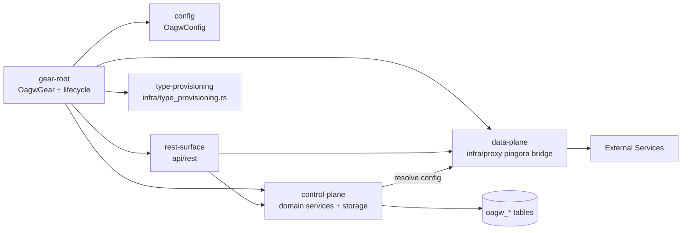
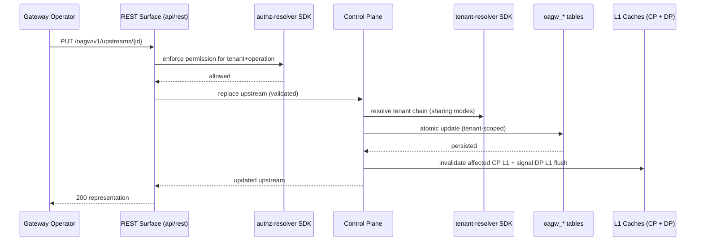
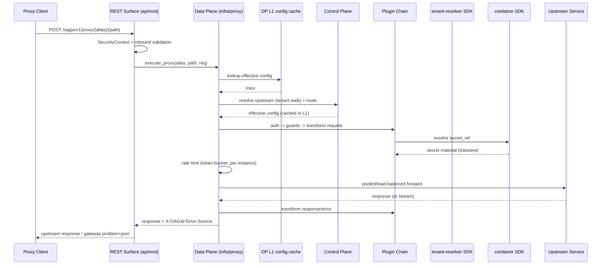
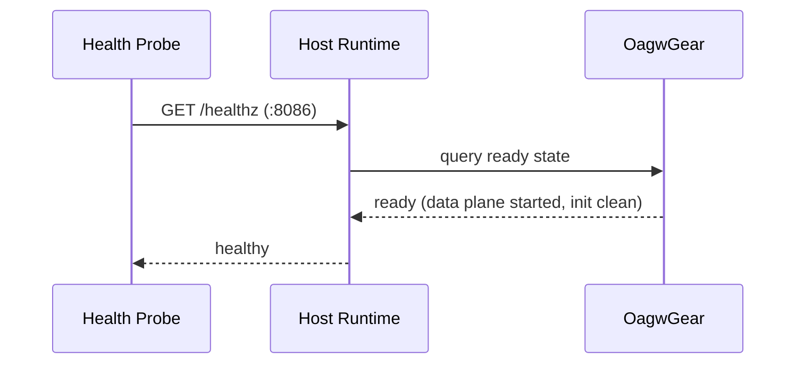

# Technical Design — OAGW Gear


<!-- toc -->

- [1. Architecture Overview](#1-architecture-overview)
  - [1.1 Architectural Vision](#11-architectural-vision)
  - [1.2 Architecture Drivers](#12-architecture-drivers)
  - [1.3 Architecture Layers](#13-architecture-layers)
- [2. Principles & Constraints](#2-principles--constraints)
  - [2.1 Design Principles](#21-design-principles)
  - [2.2 Constraints](#22-constraints)
- [3. Technical Architecture](#3-technical-architecture)
  - [3.1 Domain Model](#31-domain-model)
  - [3.2 Component Model](#32-component-model)
  - [3.3 API Contracts](#33-api-contracts)
  - [3.4 Internal Dependencies](#34-internal-dependencies)
  - [3.5 External Dependencies](#35-external-dependencies)
  - [3.6 Interactions & Sequences](#36-interactions--sequences)
  - [3.7 Database schemas & tables](#37-database-schemas--tables)
  - [3.8 Deployment Topology](#38-deployment-topology)
- [4. Additional context](#4-additional-context)
- [5. Traceability](#5-traceability)

<!-- /toc -->

- [x] `p3` - **ID**: `cpt-cf-oagw-design-oagw-gear-bootstrap`
## 1. Architecture Overview

### 1.1 Architectural Vision

This design specifies the technical architecture for the **OAGW Gear implementation change** (`cf-gears-oagw` v0.4.0, lib `oagw`): making the empty `src/lib.rs` at `gears/system/oagw/oagw/` a live, routable, healthy gear inside the `cf-gears-example-server` host. The change does not re-decide the product contract — the authoritative PRD, DESIGN, ADRs 0001–0009, and JSON Schemas already own routing, plugin, rate-limit, CORS, caching, state, and error-source behavior. This design owns the implementation mapping recorded in pipeline ADR 0010: registration mechanism, lifecycle wiring, gear-relative route composition, capability/dependency declarations, the configuration model, the DDD-Light module layout, and the pingora-based data-plane engine, all faithful to that decision.

The architecture follows the authoritative **Control Plane / Data Plane separation within a single gear**. A single `OagwGear` struct is declared with the platform `#[toolkit::gear(...)]` macro (`name = "oagw"`, `deps = [authz_resolver, types_registry, tenant_resolver, credstore]`, `capabilities = [db, stateful, rest]`), so the host registry discovers it through `toolkit::inventory::submit!` exactly as sibling gears do. The gear reads its configuration from the host-injected `gears.oagw.config` block, provisions its `oagw_*` control-plane tables via `DatabaseCapability::migrations`, registers its management and proxy routes gear-relative under `/oagw/v1/...` via `RestApiCapability::register_rest`, and runs its data plane as a `RunnableCapability::{start, stop}` service. The host's `ApiGateway::apply_prefix` composes the gear-relative prefix under any deployment prefix — empty in e2e, so routes are served at `/oagw/v1/...` directly; the `/api/oagw/v1/...` form in the authoritative docs is the api-gateway-nested spelling supplied by the host, never embedded by the gear.

The design philosophy is reuse over reimplementation and convention over bespoke wiring: the data plane reuses the already-declared pingora-* crates for pooled, load-balanced, streaming transport and the `pingora-memory-cache` token cache (ADR 0008), bridged into the Axum host in `infra/proxy`; platform capabilities are consumed through in-process `-sdk` clients resolved from `ctx.client_hub()`; and state ownership follows the authoritative state-management decisions — control-plane-authoritative persistence, data-plane-owned L1 config caches (10 000 CP / 1 000 DP entries) and in-memory rate limiters, with explicit invalidation on writes. This satisfies the pipeline PRD's functional surface (registration/lifecycle, management, data-plane proxying, error semantics, security) and the DoD build/start/health/test gates, while keeping every production-security baseline (HTTPS-only default, SSRF policy on by default, credential isolation) intact despite the e2e test allowances.

### 1.2 Architecture Drivers

Requirements that significantly influence architecture decisions.

**ADRs**: `cpt-cf-oagw-adr-bootstrap-and-composition`

#### Functional Drivers

| Requirement | Design Response |
|-------------|------------------|
| `cpt-cf-oagw-fr-gear-registration` | The crate's entry point is the `OagwGear` struct declared with `#[toolkit::gear(...)]`, which expands to `toolkit::inventory::submit!` and is linked by the host through `registered_gears.rs` behind the `oagw` feature — the exact discovery path the host registry consumes. |
| `cpt-cf-oagw-fr-gear-lifecycle` | `Gear::init` (config via `ctx.config_or_default::<OagwConfig>()`, database via `ctx.db_required()`, `-sdk` clients via `ctx.client_hub()`), `DatabaseCapability::migrations`, `RestApiCapability::register_rest`, and `RunnableCapability::{start, stop}` complete the lifecycle; init failures fail startup loudly and readiness feeds host health. |
| `cpt-cf-oagw-fr-gear-configuration` | A single `OagwConfig` struct (serde, `gears.oagw.config` block) with safe defaults (`proxy_timeout_secs` 2, `allow_http_upstream` false, `ssrf_policy.enabled` true) plus additive ADR 0008 keys (`token_cache_ttl_secs` 300, `token_cache_capacity` 10 000); startup-validated and fail-loud. |
| `cpt-cf-oagw-fr-route-serving` | All management and proxy routes are registered gear-relative under `/oagw/v1/...` (no `/api` segment) and composed by the host's `apply_prefix`; when started the gear owns every path on its surface, so nothing falls through to the host's unhandled-path response. |
| `cpt-cf-oagw-fr-control-plane-crud` | A domain `ControlPlaneService` (upstream/route/plugin CRUD with authoritative validation, alias enforcement, enable/disable and ancestor-disable propagation, tenant scoping) over SeaORM repositories against the `oagw_*` tables; management operations are validated and tenant-scoped before any state change. |
| `cpt-cf-oagw-fr-config-hierarchy` | Effective configuration is computed by walking the tenant chain via the tenant-resolver SDK, applying authoritative sharing modes (`private`/`inherit`/`enforce`), merge rules (stricter-wins rate, plugin concatenation, CORS union, tags add-only union), and alias shadowing with enforced-ancestor semantics. |
| `cpt-cf-oagw-fr-config-caching` | Two-tier in-memory config caching (control-plane L1 ~10 000 entries, data-plane L1 ~1 000 entries) with explicit invalidation on every successful management write so config writes are visible to subsequent proxy requests without a stale window; no upstream response caching. |
| `cpt-cf-oagw-fr-data-plane-proxy` | A `DataPlaneService` in `infra/proxy` over the pingora load-balancing/proxy stack: alias resolution (tenant-hierarchy walk), route matching, config layering (upstream < route < tenant), plugin-chain execution, and pooled/load-balanced/streaming forwarding; no automatic full-request retries, connector-level failover permitted. |
| `cpt-cf-oagw-fr-credential-injection` | Built-in auth plugins (noop, apikey, oauth2_client_cred, oauth2_client_cred_basic) resolve secret material from the credential-store SDK by `cred://` reference at request time; OAuth2 token caching via `pingora-memory-cache` with bounded TTL/capacity per ADR 0008. |
| `cpt-cf-oagw-fr-rate-limit-enforcement` | Token-bucket (default) rate limiting with dual-rate/cost/scope/strategy semantics, response headers, and hierarchical stricter-wins, enforced by in-memory limiters owned by the gear (ADR 0003/0006); per-instance for e2e, distributed coordination out of scope. |
| `cpt-cf-oagw-fr-stream-proxying` | The pingora bridge streams HTTP request/response and SSE with correct connection lifecycle and client-disconnect propagation; WebSocket session flows follow the authoritative design; the error-source header is carried on streaming responses. |
| `cpt-cf-oagw-fr-plugin-execution` | A built-in plugin runtime (Auth → Guards → Transform request → upstream call → Transform response/error; upstream before route plugins) with registries for the built-in catalog and plugin-definition CRUD (create/read/delete, immutability, in-use protection); catalog-only identifiers remain registered for GTS validation. |
| `cpt-cf-oagw-fr-cors-enforcement` | Built-in CORS handling per ADR 0004: per-upstream/route config, local permissive preflight at handler level, exact-match origin validation on actual requests, deny-by-default, secure defaults, and `Vary: Origin`. |
| `cpt-cf-oagw-fr-error-source-semantics` | Every response carries `X-OAGW-Error-Source: gateway|upstream` (ADR 0007); gateway errors are RFC 9457 problem-details with GTS-typed identifiers, upstream failures pass through unchanged, and inbound validation rejects malformed requests before forwarding. |
| `cpt-cf-oagw-fr-inbound-authz` | Inbound requests carry `toolkit-security::SecurityContext`; the gear enforces the authoritative permission model through the authz-resolver SDK (policy enforcer) for the calling tenant — management create/override/read/delete for upstream/route/plugin types and `gts.cf.core.oagw.proxy.v1~:invoke` with the ownership rule for the proxy surface. |
| `cpt-cf-oagw-fr-security-policy` | HTTPS-only upstream default with scheme allowlist, SSRF policy (DNS/IP validation rules consumed per authority, well-known internal header stripping, request path/query validation) honored via `ssrf_policy.enabled`, and body-size limits with rejection before buffering. |
| `cpt-cf-oagw-fr-secret-resolution` | Secret material is resolved exclusively through the credential-store SDK by reference; tenant-access decisions fail closed as the authoritative authentication error, credential-store unavailability is handled via bounded cached-token serving, and no secret value ever enters logs, errors, responses, metrics, or cache keys. |

#### NFR Allocation

This table maps non-functional requirements from PRD to specific design/architecture responses, demonstrating how quality attributes are realized.

| NFR ID | NFR Summary | Allocated To | Design Response | Verification Approach |
|--------|-------------|--------------|-----------------|----------------------|
| `cpt-cf-oagw-nfr-build-integration` | DoD build succeeds under workspace lint denials on edition 2024 / resolver 3 / rust 1.95.0 | Whole crate (`gear.rs`, `api/rest`, `domain`, `infra`) | Module layout follows workspace conventions; only workspace-declared dependencies are used; code is written against clippy::pedantic without `unwrap`/`expect`. | Automated CI build of the DoD command (`cargo build --release --bin cf-gears-example-server --features "$(cat config/e2e-features.txt)"`) exits 0. |
| `cpt-cf-oagw-nfr-startup-health` | Server starts on e2e config, binds :8086, `/healthz` healthy | `OagwGear` lifecycle (`Gear::init`, `RunnableCapability::start`) | Fail-loud init, readiness signaled only after data-plane service starts, health contribution aggregated by the host. | Automated e2e smoke + integration test asserting startup completes and health stays healthy. |
| `cpt-cf-oagw-nfr-proxy-overhead` | <10 ms added latency at p95; plugin timeouts enforced | Data plane (`infra/proxy`), L1 config caches, rate limiters | In-memory L1 config caches avoid DB reads on the hot path; pingora pooled connections; plugin-execution timeouts bound misbehaving plugins. | Benchmarks over a representative proxy workload measuring added latency; timeout tests. |
| `cpt-cf-oagw-nfr-availability` | 99.9% availability; circuit breaker prevents cascade failures | Data plane (`infra/proxy`, connector layer) | Configurable `proxy_timeout_secs`; circuit breaker as core resilience policy per authoritative thresholds; graceful streaming lifecycle. | Availability soak + failure-injection tests for circuit-breaker trips and timeouts. |
| `cpt-cf-oagw-nfr-concurrency-safety` | No races/panics/nondeterminism under concurrent proxy + management traffic | All shared state (limiters, caches, registries, token cache) | DashMap/ArcSwap/parking-lot-style concurrent structures; explicit ownership per ADR 0006; bounded token cache with stamped identity keys. | Concurrent stress tests (proxy + management + rate-limit + invalidation) run without panic or race; clean shutdown verified. |
| `cpt-cf-oagw-nfr-secret-hygiene` | Zero secret material in logs, errors, responses, metrics, cache keys | Credential injection, token cache, logging/metrics paths | Secrets exist only transiently in memory; logging/metrics never include header/body/secret fields; token cache keys encode identity, not values. | Assertion-based tests scanning logs/errors/responses/metrics for credential material. |
| `cpt-cf-oagw-nfr-ssrf-safety` | Zero SSRF vulnerabilities as shipped | SSRF policy (`infra/config` + data plane) | HTTPS-only default, scheme allowlist, DNS/IP validation rules consumed per authority, internal-header stripping, body limits; e2e allowances are config-gated and never the default. | Security review/scan of the outbound path plus default-posture tests independent of e2e allowances. |
| `cpt-cf-oagw-nfr-observability-metrics` | 100% proxy requests logged with correlation ID; authoritative metrics vocabulary, no PII/secrets | Logging/metrics instrumentation in data plane and REST surface | Structured request logging with correlation IDs; Prometheus metrics per authoritative vocabulary with cardinality controls (no tenant labels, normalized route/method/status). | Integration tests asserting log presence/correlation IDs and metric emission; log-volume sampling per authority. |
| `cpt-cf-oagw-nfr-test-coverage` | Crate-level unit + integration tests covering implemented behavior; acceptance dir untouched | All modules | Tests exercise registration/lifecycle, config parsing/defaults, migrations, management, proxy, credential injection, rate limiting, CORS, caching/invalidation, error semantics. | Green crate-level test suites; diff check that `testing/e2e/gears/oagw/` receives no code. |

Non-applicability (per pipeline PRD §6.2): accessibility and internationalization NFRs are not applicable because the gear is server-side middleware with no end-user UI and an English, operational API surface; regulatory/privacy compliance is not applicable because the gear processes no end-user personal, healthcare, or payment data; the Starlark-sandbox NFR and distributed/Redis rate-limiting NFR are excluded from this change (out of scope per PRD §4.2) and remain tracked on the authoritative roadmap. No silent omissions — these are deliberately outside the change dimension.

### 1.3 Architecture Layers

```mermaid
graph TB
    subgraph Host[cf-gears-example-server]
        HG[API Gateway<br/>apply_prefix + auth + health] 
        O[OagwGear]
        HK[Host runtime<br/>gear registry, config injection, client hub]
        subgraph O
            REST[api/rest<br/>management + proxy routers]
            DOM[domain<br/>ControlPlaneService / DataPlaneService traits & models]
            INFRA[infra<br/>proxy pingora bridge, storage, type_provisioning]
        end
    end
    HK -->|'#[toolkit::gear]' inventory| O
    HG -->|'/oagw/v1/...'| REST
    REST --> DOM
    DOM --> INFRA
    INFRA -->|SDK clients| P1[authz-resolver]
    INFRA -->|SDK clients| P2[types-registry]
    INFRA -->|SDK clients| P3[tenant-resolver]
    INFRA -->|SDK clients| P4[credstore]
    INFRA -->|outbound pooled transport| UP[External Services]
```

- [x] `p3` - **ID**: `cpt-cf-oagw-tech-oagw-stack`

| Layer | Responsibility | Technology |
|-------|---------------|------------|
| Transport / REST (`api/rest`) | Axum handlers, DTOs, extractors, `OperationBuilder` route registration for the management and proxy surfaces; error mapping to the authoritative problem-details format | Rust, Axum, toolkit `OperationBuilder`, utoipa |
| Application / Lifecycle (`gear.rs`, `config.rs`) | Gear declaration, lifecycle hooks, config loading/validation, capability wiring, route and migration registration | `#[toolkit::gear(...)]` macro, toolkit traits, serde `OagwConfig` |
| Domain (`domain`) | `ControlPlaneService` + `DataPlaneService` traits and domain models/repositories, plugin trait definitions, domain errors | Rust trait objects, GTS identifiers |
| Infrastructure (`infra`) | SeaORM repositories over `toolkit-db`, pingora proxy bridge (`infra/proxy`), plugin registries, GTS type provisioning (`infra/type_provisioning.rs`), L1 config caches and in-memory limiters | SeaORM, `toolkit-db`, pingora-proxy/core/load-balancing/http, `pingora-memory-cache`, credstore/authz/tenant/types-registry SDKs |

## 2. Principles & Constraints

### 2.1 Design Principles

Principles guide decisions within the bounds set by the constraints in §2.2, which always dominate. Where principles themselves conflict, the resolution order is: `cpt-cf-oagw-principle-fail-loud-config` and `cpt-cf-oagw-principle-ssrf-defense-in-depth` take precedence over operational convenience (including e2e test allowances), and `cpt-cf-oagw-principle-cp-authoritative-dp-bounded` takes precedence over any per-request optimization that would introduce cross-request state or persistence on the proxy hot path.

#### Gear-Relative Routing and Host Agnosticism

- [x] `p2` - **ID**: `cpt-cf-oagw-principle-gear-relative-routing`

The gear registers all routes at gear-relative roots (`/oagw/v1/upstreams`, `/oagw/v1/routes`, `/oagw/v1/plugins`, `/oagw/v1/proxy/...`) and never embeds `/api` or any host-owned prefix. The host's `ApiGateway::apply_prefix` nests the router under whatever `prefix_path` a deployment configures — empty in e2e (served at `/oagw/v1/...`), `/api`-nested in deployments that set a prefix — keeping the crate host-agnostic and the contract paths reachable end-to-end once host composition is applied. This directly implements the ADR 0010 composition decision.

**ADRs**: `cpt-cf-oagw-adr-bootstrap-and-composition`

#### Pingora Ecosystem Reuse

- [x] `p2` - **ID**: `cpt-cf-oagw-principle-pingora-reuse`

The data plane is built on the pingora-* crates already declared in the manifest (`pingora-proxy`, `pingora-core`, `pingora-load-balancing`, `pingora-http`) plus `pingora-memory-cache` for the OAuth2 token cache. Connection pooling, load balancing, multi-endpoint selection, HTTP/2 adaptation, and streaming come from the pingora stack rather than a bespoke hyper client, and the gear bridges pingora into the Axum host inside `infra/proxy`. This keeps the already-declared dependency set unchanged and aligns with the authoritative latency and error-source semantics.

**ADRs**: `cpt-cf-oagw-adr-bootstrap-and-composition`

#### Control-Plane Authoritative, Data-Plane Bounded State

- [x] `p2` - **ID**: `cpt-cf-oagw-principle-cp-authoritative-dp-bounded`

The control plane is authoritative for configuration: management writes persist to the `oagw_*` tables and are validated and tenant-scoped first; the data plane owns only bounded, purpose-specific state — the L1 config caches (10 000-entry CP cache, 1 000-entry DP cache, no TTL, explicit invalidation) and per-instance in-memory rate limiters (ADR 0006). Every successful management write invalidates the affected cached entries so proxy requests observe the new configuration without a stale window. The gear never caches upstream responses.

**ADRs**: `cpt-cf-oagw-adr-bootstrap-and-composition`

#### Fail-Loud Configuration

- [x] `p2` - **ID**: `cpt-cf-oagw-principle-fail-loud-config`

Configuration is validated at startup and every field has a safe default so the gear works with a minimal or absent block. Unknown keys, out-of-range values, and semantic violations (e.g., invalid SSRF/allowance combinations) reject startup with a clear error rather than booting into a half-configured state. Runtime behavior is driven only by validated configuration. This satisfies `cpt-cf-oagw-fr-gear-configuration` and the lifecycle fail-loud requirement.

**ADRs**: `cpt-cf-oagw-adr-bootstrap-and-composition`

#### SSRF Defense in Depth

- [x] `p2` - **ID**: `cpt-cf-oagw-principle-ssrf-defense-in-depth`

As the platform's single outbound path, the gear layers SSRF defenses: HTTPS-only upstream connections by default, a config-gated HTTP allowance (the e2e `allow_http_upstream: true` is an explicit test allowance, never a default), DNS/IP validation and scheme allowlisting, stripping of well-known internal headers, request path/query validation against route configuration, and body-size rejection before buffering. The e2e security allowances are honored only when configured and never weaken the default security baseline (`cpt-cf-oagw-fr-security-policy`, `cpt-cf-oagw-nfr-ssrf-safety`).

**ADRs**: `cpt-cf-oagw-adr-bootstrap-and-composition`

### 2.2 Constraints

#### Workspace Lint Denials

- [x] `p2` - **ID**: `cpt-cf-oagw-constraint-workspace-lints`

The crate must compile cleanly under the workspace's lint denials: `clippy::pedantic` with `unwrap`/`expect` denied. Every module in the new implementation must be written against these lints (no unwraps, no `expect`, no pedantic violations treated as warnings). Impact: error handling is fallible-and-explicit throughout; shared-state access uses checked patterns.

**ADRs**: `cpt-cf-oagw-adr-bootstrap-and-composition`

#### Workspace Toolchain and Edition

- [x] `p2` - **ID**: `cpt-cf-oagw-constraint-toolchain`

The crate builds on the workspace toolchain contract: Rust edition 2024, Cargo resolver 3, and `rust-version` 1.95.0. All code must target this toolchain — no features or syntax outside it, and the DoD build must pass on it.

**ADRs**: `cpt-cf-oagw-adr-bootstrap-and-composition`

#### Offline, Locked Dependency Set

- [x] `p2` - **ID**: `cpt-cf-oagw-constraint-locked-deps`

The change must not add new crates or alter the locked dependency graph. The implementation draws only on the already-declared dependencies in `gears/system/oagw/oagw/Cargo.toml` (toolkit, toolkit-*, SDK crates, pingora-* and `pingora-memory-cache`, axum, serde, dashmap, psl, etc.). Impact: the data plane is bounded to what the declared pingora set provides, and Starlark execution remains out of scope.

**ADRs**: `cpt-cf-oagw-adr-bootstrap-and-composition`

#### No Embedded `/api` Segment

- [x] `p2` - **ID**: `cpt-cf-oagw-constraint-no-api-segment`

The gear must never embed `/api` (or any host prefix) in its own route table. The `/api/oagw/v1/...` spelling in the authoritative docs is the api-gateway-nested form supplied by the host; embedding it would break the e2e mount (empty prefix) and duplicate the prefix wherever the host sets one. Impact: route auth policy matches on unprefixed `OperationBuilder` paths, composing cleanly with the host's auth layer.

**ADRs**: `cpt-cf-oagw-adr-bootstrap-and-composition`

#### Authoritative Contract Immutability

- [x] `p2` - **ID**: `cpt-cf-oagw-constraint-authoritative-immutable`

The authoritative product contract (`gears/system/oagw/docs/PRD.md`, `docs/DESIGN.md`, `docs/ADR/0001-*.md` … `0009-*.md`, `docs/schemas/`) is read-only for this change. The implementation maps it faithfully; any contractual discrepancy found during implementation is reported as a deviation rather than silently changed. The acceptance path `testing/e2e/gears/oagw/` is likewise owned by acceptance and must not receive code from this change.

**ADRs**: `cpt-cf-oagw-adr-bootstrap-and-composition`

## 3. Technical Architecture

### 3.1 Domain Model

**Technology**: Rust structs (`serde`-serializable, JSON-blob storage in the DB), GTS identifiers for resource identification and plugin typing; authoritative JSON Schemas define the wire shapes.

**Location**: `gears/system/oagw/oagw/src/domain/` (upstream/route/plugin models, service traits, repository contracts); authoritative schema files at `gears/system/oagw/docs/schemas/upstream.v1.schema.json` and `gears/system/oagw/docs/schemas/route.v1.schema.json`.

**Core Entities**:

| Entity | Description | Schema |
|--------|-------------|--------|
| Upstream | Tenant-scoped root configuration object representing an external service; server endpoints, protocol, auth config, headers, rate limits, CORS, plugin bindings, tags; unique per `(tenant_id, alias)` | [upstream.v1.schema.json](../../schemas/upstream.v1.schema.json) |
| Route | Belongs to an upstream; match rules (HTTP method/path; gRPC matching planned, not implemented), priority, enable/disable, and route-level overrides | [route.v1.schema.json](../../schemas/route.v1.schema.json) |
| Plugin | Named (built-in/catalog) or custom (UUID-backed) processors of type Auth/Guard/Transform, identified by GTS identifier and bound with positional order to upstreams/routes | authoritative DESIGN §3.1 |
| ServerConfig / Endpoint | The endpoint pool of an upstream (scheme/host/port), forming a load-balance pool with uniform scheme/port/protocol | upstream.v1.schema.json |
| EffectiveConfig | The runtime-merged view (upstream < route < tenant) produced by the hierarchy walk; never persisted, always derived and cached in L1 | derived |

**Relationships**:
- Upstream → Route: `1 — *` (route belongs to upstream; `upstream_id` immutable).
- Upstream → ServerConfig → Endpoint: `1 — *` (endpoint pool).
- Upstream/Route → Plugin: bindings `* — *` through ordered binding tables (`oagw_upstream_plugin` / `oagw_route_plugin`), resolved via GTS identifier — named plugins via in-process registry, custom plugins via `oagw_plugin`.
- Upstream → EffectiveConfig: `1 — *` tenant-chain walk with alias shadowing; enforced ancestor constraints always in force.

**Core invariants**: tenant scoping on all reads/writes (no cross-tenant access); alias immutable once set and unique per tenant; plugin definitions immutable with in-use deletion protection; route match determinism (no two enabled routes share `(path_prefix, priority)` for the same method under one upstream); all multi-table updates atomic in a single transaction.

### 3.2 Component Model

The gear is a single crate with six cooperating components following DDD-Light layering (domain has no infra dependencies; infra implements domain traits; `api/rest` maps HTTP to domain types).



#### OagwGear Gear Root and Lifecycle

- [x] `p2` - **ID**: `cpt-cf-oagw-component-gear-root`

##### Why this component exists

The empty `src/lib.rs` is the root cause of the change — without a declared gear nothing registers the crate with the host, so none of its behavior is reachable. `gear.rs` (or `lib.rs`) owns the `OagwGear` declaration and all lifecycle wiring so the host discovers, configures, and routes for the gear.

##### Responsibility scope

- Declare `OagwGear` with `#[toolkit::gear(name = "oagw", deps = [authz_resolver, types_registry, tenant_resolver, credstore], capabilities = [db, stateful, rest])]`.
- Implement `Gear::init`: load `cpt-cf-oagw-interface-config-model` via `ctx.config_or_default::<OagwConfig>()`, acquire the DB via `ctx.db_required()`, and register/get the `-sdk` client traits (`authz_resolver_sdk`, `types_registry_sdk`, `tenant_resolver_sdk`, `credstore_sdk`) through `ctx.client_hub()`; validate config and fail loud.
- Implement `RestApiCapability::register_rest` (mount management + proxy routers), `DatabaseCapability::migrations` (`oagw_*` tables), and `RunnableCapability::{start, stop}` (start/stop the data-plane service and p2 background concerns); owns gear-relative route registration.

##### Responsibility boundaries

- Does NOT host the HTTP listener (the host's API gateway does) and does NOT embed `/api`.
- Does NOT implement product behavior (routing matrix, plugin traits, rate-limit algorithms) — those live in domain/infra components per the authoritative ADRs.
- Does NOT own early-initialized `system` capability ordering (that is the types-registry role); it declares `stateful` rather than `system`.

##### Related components (by ID)

- `cpt-cf-oagw-component-config` — calls (reads validated `OagwConfig` during init)
- `cpt-cf-oagw-component-rest-surface` — calls (registers its routers)
- `cpt-cf-oagw-component-control-plane` — calls (initializes and holds service instances)
- `cpt-cf-oagw-component-data-plane` — calls (starts/stops the data-plane service)
- `cpt-cf-oagw-component-type-provisioning` — calls (runs GTS catalog registration during init)

#### OagwConfig Configuration Model

- [x] `p2` - **ID**: `cpt-cf-oagw-component-config`

##### Why this component exists

The e2e configuration already reserves a `gears.oagw.config` gear block; the gear must read it with safe defaults so both operators and the host have a single, validated contract for runtime knobs.

##### Responsibility scope

- Define `OagwConfig` (serde, `deny_unknown_fields` with `#[serde(default)]`): `proxy_timeout_secs` (default 2), `allow_http_upstream` (default false), `ssrf_policy.enabled` (default true), and the additive ADR 0008 keys `token_cache_ttl_secs` (default 300) and `token_cache_capacity` (default 10 000).
- Startup validation of every field; reject invalid configuration loudly at init.
- Thread derived settings (token-cache config, timeout, allowances, SSRF policy) into the data-plane service and plugin registry.

##### Responsibility boundaries

- Does NOT read host-level configuration outside its own block.
- Does NOT mutate configuration at runtime (configuration is immutable after startup; changes come from the management API through the control plane, not through config reload).

##### Related components (by ID)

- `cpt-cf-oagw-component-gear-root` — depends on (consumed by `Gear::init`)
- `cpt-cf-oagw-component-data-plane` — owns data for (supplies proxy/SSRF/token-cache settings to the data plane)

#### REST Surface (`api/rest`)

- [x] `p2` - **ID**: `cpt-cf-oagw-component-rest-surface`

##### Why this component exists

The gear's whole value is delivered over HTTP — control-plane management and data-plane proxying — and the host routes HTTP into each gear's `register_rest` router. This component is the transport-to-domain boundary.

##### Responsibility scope

- Register gear-relative routes with `OperationBuilder` (`/oagw/v1/upstreams`, `/oagw/v1/routes`, `/oagw/v1/plugins`, `/oagw/v1/proxy/{alias}/{*path}`), management and proxy surfaces.
- Map HTTP <-> domain types (DTOs/extractors), apply inbound validation, enforce inbound authorization via the authz-resolver SDK against `SecurityContext`, and map domain errors to the authoritative RFC 9457 problem-details responses with `X-OAGW-Error-Source`.

##### Responsibility boundaries

- Does NOT implement business logic or persistence (delegates to control plane/data plane).
- Does NOT inject `SecurityContext` itself (host-supplied) but enforces it; does NOT embed `/api` in any path.
- Does NOT re-specify the full API (spec-level detail belongs to FEATURE); this design documents the endpoint overview only.

##### Related components (by ID)

- `cpt-cf-oagw-component-gear-root` — depends on (registered by it)
- `cpt-cf-oagw-component-control-plane` — calls (management operations)
- `cpt-cf-oagw-component-data-plane` — calls (proxy orchestration)

#### Control Plane (`domain` + `infra/storage`)

- [x] `p2` - **ID**: `cpt-cf-oagw-component-control-plane`

##### Why this component exists

The configuration backbone: operators express upstreams, routes, and plugins through the management surface, and the data plane cannot serve anything without the validated, tenant-scoped, hierarchy-aware configuration this component maintains.

##### Responsibility scope

- `ControlPlaneService`: upstream/route/plugin CRUD with authoritative validation, alias derivation/enforcement, enable/disable with ancestor-disable propagation, tenant scoping, and hierarchical config computation (sharing modes, merge rules, alias shadowing via the tenant-resolver SDK).
- Repository implementations (SeaORM) over the `oagw_*` tables with tenant scoping; atomic multi-table writes.
- L1 configuration cache ownership (10 000 entries) and invalidation of affected entries plus DP L1 on every successful write.

##### Responsibility boundaries

- Does NOT perform outbound HTTP calls (data plane's job).
- Does NOT execute plugins (plugin traits are implemented in `infra/plugin`, executed by the data plane).
- Does NOT implement distributed/L2 caching (out of scope for e2e; L1 only).

##### Related components (by ID)

- `cpt-cf-oagw-component-rest-surface` — called by (serves management operations)
- `cpt-cf-oagw-component-data-plane` — publishes to (supplies resolved config to DP; signals DP cache flush)
- `cpt-cf-oagw-component-gear-root` — depends on (initialized by it)

#### Data Plane (`infra/proxy`)

- [x] `p2` - **ID**: `cpt-cf-oagw-component-data-plane`

##### Why this component exists

The core value proposition and the largest missing surface: proxying requests to external services with credential injection, rate limiting, policy enforcement, and error-source attribution — on a pooled, load-balanced, streaming transport.

##### Responsibility scope

- Pingora-based proxy bridge (`pingora-proxy`/`core`/`load-balancing`/`http`) bridged into the Axum host: request mapping, hop-by-hop header handling, streaming (HTTP/SSE/WebSocket), connection pooling, load balancing, multi-endpoint selection.
- Alias resolution (tenant-hierarchy walk with shadowing), route matching, effective-config layering, plugin-chain execution (auth/guards/transforms), credential injection via credstore SDK with `pingora-memory-cache` token cache, token-bucket rate limiting, X-OAGW-Target-Host handling, and `X-OAGW-Error-Source` wiring per ADR 0007.
- Owns DP L1 config cache (1 000 entries) and in-memory rate limiters; implements `RunnableCapability::{start, stop}` for its runtime and sockets.

##### Responsibility boundaries

- Does NOT persist configuration (control plane is authoritative).
- Does NOT cache upstream responses, does NOT retry failed upstream requests, and does NOT do distributed rate limiting.
- Does NOT implement Starlark plugin execution (out of scope).
- No secrets in logs, errors, responses, metrics, or cache keys (credential material is transient only).

##### Related components (by ID)

- `cpt-cf-oagw-component-rest-surface` — called by (serves proxy requests)
- `cpt-cf-oagw-component-control-plane` — depends on (resolves effective configuration)
- `cpt-cf-oagw-component-gear-root` — depends on (started/stopped by it)
- `cpt-cf-oagw-component-config` — depends on (consumes OagwConfig settings)

#### Type Provisioning (`infra/type_provisioning.rs`)

- [x] `p2` - **ID**: `cpt-cf-oagw-component-type-provisioning`

##### Why this component exists

The authoritative contract requires the gear to register its GTS type catalog (upstream, route, plugin, and protocol identifiers) with the types registry and to validate identifiers against it, so plugin/protocol identifiers used in the API resolve consistently platform-wide.

##### Responsibility scope

- Register the OAGW GTS catalog (upstream/route/plugin base types and the built-in named-plugin identifiers, including catalog-only identifiers) with the types-registry SDK during `Gear::init`.
- Provide identifier validation helpers used by the control plane and the plugin registries.

##### Responsibility boundaries

- Does NOT own the registry itself (types-registry gear does) and does NOT seed the process-wide GTS inventory (types-registry's `system` role).
- Does NOT need a `system`/`post_init` lifecycle — registration is complete within `Gear::init`.

##### Related components (by ID)

- `cpt-cf-oagw-component-gear-root` — depends on (invoked during init)
- `cpt-cf-oagw-component-control-plane` — publishes to (validated catalog for CRUD)

### 3.3 API Contracts

- [x] `p2` - **ID**: `cpt-cf-oagw-interface-oagw-rest-surface`

- **Contracts**: `cpt-cf-oagw-contract-host-runtime`, `cpt-cf-oagw-contract-authz-resolver`, `cpt-cf-oagw-contract-gts-registry`, `cpt-cf-oagw-contract-tenant-resolver`, `cpt-cf-oagw-contract-secret-store`
- **Technology**: REST (Axum routers via `OperationBuilder`, OpenAPI via utoipa)
- **Location**: `gears/system/oagw/oagw/src/api/rest/routes.rs`

The gear's externally observable REST surface corresponds to the authoritative interfaces `cpt-cf-oagw-interface-management-api` and `cpt-cf-oagw-interface-proxy-api`, whose full request/response shapes, validation, and error bodies are defined in the authoritative DESIGN §3.3 and schemas (not restated here — spec-level detail belongs to FEATURE). Routes are registered gear-relative (`/oagw/v1/...`) and composed by the host's `apply_prefix`; the `/api/oagw/v1/...` spelling in the authoritative docs is the api-gateway-nested form. The crate-level interfaces `cpt-cf-oagw-interface-gear-registration` and `cpt-cf-oagw-interface-config-model` are the pipeline PRD's public registration entry and configuration surface this design implements.

**Endpoints Overview**:

| Method | Path (gear-relative) | Description | Stability |
|--------|------|-------------|-----------|
| `POST` | `/oagw/v1/upstreams` | Create upstream (alias derivation/enforcement, tenant-scoped) | unstable |
| `GET` | `/oagw/v1/upstreams` | List upstreams (OData `$filter/$select/$orderby/$top/$skip`) | unstable |
| `GET` | `/oagw/v1/upstreams/{id}` | Get upstream by anonymous GTS id | unstable |
| `PUT` | `/oagw/v1/upstreams/{id}` | Replace upstream (full replacement; alias update rules) | unstable |
| `DELETE` | `/oagw/v1/upstreams/{id}` | Delete upstream | unstable |
| `POST` | `/oagw/v1/routes` | Create route | unstable |
| `GET` | `/oagw/v1/routes` | List routes | unstable |
| `GET` | `/oagw/v1/routes/{id}` | Get route | unstable |
| `PUT` | `/oagw/v1/routes/{id}` | Replace route (`upstream_id` immutable) | unstable |
| `DELETE` | `/oagw/v1/routes/{id}` | Delete route | unstable |
| `POST` | `/oagw/v1/plugins` | Create plugin definition (immutable after creation) | unstable |
| `GET` | `/oagw/v1/plugins` | List plugin definitions | unstable |
| `GET` | `/oagw/v1/plugins/{id}` | Get plugin definition | unstable |
| `DELETE` | `/oagw/v1/plugins/{id}` | Delete plugin (409 PluginInUse when referenced) | unstable |
| `{METHOD}` | `/oagw/v1/proxy/{alias}/{*path}` | Proxy surface: resolve alias, match route, execute plugins, forward, stream | unstable |

Error semantics: gateway errors are RFC 9457 `application/problem+json` with GTS-typed identifiers and the authoritative catalog classes (400/401/404/409/413/429/500/502/503/504); upstream failures pass through unchanged; every response carries `X-OAGW-Error-Source: gateway|upstream`. Inbound authorization is enforced per the authoritative permission model (see `cpt-cf-oagw-fr-inbound-authz`).

### 3.4 Internal Dependencies

All inter-module communication goes through versioned contracts, SDK clients, or plugin interfaces — never through internal types.

| Dependency Module | Interface Used | Purpose |
|-------------------|----------------|----------|
| authz-resolver | `authz_resolver_sdk` client (policy enforcer) | Evaluate the authoritative permission model for management and proxy surfaces per calling tenant |
| types-registry | `types_registry_sdk` client | Register GTS catalog in `Gear::init` (`infra/type_provisioning.rs`); validate plugin/protocol identifiers |
| tenant-resolver | `tenant_resolver_sdk` client | Resolve tenant hierarchy/ancestry for sharing modes, alias shadowing, enforced ancestor constraints |
| credstore | `credstore_sdk` client | Resolve secret material by `cred://` reference at credential-injection time; tenant-access decisions honored |
| toolkit (host runtime) | `#[toolkit::gear(...)]`, `GearCtx` (`config_or_default`, `db_required`, `client_hub`), toolkit traits | Lifecycle, config injection, database slot, capability registration, route mounting, health |
| toolkit-auth / toolkit-security | `SecurityContext` propagation and enforcement | Inbound bearer authentication and tenant context |
| toolkit-db / toolkit-db-macros | SeaORM migrations and repositories | Persistence of `oagw_*` control-plane tables (multi-backend) |
| api-gateway (host) | `ApiGateway::apply_prefix` route composition | Nest gear-relative routes under deployment prefix; serve health on :8086 |

**Dependency Rules** (per project conventions):
- No circular dependencies
- Always use SDK modules for inter-module communication
- No cross-category sideways deps except through contracts
- Only integration/adapter modules talk to external systems
- `SecurityContext` must be propagated across all in-process calls

### 3.5 External Dependencies

#### Outbound Upstream Services

External third-party services (HTTP/HTTPS) that the gear proxies to — treated as opaque HTTP endpoints per the authoritative contract.

| Dependency Module | Interface Used | Purpose |
|-------------------|---------------|---------|
| External upstream services | HTTP(S) via pingora proxy stack (pooled, load-balanced, streaming) | Forward proxied requests with injected credentials and policies applied |

#### Database Backend (via `toolkit-db`)

| Dependency Module | Interface Used | Purpose |
|-------------------|---------------|---------|
| PostgreSQL / MySQL / SQLite | `toolkit-db` secure SeaORM (multi-backend, no backend-specific SQL) | Persistence of upstream/route/plugin configuration with tenant scoping |

**Dependency Rules** (per project conventions):
- No circular dependencies; always use SDK modules for inter-module communication
- No cross-category sideways deps except through contracts
- Only integration/adapter modules talk to external systems
- `SecurityContext` must be propagated across all in-process calls
- No new crates (offline, locked dependency set); no secret material crosses these boundaries in logs or errors

### 3.6 Interactions & Sequences

#### Startup and Registration

**ID**: `cpt-cf-oagw-seq-startup-registration`

**Use cases**: `cpt-cf-oagw-usecase-startup-registration` (ID from PRD)

**Actors**: `cpt-cf-oagw-actor-host-runtime` (ID from PRD)

```mermaid
sequenceDiagram
    participant Host as Host Runtime
    participant Gear as OagwGear (gear.rs)
    participant Cfg as OagwConfig
    participant DB as toolkit-db slot
    participant CH as ClientHub
    participant TR as types-registry SDK
    Host->>Gear: #[toolkit::gear] inventory discovery
    Host->>Gear: Gear::init(ctx)
    Gear->>Cfg: ctx.config_or_default::<OagwConfig>()
    Cfg-->>Gear: validated config (fail loud on error)
    Gear->>DB: ctx.db_required()
    gear->>CH: get authz/tenant/credstore clients; register sdk clients
    Gear->>TR: register GTS catalog (infra/type_provisioning.rs)
    Gear-->>Host: init complete
    Host->>Gear: DatabaseCapability::migrations
    Gear-->>Host: oagw_* migrations
    Host->>Gear: RestApiCapability::register_rest
    Gear-->>Host: /oagw/v1/... router
    Host->>Gear: RunnableCapability::start
    Gear-->>Host: data plane running
    Host-->>Host: health aggregates ready; /healthz healthy on :8086
```

**Description**: The host discovers the gear through the inventory-based `#[toolkit::gear]` registration, then drives the full lifecycle — config load (fail-loud), DB slot acquisition, SDK client resolution, GTS catalog registration, migrations, route mounting, and data-plane start. Only when the data plane is running does the gear report ready, contributing to a healthy host health endpoint.

#### Management Write with Cache Invalidation

**ID**: `cpt-cf-oagw-seq-management-write`

**Use cases**: `cpt-cf-oagw-usecase-manage-upstream` (ID from PRD)

**Actors**: `cpt-cf-oagw-actor-gateway-operator` (ID from PRD)



**Description**: A management write is authorized for the calling tenant, validated (alias/endpoint/CORS/credential-reference rules), merged with tenant-hierarchy sharing constraints via the tenant-resolver SDK, persisted atomically, and followed by cache invalidation so subsequent proxy requests see the new configuration without a stale window. Validation failures return the authoritative 400, alias/identity conflicts return 409, ancestor-invisible resources return 404.

#### Proxy Call (Data Plane)

**ID**: `cpt-cf-oagw-seq-proxy-call`

**Use cases**: `cpt-cf-oagw-usecase-proxy-call` (ID from PRD)

**Actors**: `cpt-cf-oagw-actor-proxy-client` (ID from PRD)



**Description**: A proxy request is authorized, validated, and handed to the data plane, which resolves the upstream by alias (tenant-hierarchy walk with shadowing) and the route, merges effective configuration (upstream < route < tenant), executes the plugin chain (injecting credentials by reference from the credential store and enforcing rate limits), forwards over the pooled/load-balanced pingora transport, applies response transforms, and returns the response with the error-source distinction. No automatic full-request retries; connector-level failover only. Failures (no match, disabled upstream, rate limited, secret failure, upstream failure, timeout) produce the authoritative gateway error classes with retry guidance where applicable.

#### Health Reporting

**ID**: `cpt-cf-oagw-seq-health-reporting`

**Use cases**: `cpt-cf-oagw-usecase-health-reporting` (ID from PRD)

**Actors**: `cpt-cf-oagw-actor-host-runtime` (ID from PRD)



**Description**: The host aggregates gear readiness (including the gateway's initialized/ready state) into its health endpoint. Because the gear fails startup loudly on initialization failure, a running-but-unhealthy gateway is not a supported state; a healthy health endpoint implies a registered, configured, running gateway.

### 3.7 Database schemas & tables

Control-plane persistence follows the authoritative relational baseline (authoritative DESIGN §3.6): portable multi-SQL tables with JSON blobs for evolving configuration, all reads/writes tenant-scoped through the secure `toolkit-db` ORM, atomic multi-table writes, and no raw SQL in gear code. Migrations are delivered via `DatabaseCapability::migrations`.

- [x] `p3` - **ID**: `cpt-cf-oagw-db-control-plane`

#### Table: oagw_upstream

**ID**: `cpt-cf-oagw-dbtable-upstream`

**Schema**:

| Column | Type | Description |
|--------|------|-------------|
| id | uuid | PK — upstream id (anonymous GTS id instance) |
| tenant_id | uuid | Owning tenant (NOT NULL); all reads/writes scoped to it |
| alias | text | Routing alias (normalized ASCII lowercase, trailing dots stripped) |
| protocol | text | `http` (gRPC planned; not implemented) |
| enabled | boolean | Enable/disable with ancestor-disable propagation (default true) |
| server | json | ServerConfig: endpoint pool (scheme/host/port), auto-derived or explicit alias |
| auth | json | AuthConfig incl. `secret_ref` (cred://), plugin identity |
| headers | json | Header transformation rules (set/add/remove, passthrough) |
| rate_limit | json | RateLimitConfig (token bucket, dual-rate, scope, cost, strategy) |
| cors | json | CorsConfig (enabled, allowed origins/methods, expose, credentials) |
| plugins | json | PluginConfig (ordered bindings via binding rows) |
| tags | json | Discovery tags (add-only union semantics) |
| created_at / updated_at | timestamp | Audit timestamps |

**PK**: `id`

**Constraints**: NOT NULL on `tenant_id`, `alias`, `protocol`; UNIQUE `(tenant_id, alias)`; alias immutable after set; JSON validation enforced in the application layer (multi-backend portability).

**Additional info**: Index `(tenant_id, alias)`; index `(tenant_id, enabled)` for proxy-time lookup; multi-endpoint pools must share scheme/protocol/port (application-validated). Derived alias computed from endpoint hostnames per the authoritative derivation rules.

**Example**:

| id | tenant_id | alias | protocol | enabled |
|----|-----------|-------|----------|---------|
| a1b2… | t-0001 | api.openai.com | http | true |

#### Table: oagw_route

**ID**: `cpt-cf-oagw-dbtable-route`

**Schema**:

| Column | Type | Description |
|--------|------|-------------|
| id | uuid | PK — route id |
| tenant_id | uuid | Owning tenant (NOT NULL) |
| upstream_id | uuid | FK to `oagw_upstream.id` (NOT NULL, immutable after creation) |
| priority | integer | Route priority (higher wins) |
| enabled | boolean | Enable/disable; disabled routes excluded from matching |
| rate_limit | json | Route-level RateLimitConfig override |
| cors | json | Route-level CorsConfig override |
| plugins | json | Route-level plugin bindings (via binding rows) |
| tags | json | Discovery tags |

**PK**: `id`

**Constraints**: NOT NULL on `tenant_id`, `upstream_id`; FK `upstream_id` REFERENCES `oagw_upstream(id)` ON DELETE CASCADE; route match determinism (no two enabled routes under one upstream share `(path_prefix, priority)` for the same method — application-validated); ancestor upstreams not addressable through management (404).

**Additional info**: Index `(upstream_id, enabled, priority)`; combined with `oagw_route_http_match`/`oagw_route_method` for longest-prefix matching by method.

**Example**:

| id | tenant_id | upstream_id | priority | enabled |
|----|-----------|-------------|----------|---------|
| r1… | t-0001 | a1b2… | 100 | true |

#### Table: oagw_route_http_match

**ID**: `cpt-cf-oagw-dbtable-route-http-match`

**Schema**:

| Column | Type | Description |
|--------|------|-------------|
| route_id | uuid | PK/FK to `oagw_route.id` (cascade) |
| path_prefix | text | Longest-path-prefix match key |
| path_suffix_mode | text | `append` / `disabled` |
| query_allowlist | json | Allowed query parameters |

**PK**: `route_id`

**Constraints**: NOT NULL on `route_id`, `path_prefix`; FK cascade.

**Additional info**: gRPC match keys (`service`, `method`) are planned with no gRPC proxy code path implemented or reachable; the table set reserves the shape but is not used for matching in this change.

**Example**:

| route_id | path_prefix | path_suffix_mode | query_allowlist |
|----------|-------------|------------------|-----------------|
| r1… | /v1/chat | append | ["model"] |

#### Table: oagw_plugin

**ID**: `cpt-cf-oagw-dbtable-plugin`

**Schema**:

| Column | Type | Description |
|--------|------|-------------|
| id | uuid | PK — plugin definition id (UUID-backed GTS instance) |
| tenant_id | uuid | Owning tenant (NOT NULL) |
| name | text | Plugin name |
| plugin_type | text | `auth` / `guard` / `transform` (GTS base type) |
| config_schema | json | Plugin configuration JSON Schema |
| source_code | text | Plugin source (Starlark; authored-storage only — execution out of scope) |
| last_used_at | timestamp | Last reference timestamp |
| gc_eligible_at | timestamp | GC eligibility marker |

**PK**: `id`

**Constraints**: NOT NULL on `tenant_id`, `name`, `plugin_type`; UNIQUE `(tenant_id, name)`; plugin definitions immutable after creation (no update path); deletion only while unlinked (409 PluginInUse when referenced).

**Additional info**: Named (built-in) plugins are not stored here — they resolve via in-process registries; only UUID-backed custom definitions persist. Index `(tenant_id, name)`; index on `gc_eligible_at` for the GC reaper.

**Example**:

| id | tenant_id | name | plugin_type | config_schema |
|----|-----------|------|-------------|---------------|
| p1… | t-0001 | my-guard | guard | {"type":"object"} |

#### Table: oagw_upstream_plugin

**ID**: `cpt-cf-oagw-dbtable-upstream-plugin`

**Schema**:

| Column | Type | Description |
|--------|------|-------------|
| upstream_id | uuid | PK/FK to `oagw_upstream.id` (cascade) |
| position | integer | PK — execution position (contiguous from 0) |
| plugin_ref | text | Canonical GTS plugin identifier |
| plugin_uuid | uuid | Extracted UUID when UUID-backed (nullable for named plugins) |
| config | json | Binding configuration |

**PK**: `(upstream_id, position)`

**Constraints**: FK cascade; plugin_ref always stored, plugin_uuid only for UUID-backed plugins; application validates `plugin_uuid` matches `plugin_ref` when present; no FK to `oagw_plugin` (named plugins have no rows).

**Additional info**: Upstream plugins execute before route plugins; auth plugin identity also lives in upstream scalar columns (`auth_plugin_ref`/`auth_plugin_uuid`) so "plugin in use" checks avoid JSON scanning. Index `(upstream_id, plugin_ref)` for plugin-usage tracking.

**Example**:

| upstream_id | position | plugin_ref | plugin_uuid | config |
|-------------|----------|-----------|-------------|--------|
| a1b2… | 0 | `gts…request_id.v1` | NULL | {} |

#### Table: oagw_route_plugin

**ID**: `cpt-cf-oagw-dbtable-route-plugin`

**Schema**:

| Column | Type | Description |
|--------|------|-------------|
| route_id | uuid | PK/FK to `oagw_route.id` (cascade) |
| position | integer | PK — execution position (contiguous from 0) |
| plugin_ref | text | Canonical GTS plugin identifier |
| plugin_uuid | uuid | Extracted UUID when UUID-backed (nullable) |
| config | json | Binding configuration |

**PK**: `(route_id, position)`

**Constraints**: FK cascade; same plugin_ref/plugin_uuid rules as `oagw_upstream_plugin`; application validates positional contiguity on write.

**Additional info**: Index `(route_id, plugin_ref)` for plugin-usage tracking; combined with upstream bindings for immutability/in-use protection.

**Example**:

| route_id | position | plugin_ref | plugin_uuid | config |
|----------|----------|-----------|-------------|--------|
| r1… | 0 | `gts…required_headers.v1` | NULL | {"headers":["x-api-key"]} |

#### Table: oagw_config

**ID**: `cpt-cf-oagw-dbtable-config`

**Schema**:

| Column | Type | Description |
|--------|------|-------------|
| id | uuid | PK — configuration record id |
| tenant_id | uuid | Owning tenant (NOT NULL) |
| scope | text | Configuration scope key (e.g., per-tenant settings namespace) |
| config | json | Config payload (JSON blob) |
| version | bigint | Version counter for optimistic concurrency |
| updated_at | timestamp | Last update timestamp |

**PK**: `id`

**Constraints**: NOT NULL on `tenant_id`, `scope`; UNIQUE `(tenant_id, scope)`; concurrency handled via `version` (optimistic).

**Additional info**: Used for control-plane configuration records that need persistence beyond the upstream/route/plugin resource tables (e.g., tenant-scoped settings snapshots); additive to the authoritative §3.6 baseline. Index `(tenant_id, scope)`.

**Example**:

| id | tenant_id | scope | config | version |
|----|-----------|-------|--------|---------|
| c1… | t-0001 | settings | {"default_headers":[]} | 1 |

### 3.8 Deployment Topology

- [x] `p3` - **ID**: `cpt-cf-oagw-topology-e2e-single-exec`

**Deployment topology**: single-executable composition. The gear is compiled into the `cf-gears-example-server` binary as a workspace member behind the `oagw` feature; there is no separate process or alternate deployment mode for the e2e target. The server binds :8086 (which includes the health surface); the api-gateway gear nests every gear router under its `prefix_path` (empty in e2e, so the OAGW surface is served at `/oagw/v1/...`). All platform dependencies (authz-resolver, types-registry, tenant-resolver, credstore) are in-process gears under the e2e feature set; the database capability slot provides the persistence backend resolved at implementation.

| Concern | Topology Decision |
|---------|-------------------|
| Process model | In-process gear within a single server binary (no separate deployment) |
| Route surface | Gear-relative `/oagw/v1/...`; host composes any deployment prefix |
| Data plane | In-process pingora runtime bridged into the Axum host (no standalone listener) |
| Persistence | `toolkit-db` slot via `db` capability (backend resolved at implementation) |
| State | Per-instance: L1 config caches + in-memory rate limiters + `pingora-memory-cache` token cache |

## 4. Additional context

- **Persistence dependency risk**: declaring the `db` capability couples startup to the host's database-capability slot. If the e2e host does not provision one, the design permits a persistence-free MVP only if the authoritative management semantics and the DoD still hold; otherwise the e2e `oagw` block is extended by the implementation accordingly (pipeline PRD §3.1/§11/§12). The authoritative management invariants are never relaxed.
- **Route-prefix ambiguity**: the authoritative docs spell the surface in api-gateway-nested form (`/api/oagw/v1/...`); at runtime with the e2e gateway's empty prefix the gear serves at `/oagw/v1/...`. The design resolves mount composition explicitly (ADR 0010) and requires acceptance-traceable tests that verify the contract paths are reachable end-to-end.
- **e2e security allowances**: `allow_http_upstream: true` and `ssrf_policy.enabled: false` are explicit test allowances; the default posture (HTTPS-only, SSRF enabled) is preserved and exercised by security-focused tests independent of the e2e allowances.
- **Change-surface realism**: custom Starlark execution, distributed/Redis rate limiting, the L2 config-cache tier, response caching, and automatic retries are out of scope (pipeline PRD §4.2) and tracked as follow-ups; the built-in plugin runtime and plugin-definition management are in scope.
- **Capacity and cost budget**: per-instance L1 caches are bounded (10 000 CP / 1 000 DP entries; 10 000-token token-cache capacity) and rate-limit state is in-memory per instance — the deployment pays constant per-instance memory regardless of tenant count, and no shared/Redis tier cost is introduced in e2e. Body-size limits bound buffered memory per request (100 MB hard limit, rejected before buffering).
- **Non-applicability**: accessibility and internationalization are not applicable because the gear is server-side middleware with no end-user UI and an English, operational API surface; regulatory/privacy compliance and PII handling are not applicable because the gear processes no end-user personal, healthcare, or payment data (pipeline PRD §6.2). The following architecture areas are deliberately outside this change surface and not designed here: event/message-queue architectures and dead-letter handling (no queue middleware is introduced; all in-gear flows are request/response or streamed over HTTP); batch processing (no background batch jobs; the data-plane runtime is event-driven); backup, disaster-recovery, and point-in-time recovery procedures (persistence durability is delegated to the `toolkit-db` backend and host deployment, per the `db` capability); CDN and edge computing (proxy latency is addressed in-process via pooled connections and L1 caches); distributed tracing, log retention, alerting, and dashboarding (observability vocabulary, log aggregation, retention, and alerting are host/deployment concerns — the gear emits structured logs and metrics only); canary, blue/green, and feature-flag rollback procedures (deployment is single-executable, host-managed); infrastructure-as-code and environment promotion (host/deployment-owned, out of gear scope); and multi-factor authentication, SSO/federation, and session management (the gear consumes `SecurityContext` from the host and delegates inbound authentication to the host's auth layer). Each is explicitly excluded so the reader can distinguish considered-and-excluded from forgotten.

## 5. Traceability

- **PRD (change surface)**: [PRD.md](./PRD.md) — pipeline PRD for the OAGW gear implementation.
- **ADRs**: [ADR/](./ADR/) — the pipeline decision record `cpt-cf-oagw-adr-bootstrap-and-composition` (registration, gear-relative composition, capabilities, module layout, pingora data plane) is the implementation-mapping source this design reflects; authoritative behavioral decisions (ADRs 0001–0009) are consumed as read-only contract, not restated here.
- **Features**: [features/](./features/) — feature specs derived from this design (spec-level detail lives there).

ID traceability for this design:

| Kind | IDs defined | Maps to (PRD change surface) |
|------|-------------|------------------------------|
| design | `cpt-cf-oagw-design-oagw-gear-bootstrap` | — |
| tech | `cpt-cf-oagw-tech-oagw-stack` | — |
| principle | `cpt-cf-oagw-principle-gear-relative-routing`, `cpt-cf-oagw-principle-pingora-reuse`, `cpt-cf-oagw-principle-cp-authoritative-dp-bounded`, `cpt-cf-oagw-principle-fail-loud-config`, `cpt-cf-oagw-principle-ssrf-defense-in-depth` | `cpt-cf-oagw-fr-gear-registration`, `cpt-cf-oagw-fr-route-serving`, `cpt-cf-oagw-fr-data-plane-proxy`, `cpt-cf-oagw-fr-gear-configuration`, `cpt-cf-oagw-fr-security-policy` |
| constraint | `cpt-cf-oagw-constraint-workspace-lints`, `cpt-cf-oagw-constraint-toolchain`, `cpt-cf-oagw-constraint-locked-deps`, `cpt-cf-oagw-constraint-no-api-segment`, `cpt-cf-oagw-constraint-authoritative-immutable` | `cpt-cf-oagw-nfr-build-integration`, `cpt-cf-oagw-fr-route-serving` |
| component | `cpt-cf-oagw-component-gear-root`, `cpt-cf-oagw-component-config`, `cpt-cf-oagw-component-rest-surface`, `cpt-cf-oagw-component-control-plane`, `cpt-cf-oagw-component-data-plane`, `cpt-cf-oagw-component-type-provisioning` | `cpt-cf-oagw-fr-gear-lifecycle`, `cpt-cf-oagw-fr-control-plane-crud`, `cpt-cf-oagw-fr-data-plane-proxy` |
| interface | `cpt-cf-oagw-interface-oagw-rest-surface` (references `cpt-cf-oagw-interface-management-api`, `cpt-cf-oagw-interface-proxy-api`) | `cpt-cf-oagw-fr-route-serving` |
| seq | `cpt-cf-oagw-seq-startup-registration`, `cpt-cf-oagw-seq-management-write`, `cpt-cf-oagw-seq-proxy-call`, `cpt-cf-oagw-seq-health-reporting` | `cpt-cf-oagw-usecase-startup-registration`, `cpt-cf-oagw-usecase-manage-upstream`, `cpt-cf-oagw-usecase-proxy-call`, `cpt-cf-oagw-usecase-health-reporting` |
| db / dbtable | `cpt-cf-oagw-db-control-plane`, `cpt-cf-oagw-dbtable-upstream`, `cpt-cf-oagw-dbtable-route`, `cpt-cf-oagw-dbtable-route-http-match`, `cpt-cf-oagw-dbtable-plugin`, `cpt-cf-oagw-dbtable-upstream-plugin`, `cpt-cf-oagw-dbtable-route-plugin`, `cpt-cf-oagw-dbtable-config` | `cpt-cf-oagw-fr-control-plane-crud`, `cpt-cf-oagw-fr-config-hierarchy` |
| topology | `cpt-cf-oagw-topology-e2e-single-exec` | `cpt-cf-oagw-nfr-startup-health` |

Cross-kind reference: `cpt-cf-oagw-adr-bootstrap-and-composition` (pipeline ADR 0010) is referenced in §1.2 Architecture Drivers, in the `**ADRs**:` lines of §2 principles/constraints, and above for traceability — satisfying ADR 0010's cross-kind DESIGN reference.
