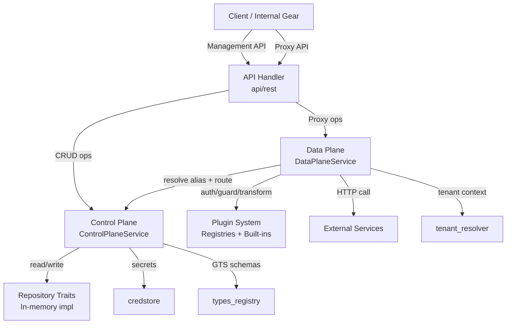
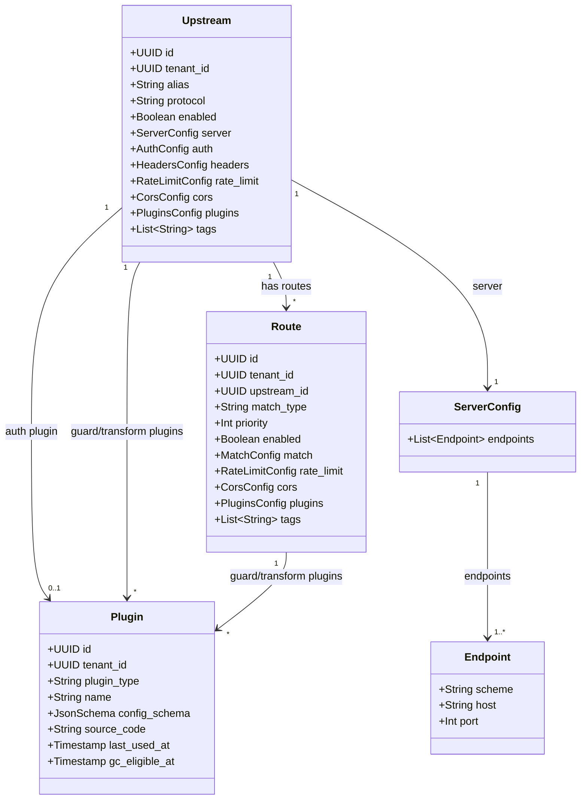
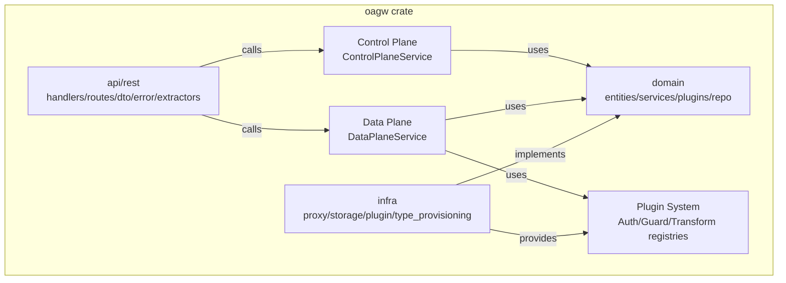
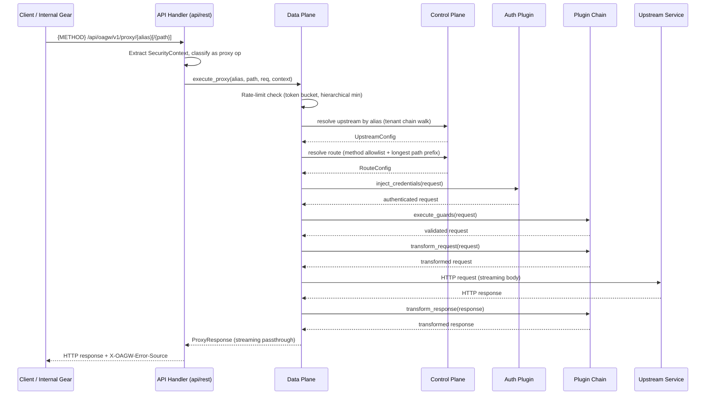
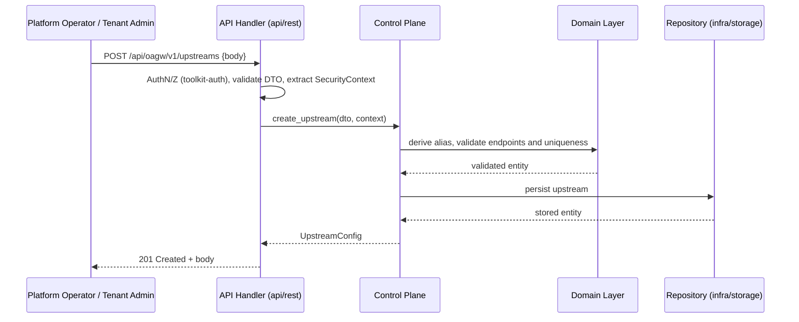
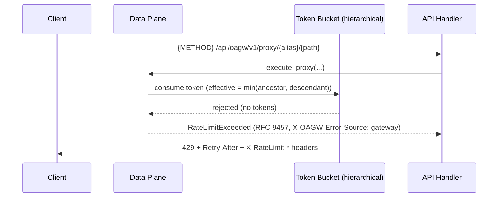

# Technical Design — Outbound API Gateway (oagw)

- [ ] `p3` - **ID**: `cpt-cf-oagw-design-overview`

<!-- toc -->

- [1. Architecture Overview](#1-architecture-overview)
  - [1.1 Architectural Vision](#11-architectural-vision)
  - [1.2 Architecture Drivers](#12-architecture-drivers)
  - [1.3 Architecture Layers](#13-architecture-layers)
- [2. Principles & Constraints](#2-principles--constraints)
  - [2.1 Design Principles](#21-design-principles)
  - [2.2 Constraints](#22-constraints)
- [3. Technical Architecture](#3-technical-architecture)
  - [3.1 Domain Model](#31-domain-model)
  - [3.2 Component Model](#32-component-model)
  - [3.3 API Contracts](#33-api-contracts)
  - [3.4 Internal Dependencies](#34-internal-dependencies)
  - [3.5 External Dependencies](#35-external-dependencies)
  - [3.6 Interactions & Sequences](#36-interactions--sequences)
  - [3.7 Database schemas & tables](#37-database-schemas--tables)
  - [3.8 Deployment Topology](#38-deployment-topology)
- [4. Additional context](#4-additional-context)
- [5. Traceability](#5-traceability)

<!-- /toc -->

## 1. Architecture Overview

### 1.1 Architectural Vision

OAGW is a centralized outbound API gateway that manages all outbound API requests from Gears to external services. It provides routing, authentication, rate limiting, header transformation, and monitoring through a unified proxy layer that enforces security and observability policies. Clients inside the platform call external services only through OAGW, which gives operators a single point of control for upstream configuration, tenant-scoped policy, and error attribution.

The architecture follows a **Control Plane / Data Plane** separation within a single gear: the Control Plane manages configuration (upstreams, routes, plugins) through a management API, while the Data Plane orchestrates proxy requests to external services on the low-latency hot path. Both planes are implemented as domain services inside one `oagw` crate (`cf-gears-oagw`) using DDD-Light layering (`api/rest` → `domain` → `infra`), so the domain layer carries no infrastructure dependencies and every repository and proxy concern is bound behind a trait.

This design satisfies the requirements for centralized outbound traffic management, multi-tenant hierarchical configuration, alias-based routing, and extensible plugin-based request processing, while remaining practical to implement on the ToolKit gear framework: the gear is registered as a single stateful REST gear (`capabilities = [rest, stateful]`) with dependencies on `credstore`, `types_registry`, `tenant_resolver`, and `authz_resolver`, deployed behind the platform `api-gateway` host that applies the `/api/oagw/v1/...` prefix.

### 1.2 Architecture Drivers

Requirements that significantly influence architecture decisions.

**ADRs**:

- `cpt-cf-oagw-adr-request-routing` — Path-based routing with alias resolution and target-host selection
- `cpt-cf-oagw-adr-plugin-system` — Three plugin types (Auth/Guard/Transform) with deterministic execution order
- `cpt-cf-oagw-adr-rate-limiting` — Token bucket algorithm with dual-rate configuration and hierarchical budget allocation
- `cpt-cf-oagw-adr-cors` — Built-in CORS handler with per-upstream/route configuration
- `cpt-cf-oagw-adr-data-plane-caching` — Control Plane configuration caching strategies feeding Data Plane resolution
- `cpt-cf-oagw-adr-state-management` — Control Plane / Data Plane state structures with cache invalidation
- `cpt-cf-oagw-adr-error-source-distinction` — Response header indicator for gateway vs upstream errors
- `cpt-cf-oagw-adr-oauth2-client-credentials-auth-plugin` — OAuth2 Client Credentials auth plugin with internal token cache
- `cpt-cf-oagw-adr-required-headers-guard-plugin` — Dedicated built-in guard plugin for request/response header presence checks

#### Functional Drivers

| Requirement | Design Response |
|-------------|------------------|
| `cpt-cf-oagw-fr-upstream-mgmt` | `cpt-cf-oagw-component-control-plane` — upstream CRUD through the management API with alias derivation and uniqueness per `(tenant_id, alias)` |
| `cpt-cf-oagw-fr-route-mgmt` | `cpt-cf-oagw-component-control-plane` — route CRUD with match-rule uniqueness validation and route-level overrides |
| `cpt-cf-oagw-fr-enable-disable` | `cpt-cf-oagw-component-model` — `enabled` flags on upstreams and routes honored during alias resolution and route matching |
| `cpt-cf-oagw-fr-request-proxy` | `cpt-cf-oagw-component-data-plane` — alias chain resolution, route matching, plugin chain execution, streaming passthrough, and error source header (`cpt-cf-oagw-seq-proxy-flow`) |
| `cpt-cf-oagw-fr-auth-injection` | `cpt-cf-oagw-component-plugin-system` — `AuthPlugin` trait with built-in `noop`/`apikey`/OAuth2 client-credentials registry entries and `cred://` secret references |
| `cpt-cf-oagw-fr-rate-limiting` | `cpt-cf-oagw-component-data-plane` — token bucket with dual-rate sustained/burst configuration and hierarchical `min()` inheritance; 429 with `Retry-After` and `X-RateLimit-*` headers |
| `cpt-cf-oagw-fr-header-transform` | `cpt-cf-oagw-component-data-plane` — routing/hop-by-hop/passthrough header categories, upstream `headers` transforms, payload-size and `Transfer-Encoding` validation |
| `cpt-cf-oagw-fr-plugin-system` | `cpt-cf-oagw-component-plugin-system` — three plugin types with trait-based isolation, deterministic execution order, and immutable custom plugins |
| `cpt-cf-oagw-fr-builtin-plugins` | `cpt-cf-oagw-component-plugin-system` — built-in `noop`/`apikey`/`oauth2_client_cred(_basic)` auth, `required_headers` guard, `request_id` transform; catalog-only identifiers for `basic`/`bearer`/`timeout`/`cors`/`logging`/`metrics` |
| `cpt-cf-oagw-fr-streaming` | `cpt-cf-oagw-component-data-plane` — response passthrough that preserves SSE/streaming semantics; `X-OAGW-Error-Source` present on every response |
| `cpt-cf-oagw-fr-config-layering` | `cpt-cf-oagw-component-domain-layer` — effective configuration merges upstream → route → tenant hierarchy per field sharing mode |
| `cpt-cf-oagw-fr-hierarchical-config` | `cpt-cf-oagw-component-domain-layer` — sharing modes `private`/`inherit`/`enforce`, `min()` rate inheritance, plugin concatenation, tag union |
| `cpt-cf-oagw-fr-alias-resolution` | `cpt-cf-oagw-component-data-plane` — descendant→root alias walk with shadowing; auto-derived or explicit aliases per endpoint type; `X-OAGW-Target-Host` matrix |
| `cpt-cf-oagw-fr-error-codes` | `cpt-cf-oagw-component-api-layer` — RFC 9457 problem+json gateway errors with GTS type identifiers and dedicated instances for target-host routing failures |

#### NFR Allocation

This table maps non-functional requirements from PRD to specific design/architecture responses, demonstrating how quality attributes are realized.

| NFR ID | NFR Summary | Allocated To | Design Response | Verification Approach |
|--------|-------------|--------------|-----------------|----------------------|
| `cpt-cf-oagw-nfr-low-latency` | Proxy hot path with minimal added latency | `cpt-cf-oagw-component-data-plane`, `cpt-cf-oagw-component-plugin-system`, `cpt-cf-oagw-tech-dependencies` | In-process token buckets and Control Plane (`L1`) configuration cache (<1µs lookups); plugin chain is in-memory; no DB/network hop on the request path in this delivery | Integration tests assert rate checks and config resolution on the request path complete without external round-trips |
| `cpt-cf-oagw-nfr-high-availability` | Gateway availability across failures | `cpt-cf-oagw-component-data-plane` | Stateless Data Plane; no automatic retries (client responsibility); graceful degradation of rate limiting to local-only when Redis is unavailable; upstream pool round-robin with per-host health state | Failure-injection tests for upstream outage and rate-limit sync loss assert continued service |
| `cpt-cf-oagw-nfr-ssrf-protection` | Prevent server-side request forgery | `cpt-cf-oagw-component-infra-layer` | HTTPS-only upstream scheme by default (`allow_http_upstream: false`), `ssrf_policy.enabled: true` by default, hostname/IP validation, hop-by-hop header stripping, body size limit | Security tests attempt HTTP/IP/danger-zone requests and assert rejection |
| `cpt-cf-oagw-nfr-credential-isolation` | Never store or expose secrets | `cpt-cf-oagw-component-domain-layer`, `cpt-cf-oagw-principle-cred-isolation` | Secrets referenced via `cred://` URIs resolved through the CredStore SDK; zeroizing secret types; cache key isolation plus key re-verification on hits (OAuth2 token cache) | Code review plus tests that no log line or response body contains secret material |
| `cpt-cf-oagw-nfr-input-validation` | Validate all inbound requests | `cpt-cf-oagw-component-api-layer`, `cpt-cf-oagw-component-data-plane` | Method allowlist, query allowlist, path suffix policy, body validation (Content-Length, 100MB cap, Transfer-Encoding), CORS origin/method validation, RFC 1123 hostname validation | Guard-rule tests reject each invalid input class with the mapped RFC 9457 error |
| `cpt-cf-oagw-nfr-observability` | Metrics, logs, and trace correlation | `cpt-cf-oagw-component-infra-layer`, `cpt-cf-oagw-component-api-layer` | Prometheus metrics vocabulary (`oagw_requests_total`, `oagw_request_duration_seconds`, etc.), structured JSON audit logs, `trace_id` on gateway errors | Integration tests assert metric presence and error `trace_id` propagation |
| `cpt-cf-oagw-nfr-starlark-sandbox` | Sandboxed execution of custom plugins | `cpt-cf-oagw-component-plugin-system` | Starlark execution with no network/file I/O, timeout and memory limits enforced; plugins immutable after creation (multi-tenant isolation) | Sandbox tests attempt disallowed operations inside custom plugins and assert they are blocked |
| `cpt-cf-oagw-nfr-multi-tenancy` | Tenant-scoped isolation of configuration | `cpt-cf-oagw-component-domain-layer`, `cpt-cf-oagw-component-control-plane` | All reads/writes tenant-scoped through `SecurityContext`; management API returns 404 for ancestor resources; alias uniqueness per tenant; credential isolation per tenant | Tenant-isolation tests verify cross-tenant access is impossible |

### 1.3 Architecture Layers

The gear follows **DDD-Light** layering: the transport layer maps between HTTP and domain types, the domain layer holds business logic and repository/service contracts with no infrastructure dependencies, and the infrastructure layer implements domain traits and owns external integrations. The Control Plane and Data Plane are domain services exposed through the transport layer and backed by infrastructure implementations.

- [ ] `p3` - **ID**: `cpt-cf-oagw-tech-dependencies`

| Layer | Responsibility | Technology |
|-------|---------------|------------|
| Presentation | HTTP handling, request parsing, DTO validation, response serialization, OpenAPI registration | Rust + axum 0.8, serde, utoipa, `OperationBuilder` route registration via `RestApiCapability::register_rest` |
| Application | Control Plane service orchestration (upstream/route/plugin CRUD, alias resolution) and Data Plane service orchestration (proxy request execution) | `oagw` `domain/services` (`ControlPlaneService`, `DataPlaneService`), `toolkit-auth` for inbound authN/authZ |
| Domain | Entity model, sharing-mode configuration merge, plugin trait contracts, repository contracts, rate-limit policy | Rust enums/structs (`domain/dto`, `domain/error`), `AuthPlugin`/`GuardPlugin`/`TransformPlugin` traits |
| Infrastructure | Repository implementations, proxy client, plugin registries and built-ins, type provisioning, metrics | In-memory repositories (DashMap), toolkit HTTP client (lockfile `toolkit-http`/`reqwest`/`hyper`), `pingora-memory-cache` for the OAuth2 token cache, `opentelemetry` |

| Technology | Purpose |
|---|---|
| Rust / axum | HTTP transport, async runtime, typed routing with serde DTOs |
| Toolkit gear framework | `#[toolkit::gear(name = "oagw", ...)]` registration, `Gear` trait lifecycle (`init`/`serve`), `RestApiCapability`, `GearCtx` client hub, `config_or_default` |
| `toolkit-http` / `reqwest` | Upstream HTTP client on the Data Plane hot path (streaming passthrough bodies, SSE-compatible) |
| `credstore` SDK | Secret material retrieval by `cred://` URI reference via `CredStoreClientV1` |
| `types_registry` SDK + `tenant_resolver` + `authz_resolver` | GTS schema/instance registration, tenant hierarchy walk with `SecurityContext`, permission checks |
| `pingora-memory-cache` | OAuth2 token cache (S3-FIFO + TinyLFU) aligned with planned Pingora adoption |
| Starlark (`psl`) | Sandboxed custom plugin execution |
| DashMap | In-memory repository backing store for this delivery |

## 2. Principles & Constraints

### 2.1 Design Principles

#### No Automatic Retries

- [ ] `p2` - **ID**: `cpt-cf-oagw-principle-no-retry`

OAGW never retries failed upstream requests. Retry logic is the client's responsibility, keeping the proxy path deterministic and preventing retry storms against upstream services. Auth plugins may refresh tokens on 401 but never re-issue the original request.

**ADRs**: `cpt-cf-oagw-adr-request-routing`, `cpt-cf-oagw-adr-state-management`

#### No Response Caching

- [ ] `p2` - **ID**: `cpt-cf-oagw-principle-no-cache`

OAGW does not cache upstream responses. Response caching is the client's or upstream's responsibility. Configuration caching (Control Plane `L1`) is a separate concern and is the only caching OAGW performs.

**ADRs**: `cpt-cf-oagw-adr-data-plane-caching`, `cpt-cf-oagw-adr-state-management`

#### Credential Isolation

- [ ] `p2` - **ID**: `cpt-cf-oagw-principle-cred-isolation`

OAGW references secrets via `cred://` URIs and resolves them through the CredStore SDK; it never stores or logs secret material. Any in-memory copy of a credential (access token, API key) is held in a zeroizing secret type and is never serialized into logs, metrics, or responses.

**ADRs**: `cpt-cf-oagw-adr-oauth2-client-credentials-auth-plugin`, `cpt-cf-oagw-adr-error-source-distinction`

#### Tenant Scoping

- [ ] `p2` - **ID**: `cpt-cf-oagw-principle-tenant-scope`

All configuration reads and writes are scoped to the calling tenant through the `SecurityContext` propagated by `tenant_resolver`. Ancestor resources are invisible (404) through the management API; proxy-time inheritance walks the tenant chain descendant → root. No cross-tenant access path exists.

**ADRs**: `cpt-cf-oagw-adr-request-routing`, `cpt-cf-oagw-adr-rate-limiting`, `cpt-cf-oagw-adr-state-management`

#### Plugin Immutability

- [ ] `p2` - **ID**: `cpt-cf-oagw-principle-plugin-immutable`

Custom (Starlark) plugins are immutable after creation. Updates create a new plugin version and update upstream/route references. Only unlinked plugins can be deleted; a periodic GC job removes plugins whose `gc_eligible_at` has passed.

**ADRs**: `cpt-cf-oagw-adr-plugin-system`, `cpt-cf-oagw-adr-state-management`

#### Error Source Distinction

- [ ] `p2` - **ID**: `cpt-cf-oagw-principle-error-source`

Every response carries `X-OAGW-Error-Source: gateway|upstream`, giving clients a uniform, content-type-agnostic way to attribute any response to its source. Upstream error bodies are passed through unchanged.

**ADRs**: `cpt-cf-oagw-adr-error-source-distinction`, `cpt-cf-oagw-adr-request-routing`

#### RFC 9457 Problem Details for Gateway Errors

- [ ] `p2` - **ID**: `cpt-cf-oagw-principle-rfc9457`

All gateway errors use the `application/problem+json` format with GTS `type` identifiers and standard fields (`type`, `title`, `status`, `detail`, `instance`) plus OAGW extension fields (`upstream_id`, `host`, `path`, `retry_after_seconds`, `trace_id`).

**ADRs**: `cpt-cf-oagw-adr-error-source-distinction`, `cpt-cf-oagw-adr-rate-limiting`

### 2.2 Constraints

#### Single-Executable Deployment via ToolKit

- [ ] `p2` - **ID**: `cpt-cf-oagw-constraint-toolkit-deploy`

OAGW must deploy as a single gear inside the ToolKit host (one executable, one process, trait-based DI). No separate service, scheduler, or sidecar is permitted for the MVP.

**ADRs**: `cpt-cf-oagw-adr-state-management`

#### No Direct Internet Access from Gears

- [ ] `p2` - **ID**: `cpt-cf-oagw-constraint-no-direct-internet`

Security policy: all outbound traffic from internal gears routes through OAGW. OAGW therefore cannot rely on being bypassed; its own outbound surface is subject to SSRF mitigation (scheme allowlist, hostname validation, `ssrf_policy` enabled by default).

**ADRs**: `cpt-cf-oagw-adr-request-routing`

#### Multi-SQL Backend Portability

- [ ] `p2` - **ID**: `cpt-cf-oagw-constraint-multi-sql`

When persistence is backed by a database, it must remain portable across PostgreSQL, MySQL, and SQLite (SeaORM + `toolkit-db`). The design avoids backend-specific SQL features; schema and queries are portable.

**ADRs**: `cpt-cf-oagw-adr-state-management`

#### Body Size Hard Limit

- [ ] `p2` - **ID**: `cpt-cf-oagw-constraint-body-limit`

Request body size is capped at 100MB. Oversized payloads are rejected with `413 PayloadTooLarge` before buffering, preventing resource exhaustion.

**ADRs**: `cpt-cf-oagw-adr-request-routing`

#### HTTPS-Only Upstream Connections

- [ ] `p2` - **ID**: `cpt-cf-oagw-constraint-https-only`

Upstream connections use HTTPS by default; plaintext HTTP upstreams are blocked unless explicit opt-in configuration (`allow_http_upstream`) is enabled for testing environments. This is an SSRF mitigation layer.

**ADRs**: `cpt-cf-oagw-adr-request-routing`

#### In-Memory Storage for This Delivery

- [ ] `p2` - **ID**: `cpt-cf-oagw-constraint-in-memory-storage`

This delivery persists upstream/route/plugin configuration through repository traits backed by an in-memory implementation (DashMap) mapping the §3.7 relational table shapes. No new external database dependency is introduced, and the e2e configuration does not require a DB. Persistence via SeaORM/`toolkit-db` remains a future swap behind the same repository traits.

**ADRs**: `cpt-cf-oagw-adr-state-management`

## 3. Technical Architecture

### 3.1 Domain Model

**Technology**: GTS (Global Type System) identifiers for resource identity, Rust structs/enums for domain entities.

**Location**: [`domain/`](../../oagw/src/domain)

**Core Entities**:

| Entity | Description | Schema |
|--------|-------------|--------|
| `Upstream` | Tenant-scoped root configuration object representing an external service; unique per `(tenant_id, alias)`; contains server endpoints, auth config, rate limits, CORS, headers, and plugin bindings | [domain/entity](../oagw/src/domain) — base GTS type `gts.cf.core.oagw.upstream.v1~*` |
| `Route` | Belongs to an upstream; defines match rules (HTTP method allowlist + path prefix), priority, and route-level overrides for rate limits, CORS, and plugins | [domain/entity](../oagw/src/domain) — base GTS type `gts.cf.core.oagw.route.v1~*` |
| `Plugin` | Auth/guard/transform plugin entity; UUID-backed custom Starlark plugins persist to `oagw_plugin`; named (built-in) plugins resolve via in-process registries and are not persisted | [domain/entity](../oagw/src/domain) — base GTS type `gts.cf.core.oagw.{type}_plugin.v1~*` |
| `ServerConfig` / `Endpoint` | Upstream server pool: scheme, host, port; all endpoints in a pool share protocol, scheme, and port and are load-balanced round-robin | [domain/entity](../oagw/src/domain) |
| `OagwConfig` | Gear-level configuration resolved from `gears.oagw.config` YAML with defaults | [config.rs](../oagw/src/config.rs) |

**Relationships**:

- `Upstream` → `Route`: an upstream has many routes (`1` to `*`)
- `Upstream` → `Plugin`: at most one auth plugin and many guard/transform plugins (`1` to `0..*`)
- `Route` → `Plugin`: many guard/transform plugins bound at route level (`1` to `*`)
- `Upstream` → `ServerConfig` → `Endpoint`: server pool contains one or more endpoints (`1` to `1..*`)

**Gear configuration** (`gears.oagw.config` YAML, resolved via `config_or_default`):

| Key | Default | Description |
|---|---|---|
| `proxy_timeout_secs` | 2 | Upstream request timeout on the Data Plane hot path |
| `allow_http_upstream` | false | Opt-in to plaintext HTTP upstreams (testing only) |
| `ssrf_policy.enabled` | true | SSRF guard (scheme allowlist, hostname validation, header stripping) |
| `token_cache_ttl_secs` | 300 | Ceiling TTL for the OAuth2 token cache |
| `token_cache_capacity` | 10000 | Maximum entries in the OAuth2 token cache |

**Plugin identification model**: all plugins are identified with GTS identifiers. `plugin_ref` stores the canonical identifier string; `plugin_uuid` is set only for UUID-backed custom plugins. Named plugins are resolved through in-process registries; custom plugins are resolved from `oagw_plugin` and must match the plugin schema type. Binding rows (`oagw_upstream_plugin`/`oagw_route_plugin`) carry `(position, plugin_ref, plugin_uuid, config)`; there is no FK from bindings to `oagw_plugin` because named plugins have no rows.

### 3.2 Component Model

The design is a single-crate multi-component architecture: one aggregate component model covering the Control Plane / Data Plane separation, layered packages, and the plugin system. Components communicate exclusively through domain traits and SDK clients.

#### OAGW Component Model

- [ ] `p2` - **ID**: `cpt-cf-oagw-component-model`

##### Why this component exists

The component model establishes the Control Plane / Data Plane separation inside a single `oagw` crate. It exists so configuration management (rare, correctness-sensitive, tenant-scoped) is cleanly isolated from request proxying (high-frequency, latency-sensitive), while sharing one domain layer and one deployment unit per the ToolKit constraint.

##### Responsibility scope

- Owns the crate structure: `api/rest` (transport), `domain` (services, plugin traits, DTOs, repository contracts, errors), `infra` (proxy client, storage, plugin registries, type provisioning).
- Owns the gear wiring: `#[toolkit::gear(name = "oagw", deps = [credstore, types_registry, tenant_resolver, authz_resolver], capabilities = [rest, stateful], lifecycle(entry = "serve", ...))]`, `Gear` trait `init`, `RestApiCapability::register_rest` (unprefixed paths; the `api-gateway` host applies the `/api/oagw/v1/...` prefix), and OpenAPI registration via utoipa.
- Owns request routing between planes: `/upstreams/*`, `/routes/*`, `/plugins/*` → Control Plane; `/proxy/*` → Data Plane.
- Honors the gear configuration defaults from §3.1 as the single source of runtime knob defaults.

##### Responsibility boundaries

- Does NOT own external persistence decisions — storage is delegated to the repository implementations behind domain traits.

##### Related components (by ID)

- `cpt-cf-oagw-component-api-layer` — depends on: exposes the two planes to HTTP
- `cpt-cf-oagw-component-control-plane` — owns: config CRUD behavior
- `cpt-cf-oagw-component-data-plane` — owns: proxy behavior
- `cpt-cf-oagw-component-plugin-system` — provides: registries consumed by the Data Plane

#### Control Plane

- [ ] `p2` - **ID**: `cpt-cf-oagw-component-control-plane`

##### Why this component exists

The Control Plane exists to manage configuration data — upstreams, routes, and plugins — through the management API with full validation, tenant scoping, alias derivation, and hierarchical constraint enforcement. It is the authority that the Data Plane queries at proxy time.

##### Responsibility scope

- CRUD for upstreams/routes/plugins (`ControlPlaneService` in `domain/services/management.rs`): server-generated UUIDs, `(tenant_id, alias)` uniqueness, match-rule uniqueness, alias derivation from endpoints, bind/override permission checks.
- Alias rules: auto-derivation for hostname endpoints, explicit alias required for IP/non-derivable endpoints, alias immutability once set, `X-OAGW-Target-Host` route-selection validation for multi-endpoint upstreams. A user-provided alias that differs from the auto-derived value is rejected (400); providing the exact derived value is tolerated silently as an idempotent no-op.
- Secret reference resolution through the CredStore SDK (`cred://` URIs), permission checks via `authz_resolver`.
- Resolves effective configuration for the Data Plane by walking the tenant hierarchy and merging per sharing mode.

##### Responsibility boundaries

- Does NOT touch upstream traffic; does NOT execute plugins or enforce rate limits at request time.
- Does NOT manage secret storage or secret sharing — delegated to `credstore`.

##### Related components (by ID)

- `cpt-cf-oagw-component-domain-layer` — depends on: service orchestration and repository contracts
- `cpt-cf-oagw-component-data-plane` — calls: Data Plane consumes effective-config resolution
- `cpt-cf-oagw-component-api-layer` — calls: management handlers invoke the plane

#### Data Plane

- [ ] `p2` - **ID**: `cpt-cf-oagw-component-data-plane`

##### Why this component exists

The Data Plane exists to orchestrate proxy requests on the low-latency hot path: resolve the alias chain through the tenant hierarchy, match a route, merge effective configuration, execute the plugin chain, forward to the upstream, and return a streaming passthrough response — all without blocking on external systems.

##### Responsibility scope

- `DataPlaneService` (`infra/proxy/service.rs`): resolves upstream by alias (descendant → root walk with shadowing, `X-OAGW-Target-Host` for multi-endpoint upstreams), matches route (HTTP method allowlist + longest path prefix), merges effective config, executes plugins (Auth → Guards → Transform request), forwards via the toolkit HTTP client, applies header transforms and hop-by-hop stripping, and sets `X-OAGW-Error-Source` on every response.
- Core policies executed on the hot path: token-bucket rate limiting (dual-rate, hierarchical `min()`, 429 with `Retry-After` + `X-RateLimit-*` headers) and circuit breaker.
- Streaming response passthrough (SSE-compatible); no automatic retries.
- CORS enforcement on actual cross-origin requests (origin/method validation → 403, `Vary: Origin`); preflight handled at the handler level.

##### Responsibility boundaries

- Does NOT persist configuration; does NOT manage plugin lifecycle; does NOT implement response caching or retry logic.
- Rate limiting is per-instance in this delivery (no distributed coordination) unless a Redis-backed mode is introduced.

##### Related components (by ID)

- `cpt-cf-oagw-component-plugin-system` — depends on: executes plugin chains
- `cpt-cf-oagw-component-control-plane` — calls: resolves effective configuration
- `cpt-cf-oagw-component-infra-layer` — depends on: proxy client, storage, metrics
- `cpt-cf-oagw-component-api-layer` — calls: proxy handlers invoke the plane

#### API Layer

- [ ] `p2` - **ID**: `cpt-cf-oagw-component-api-layer`

##### Why this component exists

The API layer exists to map HTTP requests to domain operations: parse and validate inbound DTOs, bind the `SecurityContext`, route management versus proxy operations, and serialize RFC 9457 problem+json errors with GTS identifiers. It is the only component that speaks HTTP on the inbound side.

##### Responsibility scope

- `api/rest/{handlers,routes,dto,error,extractors}`: axum handlers, `OperationBuilder` route registration, serde + utoipa DTOs, error mapping to the RFC 9457 contract, `SecurityContext` extraction.
- Endpoint overview in §3.3; list endpoints support OData query parameters (`$filter`, `$select`, `$orderby`, `$top`, `$skip`).
- CORS preflight fast path (permissive 204) for OPTIONS without tenant resolution.

##### Responsibility boundaries

- Does NOT contain business logic; delegates to Control Plane / Data Plane services.
- Does NOT format upstream passthrough bodies (passed through unchanged).

##### Related components (by ID)

- `cpt-cf-oagw-component-control-plane` — calls: management endpoints
- `cpt-cf-oagw-component-data-plane` — calls: proxy endpoint
- `cpt-cf-oagw-component-domain-layer` — depends on: calls services and uses DTOs

#### Domain Layer

- [ ] `p2` - **ID**: `cpt-cf-oagw-component-domain-layer`

##### Why this component exists

The domain layer exists to hold business logic free of infrastructure concerns: entity models, sharing-mode configuration merge, alias derivation and enforcement rules, plugin trait contracts, repository contracts, and the `DomainError` model. It is the layer where tenant-scoped correctness lives.

##### Responsibility scope

- `domain/entity`, `domain/dto` (`ProxyContext`, `ProxyResponse`, etc.), `domain/repo` (`UpstreamRepository`, `RouteRepository`, `PluginRepository` traits), `domain/error` (`DomainError`).
- Hierarchical configuration merge: `Auth` (override if `inherit`, forced if `enforce`), `Rate Limits` (`min(ancestor, descendant)`), `Plugins` (concatenate ancestor + descendant), `CORS` (union if `inherit`, forced if `enforce`), tags (add-only union).
- Alias derivation (`compute_derived_alias()`), alias update enforcement, and tenant-chain resolution invariants.

##### Responsibility boundaries

- Does NOT perform I/O, HTTP, or process plugin code — those belong to infrastructure.
- Does NOT hold gear configuration defaults (owned by the component model/config module).

##### Related components (by ID)

- `cpt-cf-oagw-component-model` — part of: the crate-level component model
- `cpt-cf-oagw-component-infra-layer` — implemented by: repository and proxy implementations
- `cpt-cf-oagw-component-plugin-system` — owns: plugin trait contracts defined here

#### Infrastructure Layer

- [ ] `p2` - **ID**: `cpt-cf-oagw-component-infra-layer`

##### Why this component exists

The infrastructure layer exists to implement the domain contracts with real machinery: in-memory repository implementations, the upstream HTTP client, type provisioning into `types_registry`, and observability.

##### Responsibility scope

- `infra/storage`: repository trait implementations on DashMap, mapped to the §3.7 relational table shapes (in-memory for this delivery).
- `infra/proxy`: `DataPlaneServiceImpl`, upstream HTTP forwarding via the toolkit HTTP client, streaming passthrough, SSRF guard (scheme allowlist, hostname validation), payload-size enforcement.
- `infra/plugin`: plugin registries with built-ins; `infra/type_provisioning.rs`: GTS type registration.
- Metrics emission (Prometheus vocabulary in §4) and `trace_id` propagation.

##### Responsibility boundaries

- Does NOT contain business/validation logic — applies domain contracts as-is.
- Does NOT implement custom plugin execution sandboxing details beyond the registry boundaries.

##### Related components (by ID)

- `cpt-cf-oagw-component-domain-layer` — implements: repository and proxy traits
- `cpt-cf-oagw-component-data-plane` — used by: proxy execution
- `cpt-cf-oagw-component-plugin-system` — provides: registries it constructs

#### Plugin System

- [ ] `p2` - **ID**: `cpt-cf-oagw-component-plugin-system`

##### Why this component exists

The plugin system exists to make request processing extensible without touching core proxy logic: three trait-based plugin types isolate credential injection (Auth), policy enforcement (Guard), and request/response mutation (Transform), with a deterministic execution order.

##### Responsibility scope

- `AuthPluginRegistry` (`noop`, `apikey`, `oauth2_client_cred`, `oauth2_client_cred_basic` built-ins), `GuardPluginRegistry` (`required_headers` built-in — stateless presence checks per ADR 0009), `TransformPluginRegistry` (`request_id` built-in).
- Catalog-only identifiers (`basic`, `bearer`, `timeout`, `cors`, `logging`, `metrics`) registered in the types registry but not resolvable via a plugin registry (core Data Plane logic instead).
- Execution order: Auth → Guards → Transform(request) → upstream → Transform(response/error); upstream plugins before route plugins (`[U1, U2] + [R1, R2] => [U1, U2, R1, R2]`).
- OAuth2 token cache (`pingora-memory-cache`, key-verification wrapper, `min(config_ttl, expires_in − 30s)` TTL).
- Custom Starlark plugin lifecycle: immutable after creation, GC after TTL (default 30 days).

##### Responsibility boundaries

- Does NOT implement rate limiting, CORS, timeout enforcement, request logging, or metrics — those are core Data Plane functionality.
- Does NOT do header value validation (presence only for `required_headers`).

##### Related components (by ID)

- `cpt-cf-oagw-component-data-plane` — used by: executes plugin chains during proxying
- `cpt-cf-oagw-component-domain-layer` — depends on: uses the plugin trait contracts
- `cpt-cf-oagw-component-infra-layer` — implemented in: registry construction and built-ins

### 3.3 API Contracts

- [ ] `p2` - **ID**: `cpt-cf-oagw-interface-api`

- **Contracts**: `cpt-cf-oagw-contract-cred-store`, `cpt-cf-oagw-contract-types-registry`
- **Technology**: REST/OpenAPI (axum, serde DTOs, utoipa); streaming response passthrough for SSE-compatible protocols
- **Location**: [`api/rest`](../oagw/src/api/rest)

The management API is exposed by the Control Plane (`cpt-cf-oagw-interface-management-api`); the proxy API is exposed by the Data Plane (`cpt-cf-oagw-interface-proxy-api`). Both are registered unprefixed through `RestApiCapability::register_rest`; the platform `api-gateway` host applies the `/api/oagw/v1/...` prefix.

**Endpoints Overview**:

| Method | Path | Description | Stability |
|--------|------|-------------|-----------|
| `POST` | `/api/oagw/v1/upstreams` | Create upstream (alias auto-derived or explicit) | stable |
| `GET` | `/api/oagw/v1/upstreams` | List upstreams (OData query params) | stable |
| `GET` | `/api/oagw/v1/upstreams/{id}` | Get upstream by ID | stable |
| `PUT` | `/api/oagw/v1/upstreams/{id}` | Replace upstream | stable |
| `DELETE` | `/api/oagw/v1/upstreams/{id}` | Delete upstream | stable |
| `POST` | `/api/oagw/v1/routes` | Create route | stable |
| `GET` | `/api/oagw/v1/routes` | List routes (OData query params) | stable |
| `GET` | `/api/oagw/v1/routes/{id}` | Get route by ID | stable |
| `PUT` | `/api/oagw/v1/routes/{id}` | Replace route (`upstream_id` immutable) | stable |
| `DELETE` | `/api/oagw/v1/routes/{id}` | Delete route | stable |
| `POST` | `/api/oagw/v1/plugins` | Create custom plugin | stable |
| `GET` | `/api/oagw/v1/plugins` | List plugins (OData query params) | stable |
| `GET` | `/api/oagw/v1/plugins/{id}` | Get plugin by ID | stable |
| `DELETE` | `/api/oagw/v1/plugins/{id}` | Delete plugin (409 `PluginInUse` if referenced) | stable |
| `GET` | `/api/oagw/v1/plugins/{id}/source` | Get Starlark source | stable |
| `*` | `/api/oagw/v1/proxy/{alias}[/{path_suffix}][?{query}]` | Proxy request to upstream (method allowlist + longest path prefix) | stable |

Resource IDs are anonymous GTS identifiers (`gts.cf.core.oagw.{type}.v1~{uuid}`). Plugins are immutable — there is no PUT. CRUD is tenant-scoped: ancestor resources are invisible (404) via the management API, while proxy-time resolution inherits through the tenant chain. List endpoints support `$filter`, `$select`, `$orderby`, `$top` (default 50, max 100), `$skip`. Inbound authentication/authorization is via `toolkit-auth` bearer tokens with `gts.cf.core.oagw.{upstream|route}.v1~:{create;override;read;delete}`, `gts.cf.core.oagw.{auth_plugin|guard_plugin|transform_plugin}.v1~:{create;read;delete}`, and `gts.cf.core.oagw.proxy.v1~:invoke` permissions.

**Gateway error format** — all gateway errors return RFC 9457 problem+json with `X-OAGW-Error-Source: gateway`; upstream errors pass through unchanged with `X-OAGW-Error-Source: upstream`:

| Error Type | HTTP | GTS Instance ID | Retriable |
|---|---|---|---|
| RouteError / ValidationError | 400 | `gts.cf.core.errors.err.v1~cf.oagw.validation.error.v1` | No |
| MissingTargetHost | 400 | `gts.cf.core.errors.err.v1~cf.oagw.routing.missing_target_host.v1` | No |
| InvalidTargetHost | 400 | `gts.cf.core.errors.err.v1~cf.oagw.routing.invalid_target_host.v1` | No |
| UnknownTargetHost | 400 | `gts.cf.core.errors.err.v1~cf.oagw.routing.unknown_target_host.v1` | No |
| AuthenticationFailed | 401 | `gts.cf.core.errors.err.v1~cf.oagw.auth.failed.v1` | No |
| CorsOriginNotAllowed | 403 | `gts.cf.core.errors.err.v1~cf.oagw.cors.origin_not_allowed.v1` | No |
| CorsMethodNotAllowed | 403 | `gts.cf.core.errors.err.v1~cf.oagw.cors.method_not_allowed.v1` | No |
| RouteNotFound | 404 | `gts.cf.core.errors.err.v1~cf.oagw.route.not_found.v1` | No |
| PluginInUse | 409 | `gts.cf.core.errors.err.v1~cf.oagw.plugin.in_use.v1` | No |
| AliasConflict | 409 | `gts.cf.core.errors.err.v1~cf.oagw.upstream.alias_conflict.v1` | No |
| PayloadTooLarge | 413 | `gts.cf.core.errors.err.v1~cf.oagw.payload.too_large.v1` | No |
| RateLimitExceeded | 429 | `gts.cf.core.errors.err.v1~cf.oagw.rate_limit.exceeded.v1` | Yes |
| SecretNotFound | 500 | `gts.cf.core.errors.err.v1~cf.oagw.secret.not_found.v1` | No |
| ProtocolError | 502 | `gts.cf.core.errors.err.v1~cf.oagw.protocol.error.v1` | No |
| DownstreamError | 502 | `gts.cf.core.errors.err.v1~cf.oagw.downstream.error.v1` | Depends |
| StreamAborted | 502 | `gts.cf.core.errors.err.v1~cf.oagw.stream.aborted.v1` | No |
| LinkUnavailable | 503 | `gts.cf.core.errors.err.v1~cf.oagw.link.unavailable.v1` | Yes |
| CircuitBreakerOpen | 503 | `gts.cf.core.errors.err.v1~cf.oagw.circuit_breaker.open.v1` | Yes |
| PluginNotFound | 503 | `gts.cf.core.errors.err.v1~cf.oagw.plugin.not_found.v1` | No |
| ConnectionTimeout | 504 | `gts.cf.core.errors.err.v1~cf.oagw.timeout.connection.v1` | Yes |
| RequestTimeout | 504 | `gts.cf.core.errors.err.v1~cf.oagw.timeout.request.v1` | Yes |
| IdleTimeout | 504 | `gts.cf.core.errors.err.v1~cf.oagw.timeout.idle.v1` | Yes |

### 3.4 Internal Dependencies

Internal system/module dependencies within the platform. All inter-module communication goes through versioned contracts, SDK clients, or plugin interfaces — never through internal types.

| Dependency Module | Interface Used | Purpose |
|-------------------|----------------|----------|
| `credstore` | `credstore_sdk::CredStoreClientV1` | Resolve `cred://` secret references (client_id/secret, API keys) with tenant access checks |
| `types_registry` | `TypesRegistryClient` | Register GTS schemas/instances; resolve catalog-only plugin identifiers |
| `tenant_resolver` | `tenant-resolver-sdk` | Walk the tenant hierarchy with a `SecurityContext` for alias/config inheritance and tenant scoping |
| `authz_resolver` | `authz-resolver-sdk` | Authorize management and proxy operations against GTS permission sets |
| `toolkit-auth` | `toolkit_auth` | Inbound bearer-token authentication and authorization for all OAGW API requests |
| `toolkit-http` | HTTP client | Upstream request forwarding on the Data Plane hot path (streaming passthrough) |

**Dependency Rules** (per project conventions):

- No circular dependencies
- Always use SDK modules for inter-module communication
- No cross-category sideways deps except through contracts
- Only integration/adapter modules talk to external systems
- `SecurityContext` must be propagated across all in-process calls

### 3.5 External Dependencies

External systems, databases, and third-party services this module interacts with. Define protocols, data formats, and integration points.

#### Upstream External Services

| Dependency Module | Interface Used | Purpose |
|-------------------|---------------|---------|
| External HTTPS services | HTTP/1.1 + HTTP/2 (adaptive per-host detection, 1h TTL capability cache) | Proxied by the Data Plane; the only outbound network surface |
| Identity Provider (OAuth2) | `toolkit_auth::oauth2::fetch_token` (OIDC Discovery, `Basic`/`Form` client auth) | One-shot token exchange for the OAuth2 client-credentials plugins |

#### Credential Store

| Dependency Module | Interface Used | Purpose |
|-------------------|---------------|---------|
| `credstore` | `CredStoreClientV1` via client hub | Secret material retrieval by URI reference; OAGW never stores secrets itself |

#### Types Registry

| Dependency Module | Interface Used | Purpose |
|-------------------|---------------|---------|
| `types_registry` | `TypesRegistryClient` via client hub | GTS schema/instance registration and catalog queries |

**Dependency Rules** (per project conventions):

- No circular dependencies
- Always use SDK modules for inter-module communication
- No cross-category sideways deps except through contracts
- Only integration/adapter modules talk to external systems
- `SecurityContext` must be propagated across all in-process calls

### 3.6 Interactions & Sequences

#### Proxy Request Flow

**ID**: `cpt-cf-oagw-seq-proxy-flow`

**Use cases**: `cpt-cf-oagw-usecase-proxy-request`, `cpt-cf-oagw-usecase-sse-streaming` (ID from PRD)

**Actors**: `cpt-cf-oagw-actor-app-developer`, `cpt-cf-oagw-actor-upstream-service` (ID from PRD)

**Description**: The proxy flow resolves the alias through the tenant hierarchy (descendant → root, shadowing), matches a route by HTTP method allowlist and longest path prefix, merges effective configuration, enforces the rate limit, executes the plugin chain, forwards the request to the upstream with a streaming body, and returns a streaming passthrough response tagged with `X-OAGW-Error-Source`. No automatic retries occur.

#### Management Operation Flow

**ID**: `cpt-cf-oagw-seq-management-crud-flow`

**Use cases**: `cpt-cf-oagw-usecase-configure-upstream`, `cpt-cf-oagw-usecase-configure-route` (ID from PRD)

**Actors**: `cpt-cf-oagw-actor-platform-operator`, `cpt-cf-oagw-actor-tenant-admin` (ID from PRD)

**Description**: Management operations authenticate and authorize the caller, validate the DTO, derive and enforce the alias, enforce tenant scoping and ancestor bind rules, persist the entity through the repository trait, and return the created/updated resource or a tenant-scoped 404/409/400 error.

#### Rate Limit Exceeded Flow

**ID**: `cpt-cf-oagw-seq-rate-limit-flow`

**Use cases**: `cpt-cf-oagw-usecase-rate-limit-exceeded` (ID from PRD)

**Actors**: `cpt-cf-oagw-actor-app-developer`, `cpt-cf-oagw-actor-upstream-service` (ID from PRD)

**Description**: When the effective token bucket is empty, the Data Plane rejects the request with a 429 gateway error carrying `Retry-After` and the standard `X-RateLimit-Limit`/`X-RateLimit-Remaining`/`X-RateLimit-Reset` response headers, so clients can pace retries.

### 3.7 Database schemas & tables

- [ ] `p3` - **ID**: `cpt-cf-oagw-db-schema`

The schema follows a portable relational baseline with JSON blobs for evolving configuration. In this delivery the repository traits are backed by an in-memory implementation (DashMap) whose shapes mirror these tables; SeaORM/`toolkit-db` persistence is a future swap behind the same traits.

| Table | Purpose | Key Constraints |
|---|---|---|
| `oagw_upstream` | Tenant-scoped root config | PK: `id`, UNIQUE: `(tenant_id, alias)` |
| `oagw_route` | Route definitions | PK: `id`, FK: `upstream_id` (cascade) |
| `oagw_route_http_match` | HTTP match keys (path prefix) | PK: `route_id`, FK: cascade |
| `oagw_route_grpc_match` | gRPC match keys (planned/Phase 3 — no gRPC proxy code path is implemented or reachable) | PK: `route_id`, FK: cascade |
| `oagw_route_method` | HTTP method allowlists | PK: `(route_id, method)`, FK: cascade |
| `oagw_upstream_tag` / `oagw_route_tag` | Discovery tags | PK: `(parent_id, tag)`, FK: cascade |
| `oagw_plugin` | Custom plugins (UUID-backed) | PK: `id`, UNIQUE: `(tenant_id, name)` |
| `oagw_upstream_plugin` / `oagw_route_plugin` | Ordered plugin bindings | PK: `(parent_id, position)`, FK: cascade |

Key invariants: all reads/writes tenant-scoped; multi-table updates atomic; no two enabled routes under the same upstream share `(path_prefix, priority)` for the same method; plugin binding positions contiguous from 0; named plugins have `plugin_uuid = NULL`, custom plugins have both `plugin_ref` and `plugin_uuid`.

#### Table: oagw_upstream

**ID**: `cpt-cf-oagw-dbtable-upstream`

**Schema**:

| Column | Type | Description |
|--------|------|-------------|
| `id` | UUID | Server-generated resource identifier |
| `tenant_id` | UUID | Owning tenant (tenant-scoped reads/writes) |
| `alias` | TEXT | Routing key for `/proxy/{alias}/...`; derived or explicit |
| `protocol` | TEXT | `http` (gRPC planned/Phase 3) |
| `enabled` | BOOLEAN | Enabled flag honored during resolution |
| `server` | JSONB | `ServerConfig` (endpoints pool) |
| `auth` | JSONB | Auth config incl. `secret_ref`, `plugin_type`, sharing mode |
| `headers` | JSONB | Header transformation config |
| `rate_limit` | JSONB | Dual-rate token-bucket config |
| `cors` | JSONB | CORS config (allowed origins/methods) |
| `plugins` | JSONB | Plugin binding summary (details in binding tables) |
| `tags` | JSONB | Discovery tags array |
| `created_at` / `updated_at` | TIMESTAMP | Audit timestamps |

**PK**: `id`

**Constraints**: NOT NULL on all core columns; UNIQUE `(tenant_id, alias)`

**Additional info**: `alias` immutable once set; index on `(tenant_id, alias)` and `(tenant_id, enabled)`.

**Example**:

| id | tenant_id | alias | protocol | enabled |
|----|-----------|-------|----------|---------|
| `3f2…` | `8a1…` | `api.openai.com` | `http` | `true` |

#### Table: oagw_route

**ID**: `cpt-cf-oagw-dbtable-route`

**Schema**:

| Column | Type | Description |
|--------|------|-------------|
| `id` | UUID | Resource identifier |
| `tenant_id` | UUID | Owning tenant |
| `upstream_id` | UUID | Parent upstream (immutable) |
| `match_type` | TEXT | `http` or `grpc` (planned/Phase 3) |
| `priority` | INT | Route priority for tie-breaking |
| `enabled` | BOOLEAN | Route enabled flag |
| `match` | JSONB | `MatchConfig` (path prefix, query allowlist, suffix mode) |
| `rate_limit` | JSONB | Route-level rate limit overrides |
| `cors` | JSONB | Route-level CORS overrides |
| `plugins` | JSONB | Plugin binding summary |
| `tags` | JSONB | Discovery tags array |
| `created_at` / `updated_at` | TIMESTAMP | Audit timestamps |

**PK**: `id`

**Constraints**: NOT NULL on core columns; FK `upstream_id` → `oagw_upstream.id` ON DELETE CASCADE

**Additional info**: route `upstream_id` immutable via API; match-rule uniqueness enforced within upstream.

**Example**:

| id | upstream_id | match_type | priority | enabled |
|----|-------------|------------|----------|---------|
| `9c0…` | `3f2…` | `http` | 10 | `true` |

#### Table: oagw_route_http_match

**ID**: `cpt-cf-oagw-dbtable-route-http-match`

**Schema**:

| Column | Type | Description |
|--------|------|-------------|
| `route_id` | UUID | Owning route |
| `path_prefix` | TEXT | Longest path prefix match |
| `query_allowlist` | JSONB | Allowed query parameter names |
| `path_suffix_mode` | TEXT | `disabled` or `append` |

**PK**: `route_id`

**Constraints**: NOT NULL; FK `route_id` → `oagw_route.id` ON DELETE CASCADE

**Additional info**: one row per HTTP route; no two enabled routes share `(path_prefix, priority)` for the same method.

#### Table: oagw_route_grpc_match

**ID**: `cpt-cf-oagw-dbtable-route-grpc-match`

**Schema**:

| Column | Type | Description |
|--------|------|-------------|
| `route_id` | UUID | Owning route |
| `service` | TEXT | gRPC service name |
| `method` | TEXT | gRPC method name |

**PK**: `route_id`

**Constraints**: NOT NULL; FK `route_id` → `oagw_route.id` ON DELETE CASCADE

**Additional info**: reserved for planned gRPC support (Phase 3); no gRPC proxy code path is currently implemented or reachable.

#### Table: oagw_route_method

**ID**: `cpt-cf-oagw-dbtable-route-method`

**Schema**:

| Column | Type | Description |
|--------|------|-------------|
| `route_id` | UUID | Owning route |
| `method` | TEXT | Allowed HTTP method |

**PK**: `(route_id, method)`

**Constraints**: NOT NULL; FK `route_id` → `oagw_route.id` ON DELETE CASCADE

**Additional info**: method allowlist for HTTP matching; empty allowlist rejects all methods.

#### Table: oagw_upstream_tag

**ID**: `cpt-cf-oagw-dbtable-upstream-tag`

**Schema**:

| Column | Type | Description |
|--------|------|-------------|
| `parent_id` | UUID | Owning upstream |
| `tag` | TEXT | Discovery tag |

**PK**: `(parent_id, tag)`

**Constraints**: NOT NULL; FK `parent_id` → `oagw_upstream.id` ON DELETE CASCADE

**Additional info**: tags use add-only union semantics across the hierarchy; descendants cannot remove inherited tags.

#### Table: oagw_route_tag

**ID**: `cpt-cf-oagw-dbtable-route-tag`

**Schema**:

| Column | Type | Description |
|--------|------|-------------|
| `parent_id` | UUID | Owning route |
| `tag` | TEXT | Discovery tag |

**PK**: `(parent_id, tag)`

**Constraints**: NOT NULL; FK `parent_id` → `oagw_route.id` ON DELETE CASCADE

#### Table: oagw_plugin

**ID**: `cpt-cf-oagw-dbtable-plugin`

**Schema**:

| Column | Type | Description |
|--------|------|-------------|
| `id` | UUID | Custom plugin identifier |
| `tenant_id` | UUID | Owning tenant |
| `plugin_type` | TEXT | `auth`, `guard`, `transform` |
| `name` | TEXT | Unique plugin name per tenant |
| `config_schema` | JSONB | JSON schema for plugin config |
| `source_code` | TEXT | Starlark source |
| `last_used_at` | TIMESTAMP | Last binding usage |
| `gc_eligible_at` | TIMESTAMP | GC eligibility timestamp |
| `created_at` / `updated_at` | TIMESTAMP | Audit timestamps |

**PK**: `id`

**Constraints**: NOT NULL; UNIQUE `(tenant_id, name)`

**Additional info**: immutable after creation; periodic GC deletes rows whose `gc_eligible_at` is in the past; named plugins have no rows.

#### Table: oagw_upstream_plugin

**ID**: `cpt-cf-oagw-dbtable-upstream-plugin`

**Schema**:

| Column | Type | Description |
|--------|------|-------------|
| `parent_id` | UUID | Owning upstream |
| `position` | INT | Execution position (contiguous from 0) |
| `plugin_ref` | TEXT | Canonical GTS plugin identifier |
| `plugin_uuid` | UUID | UUID when custom (nullable for named) |
| `config` | JSONB | Plugin configuration |

**PK**: `(parent_id, position)`

**Constraints**: NOT NULL; FK `parent_id` → `oagw_upstream.id` ON DELETE CASCADE; `position` contiguous and validated on write

**Additional info**: no FK to `oagw_plugin` (named plugins have no rows); application validates `plugin_uuid` matches `plugin_ref`.

#### Table: oagw_route_plugin

**ID**: `cpt-cf-oagw-dbtable-route-plugin`

**Schema**:

| Column | Type | Description |
|--------|------|-------------|
| `parent_id` | UUID | Owning route |
| `position` | INT | Execution position (contiguous from 0) |
| `plugin_ref` | TEXT | Canonical GTS plugin identifier |
| `plugin_uuid` | UUID | UUID when custom (nullable for named) |
| `config` | JSONB | Plugin configuration |

**PK**: `(parent_id, position)`

**Constraints**: NOT NULL; FK `parent_id` → `oagw_route.id` ON DELETE CASCADE; `position` contiguous and validated on write

**Additional info**: execution order is upstream plugins before route plugins.

### 3.8 Deployment Topology

- [ ] `p3` - **ID**: `cpt-cf-oagw-topology-deployment`

OAGW deploys as a single gear (`cf-gears-oagw`) inside the ToolKit host process alongside the platform `api-gateway`. The `api-gateway` routes `/api/oagw/v1/...` to the gear's registered REST endpoints; the management plane (Control Plane) and the proxy hot path (Data Plane) run in the same process and are separated only by service boundaries.

Traffic flows: inbound management and proxy requests enter through the `api-gateway`; outbound proxy traffic is the only network egress (HTTPS by default, `allow_http_upstream` opt-in for testing). The CredStore, Types Registry, tenant resolver, and authz resolver are in-process SDK clients to platform gears. In this delivery, configuration state lives in the gear's in-memory repositories (no database dependency, per the e2e configuration). A future deployment may add a shared database behind the repository traits and, for distributed rate limiting, a Redis-backed sync mode (hybrid local + periodic sync per `cpt-cf-oagw-adr-rate-limiting`).

## 4. Additional context

#### Caching Strategy

OAGW does not cache upstream responses. Configuration caching is provided by the Control Plane (`L1`) cache that feeds Data Plane resolution (see `cpt-cf-oagw-adr-data-plane-caching`); the OAuth2 token cache is plugin-internal (see `cpt-cf-oagw-adr-oauth2-client-credentials-auth-plugin`).

#### Metrics and Observability

Prometheus metrics at `/metrics` (admin-only), with label vocabulary aligned to the inbound API Gateway so both gateways share dashboards; `host` carries the upstream alias and no tenant labels are emitted:

- `oagw_requests_total{host, http.request.method, http.route, http.response.status_code}` — counter
- `oagw_request_duration_seconds{host, http.route, phase}` — histogram (buckets `[0.001 … 10.0]`)
- `oagw_requests_in_flight{host}` — gauge
- `oagw_errors_total{host, http.route, error_type}` — counter
- `oagw_circuit_breaker_state{host}` / `oagw_circuit_breaker_transitions_total{host, from_state, to_state}` — gauge / counter
- `oagw_rate_limit_exceeded_total{host, path}` / `oagw_rate_limit_usage_ratio{host, path}` — counter / gauge
- `oagw_routing_target_host_used{upstream_id, endpoint_host}` / `oagw_routing_endpoint_selected{upstream_id, endpoint_host, selection_method}` — counters
- `oagw_upstream_available{host, endpoint}` / `oagw_upstream_connections{host, state}` — gauges

Cardinality control: `http.route` is the normalized match pattern, `http.request.method` is normalized to a standard verb or `_OTHER`, `http.response.status_code` is the numeric upstream status. Audit logging emits structured JSON to stdout (no PII, no secrets) with fields `timestamp`, `level`, `event`, `request_id`, `tenant_id`, `principal_id`, `host`, `path`, `method`, `status`, `duration_ms`, `request_size`, `response_size`, `error_type`; high-volume logging is rate-limited.

#### Security Considerations

- **SSRF**: HTTPS-only scheme by default, hostname/IP validation, hop-by-hop and well-known header stripping, body size cap, `ssrf_policy` enabled by default.
- **CORS**: built-in handler per upstream/route; secure defaults (disabled unless configured); preflight returns permissive 204 at the handler level; actual-request origin/method validation rejects with 403 and `Vary: Origin`.
- **HTTP smuggling**: strict header parsing, reject CR/LF, validate Content-Length / Transfer-Encoding combinations.
- **HTTP/2**: adaptive per-host version detection with cached capability (1h TTL); HTTP/3 is future work.
- **Secrets**: never logged; zeroizing secret types; token cache key-verification guards against hash collisions.

#### Out of Scope

- DNS resolution / IP pinning rules (separate concern)
- Plugin versioning and lifecycle management beyond immutable custom plugins (separate concern)
- Response caching (client/upstream responsibility)
- Automatic retries (client responsibility)
- Authorization Code Grant OAuth2 flow (separate design)
- HTTP/3 (QUIC) support (future)

#### Review

1. Database schema, indexing and queries (applies to the future SeaORM swap)
2. Rust ABI / client libraries — HTTP client abstractions, streaming support, plugin development APIs

## 5. Traceability

- **PRD**: [PRD.md](./PRD.md)
- **ADRs**: [ADR/](./ADR/)
- **Features**: [FEATURE.md](./FEATURE.md)

**PRD Coverage**:

| PRD Requirement | Design Element |
|---|---|
| `cpt-cf-oagw-fr-upstream-mgmt` | `cpt-cf-oagw-component-control-plane` — upstream CRUD, alias derivation, uniqueness |
| `cpt-cf-oagw-fr-route-mgmt` | `cpt-cf-oagw-component-control-plane` — route CRUD with match-rule validation |
| `cpt-cf-oagw-fr-enable-disable` | `cpt-cf-oagw-component-model` — enabled flags in resolution |
| `cpt-cf-oagw-fr-request-proxy` | `cpt-cf-oagw-seq-proxy-flow` — Data Plane proxy request flow |
| `cpt-cf-oagw-fr-auth-injection` | `cpt-cf-oagw-component-plugin-system` — AuthPlugin trait and credential injection |
| `cpt-cf-oagw-fr-rate-limiting` | `cpt-cf-oagw-component-data-plane` — token bucket with hierarchical min |
| `cpt-cf-oagw-fr-header-transform` | `cpt-cf-oagw-component-data-plane` — header categories and transforms |
| `cpt-cf-oagw-fr-plugin-system` | `cpt-cf-oagw-component-plugin-system` — three plugin types, execution order |
| `cpt-cf-oagw-fr-builtin-plugins` | `cpt-cf-oagw-component-plugin-system` — built-ins and catalog-only identifiers |
| `cpt-cf-oagw-fr-streaming` | `cpt-cf-oagw-interface-api` — streaming passthrough and error source header |
| `cpt-cf-oagw-fr-config-layering` | `cpt-cf-oagw-component-domain-layer` — upstream → route → tenant merge |
| `cpt-cf-oagw-fr-hierarchical-config` | `cpt-cf-oagw-component-domain-layer` — sharing modes, min(), union |
| `cpt-cf-oagw-fr-alias-resolution` | `cpt-cf-oagw-component-data-plane` — alias walk, shadowing, target-host |
| `cpt-cf-oagw-fr-error-codes` | `cpt-cf-oagw-interface-api` — RFC 9457 gateway errors with GTS types |
| `cpt-cf-oagw-nfr-low-latency` | `cpt-cf-oagw-tech-dependencies` — in-memory rate limiters and L1 cache |
| `cpt-cf-oagw-nfr-high-availability` | `cpt-cf-oagw-component-data-plane` — stateless proxy, no retries, local fallback |
| `cpt-cf-oagw-nfr-ssrf-protection` | `cpt-cf-oagw-component-infra-layer` — scheme allowlist and validation |
| `cpt-cf-oagw-nfr-credential-isolation` | `cpt-cf-oagw-principle-cred-isolation` — `cred://` references, zeroizing secrets |
| `cpt-cf-oagw-nfr-input-validation` | `cpt-cf-oagw-component-api-layer` — DTO and guard-rule validation |
| `cpt-cf-oagw-nfr-observability` | `cpt-cf-oagw-interface-api` — metrics, structured logging, trace_id |
| `cpt-cf-oagw-nfr-starlark-sandbox` | `cpt-cf-oagw-component-plugin-system` — sandboxed custom plugin execution |
| `cpt-cf-oagw-nfr-multi-tenancy` | `cpt-cf-oagw-db-schema` — tenant-scoped tables and repository traits |

**ADR Coverage**:

| ADR | Design Element |
|---|---|
| [0001 Request Routing](./ADR/0001-request-routing.md) | `cpt-cf-oagw-component-model`, `cpt-cf-oagw-seq-proxy-flow` |
| [0002 Plugin System](./ADR/0002-plugin-system.md) | `cpt-cf-oagw-component-plugin-system` |
| [0003 Rate Limiting](./ADR/0003-rate-limiting.md) | `cpt-cf-oagw-component-data-plane`, `cpt-cf-oagw-seq-rate-limit-flow` |
| [0004 CORS](./ADR/0004-cors.md) | `cpt-cf-oagw-component-data-plane` |
| [0005 Data Plane Caching](./ADR/0005-data-plane-caching.md) | `cpt-cf-oagw-tech-dependencies`, `cpt-cf-oagw-component-domain-layer` |
| [0006 State Management](./ADR/0006-state-management.md) | `cpt-cf-oagw-component-model` |
| [0007 Error Source Distinction](./ADR/0007-error-source-distinction.md) | `cpt-cf-oagw-interface-api` |
| [0008 OAuth2 Client Credentials Auth Plugin](./ADR/0008-oauth2-client-credentials-auth-plugin.md) | `cpt-cf-oagw-component-plugin-system` |
| [0009 Required Headers Guard Plugin](./ADR/0009-required-headers-guard-plugin.md) | `cpt-cf-oagw-component-plugin-system` |
